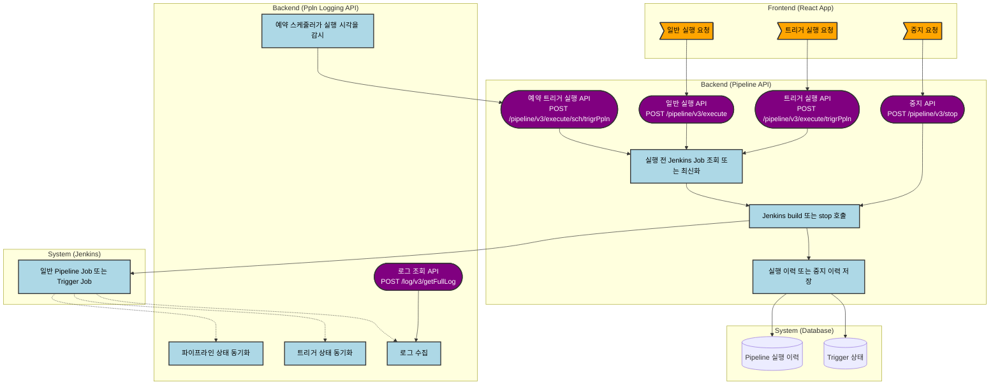

# 실행 관련 전체 로직
---
> 이 문서는 `pipeline-api`와 `ppln-logging-api`를 함께 기준으로 일반 실행, 트리거 실행, 중지, 예약 실행, 상태 동기화, 로그 수집까지 실행 계층 전체를 정리한 문서다.

## 1. 개요
실행 관련 로직은 한 서비스에 몰려 있지 않다. 즉시 실행과 Jenkins 직접 호출은 `pipeline-api`가 담당한다. 실행 이후 상태 동기화, 로그 수집, 예약 실행 스케줄링은 `ppln-logging-api`가 담당한다.

따라서 전체 구조는 "실행 요청 -> Jenkins 호출 -> 실행 이력 저장 -> 후속 동기화"의 4단계로 보는 것이 가장 정확하다.

## 2. 실행 계층 전체 흐름도

## 3. 일반 파이프라인 실행
일반 실행은 `/pipeline/v3/execute`에서 시작한다. 서비스 계층은 실행 대상 Job을 조회하고 다음 빌드 번호를 계산한 뒤 Jenkins 실행을 요청한다. 성공하면 실행 이력을 `EXCN`으로 저장한다.

일반 실행에서도 Jenkins build 전에 `updatePipeline()`이 먼저 호출된다. 따라서 "일반 실행" 역시 실행 시점 동기화 성격이 있다.

| 단계 | 코드 위치 | 의미 |
| :--- | :--- | :--- |
| 실행 API | `pipeline-api/.../PipelineV3Controller.java:121-127` | 일반 실행 요청을 받는다. |
| 실행 서비스 | `pipeline-api/.../PipelineService.java:252-266` | 실행 후 실행 이력을 만든다. |
| 실행 처리 | `pipeline-api/.../PipelineProcessorImpl.java:167-181` | Job 조회, 빌드 번호 계산, Jenkins 실행을 처리한다. |
| Jenkins build | `pipeline-api/.../JenkinsService.java:194-249` | `updatePipeline()` 후 `build` 또는 `buildWithParameters`를 호출한다. |

## 4. 트리거 실행
트리거 실행은 `/pipeline/v3/execute/trigrPpln`에서 시작한다. 테스트 실행은 `/pipeline/v3/execute/test/trigrPpln`이지만 내부 본체는 같다.

이 경로는 트리거 상태 검증, 중복 실행 확인, 하위 파이프라인 정보 반영, Jenkins Trigger Job upsert, Jenkins build 호출, 실행 결과 저장 순서로 진행된다.

| 단계 | 코드 위치 | 의미 |
| :--- | :--- | :--- |
| 실행 API | `pipeline-api/.../TriggerV3Controller.java:75-89` | 일반 트리거 실행과 테스트 실행 진입점이다. |
| 실행 본체 | `pipeline-api/.../TriggerService.java:157-239` | 상태 검증, Jenkins 실행, 결과 저장을 처리한다. |
| Jenkins 트리거 실행 | `pipeline-api/.../JenkinsService.java:252-306` | Trigger Job upsert 후 Jenkins build를 호출한다. |

## 5. 실행 중지
중지는 `/pipeline/v3/stop`에서 시작한다. 서비스 계층은 현재 실행 중인 빌드 번호를 찾고 Jenkins stop API를 호출한다. 성공하면 실행 이력을 `REJECT` 상태로 갱신한다.

Jenkins 유틸은 queue 여부와 `inProgress` 여부를 확인한다. 실행 중이 아니면 즉시 중지하지 않는다.

| 단계 | 코드 위치 | 의미 |
| :--- | :--- | :--- |
| 중지 API | `pipeline-api/.../PipelineV3Controller.java:133-140` | 중지 요청을 받는다. |
| 중지 서비스 | `pipeline-api/.../PipelineService.java:273-286` | 중지 후 실행 이력을 갱신한다. |
| 중지 처리 | `pipeline-api/.../PipelineProcessorImpl.java:203-219` | 빌드 번호 조회 후 Jenkins 중지를 호출한다. |
| Jenkins stop | `pipeline-api/.../JenkinsService.java:322-379` | queue와 inProgress를 확인한 뒤 stop 한다. |

## 6. 예약 실행
예약 실행은 `pipeline-api`가 직접 수행하지 않는다. `ppln-logging-api`의 예약 스케줄러가 시간 지난 미실행 예약을 찾아 `pipeline-api`의 숨김 API `/pipeline/v3/execute/sch/trigrPpln`을 호출한다.

호출 성공 시 예약 실행 여부를 갱신한다. 반복 실패 시 예약을 실패 처리하고, 관련 트리거와 하위 파이프라인 상태를 `SKIP`으로 정리한다.

| 단계 | 코드 위치 | 의미 |
| :--- | :--- | :--- |
| 스케줄러 전용 실행 API | `pipeline-api/.../TriggerV3Controller.java:92-99` | 예약 스케줄러가 호출하는 숨김 API다. |
| 예약 생성·수정·승인·반려 | `pipeline-api/.../TriggerService.java:254-340` | 예약 데이터 관리 책임이다. |
| 예약 스케줄러 | `ppln-logging-api/.../ReservationTaskScheduler.java:35-89` | 10초마다 예약 작업을 수행한다. |
| 예약 UseCase | `ppln-logging-api/.../ReservationService.java:22-41` | 실행할 예약을 조회해 처리한다. |
| 실제 예약 실행 | `ppln-logging-api/.../ReservationWriterImpl.java:42-126` | 실행 API 재시도 호출과 후처리를 담당한다. |

## 7. 상태 동기화와 로그 수집
실행이 시작된 뒤 최종 상태 확정은 `ppln-logging-api` 스케줄러 계층에서 이뤄진다. 이 스케줄러는 `LOG_COLLECTION`, `PIPELINE_SYNC`, `TRIGGER_SYNC`를 10초 간격으로 돌린다.

`PIPELINE_SYNC`는 Jenkins 상태를 읽어 실행 상태 테이블을 갱신한다. `TRIGGER_SYNC`는 실행 중 트리거와 자식 파이프라인의 상태를 따라가고 종료 시 티켓 이벤트를 마무리한다. `LOG_COLLECTION`은 로그를 수집하고, `/log/v3/getFullLog`는 저장된 로그를 읽어 반환한다.

| 단계 | 코드 위치 | 의미 |
| :--- | :--- | :--- |
| 통합 스케줄러 | `ppln-logging-api/.../PipelineTaskScheduler.java:40-118` | 로그, 파이프라인, 트리거 동기화를 수행한다. |
| 파이프라인 동기화 UseCase | `ppln-logging-api/.../PipelineService.java:24-53` | 실행 중 파이프라인을 조회해 동기화한다. |
| 파이프라인 상태 반영 | `ppln-logging-api/.../PipelineWriterImpl.java:54-145` | Jenkins 상태를 읽어 DB를 갱신한다. |
| 트리거 동기화 UseCase | `ppln-logging-api/.../TriggerService.java:24-49` | 실행 중 트리거를 조회해 동기화한다. |
| 로그 수집 UseCase | `ppln-logging-api/.../LogService.java:23-50` | 수집 대상 로그를 저장한다. |
| 전체 로그 조회 API | `ppln-logging-api/.../PipelineController.java:22-25` | 저장된 전체 로그를 반환한다. |

## 8. 관련 비교 문서 안내
일반 파이프라인과 트리거 파이프라인의 차이, Jenkins 스크립트 예시, `ftl` 템플릿 설명은 별도 문서로 분리했다. 실행 전반 흐름만 보고 싶다면 이 문서만 읽으면 되고, 구조 차이와 템플릿 생성 방식까지 보려면 `05_일반_트리거_파이프라인_차이와_FTL_설명.md`를 함께 보면 된다.

## 9. 해석
실행 관련 구조는 "실행 요청과 Jenkins 호출"을 `pipeline-api`, "후속 상태 확정과 로그 수집"을 `ppln-logging-api`로 나눈 구조다.

운영 관점에서는 다음처럼 보면 된다:

- 즉시 실행과 중지는 `pipeline-api`
- 실행 직전 Job 동기화도 `pipeline-api`
- 예약 시각 감시와 예약 호출은 `ppln-logging-api`
- 실행 후 상태 확정과 로그 수집도 `ppln-logging-api`

## 10. 변경 이력
| 날짜 | 작성자 | 내용 | 비고 |
| :--- | :--- | :--- | :--- |
| 2026-04-12 | Codex | 실행 관련 전체 로직 문서 분리 작성 | - |
