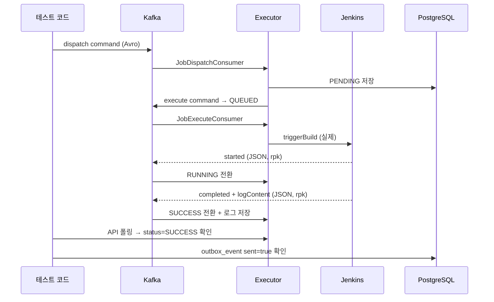
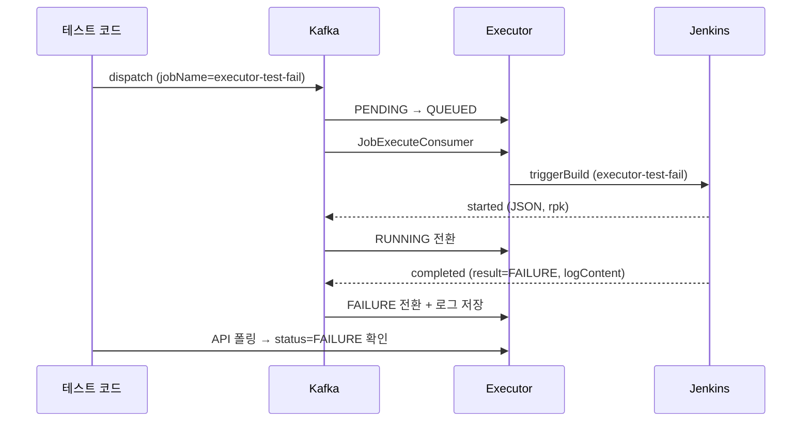
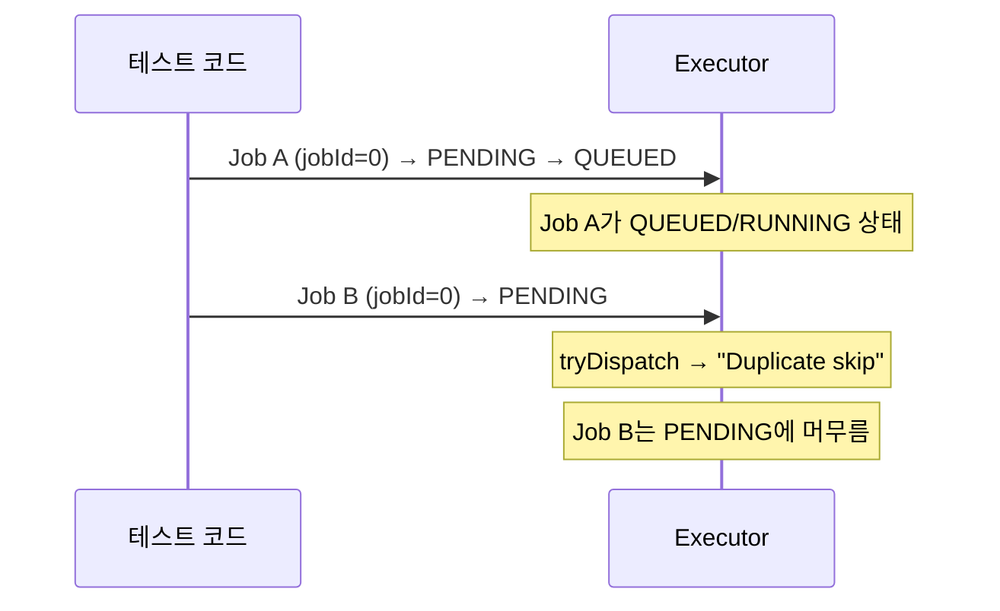
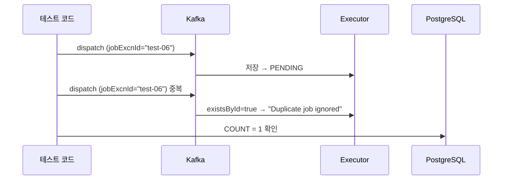
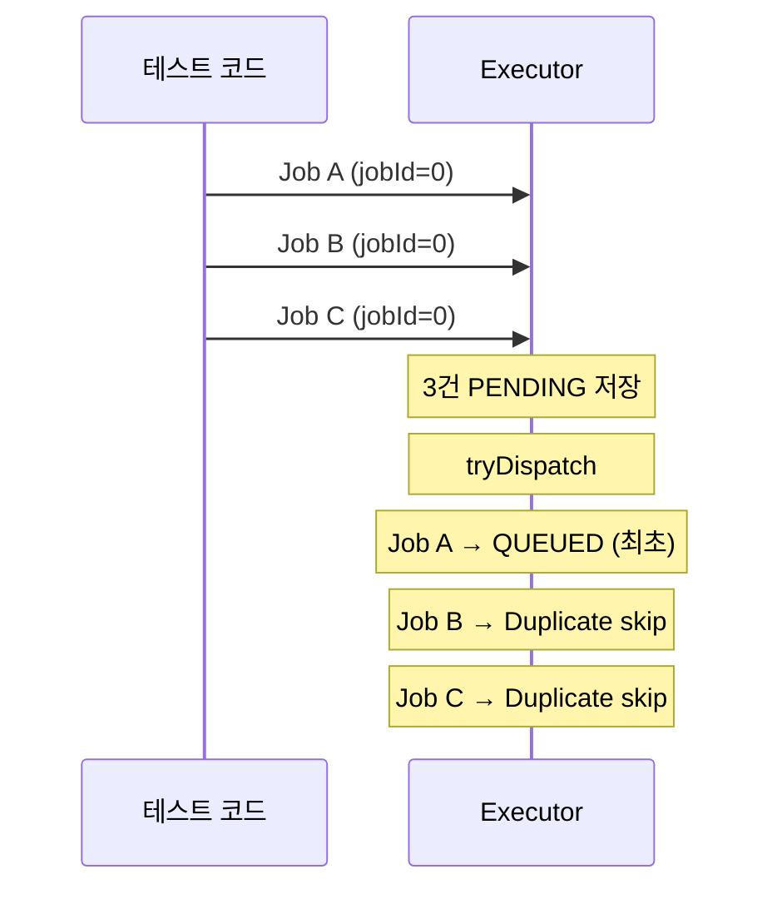
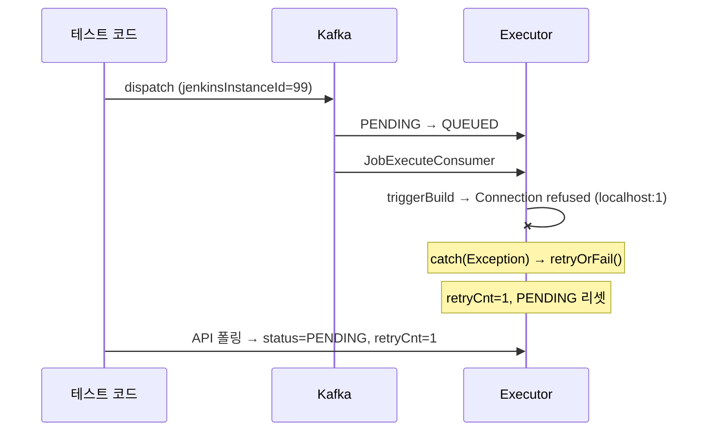
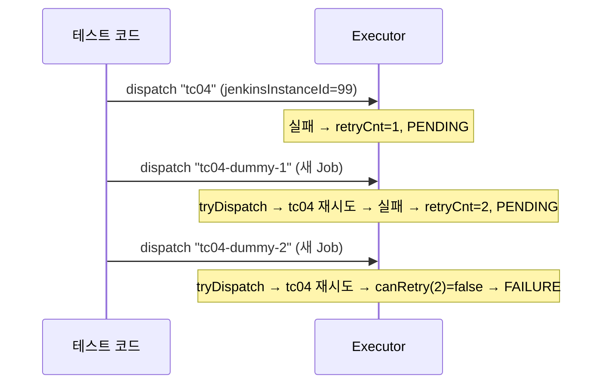

# Executor 실제 인프라 E2E 통합 테스트

>  Executor PoC의 실제 동작 흐름을 이해하기 위해, Mock이 아닌 **실제 GCP 인프라(Jenkins, Redpanda, PostgreSQL)**에 연결하는 JUnit 통합 테스트를 작성한다. 테스트를 실행하면 실제 Kafka 메시지가 흐르고, 실제 Jenkins 빌드가 돌아가는 것을 코드로 확인할 수 있다.

---

## 접근 방식

`@SpringBootTest`로 Executor 앱을 GCP 프로필로 기동하고, 테스트 코드가 **Operator 역할**을 수행한다:

```
테스트 코드 (Operator 역할)
  ↓ Avro dispatch 메시지 발행 (Kafka)
Executor (실제 Spring 앱)
  ↓ Jenkins 빌드 트리거 (실제 API)
Jenkins (GCP K8s)
  ↓ webhook 콜백 (rpk → Kafka)
Executor
  ↓ 상태 전이 + 로그 저장
테스트 코드: DB/API 폴링으로 검증
```

---

## 인프라 요구사항

| 서비스 | 주소 | 필수 |
|--------|------|------|
| PostgreSQL | 34.47.83.38:30275 | ✅ |
| Redpanda (Kafka) | 34.47.83.38:31092 | ✅ |
| Schema Registry | 34.47.83.38:31081 | ✅ |
| Jenkins | 34.47.74.0:31080 | ✅ (TC-01, TC-02) |
| `/etc/hosts` | `34.47.83.38 redpanda-0` | ✅ (Kafka advertised listener) |

테스트 실행 전 GCP 서버가 켜져 있어야 한다.

---

## 테스트 구조

```
executor/src/test/java/com/study/playground/executor/integration/
├── ExecutorIntegrationTestBase.java     # 공통 설정 + 유틸리티
├── TC01_HappyPathTest.java              # 정상 실행
├── TC02_BuildFailureTest.java           # Jenkins 빌드 실패
├── TC05_DuplicatePreventionTest.java    # 중복 실행 방지
├── TC06_IdempotencyTest.java            # 멱등성 (같은 메시지 재발행)
└── TC07_MultiTriggerTest.java           # 다중 동시 트리거

executor/src/test/resources/
└── application-integration.yml          # 통합 테스트 프로필
```

---

## ExecutorIntegrationTestBase (공통 베이스 클래스)

```java
@SpringBootTest(webEnvironment = SpringBootTest.WebEnvironment.RANDOM_PORT)
@ActiveProfiles("integration")
@TestInstance(TestInstance.Lifecycle.PER_CLASS)
```

### 유틸리티 메서드

| 메서드 | 역할 |
|--------|------|
| `cleanDb()` | execution_job + outbox_event 테이블 truncate |
| `publishDispatchCommand(jobExcnId, jobName, jenkinsInstanceId)` | Avro 메시지를 dispatch 토픽에 직접 발행 |
| `waitForStatus(jobExcnId, expectedStatus, timeoutSec)` | Executor API 폴링으로 상태 대기 |
| `getExecutorJob(jobExcnId)` | Executor REST API 호출 |
| `publishStartedCallback(jobExcnId, buildNumber)` | started 토픽에 JSON 발행 (Jenkins 콜백 시뮬레이션) |
| `publishCompletedCallback(jobExcnId, buildNumber, result, logContent)` | completed 토픽에 JSON 발행 |
| `assertLogFileExists(jobName, jobExcnId)` | 로그 파일 존재 확인 |

### Kafka 메시지 발행 방식

- **Avro dispatch 메시지**: `AvroSerializer` + Schema Registry로 직접 발행
- **JSON callback 메시지**: `StringSerializer`로 직접 발행 (Jenkins rpk 시뮬레이션)

---

## 테스트 시나리오

### TC-01. Happy Path (실제 Jenkins 빌드)

실제 Jenkins에서 executor-test Job이 돌아가는 전체 흐름.



**단계:**
1. `cleanDb()`
2. `publishDispatchCommand("test-01", "executor-test", 1)` — Kafka로 dispatch
3. `waitForStatus("test-01", "SUCCESS", 120)` — Jenkins 빌드 완료까지 대기
4. Assert:
   - Executor API: status=SUCCESS, buildNo != null, logFileYn="Y"
   - 로그 파일 존재: `/tmp/executor-test-logs/executor-test/test-01_0`
   - DB outbox_event: sent=true

**주의**: Jenkins K8s agent pod 생성 + 빌드에 ~60초 소요. timeout을 120초로 설정.

---

### TC-02. Build Failure (실제 Jenkins — executor-test-fail Job)

Jenkins에 항상 실패하는 `executor-test-fail` Job을 사전에 생성해두고, 실제 FAILURE 흐름을 검증한다.

**사전 준비**: Jenkins에 `executor-test-fail` Job 생성 (1회성)
```groovy
pipeline {
    agent any
    stages {
        stage('Test') {
            steps {
                error('Intentional failure for TC-02')
            }
        }
    }
}
```



**단계:**
1. `cleanDb()`
2. `publishDispatchCommand("test-02", "executor-test-fail", 1)`
3. `waitForStatus("test-02", "FAILURE", 120)` — Jenkins 빌드 완료까지 대기
4. Assert:
   - Executor API: status=FAILURE, logFileYn="Y"
   - 로그 파일에 "Intentional failure" 포함

---

### TC-05. Duplicate Prevention

같은 jobId의 Job이 이미 QUEUED/RUNNING일 때 새 Job이 PENDING에 머무는지 확인.



**단계:**
1. `cleanDb()`
2. `publishDispatchCommand("test-05a", "executor-test", 1)`
3. 5초 대기 (QUEUED/RUNNING 도달)
4. `publishDispatchCommand("test-05b", "executor-test", 1)`
5. 5초 대기
6. Assert: test-05a는 QUEUED 이상, test-05b는 PENDING

---

### TC-06. Idempotency

같은 jobExcnId로 dispatch 메시지를 2번 발행해도 1건만 저장되는지 확인.



**단계:**
1. `cleanDb()`
2. `publishDispatchCommand("test-06", "executor-test", 1)`
3. 5초 대기
4. `publishDispatchCommand("test-06", "executor-test", 1)` — 같은 ID
5. 3초 대기
6. Assert: DB에 test-06 1건만 존재

---

### TC-07. Multi Trigger

3건을 동시에 발행하면 1건만 QUEUED, 나머지는 PENDING 대기.



**단계:**
1. `cleanDb()`
2. 3건 동시 발행 (`CompletableFuture.allOf`)
3. 20초 대기
4. Assert: 3건 모두 수신, 1건만 QUEUED/RUNNING, 나머지 PENDING

---

### TC-03. Jenkins 트리거 실패 → 재시도

Jenkins를 실제로 내리지 않고, **접속 불가능한 가짜 Jenkins 인스턴스**(id=99)를 DB에 등록하여 트리거 실패를 유발한다.

**사전 준비**: `public.support_tool`에 가짜 Jenkins INSERT (테스트 코드에서 자동)
```sql
INSERT INTO public.support_tool (id, name, url, username, credential, active, auth_type, category, implementation, max_executors)
VALUES (99, 'Fake Jenkins', 'http://localhost:1', 'admin', 'admin', true, 'BASIC', 'CI_CD_TOOL', 'JENKINS', 2);
```



**단계:**
1. `cleanDb()` + 가짜 Jenkins INSERT
2. `publishDispatchCommand("test-03", "executor-test", 99)` — jenkinsInstanceId=99
3. 10초 대기
4. Assert: status=PENDING, retryCnt >= 1

---

### TC-04. 재시도 한도 초과 (max 2회 → FAILURE)

TC-03과 동일한 가짜 Jenkins를 사용하되, **dummy dispatch를 추가 발행하여 tryDispatch()를 유발**한다.
`ReceiveJobService.receive()` 마지막에 `tryDispatch()`를 호출하므로, 새 Job 도착 시 PENDING 상태인 기존 Job도 함께 재디스패치된다.



**단계:**
1. `cleanDb()` + 가짜 Jenkins INSERT
2. `publishDispatchCommand("test-04", "executor-test", 99)` → 실패 → retryCnt=1
3. 10초 대기
4. `publishDispatchCommand("test-04-d1", "executor-test", 99)` → tryDispatch → 재실패 → retryCnt=2
5. 10초 대기
6. `publishDispatchCommand("test-04-d2", "executor-test", 99)` → tryDispatch → canRetry=false → FAILURE
7. 10초 대기
8. Assert: "test-04" status=FAILURE, retryCnt=2

---

## 에러 처리 현황 (개선 포인트)

현재 Executor의 에러 처리는 **모든 예외를 동일하게** `catch (Exception e)` → `retryOrFail()`로 처리한다.
Connection refused, 404, 403, 500 등 에러 유형에 관계없이 동일한 재시도 로직을 탄다.

### 관련 코드 위치

| 파일 | 위치 | 에러 처리 방식 |
|------|------|---------------|
| `JobExecuteService.java` | `:53-61` | `catch(Exception)` → `retryOrFail()` — 트리거 실패 시 재시도/FAILURE |
| `DispatchEvaluatorService.java` | `:56` | `catch(Exception)` → 로그만, 다음 Job 계속 |
| `JenkinsClient.java` | `:50, :103, :132, :144, :154, :164` | 각 Jenkins API 호출별 `catch(Exception)` — RuntimeException 래핑 또는 기본값 반환 |
| `DispatchService.java` | `:52` | `retryOrFail(job, maxRetries)` — canRetry 판단 후 PENDING 리셋 또는 FAILURE |

### 향후 개선 방향

재시도 가치가 있는 에러와 없는 에러를 구분하면 불필요한 재시도를 줄일 수 있다.

| 에러 유형 | 예시 | 권장 처리 |
|-----------|------|----------|
| 일시적 네트워크 에러 | Connection refused, Timeout, 503 | 재시도 (현재와 동일) |
| 영구적 설정 에러 | 404 Job not found, 401 인증 실패 | 즉시 FAILURE (재시도 무의미) |
| Jenkins 내부 에러 | 500 Internal Server Error | 1회 재시도 후 FAILURE |

이 개선은 PoC 이후 단계에서 진행한다.

---

## application-integration.yml

```yaml
spring:
  datasource:
    url: jdbc:postgresql://34.47.83.38:30275/playground?currentSchema=executor
    username: playground
    password: playground
  kafka:
    bootstrap-servers: 34.47.83.38:31092
    properties:
      schema.registry.url: http://34.47.83.38:31081
  jpa:
    hibernate:
      ddl-auto: validate
  flyway:
    enabled: true
    clean-on-validation-error: true
    schemas: executor

executor:
  job-max-retries: 2
  max-batch-size: 5
  job-timeout-minutes: 1
  log-path: /tmp/executor-test-logs

logging:
  level:
    com.study.playground.executor: DEBUG
```

---

## 실행 방법

```bash
# 통합 테스트만 실행
JAVA_HOME=$(/usr/libexec/java_home -v 21) ./gradlew :executor:test --tests "*.integration.*"

# 특정 TC만
./gradlew :executor:test --tests "*.TC01_HappyPathTest"

# 전체 (단위 + 통합)
./gradlew :executor:test
```

---

## 향후 구현 순서

| 단계 | 작업 | Jenkins |
|------|------|---------|
| 1 | `application-integration.yml` 생성 | - |
| 2 | `ExecutorIntegrationTestBase.java` — 공통 설정 + 유틸리티 | - |
| 3 | `TC01_HappyPathTest.java` — 실제 Jenkins E2E | executor-test |
| 4 | `TC02_BuildFailureTest.java` — 실제 Jenkins 실패 | executor-test-fail (신규) |
| 5 | `TC03_TriggerRetryTest.java` — 가짜 Jenkins 트리거 실패 | Fake (id=99) |
| 6 | `TC04_RetryExceededTest.java` — 재시도 한도 초과 | Fake (id=99) |
| 7 | `TC05_DuplicatePreventionTest.java` | executor-test |
| 8 | `TC06_IdempotencyTest.java` | executor-test |
| 9 | `TC07_MultiTriggerTest.java` | executor-test |

**사전 준비 (1회성)**: Jenkins에 `executor-test-fail` Job 생성.

---

## 주의사항

- GCP 서버가 켜져 있어야 테스트 가능
- TC-01은 실제 Jenkins 빌드를 트리거하므로 ~60초 소요
- 테스트 간 DB 정리 필수 (`@BeforeEach`에서 `cleanDb()`)
- `/etc/hosts`에 `34.47.83.38 redpanda-0` 필수
- 로그 파일 경로: `/tmp/executor-test-logs/` (본 앱과 분리)
- 실제 구현 시 로직 세부사항은 변경될 수 있음
