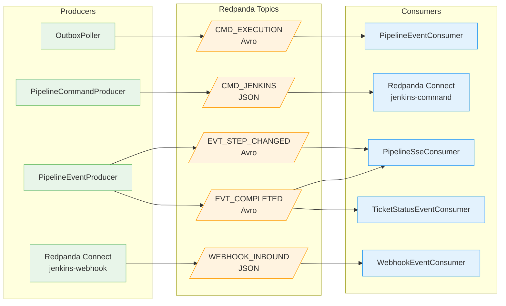
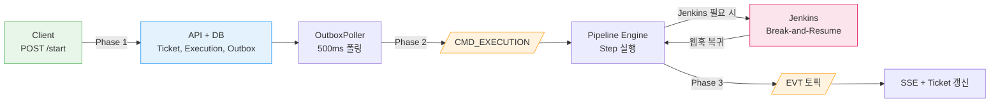
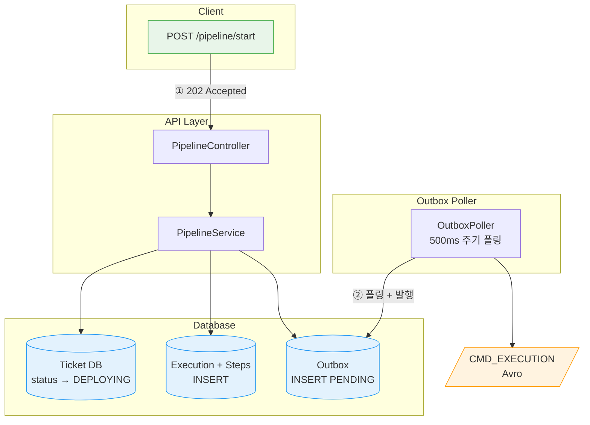
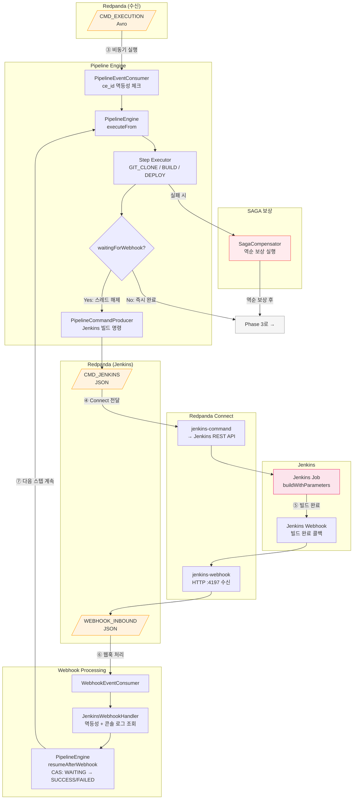
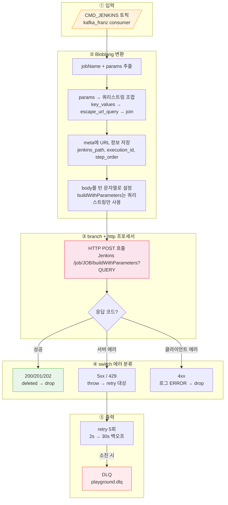
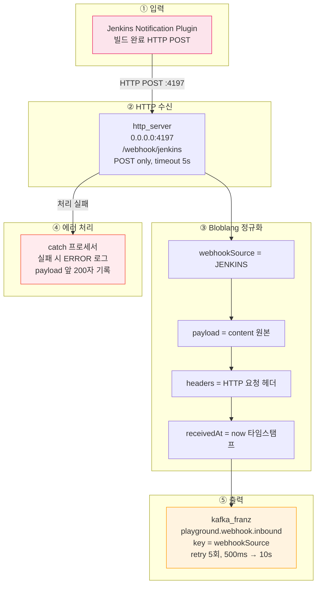
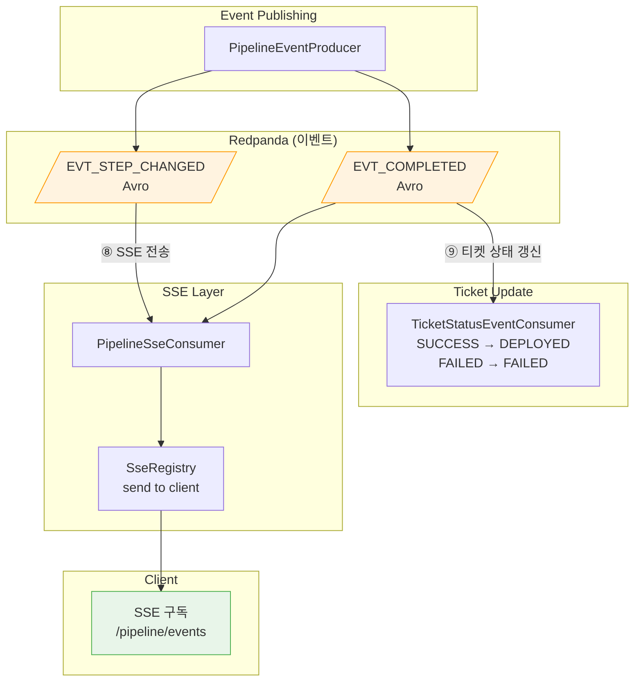

# 파이프라인 흐름도

---

> 파이프라인에서 사용하는 Redpanda 토픽과 Redpanda Connect 커넥터의 입출력을 정리한다. 각 토픽이 어디서 생산되고 어디서 소비되는지, 어떤 데이터가 흐르는지 한눈에 파악하기 위한 문서다.



| 토픽             | 정식 이름                                 | 직렬화 | Producer                | Consumer                                       | 파티션 키   |
| ---------------- | ----------------------------------------- | ------ | ----------------------- | ---------------------------------------------- | ----------- |
| CMD_EXECUTION    | `playground.pipeline.commands.execution`  | Avro   | OutboxPoller            | PipelineEventConsumer                          | executionId |
| CMD_JENKINS      | `playground.pipeline.commands.jenkins`    | JSON   | PipelineCommandProducer | Redpanda Connect                               | executionId |
| EVT_STEP_CHANGED | `playground.pipeline.events.step-changed` | Avro   | PipelineEventProducer   | PipelineSseConsumer                            | executionId |
| EVT_COMPLETED    | `playground.pipeline.events.completed`    | Avro   | PipelineEventProducer   | PipelineSseConsumer, TicketStatusEventConsumer | executionId |
| WEBHOOK_INBOUND  | `playground.webhook.inbound`              | JSON   | Redpanda Connect        |                                                |             |


# Pipelien Start 흐름

---

파이프라인 시작 요청부터 Jenkins 빌드 완료, SSE 실시간 알림까지의 전체 흐름이다. Break-and-Resume 패턴으로 Jenkins 웹훅 대기 중 스레드를 해제하고, 웹훅 수신 시 이어서 실행한다.



## Phase 1: 요청 접수 - Outbox 발행



### CMD_EXECUTION — 파이프라인 실행 시작 명령

파이프라인 시작 API 호출 시 Outbox 테이블에 적재되고, OutboxPoller가 500ms 주기로 폴링하여 이 토픽으로 발행한다.

**Avro 스키마: `PipelineExecutionStartedEvent`**

| 필드        | 타입          | 설명                 |
| ----------- | ------------- | -------------------- |
| executionId | string        | 파이프라인 실행 UUID |
| ticketId    | long          | 대상 티켓 ID         |
| steps       | array<string> | 스텝 이름 목록       |

**Consumer 동작 (PipelineEventConsumer)**

- Consumer Group: `pipeline-engine`
- 멱등성: CloudEvents `ce_id` 헤더(= outbox PK)로 중복 체크
- 실행: 4-thread 전용 풀(`pipeline-exec-*`)에서 비동기로 PipelineEngine.execute() 호출
- 재시도: @RetryableTopic (4회, 1s→2s→4s→8s 지수 백오프)


## Phase 2: 엔진 실행 ~ Jenkins Break and Resume



### CMD_JENKINS — Jenkins 빌드 명령

PipelineEngine이 GIT_CLONE, BUILD, DEPLOY 스텝을 만나면 PipelineCommandProducer를 통해 이 토픽에 Jenkins 빌드 명령을 발행한다. Redpanda Connect가 소비하여 Jenkins REST API를 호출한다.

**Avro 스키마: `JenkinsBuildCommand`** (JSON 직렬화)

| 필드        | 타입                | 설명                 |
| ----------- | ------------------- | -------------------- |
| executionId | string              | 파이프라인 실행 UUID |
| ticketId    | long                | 대상 티켓 ID         |
| stepOrder   | int                 | 스텝 순서 (1-based)  |
| jobName     | string              | Jenkins 잡 이름      |
| params      | map<string, string> | 빌드 파라미터        |

**입력 예시**

```json
{
  "executionId": "550e8400-e29b-41d4-a716-446655440000",
  "ticketId": 42,
  "stepOrder": 1,
  "jobName": "clone-and-build",
  "params": {"REPO_URL": "https://github.com/test/repo", "BRANCH": "main"}
}
```

### Jenkins Command 커넥터 (Redpanda → Jenkins API)

Redpanda 토픽의 빌드 명령을 Jenkins REST API 호출로 변환한다. Spring Boot가 아닌 Connect로 구현하는 이유는 단순 HTTP 변환이기 때문이다. KafkaListener + WebClient + 재시도 코드 대신 YAML 설정만으로 동일한 결과를 얻고, 애플리케이션 재배포 없이 수정할 수 있다.

**파일**: `docker/connect/jenkins-command.yaml`



#### 데이터 재가공 과정

Bloblang mapping 프로세서가 JSON 메시지를 Jenkins REST API URL로 변환한다. `params` 맵의 각 key-value를 URL 쿼리스트링으로 조합하고, 본문은 비운다(Jenkins buildWithParameters는 쿼리스트링으로 파라미터를 받기 때문).

```json
{
  "executionId": "550e8400-e29b-41d4-a716-446655440000",
  "ticketId": 42,
  "stepOrder": 1,
  "jobName": "clone-and-build",
  "params": {
    "REPO_URL": "https://github.com/test/repo",
    "BRANCH": "main"
  }
}
```

변환 핵심: `params` 맵을 `key_values().escape_url_query().join("&")`로 쿼리스트링으로 조합하고, `meta jenkins_path`에 저장한다. `root`는 빈 문자열로 설정하여 본문을 비운다.

```json
{
  "_meta": {
    "jenkins_url": "http://34.47.83.38:29080",
    "jenkins_path": "/job/clone-and-build/buildWithParameters?REPO_URL=https%3A%2F%2Fgithub.com%2Ftest%2Frepo&BRANCH=main",
    "execution_id": "550e8400-e29b-41d4-a716-446655440000",
    "step_order": "1"
  },
  "_http_request": {
    "method": "POST",
    "url": "${jenkins_url}/job/clone-and-build/buildWithParameters?REPO_URL=https%3A%2F%2Fgithub.com%2Ftest%2Frepo&BRANCH=main",
    "auth": "Basic (admin / JENKINS_TOKEN)",
    "headers": {
      "Content-Type": "application/x-www-form-urlencoded",
      "X-Execution-Id": "550e8400-e29b-41d4-a716-446655440000",
      "X-Step-Order": "1"
    },
    "body": "",
    "timeout": "15s",
    "success_codes": [200, 201, 202]
  }
}
```

#### 에러 분류 전략

`branch` 프로세서의 `result_map`에서 `errored()` 함수로 HTTP 응답 성공/실패를 판별한다. 실패 시 `error()` 문자열에 상태 코드가 포함되어 있으므로 `switch` 프로세서에서 패턴 매칭으로 분류한다.

| 응답 코드   | 동작                  | 이유                                            |
| ----------- | --------------------- | ----------------------------------------------- |
| 200/201/202 | `deleted()` → drop    | 성공, 더 처리할 내용 없음                       |
| 5xx, 429    | `throw()` → retry 5회 | 서버 일시 장애, 레이트리밋 — 재시도로 복구 가능 |
| 4xx         | 로그 ERROR → drop     | 잘못된 요청 — 재시도 무의미                     |
| retry 소진  | fallback → DLQ        | `playground.dlq`에 원본 보존, 수동 재처리 대상  |

무한 재시도하지 않는 이유는 Jenkins 장기 다운 시 컨슈머 Lag이 무한 증가하고, WebhookTimeoutChecker가 5분 후 파이프라인을 FAILED로 전환하기 때문이다.

### Jenkins Webhook 커넥터 (Jenkins → Redpanda)

Jenkins 빌드 완료 시 Notification Plugin이 보내는 HTTP POST를 Redpanda 토픽에 발행한다. GitLab 웹훅(port 4196)과 별도 파일로 분리했지만 동일 토픽(`playground.webhook.inbound`)으로 발행하며, 다운스트림은 `webhookSource` 필드로 구분한다.




Redpanda Connect의 jenkins-webhook 커넥터가 Jenkins로부터 HTTP POST를 수신하여 이 토픽에 발행한다.

#### 데이터 재가공 과정

Bloblang mapping 프로세서가 Jenkins의 원본 HTTP 요청을 표준 웹훅 스키마로 정규화한다. GitLab 웹훅 커넥터도 동일한 스키마를 사용하므로 다운스트림 `WebhookEventConsumer`는 소스에 무관하게 동일한 구조를 소비할 수 있다.

**Before — Jenkins Notification Plugin HTTP POST**

```json
{
  "_request": "POST /webhook/jenkins HTTP/1.1",
  "_headers": {
    "Host": "connect:4197",
    "Content-Type": "application/json",
    "X-Jenkins-Job": "clone-and-build"
  },
  "executionId": "550e8400-e29b-41d4-a716-446655440000",
  "stepOrder": 1,
  "jobName": "clone-and-build",
  "buildNumber": 57,
  "result": "SUCCESS",
  "duration": 34200,
  "url": "http://34.47.83.38:29080/job/clone-and-build/57/"
}
```

> `_request`와 `_headers`는 HTTP 요청 컨텍스트를 보여주기 위한 표기다. 실제 JSON body는 `executionId`부터 시작한다.

**After — 정규화된 WEBHOOK_INBOUND 메시지**

`content().string()`으로 원본 body를 문자열 그대로 보존하고, `webhookSource`와 `headers`, `receivedAt`을 감싸는 wrapper 구조로 변환한다. 파티션 키는 `"JENKINS"`다.

```json
{
  "webhookSource": "JENKINS",
  "payload": "{\"executionId\":\"550e8400-e29b-41d4-a716-446655440000\",\"stepOrder\":1,\"jobName\":\"clone-and-build\",\"buildNumber\":57,\"result\":\"SUCCESS\",\"duration\":34200,\"url\":\"http://34.47.83.38:29080/job/clone-and-build/57/\"}",
  "headers": {
    "Content-Type": "application/json",
    "X-Jenkins-Job": "clone-and-build"
  },
  "receivedAt": "2026-03-15T12:34:56.789Z"
}
```

- `payload`는 원본 JSON을 **문자열**(`content().string()`)로 저장한다. 파싱하지 않고 문자열로 보존하는 이유는 Connect가 페이로드 구조를 알 필요가 없기 때문이다. 실제 파싱은 다운스트림의 `JenkinsWebhookHandler`가 담당한다.

- 웹훅 유실 시 파이프라인이 `WAITING_WEBHOOK` 상태에서 영구 대기할 수 있으므로, Kafka 발행 실패에 대해 5회 재시도(500ms → 10s 백오프)를 설정했다.

## Phase 3: 이벤트 발행 ~ SSE/티켓 갱신



### EVT_STEP_CHANGED — 스텝 상태 변경 이벤트

PipelineEngine이 스텝 상태를 변경할 때마다 PipelineEventProducer를 통해 발행한다. RUNNING, SUCCESS, FAILED, COMPENSATED, WAITING_WEBHOOK 등 모든 상태 전이를 포함한다.

**Avro 스키마: `PipelineStepChangedEvent`**

| 필드        | 타입    | 설명                            |
| ----------- | ------- | ------------------------------- |
| executionId | string  | 파이프라인 실행 UUID            |
| ticketId    | long    | 대상 티켓 ID                    |
| stepName    | string  | 스텝 이름                       |
| stepType    | string  | 스텝 유형 (GIT_CLONE, BUILD 등) |
| status      | string  | 변경된 상태                     |
| log         | string? | 실행 로그 (nullable)            |

**Consumer 동작 (PipelineSseConsumer)**

- Consumer Group: `pipeline-sse`
- SSE 이벤트 타입: `"status"`
- SseRegistry를 통해 해당 ticketId를 구독 중인 클라이언트에 JSON 전송

------

### EVT_COMPLETED — 파이프라인 실행 완료 이벤트

모든 스텝이 완료되거나 실패 시 PipelineEventProducer가 발행한다. 두 개의 Consumer가 독립적으로 소비한다.

**Avro 스키마: `PipelineExecutionCompletedEvent`**

| 필드         | 타입                  | 설명                              |
| ------------ | --------------------- | --------------------------------- |
| executionId  | string                | 파이프라인 실행 UUID              |
| ticketId     | long                  | 대상 티켓 ID                      |
| status       | PipelineStatus (enum) | PENDING, RUNNING, SUCCESS, FAILED |
| durationMs   | long                  | 총 실행 시간 (ms)                 |
| errorMessage | string?               | 에러 메시지 (nullable)            |

**Consumer 동작**

1. **PipelineSseConsumer** (Group: `pipeline-sse`)
   - SSE 이벤트 타입: `"completed"`
   - 전송 후 `sseRegistry.complete(ticketId)` 호출하여 SSE 스트림 종료
2. **TicketStatusEventConsumer** (Group: `ticket-status-updater`)
   - 멱등성: `ce_id` 헤더로 중복 체크
   - 상태 매핑: SUCCESS → DEPLOYED, FAILED → FAILED
   - TicketMapper.updateStatus()로 DB 갱신