# TPS Redpanda 도입 

---

## 이전 통신 구조

TPS는 모듈 간 통신에 직접 호출(Feign) 방식을 사용하고 있습니다. A 모듈이 B 모듈의 기능이 필요하면 B를 직접 호출하는 방식입니다.

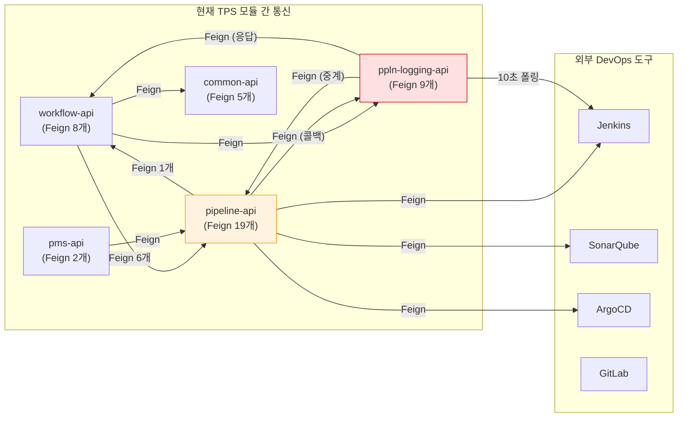

### 모듈 간 강결합

시스템 전체에 Feign 클라이언트가 거미줄처럼 엮여 있습니다.

| 모듈                | Feign 수 | 주요 호출 대상                                               |
| ------------------- | -------- | ------------------------------------------------------------ |
| pipeline-api        | 19       | **Jenkins, ArgoCD, Harbor, SonarQube, ppln-logging, workflow** |
| ppln-logging-api    | 9        | pipeline-api, workflow-api (메시지 중계), Jenkins            |
| workflow-api        | 8        | pipeline-api, ppln-logging-api, pms-api, common-api          |
| common-api, pms-api | 7        | JWT, 모니터링, 인증, pipeline-api                            |

- pipeline-api가 전체 feign의 44%를 차지하는데, 이 모듈이 느려지면 모든 모듈이 느려지게 됩니다.


### ppln-logging api(DB-Queue 구조)

모듈간 통신이 너무 길어지는 경우(ex 저장소 클론)를 해결하기 위해서 3.0.4기준으로 파이프라인 로깅 모듈에서 비동기 처리를 위한 기능을 도입했습니다.

해당 모듈에서는 workflow-api / pipeline-api에 비동기 메세지를 보내야 할 때, 직접 호출하지 않고 ppln-logging-api 모듈을 경유해서 중계하는 구조를 사용하고 있습니다.

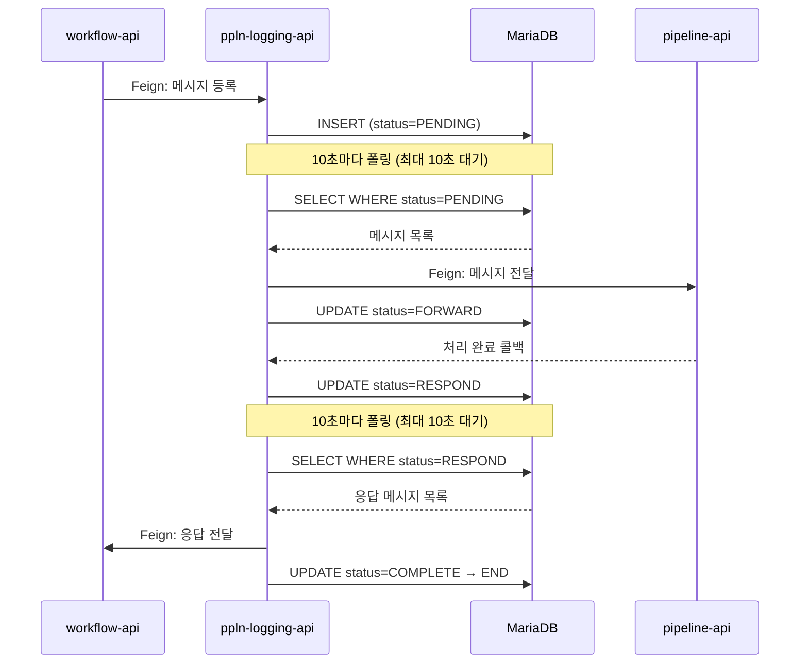


## Redpanda 도입시 아키텍처 변경

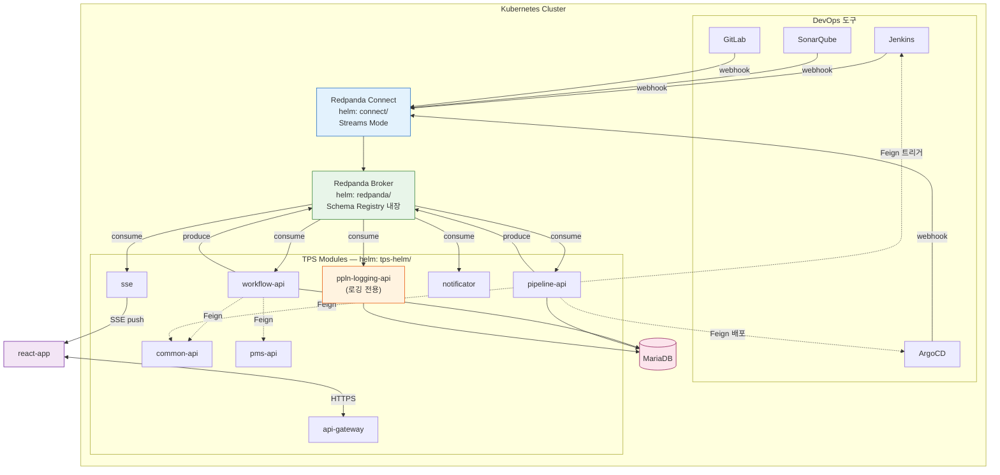


### 구조적 개선

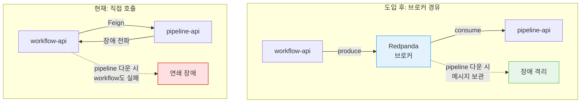

### ppln-logging(DB-Queue) 구조 제거

해당 부분은 개발자 판단에 따라서 진행여부 결정

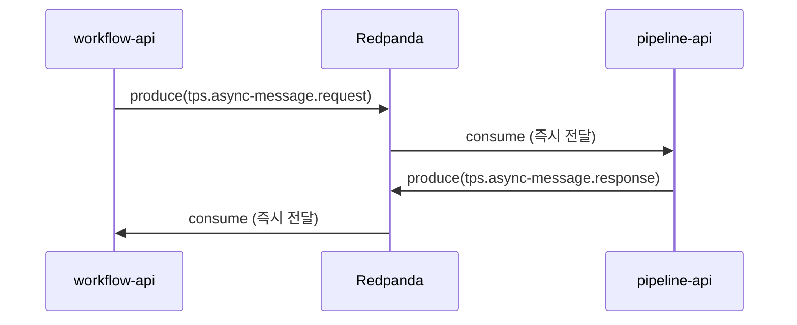

### 외부 미들웨어(DevOps 도구) 연동 개선

**현재 구조**

Jenkins, GitLab, SonarQube, ArgoCD, Harbor 등 외부 도구와 직접 Feign으로 통신하던 구조로 진행되며 결과를 알기위해서 주기적으로 폴링했다.

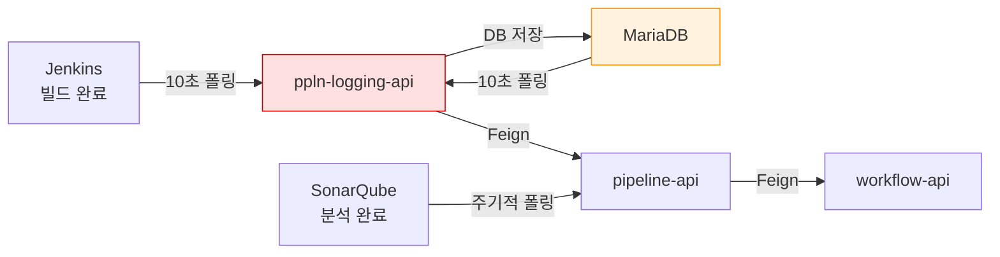

### Redpanda 도입 후

1. 외부 도구가 이벤트 발생 시 webhook으로 전송하는 방식을 사용
2. 외부 도구가 교체되더라도, 출력 스키마를 통일 시켜서 Consumer 측에서 동일한 데이터를 받게한다.
3. DB-Queue 구조를 제거한다.

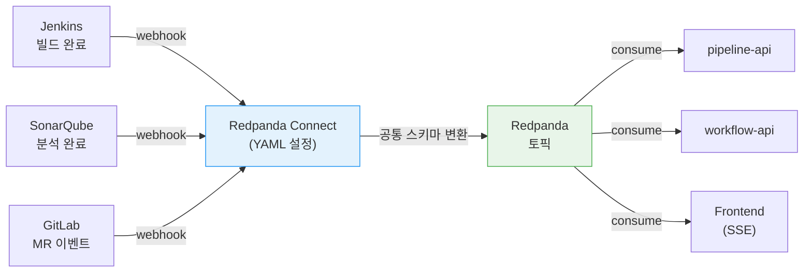

# 개발자 참고사항

---

> 이벤트 브로커를 도입하면 HTTP 직접 호출과는 다른 문제들이 생긴다. DB 저장과 메시지 발행이 원자적이지 않고, Consumer가 같은 메시지를 두 번 받을 수 있으며, 분산 환경에서 롤백이 불가능하다. 아래 6가지 패턴은 이런 문제를 해결하는 업계 표준 접근법이다.

## 이벤트 토픽 흐름

redpanda-playground에서 사용하는 6개 토픽의 데이터 흐름이다. 각 토픽은 역할에 따라 명확히 분리되어 있고, 실패 메시지는 DLQ로 격리된다.

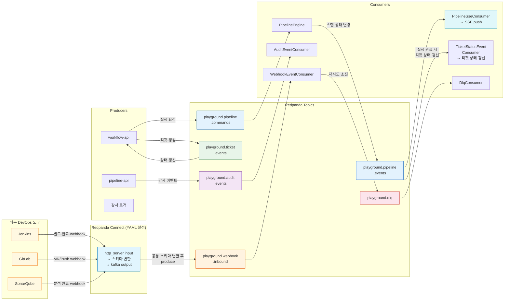

## 1. Transactional Outbox 패턴

### 왜 필요한가

비즈니스 로직에서 DB를 저장한 뒤 Kafka로 메시지를 발행하는 두 단계는 원자적이지 않다. DB 커밋은 성공했는데 Kafka 전송이 실패하면 "DB에는 있지만 다른 서비스는 모르는" 데이터 불일치가 발생한다. 반대로 Kafka를 먼저 보내고 DB를 저장하면, DB 실패 시 이미 발행된 메시지를 회수할 방법이 없다.

이 문제를 Dual Write Problem이라고 부른다. 두 개의 외부 시스템(DB + 메시지 브로커)에 동시에 쓰는 행위는 분산 트랜잭션 없이는 원자성을 보장할 수 없기 때문이다.

### 해결 원리

DB 트랜잭션 안에서 비즈니스 테이블과 함께 `outbox_event` 테이블에 INSERT한다. 별도 폴러가 주기적으로 PENDING 상태의 레코드를 조회해서 Kafka로 발행한 뒤 SENT로 마킹한다. 핵심은 **DB 트랜잭션이 이미 보장하는 원자성을 활용**하는 것이다.

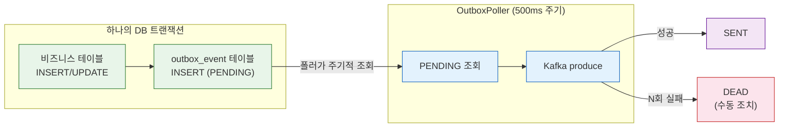

폴러(OutboxPoller)는 짧은 주기(500ms)로 PENDING 이벤트를 조회하여 Kafka로 발행한다. 발행에 성공하면 SENT, 여러 차례 실패하면 DEAD로 마킹하여 수동 조치 대상으로 분리한다.

### 트레이드오프

Outbox 패턴은 "최소 한 번 전달(at-least-once)"을 보장한다. 폴러가 메시지를 발행한 뒤 SENT 마킹 전에 죽으면, 재시작 후 같은 메시지를 다시 보낼 수 있다. 따라서 Consumer 쪽에서 멱등성 처리(3번 참고)가 반드시 함께 적용되어야 한다.

### 라이브러리 활용 가능성

현재 TPS는 MyBatis를 사용하므로 Outbox 테이블과 폴러를 직접 구현해야 한다. 향후 JPA 도입이 가능해지면 **Namastack Outbox for Spring Boot** 라이브러리를 고려할 수 있다. 이 라이브러리는 `@Transactional` 안에서 Outbox INSERT, 폴링, Kafka 발행, 상태 관리를 자동으로 처리해주므로 보일러플레이트 코드를 줄일 수 있다.

## 2. 보상 트랜잭션 (SAGA)

### 왜 필요한가

파이프라인처럼 여러 단계(GIT_CLONE → BUILD → DEPLOY)를 순차 실행하는 워크플로우에서, 중간 단계가 실패하면 이미 완료된 단계를 되돌려야 한다. 모놀리스에서는 하나의 DB 트랜잭션으로 롤백하면 되지만, 분산 환경에서는 각 단계가 서로 다른 시스템(Git, Jenkins, ArgoCD)에서 실행되므로 DB 트랜잭션으로 묶을 수 없다.

SAGA 패턴은 이 문제를 "각 단계마다 되돌리기 로직(보상 트랜잭션)을 명시적으로 정의"하는 방식으로 해결한다.

### 두 가지 구현 방식

| 방식 | 조율 주체 | 장점 | 단점 |
|------|----------|------|------|
| **Choreography** | 각 서비스가 이벤트를 발행/구독 | 중앙 조율자 없음, 느슨한 결합 | 흐름 추적이 어렵고 복잡도가 서비스 수에 비례 |
| **Orchestration** | 중앙 엔진이 순서를 제어 | 흐름이 한 곳에 집중되어 디버깅 용이 | 엔진이 SPOF가 될 수 있음 |

파이프라인처럼 단계가 명확하고 순서가 고정된 워크플로우에는 Orchestration이 적합하다. 중앙 엔진(PipelineEngine)이 스텝을 순서대로 실행하다가 실패하면, 보상기(SagaCompensator)가 **완료된 스텝을 역순으로 되돌린다**.

### 보상 전략

모든 스텝의 보상이 같은 비용은 아니다. 스텝 성격에 따라 보상 전략이 달라진다.

| 스텝 | 보상 동작 | 이유 |
|------|----------|------|
| GIT_CLONE | no-op | 임시 디렉토리이므로 자동 정리됨 |
| BUILD | Jenkins 빌드 취소 | 진행 중인 빌드 리소스 회수 |
| DEPLOY | ArgoCD 롤백 | 이전 버전으로 되돌림 |
| QUALITY_CHECK | no-op | 분석 결과 조회만 하므로 부작용 없음 |

보상 자체가 실패하면(예: ArgoCD 롤백 실패) 해당 스텝은 `COMPENSATION_FAILED`로 마킹하고, 운영자가 수동으로 개입해야 한다. 이 "보상의 실패"까지 고려하는 것이 실제 구현에서 중요한 부분이다.

## 3. 멱등성 (Idempotency)

### 왜 필요한가

메시지 브로커는 "최소 한 번 전달(at-least-once)"을 보장하는 것이 일반적이다. 네트워크 장애, Consumer 리밸런싱, Outbox 폴러의 재전송 등으로 같은 메시지가 두 번 이상 도착할 수 있다. 중복 처리를 방지하지 않으면 파이프라인이 두 번 실행되거나, 웹훅이 이중으로 처리되는 문제가 생긴다.

### 해결 원리

메시지를 고유하게 식별할 수 있는 키를 만들고, 처리 이력을 기록해서 이미 처리된 메시지는 건너뛴다. 키는 `(correlationId, eventType)` 복합키를 사용한다. correlationId는 메시지의 비즈니스 식별자(예: `jenkins:execution-42:step-3`)이고, eventType은 같은 메시지가 다른 맥락에서 처리될 수 있으므로 구분한다.

```
수신 → 복합키로 이력 조회 → 이미 존재? → 무시(skip)
                           → 없음?     → INSERT(이력 기록) → 비즈니스 로직 실행
```

### 동시성 문제와 해결

두 Consumer 인스턴스가 동일 메시지를 동시에 받으면, 둘 다 "이력 없음"을 확인하고 동시에 처리할 수 있다. 이 경쟁 조건을 애플리케이션 레벨에서 막으려면 분산 락이 필요하지만, DB의 UNIQUE 제약조건과 `INSERT ... ON CONFLICT DO NOTHING` 구문을 활용하면 DB 레벨에서 자연스럽게 차단할 수 있다. 먼저 INSERT에 성공한 쪽만 처리를 진행하고, 나머지는 조용히 무시된다. 이를 preemptive acquire 패턴이라 부른다.

## 4. 프론트엔드 실시간 응답 패턴

### 왜 필요한가

파이프라인 실행은 Git 클론, 빌드, 배포를 거치며 수 분이 걸린다. 일반적인 HTTP 요청-응답 모델로는 이 시간 동안 연결을 유지할 수 없고, 사용자는 "지금 어디까지 진행됐는지" 알 수 없다. 주기적 폴링은 불필요한 요청을 반복하고, 실시간성도 떨어진다.

### 비동기 응답의 세 가지 선택지

| 방식 | 원리 | 적합한 경우 | 한계 |
|------|------|-----------|------|
| **Polling** | 클라이언트가 주기적으로 GET 요청 | 구현이 단순하고 상태 변경이 드문 경우 | 불필요한 요청 반복, 실시간성 낮음 |
| **SSE** | 서버가 단방향으로 이벤트를 push | 서버→클라이언트 단방향 스트림 | 양방향 통신 불가, 연결당 스레드 점유 |

파이프라인 진행 상태 전달은 "서버가 클라이언트에 일방적으로 알려주는" 구조이므로 SSE가 적합하다. 양방향 통신이 필요 없고, HTTP/1.1 기반이라 별도 프로토콜 업그레이드 없이 기존 인프라에서 동작한다.

### SSE 없이 Polling만 사용하는 경우

SSE를 도입하지 않으면, 클라이언트가 주기적으로 서버에 상태를 물어봐야 한다. 파이프라인 실행 중 매 N초마다 GET 요청을 반복하는 구조다.

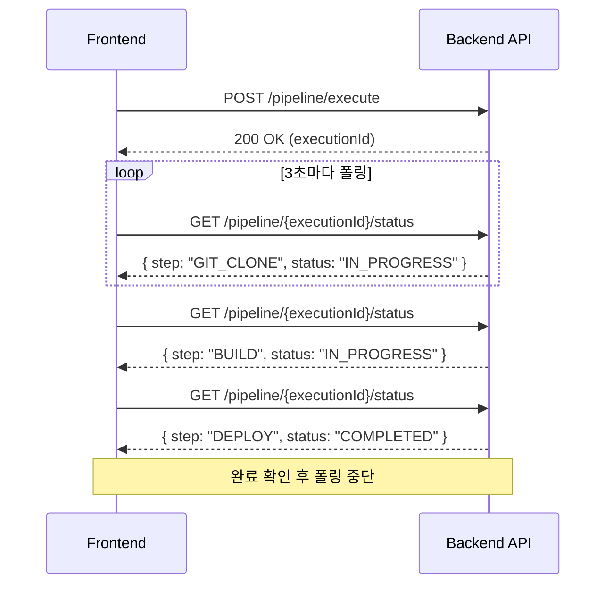

폴링의 문제는 두 가지다. 첫째, 상태가 변하지 않았는데도 요청을 반복하므로 서버 부하가 생긴다. 둘째, 폴링 주기(예: 3초)만큼 실시간성이 떨어진다. 스텝이 1초 만에 끝나도 다음 폴링까지 클라이언트는 모른다.

### 202 Accepted + SSE 조합

이 패턴은 두 단계로 나뉜다.

1. **요청 수신 단계**: 클라이언트가 파이프라인 실행을 요청하면, 서버는 작업을 큐에 넣고 즉시 `202 Accepted`를 반환한다. 202는 "요청을 접수했지만 처리가 완료되지 않았다"는 HTTP 상태 코드다.
2. **진행 상태 수신 단계**: 클라이언트는 별도 SSE 엔드포인트에 연결하여 스텝별 진행 상태를 실시간으로 수신한다. 각 이벤트에는 타입(status, completed)과 데이터(현재 스텝, 결과)가 포함된다.

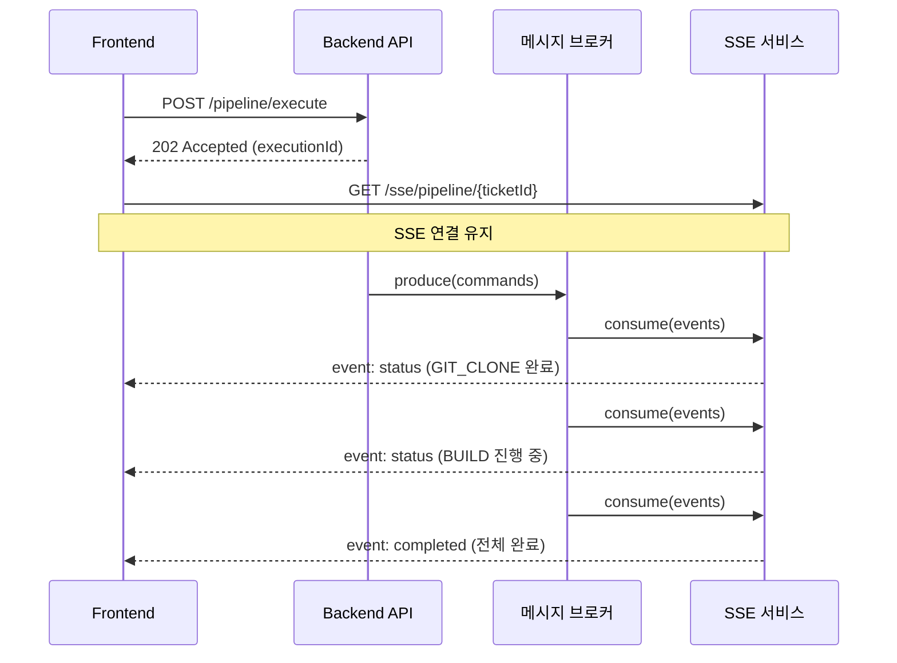

폴링과 달리 서버가 상태 변경 시점에 즉시 push하므로 불필요한 요청이 없고, 지연도 없다.

### 구현 시 고려사항

**연결 관리**: SSE 연결은 장시간 유지되므로 타임아웃을 설정해야 한다. 파이프라인 최대 실행 시간을 고려하여 적절한 값(예: 5~10분)을 설정하고, 타임아웃 시 클라이언트가 자동 재연결하도록 한다. `EventSource` API는 브라우저가 자동으로 재연결을 시도하므로, 서버 쪽에서 마지막 이벤트 ID를 기반으로 이어서 보내는 로직이 필요하다.

**프론트엔드 상태 동기화**: SSE로 받은 이벤트를 기반으로 UI를 갱신할 때, 서버 상태 캐시(TanStack Query 등)를 무효화(invalidate)하여 최신 데이터를 반영한다. SSE 이벤트 자체에 전체 상태를 담기보다, "변경 알림"만 보내고 상세 데이터는 Query로 가져오는 방식이 캐시 일관성을 유지하기 쉽다.

**스케일아웃**: SSE 연결은 특정 서버 인스턴스에 종속된다. 서버가 여러 대일 때 Kafka Consumer가 이벤트를 수신하는 인스턴스와 SSE 연결을 보유한 인스턴스가 다를 수 있다. 이 경우 Redis Pub/Sub 같은 내부 브로드캐스트 계층을 추가하거나, Sticky Session으로 해결한다.

## 5. Springwolf (AsyncAPI 자동 문서화)

### 왜 필요한가

REST API에 Swagger(OpenAPI)가 있듯이, 이벤트 기반 시스템에는 AsyncAPI 명세가 있다. 토픽 이름, 메시지 스키마, Producer/Consumer 관계를 문서화하지 않으면, 개발자들이 "이 토픽에 어떤 형식의 메시지가 오는지" 코드를 뒤져가며 파악해야 한다. 서비스가 늘어날수록 이 비용은 기하급수적으로 증가한다.

### Springwolf가 하는 일

Springwolf는 Spring Boot 애플리케이션에서 `@KafkaListener` 어노테이션을 스캔하여 AsyncAPI 문서를 자동 생성한다. `application.yml`에 기본 설정만 추가하면 별도 문서 작성 없이 토픽, 메시지 스키마, Consumer 목록을 Swagger UI와 유사한 형태로 확인할 수 있다.

```yaml
springwolf:
  enabled: true
  docket:
    info:
      title: Redpanda Playground AsyncAPI
      version: 1.0.0
    servers:
      redpanda:
        protocol: kafka
        host: ${spring.kafka.bootstrap-servers}
    base-package: com.study.playground
```

접근 경로: `/springwolf/asyncapi-ui.html`

### 어노테이션으로 메시지 스키마 명시

Springwolf는 `@KafkaListener`만으로도 토픽과 Consumer를 자동 감지하지만, 메시지의 페이로드 타입과 설명을 명시하려면 `@AsyncListener` / `@AsyncPublisher` 어노테이션을 함께 사용한다.

**Consumer 쪽 (`@AsyncListener`)**:

```java
// 파이프라인 이벤트를 구독하여 SSE로 push하는 Consumer
@AsyncListener(operation = @AsyncOperation(
        channelName = "tps.pipeline.events",
        description = "파이프라인 스텝 상태 변경 이벤트를 수신하여 SSE로 프론트엔드에 push한다.",
        payloadType = PipelineStepChangedEvent.class    // Avro 스키마가 AsyncAPI에 노출됨
))
@KafkaListener(topics = "tps.pipeline.events", groupId = "pipeline-sse")
public void onPipelineEvent(ConsumerRecord<String, byte[]> record) {
    // ...
}
```

**Producer 쪽 (`@AsyncPublisher`)**:

```java
// 티켓 생성 시 이벤트를 발행하는 Producer
@AsyncPublisher(operation = @AsyncOperation(
        channelName = "tps.ticket.events",
        description = "티켓이 생성되면 이벤트를 발행하여 파이프라인 실행을 트리거한다.",
        payloadType = TicketCreatedEvent.class
))
public void publishTicketCreated(TicketCreatedEvent event) {
    byte[] payload = avroSerializer.serialize(event);
    kafkaTemplate.send(TpsTopics.TICKET_EVENTS, String.valueOf(event.getTicketId()), payload);
}
```

**페이로드 타입이 불특정한 경우** (DLQ처럼 여러 도메인의 메시지가 혼합될 때):

```java
@AsyncListener(operation = @AsyncOperation(
        channelName = "tps.dlq",
        description = "처리 실패한 메시지를 수신하여 에러 로그로 기록한다. "
                + "다양한 도메인의 실패 메시지가 혼합되므로 페이로드 타입이 특정되지 않는다.",
        payloadType = byte[].class       // 범용 바이너리
))
@KafkaListener(topics = "tps.dlq", groupId = "dlq-handler")
public void onDlqMessage(ConsumerRecord<String, byte[]> record) {
    // ...
}
```

이 어노테이션을 달면 Springwolf가 AsyncAPI 문서에 토픽별 메시지 스키마(Avro 필드 목록), 설명, Producer/Consumer 관계를 자동으로 반영한다.

## 6. 재시도와 Dead Letter Queue

### 왜 필요한가

Consumer가 메시지를 처리하다가 일시적 장애(네트워크 타임아웃, 외부 API 오류)로 실패할 수 있다. 이때 선택지는 세 가지다.

1. **즉시 재시도**: 일시적 장애라면 해결되지만, 장애가 지속되면 무한 루프에 빠진다.
2. **메시지 폐기**: 데이터가 유실된다.
3. **제한된 재시도 + 격리**: 정해진 횟수만큼 재시도하고, 그래도 실패하면 별도 토픽(Dead Letter Topic)으로 옮겨서 나중에 처리한다.

세 번째가 실무에서 가장 안전한 접근이다. 일시적 장애는 재시도로 복구되고, 영구적 장애(메시지 형식 오류, 비즈니스 규칙 위반)는 DLT로 격리되어 정상 메시지 흐름을 막지 않는다.

### Exponential Backoff

재시도 간격을 일정하게 하면, 장애 중인 외부 시스템에 부하를 가중시킨다. 간격을 점점 늘리는 exponential backoff를 적용하면 외부 시스템이 복구할 시간을 확보할 수 있다.

```
1차 재시도: 1초 후
2차 재시도: 2초 후 (× 2.0)
3차 재시도: 4초 후 (× 2.0)
4차 재시도: 8초 후 (maxDelay 도달)
→ 모두 실패 시 DLT로 이동
```

### Spring Kafka의 @RetryableTopic

Spring Kafka는 `@RetryableTopic` 어노테이션으로 이 패턴을 선언적으로 제공한다. 원본 토픽에서 실패한 메시지는 자동으로 `-retry` 토픽으로 이동하고, 재시도가 소진되면 `-dlt` 토픽으로 최종 격리된다. `@DltHandler`로 DLT에 도착한 메시지를 처리하여 알림을 보내거나, 수동 재처리 대기열에 등록한다.

```
원본 토픽 → (실패) → retry 토픽 → (재시도) → retry 토픽 → ... → (소진) → DLT 토픽
                                                                        ↓
                                                                  @DltHandler
                                                                  (알림, 로깅, 수동 재처리)
```

### 사용 패턴

```java
@RetryableTopic(
        attempts = "4",                          // 원본 1회 + 재시도 3회 = 총 4회
        backoff = @Backoff(
            delay = 1000,                        // 첫 재시도 1초 후
            multiplier = 2.0,                    // 간격을 2배씩 늘림
            maxDelay = 8000                      // 최대 8초
        ),
        dltStrategy = DltStrategy.FAIL_ON_ERROR  // 재시도 소진 시 DLT로 이동
)
@KafkaListener(topics = "playground.webhook.inbound", groupId = "webhook-processor")
public void onWebhookEvent(ConsumerRecord<String, byte[]> record) {
    // 여기서 예외가 발생하면 자동으로 재시도 → DLT 흐름이 동작한다
    webhookHandler.handle(record);
}

@DltHandler
public void onDlt(ConsumerRecord<String, byte[]> record) {
    // 4회 모두 실패한 메시지가 여기로 온다
    // 알림 전송, 수동 재처리 대기열 등록 등
    log.error("[DLT] 처리 실패: topic={}, key={}", record.topic(), record.key());
}
```

| 설정 | 의미 |
|------|------|
| `attempts = "4"` | 원본 1회 포함 총 4회 시도 |
| `delay = 1000` | 첫 재시도까지 대기 시간 (ms) |
| `multiplier = 2.0` | 재시도 간격을 2배씩 증가 |
| `maxDelay = 8000` | 간격 상한 (8초 초과 방지) |
| `dltStrategy = FAIL_ON_ERROR` | 모든 재시도 소진 시 DLT로 라우팅 |

Spring Kafka가 `-retry`, `-dlt` 토픽을 자동 생성하므로, 개발자는 재시도 횟수와 backoff 전략만 설정하면 된다.

# 진행되어야 하는 작업

---

## 1. messaging-lib 모듈 생성

카프카를 사용하는 모듈에 대해서 include 진행되어야 하는 프로젝트이며, core-lib와 동일하게 Nexus에 배포합니다. redpanda-playground 프로젝트의 `common-kafka` 모듈을 참고 구조로 사용합니다.

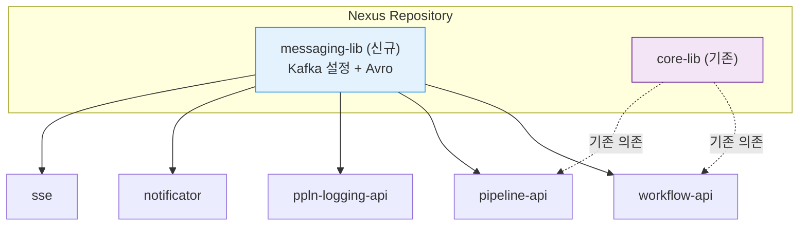

### 참고 구조 (redpanda-playground `common-kafka`)

redpanda-playground에서 이미 검증된 `common-kafka` 모듈의 패키지 구조를 기반으로 TPS용 messaging-lib를 설계한다.

```
common-kafka/
├── config/
│   ├── KafkaProducerConfig.java      # KafkaTemplate<String, byte[]> + 인터셉터 등록
│   └── KafkaErrorConfig.java         # CommonErrorHandler + DLQ 라우팅 + exponential backoff
├── topic/
│   ├── Topics.java                   # 토픽 이름 상수 (단일 소스)
│   └── TopicConfig.java              # NewTopic 빈 (파티션 수, 보존 기간)
├── serialization/
│   └── AvroSerializer.java           # Avro 직렬화/역직렬화 + JSON 변환
├── interceptor/
│   └── CloudEventsHeaderInterceptor.java  # ce_id, ce_source, ce_time 자동 주입
├── dlq/
│   └── DlqConsumer.java              # DLQ 공통 소비 + 에러 로깅
└── avro/                             # .avsc 스키마 파일 → 빌드 시 Java 클래스 생성
    ├── common/                       # 공통 Enum (PipelineStatus, SourceType)
    ├── pipeline/                     # 파이프라인 이벤트 스키마
    ├── ticket/                       # 티켓 이벤트 스키마
    └── webhook/                      # 웹훅 이벤트 스키마
```

### TPS messaging-lib 패키지 설계

| 패키지 | 역할 | common-kafka 대응 |
| ------------ | ----------------------------------------------------- | ------------------- |
| config | Producer/Consumer/Registry 공통 설정 | `KafkaProducerConfig` |
| config.error | CommonErrorHandler + DLQ 라우팅, 비재시도 예외 등록 | `KafkaErrorConfig` |
| config.topic | 도메인별 NewTopic 빈 설정 (파티션 수, 보존 기간) | `TopicConfig` |
| topic | 토픽 이름 상수 (TpsTopics.java 단일 파일) | `Topics` |
| interceptor | CloudEvents 헤더 자동 주입 (ce_id, ce_source, traceId) | `CloudEventsHeaderInterceptor` |
| serialization | Avro 직렬화/역직렬화 + Schema Registry 연동 | `AvroSerializer` |
| dlq | 공통 DLQ Consumer + 에러 로깅/알림 | `DlqConsumer` |
| avro | 모듈 간 이벤트 스키마 (.avsc → Java 클래스) | `avro/` |

### 핵심 설계 결정

**직렬화 방식**: `KafkaTemplate<String, byte[]>`를 사용한다. key는 String, value는 Avro로 직렬화한 byte[]다. Confluent wire format(`0x00` + 4바이트 스키마 ID + Avro 바이너리)을 따르면 Redpanda Console에서 메시지를 디코딩하여 확인할 수 있다.

**스키마 전략**: `RecordNameStrategy`를 사용하면 이벤트 타입별로 독립적인 스키마 버전 관리가 가능하다. 하나의 토픽에 여러 이벤트 타입이 들어가도 각각 별도 subject로 관리된다.

**에러 처리**: `KafkaErrorConfig`에서 `CommonErrorHandler`를 빈으로 등록하면 모든 `@KafkaListener`에 일괄 적용된다. 역직렬화 실패(`AvroSerializationException`) 같은 비재시도 예외는 즉시 DLQ로 보내고, 네트워크 장애는 exponential backoff로 재시도한다.


## 2. Redpanda Connect 파이프라인 작성 가이드

외부 DevOps 도구(Jenkins, GitLab, SonarQube 등)의 webhook을 Redpanda 토픽으로 변환하는 커넥터는 Redpanda Connect가 담당한다. 개발자가 새로운 외부 도구를 연동하거나 스키마를 변경해야 할 경우 `tps-manifest`에서 직접 YAML을 수정해야 하므로, 문법과 작성 패턴에 대한 가이드가 필요하다.

### Streams Mode 구조

Redpanda Connect는 Streams Mode로 배포하며, `streams/` 디렉토리에 YAML 파일을 추가하면 자동으로 파이프라인이 등록된다. 각 YAML 파일은 독립적인 `input → pipeline → output` 구조를 가진다.

```
tps-manifest/connect/
└── streams/
    ├── jenkins-build-status.yaml     # Jenkins 빌드 완료 webhook
    ├── sonarqube-analysis.yaml       # SonarQube 분석 완료 webhook
    ├── gitlab-mr-event.yaml          # GitLab MR/Push webhook
    └── argocd-sync-status.yaml       # ArgoCD 배포 완료 webhook
```

### YAML 기본 구조

모든 스트림 파이프라인은 세 블록으로 구성된다.

```yaml
input:                   # 데이터 수신 (webhook HTTP 엔드포인트)
  http_server:
    path: /jenkins-webhook

pipeline:                # 데이터 변환 (Bloblang 매핑)
  processors:
    - mapping: |
        root.buildNumber = this.build.number
        root.jobName = this.build.full_url
        root.status = this.build.status
        root.timestamp = now()

output:                  # 데이터 발행 (Redpanda 토픽)
  redpanda:
    seed_brokers: ["${REDPANDA_BROKERS}"]
    topic: tps.pipeline.status-changed
```

### Bloblang 매핑 문법

외부 도구마다 webhook 페이로드 형식이 다르므로, `pipeline.processors.mapping`에서 공통 스키마로 변환한다. 이렇게 하면 외부 도구가 교체되더라도 Consumer 코드는 변경할 필요가 없다.

| 문법 | 설명 | 예시 |
|------|------|------|
| `this.필드` | 입력 JSON에서 값 추출 | `this.build.status` |
| `root.필드 = 값` | 출력 JSON에 값 설정 | `root.status = "SUCCESS"` |
| `now()` | 현재 타임스탬프 | `root.timestamp = now()` |
| `uuid_v4()` | UUID 생성 | `root.eventId = uuid_v4()` |
| `this.필드.or("기본값")` | null일 때 기본값 | `this.message.or("N/A")` |
| `match` | 조건 분기 | `root.level = match { this.status == "SUCCESS" => "INFO", _ => "WARN" }` |

### 스트림 예시: SonarQube

```yaml
# streams/sonarqube-analysis.yaml
input:
  http_server:
    path: /sonarqube-webhook

pipeline:
  processors:
    - mapping: |
        root.source = "SONARQUBE"
        root.projectKey = this.project.key
        root.qualityGate = this.qualityGate.status
        root.conditions = this.qualityGate.conditions
        root.analysisId = this.analysisId
        root.timestamp = now()

output:
  redpanda:
    seed_brokers: ["${REDPANDA_BROKERS}"]
    topic: tps.pipeline.analysis-completed
```

### 새 외부 도구 연동 시 체크리스트

1. 외부 도구의 webhook 페이로드 구조 확인 (샘플 JSON 확보)
2. `streams/` 디렉토리에 새 YAML 파일 생성
3. `mapping`에서 공통 스키마 필드로 변환 (source, timestamp 필수)
4. `output.topic`에 적절한 토픽 지정
5. Redpanda Connect 재배포 후 webhook URL을 외부 도구에 등록

## 3. 메시지 브로커 계약 표준화(AsyncAPI)

REST API의 OpenAPI(Swagger)와 동일하게, 이벤트 기반 통신에서도 AsyncAPI를 통해서 표준화할 수 있습니다.

**예시 코드**

```yaml
asyncapi: 3.0.0
info:
  title: TPS Workflow Ticket Events
  version: 1.0.0
  description: 티켓 라이프사이클 이벤트

channels:
  tps.workflow.ticket:
    address: tps.workflow.ticket
    messages:
      ticketCreated:
        headers:
          type: object
          properties:
            eventType:
              type: string
              enum: [TICKET_CREATED]
            correlationId:
              type: string
              format: uuid
            sourceModule:
              type: string
              enum: [workflow-api]
        payload:
          schemaFormat: application/vnd.apache.avro;version=1.11.3
          schema:
            $ref: './avro/TicketEvent.avsc'

      ticketCompleted:
        headers:
          type: object
          properties:
            eventType:
              type: string
              enum: [TICKET_COMPLETED]
        payload:
          schemaFormat: application/vnd.apache.avro;version=1.11.3
          schema:
            $ref: './avro/TicketEvent.avsc'

operations:
  publishTicketEvent:
    action: send
    channel:
      $ref: '#/channels/tps.workflow.ticket'
    summary: workflow-api가 티켓 상태 변경 이벤트를 발행
    messages:
      - $ref: '#/channels/tps.workflow.ticket/messages/ticketCreated'
      - $ref: '#/channels/tps.workflow.ticket/messages/ticketCompleted'

  consumeTicketEvent:
    action: receive
    channel:
      $ref: '#/channels/tps.workflow.ticket'
    summary: pipeline-api가 티켓 이벤트를 소비하여 통합 처리
```

## 4. 모니터링 정책

메시지 브로커 도입으로 API의 흐름이 하나의 흐름이 아닌 각자 분할되어서 진행되므로 분산 시스템에 대한 모니터링 진행이 중요해졌습니다.

각 토픽 및 어떠한 모듈에서 예외가 발생했는지 추적을 하기 위해 분산 추적 시스템 도입이 필요해보입니다.

### Prometheus/Grafana 지표 수집

| 지표            | 설명                      | 임계값                       |
| --------------- | ------------------------- | ---------------------------- |
| Consumer Lag    | 아직 처리 안 된 메시지 수 | 1,000 경고                   |
| DLQ 메시지 수   | 처리 실패한 메시지 수     | 0 즉시 알림                  |
| 처리율          | 초당 처리된 메시지 수     | 기준선 대비 50% 하락 시 경고 |
| Producer 에러율 | 전송 실패 비율            | 0.1% 경고                    |
| Registry 가용성 | 스키마 저장소 응답 여부   | 다운 시 즉시 알림            |

### 분산 추적 (Grafana Tempo)

이벤트 브로커를 도입하면 하나의 요청이 여러 서비스와 토픽을 거쳐 처리된다. 예를 들어 티켓 생성 → pipeline.commands 토픽 → PipelineEngine 실행 → pipeline.events 토픽 → SSE push까지의 흐름에서, 어느 구간에서 지연이 발생했는지 HTTP 로그만으로는 추적할 수 없다. 분산 추적 시스템은 이 흐름 전체를 하나의 트레이스(trace)로 연결해준다.

**Tempo를 선택하는 이유**: Grafana Tempo는 오브젝트 스토리지(Minio)를 백엔드로 사용하므로 별도 DB가 필요 없다. Redpanda의 Tiered Storage와 동일한 Minio 인프라를 공유할 수 있어 운영 비용이 줄어든다. Jaeger는 Elasticsearch나 Cassandra가 필요하므로 인프라 부담이 더 크다.

**추적 흐름**:

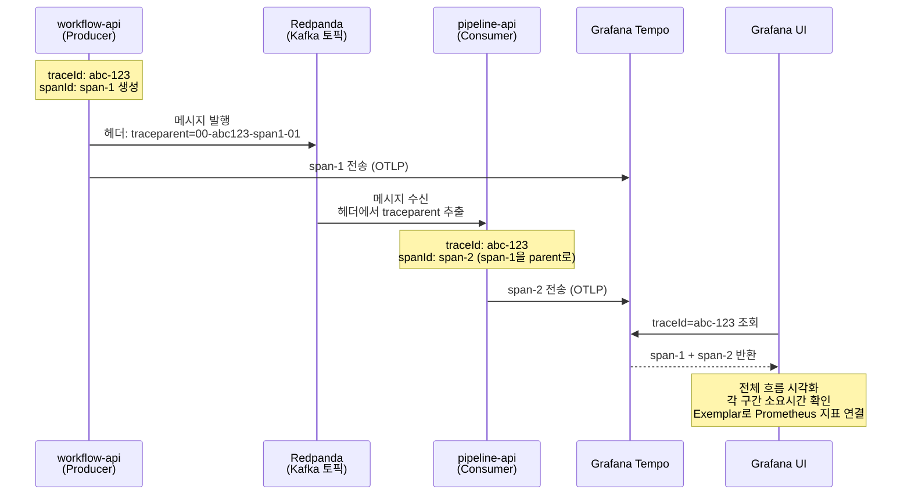

**적용 방식**:

1. **Spring Boot에 OpenTelemetry 연동**: `micrometer-tracing-bridge-otel` + `opentelemetry-exporter-otlp` 의존성을 추가하면 HTTP 요청은 자동으로 트레이스가 생성된다.
2. **Kafka 헤더 전파**: Producer가 메시지 헤더에 `traceparent`(W3C Trace Context)를 주입하고, Consumer가 이를 추출하여 같은 traceId로 span을 이어간다. Spring Kafka의 `ProducerInterceptor`/`ConsumerInterceptor`로 자동화할 수 있다.
3. **Grafana 대시보드**: Tempo 데이터소스를 추가하면, traceId로 전체 흐름을 시각화하고 각 구간의 소요 시간을 확인할 수 있다. Prometheus 지표(Consumer Lag 등)와 트레이스를 Exemplar로 연결하면 "Lag이 급증한 시점의 트레이스"를 바로 확인할 수 있다.

```yaml
# application.yml (Spring Boot 3.x)
management:
  tracing:
    sampling:
      probability: 1.0          # 개발 환경 100%, 프로덕션은 0.1 권장
  otlp:
    tracing:
      endpoint: "http://tempo.monitoring:4318/v1/traces"
```

## 5. Minio와 연계 (Tiered Storage)

레드판다에서 NFS를 지원하지 않으므로 로컬에서 스토리지를 구성하나, 오래된 데이터는 Object Storage(Minio)로 이관되는 기능 도입이 필요하다.

### Tiered Storage란

Tiered Storage는 데이터를 접근 빈도에 따라 여러 계층의 저장소에 분산 배치하는 전략이다. 메시지 브로커에서는 최근 데이터(hot)는 로컬 디스크에, 오래된 데이터(cold)는 저비용 오브젝트 스토리지에 보관한다.

```
Hot Tier (로컬 SSD)          Cold Tier (Object Storage)
┌─────────────────┐         ┌─────────────────────┐
│ 최근 1~3일 데이터 │  ─────→ │ 3일 이후 데이터       │
│ 빠른 읽기/쓰기    │  자동    │ 저비용, 대용량        │
│ Consumer 주로 접근│  이관    │ 필요 시 투명하게 조회  │
└─────────────────┘         └─────────────────────┘
```

이 구조가 필요한 이유는 두 가지다. 첫째, 메시지 보존 기간을 늘려도 로컬 디스크 비용이 증가하지 않는다. 둘째, Redpanda 브로커의 로컬 디스크 용량이 제한적인 Kubernetes 환경에서 장기 보존이 가능해진다.

### Redpanda의 Tiered Storage 동작 방식

Redpanda는 Tiered Storage를 네이티브로 지원한다. 세그먼트 단위로 로컬 디스크에서 오브젝트 스토리지로 자동 업로드하며, Consumer가 cold 데이터를 요청하면 오브젝트 스토리지에서 투명하게 가져온다. 애플리케이션 코드 변경 없이 브로커 설정만으로 활성화할 수 있다.

### Minio 연계 설정

Minio는 S3 호환 오브젝트 스토리지이므로, Redpanda의 S3 Tiered Storage 설정을 그대로 사용한다.

```yaml
# redpanda.yaml (Helm values)
storage:
  tiered:
    cloud_storage_enabled: true
    cloud_storage_api_endpoint: "minio.infra.svc.cluster.local"
    cloud_storage_api_endpoint_port: 9000
    cloud_storage_bucket: "redpanda-tiered"
    cloud_storage_region: "us-east-1"           # Minio는 임의 값 허용
    cloud_storage_access_key: "${MINIO_ACCESS_KEY}"
    cloud_storage_secret_key: "${MINIO_SECRET_KEY}"
    cloud_storage_disable_tls: true             # Minio가 TLS 미사용 시
```

토픽별로 로컬 보존 기간을 설정하여 이관 시점을 제어한다.

```yaml
# 토픽 설정
retention.local.target.ms: 259200000   # 로컬 3일 보존
retention.ms: 2592000000               # 전체 30일 보존 (cold 포함)
```

로컬 3일이 지난 세그먼트는 Minio로 자동 이관되고, 30일이 지나면 Minio에서도 삭제된다.
