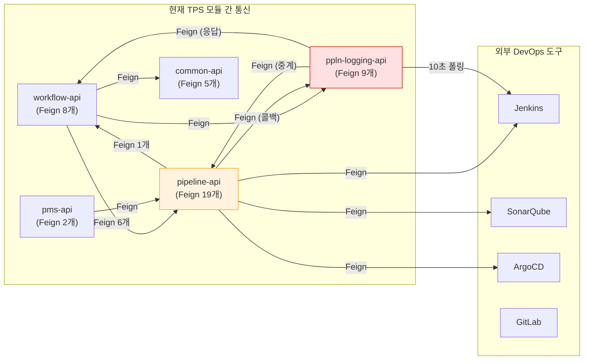
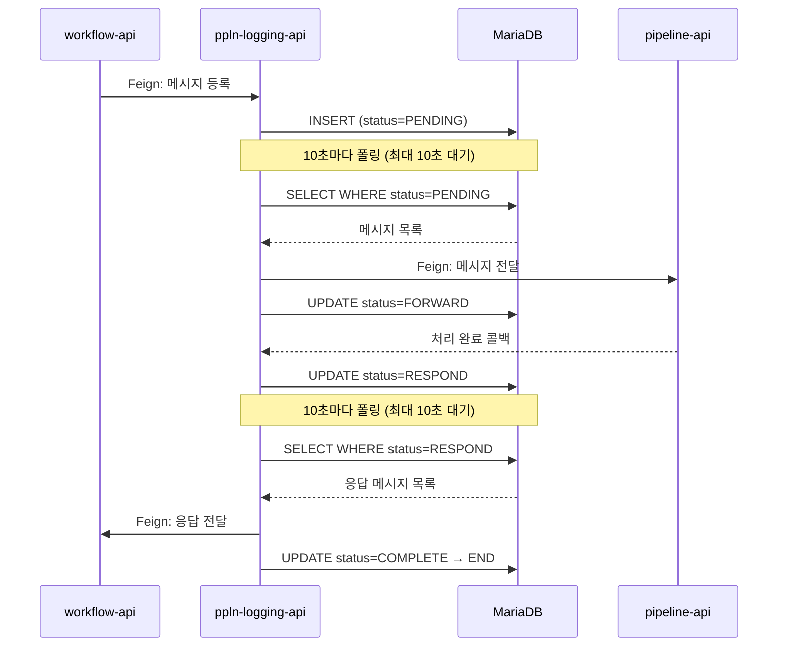
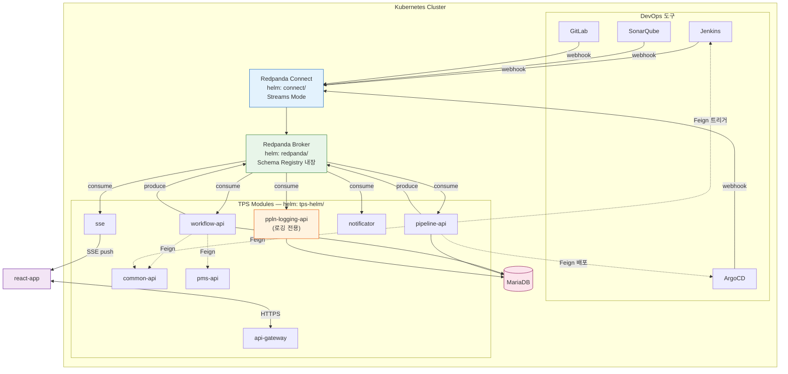
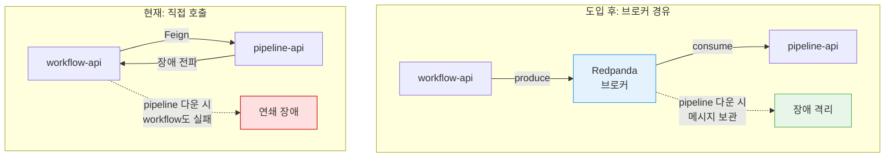
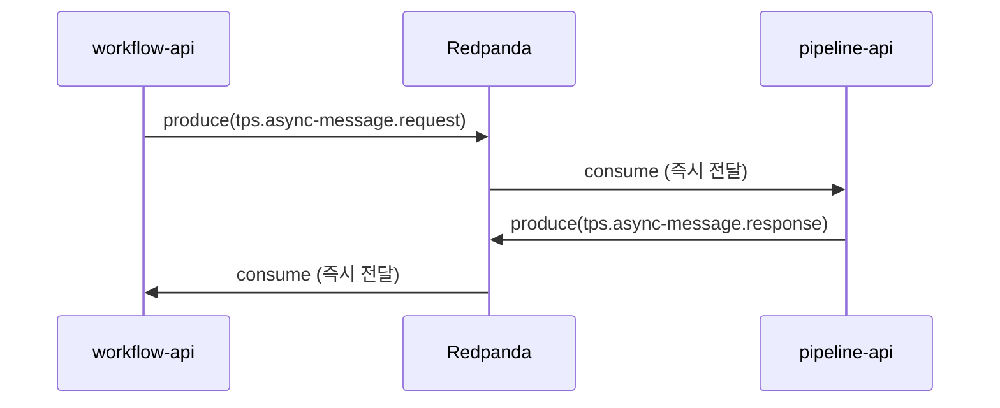
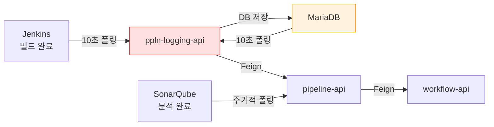
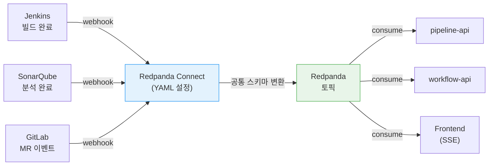
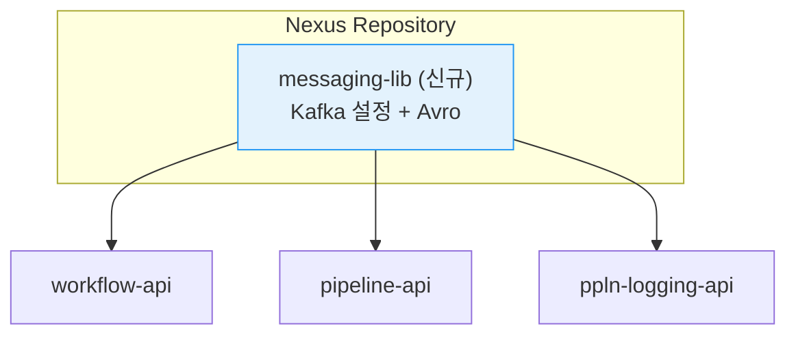

# TPS Redpanda 도입 

---

## 이전 통신 구조

TPS는 모듈 간 통신에 직접 호출(Feign) 방식을 사용하고 있습니다. A 모듈이 B 모듈의 기능이 필요하면 B를 직접 호출하는 방식입니다.



### 모듈 간 강결합

시스템 전체에 Feign 클라이언트가 거미줄처럼 엮여 있습니다.

| 모듈                | Feign 수 | 주요 호출 대상                                               |
| ------------------- | -------- | ------------------------------------------------------------ |
| pipeline-api        | 19       | **Jenkins, ArgoCD, Harbor, SonarQube, ppln-logging, workflow** |
| ppln-logging-api    | 9        | pipeline-api, workflow-api (메시지 중계), Jenkins            |
| workflow-api        | 8        | pipeline-api, ppln-logging-api, pms-api, common-api          |
| common-api, pms-api | 7        | JWT, 모니터링, 인증, pipeline-api                            |

- pipeline-api가 전체 feign의 44%를 차지하는데, 이 모듈이 느려지면 모든 모듈이 느려지게 됩니다.


### ppln-logging api(DB-Queue 구조)

모듈간 통신이 너무 길어지는 경우(ex 저장소 클론)를 해결하기 위해서 3.0.4기준으로 파이프라인 로깅 모듈에서 비동기 처리를 위한 기능을 도입했습니다.

해당 모듈에서는 workflow-api / pipeline-api에 비동기 메시지를 보내야 할 때, 직접 호출하지 않고 ppln-logging-api 모듈을 경유해서 중계하는 구조를 사용하고 있습니다.




## Redpanda 도입시 아키텍쳐 변경




### 구조적 개선



### poplin-logging(DB-Queue) 구조 제거

해당 부분은 개발자 판단에 따라서 진행여부 결정



### 외부 미들웨어(DevOps 도구) 연동 개선

**현재 구조**

Jenkins, GitLab, SonarQube, ArgoCD, Harbor 등 외부 도구와 직접 Feign으로 통신하던 구조로 진행되며 결과를 알기위해서 주기적으로 폴링했다.



### Redpanda 도입 후 

1. 외부 도구가 이벤트 발생 시 webhook으로 전송하는 방식을 사용
2. 외부 도구가 교체되더라도, 출력 스키마를 통일 시켜서 Consumer 측에서 동일한 데이터를 받게한다.
3. DB-Queue 구조를 제거한다.



# 진행되어야 하는 작업

---

## 1. messaging-lib 모듈 생성

카프카를 사용하는 모듈에 대해서 include 진행되어야 하는 프로젝트이며, core-lib와 동일하게 Nexus에 배포합니다.




| 패키지       | 역할                                                  |
| ------------ | ----------------------------------------------------- |
| config       | Producer/Consumer/Registry 공통 설정                  |
| config.topic | 도메인별 NewTopic 빈 설정 (파티션 수, 보존 기간)      |
| topic        | 토픽 이름 상수 (TpsTopics.java 단일 파일)             |
| producer     | 공통 Producer (헤더 자동 설정, correlationId 주입)    |
| consumer     | 멱등성 처리, DLQ 재시도 핸들러                        |
| avro         | 모듈 간 이벤트 스키마 (TicketEvent, ApprovalEvent 등) |


## 2. Redpanda Connect 파이프라인 작성 가이드

미들웨어 통신에서 사용하는 커넥터의 경우 개발자가 커스텀 진행이 필요한 경우 tps-manifest에서 직접 yaml을 수정해야 합니다 이 부분에 대해서 가이드 및 문법 설명 진행

### 스트림 yaml 예시

```yaml
# streams/jenkins-build-status.yaml
input:
  http_server:
    path: /jenkins-webhook

pipeline:
  processors:
    - mapping: |
        root.buildNumber = this.build.number
        root.jobName = this.build.full_url
        root.status = this.build.status
        root.timestamp = now()

output:
  redpanda:
    seed_brokers: ["${REDPANDA_BROKERS}"]
    topic: tps.pipeline.status-changed
```

```yaml
# streams/sonarqube-analysis.yaml
input:
  http_server:
    path: /sonarqube-webhook

pipeline:
  processors:
    - mapping: |
        root.projectKey = this.project.key
        root.qualityGate = this.qualityGate.status
        root.timestamp = now()

output:
  redpanda:
    seed_brokers: ["${REDPANDA_BROKERS}"]
    topic: tps.pipeline.analysis-completed
```

## 3. 메시지 브로커 계약 표준화(AsyncAPI)

REST API의 OpenAPI(Swagger)와 동일하게, 이벤트 기반 통신에서도 AsyncAPI를 통해서 표준화할 수 있습니다.

**예시 코드**

```yaml
asyncapi: 3.0.0
info:
  title: TPS Workflow Ticket Events
  version: 1.0.0
  description: 티켓 라이프사이클 이벤트

channels:
  tps.workflow.ticket:
    address: tps.workflow.ticket
    messages:
      ticketCreated:
        headers:
          type: object
          properties:
            eventType:
              type: string
              enum: [TICKET_CREATED]
            correlationId:
              type: string
              format: uuid
            sourceModule:
              type: string
              enum: [workflow-api]
        payload:
          schemaFormat: application/vnd.apache.avro;version=1.11.3
          schema:
            $ref: './avro/TicketEvent.avsc'

      ticketCompleted:
        headers:
          type: object
          properties:
            eventType:
              type: string
              enum: [TICKET_COMPLETED]
        payload:
          schemaFormat: application/vnd.apache.avro;version=1.11.3
          schema:
            $ref: './avro/TicketEvent.avsc'

operations:
  publishTicketEvent:
    action: send
    channel:
      $ref: '#/channels/tps.workflow.ticket'
    summary: workflow-api가 티켓 상태 변경 이벤트를 발행
    messages:
      - $ref: '#/channels/tps.workflow.ticket/messages/ticketCreated'
      - $ref: '#/channels/tps.workflow.ticket/messages/ticketCompleted'

  consumeTicketEvent:
    action: receive
    channel:
      $ref: '#/channels/tps.workflow.ticket'
    summary: pipeline-api가 티켓 이벤트를 소비하여 통합 처리
```

## 4. 모니터링 정책

메시지 브로커 도입으로 API의 흐름이 하나의 흐름이 아닌 각자 분할되어서 진행되므로 분산 시스템에 대한 모니터링 진행이 중요해졌습니다.

각 토픽 및 어떠한 모듈에서 예외가 발생했는지 추적을 하기 위해 분산 추적 시스템 도입이 필요해보입니다. (Tempo 혹은 Jaeger 도입)

Prometheus/Grafana에서 지표 추적 및 수집

| 지표            | 설명                      | 임계값                       |
| --------------- | ------------------------- | ---------------------------- |
| Consumer Lag    | 아직 처리 안 된 메시지 수 | 1,000 경고                   |
| DLQ 메시지 수   | 처리 실패한 메시지 수     | 0 즉시 알림                  |
| 처리율          | 초당 처리된 메시지 수     | 기준선 대비 50% 하락 시 경고 |
| Producer 에러율 | 전송 실패 비율            | 0.1% 경고                    |
| Registry 가용성 | 스키마 저장소 응답 여부   | 다운 시 즉시 알림            |

## 5. Minio와 연계

레드판다에서 NFS를 지원하지 않으므로 로컬에서 스토리지를 구성하나, 오래된 데이터는 Object Storage(Minio)로 이관되는 기능 도입필요


