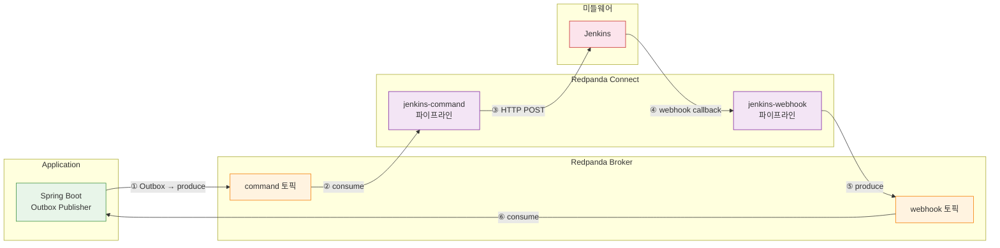
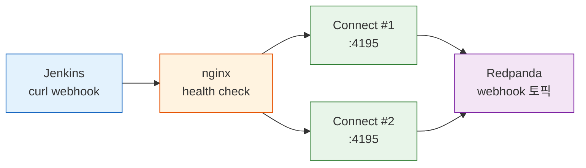
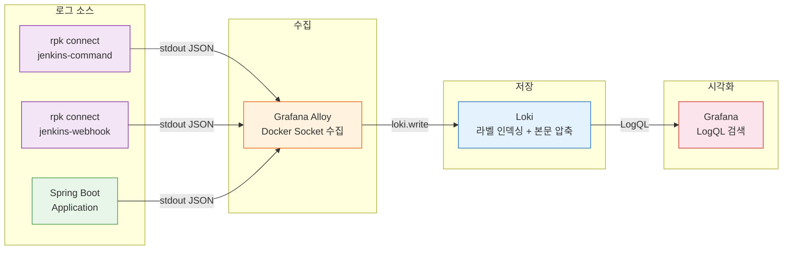
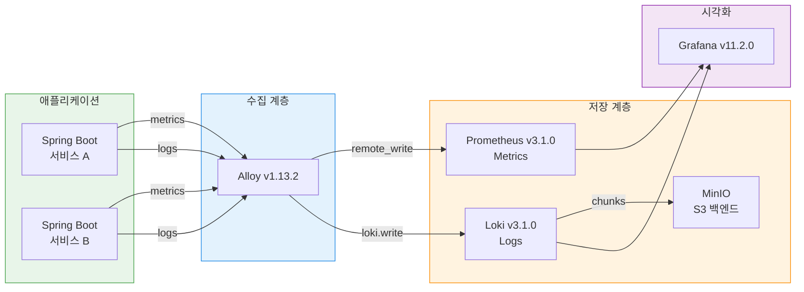
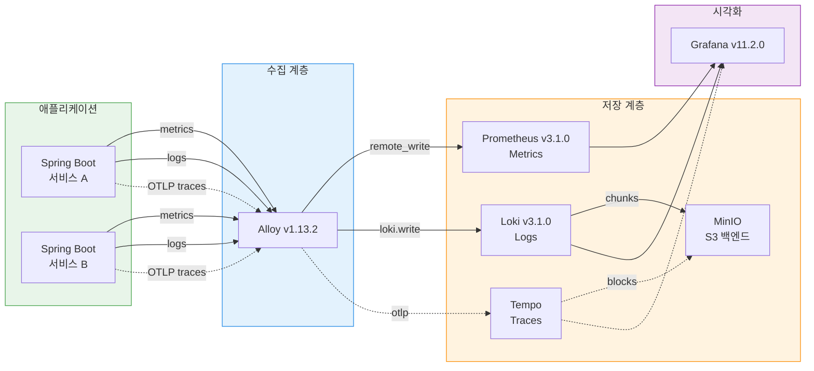

# Redpanda Connect 파이프라인 가용성과 모니터링

---

## 1. 파이프라인 구조 개요

메시지 파이프라인은 3개의 구간으로 나뉜다. Application이 비즈니스 이벤트를 Kafka 토픽에 발행하고, Redpanda Connect가 토픽을 소비하여 외부 시스템(Jenkins)에 HTTP로 전달하며, Jenkins가 빌드/배포 결과를 webhook으로 다시 Connect에 보내는 구조다.



각 구간의 역할을 정리하면 다음과 같다.

| 구간        | 경로                       | 역할                              | 전달 보장                    |
| ----------- | -------------------------- | --------------------------------- | ---------------------------- |
| ① Producer  | Application → Broker       | Outbox 테이블 기반 이벤트 발행    | at-least-once (DB 재시도)    |
| ②→③ Command | Broker → Connect → Jenkins | 토픽 소비 → Jenkins API HTTP 호출 | at-least-once (Kafka 오프셋) |
| ④→⑤ Webhook | Jenkins → Connect → Broker | HTTP 수신 → Kafka 발행            | **at-most-once** (WAL 없음)  |
| ⑥ Consumer  | Broker → Application       | 이벤트 소비 → 비즈니스 로직 처리  | at-least-once (오프셋 커밋)  |

파이프라인 전체에서 유일하게 at-most-once인 구간이 ④→⑤다. 이 구간이 왜 문제이고 어떤 대안이 있는지는 Jenkins 커넥터 재시도 한계 섹션에서 다룬다.


## 2. 실패 케이스 정리

### 2-1. 3구간 실패 시나리오 요약

| 구간                  | 실패 원인                       | 증상                          | 시스템 대응                         | 최종 결과                |
| --------------------- | ------------------------------- | ----------------------------- | ----------------------------------- | ------------------------ |
| **App → Broker**      | Redpanda 다운                   | KafkaTemplate.send() 타임아웃 | OutboxPoller DB 재시도 (5회)        | DEAD 마킹 (DB 격리)      |
| **Connect → Jenkins** | Jenkins 다운, 4xx/5xx, 타임아웃 | HTTP POST 실패                | Connect 재시도 (5회, 2s→30s 백오프) | DLQ 토픽 이동            |
| **Connect → Jenkins** | 연결 거부 (connection refused)  | TCP 연결 불가                 | 동일 재시도 메커니즘                | DLQ 토픽 이동            |
| **Jenkins → Connect** | Connect 다운                    | webhook callback 실패         | Jenkins curl 타임아웃               | 메시지 유실 가능         |
| **Jenkins → Connect** | HTTP 수신 후 Kafka 발행 전 죽음 | Connect 비정상 종료           | **보호 장치 없음** (at-most-once)   | 메시지 유실              |
| **Broker 장애**       | 전체 브로커 불가용              | 모든 produce/consume 실패     | 무한 재시도 + 백프레셔              | 브로커 복구 시 자동 재개 |

### 2-2. Connect HTTP→Kafka 갭 (at-most-once 문제)

Connect의 `http_server` input은 HTTP 요청을 수신하여 Kafka로 발행한다. 이 변환 과정에서 Connect는 WAL(Write-Ahead Log)을 사용하지 않기 때문에, HTTP 수신과 Kafka 발행 사이의 원자성이 보장되지 않는다.

```
Jenkins curl → [HTTP 수신] → [Kafka 발행] → ack(200)
                    ↑              ↑
                    A              B
```

장애 시점에 따라 결과가 달라진다.

| 장애 시점                       | 결과                               | 호출자 인지                             |
| ------------------------------- | ---------------------------------- | --------------------------------------- |
| A 이전 (Connect 다운)           | connection refused → 메시지 미수신 | curl 실패로 즉시 인지                   |
| A~B 사이 (수신 후 발행 전 죽음) | **메시지 유실**                    | 타임아웃으로 인지하나, 재전송 판단 불가 |
| B 이후 (발행 후 ack 전 죽음)    | Kafka에 메시지 존재                | 타임아웃으로 실패 인지 → 재전송 시 중복 |

A~B 구간이 핵심이다. Connect 프로세스가 HTTP 요청을 메모리에 올린 뒤 Kafka 발행 직전에 죽으면 메시지가 어디에도 남지 않는다. 이것이 at-most-once 갭이며, Connect의 구조적 한계다.

### 2-3. Jenkins HTTP 호출 실패

Connect가 Jenkins API에 HTTP POST를 보낼 때 발생하는 실패는 응답 코드에 따라 처리가 달라진다.

**4xx 응답 (재시도 불필요)**

400 Bad Request, 404 Not Found 같은 클라이언트 에러는 요청 자체가 잘못된 경우다. 재시도해도 결과가 바뀌지 않으므로 즉시 DLQ로 격리하는 것이 올바르다. 단, 429 Too Many Requests는 예외적으로 재시도가 유효한 4xx이며, Rate Limit 해제 후 동일 요청이 성공할 수 있다.

**5xx 응답 / 타임아웃 (재시도 가능)**

503 Service Unavailable, 502 Bad Gateway는 Jenkins의 일시적 장애를 나타낸다. 지수 백오프로 재시도하면 Jenkins 복구 후 성공할 수 있다. 타임아웃(context deadline exceeded)과 연결 거부(connection refused)도 같은 범주로, Jenkins 프로세스가 과부하이거나 다운된 상태를 의미한다.

**재시도 흐름:**

```
Kafka consume → HTTP POST to Jenkins
  ↓ (Jenkins 다운 또는 5xx)
시도 1: 실패 → 2s 대기
시도 2: 실패 → 4s 대기
시도 3: 실패 → 8s 대기
시도 4: 실패 → 16s 대기
시도 5: 실패 → 30s 대기 (max_interval)
  ↓
모두 실패 → DLQ 토픽으로 메시지 이동
```

### 2-4. 브로커 장애와 백프레셔

Redpanda 브로커가 장시간 불가용하면 Connect의 Kafka 발행이 실패한다. 이때 `retry` output의 무한 재시도와 지수 백오프가 내장 백프레셔 역할을 한다.

```yaml
output:
  retry:
    max_retries: 0  # 무한 재시도
    backoff:
      initial_interval: 500ms
      max_interval: 60s
    output:
      kafka_franz:
        seed_brokers: ["localhost:19092"]
        topic: "target-topic"
```

이 설정은 브로커 다운 시 500ms → 1s → 2s → ... → 60s 간격으로 재시도하며, 브로커가 복구되면 자동으로 정상 처리를 재개한다. 별도 Circuit Breaker 라이브러리 없이 Connect 자체의 `retry` output이 이 역할을 수행한다.

무한 재시도는 "기다리면 복구되는" 브로커 장애에 적합하다. 외부 API 호출에서는 `max_retries`를 유한하게 설정하고, 초과 시 DLQ로 보내야 파이프라인이 멈추지 않는다.


## 3. Jenkins 커넥터 재시도 한계

### 핵심 문제: stateless Connect의 구조적 한계

Connect는 WAL이 없는 stateless 프로세스다. HTTP 요청을 수신하면 메모리에 올려 Kafka로 발행하는데, 이 두 동작 사이에 영속화 계층이 없다. 따라서 HTTP→Kafka 구간은 본질적으로 at-most-once이며, 이 구간에서 프로세스가 죽으면 메시지가 유실된다.

Kafka→HTTP 방향(jenkins-command)은 다르다. Kafka 오프셋 커밋 전에 Connect가 죽으면 재시작 후 마지막 커밋 오프셋부터 다시 소비하므로 at-least-once가 보장된다. 문제는 HTTP→Kafka 방향(jenkins-webhook)에만 국한된다.

### 3-1. Jenkins 관점의 딜레마

Jenkins가 빌드 완료 후 Connect에 webhook을 보내는 상황에서, curl이 타임아웃되었을 때 Jenkins는 "메시지가 유실되었는지, 전달 완료되었는지" 구분할 수 없다.

- **실제 유실** (A~B 구간 장애): 재전송이 필요하다
- **발행 완료, ack만 실패** (B 이후 장애): 재전송하면 중복이 발생한다

맹목적 재전송은 중복 위험을 수반하고, 재전송하지 않으면 유실 위험을 감수해야 한다. 이 판단 불가 상태가 at-most-once 갭의 실질적 문제다.

### 3-2. 대안 비교

| 대안                           | 구현 방식                    | 전달 보장                  | 복잡도 | 적합한 상황            |
| ------------------------------ | ---------------------------- | -------------------------- | ------ | ---------------------- |
| **Jenkins curl retry**         | `--retry 3 --retry-delay 5`  | at-most-once (갭 유지)     | 낮음   | Connect 일시 다운 커버 |
| **rpk 직접 발행**              | Jenkins에서 rpk produce 실행 | at-least-once (브로커 ack) | 중간   | 단순 webhook 전달      |
| **Connect 다중 인스턴스 + LB** | nginx/HAProxy 로드밸런싱     | at-most-once (갭 유지)     | 높음   | rpk 전환이 어려운 환경 |

**Jenkins curl retry**: 가장 단순한 접근이다. Connect가 일시적으로 응답하지 않는 경우(재시작 중, 네트워크 지연)를 커버한다. 다만 A~B 구간 장애는 여전히 보호하지 못한다.

```groovy
// Jenkinsfile — curl 재시도
sh "curl --retry 3 --retry-delay 5 --max-time 10 -X POST http://connect:4195/webhook -d '${payload}'"
```

**rpk 직접 발행**: Connect를 우회하여 Jenkins가 Kafka에 직접 메시지를 발행한다. 브로커 ack를 받는 순간 메시지 보존이 보장되므로 at-least-once를 달성한다. rpk는 의존성 없는 단일 바이너리(~30MB)이므로 Jenkins Agent 이미지에 추가하기 쉽다.

```groovy
// Jenkinsfile — rpk 직접 발행
sh "echo '${payload}' | rpk topic produce webhook-events --brokers redpanda:9092"
```

**Connect 다중 인스턴스 + 로드밸런서**: 여러 Connect 인스턴스를 nginx로 묶으면 단일 인스턴스 장애를 커버한다. `proxy_next_upstream error timeout http_502`로 실패 시 다음 인스턴스로 자동 전환된다. 가용성은 높아지지만 at-most-once 갭은 구조적으로 제거되지 않는다.



결론적으로, 단순 webhook 전달이 목적이라면 rpk 직접 발행이 at-least-once를 보장하면서 장애 포인트를 줄이는 최선의 선택이다. Connect가 메시지 변환, 라우팅, 필터링 역할을 수행하는 경우에만 Connect 경유가 정당화된다.


## 4. Alloy-Loki 로깅 시스템

### 수집 파이프라인 구조

Grafana Alloy가 컨테이너의 stdout 로그를 수집하여 Loki로 전송하는 구조다. rpk connect는 JSON 구조화 로그를 stdout에 출력하기만 하면 되고, 로그 파일을 직접 관리할 필요가 없다.




# Grafana Tempo 도입

---

> 작성일: 2026-03-17
> 목적: TPS 모니터링 스택에 분산 추적(Distributed Tracing) 도입을 위한 Grafana Tempo PoC 조사 결과 정리

## 1. 배경 — 왜 Tempo가 필요한가

관측성(Observability)은 세 가지 축으로 구성된다.

| 축         | 도구                                       | 상태     |
| ---------- | ------------------------------------------ | -------- |
| Metrics    | Prometheus (kube-prometheus-stack v68.1.0) | 운영 중  |
| Logs       | Loki v3.1.0 + Alloy v1.13.2                | 운영 중  |
| **Traces** | **미구현**                                 | **부재** |

Metrics는 "무엇이 느린가"를 알려주고, Logs는 "무엇이 실패했는가"를 알려준다. 하지만 마이크로서비스 환경에서 요청 하나가 여러 서비스를 거칠 때, 어느 구간에서 지연이 발생했는지 추적하려면 Traces가 필요하다. 

- 현재 TPS 개발계에서 API 지연이나 서비스 간 호출 문제가 발생하면, 각 서비스 로그를 시간 기준으로 수동 대조해야 한다. 
- Tempo를 도입하면 요청의 전체 경로를 하나의 트레이스로 시각화할 수 있다.

Grafana Tempo를 선택하는 이유는 기존 스택과의 궁합이다. Grafana가 이미 운영 중이므로 데이터소스 추가만으로 트레이스 조회가 가능하고, Loki 로그와 Prometheus 메트릭을 트레이스 ID로 상호 연결(Exemplar)할 수 있다. 별도의 Elasticsearch나 Cassandra 같은 무거운 의존성이 없고, 오브젝트 스토리지(MinIO/GCS)만 있으면 된다.


## 2. 아키텍처 비교

### 2-1. 현재 모니터링 아키텍처 (AS-IS)



현재 Alloy가 메트릭과 로그를 수집하여 Prometheus와 Loki로 전송한다. Loki는 MinIO를 S3 호환 백엔드로 사용하고 있다. Grafana에서 두 데이터소스를 조회할 수 있지만, **트레이스 데이터소스는 없다.**

### 2-2. Tempo 도입 후 아키텍처 (TO-BE)



1. **애플리케이션**: OpenTelemetry SDK(또는 Java Agent)를 추가하여 OTLP 프로토콜로 트레이스를 Alloy에 전송한다.
2. **Alloy**: 트레이스 수신 파이프라인(`otelcol.receiver.otlp` → `otelcol.exporter.otlp`)을 추가한다.
3. **Tempo**: 새로 배포하여 트레이스를 저장하고, MinIO를 스토리지 백엔드로 사용한다.

Grafana에는 Tempo 데이터소스를 추가하면 된다. 이후 로그에 트레이스 ID를 포함시키면 Loki ↔ Tempo 간 상호 링크가 가능하다.


## 3. 자원 산정

### 3-1. 최소 사양 (PoC / 개발계, 초당 100 span 이내)

| 항목    | 사양              | 비고                 |
| ------- | ----------------- | -------------------- |
| CPU     | 0.5~1 core        | Monolithic 단일 Pod  |
| Memory  | 1~2 GB            | WAL replay 피크 고려 |
| Storage | MinIO (기존) 활용 | 별도 PV 불필요       |

- Monolithic 모드에서 Go 런타임 기본 메모리가 100~150MB, WAL replay 시 피크가 추가로 발생하므로 1GB를 최소로 잡는다. 
- OOM 방지를 위해 2GB를 권장한다.

### 3-2. 공식 권장 사양 (프로덕션, Distributed 모드)

Grafana 공식 문서 기준 프로덕션 Distributed 모드의 권장 사양이다. 

- Distributor, Ingester, Querier, Compactor, Query Frontend 5개 컴포넌트의 총합은 **CPU 7.5~8.5 core / Memory 13~48GB** 초당 수천~수만 span 규모의 대규모 배포를 전제로 한다. 
- TPS 개발계(초당 10~50 span)와는 규모 차이가 크므로 참고용으로만 기록한다.

> **PoC vs 프로덕션 비교**
>
> - PoC 최소 사양은 0.5~1C / 1~2GB, 프로덕션 공식 권장 총합은 7.5~8.5C / 13~48GB로 약 10~25배 차이다. 
> - TPS 개발계는 PoC 최소 사양이면 충분하다.

### 3-3. 스토리지 비용 추정

스팬 하나의 평균 크기를 1.5KB로 가정한다. Tempo는 블록 압축(zstd)을 적용하며, 압축률은 약 10:1이다. 초당 200 span 기준으로 산출하면 다음과 같다.

- Raw 데이터: 200 spans/s × 1.5KB × 86,400s = **~25.2 GB/일**
- 압축 후 (10:1): **~2.5 GB/일**

리텐션 설정에 따른 실제 디스크 점유량은 다음과 같다:

| 리텐션 | 압축 후 저장량 |
| ------ | -------------- |
| 3일    | ~7.5 GB        |
| 7일    | ~17.5 GB       |
| 30일   | ~75 GB         |

- TPS 개발계에서는 리텐션 3일이면 ~7.5GB로, MinIO에 여유 공간만 있으면 별도 비용이 발생하지 않는다.


## 4. 도입 시 고려사항

### 4-1. 샘플링

초당 100 span 이하이면 **전량 저장**이 가능하다. 저장 비용이 무시할 수준이므로 샘플링을 적용하지 않아도 된다. 트래픽이 증가하면 Alloy에서 tail-based sampling을 설정하여 에러/느린 요청만 보존하는 방식으로 전환할 수 있다.

### 4-2. 보존기간 (Retention)

PoC 단계에서는 72h(3일)를 권장한다. 개발계에서 3일 이상 지난 트레이스를 조회할 일은 드물고, 스토리지 부담을 최소화할 수 있다. 프로덕션 도입 시에는 인시던트 분석을 위해 7일 이상으로 확대를 검토한다.

### 4-3. 인증

개발계 내부 네트워크에서만 접근하므로 Tempo 자체 인증은 불필요하다. Grafana에서 Tempo 데이터소스 추가 시 별도 인증 없이 내부 Service URL로 연결하면 된다.

### 4-4. Metrics Generator

Tempo의 Metrics Generator는 트레이스에서 자동으로 서비스별 요청률(Rate), 에러률(Error), 지연시간(Duration) 메트릭을 생성한다. 이를 Prometheus에 remote_write하면 별도 메트릭 계측 없이 RED 대시보드를 구성할 수 있다. PoC 초기에는 비활성화하고, 안정화 후 활성화를 검토한다.

### 4-5. 기존 스택 영향도

| 구성요소   | 영향                                        |
| ---------- | ------------------------------------------- |
| Prometheus | 없음 (Tempo와 독립)                         |
| Loki       | 없음 (추후 TraceID 연결만 추가)             |
| Alloy      | 설정 추가 필요 (트레이스 파이프라인)        |
| Grafana    | 데이터소스 추가만 (기존 대시보드 영향 없음) |
| MinIO      | 버킷 추가 (기존 Loki 버킷과 분리)           |

- 기존 운영 중인 Metrics/Logs 수집에는 영향이 없다. Alloy에 파이프라인을 추가하는 것이므로 기존 파이프라인은 그대로 동작한다.
