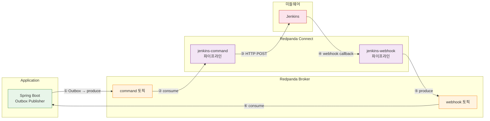
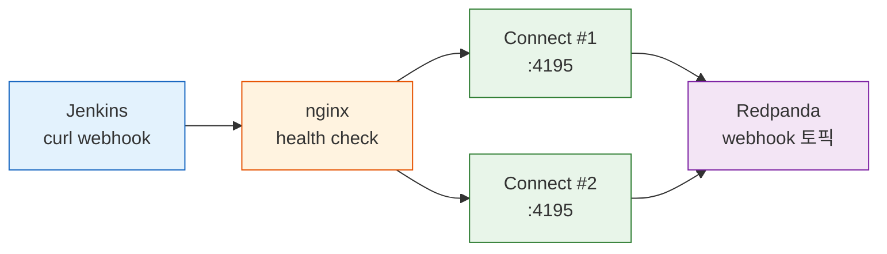
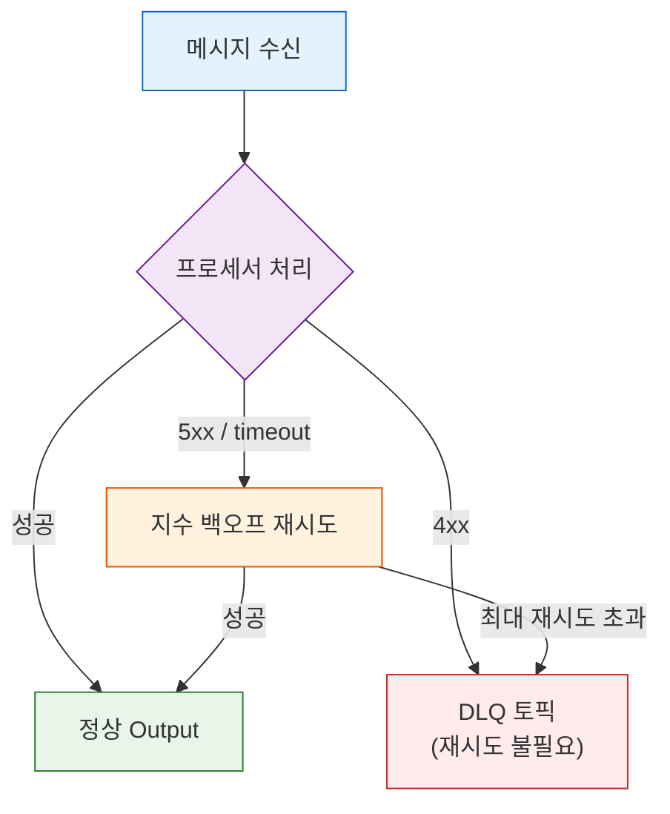
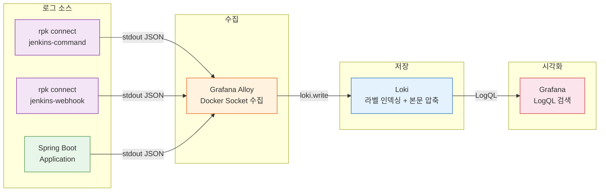
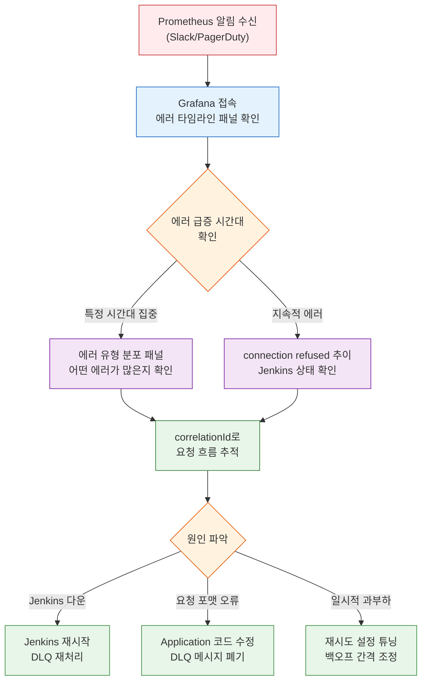

# Redpanda Connect 파이프라인 가용성과 모니터링

---

> 메시지 파이프라인은 happy path에서 동작하는 것이 시작이지 끝이 아니다. Application이 이벤트를 발행하고, Connect가 변환·라우팅하고, Jenkins가 실행하는 3단 구조에서 각 구간은 서로 다른 방식으로 실패한다. 이 문서는 두 가지를 다룬다: "어디서, 어떻게 실패하는가"와 "그 실패를 Alloy-Loki 기반 모니터링이 어떻게 감지하는가"

## 이 문서에서 다루는 것

- Application → Connect → Jenkins 파이프라인의 3구간 실패 시나리오와 각 구간의 전달 보장 수준
- Connect의 HTTP→Kafka at-most-once 갭이 발생하는 원리와 대안
- `errored()`/`error()` 기반 프로세서 에러 분류 및 Output 래퍼(`retry`/`fallback`/`switch`) 활용
- Alloy → Loki 로그 수집 파이프라인 구성과 장애 감지 LogQL 쿼리
- 구조화 로그 필드 설계, 시나리오별 LogQL 추적 쿼리, Grafana 대시보드 패널 구성
- Prometheus 알림 규칙과 Grafana 대시보드를 통한 사전 감지 체계

## 파이프라인 구조 개요

메시지 파이프라인은 3개의 구간으로 나뉜다. Application이 비즈니스 이벤트를 Kafka 토픽에 발행하고, Redpanda Connect가 토픽을 소비하여 외부 시스템(Jenkins)에 HTTP로 전달하며, Jenkins가 빌드/배포 결과를 webhook으로 다시 Connect에 보내는 구조다.



각 구간의 역할을 정리하면 다음과 같다.

| 구간 | 경로 | 역할 | 전달 보장 |
|------|------|------|----------|
| ① Producer | Application → Broker | Outbox 테이블 기반 이벤트 발행 | at-least-once (DB 재시도) |
| ②→③ Command | Broker → Connect → Jenkins | 토픽 소비 → Jenkins API HTTP 호출 | at-least-once (Kafka 오프셋) |
| ④→⑤ Webhook | Jenkins → Connect → Broker | HTTP 수신 → Kafka 발행 | **at-most-once** (WAL 없음) |
| ⑥ Consumer | Broker → Application | 이벤트 소비 → 비즈니스 로직 처리 | at-least-once (오프셋 커밋) |

파이프라인 전체에서 유일하게 at-most-once인 구간이 ④→⑤다. 이 구간이 왜 문제이고 어떤 대안이 있는지는 Jenkins 커넥터 재시도 한계 섹션에서 다룬다.

## 실패 케이스 정리

### 3구간 실패 시나리오 요약

| 구간 | 실패 원인 | 증상 | 시스템 대응 | 최종 결과 |
|------|----------|------|-----------|----------|
| **App → Broker** | Redpanda 다운 | KafkaTemplate.send() 타임아웃 | OutboxPoller DB 재시도 (5회) | DEAD 마킹 (DB 격리) |
| **Connect → Jenkins** | Jenkins 다운, 4xx/5xx, 타임아웃 | HTTP POST 실패 | Connect 재시도 (5회, 2s→30s 백오프) | DLQ 토픽 이동 |
| **Connect → Jenkins** | 연결 거부 (connection refused) | TCP 연결 불가 | 동일 재시도 메커니즘 | DLQ 토픽 이동 |
| **Jenkins → Connect** | Connect 다운 | webhook callback 실패 | Jenkins curl 타임아웃 | 메시지 유실 가능 |
| **Jenkins → Connect** | HTTP 수신 후 Kafka 발행 전 죽음 | Connect 비정상 종료 | **보호 장치 없음** (at-most-once) | 메시지 유실 |
| **Broker 장애** | 전체 브로커 불가용 | 모든 produce/consume 실패 | 무한 재시도 + 백프레셔 | 브로커 복구 시 자동 재개 |

### Connect HTTP→Kafka 갭 (at-most-once 문제)

Connect의 `http_server` input은 HTTP 요청을 수신하여 Kafka로 발행한다. 이 변환 과정에서 Connect는 WAL(Write-Ahead Log)을 사용하지 않기 때문에, HTTP 수신과 Kafka 발행 사이의 원자성이 보장되지 않는다.

```
Jenkins curl → [HTTP 수신] → [Kafka 발행] → ack(200)
                    ↑              ↑
                    A              B
```

장애 시점에 따라 결과가 달라진다.

| 장애 시점 | 결과 | 호출자 인지 |
|-----------|------|-------------|
| A 이전 (Connect 다운) | connection refused → 메시지 미수신 | curl 실패로 즉시 인지 |
| A~B 사이 (수신 후 발행 전 죽음) | **메시지 유실** | 타임아웃으로 인지하나, 재전송 판단 불가 |
| B 이후 (발행 후 ack 전 죽음) | Kafka에 메시지 존재 | 타임아웃으로 실패 인지 → 재전송 시 중복 |

A~B 구간이 핵심이다. Connect 프로세스가 HTTP 요청을 메모리에 올린 뒤 Kafka 발행 직전에 죽으면 메시지가 어디에도 남지 않는다. 이것이 at-most-once 갭이며, Connect의 구조적 한계다.

### Jenkins HTTP 호출 실패

Connect가 Jenkins API에 HTTP POST를 보낼 때 발생하는 실패는 응답 코드에 따라 처리가 달라진다.

**4xx 응답 (재시도 불필요)**

400 Bad Request, 404 Not Found 같은 클라이언트 에러는 요청 자체가 잘못된 경우다. 재시도해도 결과가 바뀌지 않으므로 즉시 DLQ로 격리하는 것이 올바르다. 단, 429 Too Many Requests는 예외적으로 재시도가 유효한 4xx이며, Rate Limit 해제 후 동일 요청이 성공할 수 있다.

**5xx 응답 / 타임아웃 (재시도 가능)**

503 Service Unavailable, 502 Bad Gateway는 Jenkins의 일시적 장애를 나타낸다. 지수 백오프로 재시도하면 Jenkins 복구 후 성공할 수 있다. 타임아웃(context deadline exceeded)과 연결 거부(connection refused)도 같은 범주로, Jenkins 프로세스가 과부하이거나 다운된 상태를 의미한다.

**재시도 흐름:**

```
Kafka consume → HTTP POST to Jenkins
  ↓ (Jenkins 다운 또는 5xx)
시도 1: 실패 → 2s 대기
시도 2: 실패 → 4s 대기
시도 3: 실패 → 8s 대기
시도 4: 실패 → 16s 대기
시도 5: 실패 → 30s 대기 (max_interval)
  ↓
모두 실패 → DLQ 토픽으로 메시지 이동
```

### 브로커 장애와 백프레셔

Redpanda 브로커가 장시간 불가용하면 Connect의 Kafka 발행이 실패한다. 이때 `retry` output의 무한 재시도와 지수 백오프가 내장 백프레셔 역할을 한다.

```yaml
output:
  retry:
    max_retries: 0  # 무한 재시도
    backoff:
      initial_interval: 500ms
      max_interval: 60s
    output:
      kafka_franz:
        seed_brokers: ["localhost:19092"]
        topic: "target-topic"
```

이 설정은 브로커 다운 시 500ms → 1s → 2s → ... → 60s 간격으로 재시도하며, 브로커가 복구되면 자동으로 정상 처리를 재개한다. 별도 Circuit Breaker 라이브러리 없이 Connect 자체의 `retry` output이 이 역할을 수행한다.

무한 재시도는 "기다리면 복구되는" 브로커 장애에 적합하다. 외부 API 호출에서는 `max_retries`를 유한하게 설정하고, 초과 시 DLQ로 보내야 파이프라인이 멈추지 않는다.


## Jenkins 커넥터 재시도 한계

### 핵심 문제: stateless Connect의 구조적 한계

Connect는 WAL이 없는 stateless 프로세스다. HTTP 요청을 수신하면 메모리에 올려 Kafka로 발행하는데, 이 두 동작 사이에 영속화 계층이 없다. 따라서 HTTP→Kafka 구간은 본질적으로 at-most-once이며, 이 구간에서 프로세스가 죽으면 메시지가 유실된다.

Kafka→HTTP 방향(jenkins-command)은 다르다. Kafka 오프셋 커밋 전에 Connect가 죽으면 재시작 후 마지막 커밋 오프셋부터 다시 소비하므로 at-least-once가 보장된다. 문제는 HTTP→Kafka 방향(jenkins-webhook)에만 국한된다.

### Jenkins 관점의 딜레마

Jenkins가 빌드 완료 후 Connect에 webhook을 보내는 상황에서, curl이 타임아웃되었을 때 Jenkins는 "메시지가 유실되었는지, 전달 완료되었는지" 구분할 수 없다.

- **실제 유실** (A~B 구간 장애): 재전송이 필요하다
- **발행 완료, ack만 실패** (B 이후 장애): 재전송하면 중복이 발생한다

맹목적 재전송은 중복 위험을 수반하고, 재전송하지 않으면 유실 위험을 감수해야 한다. 이 판단 불가 상태가 at-most-once 갭의 실질적 문제다.

### 대안 비교

| 대안 | 구현 방식 | 전달 보장 | 복잡도 | 적합한 상황 |
|------|----------|----------|--------|-----------|
| **Jenkins curl retry** | `--retry 3 --retry-delay 5` | at-most-once (갭 유지) | 낮음 | Connect 일시 다운 커버 |
| **rpk 직접 발행** | Jenkins에서 rpk produce 실행 | at-least-once (브로커 ack) | 중간 | 단순 webhook 전달 |
| **Connect 다중 인스턴스 + LB** | nginx/HAProxy 로드밸런싱 | at-most-once (갭 유지) | 높음 | rpk 전환이 어려운 환경 |

**Jenkins curl retry**: 가장 단순한 접근이다. Connect가 일시적으로 응답하지 않는 경우(재시작 중, 네트워크 지연)를 커버한다. 다만 A~B 구간 장애는 여전히 보호하지 못한다.

```groovy
// Jenkinsfile — curl 재시도
sh "curl --retry 3 --retry-delay 5 --max-time 10 -X POST http://connect:4195/webhook -d '${payload}'"
```

**rpk 직접 발행**: Connect를 우회하여 Jenkins가 Kafka에 직접 메시지를 발행한다. 브로커 ack를 받는 순간 메시지 보존이 보장되므로 at-least-once를 달성한다. rpk는 의존성 없는 단일 바이너리(~30MB)이므로 Jenkins Agent 이미지에 추가하기 쉽다.

```groovy
// Jenkinsfile — rpk 직접 발행
sh "echo '${payload}' | rpk topic produce webhook-events --brokers redpanda:9092"
```

**Connect 다중 인스턴스 + 로드밸런서**: 여러 Connect 인스턴스를 nginx로 묶으면 단일 인스턴스 장애를 커버한다. `proxy_next_upstream error timeout http_502`로 실패 시 다음 인스턴스로 자동 전환된다. 가용성은 높아지지만 at-most-once 갭은 구조적으로 제거되지 않는다.



결론적으로, 단순 webhook 전달이 목적이라면 rpk 직접 발행이 at-least-once를 보장하면서 장애 포인트를 줄이는 최선의 선택이다. Connect가 메시지 변환, 라우팅, 필터링 역할을 수행하는 경우에만 Connect 경유가 정당화된다.


## 에러 핸들링 메커니즘

### 프로세서 레벨: `errored()` / `error()` + `switch` 분기

rpk connect는 프로세서가 실패해도 메시지를 버리지 않는다. 내부 에러 플래그를 `true`로 설정한 채 다음 프로세서로 넘기며, `errored()`와 `error()` 함수로 이 플래그를 읽어 분기할 수 있다.

| 함수 | 반환 | 용도 |
|------|------|------|
| `errored()` | boolean | 직전 프로세서 실패 여부 |
| `error()` | string | 에러 메시지 (없으면 `""`) |

HTTP 응답 코드별 분기의 핵심 원칙은 하나다: **4xx는 재시도해도 결과가 같으므로 즉시 DLQ로, 5xx는 일시적 장애일 수 있으므로 재시도한다.**

```yaml
pipeline:
  processors:
    - branch:
        processors:
          - http:
              url: "http://jenkins:8080/job/build"
              verb: POST
              successful_on: [200, 201, 202]
              timeout: 15s
        result_map: |
          root = if errored() {
            root = this
            root.meta_error = error()
          }

    - switch:
        # 성공
        - check: '!errored()'
          processors:
            - log:
                message: "Jenkins 호출 성공"
                level: DEBUG

        # 4xx → 재시도 불필요, DLQ 직행
        - check: 'error().contains("status 4")'
          processors:
            - log:
                message: "4xx 에러 — DLQ 전송"
                level: WARN
                fields_mapping: |
                  root.error = error()
            - resource: "dlq_output"

        # 5xx / 네트워크 에러 → 재시도
        - check: 'error().contains("status 5") || errored()'
          processors:
            - log:
                message: "5xx/네트워크 에러 — 재시도"
                level: ERROR
                fields_mapping: |
                  root.error = error()
            - retry:
                max_retries: 5
                backoff:
                  initial_interval: 2s
                  max_interval: 30s
                processors:
                  - http:
                      url: "http://jenkins:8080/job/build"
                      verb: POST
                      successful_on: [200, 201, 202]
                      timeout: 15s
            - catch:
                - resource: "dlq_output"
```

`errored()`/`error()`는 **직전 프로세서의 결과**만 반영한다는 점에 주의해야 한다. 중간에 성공한 프로세서가 있으면 에러 플래그가 리셋된다.

### Output 레벨: `retry` / `fallback` / `switch` 래퍼

프로세서 에러와 Output 에러는 발생 지점이 다르다. Kafka 브로커 연결 끊김, HTTP Sink 타임아웃 같은 에러는 Output 자체에서 발생하며 `errored()`로 잡을 수 없다. Output 래퍼가 이 레이어를 담당한다.

```yaml
output:
  fallback:
    # 1순위: 정상 Output (재시도 포함)
    - retry:
        max_retries: 3
        backoff:
          initial_interval: 1s
          max_interval: 10s
        output:
          kafka_franz:
            seed_brokers: ["localhost:19092"]
            topic: "pipeline-results"

    # 2순위: 모든 재시도 실패 시 DLQ
    - kafka_franz:
        seed_brokers: ["localhost:19092"]
        topic: "pipeline-dlq"
```

`fallback`은 첫 번째 Output이 재시도를 모두 소진하면 두 번째 Output으로 전환한다. 메시지가 유실되지 않으면서 파이프라인이 멈추지 않는 구성이다.

| 구분 | 프로세서 에러 핸들링 | Output 래퍼 |
|------|---------------------|------------|
| 적용 위치 | `pipeline.processors` | `output` |
| 에러 감지 | `errored()`, `error()` | Output 반환값 (자동) |
| 응답 코드 분기 | 가능 (`switch` + `check`) | 불가 (성공/실패만 구분) |
| 적합한 상황 | HTTP 응답 코드별 분기 | 연결 실패, 브로커 장애 |

두 레벨의 에러 처리는 상호 배타가 아니라 보완 관계다. 프로세서에서 HTTP 응답 코드를 분류하고, Output에서 `fallback`으로 DLQ를 구성하는 것이 가장 빈틈 없는 조합이다.

### DLQ 격리

처리할 수 없는 메시지는 DLQ(Dead Letter Queue) 토픽으로 격리되어, 정상 메시지 처리를 블로킹하지 않는다. DLQ 메시지에는 원본 토픽, 파티션, 오프셋, 에러 정보가 포함되므로 원인 분석 후 재처리할 수 있다.



DLQ에 쌓인 메시지를 일괄 재처리하려면 별도의 rpk connect 파이프라인을 일회성으로 실행하여 DLQ → 원본 토픽으로 재발행한다. 재처리 전에 원본 에러 원인이 해결되었는지 반드시 확인해야 한다.


## Alloy-Loki 로깅 시스템

### 수집 파이프라인 구조

Grafana Alloy가 컨테이너의 stdout 로그를 수집하여 Loki로 전송하는 구조다. rpk connect는 JSON 구조화 로그를 stdout에 출력하기만 하면 되고, 로그 파일을 직접 관리할 필요가 없다.



### Alloy 주요 처리 단계

Alloy는 단순히 로그를 전달하는 것이 아니라, 수집 과정에서 3가지 핵심 처리를 수행한다.

**컨테이너 필터링**: Docker Socket에서 모든 컨테이너 로그를 수신하되, `discovery.relabel`로 관심 대상(rpk connect, Spring Boot)만 선별한다. 불필요한 로그(Redis, PostgreSQL의 일상적 로그)가 Loki에 쌓이는 것을 방지하여 스토리지 비용을 절감한다.

```alloy
// Docker Socket에서 컨테이너 로그 수집
docker.discovery "containers" {
  host = "unix:///var/run/docker.sock"
}

// 관심 컨테이너만 필터링
discovery.relabel "filtered" {
  targets = docker.discovery.containers.targets

  rule {
    source_labels = ["__meta_docker_container_name"]
    regex         = "(rpk-connect-.*|my-app|redpanda)"
    action        = "keep"
  }
}
```

**멀티라인 조인**: Java 스택 트레이스는 여러 줄에 걸쳐 출력된다. 줄바꿈된 스택 트레이스를 하나의 로그 엔트리로 합치지 않으면 Loki에서 검색할 때 스택 트레이스가 조각나서 보인다. `stage.multiline`으로 타임스탬프 패턴을 기준으로 줄을 합친다.

```alloy
loki.process "pipeline" {
  stage.multiline {
    firstline     = "^\\d{4}-\\d{2}-\\d{2}[T ]\\d{2}:\\d{2}:\\d{2}"
    max_wait_time = "3s"
  }
  // ...
}
```

**traceId 추출**: 구조화 로그에서 `traceId`, `service`, `level` 필드를 Loki 레이블로 추출한다. 레이블로 추출된 필드는 Loki의 인덱스에 포함되어 빠른 필터링이 가능해진다.

```alloy
loki.process "pipeline" {
  // ...
  stage.json {
    expressions = {
      level   = "level",
      service = "service",
    }
  }
  stage.labels {
    values = {
      level   = "",
      service = "",
    }
  }
  forward_to = [loki.write.default.receiver]
}
```

### Loki 저장 구조

Loki는 Elasticsearch와 근본적으로 다른 인덱싱 전략을 사용한다. 로그 본문은 인덱싱하지 않고 압축만 하며, 메타데이터 라벨(서비스명, 로그 레벨, 컨테이너명)만 인덱싱한다. 검색 시에는 라벨로 로그 스트림을 좁힌 뒤 해당 스트림 안에서 텍스트를 필터링하는 방식이다.

이 설계 덕분에 인덱스 크기가 극적으로 작아지고, ~500MB RAM으로 운영 가능하다. 대신 전문 검색(full-text search)은 Elasticsearch보다 느리다. 운영 로깅의 주된 쿼리 패턴인 "이 서비스에서 최근 1시간 에러 로그"에는 Loki가 최적화되어 있다.

**카디널리티 보호**: Loki 레이블에 고유 값이 많은 필드(userId, requestId 등)를 넣으면 카디널리티가 폭발하여 성능이 급락한다. 레이블은 서비스명, 로그 레벨, 환경처럼 값의 종류가 제한된 필드만 사용하고, 고유 식별자는 로그 본문에서 `| json | traceId="xxx"` 형태로 검색한다.

### 장애 감지 LogQL 쿼리

```logql
# DLQ 메시지 축적 감지
{container=~"rpk-connect-.*"} |= "DLQ"

# Jenkins 연결 실패 (타임아웃 + 연결 거부)
{container=~"rpk-connect-.*"} |= "deadline exceeded" or |= "connection refused"

# Outbox 발행 실패 (DEAD 마킹)
{service_name=~"my-app"} |= "marked as DEAD"

# Consumer 재시도 발생
{service_name=~"my-app"} |= "retry topic" |= "sending"

# WebhookTimeoutChecker 타임아웃 감지
{service_name=~"my-app"} |= "timed out" |= "WAITING_WEBHOOK"

# HikariCP 커넥션 고갈
{service_name=~"my-app"} |= "Connection is not available"

# 최근 1시간 에러 카운트 (서비스별)
sum by (service) (
  count_over_time({service=~"connect-.*"} |= "ERROR" [1h])
)

# 에러 메시지별 Top 5 (최근 24시간)
topk(5,
  sum by (error_message) (
    count_over_time({service=~"connect-.*"} | json | level="ERROR" [24h])
  )
)
```


## 에러 추적 실전 가이드

Alloy-Loki로 로그가 수집되면 다음 질문은 "이 로그를 어떻게 활용하여 장애 원인을 빠르게 찾는가"다. 에러 핸들링 메커니즘이 에러를 분류하고, Alloy-Loki가 로그를 수집한다면, 이 섹션은 로그 필드 설계, LogQL 분석, Grafana 대시보드 시각화를 아우르는 실전 워크플로우를 다룬다.

### 에러 로그 형식 설계

구조화 로그의 핵심은 "나중에 어떤 질문을 할 것인가"를 먼저 정하고, 그 질문에 답할 수 있는 필드를 설계하는 것이다. grep으로 텍스트를 뒤지는 대신, 필드 단위로 필터링하고 집계할 수 있어야 장애 대응 속도가 올라간다.

**Connect 파이프라인 필수 필드**

Connect의 `log` 프로세서는 `fields_mapping`으로 Bloblang 표현식을 사용하여 동적 필드를 추가할 수 있다. 에러 추적에 필요한 필드를 정리하면 다음과 같다.

| 필드 | 소스 | 용도 |
|------|------|------|
| `correlation_id` | `meta("kafka_key")` | 하나의 요청을 전 구간에서 추적하는 식별자 |
| `pipeline` | `static_fields.service` | 어느 파이프라인에서 발생했는지 구분 |
| `error_type` | `error()` 파싱 | timeout, connection_refused, 4xx, 5xx 등 분류 |
| `error_message` | `error()` | 원본 에러 메시지 |
| `topic` | `meta("kafka_topic")` | 원본 토픽 |
| `partition` | `meta("kafka_partition")` | 원본 파티션 |
| `offset` | `meta("kafka_offset")` | 원본 오프셋 (재처리 시 위치 특정) |
| `attempt` | `meta("retry_count")` | 몇 번째 재시도에서 실패했는지 |

```yaml
# Connect 파이프라인 로거 설정
logger:
  level: INFO
  format: json
  add_timestamp: true
  static_fields:
    service: "connect-jenkins-command"   # 파이프라인별로 다르게 설정
    environment: "production"

# 에러 분기 시 fields_mapping 예시
pipeline:
  processors:
    - switch:
        - check: 'errored()'
          processors:
            - log:
                message: "파이프라인 에러 발생"
                level: ERROR
                fields_mapping: |
                  root.correlation_id = meta("kafka_key").or("unknown")
                  root.error_type = if error().contains("timeout") { "timeout" }
                    else if error().contains("connection refused") { "connection_refused" }
                    else if error().contains("status 4") { "4xx" }
                    else if error().contains("status 5") { "5xx" }
                    else { "unknown" }
                  root.error_message = error()
                  root.topic = meta("kafka_topic")
                  root.partition = meta("kafka_partition")
                  root.offset = meta("kafka_offset")
                  root.attempt = meta("retry_count").or("0")
```

**Spring Boot 로그와 연결**

Connect와 Spring Boot가 같은 `correlation_id`를 공유하면 하나의 요청이 Application → Connect → Jenkins 전 구간에서 어떻게 처리됐는지 한눈에 추적할 수 있다. Spring Boot 측에서는 MDC에 `correlationId`를 세팅하고, Connect 측에서는 Kafka 메시지의 key를 `correlation_id`로 사용한다.

```java
// Spring Boot — MDC에 correlationId 세팅
MDC.put("correlationId", executionId);
kafkaTemplate.send("jenkins-command", executionId, payload);
```

logback 설정에서 `%X{correlationId}`를 JSON 필드로 출력하면, Loki에서 `| json | correlationId="exec-123"`으로 양쪽 로그를 동시에 검색할 수 있다. Connect의 `meta("kafka_key")`와 Spring Boot의 `MDC.correlationId`가 같은 값이므로 조인이 가능하다.

### 시나리오별 LogQL 추적 쿼리

기존 장애 감지 LogQL 쿼리가 "이상이 발생했는가"를 패턴 매칭으로 탐지한다면, 여기서는 JSON 파싱 기반의 구조화 필드를 활용하여 "왜, 어디서, 얼마나 발생했는가"를 분석한다.

| 시나리오 | LogQL 쿼리 | 목적 |
|---------|-----------|------|
| Jenkins 타임아웃 급증 | `{service="connect-jenkins-command"} \| json \| error_type="timeout"` | 최근 타임아웃 건수와 발생 시점 확인 |
| 특정 요청 전체 흐름 추적 | `{service=~"connect-.*\|my-app"} \| json \| correlation_id="exec-123"` | 하나의 요청이 Connect → Jenkins → webhook 전 구간에서 어떻게 처리됐는지 |
| DLQ 원인 분류 | 아래 참조 | DLQ에 쌓인 메시지의 에러 유형별 분포 |
| connection refused 빈도 추이 | 아래 참조 | Jenkins 다운 시간대 파악 |
| 재시도 횟수별 분포 | 아래 참조 | 몇 회차에서 주로 실패하는지 → 재시도 설정 튜닝 근거 |

**DLQ 원인 분류**: DLQ에 쌓인 메시지가 어떤 에러 유형인지 집계하면, 가장 많은 실패 원인부터 해결할 수 있다.

```logql
sum by (error_type) (
  count_over_time(
    {service=~"connect-.*"} |= "DLQ" | json | error_type != "" [1h]
  )
)
```

**connection refused 빈도 추이**: 시계열로 보면 Jenkins가 언제 다운되었고, 언제 복구되었는지 시간대를 특정할 수 있다.

```logql
count_over_time(
  {service="connect-jenkins-command"} | json | error_type="connection_refused" [5m]
)
```

**재시도 횟수별 분포**: 대부분 1~2회에서 성공한다면 현재 설정이 적절하다. 5회(최대)에서 실패가 집중된다면 `max_retries`를 늘리거나 `max_interval`을 조정할 근거가 된다.

```logql
sum by (attempt) (
  count_over_time(
    {service=~"connect-.*"} | json | level="ERROR" [1h]
  )
)
```

### Grafana 대시보드 패널 설계

장애 발생 시 개발자가 바로 열어볼 수 있는 패널 4개를 구성한다. 각 패널은 "무엇이 문제인가 → 어떤 유형인가 → 구체적으로 어떤 요청인가 → DLQ에 얼마나 쌓였는가" 순서로 드릴다운하도록 배치한다.

**패널 1: 에러 타임라인 (Time Series)**

시간대별 에러 건수를 `error_type`별 색상으로 구분한다. 특정 시간대에 타임아웃이 급증했는지, connection refused가 집중되었는지 한눈에 파악할 수 있다.

```logql
sum by (error_type) (
  count_over_time(
    {service=~"connect-.*"} | json | level="ERROR" [$__interval]
  )
)
```

**패널 2: 에러 유형 분포 (Pie Chart)**

최근 1시간 에러를 `error_type`별로 집계하여 어떤 유형이 가장 많은지 보여준다. timeout이 80%라면 Jenkins 응답 시간을, 4xx가 대부분이라면 요청 포맷을 점검해야 한다.

```logql
sum by (error_type) (
  count_over_time(
    {service=~"connect-.*"} | json | level="ERROR" [1h]
  )
)
```

**패널 3: 요청 흐름 추적 (Logs)**

Grafana의 Logs 패널에 변수(`$correlationId`)를 연결하여, 특정 요청의 전 구간 로그를 시간순으로 출력한다. Connect 에러 로그에서 `correlation_id`를 복사하여 이 패널에 입력하면, Application → Connect → Jenkins 전체 흐름을 한 화면에서 볼 수 있다.

```logql
{service=~"connect-.*|my-app"} | json | correlation_id="$correlationId"
```

**패널 4: DLQ 실시간 모니터 (Stat + Table)**

Stat 패널로 최근 1시간 DLQ 메시지 총 건수를 표시하고, Table 패널로 최근 실패 상세(correlation_id, error_type, error_message, timestamp)를 보여준다. DLQ 건수가 0이면 정상, 급증하면 즉시 원인 조사가 필요하다.

```logql
# Stat: DLQ 총 건수
count_over_time({service=~"connect-.*"} |= "DLQ" [1h])

# Table: DLQ 상세
{service=~"connect-.*"} |= "DLQ" | json
  | line_format "{{.correlation_id}} | {{.error_type}} | {{.error_message}}"
```

### 장애 대응 워크플로우

알림을 받은 뒤 원인 파악까지의 흐름을 정리하면 다음과 같다. 핵심은 넓은 범위에서 좁은 범위로 드릴다운하는 것이다.



각 단계의 판단 기준을 정리하면 다음과 같다.

| 단계 | 확인 내용 | 다음 행동 |
|------|----------|----------|
| 에러 타임라인 | 에러가 특정 시간대에 집중되는가, 지속적인가 | 집중 → 해당 시간대 에러 유형 확인, 지속 → Jenkins 상태 확인 |
| 에러 유형 분포 | timeout, connection_refused, 4xx, 5xx 중 어떤 유형이 지배적인가 | 유형별로 조치 방향이 다름 |
| 요청 흐름 추적 | 실패한 요청이 어느 구간에서 멈췄는가 | Application 문제인지, Connect 문제인지, Jenkins 문제인지 특정 |
| DLQ 모니터 | 재처리 가능한 메시지가 얼마나 쌓였는가 | 원인 해결 후 DLQ → 원본 토픽 재발행 |


## Prometheus 알림 연동

### 주요 알림 규칙

메트릭은 "무엇이 얼마나 발생했는가"를 알려주고, 로그는 "구체적으로 무슨 일이 있었는가"를 알려준다. Prometheus 알림으로 이상을 감지하고, Loki 로그로 원인을 추적하는 흐름이 일반적이다.

| 알림 이름 | 조건 | 심각도 | 의미 |
|----------|------|--------|------|
| `RedpandaDown` | `up{job="redpanda"} == 0` (5분 지속) | critical | 브로커 불가용 → 모든 produce/consume 중단 |
| `ConnectDown` | `up{job="rpk-connect"} == 0` (3분 지속) | critical | Connect 파이프라인 중단 → webhook 유실 위험 |
| `HighConsumerLag` | `kafka_consumer_group_lag > 1000` (10분 지속) | warning | Consumer 처리 속도 부족 또는 장애 |
| `DLQAccumulating` | `increase(kafka_topic_messages_total{topic=~".*dlq.*"}[1h]) > 10` | warning | DLQ에 메시지 축적 → 실패 원인 조사 필요 |
| `OutboxDeadEvents` | DB 폴링: `count(status='DEAD') > 0` | critical | Kafka 발행 5회 실패 → 수동 개입 필요 |
| `JenkinsUnreachable` | Connect 로그 기반: `connection refused` 5회/10분 | warning | Jenkins 다운 또는 네트워크 문제 |
| `HighErrorRate` | `rate(http_server_requests_seconds_count{status=~"5.."}[5m]) > 0.1` | warning | Application 에러율 상승 |

```yaml
# prometheus-rules.yml 예시
groups:
  - name: pipeline-alerts
    rules:
      - alert: RedpandaDown
        expr: up{job="redpanda"} == 0
        for: 5m
        labels:
          severity: critical
        annotations:
          summary: "Redpanda 브로커 불가용"
          description: "브로커가 5분 이상 응답하지 않음. 모든 파이프라인 중단 위험."

      - alert: HighConsumerLag
        expr: kafka_consumer_group_lag > 1000
        for: 10m
        labels:
          severity: warning
        annotations:
          summary: "Consumer Lag 임계치 초과"
          description: "Consumer Group {{ $labels.group }}의 Lag이 {{ $value }}. 처리 지연 또는 장애 가능성."

      - alert: DLQAccumulating
        expr: increase(kafka_topic_messages_total{topic=~".*dlq.*"}[1h]) > 10
        for: 5m
        labels:
          severity: warning
        annotations:
          summary: "DLQ 메시지 축적"
          description: "최근 1시간 DLQ에 {{ $value }}건 축적. 실패 원인 조사 필요."
```

### Grafana 대시보드

| 대시보드 | 주요 패널 | 데이터 소스 |
|----------|----------|-----------|
| **Redpanda Overview** | 브로커 상태, 토픽별 처리량, 파티션 분포 | Prometheus |
| **Connect Pipeline** | 파이프라인별 처리 성공/실패율, 재시도 횟수, DLQ 추이 | Prometheus + Loki |
| **Consumer Lag** | Consumer Group별 Lag 추이, 파티션별 오프셋 | Prometheus |
| **Error Investigation** | 에러 로그 타임라인, 에러 유형별 분포, DLQ 메시지 상세 | Loki |

대시보드 활용 흐름: Redpanda Overview에서 이상 징후(처리량 급감, Lag 급증)를 감지하면 → Connect Pipeline에서 어느 파이프라인이 문제인지 좁히고 → Error Investigation에서 구체적인 에러 로그를 확인한다. 메트릭으로 "무엇이 잘못되었는가"를 파악하고, 로그로 "왜 잘못되었는가"를 추적하는 상호 보완 구조다.


## 핵심 정리

| 주제 | 핵심 내용 | 섹션 |
|------|----------|------|
| 파이프라인 구조 | App → Broker → Connect → Jenkins, 3구간 각각 다른 전달 보장 | 파이프라인 구조 개요 |
| at-most-once 갭 | Connect HTTP→Kafka 구간에 WAL 없음 → 수신-발행 사이 유실 가능 | 실패 케이스 정리, Jenkins 커넥터 재시도 한계 |
| Jenkins 재시도 한계 | 타임아웃 시 "유실 vs 전달 완료" 구분 불가 → rpk 직접 발행이 대안 | Jenkins 커넥터 재시도 한계 |
| 에러 분류 | 4xx → DLQ 직행, 5xx → 재시도, 프로세서와 Output 에러는 별개 레이어 | 에러 핸들링 메커니즘 |
| 로그 수집 | Alloy(Docker Socket) → Loki(라벨 인덱싱) → Grafana(LogQL) | Alloy-Loki 로깅 시스템 |
| 에러 추적 | 구조화 필드 설계 → LogQL 분석 → Grafana 대시보드 드릴다운 | 에러 추적 실전 가이드 |
| 알림 체계 | Prometheus 메트릭으로 감지, Loki 로그로 원인 추적 | Prometheus 알림 연동 |

**기억할 것:**
1. 파이프라인에서 유일하게 at-most-once인 구간은 HTTP→Kafka(webhook 수신)다 — WAL 없는 Connect의 구조적 한계
2. 4xx와 5xx를 구분하지 않으면 파이프라인이 멈추거나 복구 가능한 메시지를 잃는다
3. 프로세서 에러(`errored()`)와 Output 에러(래퍼)는 별개 레이어다 — 둘 다 구성해야 빈틈이 없다
4. 메트릭으로 이상을 감지하고, 로그로 원인을 추적하는 것이 모니터링의 기본 흐름이다


## 참고 자료

- [03-01.에러 핸들링과 로그 수집](../01_MessageQueue/01_Connect/03-01.에러%20핸들링과%20로그%20수집.md) — errored()/error() 레퍼런스, HTTP 분기, Alloy-Loki 설정
- [03-02.장애 복구와 고가용성](../01_MessageQueue/01_Connect/03-02.장애%20복구와%20고가용성.md) — 런북, at-most-once 갭, 오프셋 복구, Connect HA
- [Redpanda Connect — Error Handling](https://docs.redpanda.com/redpanda-connect/configuration/error_handling/)
- [Grafana Alloy Documentation](https://grafana.com/docs/alloy/latest/)
- [Loki LogQL Reference](https://grafana.com/docs/loki/latest/query/)
