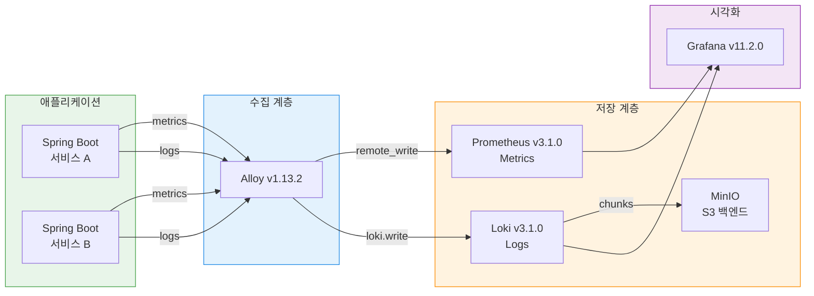
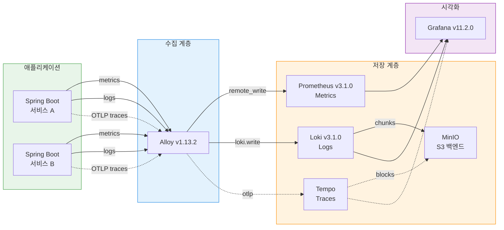

# Grafana Tempo 도입 PoC — 주간보고

> 작성일: 2026-03-17
> 목적: TPS 모니터링 스택에 분산 추적(Distributed Tracing) 도입을 위한 Grafana Tempo PoC 조사 결과 정리

---

## 1. 배경 — 왜 Tempo가 필요한가

관측성(Observability)은 세 가지 축으로 구성된다.

| 축 | 도구 | 상태 |
|---|------|------|
| Metrics | Prometheus (kube-prometheus-stack v68.1.0) | 운영 중 |
| Logs | Loki v3.1.0 + Alloy v1.13.2 | 운영 중 |
| **Traces** | **미구현** | **부재** |

Metrics는 "무엇이 느린가"를 알려주고, Logs는 "무엇이 실패했는가"를 알려준다. 하지만 마이크로서비스 환경에서 요청 하나가 여러 서비스를 거칠 때, 어느 구간에서 지연이 발생했는지 추적하려면 Traces가 필요하다. 현재 TPS 개발계에서 API 지연이나 서비스 간 호출 문제가 발생하면, 각 서비스 로그를 시간 기준으로 수동 대조해야 한다. Tempo를 도입하면 요청의 전체 경로를 하나의 트레이스로 시각화할 수 있다.

Grafana Tempo를 선택하는 이유는 기존 스택과의 궁합이다. Grafana가 이미 운영 중이므로 데이터소스 추가만으로 트레이스 조회가 가능하고, Loki 로그와 Prometheus 메트릭을 트레이스 ID로 상호 연결(Exemplar)할 수 있다. 별도의 Elasticsearch나 Cassandra 같은 무거운 의존성이 없고, 오브젝트 스토리지(MinIO/GCS)만 있으면 된다.

---

## 2. 현재 모니터링 아키텍처 (AS-IS)



현재 Alloy가 메트릭과 로그를 수집하여 Prometheus와 Loki로 전송한다. Loki는 MinIO를 S3 호환 백엔드로 사용하고 있다. Grafana에서 두 데이터소스를 조회할 수 있지만, **트레이스 데이터소스는 없다.**

---

## 3. Tempo 도입 후 아키텍처 (TO-BE)



점선이 새로 추가되는 트레이스 경로다. 변경점은 세 가지이다.

1. **애플리케이션**: OpenTelemetry SDK(또는 Java Agent)를 추가하여 OTLP 프로토콜로 트레이스를 Alloy에 전송한다.
2. **Alloy**: 트레이스 수신 파이프라인(`otelcol.receiver.otlp` → `otelcol.exporter.otlp`)을 추가한다.
3. **Tempo**: 새로 배포하여 트레이스를 저장하고, MinIO를 스토리지 백엔드로 사용한다.

Grafana에는 Tempo 데이터소스를 추가하면 된다. 이후 로그에 트레이스 ID를 포함시키면 Loki ↔ Tempo 간 상호 링크가 가능하다.

### 3-1. 데이터 흐름 상세

```
App (OTel SDK/Agent)
  → OTLP/gRPC (port 4317)
    → Alloy (otelcol.receiver.otlp)
      → Alloy (otelcol.exporter.otlp)
        → Tempo (port 4317)
          → WAL → Block → MinIO (S3)
```

---

## 4. Tempo 컴포넌트 설명

Tempo는 내부적으로 다음 컴포넌트로 구성된다. Monolithic 모드에서는 하나의 프로세스가 모든 역할을 수행한다.

| 컴포넌트 | 역할 |
|----------|------|
| **Distributor** | 수신된 스팬을 검증하고 Ingester로 라우팅한다 |
| **Ingester** | 스팬을 WAL(Write-Ahead Log)에 기록하고, 일정 조건이 되면 블록으로 플러시한다 |
| **Querier** | 트레이스 ID로 데이터를 조회한다. Ingester(최근 데이터)와 백엔드 스토리지(과거 데이터)를 모두 검색한다 |
| **Compactor** | 소규모 블록을 병합하여 스토리지를 최적화하고, 리텐션 기간이 지난 블록을 삭제한다 |
| **Query Frontend** | 검색 요청을 분할하여 병렬 처리하고, 캐싱을 담당한다 |
| **Metrics Generator** | 트레이스에서 RED 메트릭(Rate/Error/Duration)을 자동 생성하여 Prometheus로 전송한다 (선택 사항) |

---

## 5. 배포 모드 선택

Tempo는 두 가지 배포 모드를 제공한다.

| 항목 | Monolithic | Distributed (Microservices) |
|------|-----------|---------------------------|
| Helm Chart | `tempo` | `tempo-distributed` |
| 프로세스 수 | 1개 | 컴포넌트별 개별 Pod |
| 적합 규모 | 초당 ~100 span | 초당 수천~수만 span |
| 운영 복잡도 | 낮음 | 높음 (각 컴포넌트 개별 스케일링) |
| 고가용성 | 불가 | 가능 (Ingester 복제 등) |

**TPS 개발계 권장: Monolithic 모드**

근거는 다음과 같다. TPS 개발계의 트래픽 규모를 고려하면 초당 100 span을 넘기기 어렵다. 개발자 수십 명이 동시 테스트하더라도 Monolithic 모드의 처리 한계에 도달하지 않는다. 운영 복잡도가 낮아 PoC에 적합하고, 추후 트래픽이 증가하면 Distributed 모드로 전환할 수 있다.


## 6. 자원 산정

### 6-1. 최소 사양 (PoC / 개발계, 초당 100 span 이내)

| 항목 | 사양 | 비고 |
|------|------|------|
| CPU | 0.5~1 core | Monolithic 단일 Pod |
| Memory | 1~2 GB | WAL replay 피크 고려 |
| Storage | MinIO (기존) 활용 | 별도 PV 불필요 |

Monolithic 모드에서 Go 런타임 기본 메모리가 100~150MB, WAL replay 시 피크가 추가로 발생하므로 1GB를 최소로 잡는다. OOM 방지를 위해 2GB를 권장한다.

### 6-2. 공식 권장 사양 (프로덕션, Distributed 모드)

Grafana 공식 문서 기준 프로덕션 Distributed 모드의 컴포넌트별 권장 사양이다. 이 사양은 **초당 수천~수만 span, 수백 서비스 규모**의 대규모 배포를 전제로 한다. TPS 개발계(초당 10~50 span, 수십 서비스)와는 규모 차이가 크므로 참고용으로만 기록한다.

| 컴포넌트 | CPU | Memory | 비고 |
|----------|-----|--------|------|
| Distributor | 2 core | 2 GB | 수신 처리, 수평 확장 가능 |
| Ingester | 2.5 core | 4~20 GB | WAL 크기에 비례, 가장 자원 소모 큼 |
| Querier | 1~2 core | 4~20 GB | 조회 복잡도에 비례 |
| Compactor | 1 core | 2~4 GB | 백그라운드 블록 병합 |
| Query Frontend | 1 core | 1~2 GB | 캐싱 및 분산 처리 |
| **합계** | **7.5~8.5 core** | **13~48 GB** | 최소~최대 범위 |

> **PoC vs 프로덕션 비교**: PoC 최소 사양은 0.5~1C / 1~2GB, 프로덕션 공식 권장은 7.5~8.5C / 13~48GB로 약 10~25배 차이다. TPS 개발계는 PoC 최소 사양이면 충분하다.

### 6-3. 스토리지 비용 추정

스팬 하나의 평균 크기를 1~2KB로 가정하고, Tempo의 블록 압축률(~10:1)을 적용한다.

| 시나리오 | 초당 span | 일일 raw 데이터 | 압축 후 (일) | 월간 (30일) |
|----------|----------|----------------|-------------|------------|
| 저부하 (개발계) | 10 | ~1.7 GB | ~170 MB | ~5 GB |
| 중부하 | 50 | ~8.6 GB | ~860 MB | ~26 GB |
| 상한 (Monolithic) | 100 | ~17.3 GB | ~1.7 GB | ~52 GB |

TPS 개발계에서는 초당 10~50 span이 현실적이다. 월간 5~26GB 수준으로, MinIO에 여유 공간만 있으면 별도 비용이 발생하지 않는다.

리텐션을 3일(72h)로 설정하면 저장량은 월간 대비 1/10 수준으로 줄어든다.

| 리텐션 | 저장량 (초당 50 span 기준) |
|--------|--------------------------|
| 72h (3일) | ~2.6 GB |
| 168h (7일) | ~6 GB |
| 720h (30일) | ~26 GB |


## 7. Alloy 설정 변경점

현재 Alloy는 메트릭과 로그 파이프라인만 구성되어 있다. 트레이스 파이프라인을 추가해야 한다.

### 7-1. 추가할 Alloy 설정

```alloy
// ① OTLP 수신기 — 애플리케이션에서 트레이스를 받는다
otelcol.receiver.otlp "default" {
  grpc {
    endpoint = "0.0.0.0:4317"
  }
  http {
    endpoint = "0.0.0.0:4318"
  }
  output {
    traces = [otelcol.processor.batch.default.input]
  }
}

// ② 배치 프로세서 — 스팬을 묶어서 전송 효율을 높인다
otelcol.processor.batch "default" {
  timeout = "5s"
  send_batch_size = 1000
  output {
    traces = [otelcol.exporter.otlp.tempo.input]
  }
}

// ③ Tempo로 전송
otelcol.exporter.otlp "tempo" {
  client {
    endpoint = "tempo:4317"
    tls {
      insecure = true
    }
  }
}
```

### 7-2. 애플리케이션 측 변경

Spring Boot 애플리케이션에 OpenTelemetry Java Agent를 추가한다. 코드 변경 없이 JVM 옵션으로 적용 가능하다.

```bash
java -javaagent:opentelemetry-javaagent.jar \
     -Dotel.service.name=my-service \
     -Dotel.exporter.otlp.endpoint=http://alloy:4317 \
     -Dotel.exporter.otlp.protocol=grpc \
     -jar app.jar
```

Spring Boot 3.x의 경우 Micrometer Tracing + OpenTelemetry Bridge를 의존성으로 추가하는 방법도 있다. Java Agent 방식이 코드 변경이 없어 PoC에 더 적합하다.

---

## 8. 도입 시 고려사항

### 8-1. 샘플링

초당 100 span 이하이면 **전량 저장**이 가능하다. 저장 비용이 무시할 수준이므로 샘플링을 적용하지 않아도 된다. 트래픽이 증가하면 Alloy에서 tail-based sampling을 설정하여 에러/느린 요청만 보존하는 방식으로 전환할 수 있다.

### 8-2. 보존기간 (Retention)

PoC 단계에서는 72h(3일)를 권장한다. 개발계에서 3일 이상 지난 트레이스를 조회할 일은 드물고, 스토리지 부담을 최소화할 수 있다. 프로덕션 도입 시에는 인시던트 분석을 위해 7일 이상으로 확대를 검토한다.

### 8-3. 인증

개발계 내부 네트워크에서만 접근하므로 Tempo 자체 인증은 불필요하다. Grafana에서 Tempo 데이터소스 추가 시 별도 인증 없이 내부 Service URL로 연결하면 된다.

### 8-4. Metrics Generator

Tempo의 Metrics Generator는 트레이스에서 자동으로 서비스별 요청률(Rate), 에러률(Error), 지연시간(Duration) 메트릭을 생성한다. 이를 Prometheus에 remote_write하면 별도 메트릭 계측 없이 RED 대시보드를 구성할 수 있다. PoC 초기에는 비활성화하고, 안정화 후 활성화를 검토한다.

### 8-5. 기존 스택 영향도

| 구성요소 | 영향 |
|----------|------|
| Prometheus | 없음 (Tempo와 독립) |
| Loki | 없음 (추후 TraceID 연결만 추가) |
| Alloy | 설정 추가 필요 (트레이스 파이프라인) |
| Grafana | 데이터소스 추가만 (기존 대시보드 영향 없음) |
| MinIO | 버킷 추가 (기존 Loki 버킷과 분리) |

기존 운영 중인 Metrics/Logs 수집에는 영향이 없다. Alloy에 파이프라인을 추가하는 것이므로 기존 파이프라인은 그대로 동작한다.

---

## 9. 다음 단계 — PoC 실행 계획

| 단계 | 내용 | 예상 소요 |
|------|------|----------|
| 1 | Tempo Helm chart 준비 및 values.yaml 작성 | 0.5일 |
| 2 | 개발계 K8s에 Tempo Monolithic 배포 | 0.5일 |
| 3 | Alloy 트레이스 파이프라인 추가 | 0.5일 |
| 4 | 테스트 앱에 OTel Java Agent 적용 | 0.5일 |
| 5 | Grafana 데이터소스 추가 및 트레이스 조회 검증 | 0.5일 |
| 6 | Loki ↔ Tempo TraceID 연결 검증 | 0.5일 |
| 7 | 자원 사용량 측정 및 결과 정리 | 1일 |

총 예상 소요: **4일**

### 9-1. PoC 완료 조건

- Grafana에서 트레이스 ID로 조회 시 서비스 간 호출 경로가 시각화되는 것을 확인
- Loki 로그에서 트레이스 ID 클릭 시 Tempo 트레이스로 이동하는 것을 확인
- 1시간 부하 테스트 후 Tempo Pod OOM 없이 안정적으로 동작하는 것을 확인
- 자원 사용량(CPU, Memory, Storage)이 산정 범위 내인 것을 확인
