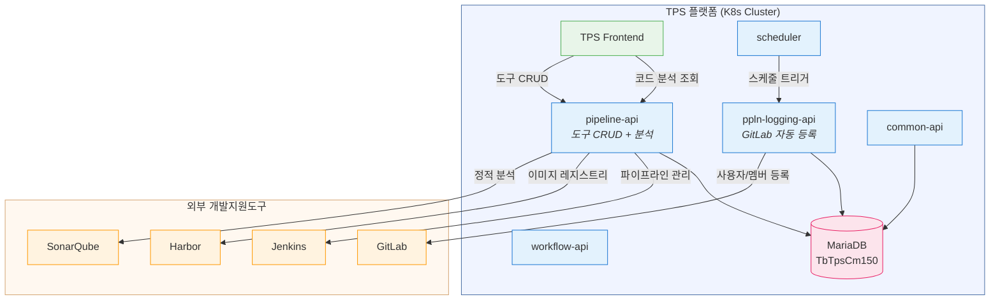
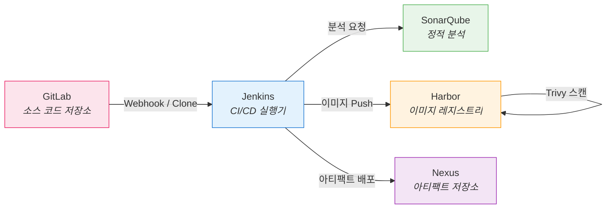
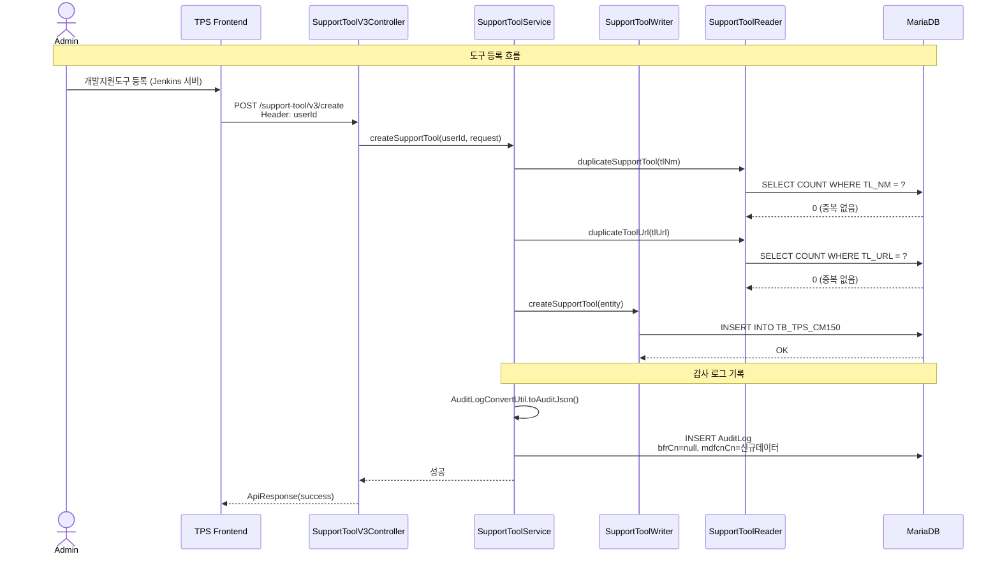
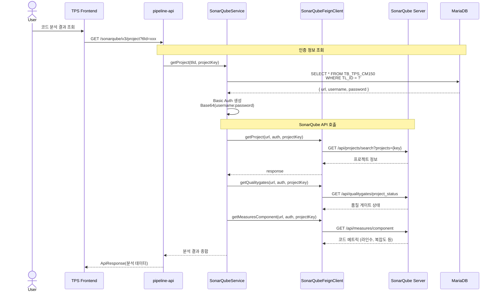
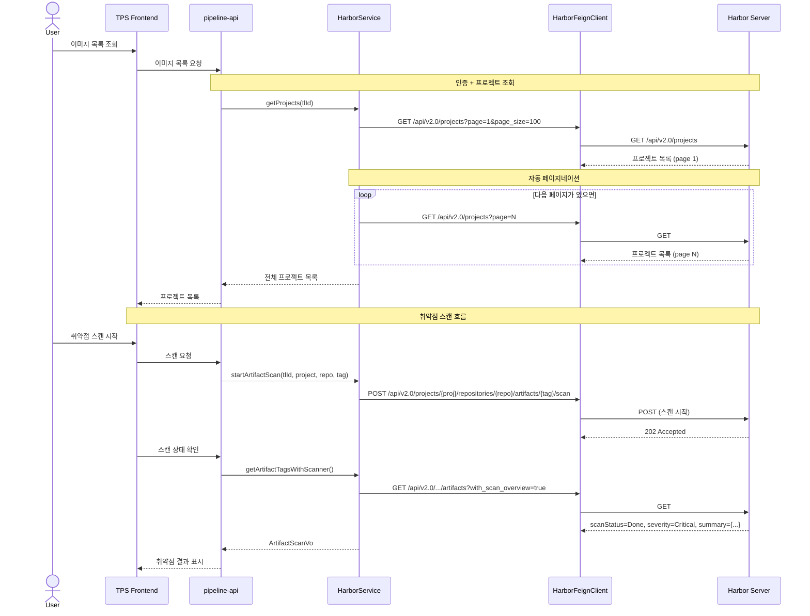
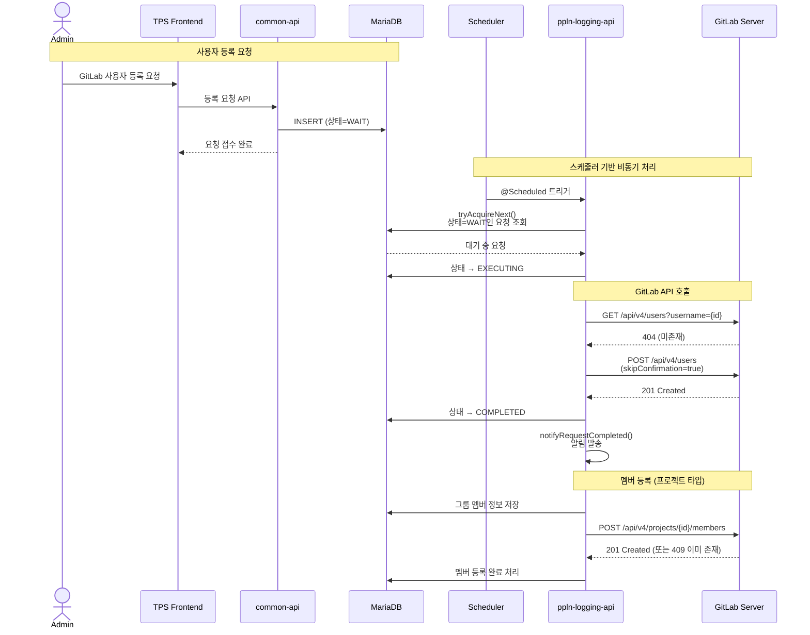
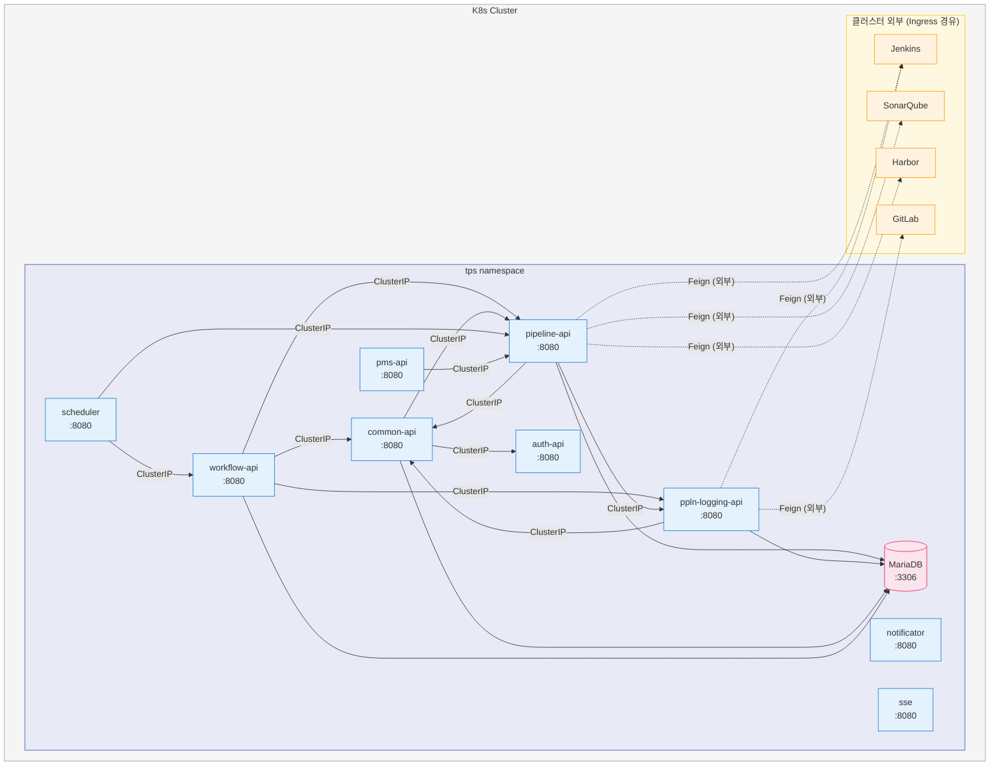
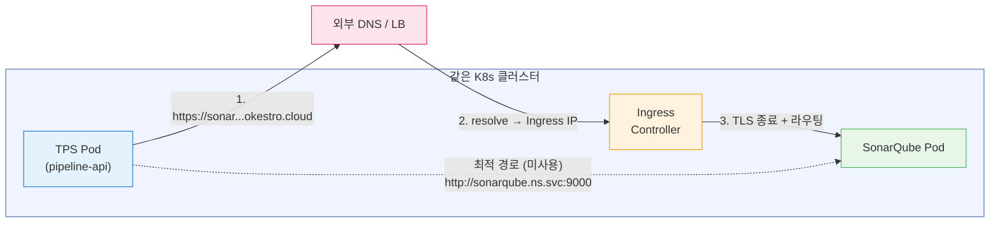

# 개발지원도구(SupportTool) 사용 분석

TPS 플랫폼에서 개발지원도구란 Jenkins, GitLab, SonarQube, Harbor, Nexus 등 소프트웨어 개발 생명주기에 필요한 외부 도구들을 중앙에서 등록하고 관리하는 시스템이다. 핵심 테이블 `TbTpsCm150`에 도구의 접속 정보(URL, 인증)를 저장하고, 파이프라인이나 워크플로우에서 이 정보를 참조하여 외부 도구와 통신한다. 도구 등록은 pipeline-api가 담당하고, GitLab 사용자/멤버 자동 등록은 ppln-logging-api의 스케줄러가 처리한다.

---

## 1. 전체 아키텍처

개발지원도구 시스템의 핵심은 "도구 레지스트리" 패턴이다. 각 모듈이 외부 도구에 직접 접근하지 않고, 중앙 레지스트리(TbTpsCm150)에서 접속 정보를 조회한 뒤 Feign Client로 호출한다. 이 구조 덕분에 도구 URL이나 인증 정보가 변경되어도 레지스트리만 업데이트하면 모든 모듈이 새 정보를 사용하게 된다.



---

## 2. 도구 유형 관계

TPS가 관리하는 개발지원도구들은 CI/CD 파이프라인 내에서 서로 연동된다. GitLab이 소스 코드 저장소, Jenkins가 빌드/배포 실행기, SonarQube가 정적 분석 도구, Harbor가 컨테이너 이미지 저장소 역할을 맡는다. 이 도구들은 독립적으로 존재하지만, 파이프라인 실행 시 순차적으로 호출된다.



---

## 3. SupportTool CRUD 흐름

개발지원도구의 생명주기는 SupportToolV3Controller → SupportToolService → SupportToolWriter/Reader → MyBatis Mapper 순서로 처리된다. v3 아키텍처에서는 Command(쓰기)와 Query(읽기)를 분리한 CQRS 패턴을 적용했다. 모든 변경 작업에는 감사 로그(AuditLog)가 기록되어, 변경 전/후 데이터를 JSON으로 비교할 수 있다.

**REST 엔드포인트** (기본 URL: `/support-tool/v3`):

| HTTP | 경로 | 설명 |
|------|------|------|
| POST | `/create` | 도구 등록 |
| POST | `/update` | 도구 수정 |
| POST | `/delete` | 도구 삭제 (논리적) |
| GET | `/select/{tlId}` | 단건 조회 |
| POST | `/select/list` | 페이지네이션 목록 조회 |
| GET | `/duplicate` | 도구명 중복 검사 |
| GET | `/duplicate/url` | URL 중복 검사 |
| GET | `/exists` | 카테고리별 존재 여부 |
| POST | `/select/list/harbor` | Harbor 타입만 필터 조회 |



---

## 4. 데이터 모델 (TbTpsCm150)

개발지원도구의 핵심 테이블이다. 모든 외부 도구의 접속 정보를 이 테이블 하나에서 관리한다. 인증 정보(TL_CNTN_ID, TL_SGNL)는 암호화되어 저장되며, 조회 시 복호화 후 Base64 또는 OAuth2 토큰으로 변환하여 외부 API를 호출한다.

| 컬럼 | 타입 | 설명 |
|------|------|------|
| TL_ID | String (PK) | 도구 고유 ID |
| INOUT_SE | String | 내/외부 구분 (IN/OUT) |
| TL_NM | String | 도구 이름 (유니크) |
| TL_CTGRY | String | 도구 카테고리 코드 |
| TL_URL | String | 접속 URL (유니크) |
| TL_TYPE_CD | String | 도구 유형 코드 |
| TL_CNTN_ID | String | 접속 ID (암호화) |
| TL_SGNL | String | 접속 비밀번호 (암호화) |
| EXPLN | String | 설명 |
| USE_YN | String | 사용 여부 (Y/N) |
| DEL_YN | String | 삭제 여부 (Y/N, 논리적 삭제) |

---

## 5. SonarQube 연동 흐름

SonarQubeService는 pipeline-api 내에서 정적 분석 결과를 조회하고 이슈를 관리한다. 도구 접속 정보를 TbTpsCm150에서 가져와 Basic Auth로 SonarQube API를 호출한다. 두 가지 조회 경로가 있는데, `tlId`로 직접 도구를 지정하거나, `taskCd + envrnCd`로 업무 환경에 연결된 도구를 자동 매핑할 수 있다.



**SonarQube 주요 API 호출:**

| 메서드 | SonarQube API | 설명 |
|--------|---------------|------|
| `getProject()` | `GET /api/projects/search` | 프로젝트 조회 |
| `getBranches()` | `GET /api/project_branches/list` | 브랜치 목록 |
| `getQualitygates()` | `GET /api/qualitygates/project_status` | 품질 게이트 |
| `getMeasuresComponent()` | `GET /api/measures/component` | 코드 메트릭 |
| `getIssuesSearch()` | `GET /api/issues/search` | 이슈(결함/취약점) 검색 |
| `getIssueSnippets()` | `GET /api/sources/issue_snippets` | 이슈 코드 스니펫 |
| `createProject()` | `POST /api/projects/create` | 프로젝트 생성 |

---

## 6. Harbor 연동 흐름

HarborService는 컨테이너 이미지 레지스트리인 Harbor와 연동하여, 프로젝트/레포지토리/아티팩트 관리 및 취약점 스캔을 수행한다. Harbor API v2.0을 사용하며, 100건 단위 자동 페이지네이션으로 대량 데이터를 처리한다. 취약점 스캔은 Harbor 내장 Trivy 스캐너를 활용하며, 스캔 시작 후 상태를 폴링하여 결과를 수집한다.



---

## 7. GitLab 동기화 흐름

ppln-logging-api에서 GitLab 사용자/멤버 등록은 스케줄러 기반 비동기 처리로 동작한다. 사용자가 TPS에서 멤버를 추가하면 DB에 "대기" 상태로 등록 요청을 남기고, 스케줄러가 주기적으로 대기 요청을 가져와 GitLab API를 호출한다. 이 비동기 패턴을 사용하는 이유는 GitLab API 호출 실패 시 재시도가 용이하고, 대량 등록 시 스로틀링을 자연스럽게 적용할 수 있기 때문이다.



**예외 처리:**
- GitLab 사용자 이미 존재: `GitLabUserAlreadyExistsException` → 실패 상태 저장
- 프로젝트 멤버 409 Conflict: 이미 존재하므로 성공으로 처리
- 기본 비밀번호: `cloud1234` (초기 등록 시)

---

## 8. K8s 환경에서의 서비스 통신

### 8.1 서비스 간 통신 방식

TPS의 모든 마이크로서비스는 K8s 내에서 ClusterIP Service를 통해 통신한다. 각 모듈의 `application-k8s.yml`에 `trb.services.{서비스명}.url` 형태로 다른 서비스의 URL을 선언하고, 이 값은 K8s ConfigMap을 통해 배포 시 주입된다. 실제 값은 `http://{service-name}:{port}` 형태의 K8s 내부 DNS를 사용하므로, Ingress나 외부 로드밸런서를 거치지 않고 클러스터 내부에서 직접 통신한다.

**각 서비스의 의존 관계:**

| 서비스 | 의존 대상 |
|--------|----------|
| pipeline-api | ppln-logging-api, workflow-api, common-api, notificator |
| ppln-logging-api | workflow-api, common-api |
| workflow-api | common-api, pipeline-api, ppln-logging-api, notificator, pms-api |
| common-api | auth-api, pipeline-api, notificator, sse |
| scheduler | common-api, workflow-api, pipeline-api |
| pms-api | pipeline-api, common-api |
| auth-api | common-api |
| notificator | auth-api, common-api |



### 8.2 내부 통신 vs 외부 통신

TPS 서비스 간 통신과 외부 도구 통신은 근본적으로 다른 메커니즘을 사용한다.

**내부 통신 (TPS 서비스 간):**
- 방식: Spring Cloud OpenFeign + K8s ClusterIP DNS
- URL 패턴: `http://{service-name}:8080` (K8s Service DNS)
- 설정: `application-k8s.yml`의 `trb.services.{name}.url` → ConfigMap으로 주입
- DNS 해석: `{service-name}.{namespace}.svc.cluster.local`
- 인증: 내부 JWT 토큰 전달 (JwtFeignClient로 검증)

**외부 통신 (개발지원도구 연동):**
- 방식: Spring Cloud OpenFeign + 동적 URL
- URL 패턴: DB(TbTpsCm150)에서 조회한 외부 URL
- 인증: Basic Auth(Jenkins, SonarQube) 또는 OAuth2(GitLab)
- 특징: Feign Client의 `url`에 placeholder(`"https://"`)를 넣고, 호출 시 `URI` 파라미터로 실제 URL을 동적 주입

```java
// 내부 통신 - URL이 설정에 고정됨
@FeignClient(name = "pipeline-feign", url = "${trb.services.pipeline-api.url}")
public interface PipelineFeignClient { ... }

// 외부 통신 - URL이 호출마다 달라짐 (DB에서 조회)
@FeignClient(name = "jenkins", url = "https://")
public interface JenkinsFeignClient {
    @GetMapping("/{pipelineStruct}/api/json")
    ResponseEntity<?> getPipelineInfo(URI baseUrl, ...);
    // baseUrl은 TbTpsCm150.TL_URL에서 동적으로 전달
}
```

### 8.3 K8s 설정 구조

`application-k8s.yml`의 `{url}` placeholder는 배포 시 K8s ConfigMap에서 실제 서비스 URL로 치환된다. 이 패턴을 사용하면 환경(dev/stg/prd)별로 ConfigMap만 교체하여 배포 대상을 전환할 수 있다.

```yaml
# application-k8s.yml (pipeline-api)
trb:
  services:
    ppln-logging-api:
      url: {url}           # → ConfigMap: http://ppln-logging-api:8080
    workflow-api:
      url: {url}           # → ConfigMap: http://workflow-api:8080
    common-api:
      url: {url}           # → ConfigMap: http://common-api:8080
  datasource:
    jdbc-url: ${jdbc-url}  # → Secret: jdbc:mariadb://mariadb:3306/tps
  crypto:
    key: {key}             # → Secret: 암호화 키
```

### 8.4 개발지원도구 간 통신 흐름 (K8s 관점)

개발지원도구끼리 직접 통신하는 경우는 제한적이다. 대부분 TPS 서비스가 중재자 역할을 하여, 도구 A의 결과를 받아 도구 B에 전달하는 패턴이다. 예를 들어 Jenkins가 SonarQube 분석을 직접 호출하는 것은 Jenkinsfile 내 스크립트로 처리되지만, TPS에서 SonarQube 결과를 조회하는 것은 pipeline-api가 SonarQube API를 직접 호출한다.

유일하게 도구 간 직접 통신이 발생하는 경우는 Jenkins ↔ GitLab(Webhook, Clone), Jenkins → Harbor(이미지 Push), Jenkins → SonarQube(분석 실행)이며, 이는 Jenkinsfile에 정의된 스크립트에 의해 Jenkins Pod 또는 Agent에서 실행된다. TPS는 이 통신에 관여하지 않고 결과만 수집한다.

```
1. GitLab → Jenkins (직접 통신, K8s 외부 네트워크)
   GitLab Webhook → Jenkins URL (Push 이벤트 시 빌드 트리거)

2. Jenkins → GitLab (직접 통신)
   git clone (Jenkinsfile 내 checkout 단계)

3. Jenkins → SonarQube (직접 통신)
   sonar-scanner 플러그인 호출 (Jenkinsfile 내 분석 단계)

4. Jenkins → Harbor (직접 통신)
   docker push (Jenkinsfile 내 이미지 배포 단계)

5. TPS → 각 도구 (중재자 통신)
   pipeline-api → SonarQube (분석 결과 조회)
   pipeline-api → Harbor (이미지/취약점 조회)
   ppln-logging-api → Jenkins (로그/상태 수집)
   ppln-logging-api → GitLab (사용자/멤버 관리)
```

### 8.5 도구 URL과 실제 네트워크 경로

TbTpsCm150에 등록되는 `TL_URL`은 관리자가 직접 입력한 URL이다. 실제 운영 환경에서 `https://sonarqube-test-1.dev.console.trombone.okestro.cloud` 같은 외부 도메인이 등록되면, 해당 도구가 같은 K8s 클러스터 안에 있더라도 트래픽은 클러스터 밖으로 나갔다가 다시 들어온다. 이는 DNS가 외부 IP(또는 Ingress의 External IP)로 해석되기 때문이다.

**같은 클러스터 내 도구인데 외부 도메인으로 등록한 경우:**

```
TPS Pod (pipeline-api)
  → K8s CoreDNS: "sonarqube-test-1.dev.console.trombone.okestro.cloud" 해석
  → 외부 DNS로 포워딩 (CoreDNS → upstream DNS)
  → Ingress Controller의 External IP로 resolve
  → 트래픽이 Node → 외부 LB → Ingress Controller → SonarQube Pod
```



이 구조에서 불필요한 네트워크 홉이 발생하지만, 실무에서는 의도적으로 이 방식을 선택하는 경우가 많다. Ingress에서 TLS 종료를 하므로 `https://` URL을 쓰려면 Ingress를 거쳐야 하고, 외부 사용자와 동일한 URL을 사용함으로써 관리 포인트를 줄일 수 있기 때문이다.

**도구 배포 환경별 URL 등록 패턴:**

개발지원도구는 VM, Docker, K8s 등 다양한 환경에 배포될 수 있다. TPS 코드는 `TL_URL`이 어디를 가리키든 동일하게 Feign Client에 URI로 전달하므로, 도구의 배포 환경에 따라 관리자가 적절한 URL을 등록하면 된다.

| 도구 배포 환경 | TL_URL 예시 | 네트워크 경로 |
|--------------|------------|-------------|
| **VM (외부)** | `https://jenkins.company.com` | TPS Pod → 외부 네트워크 → VM |
| **Docker (외부 서버)** | `https://sonar.company.com:9000` | TPS Pod → 외부 네트워크 → Docker Host |
| **같은 K8s (외부 도메인)** | `https://sonar-test.dev.console.okestro.cloud` | TPS Pod → 외부 DNS → Ingress → Pod (헤어핀) |
| **같은 K8s (내부 DNS)** | `http://sonarqube.tools.svc.cluster.local:9000` | TPS Pod → ClusterIP → Pod (직접) |
| **다른 K8s 클러스터** | `https://jenkins.prod.okestro.cloud` | TPS Pod → 외부 네트워크 → 대상 클러스터 Ingress |

### 8.6 SSL/TLS 고려사항

개발지원도구가 VM, Docker, K8s 어디에 배포되든 TPS와의 통신에서 SSL을 적용하려면 환경별로 다른 전략이 필요하다. 핵심은 "누가 인증서를 관리하고, 어디서 TLS를 종료하는가"이다.

#### 환경별 TLS 종료 지점

```mermaid
graph TB
    subgraph VM환경["VM 배포"]
        VM_TPS["TPS Pod"] -->|"https"| VM_LB["리버스 프록시<br/>(Nginx/HAProxy)"]
        VM_LB -->|"http (내부)"| VM_TOOL["Jenkins / SonarQube<br/>(VM 프로세스)"]
    end

    subgraph Docker환경["Docker 배포"]
        DK_TPS["TPS Pod"] -->|"https"| DK_PROXY["리버스 프록시<br/>(Nginx 컨테이너)"]
        DK_PROXY -->|"http (docker network)"| DK_TOOL["Jenkins / SonarQube<br/>(Docker 컨테이너)"]
    end

    subgraph K8s환경["K8s 배포"]
        K8_TPS["TPS Pod"] -->|"https"| K8_ING["Ingress Controller<br/>(cert-manager)"]
        K8_ING -->|"http (ClusterIP)"| K8_TOOL["Jenkins / SonarQube<br/>(Pod)"]
    end

    style VM환경 fill:#f5f5f5,stroke:#9e9e9e,color:#333
    style Docker환경 fill:#f5f5f5,stroke:#9e9e9e,color:#333
    style K8s환경 fill:#f5f5f5,stroke:#9e9e9e,color:#333
    style VM_TPS fill:#e3f2fd,stroke:#1976d2,color:#333
    style DK_TPS fill:#e3f2fd,stroke:#1976d2,color:#333
    style K8_TPS fill:#e3f2fd,stroke:#1976d2,color:#333
    style VM_LB fill:#fff3e0,stroke:#ff9800,color:#333
    style DK_PROXY fill:#fff3e0,stroke:#ff9800,color:#333
    style K8_ING fill:#fff3e0,stroke:#ff9800,color:#333
    style VM_TOOL fill:#e8f5e9,stroke:#4caf50,color:#333
    style DK_TOOL fill:#e8f5e9,stroke:#4caf50,color:#333
    style K8_TOOL fill:#e8f5e9,stroke:#4caf50,color:#333
```



공통 패턴은 도구 앞단에 리버스 프록시(Nginx, HAProxy, Ingress)를 두고 거기서 TLS를 종료하는 것이다. 도구 자체에 인증서를 넣는 방식은 도구마다 설정이 달라 관리 비용이 높기 때문이다.

#### 환경별 SSL 적용 방법

**1. VM 배포**

| 항목 | 내용 |
|------|------|
| TLS 종료 | Nginx/Apache 리버스 프록시 |
| 인증서 관리 | Let's Encrypt(certbot 자동 갱신) 또는 사내 CA |
| 인증서 위치 | `/etc/nginx/ssl/` 또는 `/etc/letsencrypt/live/` |
| 도구 설정 | 도구 자체는 HTTP(8080 등), 프록시가 443 → 8080 포워딩 |
| 갱신 | certbot renew + nginx reload (cron) |

```nginx
# Nginx 리버스 프록시 예시
server {
    listen 443 ssl;
    server_name jenkins.company.com;
    ssl_certificate     /etc/letsencrypt/live/jenkins.company.com/fullchain.pem;
    ssl_certificate_key /etc/letsencrypt/live/jenkins.company.com/privkey.pem;

    location / {
        proxy_pass http://localhost:8080;  # Jenkins는 HTTP로 동작
    }
}
```

**2. Docker 배포**

| 항목 | 내용 |
|------|------|
| TLS 종료 | Nginx 컨테이너 또는 Traefik |
| 인증서 관리 | Traefik + Let's Encrypt(ACME) 자동 발급/갱신 |
| 인증서 위치 | Docker Volume 또는 Traefik 자동 관리 |
| 도구 설정 | Docker 내부 네트워크에서 HTTP 통신, 외부만 HTTPS |
| 장점 | Traefik은 Docker 라벨만으로 라우팅 + 인증서 설정 가능 |

```yaml
# docker-compose.yml 예시 (Traefik)
services:
  traefik:
    image: traefik:v3.0
    command:
      - --certificatesresolvers.le.acme.email=admin@company.com
      - --certificatesresolvers.le.acme.storage=/acme/acme.json
    ports: ["443:443"]

  sonarqube:
    image: sonarqube:lts
    labels:
      - "traefik.http.routers.sonar.rule=Host(`sonar.company.com`)"
      - "traefik.http.routers.sonar.tls.certresolver=le"
    # 내부에서는 HTTP(9000)로 동작, Traefik이 TLS 처리
```

**3. K8s 배포**

| 항목 | 내용 |
|------|------|
| TLS 종료 | Ingress Controller (nginx-ingress, istio-gateway 등) |
| 인증서 관리 | cert-manager + Let's Encrypt 또는 사내 CA Issuer |
| 인증서 위치 | K8s Secret (cert-manager가 자동 생성/갱신) |
| 도구 설정 | Pod는 HTTP, Ingress에서 TLS 종료 |
| 갱신 | cert-manager가 만료 30일 전 자동 갱신 |

```yaml
# Ingress + cert-manager 예시
apiVersion: networking.k8s.io/v1
kind: Ingress
metadata:
  name: sonarqube
  annotations:
    cert-manager.io/cluster-issuer: letsencrypt-prod
spec:
  tls:
    - hosts: ["sonar-test.dev.console.okestro.cloud"]
      secretName: sonarqube-tls  # cert-manager가 자동 생성
  rules:
    - host: sonar-test.dev.console.okestro.cloud
      http:
        paths:
          - path: /
            pathType: Prefix
            backend:
              service:
                name: sonarqube
                port: { number: 9000 }
```

#### TPS Feign Client 측 SSL 고려사항

도구 앞단에서 TLS를 종료하는 것과 별개로, TPS 애플리케이션(Feign Client) 측에서도 SSL 관련 설정이 필요할 수 있다.

| 시나리오 | TPS 측 대응 |
|---------|-----------|
| **공인 CA 인증서** (Let's Encrypt 등) | JDK 기본 truststore에 포함되어 있으므로 추가 설정 없음 |
| **사내 CA (Private CA)** | JDK truststore에 사내 CA Root 인증서 추가 필요 |
| **자체 서명 인증서 (Self-signed)** | truststore에 개별 인증서 추가, 또는 SSL 검증 비활성화 (비권장) |
| **K8s 내부 통신 (HTTP)** | `TL_URL`을 `http://` 내부 DNS로 등록하면 SSL 불필요 |

사내 CA 인증서를 사용하는 경우, TPS Pod의 JDK truststore에 CA 인증서를 넣어야 한다. 이는 Dockerfile에서 처리하거나 K8s initContainer로 주입할 수 있다.

```dockerfile
# Dockerfile에서 사내 CA 추가
COPY company-ca.crt /usr/local/share/ca-certificates/
RUN update-ca-certificates
# Java truststore에도 추가
RUN keytool -import -trustcacerts -keystore $JAVA_HOME/lib/security/cacerts \
    -storepass changeit -noprompt -alias company-ca -file /usr/local/share/ca-certificates/company-ca.crt
```

#### SSL 적용 결정 매트릭스

어떤 환경에서든 SSL 적용 여부를 결정할 때 고려할 요소를 정리하면 다음과 같다.

| 결정 요소 | 외부 도메인 사용 | 내부 DNS 사용 |
|----------|---------------|-------------|
| TLS 필수 여부 | 필수 (공개 네트워크 경유) | 선택 (클러스터 내부) |
| 인증서 종류 | 공인 CA 또는 사내 CA | 불필요 또는 mTLS |
| TPS truststore | 공인 CA면 기본 포함, 사내 CA면 추가 필요 | 불필요 |
| 성능 영향 | TLS 핸드셰이크 + Ingress 홉 | 오버헤드 없음 |
| 관리 복잡도 | 인증서 갱신 자동화 필요 | 낮음 |
| 보안 수준 | 높음 (전송 암호화) | 네트워크 정책으로 보완 |

K8s 클러스터 내부 통신에서 TLS 없이 HTTP를 사용하는 것이 보안 위험으로 느껴질 수 있지만, K8s NetworkPolicy로 Pod 간 통신을 제한하거나, Service Mesh(Istio/Linkerd)의 mTLS를 적용하면 애플리케이션 레벨 TLS 없이도 전송 구간 암호화를 달성할 수 있다.

### 8.7 SSL/TLS 실제 해결사례

#### Case 1: Jenkins ↔ GitLab PKIX 에러 (사내 CA 신뢰 문제)

**증상:** Jenkins에서 GitLab 레포를 클론할 때 `SunCertPathBuilderException: unable to find valid certification path` 발생.

**원인:** GitLab이 사내 CA 서명 인증서를 사용하는데, Jenkins JVM의 cacerts에 해당 CA가 없다.

**해결 (K8s — initContainer 패턴):** Jenkins Deployment에 initContainer를 추가하여 사내 CA를 JDK truststore에 주입한다. 이 패턴은 Jenkins뿐 아니라 모든 Java 기반 도구(SonarQube Scanner, pipeline-api 등)에 동일하게 적용 가능하다.

```yaml
initContainers:
- name: import-certs
  image: eclipse-temurin:17-jdk
  command: ["sh", "-c"]
  args:
  - |
    cp $JAVA_HOME/lib/security/cacerts /shared-certs/cacerts
    keytool -importcert -noprompt -alias company-root-ca \
      -file /certs/ca.crt \
      -keystore /shared-certs/cacerts \
      -storepass changeit
  volumeMounts:
  - { name: company-ca, mountPath: /certs }
  - { name: shared-certs, mountPath: /shared-certs }

containers:
- name: jenkins
  env:
  - name: JAVA_OPTS
    value: "-Djavax.net.ssl.trustStore=/shared-certs/cacerts"
  volumeMounts:
  - { name: shared-certs, mountPath: /shared-certs }

volumes:
- name: company-ca
  configMap: { name: company-ca-cert }
- name: shared-certs
  emptyDir: {}
```

Git 클라이언트도 별도 설정이 필요하다:
```bash
git config --global http.sslCAInfo /certs/ca.crt
# 또는 환경변수: GIT_SSL_CAINFO=/certs/ca.crt
```

#### Case 2: cert-manager + Let's Encrypt 인증서 자동화

외부 접근 가능한 도메인이 있다면 cert-manager로 인증서 발급/갱신을 완전 자동화할 수 있다. ClusterIssuer를 한 번 생성하면, 각 도구의 Ingress에 annotation만 추가하면 된다.

```yaml
# 1. ClusterIssuer 생성 (한 번만)
apiVersion: cert-manager.io/v1
kind: ClusterIssuer
metadata:
  name: letsencrypt-prod
spec:
  acme:
    server: https://acme-v02.api.letsencrypt.org/directory
    email: admin@company.com
    privateKeySecretRef:
      name: letsencrypt-prod-account-key
    solvers:
    - http01:
        ingress: { class: nginx }

# 2. 각 도구 Ingress에 annotation 추가
apiVersion: networking.k8s.io/v1
kind: Ingress
metadata:
  annotations:
    cert-manager.io/cluster-issuer: "letsencrypt-prod"
spec:
  tls:
  - hosts: ["sonar-test.dev.console.okestro.cloud"]
    secretName: sonarqube-tls  # cert-manager가 자동 생성/갱신
```

인증서 상태 확인:
```bash
kubectl get certificate -n devtools
kubectl describe certificate sonarqube-tls -n devtools
```

#### Case 3: 사내 CA 환경 (인터넷 차단)

Let's Encrypt를 사용할 수 없는 폐쇄망에서는 사내 CA를 cert-manager의 CA Issuer로 등록한다. trust-manager를 추가하면 CA 인증서를 모든 네임스페이스에 자동 배포할 수 있다.

```yaml
# 사내 CA Issuer
apiVersion: cert-manager.io/v1
kind: ClusterIssuer
metadata:
  name: company-ca-issuer
spec:
  ca:
    secretName: company-root-ca-secret  # CA cert + key

# trust-manager로 CA를 모든 namespace에 자동 배포
apiVersion: trust.cert-manager.io/v1alpha1
kind: Bundle
metadata:
  name: company-ca-bundle
spec:
  sources:
  - secret:
      name: company-root-ca-secret
      key: tls.crt
  target:
    configMap:
      key: ca-bundle.crt
    namespaceSelector:
      matchLabels: { bundle-injection: enabled }
```

#### Case 4: Harbor HTTPS + containerd 인증서 신뢰

**증상:** Harbor에 HTTPS를 설정했는데, K8s 노드의 containerd가 이미지 pull 시 `x509: certificate signed by unknown authority` 발생.

**원인:** containerd는 시스템 truststore를 참조하는데, 사내 CA가 등록되지 않았다.

**해결 — containerd 설정 파일로 레지스트리별 CA 지정:**
```toml
# /etc/containerd/config.toml (각 노드)
[plugins."io.containerd.grpc.v1.cri".registry.configs."harbor.company.com".tls]
  ca_file = "/etc/ssl/certs/company-ca.crt"
```

Docker 환경이라면 인증서를 특정 경로에 배치하면 재시작 없이 자동 인식된다:
```bash
mkdir -p /etc/docker/certs.d/harbor.company.com
cp company-ca.crt /etc/docker/certs.d/harbor.company.com/ca.crt
```

#### Case 5: Hairpin NAT (같은 클러스터 내 외부 도메인 통신 실패)

**증상:** Jenkins Pod에서 `https://gitlab.company.com`으로 API 호출 시 타임아웃. 외부에서는 정상.

**원인:** DNS가 외부 LB IP로 해석되어 트래픽이 밖으로 나갔다가 다시 들어오는데, 라우터/방화벽이 hairpin 트래픽을 허용하지 않는다.

**해결 — CoreDNS hosts 플러그인:** 외부 도메인을 Ingress Controller의 ClusterIP로 해석하도록 재지정한다.

```yaml
# CoreDNS ConfigMap 수정
data:
  Corefile: |
    .:53 {
      hosts {
        10.96.100.50 gitlab.company.com     # Ingress ClusterIP
        10.96.100.50 jenkins.company.com
        10.96.100.50 sonar.company.com
        10.96.100.50 harbor.company.com
        fallthrough
      }
      kubernetes cluster.local in-addr.arpa ip6.arpa
      forward . /etc/resolv.conf
      cache 30
    }
```

Ingress Controller ClusterIP 조회:
```bash
kubectl get svc -n ingress-nginx ingress-nginx-controller -o jsonpath='{.spec.clusterIP}'
```

자동화가 필요하면 [hairpin-proxy](https://github.com/compumike/hairpin-proxy)가 Ingress 리소스를 감시해 CoreDNS를 자동 업데이트한다.

#### Case 6: Mixed Content (Jenkins 리버스 프록시 경고)

**증상:** Ingress 뒤에서 Jenkins가 "It appears that your reverse proxy setup is broken" 경고를 표시한다.

**원인:** Ingress가 TLS를 종료하고 HTTP로 Jenkins에 전달하면, Jenkins는 자신이 HTTP로 동작한다고 인식하여 HTTP URL을 생성한다.

**해결:** Ingress에서 `X-Forwarded-Proto: https` 헤더를 전달한다.

```yaml
annotations:
  nginx.ingress.kubernetes.io/configuration-snippet: |
    proxy_set_header X-Forwarded-Proto https;
    proxy_set_header X-Forwarded-Port 443;
```

#### Case 7: Service Mesh mTLS (내부 통신 자동 암호화)

애플리케이션 코드 변경 없이 Pod 간 mTLS를 적용하려면 Service Mesh를 사용한다.

```yaml
# Istio — 특정 namespace mTLS 강제
apiVersion: security.istio.io/v1beta1
kind: PeerAuthentication
metadata:
  name: default
  namespace: devtools
spec:
  mtls:
    mode: STRICT
```

Linkerd는 설치 즉시 모든 Pod 간 mTLS가 기본 활성화된다. 오버헤드가 Istio보다 낮아(~33% 지연 vs Istio ~166%) 개발환경 도구에 더 적합하다.

### 8.8 SSL/TLS 트러블슈팅 패턴

실전에서 자주 발생하는 SSL 에러의 80%는 세 가지 원인으로 귀결된다: CA 신뢰 문제, Hairpin NAT, 프록시 헤더 누락이다.

**자주 발생하는 에러:**

| 에러 메시지 | 원인 | 해결 |
|------------|------|------|
| `PKIX path building failed` | Java truststore에 CA 없음 | `keytool -importcert`로 CA 추가 |
| `x509: certificate signed by unknown authority` | OS/containerd truststore에 CA 없음 | CA를 시스템 인증서 저장소에 추가 |
| `x509: certificate has expired` | 인증서 만료 | cert-manager 상태 확인, Secret 삭제로 재발급 |
| `certificate is valid for A, not B` | SAN(도메인명) 불일치 | 올바른 도메인으로 인증서 재발급 |
| `SSL_ERROR_RX_RECORD_TOO_LONG` | HTTP 포트에 HTTPS로 접근 | 포트 번호 확인 (443 vs 80) |
| Connection timeout (내부→외부 도메인) | Hairpin NAT | CoreDNS hosts 플러그인으로 우회 |

**진단 명령어:**
```bash
# 인증서 체인 + 만료일 + SAN 확인 (가장 많이 사용)
openssl s_client -connect target.company.com:443 -showcerts </dev/null 2>/dev/null \
  | openssl x509 -text -noout

# 만료일만 빠르게 확인
echo | openssl s_client -connect target.company.com:443 2>/dev/null \
  | openssl x509 -noout -dates

# JDK truststore에서 특정 CA 검색
keytool -list -keystore $JAVA_HOME/lib/security/cacerts -storepass changeit | grep -i company

# cert-manager 디버깅 (K8s)
kubectl describe certificate sonarqube-tls -n devtools
kubectl logs -n cert-manager deploy/cert-manager | grep -i error

# CoreDNS에서 도메인 해석 경로 확인 (Hairpin 진단)
kubectl exec -it some-pod -- nslookup gitlab.company.com
```

**인증서 갱신 실패 시 대응:**
```bash
# 기존 Secret 삭제 → cert-manager가 자동 재발급
kubectl delete secret sonarqube-tls -n devtools

# HTTP01 챌린지 URL이 외부에서 접근 가능한지 테스트
curl -v http://sonar.company.com/.well-known/acme-challenge/test

# DNS01 챌린지 TXT 레코드 전파 확인
dig _acme-challenge.sonar.company.com TXT @8.8.8.8
```

### 8.9 배워야 할 핵심 개념 정리

SSL/TLS 통신을 제대로 이해하고 트러블슈팅하려면 다음 개념들을 학습해야 한다. TPS처럼 여러 도구가 연동되는 환경에서는 단순히 "HTTPS를 켠다"가 아니라, 인증서 발급-배포-신뢰-갱신 전체 라이프사이클을 이해해야 문제를 빠르게 해결할 수 있다.

#### 기초 (먼저 학습)

| 개념 | 핵심 내용 | 왜 필요한가 |
|------|----------|-----------|
| **TLS 핸드셰이크** | ClientHello → ServerHello+Cert → Finished. TLS 1.3은 1-RTT로 완료 | 어디서 인증서 검증이 실패하는지 이해하려면 핸드셰이크 단계를 알아야 함 |
| **Certificate Chain** | Root CA → Intermediate CA → Leaf. Root는 전송하지 않고 클라이언트 truststore에 있어야 함 | PKIX 에러의 90%는 체인 불완전. Intermediate가 빠졌거나 Root CA가 truststore에 없는 것 |
| **JDK truststore vs keystore** | truststore="이 CA를 믿는다"(공개키), keystore="이 인증서는 내 것이다"(개인키) | Java 기반 도구(Jenkins, SonarQube, TPS)에서 SSL 에러 해결의 핵심 |
| **SAN (Subject Alternative Name)** | 인증서가 유효한 도메인 목록. CN 대신 SAN이 표준 | `certificate is valid for A, not B` 에러의 원인 |

#### 중급 (K8s 환경 운영)

| 개념 | 핵심 내용 | 왜 필요한가 |
|------|----------|-----------|
| **cert-manager** | Issuer → Certificate → CertificateRequest → Order → Challenge → Secret | K8s에서 인증서 자동화의 사실상 표준. 설정 한 번으로 발급+갱신 자동화 |
| **ACME 프로토콜** | HTTP01(URL 검증) vs DNS01(TXT 레코드). 와일드카드는 DNS01만 가능 | Let's Encrypt 인증서 발급 과정 이해. 챌린지 실패 시 디버깅 |
| **Ingress TLS Termination vs Passthrough** | Termination=Ingress에서 복호화, Passthrough=백엔드까지 암호화 유지 | 대부분 Termination 사용. Passthrough는 mTLS가 필요한 특수 케이스 |
| **CoreDNS** | K8s 내부 DNS. cluster.local은 직접 해석, 외부 도메인은 upstream으로 포워딩 | Hairpin 문제 해결, 내부 도메인 커스터마이징 |
| **Hairpin NAT** | 같은 네트워크에서 외부 IP로 자기 자신에 접근할 때 라우팅 실패 | 같은 클러스터의 도구를 외부 도메인으로 호출할 때 빈번하게 발생 |

#### 고급 (보안 강화)

| 개념 | 핵심 내용 | 왜 필요한가 |
|------|----------|-----------|
| **mTLS** | 양방향 인증서 검증. 서버뿐 아니라 클라이언트도 인증서 제시 | Service Mesh가 Pod 간 통신에 자동 적용. 제로트러스트의 기반 |
| **K8s NetworkPolicy** | Pod 간 L3/L4 네트워크 접근 제어. 암호화가 아닌 접근 제한 | TLS와 조합하여 "누가 접근 가능한가" + "통신이 암호화되는가" 이중 방어 |
| **Service Mesh (Istio/Linkerd)** | 사이드카 프록시로 mTLS, 트래픽 관리, 관측성 자동 적용 | 애플리케이션 코드 변경 없이 전체 클러스터 mTLS. 내부 HTTP 통신의 보안 보완 |
| **trust-manager** | cert-manager의 확장. CA 인증서를 모든 namespace에 자동 배포 | 사내 CA 환경에서 CA 배포 자동화 |

#### 학습 순서 권장

```
1. TLS 핸드셰이크 + Certificate Chain (이론)
   → openssl 명령어로 실제 인증서 검증 실습

2. JDK truststore (실습)
   → keytool로 CA 추가/삭제/조회 실습
   → PKIX 에러 의도적으로 재현 후 해결

3. cert-manager (K8s 실습)
   → Kind 클러스터 + cert-manager + self-signed Issuer
   → Ingress TLS 설정 + 인증서 자동 발급 확인

4. Hairpin NAT + CoreDNS (트러블슈팅)
   → CoreDNS hosts 플러그인으로 내부 리다이렉트 설정

5. Service Mesh mTLS (고급)
   → Linkerd 설치 후 mTLS 자동 적용 확인
```

### 8.10 참고 자료

| 주제 | 출처 |
|------|------|
| cert-manager ACME 설정 | [cert-manager.io/docs/configuration/acme](https://cert-manager.io/docs/configuration/acme/) |
| cert-manager 트러블슈팅 | [cert-manager.io/docs/troubleshooting/acme](https://cert-manager.io/docs/troubleshooting/acme/) |
| Harbor HTTPS 설정 | [goharbor.io/docs/install-config/configure-https](https://goharbor.io/docs/1.10/install-config/configure-https/) |
| Jenkins 리버스 프록시 | [jenkins.io/doc/book/system-administration/reverse-proxy-configuration-nginx](https://www.jenkins.io/doc/book/system-administration/reverse-proxy-configuration-nginx/) |
| GitLab SSL 트러블슈팅 | [docs.gitlab.com/omnibus/settings/ssl/ssl_troubleshooting](https://docs.gitlab.com/omnibus/settings/ssl/ssl_troubleshooting/) |
| Hairpin Proxy (CoreDNS 자동화) | [github.com/compumike/hairpin-proxy](https://github.com/compumike/hairpin-proxy) |
| Ingress-Nginx TLS 문서 | [kubernetes.github.io/ingress-nginx/user-guide/tls](https://kubernetes.github.io/ingress-nginx/user-guide/tls/) |
| CoreDNS 커스텀 설정 | [kubernetes.io/docs/tasks/administer-cluster/dns-custom-nameservers](https://kubernetes.io/docs/tasks/administer-cluster/dns-custom-nameservers/) |
| Istio mTLS PeerAuthentication | [istio.io/latest/docs/concepts/security](https://istio.io/latest/docs/concepts/security/) |
| containerd 인증서 DaemonSet 배포 | [hypernephelist.com/2021/03/23/kubernetes-containerd-certificate](http://hypernephelist.com/2021/03/23/kubernetes-containerd-certificate.html) |

---

## 9. 감사 로그

모든 개발지원도구 변경 작업에 감사 로그가 기록된다. `AuditLogConvertUtil.toAuditJson()`이 변경 전/후 데이터를 JSON으로 직렬화하여, 누가 언제 어떤 도구를 어떻게 변경했는지 추적할 수 있다.

| 작업 | bfrCn (변경 전) | mdfcnCn (변경 후) |
|------|----------------|------------------|
| Create | null | 신규 데이터 JSON |
| Update | 이전 데이터 JSON | 변경된 데이터 JSON |
| Delete | 삭제 전 데이터 JSON | null |

---

## 10. 에러 처리

| 에러 코드 | HTTP | 설명 |
|----------|------|------|
| SUPPORT_TOOL_NOT_FOUND | 404 | 도구 ID로 조회 실패 |
| SUPPORT_TOOL_DUPLICATE_NAME | 400 | 도구명 중복 |
| SUPPORT_TOOL_DUPLICATE_URL | 400 | URL 중복 |
| SUPPORT_TOOL_REMOVE_VALIDATION | 400 | 삭제 유효성 검사 실패 (사용 중인 도구) |
| WITH_SONARQUBE_ERROR | 502 | SonarQube 연동 오류 |
| HARBOR_PROJECT_ALREADY_EXIST | 409 | Harbor 프로젝트 중복 |
