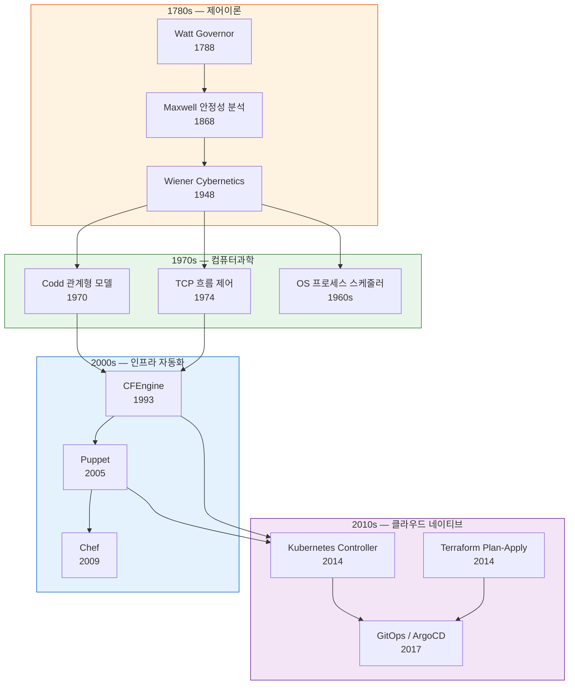
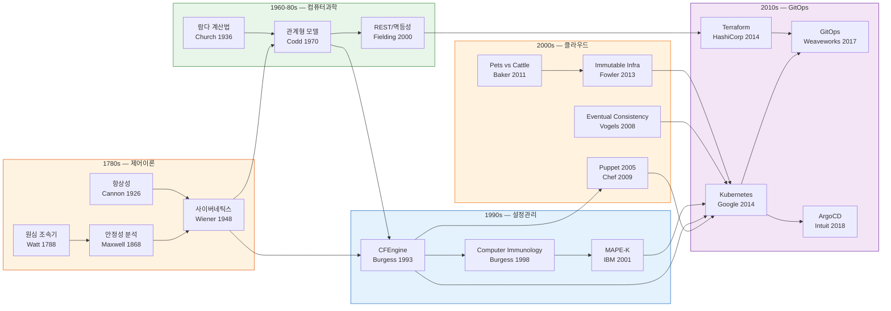

# Reconciliation Loop의 계보: 제어이론에서 GitOps까지
---
> "desired state와 actual state를 비교하여 수렴시킨다"는 한 문장에는 250년 제어이론, 70년 사이버네틱스, 30년 설정관리의 DNA가 압축되어 있다. 이 문서는 그 한 문장을 구성하는 모든 용어의 기원을 추적한다.

## 1. 들어가며

메시지 큐와 미들웨어를 다루다 보면 두 가지 문장을 자주 만난다. 하나는 "Reconciliation Loop가 desired state와 actual state를 비교하여 수렴시킨다"이고, 다른 하나는 "DB에 스크립트를 저장하고 Jenkins `config.xml`은 파생물로 취급한다"는 CloudBees 패턴이다. 두 문장 모두 같은 뿌리에서 나왔다.

이 문서의 목적은 세 가지다. 첫째, Reconciliation Loop를 구성하는 핵심 용어 네 개(reconciliation, desired state, convergence, SSOT)의 어원을 라틴어까지 추적한다. 둘째, 같은 DNA를 공유하는 인접 개념 다섯 가지를 계보 안에 배치한다. 셋째, 이 계보가 메시지 큐 영역에서 어떻게 재현되는지 확인한다.

## 2. 공통 조상: 피드백 제어 루프

### 2-1. Watt의 원심 조속기에서 사이버네틱스까지

1788년 James Watt가 증기기관에 부착한 **원심 조속기**(Centrifugal Governor)는 기계가 스스로 목표 상태를 유지하는 최초의 산업적 사례였다. 증기 압력이 높아지면 볼이 벌어져 밸브를 좁히고, 압력이 낮아지면 볼이 오므라들어 밸브를 연다. 목표 회전수(desired)와 실제 회전수(actual)의 차이가 교정 동작을 유발하는 구조다.

1868년 James Clerk Maxwell은 *On Governors*에서 이 장치를 미분방정식으로 모델링하여 안정성 조건을 증명했다. 이것이 **제어이론**(Control Theory)의 공식적 시작이다. 1948년 Norbert Wiener는 *Cybernetics: Or Control and Communication in the Animal and the Machine*을 출판하며, 기계와 생물 모두 같은 피드백 루프로 설명할 수 있다는 통합 프레임워크를 제시했다.

### 2-2. 제어 루프의 공통 DNA

Watt의 조속기부터 Kubernetes Controller까지, 250년에 걸친 모든 제어 시스템은 일곱 가지 구조적 특성을 공유한다:

- **Desired State**: 시스템이 도달해야 할 목표 상태
- **Actual State**: 현재 관측된 시스템의 실제 상태
- **Observe**: actual state를 측정하는 행위
- **Diff**: desired와 actual 사이의 차이(오차)를 계산하는 행위
- **Act**: 오차를 줄이는 방향으로 시스템에 개입하는 행위
- **Loop**: observe→diff→act를 반복하는 순환 구조
- **Convergence**: 반복을 통해 오차가 0에 수렴하는 성질

다음 다이어그램은 이 일곱 요소가 250년간 어떤 분야에서 반복적으로 등장했는지 보여준다:

## 3. 핵심 용어의 유래

### 3-1. Reconciliation Loop

**Reconciliation**이라는 단어는 라틴어 *reconciliāre*에서 왔다. *re-*(다시) + *conciliāre*(결합하다, 화해시키다)의 합성어로, 원래 "어긋난 두 관계를 다시 일치시킨다"는 뜻이다. 이 단어가 가장 먼저 기술적 의미를 얻은 분야는 회계였다. 복식부기에서 두 장부(원장과 보조원장)의 잔액이 일치하는지 확인하고, 불일치가 있으면 원인을 찾아 보정하는 과정을 **계정 조정**(Account Reconciliation)이라 부른다.

1993년 Mark Burgess가 CFEngine을 설계하면서 이 회계 용어를 인프라 영역에 도입했다. 선언된 정책(desired)과 서버의 현재 상태(actual)를 비교하여 차이를 보정하는 에이전트의 동작을 reconciliation이라 명명한 것이다. Kubernetes가 2014년 등장했을 때 이 용어를 그대로 계승했고, controller-runtime 프레임워크에서 핵심 메서드 이름이 `Reconcile()`이 되었다.

"sync"가 아닌 "reconciliation"을 선택한 데는 의미론적 이유가 있다. sync는 양방향 동기화를 암시하지만, reconciliation은 **단방향 수렴**을 의미한다. desired state가 권위 있는 원본이고, actual state가 그것에 맞춰져야 하는 파생물이라는 비대칭 관계를 reconciliation이라는 단어가 정확히 표현한다.

### 3-2. Desired State와 Actual State

제어이론에서 desired state는 **설정점**(Setpoint)에 해당하고, actual state는 **공정 변수**(Process Variable)에 해당한다. PID 제어기의 공식에서 오차 *e(t)*는 setpoint와 process variable의 차이로 정의되며, 이 오차를 0으로 만드는 것이 제어기의 목표다.

이 이분법이 소프트웨어에 처음 등장한 것은 Edgar F. Codd의 관계형 모델(1970)이었다. Codd는 데이터의 논리적 표현(desired)과 물리적 저장 방식(actual)을 분리함으로써, 응용 프로그램이 "무엇을 원하는지"만 선언하면 DBMS가 "어떻게 실현할지"를 결정하는 구조를 만들었다. 이것이 선언적(Declarative) 모델의 기원이다.

CFEngine은 이 선언적 모델을 인프라에 적용한 최초 사례다. `/etc/passwd`에 특정 사용자가 존재해야 한다는 정책(desired)과 실제 파일 내용(actual)을 비교하는 방식이었다. Puppet은 이를 DSL로 발전시켰고, Terraform은 **Plan 단계**에서 desired와 actual의 diff를 시각적으로 보여주는 UX를 완성했다.

### 3-3. 수렴(Convergence)

수렴은 수학에서 온 개념이다. 수열 {a_n}이 극한값 L에 수렴한다는 것은, n이 커질수록 a_n과 L의 차이가 임의로 작아진다는 뜻이다(ε-δ 정의). Burgess는 1998년 논문 *Computer Immunology*에서 이 수학적 정의를 인프라에 대입했다. 에이전트가 반복 실행될수록 시스템 상태가 정책에 "수렴"한다는 표현이 여기서 시작되었다.

수렴은 생물학의 **항상성**(Homeostasis)과도 정확히 대응된다. Walter Bradford Cannon이 1926년 명명한 항상성은 "체온 37도"라는 desired state에 대해 땀(냉각)과 떨림(가열)이라는 act를 반복하여 actual state를 수렴시키는 생체 제어 루프다. Burgess가 CFEngine을 "computer immune system"이라 부른 것은 이 대응 관계를 의식한 것이었다.

분산 시스템에서 수렴은 **궁극적 일관성**(Eventual Consistency)이라는 이름으로 다시 나타난다. Werner Vogels가 2008년 발표한 Amazon의 아키텍처 원칙에서, 모든 복제본이 결국 같은 상태에 도달한다는 보장이 바로 수렴의 분산 시스템 버전이다.

### 3-4. CloudBees 패턴: SSOT와 파생물

**단일 진실 공급원**(Single Source of Truth, SSOT)은 데이터베이스 정규화에서 시작된 개념이다. Codd의 제3정규형(3NF)은 "모든 비키 속성은 키에만 의존해야 한다"는 규칙인데, 이는 곧 하나의 사실이 하나의 장소에만 존재해야 한다는 원칙이다. 중복 저장은 불일치의 원인이 되기 때문이다.

CloudBees가 제시한 "DB에 스크립트를 저장하고, Jenkins `config.xml`은 파생물"이라는 패턴은 이 SSOT 원칙의 직접적 적용이다. 파이프라인의 정의(desired state)는 DB라는 단일 원본에 존재하고, Jenkins의 `config.xml`은 그 원본으로부터 생성되는 **파생물**(Derived Artifact)이다. 원본이 변경되면 reconciliation loop가 `config.xml`을 재생성하여 actual state를 수렴시킨다.

이 패턴은 GitOps에서 완성된 형태로 나타난다. Weaveworks의 Alexis Richardson이 2017년 명명한 GitOps는 Git 저장소를 SSOT로 삼고, ArgoCD 같은 에이전트가 클러스터의 actual state를 Git의 desired state에 수렴시키는 구조다. CloudBees 패턴에서 DB가 Git으로 바뀌었을 뿐, 구조는 동일하다.

## 4. 같은 DNA를 공유하는 개념들

### 4-1. Level-Triggered와 Edge-Triggered

이 구분은 전자공학의 인터럽트 처리 방식에서 비롯되었다. **Edge-triggered** 인터럽트는 신호가 변하는 순간(0→1)에만 반응하고, **level-triggered** 인터럽트는 신호가 특정 수준을 유지하는 동안 계속 반응한다. Edge-triggered 방식은 변화 이벤트를 놓치면 복구할 수 없지만, level-triggered 방식은 현재 상태만 확인하면 되므로 이벤트 유실에 강인하다.

Kubernetes의 Controller는 의도적으로 level-triggered 방식을 채택했다. "Pod가 3개 떠 있어야 한다"는 desired state에 대해 "현재 2개가 떠 있다"는 actual state를 관측하면, 어떤 이벤트가 Pod를 죽였는지(edge)와 무관하게 1개를 생성한다. 이벤트 소스가 실패하더라도 다음 reconciliation 주기에서 동일한 판단을 내릴 수 있는 것이다. 이 설계 철학을 Kubernetes 커뮤니티에서는 "edge-triggered 시스템이 아니라 level-triggered 시스템"이라는 표현으로 자주 언급한다.

### 4-2. 멱등성(Idempotency)

**멱등성**이라는 수학 용어는 1870년 Benjamin Peirce가 추상대수학에서 도입했다. f(f(x)) = f(x)를 만족하는 연산을 멱등(idempotent)이라 정의한 것이다. 이 성질은 "같은 작업을 여러 번 반복해도 결과가 한 번 실행한 것과 같다"는 의미를 갖는다.

HTTP에서 GET과 PUT이 멱등하다는 정의는 Roy Fielding의 2000년 REST 논문에서 공식화되었다. 설정 관리 도구에서는 멱등성이 reconciliation의 전제조건이 된다. CFEngine 에이전트가 "이 파일의 권한이 644여야 한다"는 정책을 반복 실행할 때, 이미 644인 경우 아무 동작도 하지 않아야 한다. 멱등하지 않은 reconciliation은 무한 루프나 상태 진동(oscillation)을 유발한다.

메시지 큐에서도 멱등성은 핵심이다. Kafka Consumer가 같은 메시지를 두 번 처리하더라도 결과가 달라지지 않아야 하는 at-least-once 전달 보장의 기반이 바로 멱등성이다.

### 4-3. 선언적(Declarative)과 명령적(Imperative)

이 구분의 뿌리는 1930년대까지 거슬러 올라간다. Alonzo Church의 **람다 계산법**(1936)은 "무엇을 계산할 것인가"를 표현하는 선언적 체계이고, Alan Turing의 **튜링 머신**(1936)은 "어떤 단계를 거쳐 계산할 것인가"를 기술하는 명령적 체계다. 둘은 계산 능력에서 동치(Church-Turing 논제)이지만, 표현 방식이 근본적으로 다르다.

SQL은 Codd의 관계형 모델에 기반한 선언적 질의 언어로, "어떤 데이터를 원하는가"만 기술한다. Terraform의 HCL, Kubernetes의 YAML Manifest, Puppet의 DSL은 모두 이 선언적 전통 위에 서 있다. 선언적 명세가 reconciliation loop의 입력(desired state)이 되고, 에이전트가 명령적으로 실행(act)하는 구조다.

### 4-4. Cattle vs Pets, 불변 인프라(Immutable Infrastructure)

2011년 Microsoft의 Bill Baker가 Scale-Up vs Scale-Out을 설명하며 처음 사용한 **Pets vs Cattle** 비유는 인프라 관리 패러다임의 전환을 상징한다. Pet 서버는 이름이 있고, 아프면 치료하고, 수동으로 돌본다. Cattle 서버는 번호가 있고, 아프면 교체하며, 자동으로 관리된다.

2013년 Chad Fowler가 *Trash Your Servers and Burn Your Code*에서 명명한 **불변 인프라**(Immutable Infrastructure)는 Cattle 패러다임의 논리적 귀결이다. 서버를 수정(mutate)하는 대신, 새 이미지를 빌드하여 교체하는 방식이다. Reconciliation Loop 관점에서 보면, 불변 인프라는 "actual state를 수정"하는 대신 "actual state를 desired state로 대체"하는 전략에 해당한다.

### 4-5. Self-Healing과 Autonomic Computing

2001년 IBM이 발표한 **Autonomic Computing** 선언은 자율 관리 시스템의 청사진이었다. 핵심 아키텍처인 MAPE-K(Monitor, Analyze, Plan, Execute + Knowledge)는 제어 루프의 정교화 버전이다. Monitor가 actual state를 관측하고, Analyze가 desired state와 비교하며, Plan이 교정 계획을 세우고, Execute가 실행한다.

Burgess의 "computer immune system"(1998)은 같은 아이디어를 생물학적 비유로 표현한 것이다. 면역 시스템이 외부 침입자를 탐지하고 항체로 중화시키듯, CFEngine 에이전트가 상태 이탈을 탐지하고 정책으로 복원하는 구조였다. Kubernetes가 "self-healing"이라는 용어로 마케팅하는 기능(CrashLoopBackOff 복구, 노드 장애 시 Pod 재배치)은 MAPE-K와 Burgess의 아이디어가 합쳐진 결과물이다.

## 5. 통합 계보도

250년에 걸친 용어와 개념의 흐름을 하나의 타임라인으로 정리한다:

## 6. 메시지 큐에서의 적용

### 6-1. Consumer Group과 Reconciliation

Kafka/Redpanda의 Consumer Group은 reconciliation loop의 축소판이다. Group Coordinator는 "파티션 P0은 Consumer C1에게 할당되어야 한다"는 desired state를 유지하고, Consumer의 heartbeat를 통해 actual state를 관측한다. Consumer가 heartbeat를 보내지 않으면 리밸런싱(act)을 트리거하여 파티션을 다른 Consumer에게 재할당한다.

이 과정은 level-triggered 방식으로 동작한다. "C1이 죽었다"는 이벤트(edge)가 아니라 "C1로부터 heartbeat가 없다"는 현재 상태(level)를 기준으로 판단하기 때문이다. 네트워크 파티션으로 heartbeat 이벤트가 지연되더라도, 타임아웃 시점의 상태만 확인하면 올바른 판단을 내릴 수 있다.

### 6-2. 멱등성 패턴과 Reconciliation의 관계

메시지 큐에서 at-least-once 전달은 동일 메시지가 두 번 이상 도착할 수 있다는 뜻이다. 이때 Consumer의 처리 로직이 멱등하지 않으면, 중복 메시지가 상태를 오염시킨다. 이것은 reconciliation loop에서 멱등하지 않은 act가 상태 진동을 유발하는 것과 정확히 같은 문제다.

Redpanda Spring Boot 실습에서 구현한 preemptive acquire 패턴(`INSERT ... WHERE NOT EXISTS`)은 이 문제의 해법이다. 메시지의 `correlationId`와 `eventType`을 복합 키로 사용하여, 이미 처리된 이벤트에 대해서는 아무 동작도 하지 않는다. CFEngine 에이전트가 "파일 권한이 이미 644이면 건너뛴다"는 것과 같은 원리다.

### 6-3. Saga와 Eventual Convergence

Saga 패턴에서 보상 트랜잭션(Compensating Transaction)은 reconciliation loop의 act에 해당한다. 결제 서비스가 실패하면 이전에 성공한 재고 차감을 보상 트랜잭션으로 되돌린다. 이것은 "모든 서비스의 상태가 일관되어야 한다"는 desired state에 대해 "결제 실패로 불일치가 발생했다"는 actual state를 reconcile하는 과정이다.

이 수렴은 즉시 일어나지 않는다. 보상 메시지가 전파되고 각 서비스가 처리를 완료할 때까지 시간이 걸린다. 이 시간차가 바로 eventual consistency이며, 분산 시스템에서 수렴의 본질적 한계이기도 하다.

## 7. 참고 자료

학술 문헌:

- Maxwell, J.C. "On Governors." *Proceedings of the Royal Society of London*, 1868
- Wiener, N. *Cybernetics: Or Control and Communication in the Animal and the Machine*. MIT Press, 1948
- Codd, E.F. "A Relational Model of Data for Large Shared Data Banks." *Communications of the ACM*, 1970
- Burgess, M. "Computer Immunology." *Proceedings of USENIX LISA*, 1998
- Kephart, J.O. and Chess, D.M. "The Vision of Autonomic Computing." *IEEE Computer*, 2003
- Fielding, R.T. "Architectural Styles and the Design of Network-based Software Architectures." Doctoral Dissertation, UC Irvine, 2000
- Vogels, W. "Eventually Consistent." *Communications of the ACM*, 2009

업계 자료:

- Burgess, M. *In Search of Certainty: The Science of Our Information Infrastructure*. O'Reilly, 2015
- Burns, B. et al. "Borg, Omega, and Kubernetes." *ACM Queue*, 2016
- Richardson, A. "GitOps — Operations by Pull Request." Weaveworks Blog, 2017
- Fowler, C. "Trash Your Servers and Burn Your Code." Blog post, 2013
- Baker, B. "Scaling SQL Server." Microsoft TechEd presentation, 2011
- Peirce, B. *Linear Associative Algebra*. American Journal of Mathematics, 1870

교차참조 (runners-high 학습 자료):

- Kubernetes Controller 구조: `poc/03_CloudNative/02-kubernetes/` Ch08
- ArgoCD Reconciliation: `poc/03_CloudNative/02-kubernetes/` Ch15
- Kafka Consumer Group 리밸런싱: `poc/08_MessageQueue/red-panda/learning/02-fundamentals/` Ch06
- Saga 보상 트랜잭션: `poc/08_MessageQueue/red-panda/project/redpanda-spring-boot/` Ch03
- 멱등성 패턴(preemptive acquire): `poc/08_MessageQueue/red-panda/learning/01-event-driven/` Ch17
- CFEngine/Puppet 계보: `poc/05_DevOps/03-devops-fundamentals/` Ch01
- GitOps/IaC 패턴: `poc/05_DevOps/02-cicd-patterns/` Ch08
