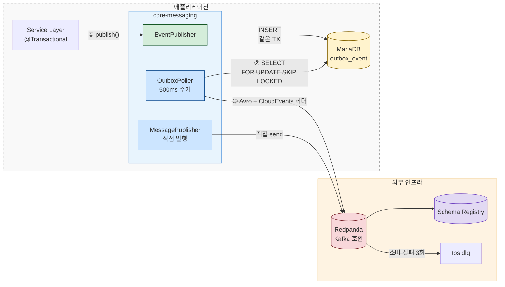

# message-lib

---

> Spring Boot 자동 설정으로 동작하며, Kafka/Redpanda 기반 이벤트 발행·소비를 위한 인프라를 제공합니다.




## 1. 디렉토리 구조

```bash
core-messaging/
├── build.gradle
└── src/main/
    ├── java/com/okestro/tps/messaging/
    │   ├── config/           # Kafka·Outbox 자동 설정
    │   ├── publish/          # MessagePublisher (직접 발행)
    │   ├── outbox/           # Transactional Outbox 전체
    │   ├── topic/            # 토픽 상수·자동 생성·런타임 관리
    │   ├── serialization/    # Avro 직렬화/역직렬화
    │   ├── interceptor/      # CloudEvents 헤더 인터셉터
    │   ├── dlq/              # Dead Letter Queue 소비자
    │   └── tracing/          # OpenTelemetry 연동
    ├── avro/
    │   └── JenkinsBuildRequest.avsc
    └── resources/
        ├── kafka-defaults.yml
        ├── mapper/OutboxMapper.xml
```


## 2. 설정 프로퍼티

### Kafka 기본 설정

`kafka-defaults.yml`에 개발 환경용 기본값이 정의되어 있습니다. core-messaging을 의존하는 서비스는 별도 설정 없이 이 기본값을 사용합니다.

```yaml
spring.kafka:
  bootstrap-servers: 10.255.17.176:31092
  producer:
    acks: all                    # 모든 복제본 확인 후 응답
    retries: 3                   # 전송 실패 시 재시도
    enable.idempotence: true     # 중복 메시지 방지
  consumer:
    group-id: tps
    auto-offset-reset: earliest  # 처음부터 읽기

schema.registry.url: http://10.255.17.176:30081
```

| 프로퍼티                      | 값                                                    | 설명                                                     |
| ----------------------------- | ----------------------------------------------------- | -------------------------------------------------------- |
| `acks: all`                   | 모든 ISR 복제본이 쓰기를 확인한 뒤 응답합니다         | 메시지 유실 방지를 위해 가장 강한 보장 수준을 사용합니다 |
| `enable.idempotence: true`    | 프로듀서가 동일 메시지를 중복 전송하지 않습니다       | 네트워크 재시도 시 exactly-once 시맨틱을 보장합니다      |
| `auto-offset-reset: earliest` | 컨슈머 그룹이 처음 참여할 때 토픽의 처음부터 읽습니다 | 이벤트 유실 없이 전체 히스토리를 소비할 수 있습니다      |

운영 환경에서는 `application-prd.yml`이 환경변수로 오버라이드합니다.

```yaml
spring.kafka:
  bootstrap-servers: ${KAFKA_BOOTSTRAP_SERVERS:10.255.17.176:31092}

schema.registry.url: ${SCHEMA_REGISTRY_URL:http://10.255.17.176:30081}
```

### Outbox 설정

| 프로퍼티                        | 기본값        | 설명                           |
| ------------------------------- | ------------- | ------------------------------ |
| `outbox.batch-size`             | 50            | 폴링 1회당 처리할 이벤트 수    |
| `outbox.poll-interval-ms`       | 500           | 폴링 주기 (밀리초)             |
| `outbox.max-retries`            | 5             | 최대 재시도 횟수               |
| `outbox.cleanup-retention-days` | 7             | SENT 이벤트 보관 일수          |
| `outbox.cleanup-cron`           | `0 0 3 * * *` | 정리 작업 크론 (매일 새벽 3시) |


## 3. 핵심 기능

### 3-1. Transactional Outbox / Direct Publishing

DB 트랜잭션과 메시지 발행을 원자적으로 처리하는 패턴입니다. 서비스 로직이 DB를 변경할 때, Kafka에 직접 보내지 않고 같은 트랜잭션 안에서 `outbox_event` 테이블에 이벤트를 삽입합니다. 별도 폴러가 이 테이블을 주기적으로 읽어 Kafka로 발행하므로, DB 커밋이 실패하면 이벤트도 함께 롤백됩니다.

**EventPublisher** — 이벤트를 outbox 테이블에 삽입합니다.

```java
@Autowired
private EventPublisher eventPublisher;

eventPublisher.publish(
    aggregateType      // "ORDER"
    , aggregateId      // "order-123"
    , eventType        // "OrderCreated"
    , payload          // byte[] (Avro 직렬화된 데이터)
    , topic            // "tps.order.events"
    , correlationId    // 요청 추적 ID
);
```

**OutboxPoller** — 500ms 간격으로 PENDING 이벤트를 조회하여 Kafka로 발행합니다. 동작 흐름은 다음과 같습니다.

1. `SELECT ... FOR UPDATE SKIP LOCKED`로 PENDING 이벤트를 가져옵니다. SKIP LOCKED 덕분에 여러 인스턴스가 동시에 폴링해도 같은 이벤트를 중복 처리하지 않습니다.
2. 이벤트를 PROCESSING으로 마킹하고 Kafka로 발행합니다.
3. 성공하면 SENT, 실패하면 재시도 횟수를 증가시키고 지수 백오프(2^retryCount 초)를 적용합니다.
4. 최대 재시도(기본 5회)를 초과하면 DEAD로 마킹합니다.

같은 aggregate 내에서는 순서를 보존합니다. 하나가 실패하면 해당 aggregate의 뒤따르는 이벤트는 건너뜁니다.

**OutboxEventHandler** — Kafka가 아닌 다른 시스템으로 이벤트를 라우팅할 때 구현합니다.

```java
public interface OutboxEventHandler {
    boolean supports(String aggregateType);
    void handle(OutboxEvent event) throws Exception;
    void onDead(OutboxEvent event);  // DEAD 상태 도달 시 호출
}
```

- `OutboxPoller`는 이벤트를 발행하기 전에 등록된 핸들러 중 `supports()`가 true를 반환하는 것이 있으면 해당 핸들러에 위임합니다.
- HTTP 웹훅, 이메일, SMS 등 Kafka 외 채널로 이벤트를 전달해야 할 때 유용합니다.

트랜잭션 보장이 필요 없는 경우 `MessagePublisher`로 즉시 발행할 수 있습니다. `CompletableFuture<Void>`를 반환하므로 비동기 처리가 가능하며, 알림이나 로깅처럼 유실되어도 치명적이지 않은 메시지에 적합합니다.

```java
@Autowired
private MessagePublisher messagePublisher;

// byte[] payload
messagePublisher.send("tps.notifications", "key-123", payload);

// String message
messagePublisher.send("tps.notifications", "key-123", "hello");

// key 없이
messagePublisher.send("tps.notifications", "hello");
```


### 3-2. Avro 직렬화

#### AvroSerializer

`AvroSerializer`는 Confluent Schema Registry와 연동하여 Avro 바이너리 직렬화를 수행합니다. Confluent wire format(매직 바이트 + 스키마 ID + 바이너리)을 사용하므로, 소비자 측에서 스키마 진화(schema evolution)를 자연스럽게 처리할 수 있습니다.

```java
@Autowired
private AvroSerializer avroSerializer;

// 직렬화 — Schema Registry에 스키마가 자동 등록됩니다
byte[] bytes = avroSerializer.serialize(jenkinsBuildRequest);

// 역직렬화
JenkinsBuildRequest req = avroSerializer.deserialize(
    bytes, JenkinsBuildRequest.getClassSchema()
);

// JSON 변환 — Schema Registry 없이도 동작합니다
String json = avroSerializer.toJson(jenkinsBuildRequest);
```

`toJson()`은 Schema Registry 없이 동작하므로, Redpanda Connect의 Bloblang에서 메시지를 파싱할 때 유용합니다.

#### 스키마 설정 (build.gradle)

Avro 스키마 파일(`.avsc`)은 `src/main/avro/` 디렉토리에 위치합니다. Gradle Avro 플러그인이 빌드 시점에 이 파일들을 Java 클래스로 자동 생성합니다.

```groovy
plugins {
    id 'com.github.davidmc24.gradle.plugin.avro' version '1.9.1'
}

avro {
    stringType = "String"       // CharSequence 대신 String 사용
    fieldVisibility = "PRIVATE" // private 필드 + getter/setter 생성
    createSetters = true
}
```

- `stringType = "String"` — Avro 기본값인 `CharSequence`는 `equals()` 비교 등에서 혼란을 일으키므로 `String`으로 지정합니다.
- `fieldVisibility = "PRIVATE"` — 캡슐화를 위해 private 필드에 getter/setter를 생성합니다.

추가로, 빌드 태스크 `addJacksonAnnotationsToAvro`가 생성된 Java 클래스에 `@JsonIgnoreProperties(ignoreUnknown = true)`를 자동 삽입합니다. 스키마가 진화하여 새 필드가 추가되더라도 역직렬화 시 에러가 발생하지 않습니다.

#### .avsc 스키마 작성법

스키마는 JSON 형식으로 작성하며, `namespace`가 Schema Registry의 subject 이름을 결정합니다. `RecordNameStrategy`를 사용하므로 subject는 `{namespace}.{name}` 형태가 됩니다.

```json
{
  "namespace": "com.okestro.tps.messaging.avro",
  "type": "record",
  "name": "JenkinsBuildRequest",
  "fields": [
    {"name": "jobName", "type": "string"},
    {"name": "message", "type": ["null", "string"], "default": null},
    {"name": "correlationId", "type": ["null", "string"], "default": null},
    {"name": "env", "type": ["null", "string"], "default": null}
  ]
}
```

nullable 필드는 `["null", "string"]` union 타입으로 선언하고 `"default": null`을 지정합니다. 이렇게 하면 스키마 진화 시 기존 메시지와의 호환성이 유지됩니다.


### 3-3. 토픽 관리

`Topics` 클래스에 토픽명을 상수로 정의합니다. 애플리케이션이 기동되면 `TopicConfig`가 아래 토픽을 자동 생성하며, 이미 존재하는 토픽은 건너뜁니다.

런타임에 토픽을 동적으로 생성하거나 목록을 조회해야 할 때는 `TopicManager`를 사용합니다.

```java
@Autowired
private TopicManager topicManager;

topicManager.createTopic("tps.new-topic", 3, (short) 1);
Set<String> topics = topicManager.listTopics();
```


### 3-4. 이벤트 공통헤더 (CloudEvents)

`CloudEventsHeaderInterceptor`가 Kafka `ProducerInterceptor`로 등록되어, 모든 발행 메시지에 CloudEvents 1.0 Binary Content Mode 헤더를 자동 추가합니다.

| 헤더 | 값 | 설명 |
|------|----|------|
| `ce_specversion` | `1.0` | CloudEvents 스펙 버전 |
| `ce_id` | UUID | 미설정 시 자동 생성 |
| `ce_source` | `/{spring.application.name}` | 이벤트 발생 서비스 |
| `ce_time` | ISO 8601 | 발행 시각 |
| `trace-id` | MDC traceId | 분산 추적 ID (있을 때만) |

- `OutboxPoller`를 통해 발행되는 이벤트에는 `ce_type`과 `ce_correlationid`가 추가로 포함됩니다. 인터셉터는 이미 설정된 헤더를 덮어쓰지 않으므로, `OutboxPoller`가 먼저 설정한 값이 그대로 보존됩니다.


### 3-5. DLQ 공통 설정

소비자 측에서 메시지 처리에 실패하면 `KafkaErrorConfig`가 재시도 후 `tps.dlq` 토픽으로 라우팅합니다.

재시도 정책은 지수 백오프를 사용합니다. 1초, 2초, 4초 간격으로 최대 3회 재시도하며, 총 경과 시간은 7초입니다. 아래 예외는 재시도해도 결과가 동일하므로 즉시 DLQ로 전달합니다.

- `IllegalArgumentException` — 잘못된 메시지 형식
- `AvroSerializationException` — 직렬화/역직렬화 실패

`DlqConsumer`는 `tps.dlq` 토픽을 구독하며, 실패한 메시지의 원본 토픽, 키, 크기, 헤더를 로깅합니다. 운영 환경에서는 이 로그를 모니터링하여 반복적인 실패 패턴을 조기에 발견할 수 있습니다.


# 요약

---

목적: TPS 프로젝트의 Kafka/Redpanda 메시징 인프라를 공통 라이브러리로 제공하여, 각 서비스가 직렬화·헤더·에러처리·추적을 개별 구현하지 않도록 합니다.

- Transactional Outbox 패턴으로, Kafka 메시지 발행을 원자적으로 묶어, 한쪽만 성공하는 데이터 불일치를 방지
- Avro + Schema Registry로 직렬화를 표준화, .avsc  스키마에서 Java 클래스를 자동 생성
- CloudEvents 헤더 자동 추가, DLQ 재시도 정책
