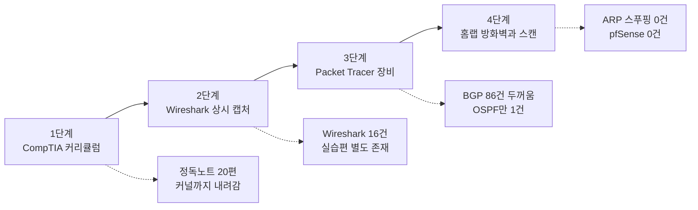

# 네트워킹 학습 로드맵 — CyberFlow
---
> 사이버보안을 시작하려면 도구가 아니라 네트워킹부터 잡으라고 말하는 5분짜리 영상을 정리합니다. 그리고 이미 쌓인 네트워킹 노트에 대조해, 이 로드맵에서 실제로 새로 얻을 것이 무엇인지 실측으로 가려냅니다.

## 1. 출처

> 영상 한 편의 영어 자막이 근거입니다. 자막 뒷부분은 학습 내용이 아니라 유료 강의 홍보 구간이라 요약에서 제외했습니다.

| 항목 | 값 |
|---|---|
| 제목 | The Best Way To Learn Networking |
| 채널 | CyberFlow |
| 채널 주소 | [@cyberflow10](https://www.youtube.com/@cyberflow10) |
| 영상 | [youtube.com/watch?v=OBqCYxhwR_o](https://www.youtube.com/watch?v=OBqCYxhwR_o) |
| 길이 | 약 5분 |
| 자막 | DownSub 추출 영어 자막 76블록 |

채널명은 파일명만으로는 알 수 없어 YouTube oEmbed 응답으로 확인했습니다. 검색 결과에는 `CyberFlowAi`와 터키어 동명 채널이 섞여 있어, 제목만 보고 채널을 단정하면 다른 사람의 영상을 인용하게 됩니다.

## 2. 영상의 주장 — 도구보다 네트워킹이 먼저다

> 모든 공격 기법과 도구가 네트워킹 위에 얹혀 있으므로, 그 층을 건너뛰면 나중에 스스로 설명하지 못하는 한계에 부딪힌다는 것이 이 영상의 유일한 논지입니다.

화자는 사이버보안을 어디서 시작하냐는 질문에 항상 같은 답을 준다고 말합니다. Python도 아니고 Kali Linux도 아니고 익스플로잇 프레임워크도 아닌 네트워킹입니다. 그리고 이 답을 들은 사람은 대체로 실망한다고 덧붙입니다.

실망하는 이유도 짚습니다. 네트워킹은 서버실에서 일하는 친척이 명절에 꺼낼 법한 지루한 기업 IT 이야기처럼 들리기 때문입니다. 그러나 들어 본 적 있는 모든 공격, 배우고 싶은 모든 도구, 이 분야에서 실제로 중요한 모든 개념이 네트워킹 기초 위에 놓여 있다는 것이 반박입니다.

결론은 두 문장으로 요약됩니다. 이 층을 건너뛰면 모래 위에 짓는 셈이고, 제대로 배우면 나머지가 전에는 없던 방식으로 이해되기 시작합니다.

## 3. 학습 방법 — 읽지 말고 관찰하라

> 교과서 통독과 OSI 계층 암기가 실패하는 이유는 "왜 존재하는가"를 빼놓기 때문이며, 대안은 만지고 부수면서 그때 패킷에 무슨 일이 일어나는지 보는 것입니다.

영상은 흔한 실패 경로를 먼저 그립니다. 교과서를 처음부터 읽다가 3장쯤에서 잠듭니다. OSI 모델은 외울 일곱 개의 추상적인 계층 이름으로 소개됩니다. 그것들이 왜 존재하는지에 대한 설명은 붙지 않습니다.

이 접근이 통째로 틀렸다는 것이 화자의 판단입니다. 옳은 방법은 네트워킹을 직접 만지고 부수면서 배우는 것입니다. 그때 패킷 수준에서 무엇이 일어나는지를 함께 지켜봅니다. 이 문장이 뒤이어 나오는 도구 선택의 기준이 됩니다.

## 4. 4단계 경로

> 무료 커리큘럼으로 뼈대를 세우고, 읽은 개념을 즉시 캡처해 확인하고, 시뮬레이터로 장비를 만지고, 마지막에 자기 랩을 공격하는 순서입니다.

| 단계 | 도구 | 다루는 것 |
|---|---|---|
| 1 | Professor Messer의 CompTIA Network+ 유튜브 자료 | IP 주소 체계, 서브네팅, 라우팅, 스위칭, DNS, DHCP, 방화벽 |
| 2 | Wireshark | 읽은 개념마다 즉시 캡처해 눈으로 확인 |
| 3 | Cisco Packet Tracer | 라우터와 스위치를 배치하고 시뮬레이션 CLI로 설정 |
| 4 | VM 홈랩, pfSense, Nmap | 방화벽 룰 작성과 우회, 스캔 타입별 패킷 관찰 |

1단계에서 자격증 취득은 선택입니다. 화자는 시험을 볼 생각이 없어도 커리큘럼만 구조화된 뼈대로 쓰라고 권합니다. 이 자료가 다른 네트워킹 콘텐츠와 다른 점은 무엇인지가 아니라 왜 그렇게 동작하는지를 설명한다는 데 있다고 말합니다.

2단계는 병렬로 굴립니다. Wireshark를 열어 두고 계속 열어 두라는 표현을 씁니다. TCP 3-way handshake를 배웠으면 TCP로 필터를 걸어 연결이 맺히는 순간을 실시간으로 보고 SYN, SYN-ACK, ACK 순서를 눈으로 따라갑니다. DNS를 배웠으면 도메인을 입력할 때마다 질의가 나가고 응답이 돌아오는 것을 봅니다. ARP를 배웠으면 자기 머신이 로컬 네트워크에 누가 이 IP를 갖고 있냐고 브로드캐스트하고 응답이 돌아오는 것을 봅니다.

3단계의 Packet Tracer는 Cisco Networking Academy 계정으로 무료입니다. 캔버스에 라우터와 스위치를 끌어다 놓고 연결한 뒤 시뮬레이션 CLI로 설정하고 그 사이를 흐르는 트래픽을 봅니다. 물리 장비가 없어도 된다는 것이 이 단계의 요점입니다.

4단계는 네트워킹이 선수과목에서 벗어나 그 자체로 재미있어지는 지점이라고 소개됩니다. VM 몇 대로 홈랩을 만들고 그 사이 트래픽을 캡처합니다. pfSense 방화벽 VM을 세워 랩 트래픽을 통과시키고, 의도한 대로 동작하는 룰을 씁니다. 그다음이 핵심입니다. 허술하게 쓴 룰을 우회하는 트래픽을 일부러 만들어 봐서 방화벽 설정이 왜 제대로 하기 어려운지 몸으로 압니다.

같은 4단계에서 Nmap을 자기 랩에 실행하되 스캔 타입을 바꿔 가며 각각이 만들어 내는 패킷을 Wireshark로 동시에 봅니다. 도구의 출력과 원시 패킷을 나란히 놓고 보는 것이 이 분야에서 할 수 있는 가장 교육적인 일이라고 화자는 말합니다.

## 5. 서브네팅 — 개념이 먼저, 계산은 나중

> 서브네팅이 어려운 것이 아니라, 개념이 서기 전에 이진 계산부터 시작하는 순서가 사람을 무너뜨린다는 진단입니다.

영상은 서브네팅을 초보자가 가장 많이 좌절하는 지점으로 지목하면서, 동시에 소문만큼 어렵지 않다고 말합니다. 서브네팅은 서브넷 마스크로 IP 주소의 어느 부분이 네트워크를 식별하고 어느 부분이 개별 호스트를 식별하는지 정해서 네트워크를 더 작은 조각으로 나누는 일입니다.

공포가 생기는 원인은 대개 밑에 깔린 개념이 분명해지기 전에 수학부터 하려는 데 있습니다. 처방은 순서를 뒤집는 것입니다.

1. 개념을 먼저 잡습니다.
2. 서브넷 계산기를 써서 이리저리 만져 봅니다.
3. prefix 길이를 바꿀 때 사용 가능한 호스트 수와 네트워크 수가 어떻게 달라지는지 확인합니다.

개념이 단단해지면 그 밑의 이진 연산은 임의의 연습 문제가 아니라 자연스럽게 맞물리는 것으로 바뀝니다.

## 6. ARP 스푸핑 — 인증 없는 프로토콜이 공격면이 되는 자리

> ARP에는 인증이 전혀 없어서, 로컬 네트워크에서 자신이 게이트웨이라고 거짓 응답을 뿌리면 남의 트래픽이 자기를 경유하게 됩니다.

영상은 공격 기법으로 직접 이어지는 심화 주제로 ARP를 꼽습니다. ARP가 어떻게 동작하는지 먼저 배우고 그다음 ARP 스푸핑을 찾아보라는 순서입니다.

ARP에는 인증이라고 할 만한 것이 전혀 없습니다. 그래서 로컬 네트워크에서 모든 머신에게 자기 MAC 주소가 게이트웨이라고 알리는 가짜 ARP 응답을 브로드캐스트할 수 있고, 그러면 그 머신들의 트래픽이 전부 자신을 거쳐 흐릅니다. 이것이 중간자 공격입니다.

화자는 이 공격이 성립하는 이유를 프로토콜의 결함이 아니라 설계 선택으로 설명합니다. 1980년대에 보안보다 단순함을 우선한 근본적인 결정의 결과라는 것입니다.

## 7. 영상이 추천한 자료

> 영상이 이름을 댄 자료는 채널 하나와 책 두 권입니다.

- NetworkChuck: 네트워킹을 실제로 재미있게 만드는 유튜브 채널이며, 특히 라우팅 프로토콜과 VPN 콘텐츠를 꼽습니다
- Tanenbaum 『Computer Networks』: 프로토콜이 어떻게 그리고 왜 그렇게 설계됐는지 깊이 들어가고 싶을 때. 주말에 끝낼 분량이 아니라 제대로 된 교과서 분량이라는 단서가 붙습니다
- Bejtlich 『The Practice of Network Security Monitoring』: 방어 관점에서 네트워크를 이해하는 데 가장 좋은 책 중 하나이며, 그 관점이 곧 공격을 어떻게 사고할지에 직결된다고 말합니다

영상은 여기까지 소개한 모든 것이 무료라는 점을 마지막으로 강조합니다. 드는 비용은 시간과, 추상적으로 느껴지는 것을 더 이상 추상적이지 않게 될 때까지 붙들고 있는 의지입니다. 그 전환 구간이 불편하고 바로 그때 이해가 형성된다는 것이 닫는 문장입니다.

## 8. 내 노트에 비춘 방향성

> 이 영상의 1단계와 2단계는 이미 더 깊게 되어 있고, 3단계도 실측해 보면 대부분 커버됩니다. 실제로 비어 있는 것은 공격자 관점과 서브네팅 두 가지입니다.

영상은 네트워킹을 전혀 모르는 보안 입문자를 대상으로 합니다. 그런데 `write/`의 네트워킹 자산은 반대 방향에서 이미 상당히 내려와 있습니다. Kubernetes 추상에서 출발해 커널의 netfilter와 conntrack까지 도달한 상태입니다. 그래서 이 로드맵을 순서대로 따르면 진도가 뒤로 갑니다.

무엇이 비어 있는지 감으로 말하지 않으려고 `write/` 전체를 대상으로 키워드를 셌습니다. 아래 도식은 영상의 4단계 각각에 그 실측 결과를 붙인 것입니다. 실선이 영상이 제시한 순서이고, 점선이 내 노트의 현재 상태입니다.

### 이미 있는 것

영상의 1단계와 2단계에 해당하는 내용은 아래 노트가 더 깊은 수준으로 다룹니다.

- [OSI 모델을 계층으로 나눈 이유](../../08_cloud/book/networking-and-kubernetes/01-01.%EB%84%A4%ED%8A%B8%EC%9B%8C%ED%82%B9%20%EC%97%AD%EC%82%AC%EC%99%80%20OSI%20%EB%AA%A8%EB%8D%B8%20%E2%80%94%20%EA%B3%84%EC%B8%B5%EC%9C%BC%EB%A1%9C%20%EB%82%98%EB%88%88%20%EC%9D%B4%EC%9C%A0.md): 영상이 "왜 존재하는지 설명하지 않는다"고 지적한 바로 그 부분
- [TCP·TLS·UDP 해부](../../08_cloud/book/networking-and-kubernetes/01-02.HTTP%EC%97%90%EC%84%9C%20TCP%C2%B7TLS%C2%B7UDP%EA%B9%8C%EC%A7%80%20%E2%80%94%20Transport%20%EA%B3%84%EC%B8%B5%20%ED%95%B4%EB%B6%80.md): 3-way handshake를 포함한 Transport 계층
- [IP·라우팅·Ethernet](../../08_cloud/book/networking-and-kubernetes/01-03.IP%C2%B7%EB%9D%BC%EC%9A%B0%ED%8C%85%C2%B7Ethernet%20%E2%80%94%20%ED%8C%A8%ED%82%B7%EC%9D%B4%20%EA%B8%B8%EC%9D%84%20%EC%B0%BE%EB%8A%94%20%EB%B2%95.md): 서브넷 마스크와 VLAN이 언급되는 곳
- [패킷 캡처 실습](../../08_cloud/book/networking-and-kubernetes/01-04.%ED%8C%A8%ED%82%B7%20%EC%BA%A1%EC%B2%98%20%EC%8B%A4%EC%8A%B5%20%E2%80%94%201%EC%9E%A5%20%EA%B0%9C%EB%85%90%EC%9D%84%20%EB%88%88%EC%9C%BC%EB%A1%9C%20%ED%99%95%EC%9D%B8%ED%95%98%EA%B8%B0.md): 영상의 2단계 처방을 이미 실행한 편
- [Linux 네트워크 진단 도구](../../08_cloud/book/networking-and-kubernetes/02-03.Linux%20%EB%84%A4%ED%8A%B8%EC%9B%8C%ED%81%AC%20%EC%A7%84%EB%8B%A8%20%EB%8F%84%EA%B5%AC%20%E2%80%94%20%EA%B3%84%EC%B8%B5%20%EC%88%9C%EC%84%9C%EB%8C%80%EB%A1%9C%20%EC%88%98%EC%82%AC%ED%95%98%EA%B8%B0.md): Nmap이 진단 도구로 이미 등장하는 곳
- [K8s 패킷 여정](../../02_os/networking/01-02.K8s%20%ED%8C%A8%ED%82%B7%20%EC%97%AC%EC%A0%95%20%E2%80%94%20netfilter%C2%B7conntrack%C2%B7%EB%9D%BC%EC%9A%B0%ED%8C%85.md): 영상이 다루지 않는 커널 레벨

### 실측이 뒤집은 것

계획 단계에서는 물리 L2/L3 장비 계층 전체가 공백이라고 판단했습니다. 세어 보니 틀렸습니다. BGP는 11개 파일에 86건으로, Calico 오버레이 맥락에서 이미 두껍게 다뤄져 있습니다. VLAN도 13건 있습니다. 남는 공백은 OSPF 1건과 스위칭 계층 정도이며, 백엔드 업무에서 회수율이 낮아 우선순위를 둘 자리가 아닙니다.

Nmap도 마찬가지입니다. 12건이 이미 있는데 전부 진단 도구로서의 용례입니다. 새로운 것은 도구 자체가 아니라 스캔 타입별로 만들어지는 패킷을 나란히 보는 관찰 방식입니다.

### 실제로 비어 있는 것

| 순위 | 공백 | 실측 | 왜 필요한가 |
|---|---|---|---|
| 1 | 네트워크 계층 공격자 관점 | ARP 스푸핑 0건, pfSense 0건 | 서비스 메시가 왜 mTLS를 강제하고 NetworkPolicy로 왜 경로를 자르는지를 방어 논리가 아닌 공격 논리로 설명하게 됩니다 |
| 2 | 서브네팅 실전 | 서브네팅 0건, VLSM 0건 | CIDR 표기는 29개 파일에 165건 쓰이는데 주소 공간을 직접 자르는 훈련은 없습니다. 읽기만 하고 계산은 안 해 본 상태입니다 |

1순위가 가장 값어치 있습니다. [10_security/](../../10_security/README.md)는 인증과 인가, OAuth, JWT, 암호 기초로 애플리케이션 계층에 몰려 있습니다. 중간자 공격이라는 단어 자체는 22개 파일에 39건 나오지만 거의 전부 TLS 인증서 맥락의 방어 서술이고, L2에서 그것을 실제로 어떻게 일으키는지는 한 건도 없습니다.

2순위는 보안용이 아니라 실무 능력입니다. CIDR 표기를 읽는 것과 주소 공간을 직접 나누는 것은 다른 기술이며, 후자가 VPC 설계와 Pod·Service CIDR 충돌 사고에 바로 걸립니다.

영상의 Nmap 관찰 실습은 비용이 거의 없으므로 1순위 문서의 실습 파트로 붙이면 됩니다. Packet Tracer와 Network+ 자격증은 이 진로에서 회수율이 낮아 넘깁니다.

## 9. 같은 채널의 다음 영상 후보

> oEmbed로 채널 소속을 확인한 영상만 싣습니다. 채널의 영상 목록 페이지는 스크립트로 렌더되어 전수 조회가 되지 않았으므로, 아래는 확인된 6건이지 채널 전체 목록이 아닙니다.

| 영상 | 볼 만한 이유 |
|---|---|
| [The Best Way to Learn Linux](https://www.youtube.com/watch?v=zIdv2NDRExI) | 같은 형식의 자매편입니다. `02_os/kernel/`과 대조하면 이번과 같은 갭 분석을 할 수 있습니다 |
| [How I Hacked the Cloud—A Step-by-Step Roadmap](https://www.youtube.com/watch?v=zyH507ElwB0) | `08_cloud/` 자산이 두꺼워 대조 가치가 가장 큽니다 |
| [The FUN Way to Learn Networking](https://www.youtube.com/watch?v=saSPsB-Afuw) | 이번 영상의 변주입니다. 내용이 겹칠 가능성이 있습니다 |
| [cybersecurity is easy, actually...](https://www.youtube.com/watch?v=Z7Zk898x75c) | 학습 방법론 계열입니다 |
| [Just F**king STOP Studying Cybersecurity!](https://www.youtube.com/watch?v=tXoGP-_8bE8) | 학습 방법론 계열입니다 |
| [Hackers Use This Database to Break Into EVERYTHING!](https://www.youtube.com/watch?v=kCoriwIQoes) | 도구 소개 계열이라 대조 가치는 낮습니다 |

검색 결과에는 파이썬 학습 계열 영상도 여럿 잡혔지만 채널 소속을 확인하지 않았으므로 여기에 싣지 않습니다.

## 10. 이 요약이 걸러낸 것

> 자막 76블록 중 69번 이후는 학습 내용이 아니라 유료 강의 홍보입니다.

자막 뒷부분은 이 채널이 운영하는 유료 강의를 랩 형식으로 소개하는 구간입니다. 웹 해킹 실습, 리버스 엔지니어링, 버그 바운티 같은 강의 구성과 가격, 디스코드 커뮤니티가 언급됩니다. 학습 경로에 대한 주장은 없으므로 요약 대상에서 제외했습니다.

영상 본문의 주장과 이 홍보 구간은 이해관계가 연결되어 있습니다. 무료 자료만으로 충분하다는 결론이 같은 화자의 유료 강의 광고로 이어지는 구조이므로, 자료 추천의 강도는 그 점을 감안해 읽는 편이 좋습니다.

## 관련 문서

- [02_os/networking/](../../02_os/networking/README.md) — 커널 레벨 네트워킹 노트가 모인 곳이며, 이 문서가 지목한 서브네팅 공백이 들어갈 자리
- [08_cloud/book/networking-and-kubernetes/](../../08_cloud/book/networking-and-kubernetes/README.md) — 영상의 1~2단계를 이미 대체하는 정독 노트 20편
- [10_security/](../../10_security/README.md) — 애플리케이션 계층에 몰려 있어 네트워크 계층 공격 관점이 비어 있는 카테고리
- [NetworkPolicy와 DNS](../../08_cloud/book/networking-and-kubernetes/04-03.NetworkPolicy%EC%99%80%20DNS%20%E2%80%94%20%ED%81%B4%EB%9F%AC%EC%8A%A4%ED%84%B0%20%EC%95%88%EC%9D%98%20%EB%B0%A9%ED%99%94%EB%B2%BD%EA%B3%BC%20%EC%9D%B4%EB%A6%84.md) — 영상의 방화벽 룰 실습에 대응하는 Kubernetes 쪽 서술
- [youtube-summaries MOC](./README.md) — 이 폴더의 수록 기준과 목록
