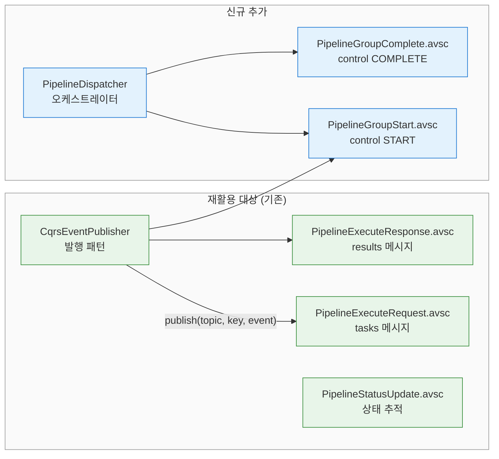
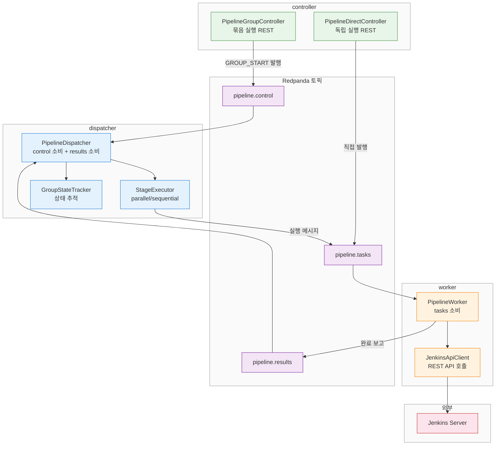

# Jenkins 파이프라인 묶음 순서 보장: Redpanda-Spring Boot 구현 설계
---
> 2-토픽 패턴을 기존 redpanda-spring-boot 프로젝트의 패턴(Avro + KafkaTemplate + CqrsEventPublisher)에 맞춰 구체적인 토픽, 스키마, 패키지 구성으로 매핑한다.

## 1. 기존 프로젝트 패턴 분석

redpanda-spring-boot 프로젝트에는 이미 파이프라인 관련 Avro 스키마 3개가 존재한다. ch07(REST → Consumer 전환) 실습용으로 만들어진 것이지만, 2-토픽 패턴의 tasks/results 메시지로 그대로 재활용할 수 있다.

기존 스키마의 필드 구성은 다음과 같다:

- `PipelineExecuteRequest`: `eventId`, `demandId`, `pipelineId`, `pipelineName`, `parameters`(JSON), `maxRetryCount`
- `PipelineExecuteResponse`: `eventId`, `demandId`, `success`, `buildNumber`, `statusDetail`, `durationMs`
- `PipelineStatusUpdate`: `eventId`, `demandId`, `previousStatus`, `currentStatus`(MessageStatus enum), `currentRetryCount`

세 스키마 모두 `demandId` 필드를 공유한다. 이 필드가 묶음의 `groupId`와 자연스럽게 매핑된다. 같은 묶음에 속하는 모든 메시지가 동일한 `demandId`를 갖게 되므로, 완료 보고를 수집할 때 groupId별 필터링이 가능하다.

프로젝트의 발행 패턴도 재활용 대상이다. `CqrsEventPublisher`는 `KafkaTemplate<String, Object>`에 Avro `SpecificRecord`를 전달하고, send 직전에 UUID v7 기반 `eventId`와 `timestamp`를 자동 주입한다. 토픽명 상수는 `@UtilityClass`인 `CqrsTopics`에서 관리하고, 토픽 생성은 `CqrsTopicConfig`에서 `NewTopic` 빈으로 등록한다.



## 2. 토픽 설계

토픽 네이밍은 기존 컨벤션(`{도메인}.{카테고리}.{이벤트}` 또는 `{도메인}.{카테고리}`)을 따른다. CQRS 도메인이 `social.events.*`를 사용하므로, 파이프라인 오케스트레이션 도메인은 `pipeline.*`을 사용한다.

토픽 3개를 구성한다:

- `pipeline.control`: 1파티션. 묶음 생명주기 이벤트(`GROUP_START`, `GROUP_COMPLETE`)를 순서대로 전달한다. 1파티션인 이유는 묶음 간 전역 순서를 보장하기 위해서다.
- `pipeline.tasks`: 3파티션 이상. 개별 파이프라인 실행 메시지를 전달한다. 파티션 키는 `{groupId}-{stageType}`으로, 같은 스테이지 타입의 메시지가 동일 파티션에 들어간다.
- `pipeline.results`: 3파티션 이상. Worker의 완료 보고를 전달한다. 파티션 키는 `groupId`로, Dispatcher가 묶음별로 결과를 수집한다.

results를 별도 토픽으로 분리하는 이유가 있다. tasks 토픽은 Dispatcher → Worker 방향이고 results는 Worker → Dispatcher 방향이다. 같은 토픽에 양방향 메시지를 섞으면 Consumer Group 설계가 복잡해진다. Dispatcher는 tasks를 produce하고 results를 consume하는 단방향 흐름이 깔끔하다.

```java
@UtilityClass
public class PipelineTopics {

    public static final String CONTROL = "pipeline.control";
    public static final String TASKS   = "pipeline.tasks";
    public static final String RESULTS = "pipeline.results";
}
```

토픽 생성은 `CqrsTopicConfig` 패턴을 따른다:

```java
@Configuration
public class PipelineTopicConfig {

    @Bean
    public NewTopic pipelineControl() {
        return TopicBuilder.name(PipelineTopics.CONTROL)
                .partitions(1)      // 전역 순서 보장
                .replicas(1)
                .build();
    }

    @Bean
    public NewTopic pipelineTasks() {
        return TopicBuilder.name(PipelineTopics.TASKS)
                .partitions(3)
                .replicas(1)
                .build();
    }

    @Bean
    public NewTopic pipelineResults() {
        return TopicBuilder.name(PipelineTopics.RESULTS)
                .partitions(3)
                .replicas(1)
                .build();
    }
}
```

## 3. Avro 스키마 설계

### 3-1. 기존 스키마 재활용

기존 `PipelineExecuteRequest`는 tasks 토픽 메시지로 그대로 사용한다. `demandId` 필드가 `groupId` 역할을 하고, `pipelineId`와 `parameters`가 Jenkins 빌드 트리거에 필요한 정보를 담는다. `maxRetryCount`도 이미 있으므로 Worker의 재시도 로직에 활용할 수 있다.

기존 `PipelineExecuteResponse`는 results 토픽 메시지로 사용한다. `demandId`로 어떤 묶음의 결과인지 식별하고, `success`로 성공/실패를 판단하며, `buildNumber`와 `durationMs`로 Jenkins 빌드 상세를 기록한다.

기존 `PipelineStatusUpdate`는 Dispatcher 내부에서 묶음 상태 전이를 추적하는 데 사용한다. `MessageStatus` enum의 `PENDING → RUNNING → COMPLETED/FAILED` 전이가 묶음 생명주기와 일치한다.

### 3-2. 신규 스키마

control 토픽용 스키마 2개만 신규로 추가한다.

`PipelineGroupStart.avsc`는 묶음 메타데이터를 담는다. `stages` 배열 안에 중첩 레코드(`StageDefinition`, `PipelineInstance`)를 선언하여 스테이지 구성을 표현한다:

```json
{
  "type": "record",
  "name": "PipelineGroupStart",
  "namespace": "com.study.redpanda.avro",
  "doc": "파이프라인 묶음 시작 이벤트 (control 토픽)",
  "fields": [
    {"name": "eventId",   "type": "string", "default": ""},
    {"name": "eventType", "type": "string", "default": "PIPELINE_GROUP_START"},
    {"name": "timestamp", "type": "long",   "default": 0, "logicalType": "timestamp-millis"},
    {"name": "groupId",   "type": "string", "doc": "묶음 고유 ID"},
    {"name": "stages",    "type": {"type": "array", "items": {
      "type": "record",
      "name": "StageDefinition",
      "fields": [
        {"name": "stageType", "type": "string", "doc": "build | test | deploy"},
        {"name": "mode",      "type": "string", "doc": "parallel | sequential"},
        {"name": "onFailure", "type": "string", "doc": "fail-fast | continue", "default": "fail-fast"},
        {"name": "instances", "type": {"type": "array", "items": {
          "type": "record",
          "name": "PipelineInstance",
          "fields": [
            {"name": "pipelineId",   "type": "string"},
            {"name": "pipelineName", "type": "string"},
            {"name": "parameters",   "type": ["null", "string"], "default": null}
          ]
        }}}
      ]
    }}}
  ]
}
```

`PipelineGroupComplete.avsc`는 묶음 완료 이벤트다. 전체 결과 요약을 포함한다:

```json
{
  "type": "record",
  "name": "PipelineGroupComplete",
  "namespace": "com.study.redpanda.avro",
  "doc": "파이프라인 묶음 완료 이벤트 (control 토픽)",
  "fields": [
    {"name": "eventId",       "type": "string", "default": ""},
    {"name": "eventType",     "type": "string", "default": "PIPELINE_GROUP_COMPLETE"},
    {"name": "timestamp",     "type": "long",   "default": 0, "logicalType": "timestamp-millis"},
    {"name": "groupId",       "type": "string", "doc": "묶음 고유 ID"},
    {"name": "success",       "type": "boolean", "doc": "전체 성공 여부"},
    {"name": "totalPipelines", "type": "int",   "doc": "전체 파이프라인 수"},
    {"name": "failedCount",   "type": "int",    "doc": "실패 파이프라인 수", "default": 0},
    {"name": "durationMs",    "type": "long",   "doc": "묶음 전체 소요 시간 (ms)"}
  ]
}
```

`eventId`와 `timestamp`에 `default`를 설정한 이유는 기존 `CqrsEventPublisher` 패턴과 동일하다. 빌더에서 이 필드 없이 `build()`를 호출해도 되고, Publisher가 send 직전에 UUID v7과 현재 시각을 자동 주입한다.

### 3-3. 스키마 파일 배치

```
src/main/avro/
├── ch02/
│   ├── PipelineExecuteRequest.avsc    ← 기존 유지 (tasks 메시지)
│   ├── PipelineExecuteResponse.avsc   ← 기존 유지 (results 메시지)
│   ├── PipelineStatusUpdate.avsc      ← 기존 유지 (상태 추적)
│   └── MessageStatus.avsc            ← 기존 유지 (상태 enum)
└── pipeline/                          ← 신규 디렉토리
    ├── PipelineGroupStart.avsc        ← 신규
    └── PipelineGroupComplete.avsc     ← 신규
```

## 4. 패키지 구성

기존 프로젝트가 챕터별 패키지(`ch02`, `ch03`, `cqrs`)로 분리되어 있으므로, 파이프라인 오케스트레이션도 독립 패키지로 구성한다.

```
com.study.redpanda.pipeline/
├── config/
│   ├── PipelineTopics.java            # 토픽명 상수
│   ├── PipelineTopicConfig.java       # NewTopic 빈 등록
│   └── PipelineKafkaConfig.java       # KafkaTemplate, ConsumerFactory
├── dispatcher/
│   ├── PipelineDispatcher.java        # @KafkaListener(CONTROL) + @KafkaListener(RESULTS)
│   ├── StageExecutor.java             # parallel/sequential 전략 실행
│   └── GroupStateTracker.java         # 묶음 상태 인메모리 추적
├── worker/
│   ├── PipelineWorker.java            # @KafkaListener(TASKS) → Jenkins API → RESULTS 발행
│   └── JenkinsApiClient.java          # Jenkins REST API 호출
├── publisher/
│   └── PipelineEventPublisher.java    # CqrsEventPublisher 패턴 복제
└── controller/
    ├── PipelineGroupController.java   # POST /pipeline/group/start (묶음 실행)
    └── PipelineDirectController.java  # POST /pipeline/execute (독립 실행)
```



## 5. 핵심 컴포넌트 설계

### 5-1. PipelineEventPublisher

`CqrsEventPublisher`와 동일한 패턴이다. 별도 빈으로 분리하는 이유는 CQRS와 파이프라인이 서로 다른 `KafkaTemplate` 빈을 사용할 수 있기 때문이다(Schema Registry 설정, 직렬화 설정 등이 다를 수 있다). 동일한 설정이라면 `CqrsEventPublisher`를 그대로 주입받아도 무방하다.

```java
@Component
public class PipelineEventPublisher {

    private final KafkaTemplate<String, Object> kafkaTemplate;

    public PipelineEventPublisher(
            @Qualifier("pipelineKafkaTemplate") KafkaTemplate<String, Object> kafkaTemplate) {
        this.kafkaTemplate = kafkaTemplate;
    }

    public String publish(String topic, String key, SpecificRecord event) {
        String eventId = UuidCreator.getTimeOrderedEpoch().toString();
        long timestamp = Instant.now().toEpochMilli();

        Schema schema = event.getSchema();
        Optional.ofNullable(schema.getField("eventId"))
                .ifPresent(f -> event.put(f.pos(), eventId));
        Optional.ofNullable(schema.getField("timestamp"))
                .ifPresent(f -> event.put(f.pos(), timestamp));

        kafkaTemplate.send(topic, key, event);
        return eventId;
    }
}
```

### 5-2. PipelineDispatcher

Dispatcher는 두 개의 `@KafkaListener`를 갖는다. control 토픽에서 `PipelineGroupStart`를 소비하고, results 토픽에서 `PipelineExecuteResponse`를 소비한다. control 리스너의 `concurrency`는 반드시 1이어야 한다. 1파티션 토픽이므로 Consumer가 1개를 초과하면 유휴 Consumer가 된다.

```java
@Component
@RequiredArgsConstructor
public class PipelineDispatcher {

    private final StageExecutor stageExecutor;
    private final GroupStateTracker stateTracker;
    private final PipelineEventPublisher publisher;

    @KafkaListener(
            topics = PipelineTopics.CONTROL,
            groupId = "pipeline-dispatcher",
            concurrency = "1"
    )
    public void onGroupStart(PipelineGroupStart event) {
        String groupId = event.getGroupId();
        stateTracker.register(groupId, event.getStages());

        for (StageDefinition stage : event.getStages()) {
            stageExecutor.execute(groupId, stage);
            stateTracker.awaitStageCompletion(groupId, stage.getStageType());
        }

        publisher.publish(
                PipelineTopics.CONTROL, groupId
                , buildGroupComplete(groupId)
        );
    }

    @KafkaListener(
            topics = PipelineTopics.RESULTS,
            groupId = "pipeline-dispatcher"
    )
    public void onResult(PipelineExecuteResponse response) {
        stateTracker.recordCompletion(
                response.getDemandId()
                , response.getEventId()
                , response.getSuccess()
        );
    }
}
```

### 5-3. StageExecutor

스테이지 실행 모드에 따라 tasks 발행 전략을 결정한다:

```java
@Component
@RequiredArgsConstructor
public class StageExecutor {

    private final PipelineEventPublisher publisher;

    public void execute(String groupId, StageDefinition stage) {
        if ("parallel".equals(stage.getMode())) {
            executeParallel(groupId, stage);
        } else {
            executeSequential(groupId, stage);
        }
    }

    private void executeParallel(String groupId, StageDefinition stage) {
        String partitionKey = groupId + "-" + stage.getStageType();
        for (PipelineInstance instance : stage.getInstances()) {
            publisher.publish(
                    PipelineTopics.TASKS, partitionKey
                    , toExecuteRequest(groupId, instance)
            );
        }
    }

    private void executeSequential(String groupId, StageDefinition stage) {
        // 순차 실행은 GroupStateTracker와 연동하여
        // 1건 발행 → 완료 대기 → 다음 1건 발행
        String partitionKey = groupId + "-" + stage.getStageType();
        for (PipelineInstance instance : stage.getInstances()) {
            publisher.publish(
                    PipelineTopics.TASKS, partitionKey
                    , toExecuteRequest(groupId, instance)
            );
            // GroupStateTracker.awaitInstanceCompletion() 호출
        }
    }
}
```

### 5-4. PipelineWorker

Worker는 tasks 토픽을 소비하고, Jenkins API를 호출한 뒤 results를 발행한다. `concurrency = "3"`으로 설정하면 3개 파티션을 각각 1개 스레드가 소비한다:

```java
@Component
@RequiredArgsConstructor
public class PipelineWorker {

    private final JenkinsApiClient jenkinsClient;
    private final PipelineEventPublisher publisher;

    @KafkaListener(
            topics = PipelineTopics.TASKS,
            groupId = "pipeline-worker",
            concurrency = "3"
    )
    public void onTask(PipelineExecuteRequest request) {
        boolean standalone = "STANDALONE".equals(request.getDemandId());

        JenkinsBuildResult result = jenkinsClient.triggerAndWait(
                request.getPipelineId()
                , request.getParameters()
                , request.getMaxRetryCount()
        );

        if (!standalone) {
            PipelineExecuteResponse response = PipelineExecuteResponse.newBuilder()
                    .setDemandId(request.getDemandId())
                    .setSuccess(result.isSuccess())
                    .setBuildNumber(result.getBuildNumber())
                    .setDurationMs(result.getDurationMs())
                    .setStatusDetail(result.getStatusDetail())
                    .build();

            publisher.publish(
                    PipelineTopics.RESULTS, request.getDemandId()
                    , response
            );
        }
    }
}
```

독립 실행 시 `demandId`가 `"STANDALONE"`이면 results 발행을 건너뛴다. Worker의 Jenkins 호출 로직은 묶음/독립 구분 없이 동일하다.

## 6. 독립 실행 경로

독립 실행은 control 토픽을 거치지 않고 tasks 토픽에 직접 메시지를 발행한다. `PipelineDirectController`가 이 역할을 담당한다:

```java
@RestController
@RequestMapping("/pipeline")
@RequiredArgsConstructor
public class PipelineDirectController {

    private final PipelineEventPublisher publisher;

    @PostMapping("/execute")
    public ResponseEntity<String> executeSingle(@RequestBody PipelineExecuteDto dto) {
        PipelineExecuteRequest request = PipelineExecuteRequest.newBuilder()
                .setDemandId("STANDALONE")
                .setPipelineId(dto.pipelineId())
                .setPipelineName(dto.pipelineName())
                .setParameters(dto.parameters())
                .setSourceModule("direct-api")
                .setTargetModule("jenkins")
                .setMaxRetryCount(3)
                .build();

        String eventId = publisher.publish(
                PipelineTopics.TASKS, "STANDALONE"
                , request
        );

        return ResponseEntity.ok(eventId);
    }
}
```

묶음 실행과 독립 실행이 동일한 tasks 토픽과 Worker 풀을 공유한다. 인프라 이중화 없이 `demandId` 값으로만 경로를 구분한다.

## 7. 기존 스키마 재활용 요약

| 기존 Avro 스키마 | 원래 용도 (ch07) | 2-토픽 패턴 역할 | 매핑 필드 |
|-----------------|-----------------|-----------------|----------|
| `PipelineExecuteRequest` | REST → Consumer 전환 실습 | tasks 토픽 메시지 | `demandId` = groupId |
| `PipelineExecuteResponse` | Jenkins 실행 결과 | results 토픽 메시지 | `demandId` = groupId |
| `PipelineStatusUpdate` | 상태 전이 로깅 | Dispatcher 내부 추적 | `MessageStatus` enum 재활용 |

신규 추가는 `PipelineGroupStart.avsc`와 `PipelineGroupComplete.avsc` 2개뿐이다. 발행 패턴(`CqrsEventPublisher`), 직렬화(Avro + Schema Registry), UUID v7 생성, 토픽 상수 관리(`@UtilityClass`) 모두 기존 인프라를 그대로 따른다.

상위 설계(2-토픽 패턴 원리, Jenkins 병렬 실행 메커니즘, 한계와 고려사항)는 `jenkins-pipeline-batch-ordering.md`를 참조한다.
