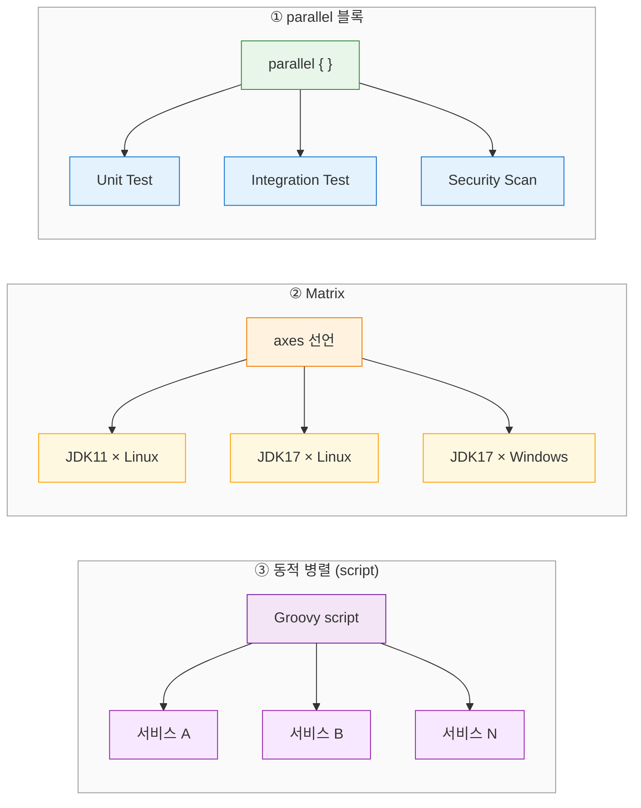
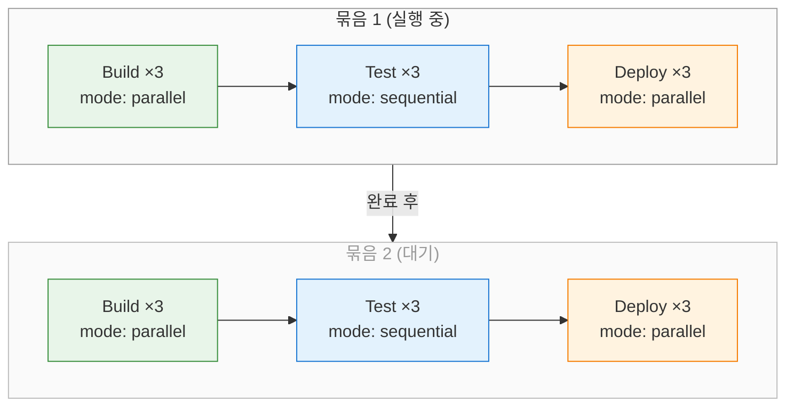
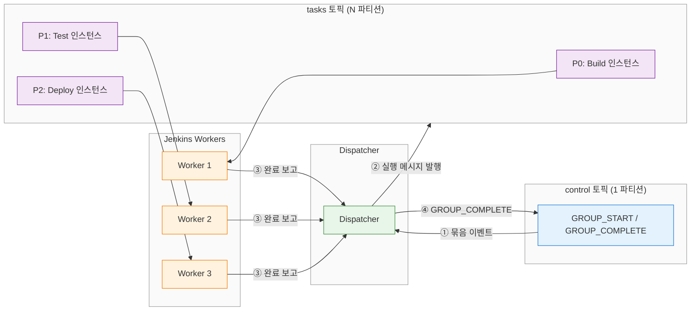
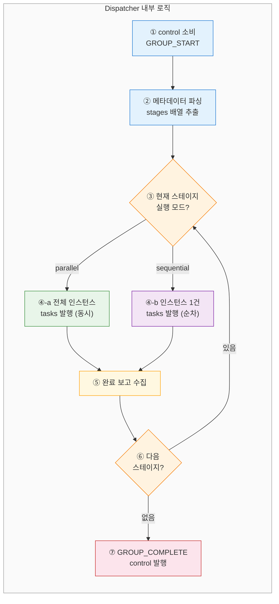
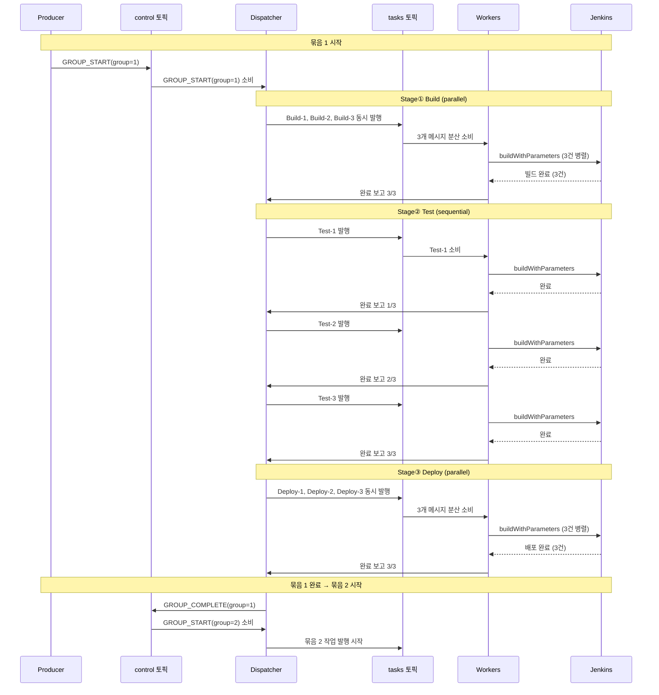
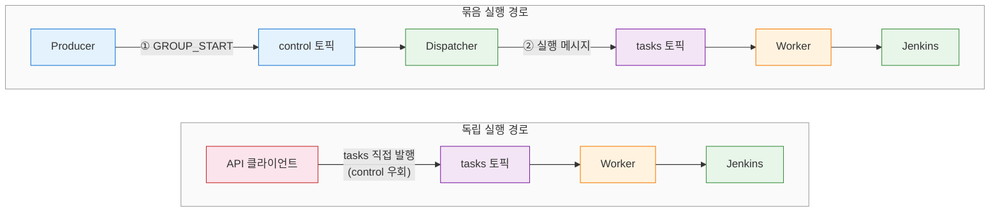
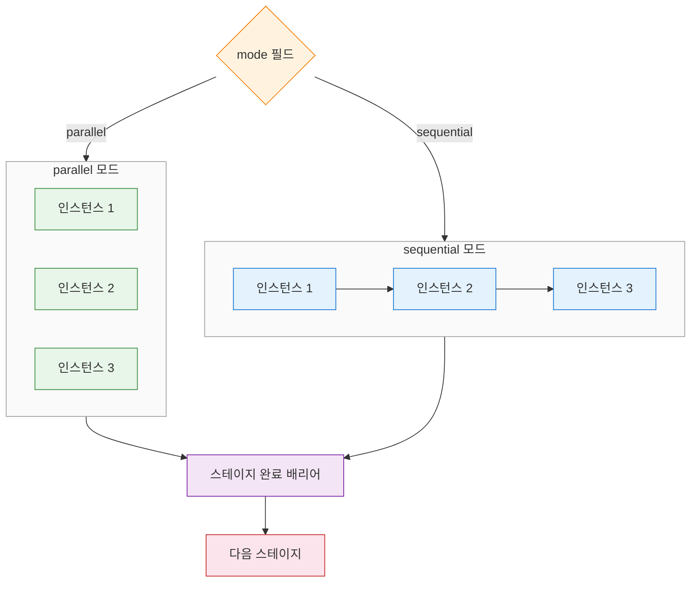

# Jenkins 파이프라인 묶음 순서 보장: 2-토픽 패턴 적용
---
> 메시지큐의 2-토픽 파이프라인 패턴을 Jenkins 오케스트레이션에 매핑하여, 묶음(Pipeline Group) 간 순서를 보장하면서 묶음 내부에서는 병렬/순차 실행을 유연하게 제어하는 설계를 다룬다.

## 1. Jenkins의 병렬 실행 메커니즘

Jenkins는 단일 파이프라인 안에서 병렬 실행을 지원하는 세 가지 방식을 제공한다. `parallel {}` 블록은 독립적인 스테이지를 동시에 실행하고, `matrix`는 축(axis) 조합을 자동 생성하며, Scripted Pipeline의 동적 병렬은 런타임 데이터를 기반으로 스테이지를 구성한다.

`parallel {}` 블록은 Declarative Pipeline에서 가장 기본적인 병렬 실행 수단이다. `failFast true`를 설정하면 하나의 스테이지가 실패할 때 나머지를 즉시 중단하여 빠른 피드백을 얻고, `failFast false`(기본값)는 모든 스테이지를 끝까지 실행하여 전체 실패 목록을 한 번에 확인할 수 있게 한다. Matrix 빌드는 JDK 버전 × OS 같은 다축 조합을 선언만으로 생성하므로 조합이 늘어나도 Jenkinsfile 수정이 최소화된다.

동적 병렬은 Scripted Pipeline의 `parallel` 함수에 Map을 전달하는 방식이다. 예를 들어 DB에서 서비스 목록을 조회한 뒤 각 서비스에 대한 빌드 스테이지를 런타임에 구성할 수 있다. Declarative Pipeline만으로는 이런 동적 생성이 불가능하므로 `script {}` 블록 안에서 Scripted 문법을 사용해야 한다.



이 세 방식은 모두 **단일 파이프라인 내부**의 병렬성을 다룬다. Jenkins Agent 풀에 여유 executor가 있으면 병렬 스테이지가 각각 executor를 할당받아 동시에 실행된다. 하지만 "여러 파이프라인을 하나의 묶음으로 묶고, 묶음 간 순서를 보장한다"는 요구사항은 Jenkins의 기본 기능으로 제공되지 않는다. Upstream/Downstream 트리거는 1:1 체인에 적합하지만, N개 파이프라인의 전체 완료를 기다렸다가 다음 묶음을 시작하는 배리어 역할은 하지 못한다.

## 2. 시나리오 정의

묶음(Pipeline Group)은 빌드, 테스트, 배포 등 여러 타입의 파이프라인을 포함하는 상위 실행 단위다. 각 타입마다 3개의 인스턴스가 존재하고, 타입 내부의 실행 모드(병렬 또는 순차)를 지정할 수 있다. 개별 파이프라인은 묶음 없이 독립 실행도 가능해야 한다.

핵심 제약은 **묶음 간 순서 보장**이다. 묶음 1의 모든 파이프라인(Build 3개 → Test 3개 → Deploy 3개)이 완료되어야 묶음 2가 시작된다. 묶음 1 내부에서 Build 타입은 병렬로 3개를 동시 실행하고, Test 타입은 순차로 하나씩 실행하는 식의 유연한 제어가 요구된다.



이 구조에서 묶음은 **스테이지의 배열**로 표현된다. 각 스테이지는 타입(Build/Test/Deploy), 인스턴스 수, 실행 모드를 갖는다. 스테이지 간 순서는 배열의 순서가 결정하고, 스테이지 내 인스턴스 간 병렬/순차는 실행 모드가 결정한다. 개별 파이프라인을 독립 실행할 때는 이 묶음 구조를 거치지 않고 직접 Jenkins 파이프라인을 트리거한다.

## 3. 2-토픽 패턴 매핑

2-토픽 파이프라인 패턴의 원리는 `message-queue-batch-ordering.md` § 4에서 다루었다. control 토픽(1파티션)이 묶음 순서를 전역적으로 보장하고, tasks 토픽(N파티션)이 실제 작업을 병렬 처리하는 구조다. 이 절에서는 이 패턴을 Jenkins 파이프라인 오케스트레이션에 구체적으로 매핑한다.

### 3-1. 토픽 설계

control 토픽은 묶음의 생명주기 이벤트를 전달한다. `PIPELINE_GROUP_START`는 묶음 실행 요청을, `PIPELINE_GROUP_COMPLETE`는 묶음 완료를 나타낸다. 이 토픽은 1파티션으로 구성되어 묶음 간 전역 순서를 보장한다.

tasks 토픽은 개별 파이프라인 실행 메시지를 전달한다. 파티션 키는 `{groupId}-{stageType}`으로 설정하여, 같은 묶음의 같은 타입에 속하는 파이프라인이 동일 파티션에 들어간다. 순차 실행 모드일 때 파티션 내 순서가 인스턴스 실행 순서가 된다. 병렬 실행 모드일 때는 여러 Worker가 같은 파티션을 소비하거나, Dispatcher가 한꺼번에 발행하여 Worker들이 분산 소비한다.



control 토픽의 메시지에는 묶음 메타데이터가 포함된다. 스테이지 배열, 각 스테이지의 인스턴스 목록, 실행 모드 등이 JSON 형태로 들어간다. Dispatcher는 이 메타데이터를 해석해서 tasks 토픽에 적절한 순서와 타이밍으로 실행 메시지를 발행한다.

### 3-2. Dispatcher 역할

Dispatcher는 control 토픽에서 `PIPELINE_GROUP_START` 이벤트를 소비하면 묶음 메타데이터를 파싱한다. 스테이지 배열을 순서대로 순회하면서, 각 스테이지의 실행 모드에 따라 tasks 토픽에 메시지를 발행한다. 병렬 모드면 해당 스테이지의 모든 인스턴스 메시지를 한꺼번에 발행하고, 순차 모드면 첫 번째 인스턴스만 발행한 뒤 완료 보고를 기다렸다가 다음 인스턴스를 발행한다.

Worker는 tasks 토픽에서 메시지를 소비하면 Jenkins API를 호출하여 해당 파이프라인을 트리거한다. Jenkins의 `buildWithParameters` API로 빌드를 시작하고, `wfapi/describe` API로 상태를 폴링하여 완료를 감지한다. 완료 후 Dispatcher에게 결과를 보고한다.



Jenkins API 호출 방식과 메시지큐 Worker 방식에는 차이가 있다. Jenkins API 방식에서 Worker는 Jenkins REST API(`POST /job/.../buildWithParameters`)를 호출하여 빌드를 트리거하고 상태를 폴링한다. 메시지큐 Worker 방식에서는 Worker 자체가 빌드 로직을 실행한다. Jenkins 파이프라인 오케스트레이션에서는 Jenkins가 이미 빌드 실행 엔진이므로, Worker는 "Jenkins API를 호출하는 브릿지"로 동작하는 것이 자연스럽다.

### 3-3. 처리 흐름 (전체 시퀀스)

아래 시퀀스는 묶음 1이 Build(병렬 3개) → Test(순차 3개) → Deploy(병렬 3개) 순서로 처리되고, 완료 후 묶음 2가 시작되는 전체 흐름을 보여준다.



묶음 1의 세 스테이지가 순서대로 처리되고, 각 스테이지 내부는 지정된 모드(parallel/sequential)로 실행된다. Dispatcher는 현재 스테이지의 모든 완료 보고를 받아야 다음 스테이지로 진행한다. 묶음 1 전체가 완료되면 control 토픽에 `GROUP_COMPLETE`를 발행하고, 그 다음에야 묶음 2의 `GROUP_START`를 소비한다.

### 3-4. 개별 파이프라인 독립 실행

묶음 순서 보장이 필요하지 않은 경우, 개별 파이프라인을 독립적으로 실행할 수 있어야 한다. 이때는 control 토픽을 거치지 않고 tasks 토픽에 직접 메시지를 발행한다. Worker가 이 메시지를 소비하면 Jenkins API를 호출하여 해당 파이프라인만 실행한다.

독립 실행 메시지에는 `groupId`가 없거나 특수 값(예: `STANDALONE`)이 설정된다. Worker는 `groupId`를 확인하여 묶음에 속하지 않는 메시지임을 인식하고, Dispatcher에게 완료 보고를 보내지 않는다. 묶음 순서 제약이 적용되지 않으므로 즉시 처리된다.



이 설계의 장점은 묶음 실행과 독립 실행이 동일한 tasks 토픽과 Worker 풀을 공유한다는 것이다. 인프라를 이중으로 관리할 필요가 없고, Worker의 Jenkins API 호출 로직도 동일하다. 차이는 메시지 발행 경로(control 경유 vs 직접 발행)와 완료 보고 대상(Dispatcher vs 없음)뿐이다.

## 4. 실행 모드 제어 설계

묶음 메타데이터는 `PIPELINE_GROUP_START` 메시지의 페이로드로 전달된다. 핵심 구조는 `stages` 배열이며, 배열의 순서가 곧 스테이지 실행 순서다.

묶음 메타데이터의 JSON 구조는 다음과 같다:

```json
{
  "groupId": "release-2024-03-15",
  "stages": [
    {
      "type": "build",
      "mode": "parallel",
      "instances": [
        { "pipelineId": "acme-api-build", "params": { "branch": "main" } },
        { "pipelineId": "acme-web-build", "params": { "branch": "main" } },
        { "pipelineId": "acme-batch-build", "params": { "branch": "main" } }
      ]
    },
    {
      "type": "test",
      "mode": "sequential",
      "instances": [
        { "pipelineId": "acme-api-test", "params": { "suite": "smoke" } },
        { "pipelineId": "acme-web-test", "params": { "suite": "smoke" } },
        { "pipelineId": "acme-batch-test", "params": { "suite": "regression" } }
      ]
    },
    {
      "type": "deploy",
      "mode": "parallel",
      "instances": [
        { "pipelineId": "acme-api-deploy", "params": { "env": "staging" } },
        { "pipelineId": "acme-web-deploy", "params": { "env": "staging" } },
        { "pipelineId": "acme-batch-deploy", "params": { "env": "staging" } }
      ]
    }
  ]
}
```

`stages[0]`이 Build(parallel)이므로 3개 인스턴스가 동시에 실행된다. 3개 모두 완료되면 `stages[1]`인 Test(sequential)로 넘어가 인스턴스를 하나씩 실행한다. Test 3개가 순차 완료되면 `stages[2]`인 Deploy(parallel)가 3개 동시에 실행된다. Dispatcher는 이 배열을 인덱스 순으로 순회하면서 실행 모드에 따라 발행 전략을 결정한다.



parallel 모드에서 Dispatcher는 해당 스테이지의 모든 인스턴스 메시지를 tasks 토픽에 한꺼번에 발행한다. Worker들이 분산 소비하여 동시에 Jenkins 빌드를 트리거하고, 모든 완료 보고가 도착하면 배리어를 통과한다. sequential 모드에서는 Dispatcher가 인스턴스를 하나씩 발행하고, 완료 보고를 받은 뒤에야 다음 인스턴스를 발행한다. 어느 모드든 스테이지 단위의 배리어는 동일하게 작동한다.

## 5. 한계와 고려사항

이 설계에는 운영 환경에서 주의해야 할 몇 가지 한계가 있다.

**Dispatcher 단일 장애점(SPOF)**. Dispatcher가 다운되면 묶음 처리가 중단된다. control 토픽의 마지막 커밋 오프셋부터 재개할 수 있으므로 메시지 유실은 없지만, 재시작까지의 지연이 발생한다. 이를 완화하려면 Standby Dispatcher를 두고 Consumer Group의 리밸런싱으로 failover하는 방식이 있다. Dispatcher는 상태를 control 토픽 이벤트에서 재구성할 수 있으므로, 별도 상태 저장소 없이 이벤트 소싱으로 복구가 가능하다.

**Jenkins API 호출 실패 처리**. Worker가 Jenkins `buildWithParameters` API를 호출할 때 네트워크 오류, Jenkins 서버 다운, Queue 포화 등으로 실패할 수 있다. 재시도 정책(exponential backoff)과 최대 재시도 횟수를 설정해야 한다. Jenkins 빌드가 시작된 뒤 상태 폴링 중 타임아웃이 발생하면, 빌드가 실제로 실행 중인지 확인한 후 판단해야 한다. 중복 트리거 방지를 위해 멱등성 키(`groupId` + `stageType` + `instanceIndex`)를 Jenkins 빌드 파라미터에 포함시키는 것이 안전하다.

**묶음 내 일부 실패 시 전략**. 스테이지 내 인스턴스 중 하나가 실패했을 때 두 가지 선택지가 있다. fail-fast 전략은 나머지 인스턴스를 즉시 중단하고 묶음 전체를 실패로 처리한다. continue 전략은 나머지 인스턴스를 계속 실행하되 묶음의 최종 상태를 `PARTIAL_FAILURE`로 표시한다. 이 전략은 스테이지 메타데이터에 `onFailure: "fail-fast" | "continue"` 필드로 지정할 수 있다. Jenkins의 `failFast` 옵션과 같은 개념을 묶음 레벨로 확장한 것이다.

**처리량과 확장성**. Worker 수를 늘리면 병렬 모드의 처리량이 선형적으로 증가하지만, Dispatcher는 단일 Consumer이므로 스테이지 전환과 완료 보고 수집이 병목이 될 수 있다. 묶음당 수백 개의 인스턴스가 동시에 완료 보고를 보내면 Dispatcher의 처리량 한계에 부딪힌다. 이 경우 완료 보고를 별도 토픽으로 분리하고 카운터 기반으로 집계하는 방식을 고려한다.

2-토픽 패턴의 원리와 다른 접근법(Batch Coordinator, 단일 파티션 + 인프로세스 병렬)과의 비교는 `message-queue-batch-ordering.md` § 4~6을 참조한다.
