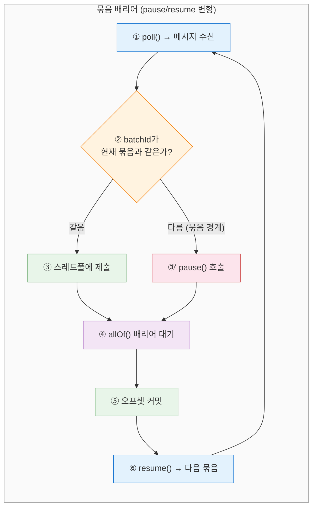
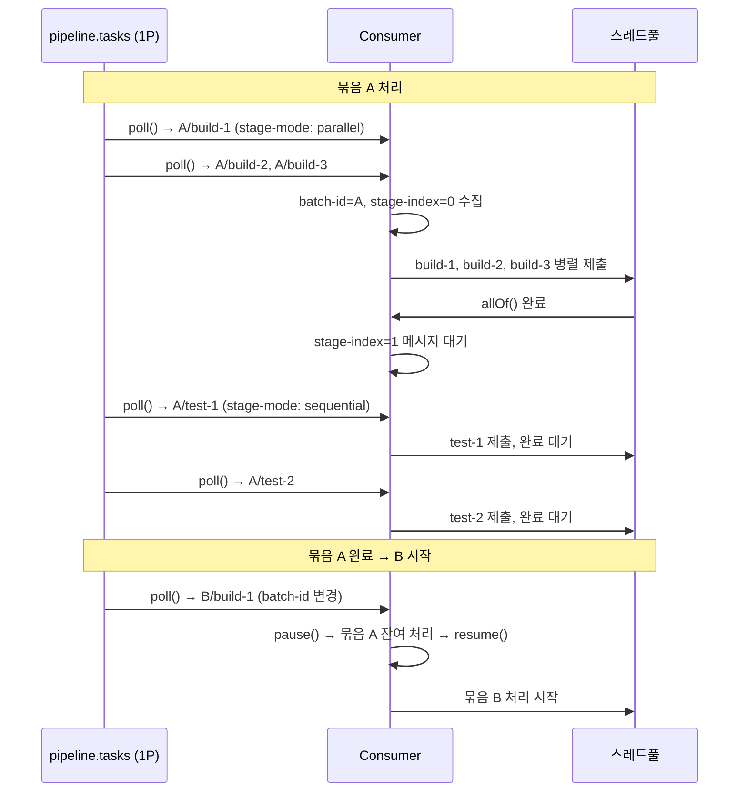
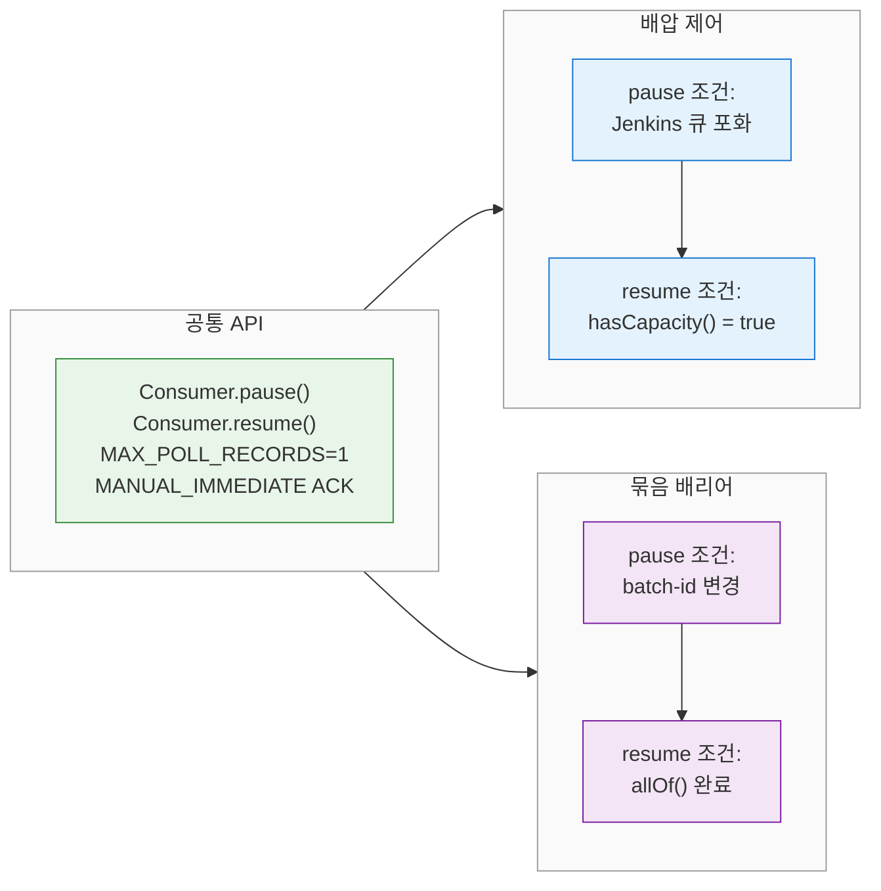
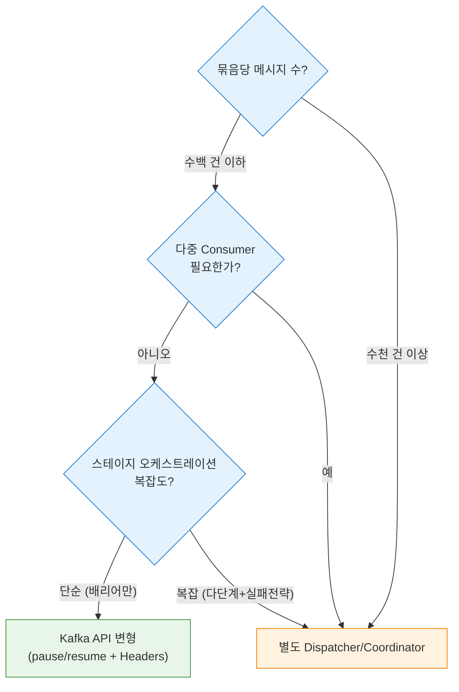

# Kafka API만으로 묶음 순서 보장이 가능한가?
---
> 커스텀 컴포넌트(Dispatcher, Coordinator) 없이 Kafka/Redpanda API 원시 기능만으로 묶음(batch) 간 순서를 제어할 수 있는지 분석한다. 결론부터 말하면, Level 2(묶음 간 순서) 보장은 Kafka API만으로 불가능하다. 배리어 로직은 반드시 애플리케이션 레이어에 존재해야 하지만, `pause()`/`resume()` API를 활용하면 별도 프로세스 없이 Consumer 내부에서 배리어를 구현할 수 있다.

## 1. Kafka가 제공하는 순서 프리미티브

Kafka/Redpanda가 브로커 수준에서 보장하는 순서는 **파티션 내 메시지 순서** 하나뿐이다. 같은 파티션에 들어간 메시지는 오프셋 순서대로 소비된다. 이 프리미티브로 Level 1(그룹 키 순서)은 해결할 수 있다. 파티션 키 해싱으로 같은 키의 메시지가 같은 파티션에 들어가면, 해당 키에 대한 순서가 자동으로 보장된다.

하지만 "묶음 A 전체 완료 → 묶음 B 시작"이라는 배리어는 브로커가 제공하지 않는다. 브로커는 메시지를 저장하고 전달할 뿐, 메시지 그룹의 완료 상태를 추적하거나 다음 그룹의 소비를 차단하는 기능이 없다. 이 배리어는 본질적으로 애플리케이션 레벨의 상태 관리 문제이기 때문이다.


## 2. Kafka API 프리미티브 능력표

각 프리미티브가 묶음 순서 보장에 기여할 수 있는지 정리한다:

| Kafka 프리미티브 | 본래 용도 | Level 1 (그룹 내 순서) | Level 2 (묶음 간 배리어) | 비고 |
|-----------------|----------|:---------------------:|:----------------------:|------|
| 파티션 키 해싱 | 같은 키 → 같은 파티션 | O | X | 묶음 경계를 인식하지 못함 |
| `max.poll.records` | poll당 레코드 수 제한 | - | X | 흐름 제어일 뿐 배리어 아님 |
| `pause()`/`resume()` | 파티션별 소비 일시정지/재개 | - | **부분적** | 아래 § 3에서 상세 |
| Kafka Transactions | 원자적 produce + offset commit | - | X | 원자성이지 순서가 아님 |
| Kafka Headers | 메시지에 메타데이터 첨부 | - | X | 정보 전달만, 배리어 불가 |
| `ConsumerRebalanceListener` | 파티션 재할당 콜백 | - | X | failover용, 배리어 무관 |
| `AdminClient.createPartitions()` | 동적 파티션 추가 | - | X | 토폴로지 변경, 배리어 무관 |

표에서 드러나듯, 묶음 간 배리어에 "부분적"이라도 기여할 수 있는 프리미티브는 `pause()`/`resume()` 하나뿐이다. 나머지는 본래 용도 자체가 순서 제어와 무관하다.

## 3. pause/resume: 배압 패턴에서 묶음 배리어로

### 3-1. 배압 패턴의 구조

`jenkins-queue-backpressure-with-redpanda` 문서에서 다룬 배압 제어 패턴은 다음과 같은 구조를 갖는다:

```java
// 배압 조건: Jenkins 큐에 여유가 있는가?
if (!queueMonitor.hasCapacity()) {
    pauseConsumer();                    // pause()
    throw new JenkinsQueueFullException("Jenkins queue is full");
}

// 주기적 상태 확인 → resume
@Scheduled(fixedDelay = 10_000)
public void checkAndResume() {
    if (container.isPauseRequested() && queueMonitor.hasCapacity()) {
        container.resume();             // resume()
    }
}
```

이 패턴의 핵심 요소는 세 가지다:

- `MAX_POLL_RECORDS=1` + `MANUAL_IMMEDIATE` ACK로 건별 정밀 제어
- `hasCapacity()`가 외부 시스템(Jenkins 큐)의 상태를 판단
- `@Scheduled`로 주기적으로 재개 조건을 확인

### 3-2. 배리어 조건으로의 전환

배압 패턴과 묶음 배리어 패턴은 구조가 동일하다. 차이는 pause/resume의 **조건**뿐이다:

| 요소 | 배압 패턴 | 묶음 배리어 패턴 |
|------|----------|----------------|
| pause 조건 | Jenkins 큐 포화 | 현재 묶음의 batchId와 다른 메시지 도착 |
| resume 조건 | Jenkins 큐 여유 발생 | 현재 묶음의 모든 메시지 처리 완료 |
| 상태 판단 | `JenkinsQueueMonitor.hasCapacity()` | `BatchBarrier.isCurrentBatchComplete()` |
| 확인 주기 | `@Scheduled(fixedDelay = 10_000)` | `CompletableFuture.allOf()` 콜백 |

배압 패턴에서 `hasCapacity()`를 `isCurrentBatchComplete()`로 교체하면 묶음 배리어가 된다. `@Scheduled` 폴링 대신 `CompletableFuture.allOf()`의 완료 콜백에서 `resume()`을 호출하면 불필요한 폴링 없이 즉시 재개할 수 있다.



### 3-3. 의사 코드

배압 문서의 `JenkinsBuildConsumer` 구조를 묶음 배리어용으로 변환하면 다음과 같다:

```java
@Component
@RequiredArgsConstructor
public class BatchBarrierConsumer {

    private final KafkaListenerEndpointRegistry registry;
    private final ExecutorService threadPool;

    private String currentBatchId = null;
    private final List<CompletableFuture<Void>> pendingTasks = new ArrayList<>();

    private static final String LISTENER_ID = "batch-barrier-listener";

    @KafkaListener(
        id = LISTENER_ID,
        topics = "pipeline.tasks",
        groupId = "batch-barrier-consumer",
        containerFactory = "batchBarrierContainerFactory"
    )
    public void consume(ConsumerRecord<String, byte[]> record, Acknowledgment ack) {
        String batchId = new String(record.headers().lastHeader("batch-id").value());

        if (currentBatchId != null && !currentBatchId.equals(batchId)) {
            // 묶음 경계 감지 → pause + 현재 묶음 완료 대기
            pauseConsumer();
            awaitAndCommitCurrentBatch(ack);
            currentBatchId = batchId;
            resumeConsumer();
        }

        if (currentBatchId == null) {
            currentBatchId = batchId;
        }

        // 스레드풀에 작업 제출
        CompletableFuture<Void> task = CompletableFuture.runAsync(
            () -> processMessage(record), threadPool
        );
        pendingTasks.add(task);
    }

    private void awaitAndCommitCurrentBatch(Acknowledgment ack) {
        CompletableFuture.allOf(pendingTasks.toArray(new CompletableFuture[0])).join();
        ack.acknowledge();
        pendingTasks.clear();
    }

    private void pauseConsumer() {
        MessageListenerContainer container = registry.getListenerContainer(LISTENER_ID);
        if (container != null && container.isRunning()) {
            container.pause();
        }
    }

    private void resumeConsumer() {
        MessageListenerContainer container = registry.getListenerContainer(LISTENER_ID);
        if (container != null && container.isPauseRequested()) {
            container.resume();
        }
    }
}
```

배압 문서의 `@Scheduled` 폴링 대신 `CompletableFuture.allOf().join()`으로 동기 대기하는 점이 다르다. 배압은 외부 시스템(Jenkins)의 상태 변화를 기다려야 하므로 폴링이 자연스럽지만, 묶음 배리어는 자체 스레드풀의 완료를 기다리는 것이므로 동기 대기가 적합하다.

## 4. 단일 토픽 변형 설계

Kafka Headers를 활용하면 control 토픽 없이 단일 토픽으로 묶음 메타데이터를 전달할 수 있다. 2-토픽 패턴의 control 토픽이 하던 역할을 메시지 헤더가 대신한다.

### 4-1. 헤더 설계

```
토픽: pipeline.tasks (1 파티션)
메시지 헤더:
  - batch-id: "release-2024-03-15"
  - batch-size: "9"
  - stage-type: "build"
  - stage-mode: "parallel"
  - stage-index: "0"
```

`batch-size` 헤더가 핵심이다. Consumer는 같은 `batch-id`의 메시지를 카운트하다가 `batch-size`에 도달하면 묶음이 완전히 수신된 것으로 판단한다. control 토픽의 `BATCH_START` 메시지가 전달하던 메타데이터를 각 메시지의 헤더에 분산 저장하는 방식이다.

### 4-2. Consumer 흐름



Consumer 내부 로직은 다음 단계를 따른다:

- `poll()`로 메시지를 가져오고 `batch-id` 헤더를 읽는다.
- 같은 `batch-id` + 같은 `stage-index`인 메시지를 수집한다.
- `stage-mode`에 따라 병렬(`CompletableFuture.allOf()`) 또는 순차(하나씩 완료 대기) 처리한다.
- 스테이지 완료 후 다음 `stage-index` 메시지를 처리한다.
- `batch-id`가 변경되면 `pause()` → 현재 묶음 완료 대기 → 오프셋 커밋 → `resume()`한다.

## 5. 접근법 3과의 비교

이 "Kafka API 최대 활용" 방식은 `message-queue-batch-ordering.md` § 5의 접근법 3(단일 파티션 + 인프로세스 병렬)의 변형이다. 근본적 구조는 동일하지만 몇 가지 차이가 있다.

| 속성 | 접근법 3 (원본) | Kafka API 변형 | 차이의 이유 |
|------|---------------|---------------|-----------|
| 묶음 경계 감지 | `batchId` 변경 시 | `batchId` 변경 + `pause()` | pause로 소비를 명시적 차단 |
| 배리어 구현 | `CompletableFuture.allOf()` | `pause()` + `allOf()` + `resume()` | pause가 추가 안전망 역할 |
| 메타데이터 전달 | 메시지 본문에 포함 | Kafka Headers 활용 | 본문 스키마와 메타데이터 분리 |
| 스테이지 모드 | 묶음 내부 분류 로직 | `stage-mode` 헤더로 선언적 | Consumer가 모드를 해석 |
| Dispatcher 필요성 | 없음 | 없음 | 동일 |

공통점이 차이점보다 크다. 단일 파티션, 단일 Consumer, 인프로세스 스레드풀이라는 구조적 제약은 동일하다. Kafka API 변형은 `pause()`/`resume()`을 추가해서 묶음 경계에서 소비를 명시적으로 차단하는 점이 다르지만, 이것은 "추가 안전 장치"에 가깝다. `allOf().join()`이 블로킹하는 동안 `poll()`이 호출되지 않으므로, `pause()`가 없어도 실질적으로 소비가 중단되기 때문이다.

`pause()`가 의미를 갖는 경우는 Consumer가 비동기 처리 모델(리액티브, 콜백 기반)을 사용할 때다. 블로킹 `join()` 대신 `thenRun(() -> resume())`을 사용하면 Consumer 스레드가 해방되고, `pause()`가 그 사이에 새 메시지가 소비되는 것을 방지한다.

## 6. 배압 vs 배리어 — 같은 API, 다른 조건

배압 문서의 패턴과 묶음 배리어 패턴은 같은 Kafka Consumer API(`pause`/`resume`)를 사용하지만, 해결하는 문제가 다르다. 이 차이를 정리하면 두 패턴의 본질이 드러난다.



배압은 **외부 시스템의 처리 용량**에 반응한다. Jenkins 큐가 가득 차면 멈추고, 여유가 생기면 재개한다. 조건 판단이 외부 API 호출(`getQueueInfo()`, `getComputerInfo()`)에 의존하므로 `@Scheduled` 폴링이 자연스럽다. 메시지 간 의존 관계는 없다. 어떤 메시지든 Jenkins에 여유가 있으면 처리할 수 있다.

배리어는 **메시지 그룹의 완료 상태**에 반응한다. 현재 묶음이 끝나면 다음 묶음을 시작한다. 조건 판단이 내부 상태(`CompletableFuture` 완료 여부)에 의존하므로 콜백이 자연스럽다. 메시지 간에 묶음이라는 논리적 의존 관계가 있다. 묶음 B의 메시지는 묶음 A가 완료되어야 처리할 수 있다.

두 패턴을 조합하는 것도 가능하다. 묶음 배리어로 순서를 보장하면서, 각 메시지의 Jenkins 트리거 시점에 배압 제어를 적용하는 2중 제어다. 이 경우 pause 조건이 `batchId 변경 OR Jenkins 큐 포화`가 되고, resume 조건이 `현재 묶음 완료 AND Jenkins 여유`가 된다.

## 7. 한계와 Dispatcher가 필요해지는 분기점

Kafka API 최대 활용 방식은 사실상 "Consumer 안에 Dispatcher를 내장한 것"이다. 별도 프로세스가 없을 뿐, 배리어 로직 자체는 애플리케이션 코드다. 이 방식이 충분한 경우와 한계에 부딪히는 경우를 구분하는 것이 중요하다.

### 7-1. 이 방식이 충분한 경우

묶음당 메시지 수가 수백 건 이하이고, 단일 JVM의 스레드풀로 처리량이 충분한 경우다. 결제 정산, 일일 보고서 생성, 소규모 배치 ETL 같은 시나리오가 해당한다. 인프라가 단순하고(토픽 1개, Consumer 1개) 운영 부담이 적다.

### 7-2. Dispatcher가 필요해지는 분기점

다음 조건 중 하나라도 해당하면 별도 Dispatcher/Coordinator가 필요하다:

- **수평 확장이 필요한 경우**: 단일 Consumer로는 처리량이 부족해서 여러 Consumer가 묶음을 나눠 처리해야 한다. 이때 묶음 완료 상태를 추적하는 중앙 컴포넌트가 필요하다.
- **다중 토픽/파티션에 걸친 묶음**: 묶음의 메시지가 여러 파티션에 분산되어 있으면, 단일 Consumer의 `pause()`/`resume()`으로는 전체 묶음 경계를 감지할 수 없다.
- **스테이지 간 오케스트레이션이 복잡한 경우**: Build → Test → Deploy 같은 다단계 스테이지에서 각 스테이지의 실행 모드(병렬/순차)와 실패 전략(fail-fast/continue)을 제어해야 하면, Consumer 내부 로직이 비대해진다.
- **장애 복구 요구 수준이 높은 경우**: Consumer가 묶음 처리 중간에 죽으면 인메모리 상태(현재 묶음 ID, 완료 카운트)가 유실된다. Coordinator는 상태 저장소에 체크포인트를 남겨서 정확한 지점부터 재개할 수 있다.



요약하면, Kafka API가 제공하는 것은 **파티션 내 순서**와 **Consumer 수준의 소비 제어(`pause`/`resume`)**뿐이다. 이 두 가지를 조합하면 단일 Consumer 안에서 묶음 배리어를 구현할 수 있지만, 그것은 "Kafka가 배리어를 제공한다"가 아니라 "Kafka API 위에 애플리케이션 배리어를 얹은 것"이다. 복잡도와 확장성 요구가 높아지면 이 배리어 로직을 별도 컴포넌트로 분리하는 것이 자연스럽고, 그 시점에서 기존 3가지 접근법(`message-queue-batch-ordering.md` § 3~5)의 선택 기준을 따르면 된다.
