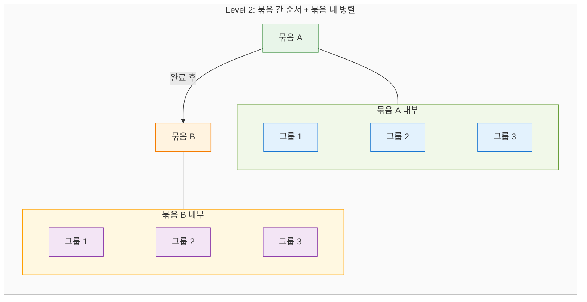
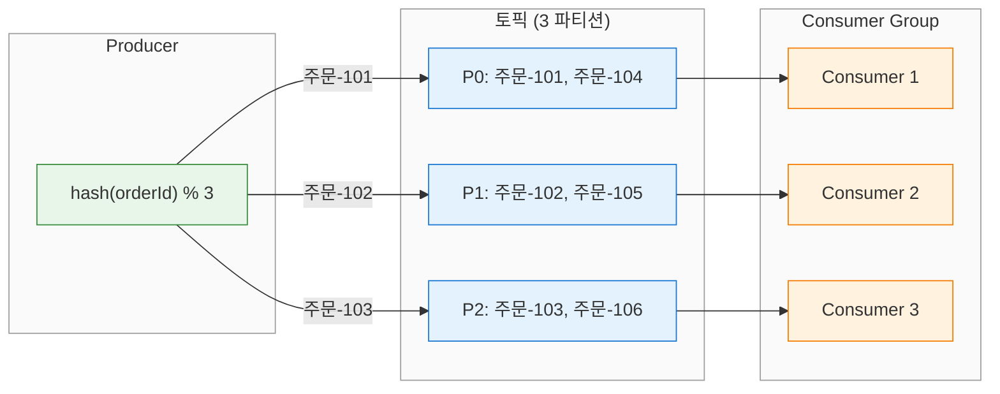
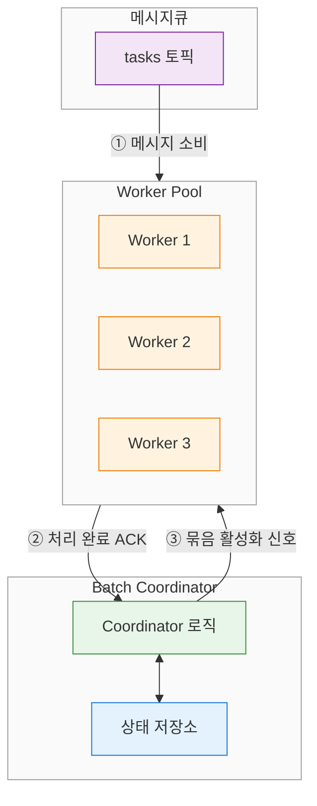
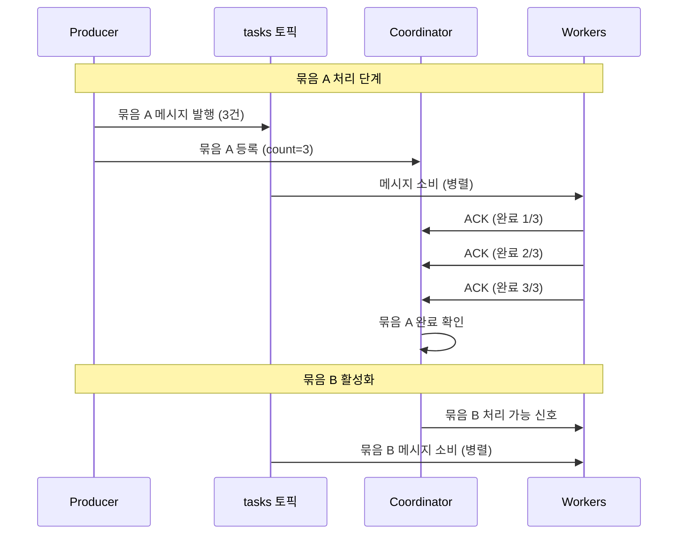
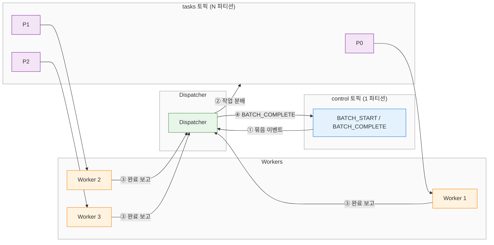
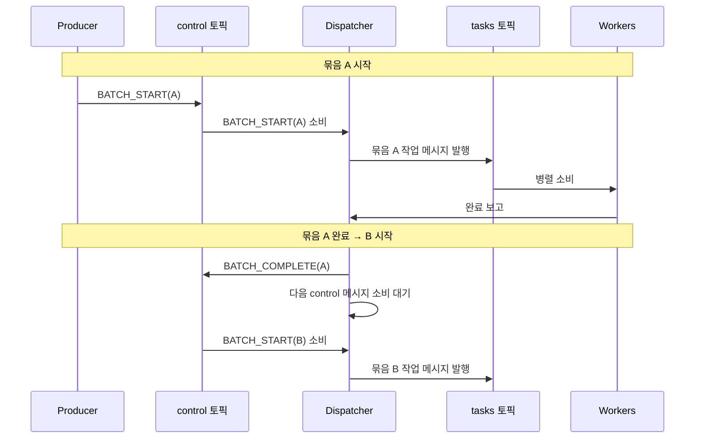
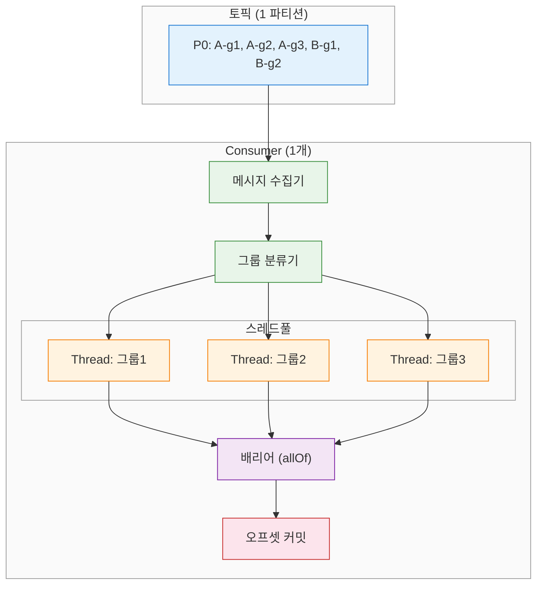
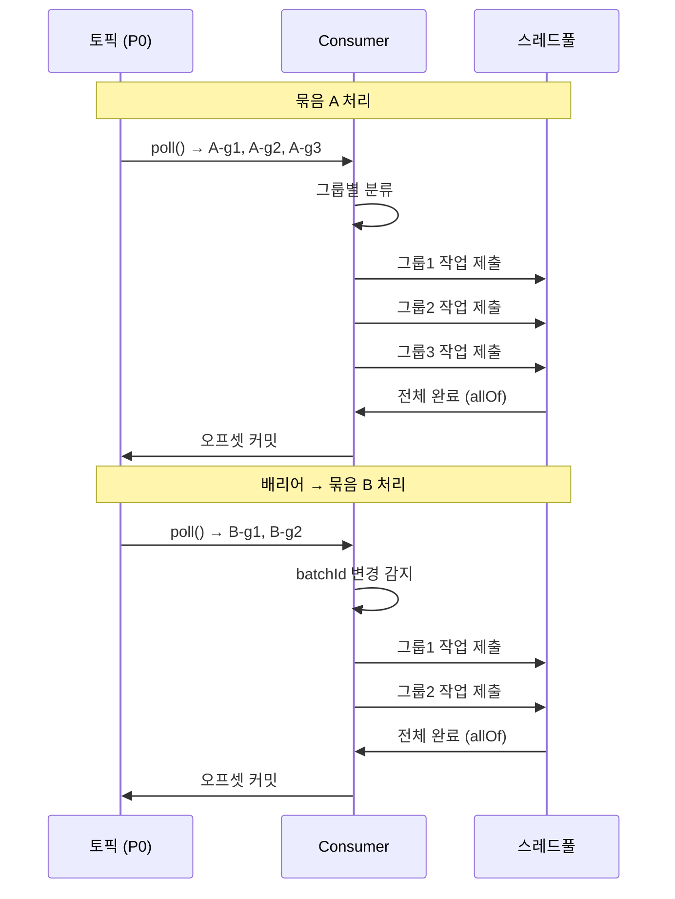
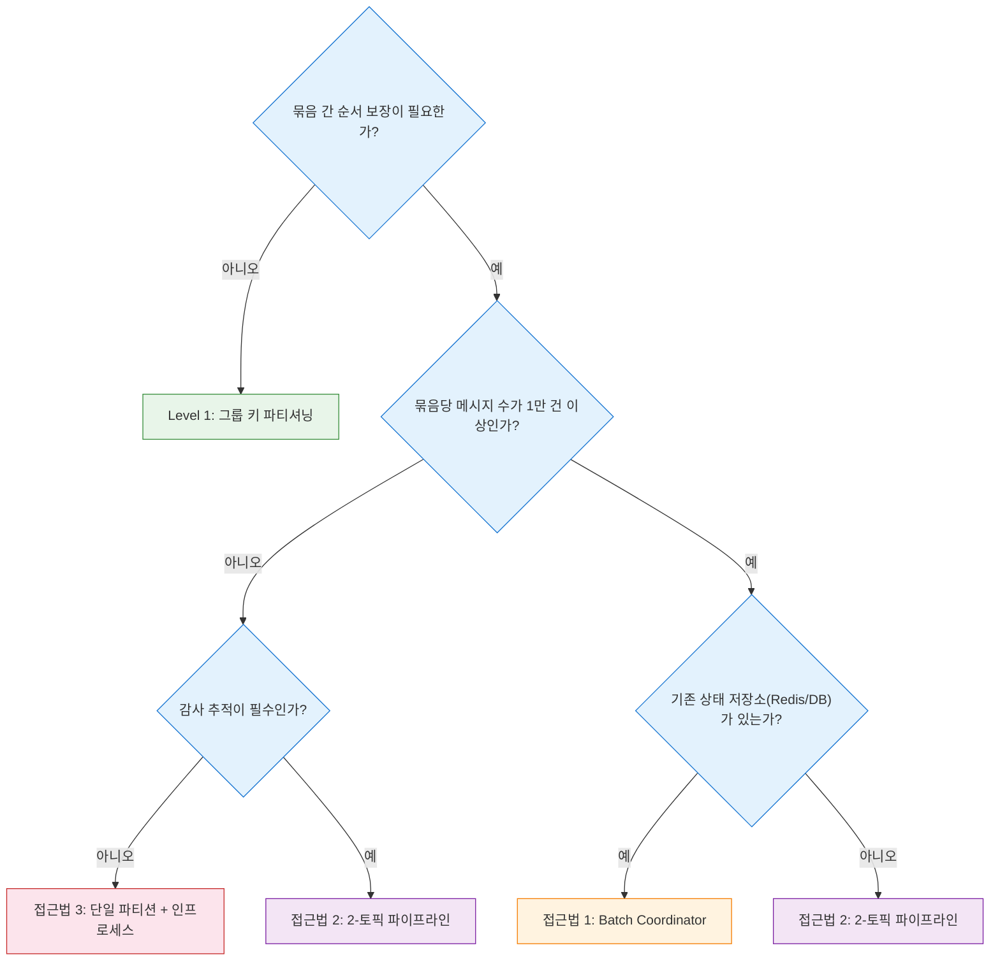

# 메시지큐 묶음 단위 순서 보장 패턴
---
> 메시지큐에서 묶음(batch) 간 순서를 보장하면서 묶음 내부는 그룹별로 병렬 처리하는 세 가지 접근법을 다룬다. 단순 파티션 키 순서 보장을 넘어, "가상 배리어"가 필요한 시나리오에 초점을 맞춘다.

## 1. 문제 정의

메시지큐의 순서 보장 문제는 두 가지 난이도로 나뉜다. Level 1은 단일 묶음 안에서 그룹별 순서를 지키는 것이고, Level 2는 묶음과 묶음 사이의 순서까지 제어하는 것이다. 대부분의 시스템은 Level 1만으로 충분하지만, 배치 처리나 규제 환경에서는 Level 2가 필수가 된다.

**Level 1**은 같은 그룹 키를 가진 메시지가 순서대로 처리되면 충분한 경우다. 주문 ID를 파티션 키로 사용하면 한 주문의 이벤트(생성 → 결제 → 배송)가 같은 파티션에 들어가므로 순서가 자연스럽게 보장된다. Kafka/Redpanda의 기본 파티셔닝으로 해결할 수 있다.

**Level 2**는 "묶음 A의 모든 메시지가 완료된 후에야 묶음 B를 시작해야 한다"는 제약이 추가된다. 묶음 A 내부에서는 그룹별 병렬 처리가 가능하지만, 묶음 B의 처리는 묶음 A가 전부 끝날 때까지 대기해야 한다. 이 "가상 배리어"는 Kafka의 기본 기능으로 제공되지 않는다.

## 2. Level 1: 그룹 키 파티셔닝 (기본 패턴)

Kafka와 Redpanda는 파티션 내 메시지 순서를 보장한다. 같은 키를 가진 메시지는 같은 파티션으로 라우팅되므로, 그룹 키를 파티션 키로 사용하면 그룹 내 순서가 자동으로 지켜진다. Consumer Group의 각 Consumer는 할당된 파티션을 독립적으로 처리하므로 그룹 간 병렬성도 확보된다.

이 패턴의 핵심은 키 설계에 있다. 주문 시스템이라면 `orderId`를 파티션 키로 사용해서 한 주문의 모든 이벤트가 동일 파티션에 들어가게 한다. 사용자 활동 추적이라면 `userId`가 키가 된다. 키의 카디널리티가 파티션 수보다 충분히 커야 균등 분배가 이루어진다.

주문 처리 시나리오를 보면, 주문-101의 이벤트가 `Created → Paid → Shipped` 순서로 발행되면 모두 P0에 들어간다. Consumer 1이 P0을 처리하므로 이 순서가 그대로 유지된다. 주문-102는 P1에서 Consumer 2가 독립적으로 처리한다. 묶음 간 순서 제약이 없다면 이 패턴만으로 충분하다.

## 3. 접근법 1 — Batch Coordinator 패턴

### 3-1. 구조

Batch Coordinator는 묶음의 생명주기를 관리하는 별도 컴포넌트다. 활성 묶음을 추적하고, 묶음 내 모든 메시지의 완료 ACK를 수집하며, 현재 묶음이 완료되어야 다음 묶음을 활성화한다. Coordinator는 상태 저장소(DB 또는 Redis)를 사용해서 묶음별 진행 상황을 기록한다.

Worker는 메시지를 처리한 후 Coordinator에게 ACK를 보낸다. Coordinator는 해당 묶음의 모든 ACK가 도착했는지 확인하고, 전부 도착하면 다음 묶음을 "처리 가능" 상태로 전환한다. Worker가 메시지를 가져갈 때 Coordinator에게 현재 처리 가능한 묶음인지 확인하는 방식으로 배리어를 구현한다.

### 3-2. 처리 흐름

Producer가 묶음 A의 메시지를 발행할 때 각 메시지 헤더에 `batchId=A`를 포함시킨다. Coordinator는 묶음 A를 등록하고 메시지 수를 기록한다. Worker들이 묶음 A의 메시지를 병렬로 처리한 뒤 ACK를 보내면, Coordinator는 카운트를 감소시키다가 0에 도달하면 묶음 A를 완료로 표시한다.

묶음 B의 메시지는 이미 큐에 존재하지만, Worker가 메시지를 꺼낸 뒤 Coordinator에게 "이 batchId가 처리 가능한가?"를 확인한다. 묶음 A가 아직 완료되지 않았으면 Worker는 메시지를 처리하지 않고 일정 시간 후 재시도하거나, Coordinator의 활성화 신호를 기다린다. 이 방식으로 묶음 간 배리어를 구현한다.

### 3-3. 시나리오: 보험 청구 일괄 처리

보험사에서 매일 접수된 청구 건을 일괄 처리하는 상황을 생각한다. 하루치 청구가 하나의 묶음이고, 청구 건마다 담당 보험사가 다르다. 같은 보험사의 청구는 순서대로 처리해야 하지만(Level 1), 서로 다른 보험사의 청구는 병렬로 처리할 수 있다.

핵심 제약은 "3월 15일 묶음이 전부 완료되어야 3월 16일 묶음을 시작할 수 있다"는 것이다. 이유는 3월 16일 청구 중 일부가 3월 15일 청구 결과에 의존하기 때문이다. Coordinator가 일자별 묶음의 완료를 추적하고, 전날 묶음이 끝나야 다음 날 묶음을 활성화한다.

### 3-4. 장단점

이 패턴의 장점은 다음과 같다:

- 기존 메시지큐 인프라를 그대로 사용하면서 배리어를 추가할 수 있다.
- Worker 수를 유연하게 조절할 수 있어 묶음 내 병렬성 확장이 자유롭다.
- 묶음 상태를 명시적으로 관리하므로 모니터링과 디버깅이 용이하다.

단점도 존재한다:

- Coordinator가 단일 장애점(SPOF)이 된다. 고가용성을 위해 리더 선출이나 이중화가 필요하다.
- Coordinator와 Worker 간 통신 지연이 전체 처리량에 영향을 준다.
- 상태 저장소의 동시성 제어가 복잡해질 수 있다. ACK 카운트 감소가 원자적이어야 한다.

## 4. 접근법 2 — 2-토픽 파이프라인 패턴

### 4-1. 구조

이 패턴은 토픽을 두 개로 분리한다. `control` 토픽은 파티션 1개로 구성되어 묶음 단위 메타데이터(시작/완료 이벤트)를 순서대로 전달한다. `tasks` 토픽은 N개 파티션으로 구성되어 실제 작업 메시지를 병렬 처리한다. Dispatcher라는 컴포넌트가 control 토픽을 소비하면서 묶음 간 순서를 관리한다.

control 토픽이 1파티션인 이유는 묶음 순서를 전역적으로 보장하기 위해서다. 묶음 A의 `BATCH_START` → 묶음 A의 `BATCH_COMPLETE` → 묶음 B의 `BATCH_START` 순서가 깨지면 안 된다. tasks 토픽은 그룹 키 기반 파티셔닝으로 Level 1 순서를 보장한다.

### 4-2. 처리 흐름

Dispatcher는 control 토픽에서 `BATCH_START(batchId=A)` 이벤트를 읽으면 tasks 토픽으로 해당 묶음의 작업 메시지를 발행한다. Worker들이 tasks 토픽에서 메시지를 소비하고 처리 결과를 Dispatcher에게 보고한다. Dispatcher는 묶음 A의 모든 작업이 완료되면 control 토픽에 `BATCH_COMPLETE(batchId=A)`를 발행한다.

Dispatcher는 control 토픽의 다음 메시지를 소비하지 않고 현재 묶음이 완료될 때까지 기다린다. `BATCH_COMPLETE(batchId=A)`가 발행된 후에야 다음 `BATCH_START(batchId=B)`를 처리한다. control 토픽의 단일 파티션이 전역 순서를 보장하고, Dispatcher의 순차 소비가 배리어 역할을 한다.

### 4-3. 시나리오: ETL 배치 파이프라인

데이터 웨어하우스의 ETL 처리를 생각한다. 매시간 원본 데이터베이스에서 변경 데이터를 추출하고, 변환 후 적재한다. 한 시간치 데이터가 하나의 묶음이고, 테이블별로 독립적인 변환 로직이 적용된다. `users` 테이블과 `orders` 테이블의 변환은 병렬로 수행할 수 있다.

묶음 간 순서가 필요한 이유는 14시 데이터가 13시 데이터를 덮어쓸 수 있기 때문이다. 13시 `users` 테이블 변환이 아직 진행 중인데 14시 `users` 데이터가 먼저 적재되면 데이터 정합성이 깨진다. control 토픽이 `13시_START → 13시_COMPLETE → 14시_START` 순서를 강제하고, tasks 토픽에서 테이블별 병렬 처리가 이루어진다.

### 4-4. 장단점

이 패턴의 장점은 다음과 같다:

- 순서 제어 로직(control)과 병렬 처리 로직(tasks)이 물리적으로 분리되어 관심사가 명확하다.
- control 토픽의 이벤트 로그가 묶음 처리 이력을 자연스럽게 기록한다. 감사 추적에 유리하다.
- Dispatcher 장애 시 control 토픽의 마지막 오프셋부터 재개할 수 있어 복구가 단순하다.

단점도 있다:

- 토픽이 2개이므로 인프라 관리 비용이 증가한다.
- Dispatcher가 병목이 될 수 있다. 묶음 크기가 크면 작업 분배 자체가 오래 걸린다.
- Worker 완료 보고가 Dispatcher에게 집중되므로, 묶음 내 메시지 수가 많으면 Dispatcher의 처리량이 한계에 도달할 수 있다.

## 5. 접근법 3 — 단일 파티션 + 인프로세스 병렬

### 5-1. 구조

가장 단순한 접근법이다. 토픽을 1개 파티션으로 구성하고 1개 Consumer가 모든 메시지를 순서대로 읽는다. Consumer 내부에서 스레드풀을 사용해 그룹별 병렬 처리를 수행한다. 메시지큐 레벨에서는 순서가 완벽하게 보장되고, 병렬성은 애플리케이션 레벨에서 확보한다.

Consumer는 묶음 경계를 감지하면(예: `batchId` 변경) 현재 스레드풀의 모든 작업이 끝날 때까지 기다린 후 다음 묶음을 처리한다. `ExecutorService.invokeAll()` 또는 `CompletableFuture.allOf()`로 배리어를 구현할 수 있다. 오프셋 커밋은 묶음 단위로 수행한다.

### 5-2. 처리 흐름

Consumer가 `poll()`로 메시지 배치를 가져온다. 메시지의 `batchId` 헤더를 확인하고, 같은 묶음에 속하는 메시지를 그룹 키별로 분류한다. 분류된 그룹 각각을 스레드풀에 제출하고, 모든 스레드의 완료를 기다린다. 전부 성공하면 마지막 오프셋을 커밋한다.

묶음 경계를 만나면(이전 메시지의 `batchId`와 현재 메시지의 `batchId`가 다르면) 즉시 현재 묶음의 배리어를 실행한다. 배리어가 해제된 후 다음 묶음의 메시지를 처리한다. `poll()`이 두 묶음에 걸친 메시지를 반환할 수 있으므로, 묶음 경계 감지 로직이 Consumer 내부에 있어야 한다.

### 5-3. 시나리오: 결제 정산 배치

결제 대행사(PG)에서 매일 가맹점별 정산을 수행하는 경우다. 하루치 거래 내역이 하나의 묶음이고, 가맹점별로 정산 계산이 독립적이다. 가맹점 A의 정산과 가맹점 B의 정산은 병렬로 처리할 수 있지만, 3월 15일 정산이 완료되어야 3월 16일 정산을 시작할 수 있다.

이 시나리오에서 단일 파티션 + 인프로세스 병렬이 적합한 이유는 가맹점 수가 수백 개 수준으로 제한적이고, 개별 정산 처리 시간이 짧기 때문이다. Consumer 하나가 스레드풀로 가맹점별 정산을 동시에 돌리면 충분한 처리량이 나온다. 외부 분산 시스템(Coordinator, 2-토픽) 없이 단일 JVM 안에서 모든 것을 해결할 수 있다.

### 5-4. 장단점

이 패턴의 장점은 다음과 같다:

- 아키텍처가 가장 단순하다. 추가 컴포넌트 없이 Consumer 하나로 동작한다.
- 묶음 간 순서 보장이 자명하다. 단일 파티션의 순서 보장 + 인프로세스 배리어이므로 순서 위반이 구조적으로 불가능하다.
- 장애 복구가 간단하다. Consumer가 재시작하면 마지막 커밋 오프셋부터 다시 처리하면 된다.

단점은 명확하다:

- 수평 확장이 불가능하다. 1파티션 = 1Consumer이므로 Consumer를 늘려도 의미가 없다.
- 처리량 상한이 단일 머신의 CPU/메모리에 의해 결정된다. 묶음 크기가 크면 한계에 부딪힌다.
- Consumer 장애 시 전체 파이프라인이 중단된다. Standby Consumer로 failover할 수 있지만 전환 시간만큼 지연이 발생한다.

## 6. 비교 및 선택 기준

세 접근법은 복잡도와 확장성의 트레이드오프 위에 있다. 처리량이 적고 단순함이 중요하면 접근법 3이 맞고, 대규모 병렬 처리가 필요하면 접근법 1이나 2를 선택한다. 감사 추적이 중요한 규제 환경에서는 접근법 2의 이벤트 로그가 유리하다.

| 속성 | Batch Coordinator | 2-토픽 파이프라인 | 단일 파티션 + 인프로세스 |
|------|-------------------|-------------------|--------------------------|
| 아키텍처 복잡도 | 높음 (Coordinator + 상태 저장소) | 중간 (Dispatcher + 2 토픽) | 낮음 (Consumer 1개) |
| 수평 확장성 | 높음 (Worker 추가) | 높음 (파티션/Worker 추가) | 없음 (단일 Consumer) |
| 순서 보장 강도 | Coordinator 구현에 의존 | control 토픽으로 구조적 보장 | 구조적으로 자명 |
| 장애 복구 | 복잡 (Coordinator HA 필요) | 중간 (오프셋 기반 재개) | 단순 (오프셋 기반 재시작) |
| 감사 추적 | 별도 구현 필요 | control 토픽이 이력 제공 | 오프셋 외 이력 없음 |
| 적합 처리량 | 높음 (수만 건/초) | 높음 (수만 건/초) | 중간 (수천 건/초) |

선택 기준을 정리하면 의사결정은 다음 흐름을 따른다.

