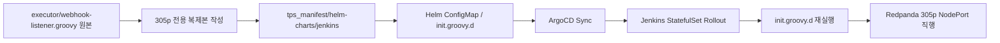

# Jenkins webhook-listener 305p 반영 전략
---
> `executor/webhook-listener.groovy` 원본은 유지하면서 305p용 복제본을 GitOps로 반영하고, `rpk` 설치와 Jenkins 재적용 경로까지 포함한 구현 전략을 정리한 문서다.
> 작성일: 2026-04-21
> 대상: `executor`, `tps_manifest/helm-charts/jenkins`, `305p`

## 1. 문제 정의

> 이번 작업의 핵심은 "원본 파일을 건드리지 않고", "305p 환경에 맞는 복제본을 안전하게 배포"하며, "Git 반영 후 실제 Jenkins에 적용되는 경로"를 GitOps 관점에서 닫는 것이다.

현재 기준점은 두 저장소로 나뉜다. 이벤트 발행 로직의 원본은 `tps-gitlab2/executor/webhook-listener.groovy`에 있고, 실제 305p Jenkins 배포는 `tps_manifest/helm-charts/jenkins`와 ArgoCD 앱이 담당한다.

이 구조에서 가장 먼저 분리해야 할 질문은 두 가지다:

- 어떤 저장소를 배포의 source of truth로 둘 것인가
- 305p 대상 Jenkins가 Redpanda와 같은 K8s 내부에 있다고 가정할 수 있는가

이번 검토 결과, 두 질문의 답은 각각 다음이 적절하다:

- 배포 source of truth는 `tps_manifest`로 둔다.
- 305p 복제본은 "동일 K8s가 아닐 수 있다"를 기본 가정으로 둔다.

## 2. 현재 상태에서 확인한 사실

> 구현 계획은 가정이 아니라 현재 배포 상태와 차트 구조 위에 세워야 한다.

실제 파일과 클러스터를 확인한 결과, 현재 상태는 다음과 같다:

| 항목 | 확인 결과 | 의미 |
|------|----------|------|
| 원본 리스너 파일 | `executor/webhook-listener.groovy` | 현재는 `rpk` CLI로 Kafka 토픽에 직접 발행한다 |
| 기본 브로커 값 | `redpanda.rp-oss.svc.cluster.local:9092` | 305p 실환경과 맞지 않는다 |
| Jenkins 차트 | `tps_manifest/helm-charts/jenkins` | `controller.initScripts`와 `controller.initConfigMap`을 지원한다 |
| Jenkins init script 반영 방식 | `init.groovy.d` 마운트 | ConfigMap 기반 주입이 가능하다 |
| Jenkins 롤아웃 트리거 | `checksum/config-init-scripts` | init script 내용 변경 시 StatefulSet 재생성 가능 |
| 305p Jenkins Pod | `trb-oss/jenkins-0` | 현재 정상 실행 중이다 |
| 305p Redpanda 외부 접근 | `10.255.37.171:31092` | NodePort 기준 접근이 가장 안전하다 |
| 305p Redpanda Connect | `ClusterIP`만 확인 | 외부 Jenkins에서 바로 HTTP 호출한다고 가정하면 위험하다 |
| ArgoCD Jenkins 앱 자동 동기화 | 현재 꺼져 있음 | Git commit만으로는 자동 반영되지 않는다 |

- 즉 현재 구조에서 바로 내려야 할 결론은 이것이다. `305p`용 복제본은 Redpanda Connect 내부 서비스 호출보다 Redpanda NodePort 직행을 기본 전략으로 잡는 편이 안전하다.

## 3. 왜 원본 파일을 그대로 305p에 쓰면 안 되는가

> 원본 보존 요구사항은 단순 복제가 아니라 "운영 대상 환경에 맞는 배포 단위 분리"를 뜻한다.

원본 `webhook-listener.groovy`는 이미 특정 가정을 품고 있다:

- `RPK_PATH`가 `/var/jenkins_home/rpk`에 있다고 본다.
- 브로커 기본값이 `redpanda.rp-oss.svc.cluster.local:9092`다.
- 현재는 단일 토픽 `tps.v305p.jenkins.evt.job-lifecycle`에 직접 발행한다.

이 설정은 로컬 실험이나 다른 환경에서는 유효할 수 있지만, 305p 반영 대상으로는 두 가지 문제가 있다.

첫째, 브로커 주소가 현재 305p 실환경과 맞지 않는다. 실제 확인된 305p 외부 bootstrap 주소는 `10.255.37.171:31092`다.

둘째, Jenkins와 Redpanda Connect가 항상 같은 클러스터 내부 DNS로 연결된다고 가정하면 안 된다. 305p Jenkins는 현재 `trb-oss`의 K8s Pod로 보이지만, 요구사항에서 이미 "동일 k8s환경이 아닐 수 있음"을 명시했다. 이 조건을 진지하게 받아들이면 내부 서비스 DNS에 의존하는 설계는 기본안이 될 수 없다.

따라서 원본은 참고 기준으로 유지하고, 305p 전용 복제본을 별도 배포 자산으로 분리하는 편이 맞다.

## 4. 권장 아키텍처

> 가장 덜 깨지는 구조는 "코드 원본"과 "배포 원본"을 분리하는 것이다.

권장 아키텍처는 다음과 같다:

이 구조의 핵심 원칙은 다음과 같다:

- `executor` 저장소는 "논리 기준"을 담는다.
- `tps_manifest`는 "실제 배포 기준"을 담는다.
- 305p Jenkins는 배포 자산만 보면 재현 가능해야 한다.

이렇게 해야 ArgoCD diff, rollback, 감사 로그, 운영 추적이 모두 `tps_manifest` 한 곳에서 끝난다.

## 5. 구현안

> 구현은 Jenkins 차트가 이미 제공하는 주입 지점을 활용해야 한다. 새 메커니즘을 억지로 만들 필요는 없다.

구현은 다섯 단계로 나누는 것이 적절하다.

### 5-1. 305p 전용 복제본 분리

원본은 유지하고, 305p용 복제본은 `tps_manifest` 안에 둔다. 위치는 Jenkins 차트 내부가 가장 자연스럽다.

예시 위치:

- `helm-charts/jenkins/files/init-scripts/webhook-listener-305p.groovy`

이 복제본은 최소한 다음을 분리해야 한다:

- 클래스명 또는 logger명
- 기본 브로커 값
- topic/env 명
- 운영 로그 prefix

이렇게 해야 원본과 305p 복제본의 역할이 섞이지 않는다.

### 5-2. Jenkins init script 주입

Jenkins chart는 이미 `controller.initScripts`와 `controller.initConfigMap`을 제공한다. 따라서 복제본을 Jenkins Pod 내부 `init.groovy.d`로 넣는 일 자체는 새로운 메커니즘이 아니다.

가장 관리하기 좋은 방식은 다음 둘 중 하나다:

1. `controller.initScripts`에 스크립트 본문을 값으로 넣는다.
2. 별도 ConfigMap 템플릿을 만들고 `controller.initConfigMap`으로 연결한다.

이번 요구사항에는 두 번째가 더 낫다. Groovy 본문을 `values-dev.yaml`에 직접 길게 넣으면 diff 가독성이 나쁘고, 코드 리뷰가 불편해진다.

### 5-3. `rpk` 설치 자동화

현재 원본은 `/var/jenkins_home/rpk`를 전제로 한다. Jenkins 차트 기준으로 가장 현실적인 자동화 방법은 `controller.customInitContainers`를 사용하는 것이다.

권장 방식은 다음과 같다:

1. 사내 Harbor 또는 Nexus에 `rpk` 포함 이미지 또는 `rpk` 바이너리만 담은 경량 이미지를 준비한다.
2. `customInitContainers`가 시작되면서 해당 바이너리를 `jenkins-home` 공유 볼륨에 복사한다.
3. 메인 Jenkins 컨테이너는 `/var/jenkins_home/rpk`를 그대로 사용한다.

이 방식을 권장하는 이유는 다음과 같다:

- 매번 인터넷에서 바이너리를 다운로드하지 않아도 된다.
- 폐쇄망/사내망 제약에 강하다.
- Jenkins 컨트롤러 이미지를 별도로 커스텀 빌드하지 않아도 된다.

반대로 비권장 방식은 다음과 같다:

- 컨트롤러 기동 시 외부 URL에서 `curl`로 `rpk`를 내려받는 방식
- 운영 이미지를 직접 수정해 ad-hoc로 `rpk`를 집어넣는 방식

둘 다 재현성과 감사 가능성이 떨어진다.

### 5-4. 305p 브로커 연결 정책

305p용 복제본은 기본적으로 Redpanda NodePort 직행을 기준으로 둔다.

권장 기본값:

- `RPK_BROKERS_305P=10.255.37.171:31092`
- `LIFECYCLE_TOPIC_305P=tps.v305p.jenkins.evt.job-lifecycle`

이 정책을 권장하는 이유는 명확하다. 현재 확인된 305p Redpanda Connect는 외부 Ingress나 외부 도메인이 없고 `ClusterIP`만 보인다. Jenkins가 동일 K8s 내부에 있을 때만 HTTP 브리지 설계가 단순하지만, 이번 요구사항은 그 가정을 금지하고 있다.

즉 이번 설계 기준은 다음과 같다:

- 기본 경로: `rpk -> Redpanda NodePort`
- 예외 경로: Jenkins와 Connect가 같은 K8s 내부에 있다는 게 운영 정책으로 확정되면 HTTP 브리지 재검토

### 5-5. Git 반영 후 실제 Jenkins 적용

현재 Jenkins 차트는 `config-init-scripts.yaml` 변경 시 `checksum/config-init-scripts`가 바뀌도록 되어 있다. 이 점은 매우 중요하다. Helm 렌더링 결과가 달라지면 StatefulSet Pod template annotation이 바뀌고, Jenkins Pod가 롤링되어 init script가 다시 실행된다.

즉 Helm 차트 자체는 이미 "재기동까지 포함한 재적용" 경로를 갖고 있다.

문제는 ArgoCD sync가 현재 자동이 아니라는 점이다. 따라서 지금 상태에서는 아래 흐름만 성립한다:

1. Git commit
2. ArgoCD에서 수동 sync
3. Jenkins rollout
4. init script 재실행

자동 반영을 만들려면 이 중 2번을 없애야 한다.

## 6. Git 반영 자동화 정책

> "Git에 반영하면 자동 반영"은 저장소 선택 문제이자 ArgoCD 정책 문제다.

자동 반영은 두 층으로 나눠 생각해야 한다:

### 6-1. 어떤 저장소 변경을 기준으로 삼을 것인가

선택지는 두 가지다:

| 선택지 | 설명 | 장점 | 단점 |
|--------|------|------|------|
| `tps_manifest`를 정본으로 사용 | 305p 복제본을 manifest에서 직접 관리 | GitOps와 가장 잘 맞고 단순하다 | 원본과 복제본이 논리적으로 분리된다 |
| `executor`를 정본으로 사용하고 CI로 mirror | executor 변경 시 manifest 복제본 자동 갱신 | 원본-복제본 관계를 강하게 유지할 수 있다 | repo 간 동기화 파이프라인이 추가되어 운영면이 복잡해진다 |

이번 요구사항에는 첫 번째가 더 낫다. 이유는 배포 대상 Jenkins를 실제로 바꾸는 저장소가 `tps_manifest`이기 때문이다.

### 6-2. ArgoCD sync를 어디까지 자동화할 것인가

현재 `argocd-apps/app-of-apps/charts/trb-oss/values-dev.yaml`의 `application.syncPolicy`는 자동 sync가 꺼져 있다. 이 공통 값을 그대로 자동화하면 Jenkins만이 아니라 `trb-oss` 계열 앱 전체에 정책 영향을 줄 수 있다.

따라서 권장 정책은 "Jenkins 앱만 별도 auto-sync override를 받게 만드는 것"이다.

예를 들면 다음 같은 형태가 된다:

- `jenkins.autoSync: true`
- 또는 `jenkins.syncPolicyOverride`

그리고 `trb-oss/templates/jenkins.yaml`에서 이 값을 우선 적용하게 만든다.

이렇게 하면 다음 경로가 성립한다:

1. `tps_manifest` commit
2. ArgoCD가 Jenkins 앱 자동 sync
3. checksum 변경 감지
4. Jenkins StatefulSet rollout
5. `init.groovy.d` 재실행

이 경로가 만들어져야 비로소 "Git 반영 시 자동 반영"이라고 부를 수 있다.

## 7. 최종 권장안

> 요구사항을 가장 적은 운영 리스크로 만족시키는 안은 "복제본은 manifest에서 관리하고, Jenkins만 auto-sync"다.

최종 권장안은 다음과 같다:

1. `executor/webhook-listener.groovy` 원본은 그대로 유지한다.
2. 305p 전용 복제본은 `tps_manifest/helm-charts/jenkins` 안에 별도 파일로 둔다.
3. 복제본은 `controller.initConfigMap` 또는 전용 ConfigMap 템플릿으로 Jenkins `init.groovy.d`에 주입한다.
4. `rpk`는 `controller.customInitContainers`를 통해 `/var/jenkins_home/rpk`에 자동 배치한다.
5. 305p 브로커는 기본적으로 `10.255.37.171:31092`를 사용한다.
6. ArgoCD는 Jenkins 앱에만 auto-sync override를 추가한다.
7. source of truth는 `tps_manifest`로 둔다.

이 안의 장점은 다음과 같다:

- 원본 보존 요구사항을 만족한다.
- 305p 환경 차이를 복제본에 격리할 수 있다.
- GitOps, rollback, audit 흐름이 단순하다.
- Jenkins 재시작까지 포함한 실제 반영 경로가 닫힌다.

## 8. 비권장안

> 아래 방식들은 당장은 빨라 보여도 운영 시점에 반드시 비용을 만든다.

비권장안은 다음과 같다:

- `executor` 저장소 파일을 Jenkins Pod에 직접 수동 복사하는 방식
- Jenkins UI나 Script Console에서 메모리 등록만 하는 방식
- 컨트롤러 컨테이너에 수동으로 `rpk`를 넣는 방식
- HTTP Connect 경로가 외부에서도 항상 된다고 가정하는 방식
- ArgoCD 수동 sync를 유지한 채 "자동 반영"이라고 부르는 방식

이 방식들은 재현성, 감사 가능성, rollback 용이성 중 하나 이상을 포기하게 만든다.

## 9. 다음 구현 순서

> 구현은 작은 단위로 나누면 된다. 핵심은 Jenkins 차트 변경, `rpk` 주입, ArgoCD 정책 변경의 세 축이다.

실제 구현 순서는 다음이 적절하다:

1. `tps_manifest/helm-charts/jenkins`에 305p 전용 Groovy 복제본 추가
2. Jenkins chart에 해당 파일을 ConfigMap으로 주입하는 템플릿 추가
3. `values-dev.yaml`에 `rpk` 설치용 `customInitContainers` 추가
4. `values-dev.yaml`에 `RPK_BROKERS_305P`, `LIFECYCLE_TOPIC_305P` 환경값 추가
5. `trb-oss/templates/jenkins.yaml`에 Jenkins 전용 auto-sync override 추가
6. ArgoCD sync 후 Jenkins rollout, 실제 `init.groovy.d` 등록 여부 검증

이 순서를 따르면 설계와 운영 경로가 어긋나지 않는다.
