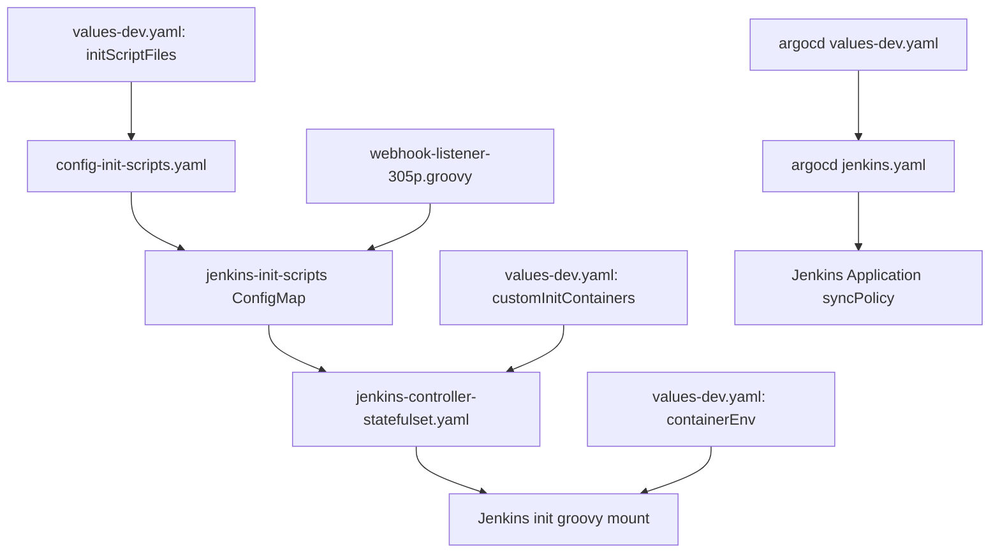

# Jenkins 305p 정식 반영 파일별 변경 설명
---
> `305p`용 Jenkins webhook listener를 정식 반영하기 위해 수정한 파일들이 각각 어떤 역할을 하는지, 왜 필요했는지, 서로 어떻게 연결되는지를 설명한 문서다.
> 작성일: 2026-04-21
> 대상: `tps_manifest`, `jenkins`, `argocd`, `305p`

## 1. 문서 목적

> 이번 변경은 한 파일만 고치는 작업이 아니라 Jenkins 차트, app-of-apps, init script 자산을 함께 묶는 작업이다.

이번 반영은 단순히 `webhook-listener` 스크립트를 하나 추가하는 수준이 아니다. 실제로는 아래 세 층을 같이 맞춰야 한다:

- Jenkins가 새 Groovy 스크립트를 `init.groovy.d`로 읽을 수 있어야 한다.
- Jenkins Pod 안에 `rpk`가 자동으로 준비되어 있어야 한다.
- 필요하면 ArgoCD 쪽에서 Jenkins 앱만 별도 동기화 정책을 받을 수 있어야 한다.

그래서 수정 파일도 자연스럽게 세 그룹으로 나뉜다:

- Jenkins 차트 템플릿
- Jenkins 차트 values
- ArgoCD app-of-apps 템플릿/values

## 2. 전체 변경 파일 목록

> 아래 파일들이 이번 정식 반영 초안에서 직접 수정되거나 새로 추가된 대상이다.

| 파일 | 위치 | 역할 |
|------|------|------|
| `config-init-scripts.yaml` | `helm-charts/jenkins/templates/` | init script ConfigMap 생성 |
| `jenkins-controller-statefulset.yaml` | `helm-charts/jenkins/templates/` | init script 마운트, checksum 롤링, init container 연결 |
| `values.yaml` | `helm-charts/jenkins/` | Jenkins 차트 기본 스키마 확장 |
| `values-dev.yaml` | `helm-charts/jenkins/` | 305p용 실제 Jenkins 설정 반영 |
| `webhook-listener-305p.groovy` | `helm-charts/jenkins/files/init-scripts/` | 305p 전용 Jenkins 전역 리스너 |
| `jenkins.yaml` | `argocd-apps/app-of-apps/charts/trb-oss/templates/` | Jenkins ArgoCD Application 렌더링 |
| `values-dev.yaml` | `argocd-apps/app-of-apps/charts/trb-oss/` | Jenkins 앱별 sync override 확장 지점 |

주의할 점은 `values-dev.yaml`이 두 개 있다는 것이다. 하나는 Jenkins 차트용이고, 다른 하나는 app-of-apps `trb-oss` 차트용이다. 이름은 같지만 역할은 다르다.

## 3. `webhook-listener-305p.groovy`

> 이번 작업의 핵심 로직 파일이다. Jenkins가 실제로 실행 중인 빌드 이벤트를 잡아 305p Redpanda로 보낸다.

위치:

- `helm-charts/jenkins/files/init-scripts/webhook-listener-305p.groovy`

이 파일의 책임은 다음과 같다:

- Jenkins `RunListener`로 `STARTED`, `FINALIZED` 이벤트를 감지한다.
- 메시지 키를 `{jobName}-{buildNumber}` 형식으로 생성한다.
- `RPK_PATH_305P`, `RPK_BROKERS_305P`, `LIFECYCLE_TOPIC_305P` 환경값을 읽는다.
- `rpk topic produce`로 `tps.v305p.jenkins.evt.job-lifecycle` 토픽에 직접 발행한다.
- 예외가 나도 Jenkins 빌드 흐름을 막지 않도록 `safeHandle`로 감싼다.
- Script Console 재실행 또는 재등록 상황을 고려해 동일 클래스명 리스너를 제거 후 재등록한다.

이 스크립트를 별도 파일로 분리한 이유는 다음과 같다:

- `values-dev.yaml`에 Groovy 본문을 길게 넣지 않기 위해
- Git diff와 코드 리뷰 가독성을 지키기 위해
- 이후 `305p` 리스너만 독립적으로 버전 관리하기 위해

## 4. `config-init-scripts.yaml`

> Jenkins가 읽을 수 있는 init script ConfigMap을 만드는 템플릿이다.

위치:

- `helm-charts/jenkins/templates/config-init-scripts.yaml`

기존 차트는 `controller.initScripts`만 렌더링 대상으로 봤다. 즉 values에 직접 문자열로 Groovy를 넣는 방식만 기본 지원했다.

이번에 여기에 추가한 개념은 `controller.initScriptFiles`다. 이 값은 "차트 내부 파일 경로를 지정하면 그 파일 내용을 ConfigMap에 넣는다"는 뜻이다.

이 변경이 필요한 이유는 명확하다:

- 파일 기반 Groovy 자산을 별도 관리할 수 있어야 한다.
- 배포용 스크립트를 values 안에 길게 인라인하지 않아도 된다.

이번 템플릿 변경의 효과는 다음과 같다:

- `initScripts`가 없어도 `initScriptFiles`만으로 init script ConfigMap 생성 가능
- `webhook-listener-305p.groovy` 같은 파일형 자산을 정식 차트 자산으로 포함 가능

## 5. `jenkins-controller-statefulset.yaml`

> 이 파일이 실제로 Jenkins Pod에 init script를 붙이고, 변경 시 롤링 재적용을 일으킨다.

위치:

- `helm-charts/jenkins/templates/jenkins-controller-statefulset.yaml`

이번 작업에서 이 파일은 가장 중요하다. 이유는 `config-init-scripts.yaml`이 ConfigMap을 만들어도, StatefulSet이 그것을 보지 않으면 실제 Jenkins에는 아무 변화가 없기 때문이다.

이번에 반영한 핵심 수정은 다음과 같다:

1. `checksum/config-init-scripts` 조건문이 `initScripts`뿐 아니라 `initScriptFiles`도 보도록 수정
2. `init.groovy.d` mount 조건문이 `initScriptFiles`도 보도록 수정
3. `init-scripts` volume 생성 조건문이 `initScriptFiles`도 보도록 수정
4. `initScripts + initConfigMap` 조합 판단식도 `initScriptFiles`를 포함하도록 수정

이 수정이 중요한 이유는 실제로 한 번 충돌이 있었기 때문이다. 처음에는 `config-init-scripts.yaml`만 수정해서 ConfigMap은 생성됐지만, StatefulSet이 여전히 `initScripts`만 보고 있어서 Jenkins Pod에는 안 붙는 상태였다.

즉 이 파일 수정은 단순 개선이 아니라, 실제 반영이 되게 만드는 필수 수정이었다.

## 6. `values.yaml`

> 차트의 기본 스키마를 확장한 파일이다.

위치:

- `helm-charts/jenkins/values.yaml`

여기에는 실제 운영값보다 "이 차트가 어떤 키를 이해하는가"를 문서화하는 역할이 있다.

이번에 추가한 건 `controller.initScriptFiles`다.

의미는 단순하다:

- `initScripts`: values 안에 직접 Groovy 문자열을 넣는 방식
- `initScriptFiles`: 차트 내부 파일을 읽어 ConfigMap에 포함하는 방식

`values.yaml`에 이 키를 추가한 이유는 다음과 같다:

- 차트 사용자가 지원되는 키를 공식 기본값 파일에서 볼 수 있게 하기 위해
- 향후 다른 환경에서도 같은 패턴을 재사용할 수 있게 하기 위해

즉 이 파일은 "기능 설명서이자 기본 스키마" 역할을 한다.

## 7. Jenkins 차트용 `values-dev.yaml`

> 실제 305p Jenkins에 들어갈 개발계 설정을 담는 파일이다.

위치:

- `helm-charts/jenkins/values-dev.yaml`

이번에 여기에 들어간 변경은 세 묶음이다.

### 7-1. `containerEnv`

다음 환경 변수를 추가했다:

- `RPK_PATH_305P=/var/jenkins_home/rpk`
- `RPK_BROKERS_305P=10.255.37.171:31092`
- `LIFECYCLE_TOPIC_305P=tps.v305p.jenkins.evt.job-lifecycle`

이 값들은 `webhook-listener-305p.groovy`가 직접 읽는다. 즉 이 파일은 스크립트의 런타임 파라미터를 주입하는 역할도 한다.

### 7-2. `initScriptFiles`

다음 항목을 추가했다:

- `webhook-listener-305p: files/init-scripts/webhook-listener-305p.groovy`

이 설정이 있으면 차트가 해당 Groovy 파일을 `jenkins-init-scripts` ConfigMap으로 묶어서 Jenkins `init.groovy.d`에 제공할 수 있다.

### 7-3. `customInitContainers`

다음 init container를 추가했다:

- 이름: `install-rpk`
- 이미지: `harbor.dev.trombone-v2.okestro.cloud/middleware/redpanda:v25.3.6-amd64`
- 동작: `/usr/bin/rpk`를 `/var/jenkins_home/rpk`로 복사 후 실행권한 부여

이 설정의 의미는 Jenkins 컨테이너 이미지를 커스텀 빌드하지 않고도 `rpk`를 Jenkins home 공유 볼륨에 배치한다는 것이다.

즉 이 파일은 "스크립트 주입 + 런타임 env + 바이너리 준비"를 동시에 담당한다.

## 8. `jenkins.yaml`

> ArgoCD app-of-apps에서 Jenkins Application 객체를 렌더링하는 템플릿이다.

위치:

- `argocd-apps/app-of-apps/charts/trb-oss/templates/jenkins.yaml`

기존에는 모든 앱이 공통 `application.syncPolicy`를 그대로 받았다. 이번에 여기에 추가한 건 Jenkins만 별도 sync 정책을 받을 수 있는 override 지점이다.

즉 템플릿 로직은 이렇게 바뀌었다:

- `jenkins.syncPolicyOverride`가 있으면 그 값을 사용
- 없으면 기존 `application.syncPolicy`를 사용

이 변경의 목적은 하나다. Jenkins만 auto-sync를 켜고 싶을 때 `trb-oss` 전체 앱에 영향을 주지 않게 하기 위함이다.

지금은 override 값을 실제로 켜지 않았고, "나중에 켤 수 있는 확장 포인트"만 추가해 둔 상태다.

## 9. app-of-apps `values-dev.yaml`

> Jenkins 앱 전용 sync 정책 override를 values에서 받을 수 있게 한 파일이다.

위치:

- `argocd-apps/app-of-apps/charts/trb-oss/values-dev.yaml`

여기서는 실제 설정을 활성화하지 않고, 아래처럼 주석 형태의 예시만 추가했다:

- `jenkins.syncPolicyOverride`
- `automated.prune`
- `automated.selfHeal`

이렇게 둔 이유는 지금 당장 `auto-sync`를 켜는 것이 아니라, 템플릿이 지원하는 구조를 먼저 마련하기 위해서다.

즉 이 파일은 "정책 확장 포인트를 values에서 제어할 수 있게 만든 자리"라고 보면 된다.

## 10. 파일 간 연결 관계

> 이번 변경은 파일 하나하나를 따로 보면 안 되고, 연결해서 봐야 한다.

파일 간 연결은 아래 순서로 이해하면 쉽다:

이 구조를 보면 각 파일의 역할이 분명해진다:

- Groovy 파일은 실제 로직
- Jenkins chart templates는 로직을 Pod에 연결
- Jenkins values는 환경별 값 주입
- ArgoCD templates/values는 배포 정책 제어

## 11. 검증하면서 발견한 핵심 포인트

> 이번 변경은 처음부터 완벽히 맞은 게 아니라, 검증 과정에서 구조 충돌을 하나 잡아냈다.

가장 중요한 발견은 이것이었다:

- `config-init-scripts.yaml`만 바꾸면 ConfigMap은 생긴다.
- 하지만 StatefulSet이 `initScriptFiles`를 모르고 있으면 Pod에는 안 붙는다.
- 따라서 `jenkins-controller-statefulset.yaml` 수정이 반드시 같이 필요하다.

이 포인트를 놓치면 "템플릿은 렌더링되는데 실제 Jenkins는 안 바뀌는" 반쪽짜리 반영이 된다.

즉 이번 작업의 핵심 교훈은 "ConfigMap 생성 템플릿만 바꾸면 끝나는 일이 아니다"라는 점이다.

## 12. 지금 상태의 의미

> 현재 변경은 정식 반영 가능한 구조를 만들었지만, 아직 실제 sync/apply는 하지 않은 상태다.

현재까지의 의미를 정리하면 다음과 같다:

- Jenkins 차트는 `webhook-listener-305p.groovy`를 정식 자산으로 포함할 수 있다.
- Jenkins Pod는 재배포 시 `init.groovy.d`로 이 스크립트를 읽을 수 있다.
- Jenkins Pod는 init container를 통해 `rpk`를 `/var/jenkins_home/rpk`에 준비할 수 있다.
- 필요하면 Jenkins 앱만 별도 auto-sync 정책을 받을 수 있다.

하지만 아직 하지 않은 것도 분명하다:

- 실제 ArgoCD sync
- 실제 Jenkins 재배포
- 실제 `rpk` 복사 성공 검증
- 실제 listener 기동 후 이벤트 발행 검증

즉 이 문서가 설명하는 것은 "현재까지 만들어 둔 정식 반영 구조"이지 "이미 운영 적용 완료된 상태"는 아니다.
