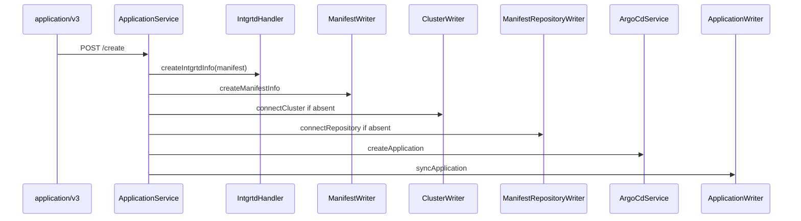
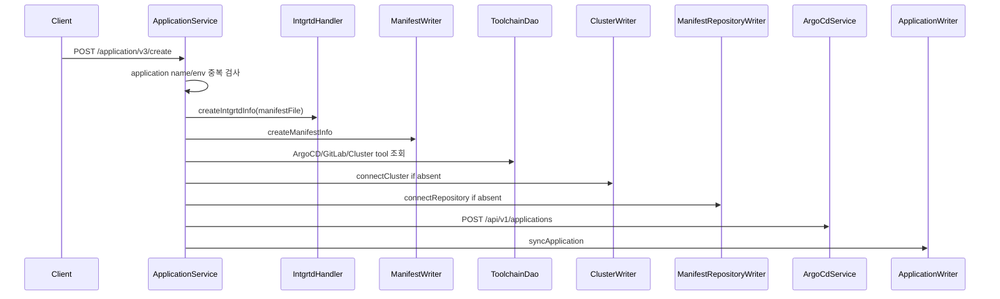
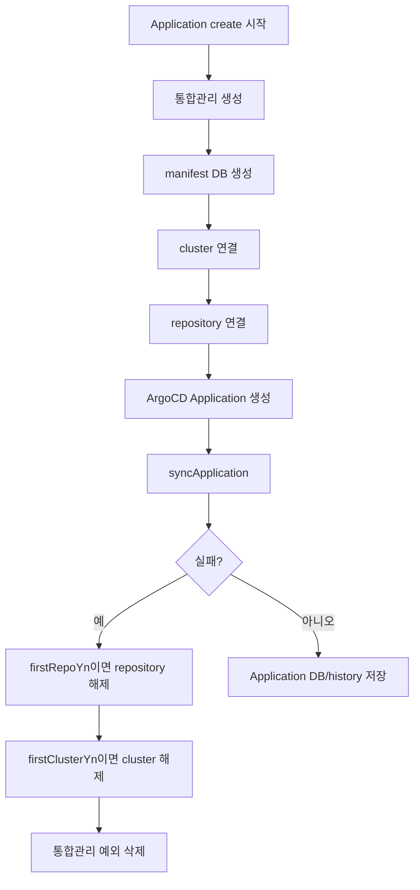

# 305 ArgoCD Application 생성 수정 삭제 흐름
---
> ArgoCD Application 생성은 TPS 통합관리, manifest DB, cluster/repository 연결, ArgoCD Application 생성, sync 확인을 하나의 트랜잭션성 흐름으로 묶는다. 수정은 주로 TPS/통합관리/manifest 정보를 갱신하고, 삭제는 TPS와 ArgoCD 양쪽 정리를 수행한다.

## 조사 기준

> 이 문서는 `/application/v3`의 Application 관리 API를 기준으로 한다.

주요 API는 `/create`, `/update`, `/delete_list`, `/select_list`, `/select/{aplcnId}`이다. Application 리소스 조회와 로그 조회는 별도 문서에서 다룬다.

## 현재 코드에서 실제로 쓰는 흐름

> 생성은 Application 중복 검사 후 통합관리와 manifest를 먼저 만들고 ArgoCD에 반영한다.

| 유스케이스 | 내부 API | 주요 처리 | ArgoCD 호출 |
|---|---|---|---|
| 생성 | `POST /application/v3/create` | 중복 검사, 통합관리 생성, manifest DB 생성, cluster/repo 연결, Application 생성, sync | `POST /api/v1/applications`, `POST /api/v1/applications/{appName}/sync` |
| 수정 | `POST /application/v3/update` | 기존 Application과 manifest 정보를 갱신하고 통합관리 정보를 수정한다 | 생성 흐름처럼 직접 Application update를 항상 호출하는 구조는 아니다 |
| 삭제 | `POST /application/v3/delete_list` | Application, manifest, 통합관리 정보를 삭제 처리한다 | 필요 시 `DELETE /api/v1/applications/{appName}` |
| 상세 조회 | `GET /application/v3/select/{aplcnId}` | TPS DB 기준 상세와 manifest 정보를 조회한다 | 없음 |

ArgoCD Application 이름은 신규 규칙과 과거 규칙을 함께 확인한다. 신규 이름은 `intgrtdMngSn-envrnCd` 계열이고, 과거 이름은 `taskCd-envrnCd-bizNo` 계열이다. 생성 시 두 이름 모두 ArgoCD에 존재하는지 확인해 중복을 막는다.

## 유스케이스별 API 조합

> Application 생성은 "TPS에 등록"과 "ArgoCD에 배포 단위를 생성"하는 일이 같은 요청 안에서 이어진다.

### Application 최초 등록

| 단계 | 내부 API/메서드 | 외부 API | 상태 변화 |
|---|---|---|---|
| 1 | `/application/v3/create` | Client | Application 생성 요청을 받는다 |
| 2 | `selectDpApplicationNm`, `selectDpApplication` | TPS DB | 이름과 task/biz/env 중복을 막는다 |
| 3 | `createIntgrtdInfo` | 통합관리 | manifest file과 branch/commit 정보를 만든다 |
| 4 | `createManifestInfo` | TPS DB | manifest file name, commit hash, image tag를 저장한다 |
| 5 | `connectCluster` | `POST /api/v1/clusters` | ArgoCD cluster 연결을 보장한다 |
| 6 | `connectRepository` | `POST /api/v1/repositories` | manifest repository 연결을 보장한다 |
| 7 | `createApplication` | `POST /api/v1/applications` | ArgoCD Application을 만든다 |
| 8 | `syncApplication` | `POST /api/v1/applications/{appName}/sync` | 생성 직후 배포 상태를 맞춘다 |

### 생성 실패 보상 흐름

생성 흐름은 여러 시스템을 순차 갱신하므로 실패 지점마다 보상 작업이 달라진다. cluster나 repository를 이번 요청에서 처음 연결한 경우에만 실패 시 해제한다.

보상 흐름은 공유 cluster/repository를 잘못 지우지 않기 위한 방어다. 그러나 운영 관점에서는 `firstClusterYn`, `firstRepoYn` 판단 결과를 로그나 이력으로 확인할 수 있어야 실패 원인을 추적할 수 있다.

### Application 수정과 삭제

수정은 생성보다 ArgoCD 직접 호출 비중이 낮다. 기존 Application 정보와 manifest 정보를 갱신하고 통합관리 정보를 수정하는 데 초점이 있다. 삭제는 TPS Application, manifest, 통합관리 정보를 정리하고 필요 시 ArgoCD Application delete를 수행한다.

| 유스케이스 | 내부 API | 조합 의미 |
|---|---|---|
| 수정 | `/application/v3/update` | Application 메타데이터와 manifest 정보를 갱신한다 |
| 삭제 | `/application/v3/delete_list` | TPS/통합관리/ArgoCD Application 정리를 한 요청에서 처리한다 |
| 상태 목록 | `/application/v3/select/status/list` 계열 | TPS DB의 Application 상태를 화면용으로 조회한다 |
| 상세 | `/application/v3/select/{aplcnId}` | Application과 manifest 상세를 함께 조회한다 |

## 외부 API 사용 방식

> Application 생성 흐름에서 실제 ArgoCD API는 session, cluster, repository, application, sync로 이어진다.

| 단계 | 외부 API | 사용 이유 |
|---|---|---|
| 인증 | `POST /api/v1/session` | username/password로 Bearer token 발급 |
| cluster 확인 | `GET /api/v1/clusters/{clusterUrl}` | 대상 cluster가 ArgoCD에 연결되어 있는지 확인 |
| cluster 연결 | `POST /api/v1/clusters` | 최초 Application 생성 시 cluster를 연결 |
| repository 확인 | `GET /api/v1/repositories/{encodeRepoUrl}` | manifest repository 연결 여부 확인 |
| repository 연결 | `POST /api/v1/repositories` | GitLab manifest repository를 ArgoCD에 연결 |
| Application 생성 | `POST /api/v1/applications` | repo, path, revision, server, namespace, Helm valueFiles 등록 |
| Application sync | `POST /api/v1/applications/{appName}/sync` | 생성 직후 실제 배포 상태를 맞춘다 |

## 개선점

> 생성 실패 보상 로직은 존재하지만, 실패 지점별 정합성 검증이 필요하다.

- cluster/repository를 최초 연결한 경우에만 실패 시 해제하므로 공유 자원과 신규 자원 판별 로그가 중요하다.
- `createArgoCdApplicationName` 신규 이름과 old 이름이 공존하므로 305P 전환 시 이름 규칙을 하나로 수렴할지 결정해야 한다.
- 생성 중 통합관리와 manifest DB 저장 후 ArgoCD sync가 실패하면 보상 로직이 많아져 실패 원인 추적이 어렵다.
- sync 확인은 고정 polling 기반이므로 장시간 sync나 pending 상태를 별도 상태로 표현할 필요가 있다.
- Helm manifest와 YAML manifest의 path/valueFiles 처리 정책을 Application 생성 화면과 문서에 맞춰야 한다.

## 확인한 로컬 코드 위치

> 아래 파일에서 Application 생성, 수정, 삭제 흐름을 확인했다.

- `ApplicationController.java`
- `ApplicationService.java`
- `ApplicationWriterImpl.java`
- `ApplicationHandlerImpl.java`
- `ManifestWriterImpl.java`
- `ClusterWriterImpl.java`
- `ManifestRepositoryWriterImpl.java`
