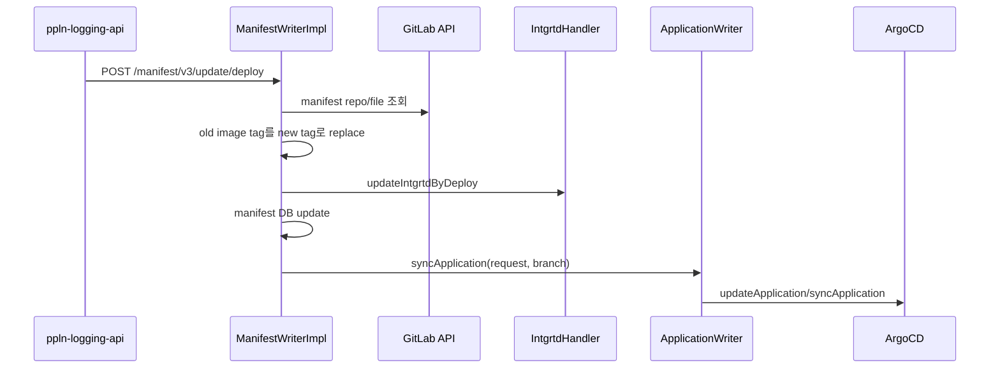
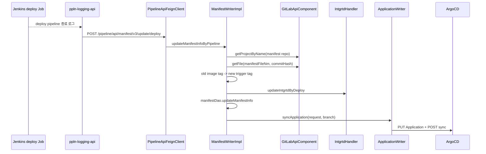

# 305 ArgoCD 매니페스트 배포 동기화 callback
---
> 배포 파이프라인 종료 후 `ppln-logging-api`는 pipeline-api의 manifest deploy callback을 호출한다. pipeline-api는 GitLab manifest 파일의 image tag를 새 trigger tag로 바꾸고, 통합관리 commit/branch를 갱신한 뒤 ArgoCD Application sync를 수행한다.

## 조사 기준

> 이 문서는 `/manifest/v3/update/deploy` callback과 `ManifestWriterImpl.updateManifestInfoByPipeline`을 기준으로 한다.

callback 요청은 `DeployManifestRequest`를 사용한다. request에는 ticket number, component input order, trigger serial, task code, business name, environment code가 포함된다.

## 현재 코드에서 실제로 쓰는 흐름

> deploy callback은 manifest 파일 수정과 ArgoCD sync를 하나의 흐름으로 처리한다.

| 단계 | 처리 | 실패 시 |
|---|---|---|
| 도구 조회 | task/env 기준 GitLab version control 도구를 조회한다 | data not found 또는 middleware 실패 |
| manifest repo 조회 | GitLab API로 manifest repository를 찾는다 | deploy failure 처리 후 rollback |
| manifest 파일 조회 | 저장된 manifest file name과 commit hash로 파일을 읽는다 | deploy failure 처리 후 rollback |
| image tag 교체 | 기존 tag를 `tcktNo-compnInptOrd-trigrSn`로 바꾼다 | 기존 tag가 없으면 rollback |
| 통합관리 갱신 | 새 파일 내용으로 manifest branch/commit을 갱신한다 | deploy failure 처리 후 rollback |
| manifest DB 갱신 | last/before image tag와 commit hash를 저장한다 | 예외 전파 |
| ArgoCD sync | 변경 branch로 Application targetRevision을 갱신하고 sync한다 | rollback 가능 여부에 따라 rollback 또는 deploy failure |

## 외부 API 사용 방식

> 이 흐름은 ArgoCD뿐 아니라 GitLab manifest repository와 통합관리 API에도 의존한다.

| 대상 | 외부 API 또는 컴포넌트 | 사용 이유 |
|---|---|---|
| pipeline-api callback | `POST /pipeline/api/manifest/v3/update/deploy` | logging-api가 배포 종료를 알린다 |
| GitLab | `GitLabApiComponent.getProjectByName`, `getFile` | manifest repository와 파일 내용을 조회한다 |
| 통합관리 | `intgrtdHandler.updateIntgrtdByDeploy` | 수정된 manifest 파일을 branch/commit으로 반영한다 |
| ArgoCD | `PUT /api/v1/applications/{appName}` | Helm Application의 targetRevision/valueFiles 갱신 |
| ArgoCD | `POST /api/v1/applications/{appName}/sync` | 변경된 manifest를 클러스터에 동기화 |

새 image tag는 ticket 실행 단위를 식별하기 위해 `tcktNo-compnInptOrd-trigrSn` 형태로 만든다. 이 값은 Jenkins trigger pipeline에서 `IMAGE_TAG`로도 사용되는 식별자와 맞물린다.

## 유스케이스별 API 조합

> 배포 callback은 Jenkins 로그 수집이 끝났다는 신호를 GitLab manifest 수정과 ArgoCD sync로 변환한다.

### 배포 성공 callback

| 단계 | 내부 API/메서드 | 외부 API/연계 | 결과 |
|---|---|---|---|
| 1 | `PipelineApiFeignClient.deployManifest` | `/pipeline/api/manifest/v3/update/deploy` | logging-api가 배포 완료를 알린다 |
| 2 | `toolchainDao.getSupportTool` | TPS DB | GitLab version control 도구 정보를 찾는다 |
| 3 | `GitLabApiComponent.getProjectByName` | GitLab API | manifest repository를 찾는다 |
| 4 | `GitLabApiComponent.getFile` | GitLab API | 현재 manifest 파일 내용을 읽는다 |
| 5 | `orgFileContent.replace` | memory 처리 | 기존 image tag를 trigger tag로 바꾼다 |
| 6 | `updateIntgrtdByDeploy` | 통합관리 | 새 manifest 파일을 branch/commit으로 반영한다 |
| 7 | `manifestDao.updateManifestInfo` | TPS DB | last/before image tag와 commit hash를 갱신한다 |
| 8 | `applicationWriter.syncApplication` | ArgoCD API | 변경 revision으로 Application을 sync한다 |

### 실패 지점별 후속 동작

| 실패 지점 | 코드 처리 | 후속 API 조합 |
|---|---|---|
| manifest repo 조회 실패 | `FAIL_TO_MANIFEST_UPDATE` | `processDeployFailure` 후 `rollbackManifest` |
| manifest file 조회 실패 | `DATA_NOT_FOUND` | `processDeployFailure` 후 `rollbackManifest` |
| 기존 image tag 미존재 | `DATA_NOT_FOUND` | `processDeployFailure` 후 `rollbackManifest` |
| 통합관리 manifest 갱신 실패 | `FAIL_TO_MANIFEST_UPDATE` | `processDeployFailure` 후 `rollbackManifest` |
| ArgoCD sync 실패 | `FAIL_TO_SYNC` 또는 `FAIL_TO_DEPLOY` | rollback 가능 여부에 따라 `rollbackManifest` 또는 deploy failure |

이 표가 중요한 이유는 deploy callback이 한 시스템의 API만 호출하지 않기 때문이다. GitLab 파일 조회, 통합관리 branch 갱신, TPS DB 갱신, ArgoCD sync 중 어느 지점에서 실패했는지에 따라 재시도 기준이 달라진다.

## 개선점

> deploy callback은 여러 시스템을 순차 갱신하므로 중간 실패 상태를 명확히 남겨야 한다.

- manifest 파일에서 기존 image tag를 단순 문자열 replace하므로 동일 tag가 여러 위치에 있으면 의도하지 않은 부분도 바뀔 수 있다.
- commit hash 기준 파일 조회 실패와 image tag 미존재가 모두 rollback으로 이어지므로 운영자가 원인을 빨리 구분할 수 있는 상태 코드가 필요하다.
- GitLab, 통합관리, ArgoCD sync 중 하나라도 실패하면 보상 흐름이 복잡해져 재시도 idempotency를 점검해야 한다.
- Helm valueFiles 갱신과 YAML manifest 갱신 정책이 다르므로 manifest kind별 테스트 케이스가 필요하다.
- logging-api callback과 ArgoCD sync가 동기적으로 묶여 있어 배포 지연이 로그 수집 scheduler에 영향을 줄 수 있다.

## 확인한 로컬 코드 위치

> 아래 파일에서 deploy callback과 sync 흐름을 확인했다.

- `ManifestControllerV3.java`
- `ManifestService.java`
- `ManifestWriterImpl.java`
- `ApplicationWriterImpl.java`
- `PipelineApiFeignClient.java`
