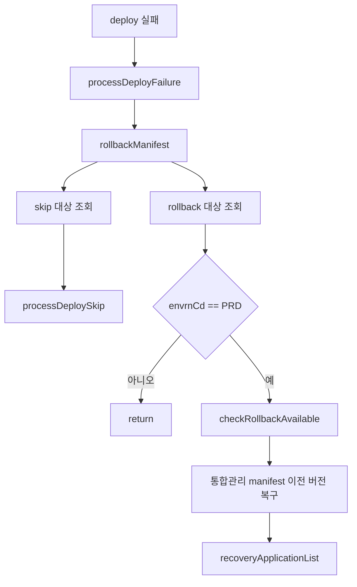
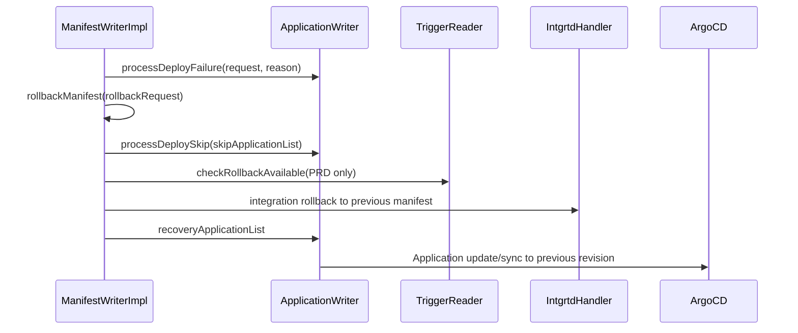

# 305 ArgoCD 배포실패 롤백 복구 흐름
---
> 배포 실패 시 pipeline-api는 Application 실행 상태를 실패로 남기고, PRD 환경에서는 rollback 가능 여부를 확인한 뒤 이전 manifest 상태로 복구를 시도한다. 아직 실행하지 않은 Application은 skip 처리된다.

## 조사 기준

> 이 문서는 `/manifest/v3/rollback` callback과 deploy callback 내부 rollback 호출을 기준으로 한다.

rollback은 단독 callback으로도 호출되고, deploy callback 중 manifest 조회 실패, image tag 미존재, 통합관리 갱신 실패, ArgoCD sync 실패에서도 호출된다.

## 현재 코드에서 실제로 쓰는 흐름

> rollback은 현재 trigger에서 미실행 대상과 실행 완료 대상을 나누어 처리한다.

| 단계 | 처리 | 의미 |
|---|---|---|
| deploy failure | `applicationWriter.processDeployFailure` | 실패 사유와 실행 상태를 Application 실행 이력에 반영한다 |
| skip 처리 | `applicationWriter.processDeploySkip` | 아직 실행 대기 중인 배포 대상을 skip으로 바꾼다 |
| rollback 가능 확인 | `triggerReader.checkRollbackAvailable` | PRD 환경에서 rollback 가능 조건을 확인한다 |
| manifest 복구 | 통합관리 rollback 계열 호출 | 이전 manifest 버전으로 되돌린다 |
| Application 복구 | `recoveryApplicationList` | ArgoCD Application을 이전 revision 기준으로 다시 sync한다 |

PRD가 아닌 환경에서는 `rollbackManifest`가 skip 처리 이후 return할 수 있다. 즉 rollback은 모든 환경에 동일하게 적용되는 범용 복구가 아니라, 운영 환경 정책과 trigger 상태에 의존한다.

## 유스케이스별 API 조합

> rollback은 단순히 ArgoCD를 이전 revision으로 되돌리는 호출 하나가 아니라, trigger 상태와 manifest 이력을 함께 해석한다.

### deploy callback 내부 rollback

| 단계 | 내부 API/메서드 | 조합 의미 |
|---|---|---|
| 1 | `processDeployFailure` | 실패한 Application 실행 상태와 사유를 먼저 남긴다 |
| 2 | `selectApplicationSkipList` | 아직 실행하지 않은 배포 대상을 skip으로 분리한다 |
| 3 | `selectRollbackApplicationByWorkflow` | rollback 대상 Application을 찾는다 |
| 4 | `checkRollbackAvailable` | PRD trigger 기준으로 rollback 가능 여부를 확인한다 |
| 5 | 통합관리 rollback | manifest 파일을 이전 버전으로 되돌릴 기준을 만든다 |
| 6 | `recoveryApplicationList` | 이전 revision 기준으로 ArgoCD Application sync를 시도한다 |

### 명시적 rollback callback

`ppln-logging-api`는 `/pipeline/api/manifest/v3/rollback`도 호출할 수 있다. 이 API는 deploy update와 별개로 rollback 요청을 pipeline-api에 전달하는 경로다. 내부에서는 같은 `rollbackManifest` 흐름으로 들어가므로, 운영자는 "deploy 실패 중 자동 rollback"과 "명시적 rollback callback"이 최종적으로 같은 복구 로직을 공유한다고 보면 된다.

## 외부 API 사용 방식

> rollback 자체는 통합관리와 ArgoCD sync를 조합한다.

| 목적 | 대상 | API 또는 컴포넌트 |
|---|---|---|
| rollback callback | pipeline-api | `POST /pipeline/api/manifest/v3/rollback` |
| rollback 가능 여부 | DB/trigger | `triggerReader.checkRollbackAvailable` |
| manifest 이전 버전 복구 | 통합관리 | integration rollback 계열 호출 |
| Application 복구 sync | ArgoCD | `PUT /api/v1/applications/{appName}`, `POST /api/v1/applications/{appName}/sync` |

## 개선점

> rollback 흐름은 정책 조건과 실제 복구 결과를 더 잘 드러내야 한다.

- PRD가 아닌 환경에서 return하는 정책은 의도된 것인지, staging도 rollback해야 하는지 확인이 필요하다.
- rollback 가능 여부가 trigger 상태에 의존하므로 실패 원인과 rollback 불가 원인을 구분해 저장해야 한다.
- deploy failure와 rollback failure가 같은 예외 흐름으로 섞이면 운영자가 최종 상태를 판단하기 어렵다.
- 복구 sync가 실패한 Application 목록과 성공 목록을 분리해 재시도할 수 있어야 한다.
- skip 처리된 Application과 rollback 대상 Application의 기준을 문서와 테스트로 고정해야 한다.

## 확인한 로컬 코드 위치

> 아래 파일에서 rollback과 recovery 흐름을 확인했다.

- `ManifestControllerV3.java`
- `ManifestWriterImpl.rollbackManifest`
- `ApplicationWriterImpl.processDeployFailure`
- `ApplicationWriterImpl.processDeploySkip`
- `ApplicationWriterImpl.recoveryApplicationList`
- `TriggerReader`
