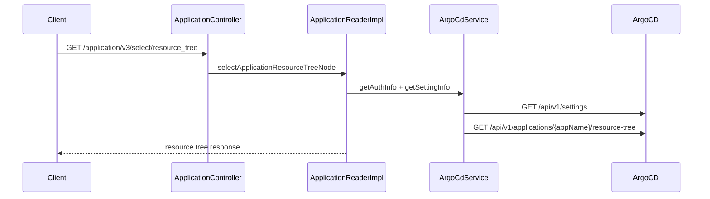

# 305 ArgoCD 리소스 트리 로그 이벤트 조회 API
---
> Application 조회 API는 TPS DB 조회와 ArgoCD live resource 조회를 함께 제공한다. resource tree stream과 logs는 FeignClient가 아니라 WebClient 기반 SSE로 처리된다.


## 조사 기준

> 이 문서는 `/application/v3`의 조회 계열 API를 기준으로 한다.

주요 API는 `/select/resource_tree`, `/select/resource_tree/stream`, `/select/manifest_resource`, `/select/event_resource`, `/select_application_logs`, `/select/diff/{aplcnId}`이다.


## 현재 코드에서 실제로 쓰는 흐름

> 조회 API는 Application id나 app name으로 ArgoCD Application을 찾고, 필요한 resource API를 호출한다.

| 유스케이스 | 내부 API | 외부 API | 비고 |
|---|---|---|---|
| resource tree 조회 | `GET /select/resource_tree` | `GET /api/v1/applications/{appName}/resource-tree` | appNamespace query를 함께 전달한다 |
| resource tree stream | `GET /select/resource_tree/stream` | `GET /api/v1/stream/applications/{appName}/resource-tree` | WebClient SSE, retry와 timeout 적용 |
| manifest resource 조회 | `GET /select/manifest_resource` | `GET /api/v1/applications/{appName}/resource` | kind, group, namespace, resourceName 기준 |
| event 조회 | `GET /select/event_resource` | `GET /api/v1/applications/{appName}/events` | resourceUID, namespace, name 기준 |
| logs stream | `GET /select_application_logs` | `GET /api/v1/applications/{appName}/logs` | WebClient SSE로 log stream 전달 |
| diff 조회 | `GET /select/diff/{aplcnId}` | `GET /api/v1/applications/{appName}/managed-resources` | normalizedLiveState, predictedLiveState 필드 조회 |
| managed resource | 내부 util | `GET /api/v1/applications/{appName}/managed-resources` | resource 상세 정보 조회 |
| resource links | 내부 util | `GET /api/v1/applications/{appName}/resource/links` | resource link 조회 |


## 외부 API 사용 방식

> resource 조회는 ArgoCD 설정의 `controllerNamespace`를 appNamespace로 사용한다.

`ArgoCdService.getSettingInfo`는 `/api/v1/settings`를 호출해 `controllerNamespace`를 읽는다. 이후 resource tree, resource, event, managed resource API에 `appNamespace` query parameter로 전달한다.

stream API는 `ApplicationReaderImpl`에서 WebClient로 호출한다. resource tree stream은 retry와 timeout을 두고, logs stream은 SSE emitter로 클라이언트에 전달한다. FeignClient에 선언된 조회 API와 WebClient stream API가 함께 존재하므로, 문서에서는 "일회성 조회"와 "stream 조회"를 분리해서 이해해야 한다.


## 유스케이스별 API 조합

> 조회 API는 TPS DB의 Application 식별자를 ArgoCD live resource API 호출로 변환한다.

### Application 상세에서 리소스 트리를 볼 때



| 단계 | 내부 API/메서드 | 외부 API | 결과 |
|---|---|---|---|
| 1 | `/select/resource_tree` | Client | appName, taskCd, envrnCd를 받는다 |
| 2 | `getAuthInfo` | `/api/v1/session` | Bearer token을 얻는다 |
| 3 | `getSettingInfo` | `/api/v1/settings` | appNamespace를 얻는다 |
| 4 | `getApplicationResourceTree` | `/api/v1/applications/{appName}/resource-tree` | live resource tree를 조회한다 |

### 로그 stream을 볼 때

```mermaid
flowchart TD
    A[GET /select_application_logs] --> B[ApplicationReaderImpl.selectApplicationLogs]
    B --> C[ArgoCD token 발급]
    C --> D[WebClient GET /api/v1/applications/{appName}/logs]
    D --> E[SSE chunk 수신]
    E --> F[SseEmitter로 client 전달]
    F --> G{timeout/error/complete}
    G --> H[emitter 종료]
```

로그 stream은 FeignClient가 아니라 WebClient를 사용한다. 따라서 일반 조회 API처럼 응답 body를 한 번에 반환하지 않고, ArgoCD SSE stream을 클라이언트 SseEmitter로 중계한다.

### diff와 resource 상세를 볼 때

| 화면 행동 | 내부 API | ArgoCD API | 조합 의미 |
|---|---|---|---|
| manifest resource 조회 | `/select/manifest_resource` | `/api/v1/applications/{appName}/resource` | 특정 Kubernetes resource manifest를 조회한다 |
| event 조회 | `/select/event_resource` | `/api/v1/applications/{appName}/events` | resourceUID/name 기준 이벤트를 조회한다 |
| diff 조회 | `/select/diff/{aplcnId}` | `/api/v1/applications/{appName}/managed-resources` | live/predicted state를 가져와 차이를 만든다 |
| resource links 조회 | 내부 util | `/api/v1/applications/{appName}/resource/links` | resource 관련 외부 링크를 조회한다 |


## 개선점

> 조회 API는 실시간성과 장애 진단의 균형을 맞춰야 한다.

- stream API는 장시간 연결을 유지하므로 client disconnect, timeout, token 만료 처리 정책이 필요하다.
- ArgoCD API가 400을 반환할 때 일부 메서드는 error body를 파싱해 반환하지만, 다른 메서드는 null을 반환하므로 오류 표현을 통일해야 한다.
- diff 조회는 `fields` query를 인코딩 문자열로 직접 가지고 있어 ArgoCD API 변경에 취약하다.
- resource tree와 managed resource 조회는 appNamespace 의존성이 크므로 settings 조회 실패 시 사용자 메시지를 분리해야 한다.
- logs stream은 민감정보를 포함할 수 있으므로 masking 또는 접근 권한 검증 기준을 문서화해야 한다.


## 확인한 로컬 코드 위치

> 아래 파일에서 resource 조회와 stream API를 확인했다.

- `ApplicationController.java`
- `ApplicationReaderImpl.java`
- `ArgoCdFeignClient.java`
- `ArgoCdService.java`
