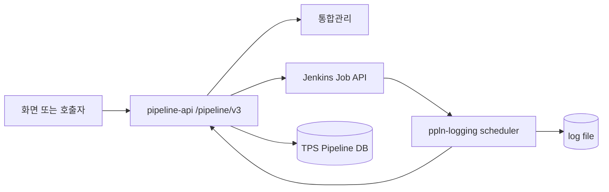
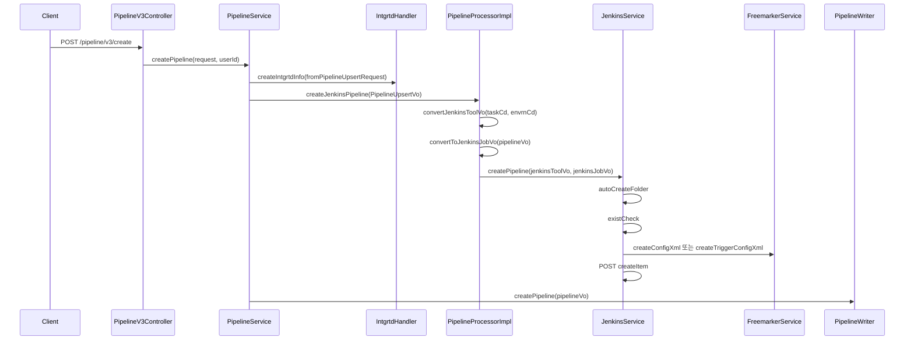
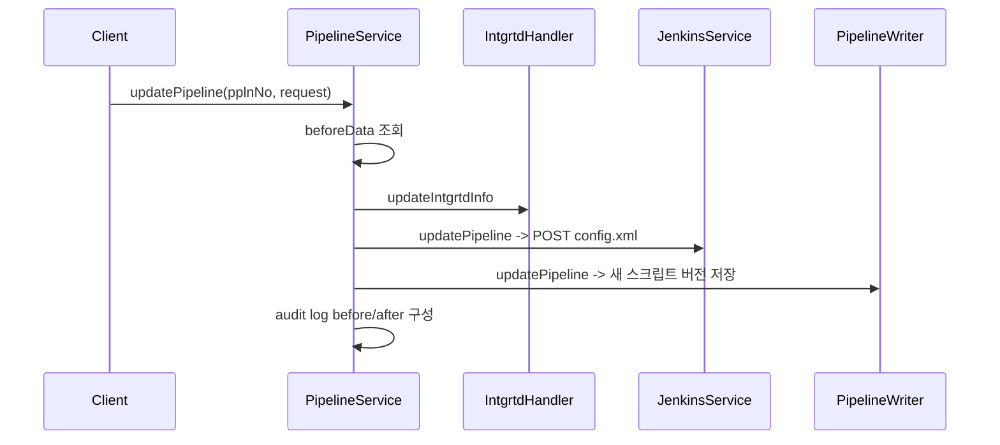
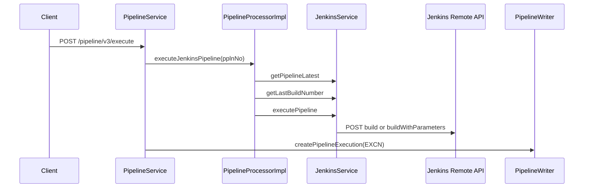

# 305 Jenkins 일반 파이프라인 CRUD 실행 유스케이스
---
> 일반 파이프라인 API의 목적은 Jenkins Job을 TPS 화면/DB/통합관리와 맞춰 관리하는 것이다. 사용자는 pipeline-api를 호출하지만, 실제 효과는 통합관리 변경, Jenkins `config.xml` 반영, TPS 파이프라인/스크립트 이력 저장이 조합되어 만들어진다.

## 유스케이스 관점의 전체 그림

> 일반 파이프라인은 "Job 단위 실행 대상"이고, 트리거 파이프라인은 여러 일반 파이프라인을 실행하는 상위 orchestrator다.

`/pipeline/v3`의 일반 파이프라인 API는 Jenkins Job 하나를 관리한다. 생성과 수정은 통합관리 정보를 먼저 만들거나 갱신하고, Jenkins Job을 생성/수정하고, TPS DB에 파이프라인과 스크립트 버전을 저장한다. 실행은 Jenkins build API를 호출한 뒤 실행 이력을 `EXCN`으로 남기고, 이후 상태와 로그 수집은 `ppln-logging-api` scheduler가 이어받는다.

## 생성 유스케이스

> 생성은 통합관리와 Jenkins Job이 모두 성공해야 TPS DB 저장까지 진행된다.

| 단계 | 조합되는 API/메서드 | 결과 |
|---|---|---|
| 1 | `POST /pipeline/v3/create` | 화면 요청이 application service로 들어온다 |
| 2 | `IntgrtdHandler.createIntgrtdInfo` | Git 기반 스크립트 관리에 필요한 통합관리 정보가 생긴다 |
| 3 | `PipelineProcessorImpl.convertJenkinsToolVo` | task/env 기준 Jenkins 접속 정보를 찾는다 |
| 4 | `JenkinsService.autoCreateFolder` | `/job/{taskCd}/job/{envrnCd}` folder 구조를 보장한다 |
| 5 | `JenkinsService.createPipeline` | Jenkins `createItem`으로 Job을 만든다 |
| 6 | `PipelineWriter.createPipeline` | TPS 파이프라인과 스크립트 이력이 저장된다 |

이 흐름에서 Jenkins Job path는 `/job/{taskCd}/job/{envrnCd}/job/{bizNm}`이다. `SQA`와 `JNT` 환경은 Jenkins 도구 조회 시 `STG`로 치환되므로, 테스트 파이프라인 계열은 실제 Jenkins 접속 도구가 staging으로 잡힌다.

## 수정 유스케이스

> 수정은 기존 파이프라인을 덮어쓰는 것이 아니라 새 스크립트 버전을 남기는 방식이다.

| 단계 | 조합되는 API/메서드 | 결과 |
|---|---|---|
| 1 | `POST /pipeline/v3/update/{pplnNo}` | 수정 대상 pipeline number를 path로 받는다 |
| 2 | `PipelineReader.selectPipeline` | 감사로그용 이전 데이터를 확보한다 |
| 3 | `IntgrtdHandler.updateIntgrtdInfo` | 통합관리의 파일/브랜치 정보가 갱신된다 |
| 4 | `JenkinsService.updatePipeline` | Jenkins `config.xml`을 새 내용으로 교체한다 |
| 5 | `PipelineWriter.updatePipeline` | TPS DB와 스크립트 버전이 갱신된다 |

Jenkins Job이 없는데 수정 요청이 들어오면 `JenkinsService.updatePipeline`은 내부적으로 `createPipeline`으로 전환한다. 운영 관점에서는 "수정 API가 Jenkins 신규 생성까지 할 수 있다"는 점을 알아야 한다.

## 삭제 유스케이스

> 현재 일반 파이프라인 삭제는 Jenkins Job 삭제까지 수행하지 않는다.

| 단계 | 조합되는 API/메서드 | 현재 동작 |
|---|---|---|
| 1 | `POST /pipeline/v3/delete/{pplnNo}` | 삭제 요청을 받는다 |
| 2 | `PipelineReader.selectPipeline` | 통합관리 serial과 감사로그 이전 데이터를 조회한다 |
| 3 | `IntgrtdHandler.checkIntgrtdUseTicket` | 티켓에서 사용 중인지 확인한다 |
| 4 | `IntgrtdHandler.deleteIntgrtdInfo` | 통합관리 정보를 삭제한다 |
| 5 | `pipelineValidator.validateDeleteRequest` | 삭제 가능 여부를 검증한다 |
| 6 | `pipelineProcessor.deleteJenkinsPipeline` | 현재 주석 처리되어 호출되지 않는다 |
| 7 | `PipelineWriter.deletePipeline` | TPS DB에서 삭제 처리한다 |

이 구조 때문에 TPS DB에서는 삭제되었지만 Jenkins에는 Job이 남는 상황이 생길 수 있다. 305P에서는 "삭제 시 Jenkins Job도 지울 것인지" 또는 "운영 추적을 위해 Jenkins Job을 남길 것인지"를 정책으로 고정해야 한다.

## 실행과 중지 유스케이스

> 실행은 Jenkins build number를 예측해 TPS 실행 이력 번호로 저장한다.

| 유스케이스 | 내부 API | Jenkins API 조합 | TPS 상태 변경 |
|---|---|---|---|
| 실행 | `POST /pipeline/v3/execute` | `GET api/json`, `GET lastBuild/buildNumber`, `POST build` 또는 `POST buildWithParameters` | 실행 이력 `EXCN` 생성 |
| 중지 | `POST /pipeline/v3/stop` | `GET api/json`, `GET {lastBuildNo}/api/json`, `POST {lastBuildNo}/stop` | 중지/반려 성격의 이력 저장 |
| 실행 목록 | `GET /pipeline/v3/execute/list/{pplnNo}` | 없음 | DB 실행 이력 조회 |
| 실행 이력 상세 | `GET /pipeline/v3/select/excnhstry` | 없음 | DB 실행 이력 조회 |

실행 전 `JenkinsService.executePipeline`은 Job 설정을 다시 update한다. 그 다음 Jenkins `inQueue`와 마지막 build의 `inProgress`를 확인해 중복 실행을 막는다. 중간변수가 있으면 `buildWithParameters`, 없으면 `build`를 호출한다.

## 개선점

> 일반 파이프라인은 Jenkins Job과 TPS DB의 정합성이 핵심이다.

- 삭제 흐름에서 Jenkins Job 삭제가 빠져 있어 orphan Job 정책을 정해야 한다.
- build number를 `latest + 1`로 예측하므로 동시 실행에서는 Jenkins queue item id 기반 추적이 더 안전하다.
- 생성/수정에서 통합관리 성공 후 Jenkins 또는 DB 저장이 실패할 때 보상 트랜잭션이 명확하지 않다.
- `updatePipeline`이 Job 미존재 시 create로 전환하므로 API 의도와 실제 작업을 감사로그에 분리해 남겨야 한다.
- 실행 API가 매번 Jenkins Job update를 선행하므로 설정 변경 실패와 실행 실패를 구분해 사용자에게 보여줘야 한다.
