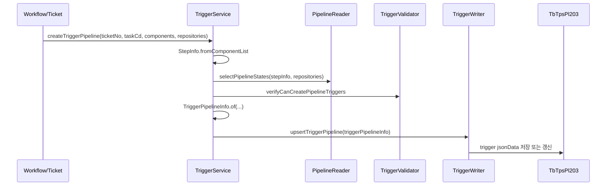
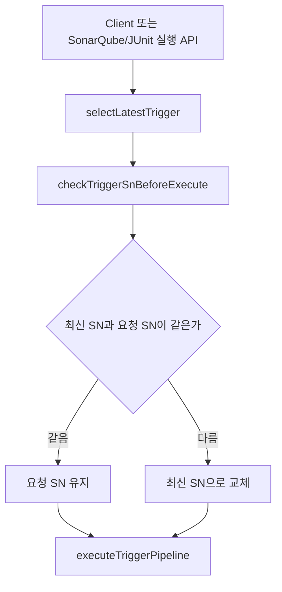
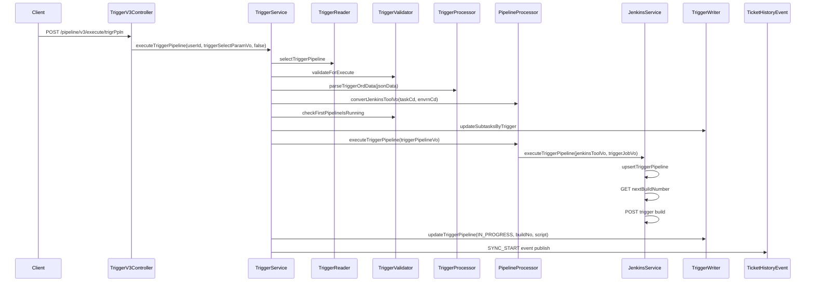
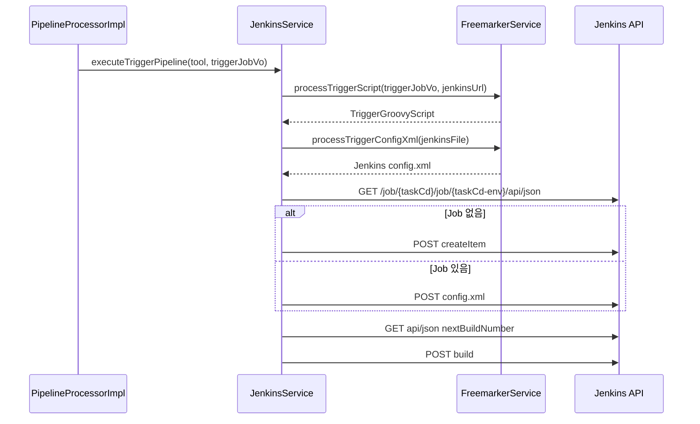
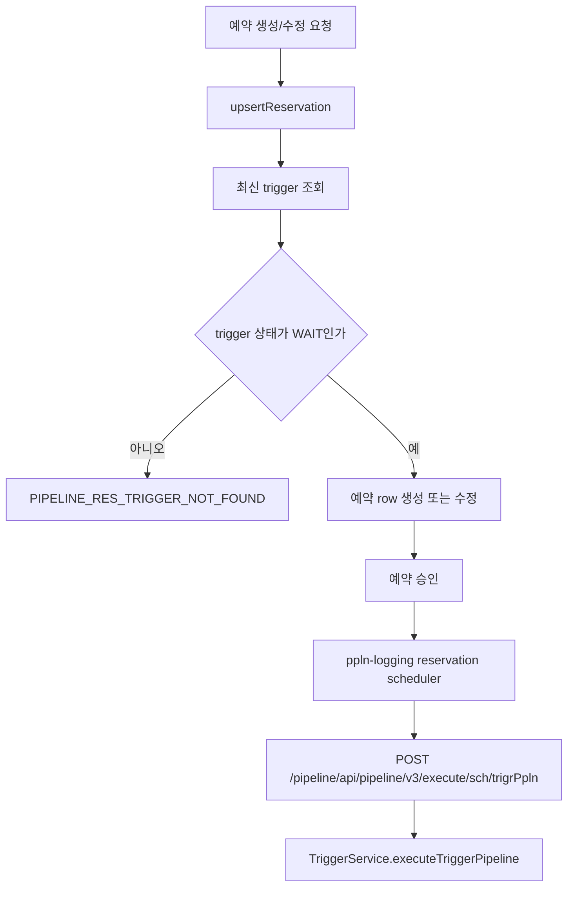
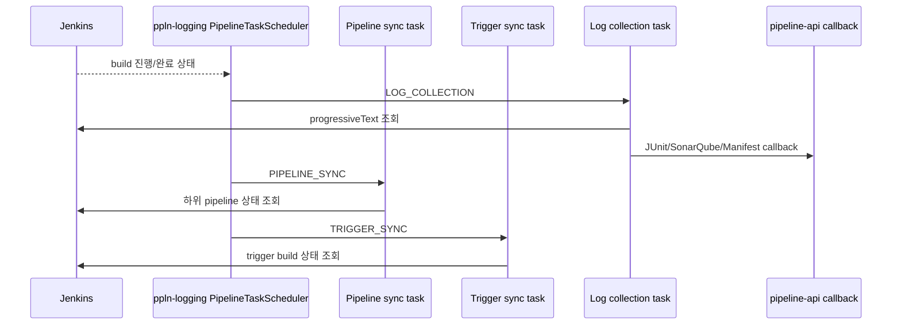

# 305 Jenkins 트리거 파이프라인 상세 유스케이스
---
> 트리거 파이프라인은 사용자가 직접 실행하는 단일 Jenkins Job이 아니다. 티켓의 컴포넌트 입력 단위로 실행해야 할 하위 파이프라인 목록을 `jsonData`에 저장하고, 실행 시점에 Jenkins trigger Job을 새로 구성한 뒤 그 Job이 하위 Jenkins Job들을 순서대로 호출하는 구조다.

## 목적과 위치

> `305_PIPELINE` 폴더를 따로 두지 않는 이유는 트리거 파이프라인의 실제 실행 단위가 Jenkins이기 때문이다.

트리거 파이프라인은 pipeline-api의 도메인 용어지만, 실제 외부 실행은 Jenkins trigger Job으로 이루어진다. TPS DB의 `TbTpsPl203` 레코드는 "어떤 하위 파이프라인을 어떤 순서로 실행할지"를 들고 있고, Jenkins Job은 그 목록을 실행 가능한 Groovy script로 바꾼 결과다.

일반 파이프라인과 트리거 파이프라인의 차이는 다음과 같다:

| 구분 | 일반 파이프라인 | 트리거 파이프라인 |
|---|---|---|
| Jenkins Job 목적 | 업무 하나를 직접 실행한다 | 여러 업무 Job을 순서대로 호출한다 |
| Jenkins path | `/job/{taskCd}/job/{envrnCd}/job/{bizNm}` | `/job/{taskCd}/job/{taskCd}-{envrnCd}` |
| script 원천 | 통합관리 또는 request의 script | `TriggerGroovyScript.ftl`로 매번 생성 |
| 실행 이력 | `TbTpsPl205`의 일반 실행 이력 | `TbTpsPl203`의 trigger execution history |
| 사후 처리 | logging scheduler가 build 상태와 로그 수집 | logging scheduler가 trigger와 하위 pipeline 상태를 함께 동기화 |

## 유스케이스 1: 트리거 생성

> 생성은 Jenkins를 바로 호출하지 않고, 실행할 하위 파이프라인 목록을 TPS DB에 준비하는 단계다.

이 단계에서 핵심은 Jenkins가 아니라 `jsonData`다. `jsonData` 안에는 trigger가 실행할 하위 pipeline 목록과 순서가 들어간다. 실행 시 `TriggerProcessor.parseTriggerOrdData`가 이 값을 다시 읽어 `ordList`로 바꾼다.

| API 또는 메서드 | 역할 | 결과 |
|---|---|---|
| `POST /pipeline/v3/create/trigrPpln` | 화면이나 외부 요청이 trigger 목록을 직접 넘긴다 | `TriggerWriter.upsertTriggerPipeline` 호출 |
| `TriggerService.createTriggerPipeline(ticketNo, ...)` | workflow/ticket 연동에서 trigger를 만든다 | pipeline 상태 검증 후 trigger info 생성 |
| `PipelineReader.selectPipelineStates` | 컴포넌트/저장소별 실행 가능한 pipeline을 찾는다 | 누락 pipeline이나 상태 불일치 검증에 사용 |
| `TriggerValidator.verifyCanCreatePipelineTriggers` | trigger 생성 가능 조건을 확인한다 | 생성 불가 시 workflow 쪽으로 예외 전파 |
| `TriggerWriter.upsertTriggerPipeline` | `TbTpsPl203`에 trigger 정보를 저장한다 | WAIT 상태 trigger 준비 |

## 유스케이스 2: 실행 전 검증과 최신 트리거 보정

> 자동화 테스트 실행 API는 최신 trigger serial을 다시 확인한 뒤 실행한다.

`AnalysisService.executeAnalysis`와 `JUnitService`의 실행 흐름은 모두 최신 trigger를 기준으로 다시 검증한다. 사용자가 오래된 trigger serial을 들고 있어도 `checkTriggerSnBeforeExecute` 결과가 다르면 최신 serial로 바꾼 뒤 실행한다.

| API | 호출 주체 | 의미 |
|---|---|---|
| `GET /pipeline/v3/select/trigr/last` | 화면 또는 서비스 | ticket/component 기준 최신 trigger 조회 |
| `POST /pipeline/v3/check/trigr/before/execute` | 화면 또는 자동화 테스트 서비스 | 실행 직전 최신 trigger와 상태 검증 |
| `POST /analysis/v3/execute` | SonarQube 분석 화면 | 내부에서 최신 trigger 검증 후 trigger 실행 |
| `POST /jUnit/v3/execute` | JUnit 실행 화면 | 내부에서 최신 trigger 검증 후 trigger 실행 |

## 유스케이스 3: 트리거 실행

> 실행은 DB trigger를 읽고, 실행 대상 목록을 파싱하고, Jenkins trigger Job을 upsert하고, build를 호출하고, trigger 실행 이력을 갱신하는 조합이다.

`TriggerService.executeTriggerPipeline`에서 중요한 순서는 "검증 후 Jenkins 실행"이 아니라 "검증, 하위 task 상태 갱신, Jenkins trigger Job upsert, Jenkins build, DB trigger 상태 갱신"이다. 이 순서 때문에 Jenkins 실행이 성공했지만 DB 업데이트가 실패하는 경우나, DB는 준비됐지만 Jenkins build가 실패하는 경우를 별도 장애로 봐야 한다.

| 단계 | 코드 | 설명 |
|---|---|---|
| 1 | `selectTriggerPipeline` 또는 `selectLatestTrigger` | 일반 실행은 지정 SN, 테스트 실행은 최신 SN을 읽는다 |
| 2 | `validateForExecute` | WAIT 상태가 아니면 실행을 거부한다 |
| 3 | `parseTriggerOrdData` | trigger `jsonData`에서 하위 pipeline 순서를 복원한다 |
| 4 | `checkFirstPipelineIsRunning` | 같은 ticket/첫 pipeline 중복 실행을 막는다 |
| 5 | `updateSubtasksByTrigger` | trigger 하위 실행 대상 상태를 갱신한다 |
| 6 | `PipelineProcessor.executeTriggerPipeline` | Jenkins trigger Job 실행으로 위임한다 |
| 7 | `updateTriggerPipeline` | Jenkins trigger build number와 script를 DB에 저장한다 |
| 8 | `createSonarQubeProjectExcn` 또는 `createUnitTestResult` | `SQA`, `JNT` 테스트 실행 초기 데이터를 만든다 |
| 9 | `DefaultTcktHstryEvent` | ticket history에 자동화 테스트 시작 또는 배포 시작 이벤트를 남긴다 |

## 유스케이스 4: Jenkins trigger Job upsert와 하위 Job 호출

> Jenkins trigger Job은 고정 Job 하나가 아니라, 실행 시점의 `ordList`로 Groovy를 다시 만든 결과다.

`TriggerGroovyScript.ftl`은 각 하위 pipeline을 Jenkins `build job: "{envrnCd}/{bizNm}"` 형태로 호출한다. 이때 `SEPARATE_ID`와 `IMAGE_TAG`는 `tcktNo-compnInptOrd-trigrSn` 조합으로 만들어져 하위 Job에 전달된다.

| 생성물 | 생성 위치 | 의미 |
|---|---|---|
| Trigger Groovy | `FreemarkerService.processTriggerScript` | 하위 pipeline stage 목록과 `build job` 호출을 담는다 |
| Jenkins config.xml | `FreemarkerService.processTriggerConfigXml` | Trigger Groovy를 Jenkins Job script로 감싼다 |
| Jenkins trigger Job | `JenkinsService.upsertTriggerPipeline` | `/job/{taskCd}/job/{taskCd}-{envrnCd}` Job |
| trigger build number | `JenkinsService.getPipelineLatest` | 실행 후 TPS trigger execution history number로 저장된다 |

## 유스케이스 5: 운영 예약 실행

> 운영 예약은 trigger 자체를 새로 만드는 것이 아니라 WAIT 상태 trigger에 예약 정보를 붙이고, scheduler가 hidden API로 실행한다.

| API | 목적 | 실제 조합 |
|---|---|---|
| `POST /pipeline/v3/upsert/reservation/trigr/ppln` | 예약 생성/수정 | 최신 WAIT trigger를 찾아 `TbTpsPl204` 예약 정보를 만든다 |
| `POST /pipeline/v3/approve/reservation/top/trigr/ppln` | 최상위 예약 승인 | 예약 row와 trigger row를 검증한 뒤 승인 처리한다 |
| `POST /pipeline/v3/drop/reservation/trigr/ppln` | 예약 취소 | trigger 취소와 예약 drop을 함께 수행한다 |
| `POST /pipeline/v3/execute/sch/trigrPpln` | scheduler 실행 | logging-api가 호출하는 hidden API이며 일반 trigger 실행과 같은 서비스 메서드를 탄다 |

## 유스케이스 6: 실행 후 scheduler 동기화

> 트리거 실행 API는 Jenkins build를 시작시키는 데서 끝나고, 완료 판단은 logging scheduler가 담당한다.

`PipelineTaskScheduler`는 `PIPELINE_GROUP` lock을 잡고 `LOG_COLLECTION`, `PIPELINE_SYNC`, `TRIGGER_SYNC`를 실행한다. 따라서 trigger 실행 직후 사용자가 보는 상태는 즉시 완료가 아니라, scheduler가 Jenkins와 callback 결과를 수집한 뒤 반영한 상태다.

## 개선점

> 트리거 파이프라인은 Jenkins orchestration과 TPS 상태 동기화가 강하게 결합되어 있다.

- trigger Job을 실행 직전 upsert하므로 Jenkins config 변경 실패와 build 실패를 분리해 저장해야 한다.
- trigger build number를 `nextBuildNumber`로 미리 읽기 때문에 동시 실행과 Jenkins queue 상황에서 추적 오차가 생길 수 있다.
- 하위 pipeline 호출 결과는 Jenkins trigger Groovy와 logging scheduler가 나눠 처리하므로, 어떤 하위 Job이 실패했는지 TPS 상태 모델에 명확히 남겨야 한다.
- 예약 실행은 hidden API와 scheduler lock에 의존하므로 scheduler 장애 시 예약이 실행되지 않은 이유를 조회할 수 있어야 한다.
- `jsonData`가 trigger 실행 정의의 핵심이므로 schema 문서화와 역직렬화 실패 처리 정책이 필요하다.
