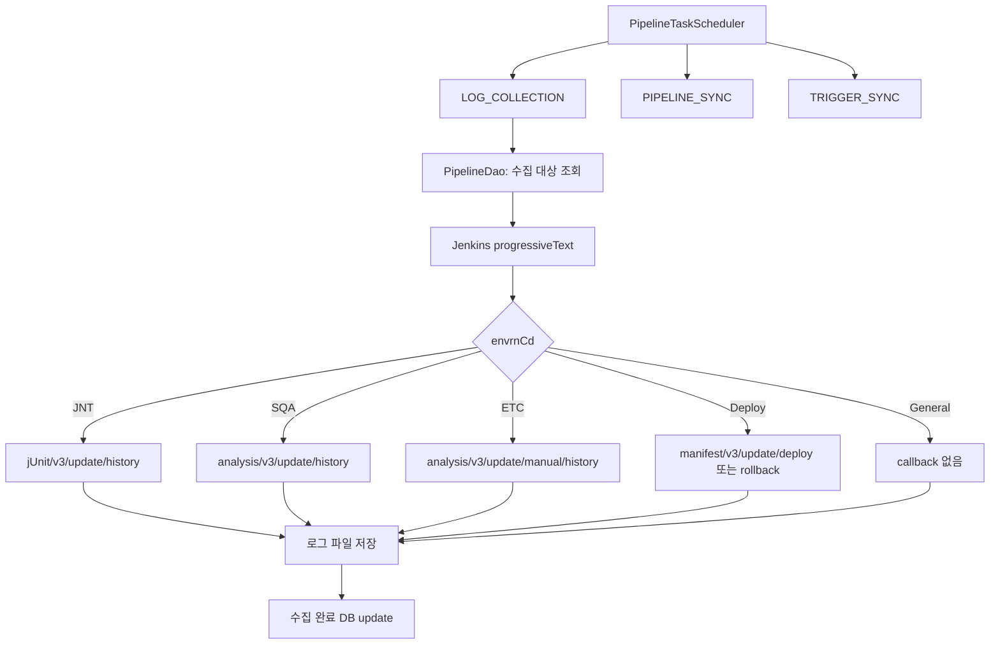
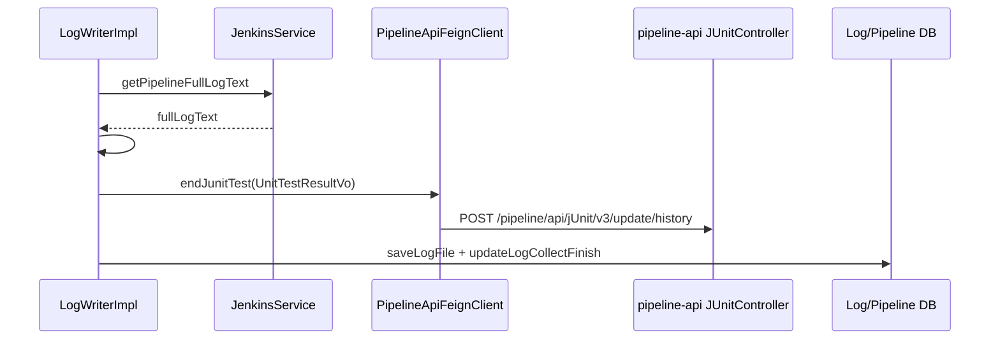
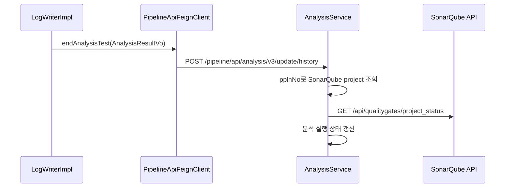
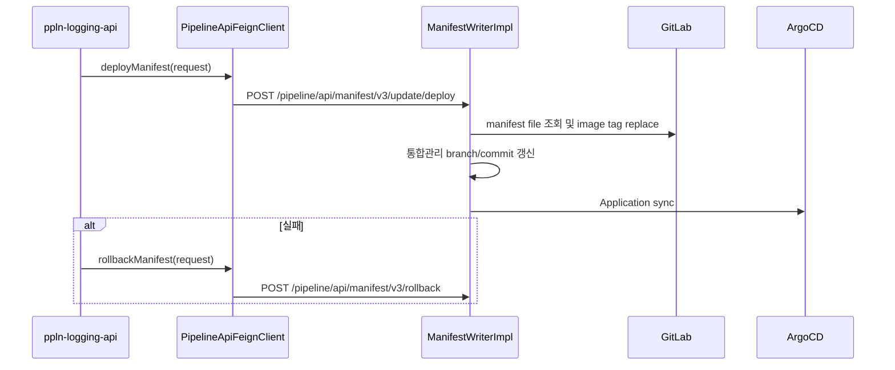

# 305 ppln-logging 로그수집 callback 유스케이스
---
> `ppln-logging-api`는 Jenkins 로그를 저장하는 모듈을 넘어, Jenkins 실행 종료를 pipeline-api의 도메인 종료 API로 바꿔 주는 adapter다. 같은 Jenkins 로그라도 환경 코드에 따라 JUnit, SonarQube, ArgoCD deploy/rollback callback으로 갈라진다.

## 전체 조합

> logging scheduler는 Jenkins 상태 조회, 로그 파일 저장, pipeline-api callback을 묶어 실행한다.

수집 대상 하나는 `TbTpsPl205Extended`로 표현된다. 여기에는 Jenkins 접속 정보, task/environment/business, pipeline number, execution history number, ticket, component input order, trigger serial이 함께 들어 있다. 그래서 logging-api는 Jenkins 로그만 읽는 것이 아니라 "이 로그가 어떤 TPS 유스케이스의 종료 신호인지"까지 판단할 수 있다.

## 유스케이스 1: JUnit 종료 callback

> `JNT` 로그는 marker line을 파싱해 단위테스트 결과로 변환한다.

| 조합 요소 | 역할 |
|---|---|
| Jenkins `progressiveText` | build 전체 로그를 읽는다 |
| marker `##@#UNIT_TEST_RESULT##@#` | 총 건수, 성공 건수, 실패 건수, 실패 여부를 추출한다 |
| `UnitTestResultVo` | ticket, component, trigger, pipeline, 테스트 수치를 담는다 |
| `/jUnit/v3/update/history` | pipeline-api의 JUnit 도메인 종료 처리 API다 |

marker가 없거나 파싱에 실패하면 `FAIL`, 전체 0건으로 결과를 만든다. 이는 "테스트 실패"와 "로그 포맷 실패"가 같은 결과로 보일 수 있다는 한계가 있다.

## 유스케이스 2: SonarQube 종료 callback

> `SQA` 로그는 분석 자체 결과를 파싱하지 않고, SonarQube quality gate 조회를 pipeline-api에 위임한다.

`AnalysisResultVo`에는 ticket, component input order, trigger serial, pipeline number, usage type이 들어간다. pipeline-api는 이 값으로 SonarQube project와 branch를 다시 해석하고 quality gate를 조회한다.

## 유스케이스 3: 수동 SonarQube 종료 callback

> `ETC` 로그는 ticket trigger가 아니라 수동 분석 실행 이력을 닫는다.

수동 분석은 ticket/component/trigger serial이 없는 경로로 실행될 수 있다. 그래서 logging-api는 `pplnNo`와 `usgSe` 중심의 `AnalysisResultVo`를 만들고 `/analysis/v3/update/manual/history`로 보낸다. pipeline-api는 pipeline number로 SonarQube project를 찾고 수동 branch의 quality gate를 확인한다.

## 유스케이스 4: ArgoCD deploy/rollback callback

> 배포 pipeline 로그 수집은 manifest update와 ArgoCD sync로 이어진다.

ArgoCD callback은 Jenkins 로그 본문에서 결과 값을 파싱하는 방식보다, 배포 pipeline이 남긴 실행 컨텍스트를 바탕으로 pipeline-api의 manifest 도메인 API를 호출하는 방식에 가깝다. 실제 manifest 파일 변경과 ArgoCD sync는 pipeline-api에서 수행한다.

## 유스케이스 5: 로그 파일 저장과 완료 처리

> callback 성공 이후에만 로그 저장과 수집 완료 업데이트가 진행된다.

| 단계 | 메서드 | 의미 |
|---|---|---|
| 1 | `jenkinsUseCase.getPipelineFullLogText` | Jenkins에서 로그 본문을 가져온다 |
| 2 | `requestToTestPipelineEnd` | 환경 코드별 callback을 수행한다 |
| 3 | `logHandler.saveLogFile` | 파일 시스템에 로그를 저장한다 |
| 4 | `pipelineDao.updateLogCollectFinish` | DB에서 로그 수집 완료로 표시한다 |

이 순서 때문에 callback API가 실패하면 로그 파일 저장도 진행되지 않는다. 장애 분석 관점에서는 callback 실패 로그도 파일로 남길지, callback과 파일 저장을 분리할지 검토할 필요가 있다.

## 개선점

> logging-api는 Jenkins와 pipeline-api 사이의 경계 모듈이므로 실패 격리가 중요하다.

- progressive log를 `start=0`으로 한 번만 조회하므로 대용량 로그에서는 chunk 반복 수집이 필요하다.
- full log를 application log에 그대로 찍는 코드는 민감정보와 로그 폭증 위험이 있다.
- callback 실패와 로그 저장 실패가 같은 재시도 대상으로 묶여 있어 원인 분석이 어렵다.
- JUnit marker 파싱 실패를 테스트 실패와 구분하는 별도 상태가 필요하다.
- deploy callback은 ArgoCD sync까지 동기 처리하므로 logging scheduler 지연으로 전파될 수 있다.
