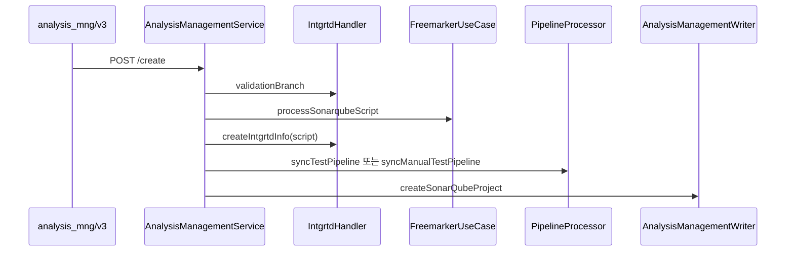
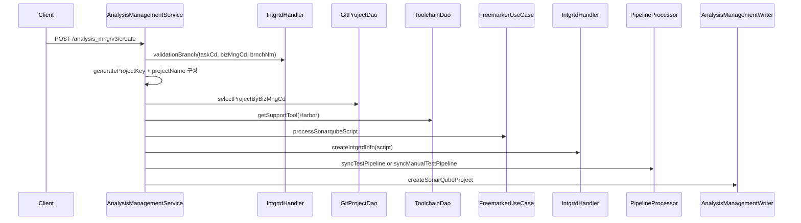

# 305 SonarQube 프로젝트 생명주기와 Jenkins 분석 파이프라인
---
> SonarQube 프로젝트 생성/수정은 TPS 통합관리와 Jenkins 분석 파이프라인을 함께 생성하거나 갱신하는 작업이다. 실제 SonarQube 분석은 Jenkins가 수행하고, TPS는 분석 대상과 실행 이력을 관리한다.

## 조사 기준

> 이 문서는 `/analysis_mng/v3` 관리 API를 기준으로 한다.

주요 API는 `/select_list`, `/select/{bizUnqVl}`, `/create`, `/update`, `/delete_list`, `/manual/execute/{intgrtdMngSn}`이다. `/select/tool/{taskCd}`와 `/select/duplicate/{bizMngCd}/{brnchNm}`는 `@Deprecated`로 표시되어 있으므로 신규 기준 문서에서는 legacy API로만 다룬다.

## 현재 코드에서 실제로 쓰는 흐름

> 생성 흐름은 branch 검증, project key 생성, Jenkins script 생성, 통합관리 생성, Jenkins 테스트 파이프라인 동기화, DB 저장 순서다.

| 유스케이스 | 내부 API | 주요 처리 | Jenkins 파이프라인 |
|---|---|---|---|
| 목록 조회 | `POST /analysis_mng/v3/select_list` | TPS DB의 SonarQube 프로젝트 목록을 pagination으로 조회한다 | 없음 |
| 상세 조회 | `GET /analysis_mng/v3/select/{bizUnqVl}` | project key 기준 상세를 조회한다 | 없음 |
| 생성 | `POST /analysis_mng/v3/create` | branch 검증, env 산정, script 생성, 통합관리 생성, DB 저장을 수행한다 | `SQA` 또는 `ETC` 분석 Job을 생성/갱신한다 |
| 수정 | `POST /analysis_mng/v3/update` | 기존 project를 조회하고 script와 통합관리 정보를 갱신한다 | 기존 분석 Job을 생성/갱신한다 |
| 삭제 | `POST /analysis_mng/v3/delete_list` | lock 여부 확인 후 통합관리, pipeline DB, SonarQube project DB를 삭제 처리한다 | Jenkins Job 삭제는 이 흐름에서 직접 호출하지 않는다 |
| 수동 실행 | `POST /analysis_mng/v3/manual/execute/{intgrtdMngSn}` | 수동 분석 branch 이름을 만들고 분석 Job을 실행한다 | `SEPARATE_ID`를 수동 branch 이름으로 바꿔 실행한다 |

분석 환경은 branch 이름으로 결정된다. `EnvironmentCode.resolveByBranch`가 반환한 환경이 `ETC`이면 수동 분석으로 보아 `syncManualTestPipeline`을 사용하고, 그 외에는 `syncTestPipeline`을 사용한다. `syncTestPipeline`은 통합관리의 motion target code가 SonarQube인 경우 `SQA`로 환경을 바꾼다.

## 유스케이스별 API 조합

> SonarQube 관리 API는 SonarQube 외부 API보다 Jenkins 분석 Job 준비와 TPS 메타데이터 정합성에 더 집중한다.

### 분석 대상 신규 등록

신규 등록은 SonarQube 서버에 project key를 알려 주는 일만이 아니다. TPS 관점에서는 어떤 repository branch를 어떤 Jenkins Job으로 분석하고, 결과를 어떤 project key로 조회할지 등록하는 작업이다.

| 단계 | 내부 API/메서드 | 외부 또는 연계 대상 | 결과 |
|---|---|---|---|
| 1 | `/analysis_mng/v3/create` | Client | 분석 등록 요청을 받는다 |
| 2 | `validationBranch` | 통합관리/branch 정보 | 분석 대상 branch를 검증하고 branch serial을 얻는다 |
| 3 | `processSonarqubeScript` | FreeMarker | Jenkins에서 실행할 SonarQube scanner script를 만든다 |
| 4 | `createIntgrtdInfo` | 통합관리 | script 파일과 연계 정보를 저장한다 |
| 5 | `syncTestPipeline` | Jenkins | SQA 분석 Job을 생성하거나 갱신한다 |
| 6 | `createSonarQubeProject` | TPS DB | project key, pipeline number, integration serial을 저장한다 |

### 분석 대상 수정

수정은 project key를 새로 만들지 않고 기존 `bizUnqVl`을 유지한다. 대신 branch, image path, command, 통합관리 script, Jenkins Job config, TPS project 메타데이터를 함께 갱신한다.

| 단계 | 내부 API/메서드 | 조합 의미 |
|---|---|---|
| 1 | `/analysis_mng/v3/update` | 기존 project 상세를 조회해 감사로그 이전 데이터를 확보한다 |
| 2 | `EnvironmentCode.resolveByBranch` | branch 기준 실행 환경을 다시 계산한다 |
| 3 | `processSonarqubeScript` | 새 command와 image path로 Jenkins script를 재생성한다 |
| 4 | `updateIntgrtdInfo` | 통합관리 script와 branch 정보를 갱신한다 |
| 5 | `syncTestPipeline` 또는 `syncManualTestPipeline` | Jenkins 분석 Job을 최신 script로 갱신한다 |
| 6 | `updateSonarQubeProject` | TPS project 메타데이터를 갱신한다 |

### 분석 대상 삭제

삭제는 SonarQube 서버 project 삭제보다 TPS 연계 삭제에 가깝다. 현재 흐름은 lock을 확인하고 통합관리 정보, pipeline DB, SonarQube project DB를 삭제 처리한다.

| 단계 | 내부 API/메서드 | 현재 의미 |
|---|---|---|
| 1 | `/analysis_mng/v3/delete_list` | 삭제 대상 project key 목록을 받는다 |
| 2 | `selectSonarQubeProjectDetail` | project와 pipeline 연결 정보를 조회한다 |
| 3 | `lockYn` 검사 | ticket 사용 중인 project 삭제를 막는다 |
| 4 | `deleteIntgrtdInfo` | 통합관리 연계 정보를 삭제한다 |
| 5 | `pipelineWriter.deletePipeline` | 분석 Jenkins Job에 대응하는 TPS pipeline row를 삭제한다 |
| 6 | `deleteSonarQubeProject` | TPS SonarQube project row를 삭제 처리한다 |

이 흐름에서는 Jenkins Job 삭제와 SonarQube 외부 project delete 호출이 명확히 중심에 있지 않다. 305P에서는 분석 대상 삭제가 TPS 메타데이터 삭제인지, Jenkins Job 삭제인지, SonarQube 서버 project 삭제까지 포함하는지 정책을 먼저 고정해야 한다.

## 외부 API 사용 방식

> 관리 API 자체는 SonarQube 외부 API보다 Jenkins와 통합관리 연계에 더 많이 의존한다.

| 목적 | 호출 위치 | 외부 API | 비고 |
|---|---|---|---|
| Jenkins 분석 Job 생성/수정 | `PipelineProcessorImpl`, `JenkinsService` | `POST {pipelineStruct}/createItem`, `POST {pipelineStruct}/config.xml` | SonarQube 분석 script를 Jenkins Job으로 반영한다 |
| Jenkins 분석 Job 실행 | `executeSonarqubeProject` | `POST {pipelineStruct}/buildWithParameters` | `SEPARATE_ID`, `HARBOR_IMAGE` 파라미터를 사용한다 |
| Git 프로젝트 조회 | `GitProjectDao` | DB 조회 | repository URL과 business 정보를 얻는다 |
| Harbor 도구 조회 | `ToolchainDao` | DB 조회 | image URL과 image path를 script에 넣는다 |
| SonarQube project create/delete | `SonarQubeFeignClient` | `POST /api/projects/create`, `POST /api/projects/delete` | FeignClient에는 존재하지만 이 관리 서비스의 핵심 생성 흐름에서는 Jenkins/DB 동기화가 중심이다 |

## 개선점

> SonarQube 프로젝트 생명주기는 실제 외부 project와 TPS 메타데이터의 정합성 기준을 명확히 해야 한다.

- FeignClient에는 SonarQube project create/delete가 있지만 관리 서비스 흐름에서 외부 project 생성 호출이 명확히 드러나지 않아, 실제 project 생성 책임이 Jenkins scanner인지 TPS API인지 문서화해야 한다.
- 삭제 시 pipeline DB는 삭제하지만 Jenkins Job 삭제 호출은 직접 보이지 않아 분석 Job 잔존 가능성을 확인해야 한다.
- `ETC` 수동 분석과 `SQA` 티켓 분석의 branch naming 규칙을 UI와 운영 문서에 노출해야 한다.
- project name은 `taskCd_bizNm_brnchInfoSn` 조합이고 project key는 UUID 기반이므로 사람이 읽는 이름과 API key의 관계를 별도 조회 없이 알기 어렵다.
- legacy API는 신규 개발 문서에서 사용 금지로 표시하고, 화면/클라이언트에서 호출 여부를 점검해야 한다.

## 확인한 로컬 코드 위치

> 아래 파일에서 SonarQube 프로젝트 생명주기를 확인했다.

- `AnalysisManagementV3Controller.java`
- `AnalysisManagementService.java`
- `PipelineProcessorImpl.java`
- `FreemarkerService.java`
- `SonarqubeGroovyScript.ftl`
