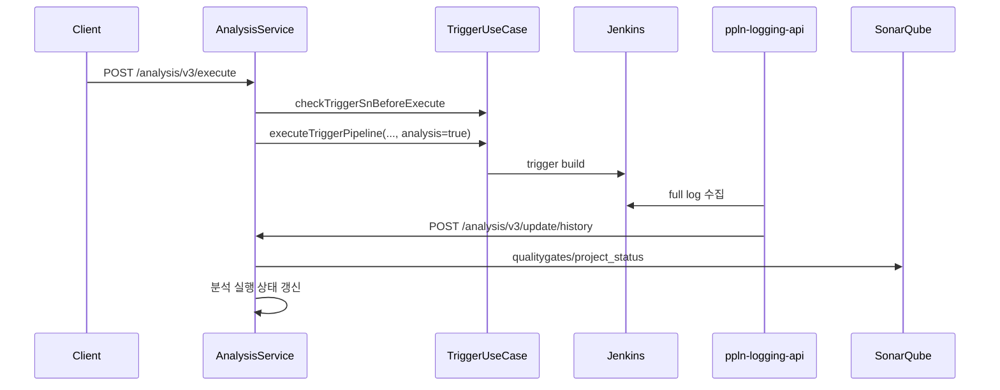
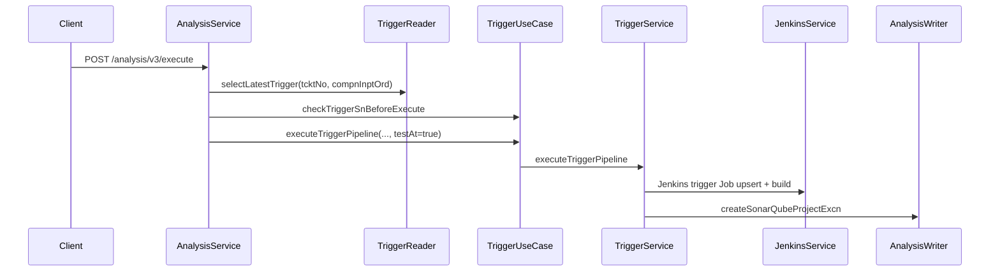
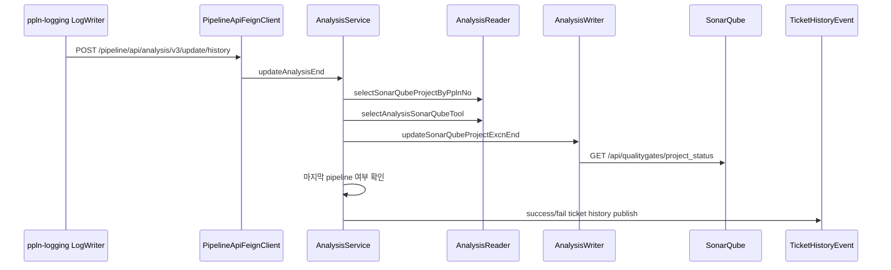

# 305 SonarQube 분석 실행 종료 callback 품질게이트
---
> SonarQube 티켓 분석은 최신 trigger를 기준으로 Jenkins trigger pipeline을 실행하고, 종료는 `ppln-logging-api`가 Jenkins 로그를 수집한 뒤 hidden callback을 호출하면서 반영된다. callback은 SonarQube quality gate를 조회해 TPS 분석 상태를 갱신한다.


## 조사 기준

> 이 문서는 `/analysis/v3`의 실행과 종료 관련 API를 기준으로 한다.

주요 API는 `/execute`, `/select_list/analysis/result`, `/select_list/measure/result`, `/update/history`, `/update/manual/history`이다. `/update/history`와 `/update/manual/history`는 화면용 공개 API라기보다 logging-api callback 경로로 보는 편이 정확하다.


## 현재 코드에서 실제로 쓰는 흐름

> 티켓 분석 실행은 최신 trigger serial을 다시 확인하고 trigger pipeline을 실행한다.



| 유스케이스 | 내부 API | 최신 trigger 기준 | 종료 처리 |
|---|---|---|---|
| 분석 실행 | `POST /analysis/v3/execute` | `selectLatestTrigger` 후 `checkTriggerSnBeforeExecute`로 최신 serial을 보정한다 | Jenkins trigger pipeline 실행으로 위임한다 |
| 분석 결과 목록 | `GET /analysis/v3/select_list/analysis/result` | 최신 trigger의 `jsonData`에서 pipeline 목록을 파싱한다 | 실행 중인 pipeline이 있으면 분석 상태를 진행 중으로 갱신한다 |
| 측정 결과 목록 | `POST /analysis/v3/select_list/measure/result` | 최신 trigger serial로 SonarQube branch를 계산한다 | project별 measure 조회 결과를 모은다 |
| 티켓 분석 종료 | `POST /analysis/v3/update/history` | request의 ticket, component, trigger serial을 사용한다 | quality gate 조회 후 분석 실행 종료 상태를 갱신한다 |
| 수동 분석 종료 | `POST /analysis/v3/update/manual/history` | pipeline number 기준 project를 찾는다 | 수동 branch의 quality gate 기준으로 종료 상태를 갱신한다 |

분석 branch 이름은 ticket 분석에서 `tcktNo-compnInptOrd-trigrSn` 형태로 계산된다. 수동 분석은 `selectSonarQubeBranchNmForCreate`로 생성한 별도 branch 이름을 Jenkins `SEPARATE_ID` 파라미터에 넣어 실행한다.


## 유스케이스별 API 조합

> 분석 실행의 핵심은 Analysis API가 Jenkins를 직접 실행하지 않고 Trigger API로 위임한다는 점이다.

### 티켓 자동화 분석 실행



| 단계 | 내부 API/메서드 | 조합 의미 |
|---|---|---|
| 1 | `/analysis/v3/execute` | 사용자는 분석 실행 API만 호출한다 |
| 2 | `selectLatestTrigger` | ticket/component 기준 최신 trigger serial을 찾는다 |
| 3 | `checkTriggerSnBeforeExecute` | 실행 직전 최신 serial과 WAIT 상태를 검증한다 |
| 4 | `executeTriggerPipeline(..., true)` | Jenkins trigger Job 실행으로 위임한다 |
| 5 | `createSonarQubeProjectExcn` | 분석 실행 row를 생성해 종료 callback을 받을 준비를 한다 |

### logging callback 기반 종료



| 단계 | 내부 API/메서드 | 외부 API | 결과 |
|---|---|---|---|
| 1 | `LogWriterImpl.requestToTestPipelineEnd` | Jenkins log 수집 이후 | `SQA`면 분석 종료 callback을 선택한다 |
| 2 | `/analysis/v3/update/history` | pipeline-api hidden callback | 분석 종료 처리를 시작한다 |
| 3 | `selectSonarQubeProjectByPplnNo` | TPS DB | pipeline number로 project key를 찾는다 |
| 4 | `selectAnalysisSonarQubeTool` | TPS DB | ticket/trigger/project 기준 SonarQube tool id를 찾는다 |
| 5 | `updateSonarQubeProjectExcnEnd` | `GET /api/qualitygates/project_status` | quality gate 결과를 TPS 상태로 반영한다 |
| 6 | `selectLastPipelineYn` | TPS DB | 마지막 분석 pipeline이면 ticket history event를 발행한다 |

### 수동 분석 실행과 종료

수동 분석은 trigger pipeline이 아니라 특정 통합관리 serial의 분석 Job을 직접 실행한다. `executeSonarqubeProject`는 수동 branch 이름을 만들고 Jenkins test pipeline의 `SEPARATE_ID`를 그 branch로 바꿔 실행한다.

```mermaid
flowchart TD
    A[POST /analysis_mng/v3/manual/execute/{intgrtdMngSn}] --> B[selectSonarQubeBranchNmForCreate]
    B --> C[executeJenkinsTestPipeline]
    C --> D[SEPARATE_ID = manual branch]
    D --> E[Jenkins buildWithParameters]
    E --> F[createPipelineExecution EXCN]
    F --> G[createManualSonarQubeProjectExcn]
    G --> H[ppln-logging ETC callback]
    H --> I[POST /analysis/v3/update/manual/history]
```

수동 종료 callback은 ticket/component/trigger 정보보다 `pplnNo`를 중심으로 project를 찾는다. 그래서 수동 분석 결과 조회와 ticket 분석 결과 조회는 branch naming과 상태 갱신 기준이 다르다.


## 외부 API 사용 방식

> 종료 callback 시점에 SonarQube quality gate와 measure API가 중요해진다.

| 목적 | 외부 API | 사용 시점 |
|---|---|---|
| quality gate 조회 | `GET /api/qualitygates/project_status` | 분석 종료 callback에서 성공/실패 판단 |
| component measure 조회 | `GET /api/measures/component` | 분석 결과 상세와 티켓별 measure 조회 |
| component tree 조회 | `GET /api/measures/component_tree` | 파일/컴포넌트 단위 metric 조회 |
| project branch 조회 | `GET /api/project_branches/list` | 화면에서 분석 branch 목록 조회 |

logging-api는 분석 종료를 직접 판단하지 않는다. `SQA` 환경 로그 수집 대상이면 `AnalysisResultVo`를 만들어 pipeline-api의 `/pipeline/api/analysis/v3/update/history`로 보내고, `ETC` 환경이면 `/pipeline/api/analysis/v3/update/manual/history`로 보낸다.


## 개선점

> 분석 종료는 ticket, branch, pipeline 상태가 엮여 있어 실패 원인을 더 잘 남겨야 한다.

- `/update/history`는 `usgSe == "03"`이 아니면 bad request로 처리하므로 호출 주체가 usage type을 잘못 넣으면 종료가 누락된다.
- ticket format을 `-`로 split하는 흐름은 ticket 번호나 business 식별자에 dash가 포함될 때 취약할 수 있다.
- SonarQube FeignException을 일부 조회 흐름에서 로그만 남기고 빈 결과로 반환하므로 화면에서는 "결과 없음"과 "외부 API 실패"가 구분되지 않는다.
- 마지막 pipeline 여부를 기준으로 ticket history event를 발행하므로 일부 pipeline callback 누락 시 자동화 테스트 완료 이력이 늦게 남을 수 있다.
- quality gate 결과와 Jenkins build 결과의 불일치 상황을 별도 상태로 표현할지 검토해야 한다.


## 확인한 로컬 코드 위치

> 아래 파일에서 분석 실행, callback, quality gate 흐름을 확인했다.

- `AnalysisV3Controller.java`
- `AnalysisService.java`
- `AnalysisReaderImpl.java`
- `AnalysisWriterImpl.java`
- `LogWriterImpl.java`
- `PipelineApiFeignClient.java`
