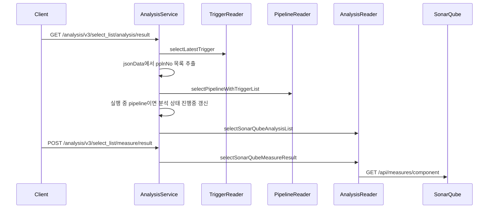
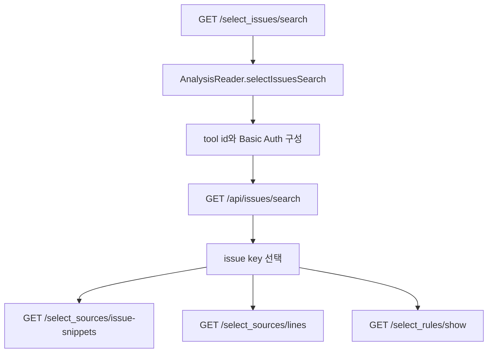

# 305 SonarQube 결과 조회 이슈 관리 API
---
> SonarQube 결과 조회는 TPS가 project key와 branch를 해석한 뒤 SonarQube API를 proxy하는 구조다. 이슈 관리 API는 SonarQube의 type, severity, transition, assignee 변경 API를 그대로 사용한다.

## 조사 기준

> 이 문서는 `/analysis/v3`의 조회와 이슈 관리 API를 기준으로 한다.

주요 API는 `/select_measures/component/{projectKey}/{brnchNm}`, `/select_project_branches/list`, `/select_issues/search`, `/select_sources/issue-snippets`, `/select_sources/lines`, `/select_rules/show`, `/update_issues/*`이다.

## 현재 코드에서 실제로 쓰는 흐름

> 조회 API는 project key만 받지 않고, ticket branch와 tool id를 함께 해석한다.

| 유스케이스 | 내부 API | 외부 API | 비고 |
|---|---|---|---|
| component measure 조회 | `GET /select_measures/component/{projectKey}/{brnchNm}` | `GET /api/measures/component` | branch와 project key로 tool id를 해석한다 |
| project branch 목록 | `GET /select_project_branches/list` | `GET /api/project_branches/list` | project key 기준 branch 목록 |
| issue search | `GET /select_issues/search` | `GET /api/issues/search` | page, facets, side filter, additionalFields 전달 |
| issue snippets | `GET /select_sources/issue-snippets` | `GET /api/sources/issue_snippets` | issue key 기준 snippet |
| source lines | `GET /select_sources/lines` | `GET /api/sources/lines` | component와 line range 기준 |
| rule 상세 | `GET /select_rules/show` | `GET /api/rules/show` | rule key 기준 |
| type 변경 | `POST /update_issues/set_type` | `POST /api/issues/set_type` | SonarQube issue type 변경 |
| severity 변경 | `POST /update_issues/set_severity` | `POST /api/issues/set_severity` | severity 변경 |
| 상태 변경 | `POST /update_issues/set_status` | `POST /api/issues/do_transition` | transition 값 전달 |
| 담당자 변경 | `POST /update_issues/set_assignee` | `POST /api/issues/assign` | assignee 값 전달 |

`selectIssuesSearch`는 page size를 고정값으로 넘기는 구조다. side filter는 `@SpringQueryMap`으로 전달되어 severity, type, status 같은 SonarQube 검색 조건과 결합된다.

## 유스케이스별 API 조합

> 결과 조회와 이슈 관리는 pipeline-api가 SonarQube API를 단순 proxy하기보다 project key, branch, tool id를 해석한 뒤 호출하는 구조다.

### 티켓 화면에서 분석 결과 목록을 볼 때

이 흐름에서 결과 목록 API와 measure API는 분리되어 있다. 목록 API는 TPS DB의 분석 실행 상태를 보여 주고, measure API는 SonarQube 서버에서 metric을 가져온다.

### 이슈 목록과 상세 코드를 볼 때

| 화면 행동 | 내부 API | SonarQube API | 조합 의미 |
|---|---|---|---|
| issue 목록 필터링 | `/select_issues/search` | `/api/issues/search` | branch, facets, side filter를 query로 조합한다 |
| issue snippet 확인 | `/select_sources/issue-snippets` | `/api/sources/issue_snippets` | issue key 기준 문제 코드를 조회한다 |
| source line 확인 | `/select_sources/lines` | `/api/sources/lines` | component와 line range 기준으로 원문을 조회한다 |
| rule 확인 | `/select_rules/show` | `/api/rules/show` | issue rule key로 규칙 설명을 조회한다 |

### 이슈 상태를 변경할 때

이슈 변경 API는 TPS DB 상태를 바꾸는 것이 아니라 SonarQube issue API를 호출한다. 따라서 변경 성공 여부는 SonarQube 권한과 issue 상태 전이 가능 여부에 좌우된다.

| 사용자 행동 | 내부 API | SonarQube API | 실패 가능 원인 |
|---|---|---|---|
| issue type 변경 | `/update_issues/set_type` | `/api/issues/set_type` | 권한 부족, 지원하지 않는 type |
| severity 변경 | `/update_issues/set_severity` | `/api/issues/set_severity` | 권한 부족, severity 값 오류 |
| status transition | `/update_issues/set_status` | `/api/issues/do_transition` | 현재 상태에서 허용되지 않는 transition |
| assignee 변경 | `/update_issues/set_assignee` | `/api/issues/assign` | 사용자 미존재, 권한 부족 |

## 외부 API 목록

> SonarQube API는 Basic Auth와 query parameter 중심으로 호출된다.

| 그룹 | API | 설명 |
|---|---|---|
| project | `GET /api/projects/search` | project key 존재 여부나 project 조회 |
| project | `POST /api/projects/create` | project 생성 API 선언 |
| project | `POST /api/projects/delete` | project 삭제 API 선언 |
| branch | `GET /api/project_branches/list` | project branch 목록 |
| quality | `GET /api/qualitygates/project_status` | quality gate 상태 |
| measures | `GET /api/measures/component` | project/component metric |
| measures | `GET /api/measures/component_tree` | 하위 component metric |
| issues | `GET /api/issues/search` | issue 검색 |
| issues | `POST /api/issues/set_type` | issue type 변경 |
| issues | `POST /api/issues/set_severity` | severity 변경 |
| issues | `POST /api/issues/do_transition` | issue transition |
| issues | `POST /api/issues/assign` | 담당자 변경 |
| sources | `GET /api/sources/issue_snippets` | issue snippet 조회 |
| sources | `GET /api/sources/lines` | source line 조회 |
| rules | `GET /api/rules/show` | rule 상세 조회 |
| components | `GET /api/components/show` | component 상세 조회 |

## 개선점

> SonarQube 조회 API는 외부 API 실패와 빈 결과를 더 명확히 구분해야 한다.

- issue search page size가 고정되어 있어 대량 이슈 프로젝트에서는 pagination 정책을 명확히 해야 한다.
- FeignException을 null 또는 빈 응답으로 바꾸는 흐름은 장애 탐지와 사용자 메시지를 어렵게 만든다.
- metric key 문자열은 공백과 인코딩 영향을 받으므로 상수 관리와 테스트가 필요하다.
- issue update API는 SonarQube 권한 실패가 그대로 사용자 작업 실패가 되므로 권한 진단 메시지를 별도 제공해야 한다.
- project create/delete API가 선언되어 있으나 관리 흐름에서의 실제 호출 책임이 모호하므로 사용 여부를 코드 기준으로 계속 추적해야 한다.

## 확인한 로컬 코드 위치

> 아래 파일에서 결과 조회와 이슈 관리 API를 확인했다.

- `AnalysisV3Controller.java`
- `AnalysisService.java`
- `AnalysisReaderImpl.java`
- `AnalysisWriterImpl.java`
- `SonarQubeFeignClient.java`
- `SonarQubeService.java`
