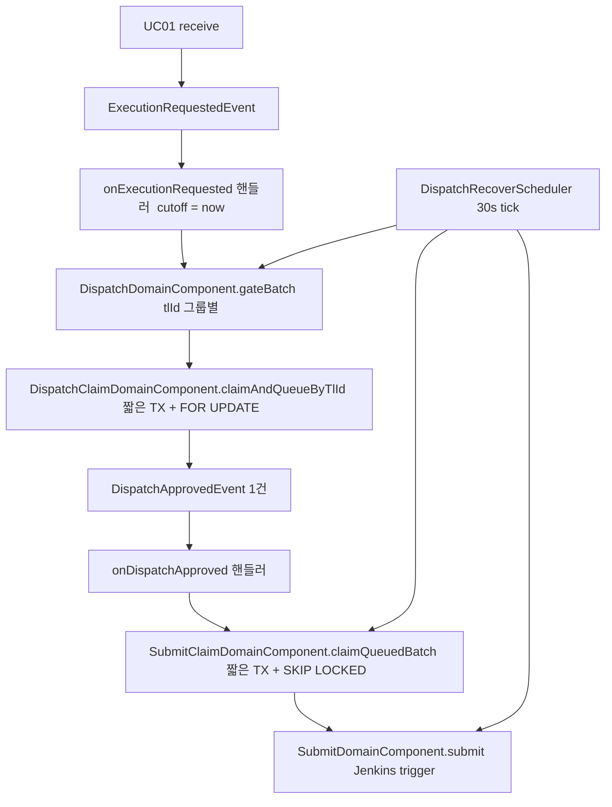

# PENDING에서 SUBMITTING까지 전체 흐름
---
> Executor 의 `PENDING → SUBMITTING` 은 두 단계로 구성된다. 1단계는 디스패치 게이트가 tlId 단위로 큐 quota 를 계산해 `PENDING → QUEUED` 로 끌어올리고, 2단계는 SubmitClaim 이 멀티 인스턴스 환경에서 이중 Jenkins 트리거를 막기 위해 `QUEUED → SUBMITTING` 으로 짧게 선점한다.
> 작성일: 2026-05-04 (2026-05-05 갱신 — 이벤트 핸들러 제거, dispatch/SUBMITTED 스케줄러 5s 단축, QUEUED/SUBMITTING 24h timeout 추가. 본문 시퀀스 다이어그램의 "이벤트 경로 + 스케줄러 30s 보완" 표현은 옛 모델 — 새 모델에서는 `DispatchRecoverScheduler` 5s 단일 진입점이다.)
> 대상: `executor/engine/src/main/java/org/okestro/tps/jenkins/**`


## 1. 왜 두 단계로 나뉘는가

`PENDING → SUBMITTING` 은 한 번에 일어나는 전이가 아니다. 같은 코드 경로라도 두 단계로 쪼개져 있는 이유는 단순하다. Jenkins trigger 는 외부 부작용이 있는 호출이고, 멀티 인스턴스 executor 가 동시에 같은 Job 을 잡으면 같은 빌드를 두 번 트리거하는 사고가 난다. 이를 막으려고 "Jenkins 큐가 더 받을 여지가 있는가를 판단해서 줄을 세운다"(1단계)와 "내가 잡았다고 표시하고 외부를 호출한다"(2단계)를 분리한다.

분리의 결과는 `SUBMITTING` 이라는 중간 상태다. `ExecutionJobStatus.java` 주석은 이 상태를 "executor 가 SKIP LOCKED 로 선점한, 아직 queueId 없는 중간 상태" 로 정의한다. 다른 인스턴스가 같은 row 를 읽지 못하게 막아 두는 표지다.


## 2. 상태 머신

전이 표는 `ExecutionJobStatus.java` 의 `ALLOWED_TRANSITIONS` 에 박혀 있다. 본 문서가 다루는 구간은 다음 두 줄이다.

```
PENDING    → {QUEUED, REJECTED}
QUEUED     → {SUBMITTING, PENDING, REJECTED}
SUBMITTING → {SUBMITTED, QUEUED, PENDING, REJECTED, ABORTED}
```

도메인 객체 `ExecutionJob` 은 단일 진입점 `transitionTo` 를 통해 위 표를 강제한다. `validateTransition` 위반 시 `IllegalStateException` 이 던져지므로 어떤 코드 경로도 표 밖의 전이는 만들 수 없다.

전이를 일으키는 도메인 메서드는 두 개다. `queue()` 는 `PENDING → QUEUED`, `claim()` 은 `QUEUED → SUBMITTING` 이다. 둘 다 부수 데이터(buildNo, queueId)는 만지지 않고 상태만 바꾼다. 데이터 갱신은 다음 단계 `submit(queueId)` 에서 일어난다.


## 3. 두 가지 진입 경로

본 흐름은 정상 경로(이벤트)와 복구 경로(스케줄러) 두 입구를 갖는다. 둘은 다른 상황에서 켜지지만 결국 같은 도메인 컴포넌트로 합쳐진다.



이벤트 경로는 신규 수신 직후 곧장 켜지고, 스케줄러는 정상 경로가 누락한 Job 을 30초 주기로 보완한다. 두 경로 모두 SubmitClaim 단계에서 합류하므로 SKIP LOCKED 가 한 번에 둘 사이의 경합을 해소한다.


## 4. 1단계: PENDING → QUEUED 요약

1단계는 두 컴포넌트로 잘려 있다. `DispatchDomainComponent.gateBatch` 가 외부 I/O 를 포함한 게이트 평가를 비트랜잭션으로 수행하고, `DispatchClaimDomainComponent.claimAndQueueByTlId` 가 짧은 `@Transactional` 안에서 일반 `FOR UPDATE` 로 선점·전이만 담당한다. 책임 분리 덕에 외부 호출이 DB 락을 잡지 않는다.

게이트 정책은 tlId 그룹 단위다. 후보 PENDING 들을 tlId 로 묶고, 각 그룹마다 다음 두 가지를 계산한다. 첫째는 `loadByTlId` 로 가져온 Jenkins 연결정보가 영구 invalid 인지 검사 — invalid 면 그룹 전체를 24시간 timeout 까지 기다리지 않고 즉시 REJECTED 로 종결한다. 둘째는 큐 quota 산출이다.

```
quota = maxQueueSize - max(dbCount, jenkinsQueueSize)
```

`maxQueueSize` 는 `executor.dispatch.max-queue-size` (기본 3) 다. `dbCount` 는 같은 tlId 의 `{QUEUED, SUBMITTING, SUBMITTED}` 카운트, `jenkinsQueueSize` 는 Jenkins `/queue/api/json` 의 items 수다. 둘 중 보수적으로 큰 값을 차감해 다른 url 이 같은 Jenkins 인스턴스를 가리키는 케이스에서도 oversize 를 막는다.

quota 가 0 이하면 그 그룹은 이번 사이클에 보류, 양수면 그만큼만 `claimAndQueueByTlId` 가 짧은 트랜잭션 안에서 일반 `FOR UPDATE` 로 PENDING 후보를 잡고 `job.queue()` 로 전이시킨다.

자세한 조건과 처리 로직은 같은 시리즈 `01-02. PENDING → QUEUED 진입 조건.md` 에서 다룬다.


## 5. 2단계: QUEUED → SUBMITTING 요약

`SubmitClaimDomainComponent.claimQueuedBatch` 가 핵심이다. 이 메서드는 1단계와 달리 `FOR UPDATE SKIP LOCKED` 비관락을 사용한다.

```sql
SELECT * FROM TB_TRB_EC_001
 WHERE EXCN_STTS = :status
 ORDER BY PRIORITY ASC, PRIORITY_DT ASC
 FOR UPDATE SKIP LOCKED
```

이 짧은 `@Transactional` 안에서 SELECT FOR UPDATE → 도메인 전이 `claim()` → `saveWithHistory(SUBMITTING)` 까지 끝낸다. **트랜잭션 안에 Jenkins Feign 호출은 들어가지 않는다.** 락 보유 시간이 짧으므로 다른 인스턴스가 다음 사이클에 곧 자기 몫을 잡을 수 있다.

다른 인스턴스가 이미 잠근 row 는 `SKIP LOCKED` 로 인해 결과에 포함되지 않는다. 그래서 같은 row 가 두 인스턴스에서 동시에 SUBMITTING 으로 가는 사고가 원천적으로 차단된다.

트랜잭션이 커밋되어 락이 풀리면 호출자(이벤트 핸들러 또는 스케줄러)가 트랜잭션 밖에서 `submitBatch` → 실제 Jenkins trigger 로 진행한다. trigger 가 성공하면 `SUBMITTING → SUBMITTED + queueId` 전이로 마무리되고, 실패하면 분류에 따라 retry 혹은 REJECTED 로 흐른다.


## 6. 1·2단계 비관락의 차이

두 단계 모두 짧은 `@Transactional` 안에서 비관락을 사용하지만 모드가 다르다.

| 단계 | 락 종류 | 이유 |
|------|--------|------|
| 1단계 (PENDING → QUEUED) | 일반 `FOR UPDATE` | 우선순위 평가의 진입점이라 보존이 필수. SKIP LOCKED 를 쓰면 다른 인스턴스가 잠근 priority 상위 row 를 건너뛰고 하위부터 처리해 우선순위 역전 발생. quota 정확성도 함께 보존됨 |
| 2단계 (QUEUED → SUBMITTING) | `FOR UPDATE SKIP LOCKED` | 후보가 모두 dispatch 게이트를 이미 통과한 상태라 priority 보존 요구가 약함. SKIP LOCKED 로 인스턴스 간 병렬 처리 |

1단계의 `FOR UPDATE` 는 같은 tlId 의 row 잠금을 인스턴스 간 직렬화시킨다. 다른 tlId 는 `TL_ID = ?` 조건으로 분리되므로 정상적으로는 잠금 충돌이 없고 전체 처리량은 유지된다. 다만 데이터량이 늘면 ORDER BY 정렬을 위한 풀스캔이 발생해 InnoDB next-key lock 이 다른 tlId row 까지 잠시 잠글 수 있다 — 이때는 `(TL_ID, EXCN_STTS)` 보조 인덱스 추가로 해소한다 (운영 모니터링 가이드 참조, 현재 schema.sql 미반영).


## 7. 정상 사이클의 시간 축

코드만 읽으면 한 사이클이 길어 보이지만 실제 진행은 짧다. 요약 시퀀스는 다음과 같다.

```
[T0]  receive(cmd)
       INSERT PENDING + ExecutionRequestedEvent

[T1]  Async UC02 onExecutionRequested
       findByStatusIn(PENDING) — 전체 재로드
       gateBatch(candidates, cutoff = now)
         tlId 그룹화
         for each tlId 그룹
            loadByTlId 검증
              invalid → 그룹 전체 REJECTED 종결
              valid → quota = maxQueueSize - max(dbCount, jenkinsQueueSize)
                       quota > 0 이면
                         claimAndQueueByTlId(tlId, cutoff, quota) [@Tx 짧은 커밋]
                           findPendingByTlIdForUpdate (FOR UPDATE)
                           for limit 만큼
                             job.queue()                  // PENDING → QUEUED
                             saveWithHistory(QUEUED)
                         커밋 후 락 해제
       approved 가 1건 이상이면 DispatchApprovedEvent 1건 발행

[T2]  Async UC03 onDispatchApproved
       claimQueuedBatch [@Tx 시작]
         findByStatusForUpdate(QUEUED)  // SKIP LOCKED, priority 정렬
         for each locked
            상태 == QUEUED 인지 방어 검증
            job.claim()                         // QUEUED → SUBMITTING
            saveWithHistory(SUBMITTING)
       [@Tx 커밋, 락 해제]
       submitBatch(claimed) — 트랜잭션 밖
         per-job Jenkins trigger
           성공 → job.submit(queueId)            // SUBMITTING → SUBMITTED
           실패 → 분류에 따라 retry 또는 REJECTED

[T?]  스케줄러 보완 (30s tick)
       expireTimedOutPending  → 24h 초과 PENDING REJECTED
       dispatchBatch(PENDING aged 10s+, cutoff)
       claimQueuedAgedBatch + submitBatch (QUEUED aged 10s+)
```

`T1` 과 `T2` 사이는 `DispatchApprovedEvent` 한 건이 잇는다. 이벤트는 단지 "지금 평가하라"는 트리거이며, 핸들러는 페이로드의 jobExcnId 를 신뢰하지 않고 DB 에서 해당 상태 전체를 priority 순으로 다시 가져온다. 이 정책 덕분에 같은 사이클에 N 건이 approved 돼도 이벤트 1건만 쏘면 된다.


## 8. 이벤트와 스케줄러가 서로를 막지 않는 이유

같은 PENDING/QUEUED 후보를 두 입구가 동시에 보지만, 이중 Jenkins trigger 가 발생하지 않는다. 이유는 두 경로가 결국 **같은 claim 단계**(`SubmitClaimService`)를 공유하기 때문이다. 핸들러는 `claimQueuedBatch` 를, 스케줄러는 `claimQueuedAgedBatch(cutoff)` 를 호출한다. 둘 다 동일한 `FOR UPDATE SKIP LOCKED` 쿼리를 사용한다.

스케줄러는 `aged` 컷오프(10s 기본)를 적용해 정상 이벤트 핸들러가 먼저 처리할 grace period 를 둔다. 이 컷오프는 시맨틱 보호 장치이지 안전성의 핵심이 아니다. 안전성은 SKIP LOCKED 가 보장한다.

1단계도 이제는 `@Transactional + FOR UPDATE` 로 선점을 직렬화하므로 같은 row 의 동시 디스패치가 차단된다. 다만 락 모드가 SKIP LOCKED 가 아니라 일반 FOR UPDATE 라는 점에서 의미가 다르다 — 다른 인스턴스가 같은 tlId 의 row 를 잠그고 있으면 잠시 대기한 뒤 같은 데이터를 본다(우선순위 보존).


## 9. 한눈에 보는 책임 분담

| 단계 | 클래스 | 트랜잭션 | 외부 호출 | 동시성 메커니즘 |
|------|--------|----------|----------|----------------|
| 1단계 게이트 평가 | `DispatchDomainComponent.gateBatch` | 없음 (비트랜잭션 orchestration) | `loadByTlId` (DB), `getQueueSize` (Jenkins API) | tlId 그룹 격리 + quota 보수적 max |
| 1단계 선점·전이 | `DispatchClaimDomainComponent.claimAndQueueByTlId` | 짧은 `@Transactional` 한 덩어리 | 없음 | `FOR UPDATE` (SKIP LOCKED 아님) — 우선순위 보존 |
| 1↔2 매개 | `DispatchApprovedEvent` 1건 | 없음 | 없음 | N건 approved → 1건만 발행 |
| 2단계 Claim | `SubmitClaimDomainComponent.claimQueuedBatch` | 짧은 `@Transactional` 한 덩어리 | 없음 (Jenkins trigger 는 TX 밖) | `FOR UPDATE SKIP LOCKED` 비관락 + priority 정렬 |
| Trigger | `SubmitDomainComponent.submit` | 없음 | Jenkins Feign | 없음 (이미 2단계에서 선점됨) |

각 단계가 한 가지 책임만 갖도록 잘려 있다. 게이팅과 외부 트리거가 같은 트랜잭션에 섞이지 않는 점, 그리고 1·2단계 비관락이 다른 모드를 갖는 점이 본 설계의 핵심이다.


## 관련 문서
- [01-02. PENDING → QUEUED 진입 조건.md](01-02.%20PENDING%20-%20QUEUED%20진입%20조건.md) — tlId 그룹별 quota 계산과 claim 절차의 세부 조건
- [01-03. PENDING → QUEUED 오류 처리.md](01-03.%20PENDING%20-%20QUEUED%20오류%20처리.md) — tlId invalid 그룹 즉시 REJECTED + 일반 보류·재시도·24h timeout
- [01-04. PENDING → QUEUED 동시성 이슈.md](01-04.%20PENDING%20-%20QUEUED%20동시성%20이슈.md) — `FOR UPDATE` 로 우선순위 보존하는 1단계의 race 와 잠재 위험
- [02-01. SUBMITTING에서 SUBMITTED까지 전체 흐름.md](02-01.%20SUBMITTING에서%20SUBMITTED까지%20전체%20흐름.md) — 후속 2단계의 9단계 흐름
