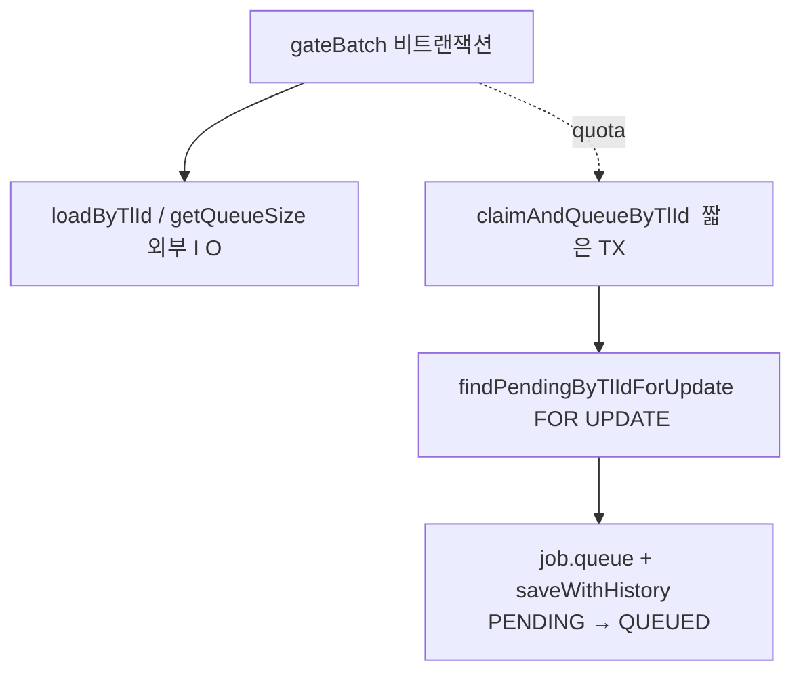
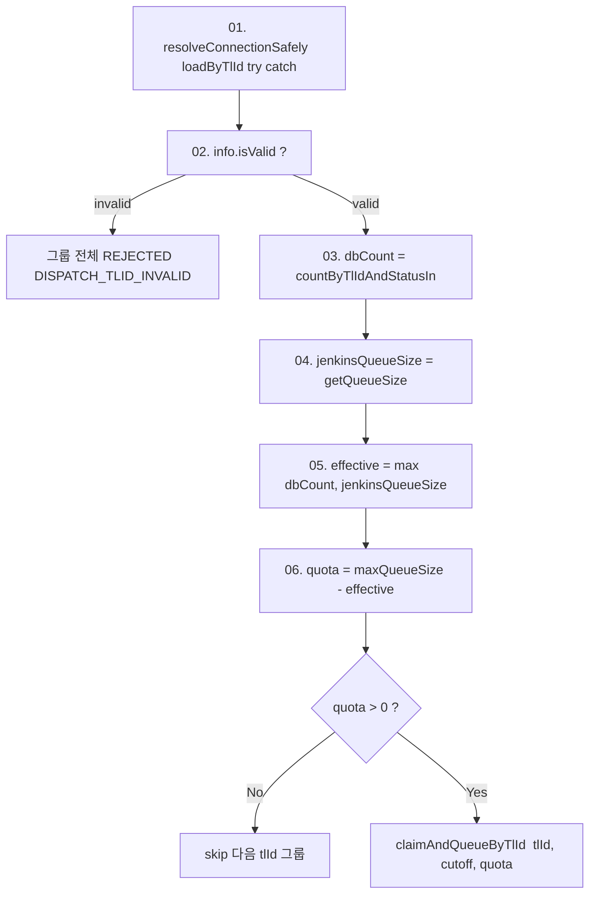

# PENDING → QUEUED 진입 조건
---
> 1단계 디스패치 게이트는 후보 PENDING 들을 tlId 단위로 그룹화한 뒤 그룹별 두 단계 검사를 거친다. 첫째는 Jenkins 연결정보 유효성, 둘째는 큐 quota(maxQueueSize - max(dbCount, jenkinsQueueSize)) 산출. quota 만큼만 짧은 트랜잭션 안에서 일반 FOR UPDATE 로 선점하고 PENDING → QUEUED 로 전이한다.
> 작성일: 2026-05-04 (2026-05-05 갱신 — 이벤트 핸들러 제거, dispatch 스케줄러 5s 단일 진입점. § 1 의 "이벤트 핸들러 → dispatchBatch / 스케줄러 30s 보완" 이중 진입점 표현은 옛 모델이며, 새 모델은 `DispatchRecoverScheduler` 5s tick 만이 단일 진입점이다.)
> 대상: `engine/.../jenkins/domain/component/{DispatchDomainComponent,DispatchClaimDomainComponent}.java`


## 1. 어디에서 시작되는가

게이트는 두 가지 입구로 들어온다. 정상 경로는 `ExecutionEventHandlers.onExecutionRequested` 가 `ExecutionRequestedEvent` 를 받아 `dispatchBatch(candidates, now())` 를 호출하고, 복구 경로는 `DispatchRecoverScheduler` 가 30초 주기로 `mdfcnDt < now - 10s` aged 후보를 가져와 같은 게이트로 흘려보낸다. 두 경로 모두 cutoff 를 함께 넘긴다는 점이 핵심이다 — 그 cutoff 가 `claimAndQueueByTlId` 의 SQL `MDFCN_DT < :cutoff` 조건에 그대로 사용된다.

이벤트 페이로드의 `jobExcnId` 는 신뢰하지 않는다. 핸들러는 항상 `queryPort.findByStatusIn(PENDING)` 으로 PENDING 전체를 다시 로드한다. 즉 이벤트는 "지금 게이트 한 사이클 돌려라"는 트리거일 뿐이고, 후보 선택은 DB 가 priority 순으로 정렬해서 정한다.

이 정책 덕분에 한 사이클에 N 건이 approved 돼도 다음 단계로는 `DispatchApprovedEvent` 한 건만 보내면 된다. 핸들러가 어차피 QUEUED 전체를 재평가하기 때문이다.


## 2. 책임 분리: 평가는 게이트가, 전이는 클레임 컴포넌트가

이전 모델은 한 메서드 안에 외부 I/O 와 도메인 전이가 섞여 있었다. 새 모델은 둘을 분리한다.



`DispatchDomainComponent.gateBatch` 는 트랜잭션 없이 동작한다. tlId 그룹화 → 외부 I/O 호출 → quota 계산까지 하지만 도메인 전이는 직접 일으키지 않는다. quota 가 양수일 때 `DispatchClaimDomainComponent.claimAndQueueByTlId` 를 호출한다.

`DispatchClaimDomainComponent.claimAndQueueByTlId` 는 짧은 `@Transactional` 안에서 SELECT FOR UPDATE → 상태 검증 → 전이 → 저장 → 커밋(락 해제) 순서를 수행한다. 외부 I/O 는 들어가지 않는다.

이 분리가 본 단계의 락 모델을 가능하게 한다. Jenkins API 호출이 트랜잭션 밖에 있으므로 일반 `FOR UPDATE` 를 써도 락 보유 시간이 짧다.


## 3. tlId 그룹화

```java
Map<String, List<ExecutionJob>> byTlId = new LinkedHashMap<>();
for (ExecutionJob job : candidates) {
    if (job.getStatus() != ExecutionJobStatus.PENDING) {
        continue;
    }
    byTlId.computeIfAbsent(job.getTlId(), k -> new ArrayList<>()).add(job);
}
```

후보를 tlId 로 묶는 이유는 두 가지다. 첫째는 외부 I/O 의 단위가 tlId 라는 점이다. `loadByTlId` 와 `getQueueSize(connection)` 은 Jenkins 인스턴스마다 한 번씩만 호출하면 충분하다. 그룹화 덕분에 후보 수가 100건이어도 tlId 가 5개면 외부 호출은 5세트로 끝난다.

둘째는 quota 계산이 tlId 단위라는 점이다. 다른 tlId 는 다른 Jenkins 큐를 가지므로 quota 가 독립이다. 그룹화 안에서 tlId 끼리 quota 를 공유하지 않는다.

순서 보존을 위해 `LinkedHashMap` 을 쓴다. tlId 그룹 처리 순서가 candidates 입력 순서와 일치한다.


## 4. tlId 그룹별 두 단계 검사

각 그룹은 차례로 두 검사를 통과해야 quota 만큼 QUEUED 로 갈 수 있다.



### 4.1 단계 01–02: 연결정보 검증

`resolveConnectionSafely` 는 `loadByTlId` 호출을 try/catch 로 감싼다. 예외가 나면 invalid `JenkinsConnectionInfo(null, null, null)` 을 반환한다. 그 결과를 받은 그룹은 `info.isValid()` 가 false 이므로 즉시 `rejectInvalidGroup` 으로 빠진다.

invalid 의 의미는 영구 결함이다. URL/credential 자체가 비어 있거나 데이터 자체가 깨져 있는 상태다. 일시 다운(5xx, connection refused)은 `loadByTlId` 가 발생시키지 않으므로 invalid 로 판정되지 않는다 — 일시 장애는 `getQueueSize` 단계에서 별도 처리된다.

이 정책의 결과로 영구 invalid 그룹은 24시간 timeout 까지 기다리지 않고 곧장 REJECTED 로 종결한다. `FailReason.DISPATCH_TLID_INVALID` 가 사유 코드로 적재되며, op 는 `commitTerminal` 의 outbox 를 통해 곧바로 FAIL 이벤트를 받는다.

### 4.2 단계 03–06: 큐 quota 산출

quota 식은 다음과 같다.

```
effective = max(dbCount, jenkinsQueueSize)
quota = maxQueueSize - effective
```

`maxQueueSize` 는 `executor.dispatch.max-queue-size` (기본 3) 다. 이 값이 한 Jenkins 큐가 동시에 보유할 수 있는 최대 적재량이다.

`dbCount` 는 같은 tlId 의 `{QUEUED, SUBMITTING, SUBMITTED}` 카운트로 `countByTlIdAndStatusIn` 단일 쿼리로 가져온다. `jenkinsQueueSize` 는 Jenkins `/queue/api/json` 의 items 배열 크기다.

두 값 중 큰 쪽을 effective 로 쓰는 이유는 보수적 차감이다. 다른 url 이 같은 Jenkins 인스턴스를 가리키는 케이스에서는 `dbCount` 가 일부만 반영하므로 oversize 가 발생할 수 있다. Jenkins 가 직접 보고하는 큐 크기를 함께 보면 이 사고를 막는다.

quota 가 0 이하면 그 그룹은 이번 사이클에 보류한다. PENDING 후보들은 status 가 그대로 남고, mdfcnDt 도 갱신되지 않는다.

### 4.3 단계 07: claim 호출

quota 가 양수면 `dispatchClaim.claimAndQueueByTlId(tlId, cutoff, quota)` 가 호출된다. 이 메서드는 짧은 `@Transactional` 안에서 다음을 수행한다.

```java
List<ExecutionJob> locked = queryPort.findPendingByTlIdForUpdate(tlId, cutoff);
int limit = Math.min(quota, locked.size());
for (int i = 0; i < limit; i++) {
    ExecutionJob job = locked.get(i);
    if (job.getStatus() != ExecutionJobStatus.PENDING) {
        continue;       // 방어 검증
    }
    job.queue();
    commandPort.saveWithHistory(job, ExecutionJobStatus.QUEUED, null, 0);
    queued.add(job);
}
```

`findPendingByTlIdForUpdate` 는 `EXCN_STTS = 'PENDING' AND TL_ID = ?` 조건으로 후보를 좁힌 뒤 `MDFCN_DT < :cutoff` 와 priority 정렬을 적용한 SELECT FOR UPDATE 쿼리다. SKIP LOCKED 가 아니다 — 다음 절에서 그 이유를 설명한다. 데이터량이 늘면 다른 tlId 처리 시의 lock contention 을 줄이기 위해 `(TL_ID, EXCN_STTS)` 보조 인덱스 추가가 권장된다 (현재 schema.sql 미반영, 별도 검토 사항).

루프 안에서 quota 만큼만 잘라 처리한다. 다른 인스턴스가 같은 tlId 의 row 를 잠그고 있으면 이 트랜잭션은 잠깐 대기한 뒤 직렬화된 결과를 본다. 직전 인스턴스가 일부를 QUEUED 로 만들었다면 그 row 는 더 이상 PENDING 이 아니므로 방어 검증으로 자연 스킵된다.


## 5. 왜 SKIP LOCKED 가 아니라 일반 FOR UPDATE 인가

`DispatchClaimDomainComponent` javadoc 에 명시된 두 가지 이유가 있다.

첫째는 우선순위 역전 방지다. SKIP LOCKED 를 쓰면 인스턴스 A 가 priority 상위 row 를 잠그고 있을 때 인스턴스 B 가 그 row 를 건너뛰고 priority 하위부터 처리한다. 디스패치 단계는 우선순위 평가의 진입점이라 이 역전이 시스템 전체의 처리 순서를 깨뜨린다.

둘째는 quota 정확성이다. 다중 인스턴스가 동시에 같은 quota 를 보고 각자 자기 몫을 잡으면 quota 합계가 maxQueueSize 를 초과해 큐 oversize 가 발생할 수 있다. 일반 `FOR UPDATE` 는 같은 tlId 의 row 잠금을 인스턴스 간 직렬화하므로 두 번째 인스턴스가 들어왔을 때 첫 번째의 결과를 본 뒤 quota 를 다시 계산한다.

다른 tlId 는 `TL_ID = ?` 조건으로 분리되므로 정상적으로는 락 직렬화가 같은 tlId 안에서만 발생하고, 시스템 전체 처리량은 유지된다. 데이터량이 늘면 ORDER BY 정렬을 위한 풀스캔으로 next-key lock 이 다른 tlId 까지 걸릴 수 있어 `(TL_ID, EXCN_STTS)` 보조 인덱스 추가가 권장된다.

이 락 모드 선택은 백엔드 종류(Galera, Primary-Replica, 단일 인스턴스)에 무관하게 정확히 작동한다. SKIP LOCKED 가 일부 백엔드에서 의미가 다른 점도 부담이 없다.


## 6. 통과 후 도메인 전이

게이트와 claim 을 모두 통과하면 다음 코드가 실행된다.

```java
job.queue();              // PENDING → QUEUED, validateTransition 검증
commandPort.saveWithHistory(
        job
        , ExecutionJobStatus.QUEUED
        , null
        , 0
);
```

`job.queue()` 는 도메인 객체 안에서 상태만 바꾼다. 외부 데이터(buildNo, queueId, retryCnt) 는 손대지 않는다. 그 직후 `saveWithHistory` 가 한 트랜잭션으로 두 가지 쓰기를 묶는다. 하나는 `TB_TRB_EC_001` row 의 status/version 갱신이고, 다른 하나는 history 한 줄 INSERT 다.

어댑터는 `saveAndFlush` 를 쓴다. 이유는 즉시 UPDATE 가 발행돼 `@Version` 이 증가한 결과가 반환되도록 하기 위해서다. 그렇게 받아 온 version 을 `job.applyPersistedVersion(saved.getVersion())` 으로 도메인에 다시 싱크한다. 같은 사이클에서 곧이어 일어나는 `claim()` 호출이 stale version 으로 merge 실패하지 않도록 미리 맞춰 두는 처리다.

이전 모델에 있던 in-memory 카운터(`dispatchPendingByUrl`, `activeJobIds`)는 새 모델에 없다. 사이클 간 정확성은 매 호출마다 `countByTlIdAndStatusIn` 과 `getQueueSize` 를 다시 보는 방식으로 확보된다. 그룹 처리가 순차이므로 한 그룹이 끝난 뒤 다음 그룹은 갱신된 dbCount 를 보지는 못하지만, 그룹별 tlId 가 다르므로 영향이 없다.


## 7. 게이트가 막힌 후보는 어떻게 되는가

게이트의 결과는 세 가지로 갈린다.

| 결과 | 조건 | 후속 |
|------|-----|------|
| QUEUED 전이 | 그룹 valid + quota > 0 + claim 단계에서 실제 row 잠금 | 다음 단계로 전진 |
| 그룹 전체 REJECTED | tlId invalid | 즉시 종결 + outbox FAIL |
| 보류 (PENDING 유지) | quota ≤ 0 또는 claim 시점 race 로 PENDING 아님 | mdfcnDt 미갱신 → 다음 사이클 재평가 |

quota 가 0 이하이면 후보의 status 도 mdfcnDt 도 그대로 남는다. 다음 사이클에 정확히 같은 모습으로 재평가된다. 영구 보류로 가는 케이스를 막기 위한 안전망은 `expireTimedOutPending` 이다. 24시간 동안 PENDING 에 머문 후보는 강제로 REJECTED 로 종결한다. 이 부분은 같은 시리즈 `01-03. PENDING → QUEUED 오류 처리.md` 에서 다룬다.


## 8. 이전 모델과의 비교

새 모델이 무엇을 버리고 무엇을 얻었는지 정리한다.

| 항목 | 이전 모델 | 새 모델 |
|------|----------|---------|
| 슬롯 계산 | `capacity = totalExecutors - busyExecutors` (Jenkins executor pool) | `quota = maxQueueSize - max(dbCount, jenkinsQueueSize)` (큐 적재량 기반) |
| 외부 호출 | `loadByTlId` + `checkHealth` + `getCapacity` | `loadByTlId` + `getQueueSize` (health ping 제거) |
| 게이트 단위 | 후보 한 건 단위 6단계 | tlId 그룹 단위 2단계 |
| 게이트 안 캐시 | `connectionByTlId` / `healthByUrl` / `capacityByUrl` 지역 Map | 그룹화로 자연 캐시 (그룹당 외부 호출 1세트) |
| jobId 중복 차단 | `activeJobIds` Set | 제거됨 (quota 가 oversize 를 막으므로) |
| 비관락 | 없음 (낙관락만) | 짧은 `@Tx` + 일반 `FOR UPDATE` |
| tlId 영구 invalid 처리 | 24h timeout 까지 보류 | 즉시 그룹 REJECTED |
| dispatchBatch 시그니처 | `(candidates)` | `(candidates, cutoff)` |

새 모델은 "Jenkins 가 받을 수 있는 큐 적재량" 이라는 더 구체적인 기준으로 백프레셔를 건다. health ping 제거로 외부 호출이 줄었고, FOR UPDATE 도입으로 우선순위와 quota 정확성이 함께 보존된다.


## 관련 문서
- [01-01. PENDING에서 SUBMITTING까지 전체 흐름.md](01-01.%20PENDING에서%20SUBMITTING까지%20전체%20흐름.md) — 본 게이트의 상위 흐름과 SubmitClaim 단계의 관계
- [01-03. PENDING → QUEUED 오류 처리.md](01-03.%20PENDING%20-%20QUEUED%20오류%20처리.md) — tlId invalid 그룹 즉시 REJECTED + 보류·재시도·24h timeout
- [01-04. PENDING → QUEUED 동시성 이슈.md](01-04.%20PENDING%20-%20QUEUED%20동시성%20이슈.md) — 일반 FOR UPDATE 의 우선순위 보존과 잠재 race
