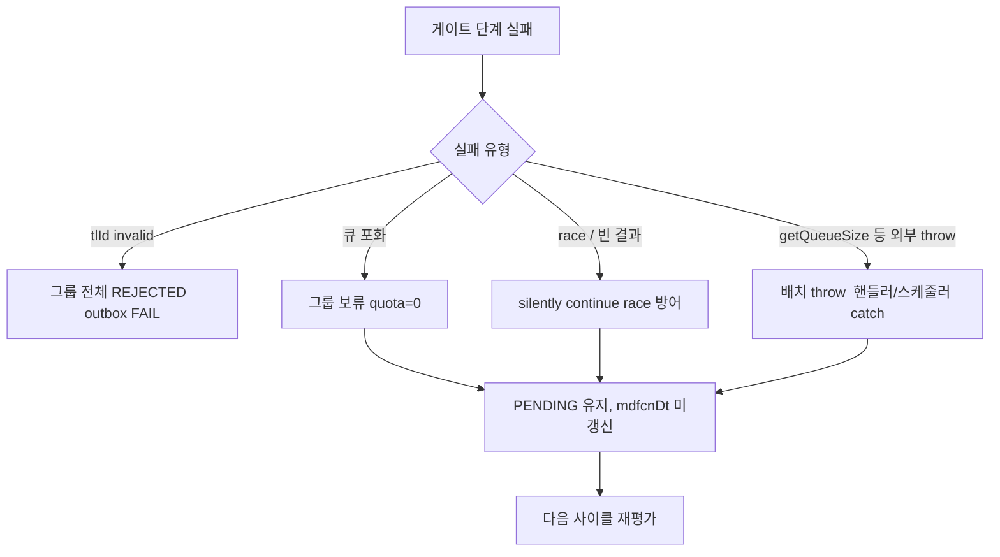

# PENDING → QUEUED 오류 처리
---
> 1단계 디스패치 게이트의 오류 처리는 두 축이다. tlId 영구 invalid 는 24h timeout 까지 기다리지 않고 그룹 전체를 즉시 REJECTED 로 종결하고, 그 외 일시 장애는 보수적으로 PENDING 을 유지해 다음 사이클에서 재평가한다. PENDING 정체는 24시간 timeout 안전망이 마지막 종결을 담당한다.
> 작성일: 2026-05-04 (2026-05-05 갱신 — § 5.1 QUEUED 24h timeout, § 5.2 SUBMITTING 24h timeout, § 5.3 RUNNING/SUBMITTED timeout 절 추가. § 4.1 의 "이벤트 핸들러 경로" 는 옛 모델 — 새 모델에서는 단일 스케줄러로 통합되어 그 절의 race 시나리오는 발생하지 않는다.)
> 대상: `engine/.../jenkins/{application,domain/component,infrastructure/scheduler}/`


## 1. 오류 처리 철학

이 게이트는 외부 의존(Jenkins 연결정보 조회, 큐 크기 조회) 두 종류에 둘러싸여 있다. 둘은 실패의 의미가 다르다. 연결정보 자체의 결함은 데이터 결함이라 시간이 지나도 회복되지 않는다. 반면 일시 다운(5xx, connection refused)이나 일시적 슬롯 부족은 다음 사이클에 회복될 가능성이 있다.

이 차이를 인정해 새 모델은 두 정책을 갖는다. **tlId 영구 invalid 는 즉시 그룹 전체 REJECTED**, **그 외 일시 장애는 PENDING 유지 후 다음 사이클 재평가**, **PENDING 정체는 24h timeout 안전망**.

이전 모델은 "실패는 보류, 다음 사이클에서 재평가" 한 줄로 거의 모든 실패를 묶었다. 새 모델은 영구 결함을 일찍 종결시켜 op 에 빠르게 FAIL 을 통지한다. 24시간을 그냥 기다리는 비용을 줄이는 것이 핵심 동기다.


## 2. tlId 영구 invalid 그룹 즉시 종결

`DispatchDomainComponent.gateBatch` 안에서 그룹별 검사 첫 번째 단계가 이 정책의 무대다.

```java
JenkinsConnectionInfo info = resolveConnectionSafely(tlId);
if (!info.isValid()) {
    rejectInvalidGroup(tlId, groupJobs);
    continue;
}
```

`resolveConnectionSafely` 는 `loadByTlId` 호출을 try/catch 로 감싼다.

```java
private JenkinsConnectionInfo resolveConnectionSafely(String tlId) {
    try {
        return toolInfoPort.loadByTlId(tlId);
    } catch (RuntimeException e) {
        log.warn("[DispatchBatch] loadByTlId failed, treat as invalid: tlId={}, cause={}"
                , tlId, e.getMessage());
        return new JenkinsConnectionInfo(null, null, null);
    }
}
```

예외가 나면 invalid 인스턴스를 반환해 그룹 전체를 invalid 경로로 보낸다. `info.isValid()` 는 url/username/password 가 모두 non-blank 일 때만 true 다.

`rejectInvalidGroup` 은 그룹의 모든 PENDING row 를 REJECTED 로 일괄 종결한다.

```java
private void rejectInvalidGroup(String tlId, List<ExecutionJob> groupJobs) {
    String reason = FailReason.DISPATCH_TLID_INVALID.asReason("tlId=%s", tlId);
    for (ExecutionJob job : groupJobs) {
        if (job.getStatus() != ExecutionJobStatus.PENDING) {
            continue;     // race 방어
        }
        job.reject();
        terminalCommitPort.commitTerminal(
                job
                , ExecutionJobStatus.REJECTED
                , reason
                , job.getRetryCnt()
                , JobResultEventType.FAIL
        );
    }
    log.warn("[DispatchBatch] tlId invalid → REJECTED group: tlId={}, candidates={}, rejected={}"
            , tlId, groupJobs.size(), rejected);
}
```

`commitTerminal` 한 트랜잭션 안에서 row UPDATE + history INSERT + outbox 적재가 함께 일어난다. op 는 outbox 처리 직후 FAIL 이벤트를 받는다.

이 정책의 의미는 "더 시도해도 의미 없는 실패는 빠르게 끝낸다" 다. tlId 자체가 깨진 상태라면 24시간을 기다려도 회복되지 않으므로 즉시 종결하는 편이 op 에 도움이 된다.

### 2.1 invalid 와 일시 다운의 구분

이 정책의 안전성은 "invalid 가 영구 결함만을 의미한다" 는 가정에 달려 있다. `loadByTlId` 가 일시적 DB 장애로 throw 한다면? `resolveConnectionSafely` 가 그 예외를 잡아 invalid 로 처리하므로 일시 장애도 즉시 REJECTED 로 갈 수 있다.

이 위험은 `loadByTlId` 의 정의에 따라 결정된다. 정상 운영에서 일시적 DB 장애는 매우 드물고, 발생하더라도 그 시점에 대규모로 같은 tlId 그룹이 한꺼번에 종결되는 결과가 된다. 운영 모니터링에서 `DISPATCH_TLID_INVALID` 사유 코드의 발생 빈도를 보면 정책의 적합성을 확인할 수 있다.

### 2.2 일시 다운은 invalid 가 아니다

Jenkins 가 5xx 를 던지거나 connection refused 가 나는 일시 다운은 `loadByTlId` 가 발생시키지 않는다. `loadByTlId` 는 DB 에서 연결정보 row 만 가져오는 단순 조회다. Jenkins 자체에 ping 하지 않는다. 그래서 일시 다운은 `info.isValid() == true` 로 판정된다.

일시 다운이 영향을 주는 곳은 다음 단계의 `getQueueSize(connection)` 다. 이 호출이 throw 하면 그룹 처리가 전체 throw 되어 호출자(이벤트 핸들러 또는 스케줄러)의 try/catch 가 잡는다. 자세한 처리는 §4 에서 다룬다.


## 3. 단일 후보 수준의 일반 보류 정책

invalid 가 아닌 그룹은 quota 계산 단계로 넘어간다. 이 단계의 실패는 모두 "PENDING 유지 + 다음 사이클 재평가" 로 흡수된다.

| 실패 종류 | 처리 | 후속 |
|----------|------|-----|
| `getQueueSize` 정상 응답이지만 큐가 가득 참 (`effective ≥ maxQueueSize`) | quota = 0 이라 그룹 보류 | 다음 사이클에 재계산 |
| `claimAndQueueByTlId` 트랜잭션 내 race 검증 (PENDING 아님) | silently continue | 정상 — 다른 인스턴스/스레드가 처리 |
| `findPendingByTlIdForUpdate` 가 빈 결과 (모든 후보가 다른 인스턴스에 처리됨) | 빈 List 반환 | 정상 — 그룹 처리 종료 |

핵심은 모든 실패가 PENDING status 와 mdfcnDt 를 건드리지 않는다는 점이다. 다음 tick 의 `findAgedByStatus(PENDING, cutoff)` 가 같은 후보를 다시 가져올 수 있다.




## 4. 배치 수준의 실패와 격리

게이트나 claim 이 throw 까지 가면 호출자가 처리한다. 이벤트 핸들러와 스케줄러 둘 다 try/catch 로 감싸 `log.error` / `log.warn` 만 남기고 끝낸다.

### 4.1 이벤트 핸들러 경로

```java
@Async(AsyncConfig.EXECUTION_EVENT_EXECUTOR)
@EventListener
public void onExecutionRequested(ExecutionRequestedEvent event) {
    try {
        List<ExecutionJob> candidates = queryPort.findByStatusIn(List.of(PENDING));
        if (candidates.isEmpty()) { ... }
        int approved = dispatchUseCase.dispatchBatch(candidates, java.time.LocalDateTime.now());
        log.debug(...);
    } catch (Exception e) {
        log.error("[EventHandler] dispatch failed: triggerIds={}, msg={}"
                , event.jobExcnIds(), e.getMessage(), e);
    }
}
```

핸들러가 비동기(@Async)라 webhook/UC01 수신 스레드를 점유하지 않는다. 누락된 후보는 30초 안에 스케줄러가 보완한다.

### 4.2 스케줄러 경로

```java
List<ExecutionJob> agedPending = queryPort.findAgedByStatus(PENDING, pendingCutoff);
if (!agedPending.isEmpty()) {
    int approved = 0;
    try {
        approved = dispatchUseCase.dispatchBatch(agedPending, pendingCutoff);
    } catch (Exception e) {
        log.warn("[DispatchRecover] dispatchBatch failed: candidates={}, msg={}"
                , agedPending.size(), e.getMessage());
    }
    log.info(...);
}
```

스케줄러는 단계별로 try/catch 가 분리되어 있어 한 단계의 throw 가 다음 단계를 막지 않는다. `expireTimedOutPending` → `dispatchBatch` → `claimQueuedAgedBatch + submitBatch` 가 순차로 진행된다.

### 4.3 한 그룹의 throw 가 다음 그룹으로 전염

`gateBatch` 의 for 루프 안에는 그룹별 try/catch 가 없다. `getQueueSize` 가 throw 하면 그 시점에 루프 밖으로 던져져 호출자에서 잡힌다. 이미 처리된 앞선 tlId 그룹의 결과(그룹 종결 또는 일부 QUEUED 전이)는 `commitTerminal` / `saveWithHistory` 의 별도 트랜잭션에서 이미 커밋되어 있으므로 데이터 정합성에는 영향이 없다.

처리되지 못한 후속 tlId 그룹은 다음 tick 의 스케줄러가 같은 후보를 다시 가져가 처리한다. 짧은 처리 지연은 발생할 수 있다.


## 5. PENDING 24h timeout 안전망

본 게이트의 보수 정책에는 부작용이 있다. tlId 가 영구 invalid 가 아닌데도 큐가 영원히 차 있거나, Jenkins 가 며칠씩 다운돼 `getQueueSize` 가 계속 실패하면 후보가 PENDING 에 영원히 남는다. 이를 끊기 위한 안전망이 `expireTimedOutPending` 이다.

```java
public int expireTimedOutPending(List<ExecutionJob> candidates, long thresholdMs) {
    int expired = 0;
    for (ExecutionJob job : candidates) {
        if (job.getStatus() != ExecutionJobStatus.PENDING) {
            continue;
        }

        String reason = FailReason.PENDING_TIMEOUT_EXCEEDED.asReason(
                "mdfcnDt=%s, thresholdMs=%d", job.getMdfcnDt(), thresholdMs);
        job.reject();
        terminalCommitPort.commitTerminal(
                job
                , ExecutionJobStatus.REJECTED
                , reason
                , job.getRetryCnt()
                , JobResultEventType.FAIL
        );
        expired++;
    }
    return expired;
}
```

기준은 `mdfcnDt < now - executor.recover.pending.timeout-ms` (기본 24시간) 다. 스케줄러가 일반 aged dispatch 보다 먼저 `expireTimedOutPending` 을 호출하는 이유는 timeout 후보를 미리 REJECTED 로 빼내서 후속 `findAgedByStatus(PENDING)` 결과에서 자연 제외시키기 위해서다.

`commitTerminal` 한 트랜잭션 안에서 row + history + outbox 적재가 원자적으로 묶인다. op 는 `JobResultEventType.FAIL` 이벤트로 종결을 통지받는다.

### 5.1 QUEUED 24h timeout 안전망

QUEUED 도 같은 패턴의 안전망을 갖는다. dispatch 게이트는 통과했지만 SubmitClaim 이 무한 보류되거나 SUBMITTED capacity 가 영구 부족이라 QUEUED 에서 못 빠져나오는 병리 상황을 끊는다.

```java
public int expireTimedOutQueued(List<ExecutionJob> candidates, long thresholdMs) {
    // PENDING 패턴 그대로 — status 만 QUEUED 로, FailReason 은 QUEUED_TIMEOUT_EXCEEDED 로
}
```

기준은 `mdfcnDt < now - executor.recover.queued.timeout-ms` (기본 24시간). PENDING timeout 직후 같은 `DispatchRecoverScheduler` tick 안에서 처리되어 후속 SubmitClaim 결과에서 자연 제외된다. terminal 전이는 `REJECTED` (FAIL) — PENDING timeout 과 동일.

### 5.2 SUBMITTING 24h timeout 안전망

SUBMITTING 은 정상 흐름이라면 ms 단위인데, claim ↔ release 회로(`releaseStaleClaimOrReject`)에서 retry 카운트가 증가하지 않는 코너 케이스가 있으면 영원히 안 끝난다. 이를 끊기 위해 `SubmittingTimeoutDomainComponent.expireTimedOut` 이 별도 컴포넌트로 동작한다.

```java
@Value("${executor.recover.submitting.timeout-ms:86400000}")
private long submittingTimeoutMs;

public int expireTimedOut() {
    LocalDateTime cutoff = now.minus(Duration.ofMillis(submittingTimeoutMs));
    List<ExecutionJob> candidates = queryPort.findAgedByStatus(ExecutionJobStatus.SUBMITTING, cutoff);
    // PENDING 패턴 동일 — REJECTED + FailReason.SUBMITTING_TIMEOUT_EXCEEDED + JobResultEventType.FAIL
}
```

호출 위치는 `ExecutionRecoverScheduler.recoverSubmitting()` 의 첫 줄. retry 회로(`recoverSubmittingAged`) 보다 먼저 호출되어 retry 카운트 무관하게 24h 후보를 즉시 종결한다. 즉 retry maxCount(3) 도달 OR 24h 경과 — 둘 중 먼저 충족하는 쪽으로 끝난다.

### 5.3 RUNNING / SUBMITTED 24h timeout 안전망

RUNNING 은 `RunningRecoveryDomainComponent.isRunningTimedOut` (BGNG_DT 기준), SUBMITTED 는 `SubmittedRecoveryDomainComponent.isSubmittedTimedOut` (MDFCN_DT 기준) 으로 같은 패턴의 안전망을 갖는다. 모든 상태가 24h timeout 에서 자유롭지 않다는 일관성을 유지한다.


## 6. saveWithHistory 트랜잭션 실패

게이트와 claim 을 통과해 `commandPort.saveWithHistory(QUEUED)` 까지 갔는데도 트랜잭션이 실패하는 시나리오가 있다.

### 6.1 낙관락 충돌

claim 은 일반 `FOR UPDATE` 를 사용하므로 같은 row 의 동시 update 가 사실상 직렬화된다. 그래서 1단계 안에서 낙관락 충돌은 거의 발생하지 않는다.

가능한 충돌 시나리오는 사용자 취소(UC06)나 `expireTimedOutPending` 같은 다른 경로가 같은 row 를 만지는 경우다. 본 단계의 트랜잭션이 그 변화를 보지 못한 상태로 UPDATE 를 시도하면 stale `@Version` 으로 롤백된다. 데이터 손실은 없다.

### 6.2 DB 인프라 오류

DB 커넥션 풀 고갈, 네트워크 단절, deadlock 같은 인프라 오류는 `DataAccessException` 계열로 던져진다. 트랜잭션 롤백 → 호출자 try/catch → 로그 → 다음 tick 복구. 같은 그룹의 후속 candidates 처리가 끊기지만 데이터 정합성에는 영향이 없다.


## 7. 이벤트 발행 최소화

`DispatchService.dispatchBatch` 의 마지막 부분이다.

```java
List<String> approvedIds = new ArrayList<>(approved.size());
for (ExecutionJob job : approved) {
    log.info(...);
    approvedIds.add(job.getJobExcnId());
}

eventPublisher.publishDispatchApproved(DispatchApprovedEvent.of(approvedIds));
```

approved 가 비어 있으면 가드(`if (approved.isEmpty()) return 0;`)에서 일찌감치 빠져나가므로 이벤트가 발행되지 않는다. approved 가 N 건이어도 이벤트는 1건이다. 핸들러가 어차피 QUEUED 전체를 priority 정렬로 다시 보기 때문이다.

이벤트 발행 자체가 실패하는 시나리오(예: 메시징 인프라 다운)는 거의 발생하지 않는데, 만약 발생해도 PENDING → QUEUED 전이는 이미 커밋된 상태이므로 데이터 정합성에는 영향이 없다. 다음 단계(SubmitClaim)는 `DispatchRecoverScheduler` 의 QUEUED aged 경로로 자동 보완된다.


## 8. 정리

| 실패 종류 | 처리 위치 | 정책 | 사유 코드 |
|---------|---------|------|----------|
| tlId 영구 invalid | `gateBatch` 내 `rejectInvalidGroup` | 그룹 전체 즉시 REJECTED + outbox FAIL | `DISPATCH_TLID_INVALID` |
| `loadByTlId` 예외 | `resolveConnectionSafely` try/catch | invalid 로 fall-through → 위와 동일 | `DISPATCH_TLID_INVALID` |
| 큐 포화 (quota ≤ 0) | `gateBatch` 내 그룹 보류 | continue + debug → PENDING 유지 | (없음) |
| `getQueueSize` throw | 호출자 try/catch | log.error/warn → 다음 tick 복구 | (없음) |
| claim 시점 race (PENDING 아님) | `claimAndQueueByTlId` 방어 검증 | continue | (없음) |
| 배치 throw (이벤트) | `ExecutionEventHandlers` try/catch | log.error → 스케줄러 회복 | (없음) |
| 배치 throw (스케줄러) | `DispatchRecoverScheduler` 단계별 try/catch | log.warn → 다음 tick 회복 | (없음) |
| PENDING 24h 영구 정체 | `expireTimedOutPending` | REJECTED + outbox FAIL | `PENDING_TIMEOUT_EXCEEDED` |
| `saveWithHistory` 트랜잭션 실패 | 자동 롤백 + throw | PENDING 유지 → 다음 tick 회복 | (없음) |
| 이벤트 발행 0/1 정책 | `DispatchService.dispatchBatch` | N approved → 1건만 발행, 빈 결과면 미발행 | — |

새 모델의 핵심 변화는 **tlId 영구 invalid 를 24시간 기다리지 않고 즉시 종결한다는 점**이다. 그 외의 모든 일시 장애는 여전히 PENDING 유지 + 다음 tick 보완으로 흡수된다.


## 관련 문서
- [01-01. PENDING에서 SUBMITTING까지 전체 흐름.md](01-01.%20PENDING에서%20SUBMITTING까지%20전체%20흐름.md) — 본 오류 처리가 위치한 1단계의 상위 흐름
- [01-02. PENDING → QUEUED 진입 조건.md](01-02.%20PENDING%20-%20QUEUED%20진입%20조건.md) — tlId 그룹별 검사 두 단계의 정확한 정의
- [01-04. PENDING → QUEUED 동시성 이슈.md](01-04.%20PENDING%20-%20QUEUED%20동시성%20이슈.md) — `FOR UPDATE` 하의 race 와 낙관락 충돌이 어디서 발생하는가
