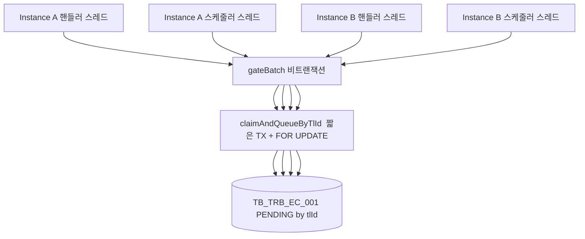
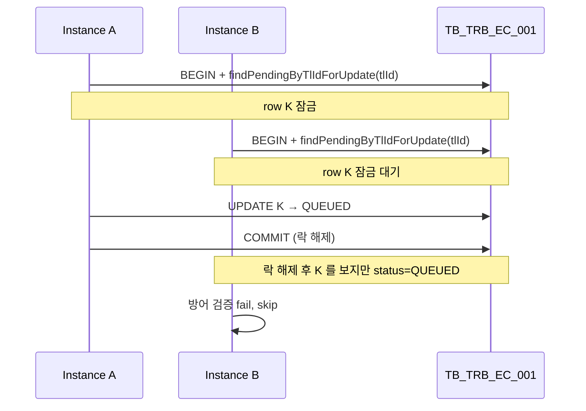

# PENDING → QUEUED 동시성 이슈
---
> 1단계는 짧은 트랜잭션 안에서 일반 `FOR UPDATE` 비관락을 쓴다. SKIP LOCKED 가 아니라 일반 FOR UPDATE 를 쓰는 이유는 우선순위 보존과 quota 정확성이다. 같은 tlId 의 처리는 인스턴스 간 직렬화되고, 다른 tlId 는 `TL_ID = ?` 조건으로 분리되어 병렬 처리된다 (데이터량 증가 시 `(TL_ID, EXCN_STTS)` 보조 인덱스 추가 권장).
> 작성일: 2026-05-04 (2026-05-05 갱신 — 이벤트 핸들러 제거, 진입점 단일화. § 1 의 "Instance A/B 핸들러 + 스케줄러" 4-경로 다이어그램은 옛 모델이며, 새 모델은 인스턴스별 단일 `DispatchRecoverScheduler` 만이 진입점이라 lock contention 분석이 한 단계 단순해진다.)
> 대상: `engine/.../jenkins/domain/component/{DispatchDomainComponent,DispatchClaimDomainComponent}.java`


## 1. 동시성 모델 개요

이 게이트가 직면하는 동시성은 두 축에서 온다. 첫째는 멀티 인스턴스다. executor 는 수평 확장된 환경에서 여러 인스턴스가 동시에 실행될 수 있고, 모두 같은 DB 의 같은 PENDING 후보를 본다. 둘째는 단일 인스턴스 안의 멀티 스레드다. `AsyncConfig` 의 기본 `poolSize=4`, `queueCapacity=100` 으로 한 인스턴스에서도 4개 핸들러 스레드가 동시에 `onExecutionRequested` 를 처리할 수 있다.

본 단계는 이전 모델과 달리 비관락을 쓴다. `DispatchClaimDomainComponent.claimAndQueueByTlId` 가 짧은 `@Transactional` 안에서 일반 `FOR UPDATE` 로 row 를 잠그고 PENDING → QUEUED 전이까지 끝낸다. 락 모드 선택이 본 단계 동시성 모델의 핵심이며, SKIP LOCKED 를 의도적으로 피한 이유가 명시되어 있다.




## 2. 왜 SKIP LOCKED 가 아닌가

`DispatchClaimDomainComponent` javadoc 이 두 가지 이유를 명시한다.

### 2.1 우선순위 역전 방지

SKIP LOCKED 를 쓰면 인스턴스 A 가 priority 상위 row 를 잠그고 있을 때 인스턴스 B 가 그 row 를 건너뛰고 priority 하위부터 처리한다. 시스템 전체로 보면 우선순위가 깨진다.

본 단계는 우선순위 평가의 진입점이다. PENDING 으로 들어온 후보가 처음으로 priority 정렬을 만나는 자리다. 여기서 순서가 깨지면 후속 단계의 어떤 정책도 이를 복구하지 못한다. 그래서 SKIP LOCKED 를 의도적으로 피한다.

대조적으로 2단계의 `SubmitClaimDomainComponent.claimQueuedBatch` 는 SKIP LOCKED 를 쓴다. 이미 dispatch 게이트를 통과한 QUEUED 후보는 priority 보존 요구가 약하다. dispatch 가 quota 안에서만 QUEUED 로 올렸으므로 그 다음의 순서 변화는 영향이 적다.

### 2.2 quota 정확성 보존

SKIP LOCKED 모델에서 다중 인스턴스가 동시에 같은 quota 를 보고 각자 자기 몫을 잡으면 합계가 maxQueueSize 를 초과해 큐 oversize 가 발생한다.

```
시점 t0:  maxQueueSize=10, dbCount=5, quota=5
시점 t1:  Instance A 가 SKIP LOCKED 로 5개 잡음 — A 자기 몫만 봄
시점 t1:  Instance B 도 같은 t0 스냅샷으로 5개 잡음 — A 가 잡은 row 는 SKIP LOCKED 로 건너뜀
시점 t2:  실제로 10개가 QUEUED 로 전이됨 (의도와 일치)
시점 t2:  하지만 dbCount 다음 사이클에 15가 되어 quota 가 -5 가 됨 (이미 oversize)
```

문제는 t1 시점에 두 인스턴스가 같은 quota=5 를 보고 각자 5개씩 처리해 합계 10이 되었지만, 이 quota 의 의미가 "각 인스턴스가 5개씩" 이 아니라 "전체에서 5개" 였다는 점이다. SKIP LOCKED 는 row 단위 격리만 보장하고 quota 합계를 시스템 차원에서 직렬화하지 않는다.

일반 `FOR UPDATE` 는 같은 tlId 의 PENDING row 잠금을 인스턴스 간 직렬화한다. Instance A 가 잠그고 있는 동안 Instance B 는 잠시 대기한 뒤 A 의 결과를 본 갱신된 dbCount 로 quota 를 다시 계산한다. quota 합계가 maxQueueSize 안에 머문다.

### 2.3 다른 tlId 는 병렬

그렇다고 모든 트랜잭션이 직렬화되는 건 아니다. `findPendingByTlIdForUpdate` 는 `TL_ID = ?` 조건으로 그룹을 좁힌다. 다른 tlId 그룹은 서로 다른 row 집합이라 정상적으로는 잠금 충돌이 없고, 시스템 전체 처리량은 tlId 수만큼 병렬로 확보된다. 다만 `(TL_ID, EXCN_STTS)` 보조 인덱스가 없는 현재 스키마에서는 ORDER BY PRIORITY 정렬이 풀스캔으로 처리될 수 있어, InnoDB next-key lock 이 다른 tlId row 에도 잠시 걸릴 수 있다. 데이터량이 늘면 보조 인덱스 추가를 검토한다.

이 모델은 백엔드 종류(Galera, Primary-Replica, 단일 인스턴스)에 무관하게 정확히 작동한다. SKIP LOCKED 가 일부 백엔드에서 의미가 다른 점도 부담이 없다.


## 3. 차단되는 race

본 게이트가 명시적으로 막는 race 부터 정리한다.

| race 시나리오 | 차단 메커니즘 | 위치 |
|--------------|-------------|------|
| 같은 row 의 동시 PENDING → QUEUED 전이 | 짧은 `@Tx` + 일반 `FOR UPDATE` | `claimAndQueueByTlId` |
| 같은 tlId quota 의 동시 초과 사용 | 같은 메커니즘 (락 직렬화로 dbCount 즉시 갱신) | 같은 위치 |
| 같은 jobExcnId 가 신규 receive 동시 발생 | DB unique constraint + `DataIntegrityViolationException` 캐치 | `DispatchService.receive` |
| 우선순위 역전 | 일반 `FOR UPDATE` (SKIP LOCKED 미사용) | 위와 같음 |
| 한 후보 group 의 invalid 종결과 다른 group 의 정상 처리가 같은 사이클 | tlId 그룹 격리 + `commitTerminal` 별도 TX | `gateBatch` 루프 + `rejectInvalidGroup` |

### 3.1 같은 row 의 동시 전이

이전 모델은 비관락 없이 낙관락만으로 막았다. 새 모델은 `FOR UPDATE` 가 락 직렬화를 보장한다. Instance A 가 row K 를 잠그고 있는 동안 B 의 같은 쿼리는 락 대기에 들어가, A 의 트랜잭션이 커밋되어 K 가 QUEUED 로 갱신된 상태를 본다. B 의 루프 안 방어 검증(`status != PENDING` 이면 skip)이 자연스럽게 K 를 건너뛴다.



### 3.2 quota 정확성

§2.2 의 oversize 시나리오가 일반 `FOR UPDATE` 에서는 발생하지 않는다. Instance B 가 락 대기 후 트랜잭션을 시작하면 A 가 이미 일부를 QUEUED 로 만들었으므로, B 의 `findPendingByTlIdForUpdate` 는 그 row 들을 결과에 포함하지 않는다. 다만 quota 자체는 `gateBatch` 단계의 스냅샷이라는 한계가 있다 — §4.2 에서 자세히.

### 3.3 jobId 중복 차단의 상실 (이전 모델 대비)

이전 모델은 in-memory `activeJobIds` Set 으로 같은 jobId 의 다중 jobExcnId 동시 디스패치를 차단했다. 새 모델에서는 이 차단이 제거되었다. quota 가 시스템 전체 oversize 를 막으므로 jobId 단위 차단이 필요 없다는 판단이다.

다만 도메인 의미상 같은 jobId 가 동시에 여러 jobExcnId 로 RUNNING 까지 갈 수 있다면 이전 모델과 동작이 달라진다. 운영에서 같은 jobId 의 동시 다중 jobExcnId 시나리오가 발생하는지 확인 필요. 발생한다면 quota 안에서 모두 dispatch 되어 동시에 실행될 수 있다.


## 4. 남는 잠재 race

### 4.1 gateBatch 와 claimAndQueueByTlId 사이의 시점 race

`gateBatch` 의 quota 계산은 비트랜잭션이다. 그 시점 dbCount 와 jenkinsQueueSize 를 본 뒤, 짧은 트랜잭션의 `claimAndQueueByTlId` 가 시작될 때 다른 인스턴스가 같은 그룹을 이미 처리하고 있을 수 있다.

이 race 의 결과는 두 가지다. 하나는 락 대기 후 정상 직렬화 — Instance B 의 `claimAndQueueByTlId` 가 A 의 트랜잭션 종료를 기다린 뒤 갱신된 dbCount 를 본다. 이 경우 oversize 가 발생하지 않는다.

다른 하나는 quota 가 `gateBatch` 시점의 옛 값이라 직렬화 후에도 어긋난 quota 를 사용하는 경우다.

```
시점 t0:  Instance A gateBatch — quota = 5 계산
시점 t0:  Instance B gateBatch — quota = 5 계산 (같은 dbCount 봄)
시점 t1:  Instance A 가 claimAndQueueByTlId 락 획득 — 5개 처리
시점 t1:  Instance B 가 락 대기
시점 t2:  Instance A 커밋 후 Instance B 락 획득 — 새 dbCount 는 +5 라 maxQueueSize 도달했지만,
          B 의 quota 인자는 여전히 5
```

그래서 B 가 5개를 더 처리하면 oversize 가 발생할 수 있다. 다만 §3.1 의 락 직렬화 덕에 B 의 `findPendingByTlIdForUpdate` 결과가 비어 있을 가능성이 있다 — A 가 후보를 모두 QUEUED 로 만들었으므로.

`findPendingByTlIdForUpdate` 의 SQL 은 `EXCN_STTS = PENDING AND MDFCN_DT < :cutoff` 다. A 가 처리한 row 들은 status 가 QUEUED 가 됐으므로 B 의 결과에서 자연 제외된다. 그래서 실제 oversize 는 발생하지 않는 것으로 보인다.

이 race 의 결론: quota 가 `gateBatch` 스냅샷의 옛 값이어도, claim 단계에서 PENDING 만 가져오는 SQL 조건이 oversize 를 추가로 막는다.

### 4.2 jenkinsQueueSize 와 dbCount 의 시점 차이

`getQueueSize` 와 `countByTlIdAndStatusIn` 은 다른 시점에 호출된다. 그 사이에 다른 인스턴스가 SUBMITTED 로 row 를 만들어 Jenkins 큐에 trigger 했다면 jenkinsQueueSize 는 갱신되지만 dbCount 는 옛 값이다. 또는 그 반대 시점에 호출하면 반대로 어긋난다.

`max(dbCount, jenkinsQueueSize)` 의 보수적 차감이 이 어긋남을 흡수한다. 둘 중 큰 값을 차감하므로 어느 한쪽이 갱신 안 된 시점에도 quota 가 과대 계산되지 않는다.

### 4.3 tlId 그룹 사이의 처리 lag

`gateBatch` 는 tlId 그룹을 순차로 처리한다. 첫 그룹의 외부 호출이 느리면 다음 그룹의 quota 계산도 늦춰진다. 다만 tlId 가 다른 그룹은 서로 영향이 없으므로 처리 결과의 정합성은 유지된다.

### 4.4 핸들러와 스케줄러의 동시 실행

이벤트 핸들러가 한창 처리 중인데 스케줄러 tick 이 같은 PENDING 후보를 가져오는 시나리오다. aged 컷오프(10s 기본) 가 정상 핸들러에 grace period 를 준다. 핸들러가 10s 안에 끝나면 스케줄러는 그 후보를 보지 않는다.

핸들러가 10s 이상 걸리면 둘이 겹친다. 이때는 §3.1 의 락 직렬화가 작동한다. 핸들러의 `claimAndQueueByTlId` 가 락을 잡고 있으면 스케줄러가 대기하고, 풀린 뒤 갱신된 결과를 본다. 데이터는 안전하다.


## 5. 트랜잭션 격리 수준

`@Transactional` 은 격리 수준을 명시하지 않는다. MySQL/MariaDB InnoDB 기본 격리(REPEATABLE_READ)에서 `SELECT ... FOR UPDATE` 는 row lock 을 잡고 다른 트랜잭션의 같은 row 변경을 차단한다.

본 단계의 동시성 안전망은 세 겹이다.

| 계층 | 메커니즘 | 보장 |
|------|--------|------|
| DB row lock | InnoDB FOR UPDATE | 같은 row 의 트랜잭션 간 직렬화 |
| 낙관락 @Version | JPA `@Version` | 다른 경로(UC06 cancel, expireTimedOutPending 등)와의 stale write 거부 |
| 도메인 transitionTo 검증 | `ExecutionJobStatus.validateTransition` | 잘못된 전이 IllegalStateException |

데이터 손실은 이 세 겹에서 막힌다.


## 6. 1단계와 2단계의 비관락 비교

| 항목 | 1단계 (PENDING → QUEUED) | 2단계 (QUEUED → SUBMITTING) |
|------|--------------------------|------------------------------|
| 락 모드 | 일반 `FOR UPDATE` | `FOR UPDATE SKIP LOCKED` |
| 우선순위 보존 요구 | 강함 (평가 진입점) | 약함 (이미 게이트 통과) |
| 인스턴스 간 동작 | 같은 tlId 직렬화 / 다른 tlId 병렬 | 같은 인스턴스가 잡은 row 만 건너뜀, 다른 row 는 동시 처리 |
| quota 정확성 책임 | 본 단계 (락 직렬화로 dbCount 즉시 갱신) | 해당 없음 (이미 quota 안에 들어 있음) |
| 외부 호출 | `loadByTlId`, `getQueueSize` (TX 밖) | 없음 (Jenkins trigger 는 TX 밖, 다음 단계) |

같은 패턴이지만 락 모드 선택이 의도적으로 다르다. 단계의 의미가 다르기 때문이다.


## 7. 정리

### 차단되는 것

- 같은 row 의 동시 전이 — 짧은 `@Tx` + `FOR UPDATE` 직렬화
- 같은 tlId quota 의 oversize — `FOR UPDATE` 가 락 직렬화로 dbCount 즉시 갱신
- 우선순위 역전 — SKIP LOCKED 를 의도적으로 피함
- 같은 jobExcnId 의 신규 receive 중복 — DB unique constraint
- 데이터 손실 — DB row lock + 낙관락 + 도메인 검증의 3겹

### 흡수되는 것

- `gateBatch` 와 `claimAndQueueByTlId` 사이의 시점 race — claim 단계의 PENDING 필터로 자연 흡수
- `jenkinsQueueSize` / `dbCount` 의 시점 차이 — 보수적 max 차감으로 흡수
- 핸들러와 스케줄러 grace period 안 겹침 — aged 컷오프 + 락 직렬화

### 잠재 위험으로 남는 것

- 같은 jobId 의 다중 jobExcnId 동시 디스패치 — 이전 모델의 `activeJobIds` 차단이 제거되어, quota 안에서 모두 dispatch 가능. 운영에서 이 시나리오 발생 여부 확인 필요
- 일반 `FOR UPDATE` 의 락 대기 시간 — 같은 tlId 의 처리량이 인스턴스 수가 늘어도 선형 증가하지 않음. 다른 tlId 가 충분히 분산되어 있어야 효과가 크다. `(TL_ID, EXCN_STTS)` 보조 인덱스가 없으면 ORDER BY 풀스캔으로 다른 tlId row 까지 next-key lock 이 걸려 효과가 줄어들 수 있다 (운영 모니터링 가이드의 인덱스 항목 참조)

본 단계는 **"비관락이지만 SKIP LOCKED 가 아닌"** 모델을 의도적으로 선택했다. 우선순위 진입점에서 순서를 보존하고 quota 정확성을 함께 지키는 것이 핵심이다. 락 직렬화의 비용은 다른 tlId 의 병렬 처리로 상쇄한다.


## 관련 문서
- [01-01. PENDING에서 SUBMITTING까지 전체 흐름.md](01-01.%20PENDING에서%20SUBMITTING까지%20전체%20흐름.md) — 1·2단계 비관락 모델 차이 비교
- [01-02. PENDING → QUEUED 진입 조건.md](01-02.%20PENDING%20-%20QUEUED%20진입%20조건.md) — 락 모드 선택의 무대가 되는 quota 정책
- [01-03. PENDING → QUEUED 오류 처리.md](01-03.%20PENDING%20-%20QUEUED%20오류%20처리.md) — race 가 어떻게 오류 경로로 흡수되는가
- [02-04. SUBMITTING → SUBMITTED 동시성 이슈.md](02-04.%20SUBMITTING%20-%20SUBMITTED%20동시성%20이슈.md) — 2단계의 SKIP LOCKED 모델 비교
