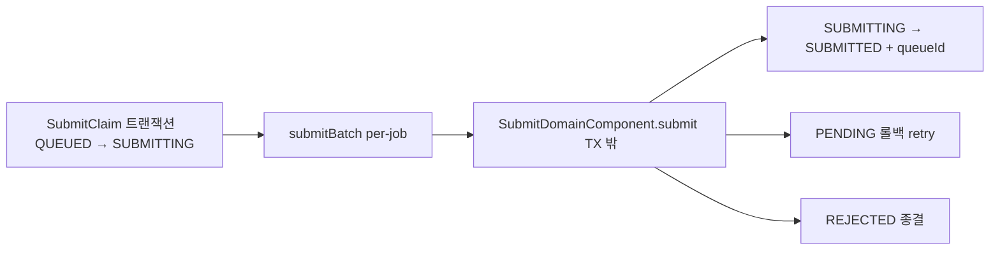
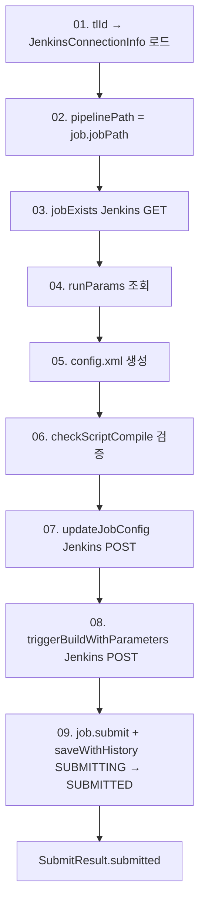
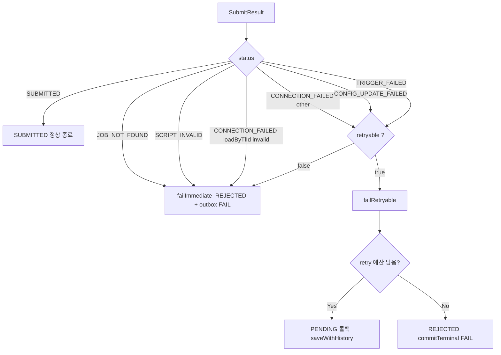

# SUBMITTING에서 SUBMITTED까지 전체 흐름
---
> SubmitClaim 으로 선점된 SUBMITTING Job 은 트랜잭션 바깥에서 9단계의 사전 절차를 거친 뒤 Jenkins 빌드를 트리거하고, 성공하면 `queueId` 를 받아 `SUBMITTING → SUBMITTED` 로 전이한다. 실패는 `failImmediate` 와 `failRetryable` 두 정책으로 분기된다.
> 작성일: 2026-05-03
> 대상: `engine/.../jenkins/domain/component/SubmitDomainComponent.java`


## 1. 본 단계의 위치

본 단계는 `SubmitClaim` 의 출력에서 시작한다. SubmitClaim 은 `FOR UPDATE SKIP LOCKED` 로 한 인스턴스가 row 를 선점해 `QUEUED → SUBMITTING` 까지 전이를 마친 상태로 Job 을 넘긴다. 트랜잭션은 이미 커밋되었고 락은 풀렸다. 이제 외부 부작용(Jenkins API 호출)을 수행할 차례다.

처리는 `SubmitDomainComponent.submit(ExecutionJob job)` 한 메서드에 모여 있다. 호출자는 `DispatchService.submitBatch` 가 한 건씩 순회하며 호출한다. 트랜잭션 어노테이션이 없으므로 Jenkins Feign 호출이 DB 락·커넥션을 점유하지 않는다.




## 2. 입력 계약과 방어 검증

`submitBatch` 는 호출 직전 Job 상태가 `SUBMITTING` 인지 한 번 더 확인한다. 다른 상태가 섞여 들어오면 silently skip 하고 로그만 남긴다.

```java
for (ExecutionJob job : candidates) {
    if (job.getStatus() == ExecutionJobStatus.SUBMITTING) {
        eligible.add(job);
    } else {
        log.debug("[SubmitBatch] Not SUBMITTING, skip: jobExcnId={}, status={}"
                , job.getJobExcnId(), job.getStatus());
    }
}
```

이 가드는 SubmitClaim 과 submit 사이 시간 차이에서 오는 race 를 흡수한다. 예를 들어 사용자 취소(UC06)로 `abortFromSubmitting` 이 SUBMITTING → ABORTED 로 보내 버린 직후라면, 이 단계가 그 변화를 인지하고 실행을 건너뛴다.

호출자가 priority 정렬을 보장한 채 넘기므로 본 단계는 그 순서대로 한 건씩 처리한다.


## 3. doSubmit 9단계

`SubmitDomainComponent.doSubmit` 의 흐름은 9단계로 잘려 있다.



각 단계는 한 가지 책임만 갖는다. 어디서 실패해도 그 단계의 의미가 그대로 결과 분류로 이어진다(상세 매핑은 `02-02 진입 조건.md` 와 `02-03 오류 처리.md` 참조).

전이 자체는 9번에서 일어난다.

```java
job.submit(queueId);             // SUBMITTING → SUBMITTED + queueId 할당
commandPort.saveWithHistory(
        job
        , ExecutionJobStatus.SUBMITTED
        , null
        , 0
);
return SubmitResult.submitted(job);
```

`job.submit(queueId)` 는 도메인 객체 안에서 두 가지를 함께 한다. 하나는 상태 전이 검증(`validateTransition(SUBMITTING, SUBMITTED)`)이고, 다른 하나는 `queueId` 필드 채우기다. queueId 가 0 이하이면 `IllegalArgumentException` 으로 거부된다. 그래서 `triggerBuildWithParameters` 가 0 을 반환한 케이스는 자연스럽게 막힌다.

`saveWithHistory` 는 1단계와 마찬가지로 row UPDATE + history INSERT 를 한 짧은 트랜잭션으로 묶는다.


## 4. 결과 분기: 6가지 SubmitResult.Status

`SubmitResult` 는 record 다. 결과 status 는 enum 6종으로 닫혀 있다.

| Status | 의미 | 분기 정책 |
|--------|------|-----------|
| `SUBMITTED` | Jenkins 트리거 성공 | 정상 종료 |
| `CONNECTION_FAILED` | tlId 연결정보 invalid 또는 jobExists 호출 자체 실패 | retryable 여부에 따라 분기 (loadByTlId invalid 는 즉시 REJECTED) |
| `JOB_NOT_FOUND` | Jenkins 에 해당 파이프라인 경로의 Job 이 없음 (404 정상 응답) | 즉시 REJECTED |
| `SCRIPT_INVALID` | `checkScriptCompile` 결과 invalid | 즉시 REJECTED |
| `CONFIG_UPDATE_FAILED` | `updateJobConfig` 호출 실패 | retryable → PENDING 롤백 / 아니면 REJECTED |
| `TRIGGER_FAILED` | `triggerBuildWithParameters` 호출 실패 | retryable → PENDING 롤백 / 아니면 REJECTED |

분기 정책은 두 가지 사설 메서드로 좁혀진다. `failImmediate` 는 즉시 REJECTED + outbox 발행이며, `failRetryable` 은 `retryOrFail(maxRetryCount)` 로 retryCnt 를 누적시킨 뒤 예산이 남아 있으면 PENDING 롤백, 소진되면 REJECTED 종결한다.



`retryable` 판정은 `JenkinsBuildException.retryable()` 이 한다. HTTP 상태별 서브타입에서 정해지며, 일반적으로 5xx 와 네트워크 오류는 true, 4xx 는 false 다.


## 5. retry 의 의미는 PENDING 롤백

`failRetryable` 의 retry 는 같은 자리에서 다시 호출하는 게 아니다. `retryOrFail(maxRetryCount)` 가 호출된 시점에 `retryCnt++` 로 누적하고, 도메인 행위로 `SUBMITTING → PENDING` 전이를 일으킨다. 그러면 후속 처리가 자연스럽게 바뀐다. 다음 사이클에 1단계 디스패치 게이트가 같은 후보를 다시 평가하고, 통과되면 `PENDING → QUEUED → SUBMITTING` 을 다시 거쳐 본 단계로 복귀한다.

이 모델의 장점은 retry 가 외부 환경의 변화(Jenkins 회복, 스크립트 갱신, 다른 capacity 확보)와 자연스럽게 동기화된다는 점이다. 같은 자리에서 즉시 재시도하면 동일한 실패 원인이 그대로 반복될 가능성이 높지만, PENDING 으로 돌려놓으면 health/capacity 게이트가 재평가되어 정말로 돌릴 수 있을 때 다시 시도한다.

`maxRetryCount` 는 `executor.retry.max-count` 로 기본 3이다. retryCnt 가 3 이상이 되는 순간 retry 는 멈추고 REJECTED 로 종결된다.


## 6. terminal 처리는 commitTerminal 한 곳에서

REJECTED 종결은 항상 `TerminalCommitPort.commitTerminal` 을 통한다. 이 어댑터는 한 트랜잭션 안에서 세 가지를 함께 한다.

1. Job row UPDATE
2. ExecutionHistory INSERT
3. JobResult outbox INSERT (`JobResultEventType.FAIL`)

세 쓰기가 원자적으로 묶이므로 outbox 누락 없이 op 가 결과 이벤트를 받는다. 1단계 게이트의 `expireTimedOutPending` 도 같은 어댑터를 사용한다. 본 시스템에서 "외부에 결과를 통지해야 하는 종결" 은 모두 이 한 곳을 통과한다.

성공 경로(`SUBMITTED`)는 terminal 이 아니므로 outbox 를 만지지 않는다. 빌드가 끝났을 때 발행될 결과 이벤트는 후속 Jenkins FINALIZED 처리 단계가 담당한다.


## 7. 한 사이클의 시간 축

```
[T0]  submitBatch(claimed) — SubmitClaim 트랜잭션 커밋 직후
       per-job 순회 (priority 순)

[T1]  SubmitDomainComponent.submit(job)
       try { doSubmit(job) }
       catch RuntimeException → 분류 불가, failImmediate

[T1.1]  01. loadByTlId
[T1.2]  02. pipelinePath
[T1.3]  03. jobExists  ─── Jenkins GET
[T1.4]  04. findRunParams (DB)
[T1.5]  05. generateScript (DB → config.xml 조립)
[T1.6]  06. validateScript ─── Jenkins POST checkScriptCompile
[T1.7]  07. updateJobConfig ─── Jenkins POST /config.xml
[T1.8]  08. triggerBuildWithParameters ─── Jenkins POST /buildWithParameters
                                            → queueId
[T1.9]  09. job.submit(queueId)              SUBMITTING → SUBMITTED
        saveWithHistory(SUBMITTED) [짧은 @Tx]

[T2]  실패 분기
       failImmediate: job.reject()  + commitTerminal(REJECTED, FAIL)
       failRetryable:
         retryOrFail(3)
           retry → saveWithHistory(PENDING)  + retryCnt 증가
           max  → commitTerminal(REJECTED, FAIL)
```

T1 의 9단계 중 어느 시점에서 throw 가 나도 처리 위치는 명확하다. 분류 가능한 `JenkinsBuildException` 은 단계별 try/catch 가 잡고, 분류 불가능한 `RuntimeException` 은 `submit` 의 가장 바깥 try/catch 가 잡아 즉시 REJECTED 처리한다.


## 8. 책임 분담 요약

| 항목 | 위치 | 역할 |
|------|------|------|
| 단계 게이팅 | `doSubmit` 의 9단계 | 사전 검증 + Jenkins API 호출 + 결과 분류 |
| 분류 불가 fallback | `submit` 의 try/catch | 예상 못 한 RuntimeException → 즉시 REJECTED |
| 즉시 종결 | `failImmediate` | 4xx 류·설정 오류·잡 미존재 등 retry 무의미한 실패 |
| 재시도 | `failRetryable` | 5xx/네트워크 류 — PENDING 롤백 또는 예산 소진 시 REJECTED |
| 도메인 전이 | `ExecutionJob.submit(queueId)` | queueId 검증 + SUBMITTING→SUBMITTED 전이 검증 |
| 원자 커밋 | `commandPort.saveWithHistory` / `terminalCommitPort.commitTerminal` | row + history (+ outbox) 한 트랜잭션 |

본 시리즈의 나머지 세 문서는 위 구조의 세부 측면을 따로 다룬다. `02-02` 는 어떤 조건에서 SUBMITTED 로 갈 수 있는가를 9단계로 풀고, `02-03` 은 6종 결과의 정확한 분기 규칙과 retry 정책을, `02-04` 는 SubmitClaim 이 미리 직렬화한 위에서 본 단계가 보는 동시성 문제를 다룬다.


## 관련 문서
- [01-01. PENDING에서 SUBMITTING까지 전체 흐름.md](01-01.%20PENDING에서%20SUBMITTING까지%20전체%20흐름.md) — 본 단계의 직전 흐름과 SubmitClaim 의 의미
- [02-02. SUBMITTING → SUBMITTED 진입 조건.md](02-02.%20SUBMITTING%20-%20SUBMITTED%20진입%20조건.md) — 9단계 사전 게이트의 정확한 통과 조건
- [02-03. SUBMITTING → SUBMITTED 오류 처리.md](02-03.%20SUBMITTING%20-%20SUBMITTED%20오류%20처리.md) — failImmediate / failRetryable 분기 규칙
- [02-04. SUBMITTING → SUBMITTED 동시성 이슈.md](02-04.%20SUBMITTING%20-%20SUBMITTED%20동시성%20이슈.md) — claim 으로 직렬화된 위에서의 race 분석
