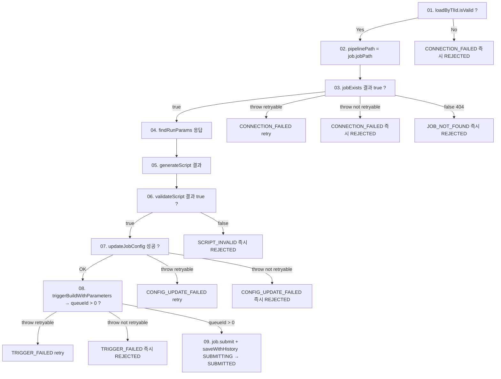

# SUBMITTING → SUBMITTED 진입 조건
---
> SUBMITTED 로 가려면 `doSubmit` 의 9단계를 모두 통과해야 한다. 단계마다 Jenkins API 응답이나 DB 조회 결과로 게이팅하며, 마지막 9번에서 `triggerBuildWithParameters` 가 양수 `queueId` 를 반환하고 도메인 객체의 상태 전이가 검증되어야 비로소 row 가 SUBMITTED 로 커밋된다.
> 작성일: 2026-05-03
> 대상: `engine/.../jenkins/domain/component/SubmitDomainComponent.java`


## 1. 입력 계약

본 단계는 자기 후보를 직접 조회하지 않는다. 입력은 `SubmitClaim` 이 `FOR UPDATE SKIP LOCKED` 로 선점해 SUBMITTING 으로 전이를 마친 Job 한 건이며, `submitBatch` 가 priority 순으로 한 건씩 넘긴다.

진입 직전 `submitBatch` 가 한 번 더 상태를 검사한다.

```java
if (job.getStatus() == ExecutionJobStatus.SUBMITTING) { eligible.add(job); }
else { log.debug(...); }   // skip
```

이 가드는 두 가지 race 를 흡수한다. 하나는 사용자 취소(UC06)가 `abortFromSubmitting` 으로 SUBMITTING → ABORTED 를 만든 직후, 다른 하나는 SUBMITTING aged 복구가 `releaseStaleClaimOrReject` 로 SUBMITTING → QUEUED 또는 → REJECTED 를 만든 직후다. 둘 다 본 단계에서는 silently skip 만 하면 정합성에 영향이 없다.


## 2. 9단계 사전 게이트

각 단계의 통과 조건과 실패 분류는 다음과 같다. 자세한 분기 정책은 `02-03 오류 처리.md` 가 다루며, 본 문서는 통과 조건에 집중한다.



| # | 단계 | 통과 조건 | 호출처 |
|---|------|----------|--------|
| 01 | 연결정보 로드 | `JenkinsConnectionInfo.isValid()` (URL/credential 모두 non-blank) | `ToolInfoPersistencePort.loadByTlId(tlId)` |
| 02 | 파이프라인 경로 결정 | 이미 UC01 RECEIVE 시점에 `lastSegment == jobId` 검증된 값 사용 | `job.getJobPath()` |
| 03 | Job 존재 확인 | `jobExists()` 가 true | `JenkinsQueryPort.jobExists` |
| 04 | 실행 파라미터 조회 | DB 조회 성공 | `RunParamQueryPort.findRunParams(jobExcnId)` |
| 05 | config.xml 조립 | 빈 문자열이 아닌 결과 | `JenkinsScriptPort.generateScript(job)` |
| 06 | 스크립트 검증 | `validateScript()` true (Jenkins `checkScriptCompile`) | `JenkinsScriptPort.validateScript(...)` |
| 07 | config.xml 갱신 | 예외 없이 반환 | `JenkinsCommandPort.updateJobConfig` |
| 08 | 빌드 트리거 | 양수 `queueId` | `JenkinsCommandPort.triggerBuildWithParameters` |
| 09 | 도메인 전이 | `validateTransition(SUBMITTING, SUBMITTED)` + `queueId > 0` | `ExecutionJob.submit(queueId)` |

### 2.1 단계 01 — 연결정보 로드

`tlId` 로 `TB_TRB_TL_001` 에 직접 조회한다. URL/username/password 중 하나라도 비어 있으면 `isValid()` 가 false 가 되어 즉시 REJECTED 종결한다. 본 단계의 invalid 는 실수 가능한 일시 장애가 아니라 데이터 자체의 결함이므로 retry 하지 않는다.

### 2.2 단계 02 — 파이프라인 경로

`pipelinePath` 는 UC01 receive 시점에 이미 `lastSegment(jobPath) == jobId` 인지 검증된 값을 그대로 신뢰한다. 본 단계에서는 추가 검증이 없다. UC01 도메인 invariant 가 본 단계의 입력 신뢰 기반이다.

### 2.3 단계 03 — Job 존재 확인

`jobExists` 는 두 가지 결과가 있다. 정상 응답으로 false 가 오면 "404 — Job 없음" 으로 보고 `JOB_NOT_FOUND` 즉시 REJECTED 다. 호출 자체가 throw 하면 `JenkinsBuildException.retryable()` 로 분기한다. 5xx/네트워크 오류는 retryable, 4xx 는 not retryable 이다.

### 2.4 단계 04 — 실행 파라미터 조회

`runParamQueryPort.findRunParams(jobExcnId)` 가 `TB_TRB_EX_002.RUN_PARAM_DATA` 에서 키-값 맵을 가져온다. 본 단계에서 명시적 게이팅은 없다. 빈 맵도 정상 입력으로 받아 다음 단계로 넘긴다. 결과는 `LinkedHashMap` 으로 감싸 순서를 보존한다.

### 2.5 단계 05 — config.xml 조립

`jenkinsScriptPort.generateScript(job)` 은 `TB_TRB_IJ_002.(JOB_ID, JOB_VSRN)` 에 저장된 완본 config.xml 을 그대로 사용한다. 동적 조립이 아니라 이미 적재된 완본을 가져오므로 본 단계는 사실상 조회다.

### 2.6 단계 06 — 스크립트 검증

Jenkins `checkScriptCompile` 호출로 Groovy 컴파일을 검증한다. invalid 면 `SCRIPT_INVALID` 즉시 REJECTED. retry 해도 같은 결과이므로 한 번에 종결한다.

### 2.7 단계 07 — config.xml 갱신

`updateJobConfig` 는 `POST /{path}/config.xml` 을 호출해 Jenkins Job 설정을 갱신한다. 4xx 는 not retryable, 5xx/네트워크는 retryable 이다.

### 2.8 단계 08 — 빌드 트리거

`triggerBuildWithParameters` 가 `POST /{path}/buildWithParameters` 를 호출하고, 응답의 Location 헤더에서 큐 아이템 ID 를 추출해 반환한다. 파라미터가 비어 있으면 일반 `/build` 로 자동 대체된다.

본 단계의 통과 조건은 두 가지다. 첫째는 호출 자체가 throw 하지 않을 것, 둘째는 반환값이 양수일 것이다. `queueId == 0` 은 "트리거는 됐지만 Location 추출 실패" 같은 경계 케이스이며, 다음 단계 09 의 `job.submit` 검증에서 거부된다.

### 2.9 단계 09 — 도메인 전이

```java
job.submit(queueId);
commandPort.saveWithHistory(job, ExecutionJobStatus.SUBMITTED, null, 0);
```

`ExecutionJob.submit(long queueId)` 안에서 두 가지 검증이 일어난다.

```java
public void submit(long queueId) {
    if (queueId <= 0) {
        throw new IllegalArgumentException("queueId must be positive: " + queueId);
    }
    this.queueId = queueId;
    transitionTo(ExecutionJobStatus.SUBMITTED);
}
```

먼저 queueId 가 양수인지 본다. 그 다음 `transitionTo` 가 `validateTransition(SUBMITTING, SUBMITTED)` 를 강제한다. 둘 중 하나라도 실패하면 `IllegalArgumentException` 또는 `IllegalStateException` 이 던져지고, 이는 `submit` 메서드의 바깥 try/catch 가 잡아 분류 불가 RuntimeException 으로 취급한다.

이 마지막 검증이 본 단계의 진정한 게이트다. Jenkins 호출이 모두 성공해도 도메인 검증이 안 통과하면 SUBMITTED 로 가지 못한다.


## 3. 통과 후 후처리

`saveWithHistory(SUBMITTED, null, 0)` 가 짧은 트랜잭션으로 row UPDATE + history INSERT 를 원자 커밋한다. failReason 은 null 이고 retrySeq 도 0 이다. 성공 경로에서는 retry 카운터를 증가시키지 않는다.

`SubmitResult.submitted(job)` 이 호출자에게 반환되며, `submitBatch` 의 로그가 한 줄 남는다.

```java
log.info("[SubmitBatch] SUBMITTING → SUBMITTED: jobExcnId={}, jobId={}"
        , job.getJobExcnId(), job.getJobId());
```

`submitted++` 로 배치 결과 카운터가 늘어나고, 다음 후보 처리로 넘어간다.


## 4. 통과 못 하면 어떻게 되는가

게이트 실패는 두 정책으로 갈린다.

| 게이트 실패 종류 | 정책 | 후속 결과 |
|---------------|------|----------|
| 데이터 결함 (연결정보 invalid, Job 미존재, script invalid) | `failImmediate` | REJECTED + outbox FAIL |
| 일시 장애 (5xx, 네트워크 등 retryable) | `failRetryable` | retry 예산 남음 → PENDING 롤백 / 소진 → REJECTED + outbox FAIL |
| 영구 4xx 오류 (config 갱신/트리거 호출의 not retryable) | `failImmediate` | REJECTED + outbox FAIL |
| 분류 불가 RuntimeException | `submit` 바깥 catch → `failImmediate` | REJECTED + outbox FAIL |

PENDING 롤백된 후보는 1단계 디스패치 게이트가 다음 사이클에 다시 평가한다. retry 예산은 `executor.retry.max-count` (기본 3) 로 바운드된다. 자세한 분기 규칙은 `02-03 오류 처리.md` 에서 다룬다.


## 5. 9단계가 잘 잘려 있는 이유

이 모듈의 9단계는 단계마다 한 가지 책임만 갖는다. 사전 검증(01~02), 외부 의존(03), 내부 데이터 조립(04~05), 외부 검증(06), 외부 변경(07~08), 도메인 확정(09) 의 흐름이 단방향이다.

이 분리는 두 가지 이득을 준다. 하나는 결과 분류가 단계와 1:1 로 대응되어 SubmitResult.Status 6종이 자연스럽게 도출된다는 점이다. 다른 하나는 retry 와 즉시 종결의 경계가 단계별 의미와 정확히 일치한다는 점이다 — 데이터 결함은 즉시, 일시 장애는 retry, 영구 4xx 도 즉시.

코드 한 메서드가 길어 보이지만 단계 사이의 의존이 단순해 읽기 쉽다. 단계를 별도 클래스로 쪼개지 않은 결정도 타당하다 — 9 단계가 한 줄기 흐름이라 분산하면 데이터 패스가 더 흩어지기 때문이다.


## 관련 문서
- [02-01. SUBMITTING에서 SUBMITTED까지 전체 흐름.md](02-01.%20SUBMITTING에서%20SUBMITTED까지%20전체%20흐름.md) — 본 9단계의 상위 흐름
- [02-03. SUBMITTING → SUBMITTED 오류 처리.md](02-03.%20SUBMITTING%20-%20SUBMITTED%20오류%20처리.md) — 게이트 실패 시 failImmediate/failRetryable 분기 규칙
- [02-04. SUBMITTING → SUBMITTED 동시성 이슈.md](02-04.%20SUBMITTING%20-%20SUBMITTED%20동시성%20이슈.md) — Jenkins 호출 중 race 와 SUBMITTING 고착 처리
