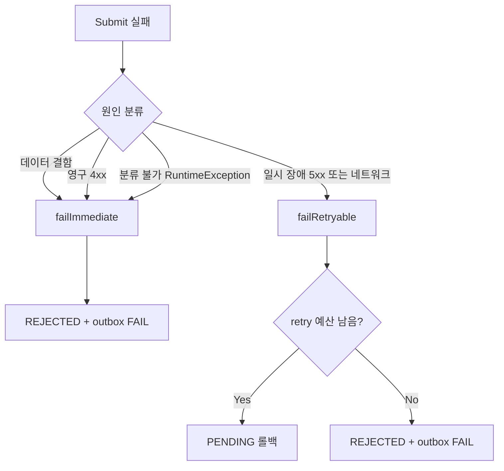

# SUBMITTING → SUBMITTED 오류 처리
---
> 본 단계의 오류는 두 정책으로 좁혀진다. 데이터 결함과 영구 4xx 는 `failImmediate` 가 즉시 REJECTED 로 종결하고, 일시 장애는 `failRetryable` 이 PENDING 으로 롤백해 1단계부터 재시도한다. retry 예산이 소진되면 `failRetryable` 도 REJECTED 로 떨어진다.
> 작성일: 2026-05-03
> 대상: `engine/.../jenkins/domain/component/SubmitDomainComponent.java`


## 1. 두 정책의 본질

본 단계는 외부 의존 호출이 핵심이라 실패가 자주 생긴다. 모든 실패에 같은 처리를 적용하면 두 가지 사고가 난다. 영원히 retry 만 하다가 자원을 낭비하거나, retry 가능한 일시 장애를 영구 실패로 종결해 결과를 잃는다. 본 단계는 이 둘을 가르는 두 정책을 갖는다.

`failImmediate` 는 "다시 해도 같은 결과" 인 실패에 쓴다. 연결정보 결함, Job 미존재, 스크립트 invalid, 영구 4xx 가 여기 속한다. 즉시 REJECTED 로 종결하고 outbox 에 FAIL 이벤트를 적재해 op 에 통지한다.

`failRetryable` 은 "다음에 다시 하면 통과할 수 있는" 실패에 쓴다. 5xx, 네트워크 타임아웃 같은 일시 장애가 여기 속한다. 재시도는 같은 자리에서 즉시 반복하지 않고 PENDING 으로 돌려 1단계 디스패치 게이트부터 다시 거치게 한다. 그래야 health/capacity 게이트가 회복 여부를 평가한 뒤에 다시 시도된다.




## 2. retryable 판정 기준

분기 자체는 `JenkinsBuildException.retryable()` 한 메서드가 정한다. HTTP 상태 코드 기반 서브타입에서 결정되며 일반 규칙은 다음과 같다.

| HTTP 상태 / 원인 | retryable | 정책 |
|----------------|-----------|------|
| 5xx (server error) | true | `failRetryable` |
| 네트워크 / 타임아웃 (Feign 자체 throw) | true | `failRetryable` |
| 4xx (client error) | false | `failImmediate` |
| 3xx, 200-299 (정상) | 해당 없음 | 정상 흐름 |

본 정책 덕분에 retry 시점은 외부 환경 변화에 동기화된다. 5xx 가 5xx 인 동안 PENDING 으로 돌아가 디스패치 게이트의 health 검사에서 다시 막히고, Jenkins 가 회복되면 자연스럽게 통과해 본 단계로 복귀한다.


## 3. failImmediate — 즉시 종결

```java
private SubmitResult failImmediate(ExecutionJob job, SubmitResult result) {
    job.reject();                                 // 현재 상태 → REJECTED
    terminalCommitPort.commitTerminal(
            job
            , ExecutionJobStatus.REJECTED
            , result.message()
            , job.getRetryCnt()
            , JobResultEventType.FAIL
    );

    log.warn("[Submit] Immediate failure: jobExcnId={}, status={}, reason={}"
            , job.getJobExcnId(), result.status(), result.message());
    return result;
}
```

`job.reject()` 는 도메인 행위로 `transitionTo(REJECTED)` 를 호출한다. 전이 표는 SUBMITTING → REJECTED 를 허용하므로 이 시점 SUBMITTING 인 후보는 곧장 REJECTED 로 간다.

`commitTerminal` 은 한 트랜잭션으로 세 가지를 함께 한다.

1. Job row UPDATE (status, version, mdfcnDt)
2. ExecutionHistory INSERT (FAIL 사유 기록)
3. JobResult outbox INSERT (`JobResultEventType.FAIL`)

세 쓰기가 원자적으로 묶이므로 op 가 결과 이벤트를 받는다. 메시징 측에서 outbox 처리만 안정적이면 결과 통지 누락이 없다.

`failImmediate` 가 호출되는 케이스는 다음과 같다.

| 케이스 | 단계 | 분류된 SubmitResult |
|--------|------|---------------------|
| 연결정보 invalid | 01 | `CONNECTION_FAILED` |
| `jobExists` not retryable throw | 03 | `CONNECTION_FAILED` |
| Job 미존재 (정상 false) | 03 | `JOB_NOT_FOUND` |
| 스크립트 invalid | 06 | `SCRIPT_INVALID` |
| `updateJobConfig` not retryable throw | 07 | `CONFIG_UPDATE_FAILED` |
| `triggerBuildWithParameters` not retryable throw | 08 | `TRIGGER_FAILED` |
| 분류 불가 RuntimeException | 어디든 (submit 바깥 catch) | `CONNECTION_FAILED` |

마지막 줄이 중요하다. `submit` 메서드의 가장 바깥 try/catch 가 모든 RuntimeException 을 잡아 `failImmediate` 로 보낸다. 알 수 없는 예외가 SUBMITTING 으로 고착되는 사고를 막기 위한 안전망이다.


## 4. failRetryable — PENDING 롤백 또는 예산 소진

```java
private SubmitResult failRetryable(ExecutionJob job, SubmitResult result) {
    boolean retried = job.retryOrFail(maxRetryCount);

    if (!retried) {
        String failReason = FailReason.MAX_RETRIES_EXCEEDED.asReason(
                "maxRetryCount=%d, cause=%s", maxRetryCount, result.message());
        terminalCommitPort.commitTerminal(
                job
                , ExecutionJobStatus.REJECTED
                , failReason
                , job.getRetryCnt()
                , JobResultEventType.FAIL
        );
        log.warn(...);
    } else {
        commandPort.saveWithHistory(
                job
                , ExecutionJobStatus.PENDING
                , result.message()
                , job.getRetryCnt()
        );
        log.info(...);
    }
    return result;
}
```

`retryOrFail(maxRetryCount)` 의 행동은 다음과 같다.

```java
public boolean retryOrFail(int maxRetryCount) {
    this.retryCnt++;
    if (this.retryCnt >= maxRetryCount) {
        transitionTo(ExecutionJobStatus.REJECTED);
        return false;
    }
    transitionTo(ExecutionJobStatus.PENDING);
    return true;
}
```

retryCnt 를 먼저 증가시킨 뒤 max 도달 여부로 분기한다. true 면 PENDING 으로 전이된 도메인 객체를, false 면 REJECTED 로 전이된 도메인 객체를 반환한다.

retry 가 결정되면 `saveWithHistory(PENDING)` 가 row 갱신과 history 한 줄을 짧은 트랜잭션으로 묶는다. failReason 은 result.message 그대로 적재된다 — 어떤 이유로 retry 됐는지 history 에 남는다.

예산이 소진되면 `commitTerminal(REJECTED, FAIL)` 이 outbox 까지 적재해 op 에 종결을 알린다. failReason 은 `MAX_RETRIES_EXCEEDED` + 원래 cause 가 결합된다.

`failRetryable` 이 호출되는 케이스는 단계 03/07/08 의 retryable throw 다.

| 케이스 | 단계 | 분류된 SubmitResult |
|--------|------|---------------------|
| `jobExists` retryable throw | 03 | `CONNECTION_FAILED` |
| `updateJobConfig` retryable throw | 07 | `CONFIG_UPDATE_FAILED` |
| `triggerBuildWithParameters` retryable throw | 08 | `TRIGGER_FAILED` |


## 5. retry 예산 모델

`maxRetryCount` 는 `executor.retry.max-count` 이며 기본 3 이다. 첫 실패에 retryCnt 가 0 → 1 이 되며, 1 < 3 이라 PENDING 롤백 되고 다음 사이클부터 다시 1단계를 거친다. 두 번째 실패에 1 → 2, 마찬가지로 PENDING. 세 번째 실패에 2 → 3, 3 >= 3 이라 REJECTED 종결.

흥미로운 점은 retryCnt 는 본 단계의 `failRetryable` 에서만 증가한다는 사실이다. 1단계 게이트의 일시 장애(health unavailable, capacity 부족) 는 retryCnt 를 건드리지 않는다. retryCnt 는 "Jenkins 트리거 시도 횟수" 만 추적한다. 이 정의가 명확해서 운영에서 "이 후보가 몇 번 트리거를 시도했는가" 가 그대로 retryCnt 값과 일치한다.

retryCnt 누적의 부수 효과는 SUBMITTING aged 복구의 `releaseStaleClaimOrReject` 와 예산을 공유한다는 점이다. claim 후 trigger 호출이 반복 실패해 SUBMITTING 으로 고착될 때도 같은 `maxRetryCount` 를 쓴다. 그래서 시스템 전체의 시도 횟수가 단일 예산으로 바운드된다.


## 6. SubmitResult.Status 6종과 정책의 매핑

| Status | 발생 단계 | 기본 정책 | 분기 조건 | failReason 코드 |
|--------|----------|---------|----------|----------------|
| `SUBMITTED` | 09 | 정상 종료 | — | (없음) |
| `CONNECTION_FAILED` | 01 (loadByTlId invalid) | `failImmediate` | 항상 | `JENKINS_CONNECTION_INVALID` |
| `CONNECTION_FAILED` | 03 (jobExists throw) | `failImmediate` 또는 `failRetryable` | `e.retryable()` 분기 | `JENKINS_CONNECTION_INVALID` |
| `JOB_NOT_FOUND` | 03 (jobExists false) | `failImmediate` | 항상 | `JENKINS_JOB_NOT_FOUND` |
| `SCRIPT_INVALID` | 06 | `failImmediate` | 항상 | `SCRIPT_VALIDATION_FAILED` |
| `CONFIG_UPDATE_FAILED` | 07 | `failImmediate` 또는 `failRetryable` | `e.retryable()` 분기 | `CONFIG_UPDATE_FAILED` |
| `TRIGGER_FAILED` | 08 | `failImmediate` 또는 `failRetryable` | `e.retryable()` 분기 | `BUILD_TRIGGER_FAILED` |
| (RuntimeException 분류 불가) | 어느 단계든 | `failImmediate` (submit 바깥 catch) | 항상 | `JENKINS_CONNECTION_INVALID` (unexpected detail) |

retry 예산이 소진되어 REJECTED 로 가는 경우의 failReason 은 `MAX_RETRIES_EXCEEDED` 가 cause 와 함께 적재된다. 운영에서 사유 코드만 봐도 "trigger 가 3번 실패해서 종결" 같은 분류가 명확히 드러난다.


## 7. 배치 수준의 격리

`submitBatch` 의 for 루프는 한 후보의 실패가 다음 후보로 전염되지 않게 자체 격리된다. `submitDomainComponent.submit(job)` 자체가 모든 RuntimeException 을 안에서 잡아 `failImmediate` 로 종결하고 SubmitResult 를 반환한다. 호출자는 결과 status 만 보고 카운팅한다.

```java
for (ExecutionJob job : eligible) {
    SubmitResult result = submitDomainComponent.submit(job);
    switch (result.status()) {
        case SUBMITTED -> { log.info(...); submitted++; }
        case CONNECTION_FAILED, JOB_NOT_FOUND, SCRIPT_INVALID ->
                log.warn("[SubmitBatch] Permanent failure (→ REJECTED): ...");
        case CONFIG_UPDATE_FAILED, TRIGGER_FAILED ->
                log.warn("[SubmitBatch] Transient failure (retry {}/max): ...");
    }
}
```

스택 그대로 위로 throw 되는 일이 없으므로 `submitBatch` 는 항상 끝까지 돈다. 한 후보의 Jenkins 호출이 1초 걸려도 다른 후보가 같이 멈추지 않는다.

다만 직렬 실행이라 Jenkins 가 느려질수록 한 사이클 시간이 늘어난다. 본 모듈은 동시 트리거를 의도적으로 하지 않는다. SubmitClaim 의 짧은 트랜잭션으로 row 를 잡아 두었으므로 다른 인스턴스가 끼어들 일이 없고, 한 인스턴스 안에서 같은 Jenkins 에 동시 트리거를 던지면 Jenkins 측 부하가 커진다.


## 8. 정리

| 항목 | 정책 |
|------|------|
| 데이터 결함 (연결 invalid, Job 미존재, 스크립트 invalid) | `failImmediate` → 즉시 REJECTED + outbox FAIL |
| 영구 4xx | `failImmediate` → 즉시 REJECTED + outbox FAIL |
| 일시 5xx / 네트워크 | `failRetryable` → PENDING 롤백 (예산 소진 시 REJECTED) |
| 분류 불가 RuntimeException | `failImmediate` (submit 바깥 catch) |
| retry 예산 | `executor.retry.max-count` 기본 3, retryCnt 누적 |
| terminal 통지 | `commitTerminal` 한 곳에서 row + history + outbox 원자 커밋 |
| 배치 격리 | `submit` 안에서 모든 예외 흡수 → 다음 후보 처리 보장 |

본 단계의 오류 처리는 명확한 두 갈래(`failImmediate` / `failRetryable`)로 좁혀져 있고, 분기 기준은 `JenkinsBuildException.retryable()` 한 곳에서 결정된다. 이 단순함이 운영에서 사고 분류를 빠르게 만든다.


## 관련 문서
- [02-01. SUBMITTING에서 SUBMITTED까지 전체 흐름.md](02-01.%20SUBMITTING에서%20SUBMITTED까지%20전체%20흐름.md) — 본 정책이 위치한 9단계의 전체 흐름
- [02-02. SUBMITTING → SUBMITTED 진입 조건.md](02-02.%20SUBMITTING%20-%20SUBMITTED%20진입%20조건.md) — 어떤 단계에서 어떤 조건으로 막히는가
- [02-04. SUBMITTING → SUBMITTED 동시성 이슈.md](02-04.%20SUBMITTING%20-%20SUBMITTED%20동시성%20이슈.md) — retry 예산을 공유하는 SUBMITTING aged 복구 경로
