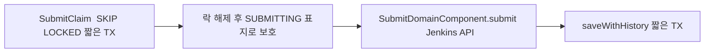
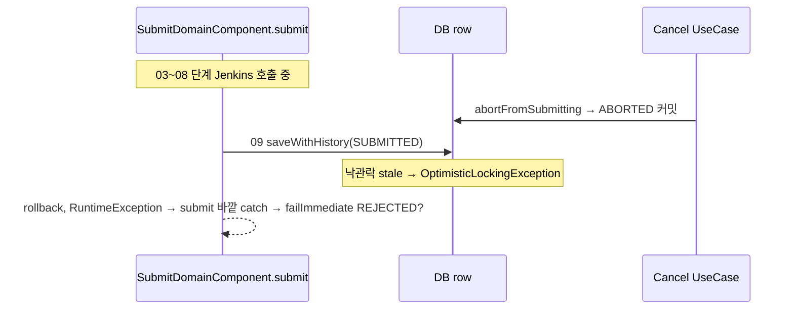

# SUBMITTING → SUBMITTED 동시성 이슈
---
> 본 단계의 동시성은 `SubmitClaim` 이 SKIP LOCKED 로 직렬화한 결과 위에 서 있다. 같은 row 가 두 인스턴스에서 동시에 Jenkins 로 트리거될 가능성은 원천적으로 차단되어 있고, 남는 잠재 race 는 SUBMITTING 고착(JVM crash) 과 사용자 취소·복구 스케줄러와의 시점 race 다.
> 작성일: 2026-05-03
> 대상: `engine/.../jenkins/{domain/component,application,infrastructure/scheduler}/`


## 1. 동시성의 출발선

본 단계는 직접 후보를 조회하지 않고 SubmitClaim 의 출력만 받는다. SubmitClaim 은 `FOR UPDATE SKIP LOCKED` 짧은 트랜잭션 안에서 `QUEUED → SUBMITTING` 전이까지 끝낸 채 row 를 넘긴다. 이 시점 row 의 status 는 이미 SUBMITTING 이고, 다른 인스턴스가 같은 row 를 본다면 1단계 게이트의 `existsByJobIdAndStatusIn(ACTIVE_STATUSES)` 또는 SubmitClaim 의 `findByStatusForUpdate(QUEUED)` 둘 중 하나에서 자연스럽게 제외된다.

즉 본 단계가 받는 입력은 **"이 row 에 대해 이 인스턴스가 유일한 처리자"** 임이 보장된 상태다. 그래서 본 단계 자체에는 추가적인 비관락이 없다. Jenkins API 호출은 트랜잭션 바깥에서 자유롭게 수행된다.



본 모델의 약점은 SUBMITTING 표지에 의존한다는 점이다. row 가 SUBMITTING 인 한 다른 인스턴스가 끼어들지 못하지만, 인스턴스가 호출 중간에 죽으면 row 가 SUBMITTING 으로 무한 고착될 수 있다. 이를 풀어 주는 별도 복구 경로가 필요하다.


## 2. 차단되는 race

### 2.1 멀티 인스턴스의 동일 row 동시 트리거

이 사고는 본 시스템의 가장 큰 공포 시나리오다. 같은 jobExcnId 에 대해 두 인스턴스가 동시에 Jenkins 빌드를 트리거하면 같은 빌드가 두 번 돌고 결과 이벤트도 두 번 들어온다.

본 모델에서 이 사고가 일어나려면 두 인스턴스가 동시에 같은 row 에 대해 SubmitClaim 단계를 통과해야 하는데, `FOR UPDATE SKIP LOCKED` 가 이를 막는다. 한 쪽만 row 를 잡고 SUBMITTING 으로 전이시킨다. 다른 쪽은 같은 쿼리에서 row 가 결과에 없으므로 처리 대상에서 빠진다.

본 단계 안에서는 추가 동시성 처리가 필요 없다. SUBMITTING 인 row 를 다른 인스턴스가 보더라도 1단계 게이트의 jobId 중복 차단(`activeJobIds`)에 잡혀 더 이상 관여하지 못한다.

### 2.2 같은 인스턴스의 멀티 스레드 동시 처리

`AsyncConfig` 의 `EXECUTION_EVENT_EXECUTOR` 는 기본 4 스레드다. 이론적으로 한 인스턴스 안에서도 4개의 핸들러 스레드가 동시에 `onDispatchApproved` 를 처리할 수 있다. 그러나 SubmitClaim 의 `findByStatusForUpdate(QUEUED)` 쿼리 자체가 한 트랜잭션 안에서 직렬화되므로, 같은 row 를 두 스레드가 동시에 잡을 수는 없다.

스레드 A 가 row K 를 SUBMITTING 으로 전이시킨 직후 트랜잭션을 커밋하면, 스레드 B 가 같은 쿼리를 실행해도 K 는 status=SUBMITTING 이라 결과에서 제외된다. SKIP LOCKED 가 멀티 스레드에서도 같은 의미로 작동한다.

### 2.3 낙관락 충돌은 거의 발생하지 않는다

본 단계에서 `saveWithHistory(SUBMITTED)` 또는 `saveWithHistory(PENDING)` 가 호출될 때 row 의 `@Version` 은 이미 SubmitClaim 시점에 +1 되어 도메인 객체에 동기화돼 있다. 다른 인스턴스가 같은 row 를 동시에 update 하지 않으므로 충돌은 사실상 없다.

예외는 사용자 취소(UC06)나 SUBMITTING aged 복구가 같은 row 를 동시에 만지는 경계 케이스 정도다(§3 참조). 충돌이 나도 도메인 객체는 stale 한 쪽이 롤백되며 데이터 손실은 없다.


## 3. 남는 잠재 race

### 3.1 JVM crash 로 인한 SUBMITTING 고착

가장 현실적인 위험이다. SubmitClaim 이 row 를 SUBMITTING 으로 만들어 둔 직후 인스턴스가 죽으면 row 는 SUBMITTING 인 채 영영 남는다. SKIP LOCKED 는 락이 풀려 있으므로 다른 인스턴스가 다시 잡지 못하고(잡을 대상이 QUEUED 이므로), 1단계 게이트도 SUBMITTING 을 ACTIVE 로 인식해 같은 jobId 의 신규 후보를 막는다.

이 시나리오를 푸는 게 SUBMITTING aged 복구 경로다. 도메인 행위 `releaseStaleClaimOrReject` 가 그 핵심이다.

```java
public boolean releaseStaleClaimOrReject(int maxRetryCount) {
    this.retryCnt++;
    if (this.retryCnt >= maxRetryCount) {
        transitionTo(ExecutionJobStatus.REJECTED);
        return false;
    }
    transitionTo(ExecutionJobStatus.QUEUED);
    return true;
}
```

aged SUBMITTING 후보를 별도 스케줄러가 가져와 이 메서드를 호출한다. retryCnt 를 +1 하고 예산이 남으면 SUBMITTING → QUEUED 로 되돌린다. 다음 사이클에 SubmitClaim 이 같은 row 를 다시 선점해 본 단계로 진입한다. 예산이 소진되면 REJECTED 로 종결한다.

retry 예산은 본 단계의 `failRetryable` 과 같은 `maxRetryCount` 를 공유한다. "Jenkins 트리거 시도" 라는 같은 의미를 갖기 때문이다. claim 만 성공하고 trigger 가 반복 실패하든, claim 후 crash 가 반복되든 같은 예산으로 바운드된다.

### 3.2 사용자 취소 (UC06) 와의 시점 race

본 단계가 9단계를 진행 중인 동안 사용자가 취소를 요청하면, UC06 이 도메인 행위 `abortFromSubmitting` 으로 SUBMITTING → ABORTED 를 시도한다. 이때 race 가 두 갈래로 갈린다.



이 시나리오의 정확한 처리는 코드 한 줄에 달려 있다. `submit` 의 가장 바깥 try/catch 가 `OptimisticLockingException` 을 일반 RuntimeException 으로 잡으면 `failImmediate` → `job.reject()` 가 호출된다. 그런데 `job` 의 in-memory 상태는 SUBMITTING 인 채여서 `validateTransition(SUBMITTING, REJECTED)` 가 통과한다 — 표는 그 전이를 허용한다.

다만 DB 의 실제 상태는 ABORTED 다. `commitTerminal` 이 다시 stale 충돌을 일으킬 수 있다. 운영에서 발생 가능한 정확한 흐름은 코드를 더 깊이 추적해야 확정된다. 본 문서의 결론은 "사고로 데이터가 깨지지는 않지만, ABORTED/REJECTED 어느 쪽으로 확정될지 시점에 따라 다를 수 있다" 는 정도다.

### 3.3 SUBMITTED aged 복구와 본 단계의 시점 race

본 단계가 09 의 `saveWithHistory(SUBMITTED)` 직후 잠시 멈춰 있다고 하자(GC 일시정지 등). 그 사이 SUBMITTED aged 복구 스케줄러가 같은 row 를 보면 — 그러나 cutoff 가 분 단위라 보통 이런 짧은 정지로는 발동하지 않는다. 발동해도 `SubmittedRecoveryDomainComponent` 가 실제 Jenkins queue 상태를 본 뒤 분기하므로 정합성은 유지된다.

이 race 의 발동 조건은 매우 좁다. 본 단계 09 가 SUBMITTED 커밋을 마친 뒤 몇십 분 동안 빌드가 시작되지 않을 때만 의미가 있고, 그 시점 본 단계는 이미 끝나 있으므로 race 라기보다 정상적인 후속 처리다.

### 3.4 retry 예산이 인스턴스 사이에 공유되는 점

`retryCnt` 는 row 컬럼이므로 어떤 인스턴스가 처리하든 누적된다. 인스턴스 A 에서 1회, B 에서 1회, A 에서 다시 1회 실패하면 합쳐서 3회로 카운트되어 REJECTED 로 종결된다. 이는 의도된 정책이다 — 시스템 전체의 시도 횟수를 단일 예산으로 제한한다.

부수 효과로 인스턴스가 자주 재시작되는 환경에서는 같은 row 가 여러 인스턴스를 거치면서 retryCnt 가 빨리 소진될 수 있다. 운영 모니터링 차원에서 "같은 row 의 retryCnt 분포" 를 보면 시스템 안정성을 가늠할 수 있다.


## 4. 본 단계가 비관락 없이 안전한 이유 정리

| 동시성 위험 | 차단 메커니즘 | 위치 |
|-----------|-------------|------|
| 같은 row 의 동시 Jenkins 트리거 | `FOR UPDATE SKIP LOCKED` (이전 단계) | `SubmitClaimDomainComponent.claimQueuedBatch` |
| 같은 jobId 의 다중 jobExcnId 동시 디스패치 | `activeJobIds` Set + `existsByJobIdAndStatusIn` (1단계) | `DispatchDomainComponent.gateBatch` |
| SUBMITTING 인 row 의 추가 처리 | 상태 표지로 자연 제외 (1단계 게이트, SubmitClaim 쿼리) | 전 단계 |
| Jenkins 트리거 중 인스턴스 죽음 → 고착 | `releaseStaleClaimOrReject` aged 복구 경로 | SUBMITTING aged 스케줄러 |
| 사용자 취소와의 시점 race | 낙관락 + `abortFromSubmitting` 의 상태 검증 | `ExecutionJob.abortFromSubmitting` |

본 모델의 핵심은 책임 분리다. **직렬화는 SubmitClaim 단계에서, 외부 호출은 본 단계에서, 고착 회복은 별도 스케줄러에서**. 본 단계가 비관락을 들지 않는 덕에 Jenkins API 호출이 DB 락을 잡지 않고, 한 인스턴스의 느린 호출이 다른 인스턴스나 후속 사이클을 막지 않는다.


## 5. 1단계와 비교

본 단계와 1단계 디스패치 게이트의 동시성 모델 차이는 다음과 같다.

| 항목 | 1단계 (PENDING → QUEUED) | 본 단계 (SUBMITTING → SUBMITTED) |
|------|------------------------|---------------------------------|
| 비관락 | 없음 (best-effort 백프레셔) | 없음 (앞 단계가 보장) |
| 정합성 보장 | 낙관락 + DB row lock + 도메인 검증 | 앞 단계의 SKIP LOCKED + SUBMITTING 표지 |
| 외부 호출 | health/capacity 조회 (가벼움) | trigger 호출 (무거운 부작용) |
| 같은 row 동시 처리 위험 | 있음 (낙관락이 흡수) | 없음 (앞 단계가 차단) |
| 잠재 race 의 성격 | oversubscribe (수렴성) | JVM crash 고착 (별도 복구 필요) |
| 회복 경로 | 다음 tick aged dispatch | SUBMITTING aged 스케줄러 + retry 예산 공유 |

본 단계는 "이미 직렬화된 입력을 받아 부작용을 수행한다" 는 특성 때문에 자기 안의 동시성 처리가 거의 없어 깔끔하다. 대신 입력을 만들어 주는 SubmitClaim 단계에 동시성의 무게가 집중되어 있다.


## 6. 정리

### 차단되는 것

- 멀티 인스턴스의 동일 row 동시 Jenkins 트리거 — SubmitClaim 의 SKIP LOCKED 가 막음
- 멀티 스레드의 동일 row 동시 처리 — 같은 SKIP LOCKED 메커니즘
- 같은 jobId 의 다중 jobExcnId 가 본 단계로 들어오는 것 — 1단계 게이트가 차단
- Jenkins 트리거 중 다른 인스턴스의 끼어들기 — SUBMITTING 표지가 자연 차단

### 별도 처리가 필요한 것

- JVM crash 로 인한 SUBMITTING 고착 — `releaseStaleClaimOrReject` + aged 스케줄러
- retry 예산의 인스턴스 간 공유 — row 컬럼 retryCnt 가 누적, 의도된 정책

### 잠재 위험으로 남는 것

- 사용자 취소(UC06)와 본 단계의 시점 race — 정합성은 유지되나 최종 status 가 ABORTED 또는 REJECTED 로 갈릴 수 있음
- SUBMITTED 직후 매우 짧은 시간의 SUBMITTED aged 복구와의 race — 발동 조건이 좁아 실제 위험은 낮음

본 단계는 SubmitClaim 의 보호 위에서 가장 단순한 동시성 모델을 갖는다. "직렬화는 앞에서, 부작용은 여기서" 라는 책임 분담이 본 시스템 동시성 설계의 핵심이다.


## 관련 문서
- [02-01. SUBMITTING에서 SUBMITTED까지 전체 흐름.md](02-01.%20SUBMITTING에서%20SUBMITTED까지%20전체%20흐름.md) — 본 동시성 모델의 전체 흐름
- [02-02. SUBMITTING → SUBMITTED 진입 조건.md](02-02.%20SUBMITTING%20-%20SUBMITTED%20진입%20조건.md) — 9단계 게이트 상세
- [02-03. SUBMITTING → SUBMITTED 오류 처리.md](02-03.%20SUBMITTING%20-%20SUBMITTED%20오류%20처리.md) — retry 예산 정책 (본 문서의 retryCnt 누적과 직접 연결)
- [01-04. PENDING → QUEUED 동시성 이슈.md](01-04.%20PENDING%20-%20QUEUED%20동시성%20이슈.md) — 1단계의 동시성 모델과 비교
