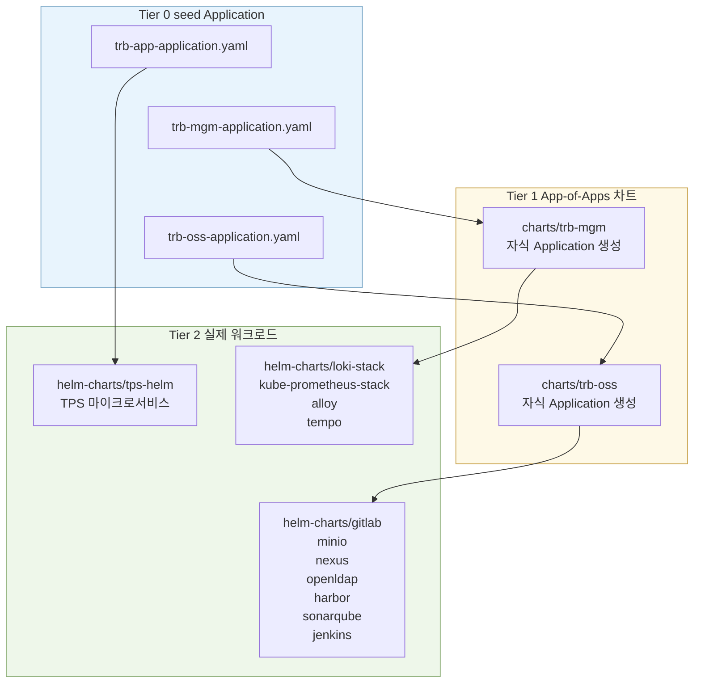

# argocd-apps 구조 분석
---
> `tps_manifest/argocd-apps` 는 환경별로 레포를 쪼개지 않고, 같은 `main` 브랜치를 여러 ArgoCD 인스턴스가 공유하되 seed Application 경로와 `values-{env}.yaml` 로만 환경을 분기하는 구조다. 이 문서는 그 구조가 실제로 어떻게 동작하는지와, 305P가 기존 305-dev와 함께 쓸 때 어디서 충돌하는지를 한 번에 설명한다.

## 1. 개요

> 이 문서는 `argocd-apps` 폴더가 어떤 역할로 나뉘는지, 운영자가 어떤 파일을 어느 클러스터에 처음 적용하는지, 그리고 왜 305P와 305-dev가 같은 레포를 보면서도 동시에 운영될 수 있는지를 설명한다.

`argocd-apps` 는 표면적으로는 파일 묶음이지만, 실제로는 TPS 전체 환경을 GitOps로 부팅하는 진입점이다. 

- 핵심은 단순하다. 환경마다 별도 레포를 두지 않고, 하나의 Bitbucket 레포와 `main` 브랜치를 공용으로 쓰되, 클러스터마다 서로 다른 seed Application YAML을 `kubectl apply` 해서 자기 환경 트리를 만들게 한다. 
- 이후에는 같은 차트를 보더라도 `values-dev.yaml`, `values-stg.yaml`, `values-prd.yaml`, `values-op.yaml`, `values-mirae.yaml` 처럼 환경별 values 파일만 읽기 때문에 결과 리소스가 달라진다.

이 방식이 왜 자주 헷갈릴까? 폴더 이름이 환경을 뜻하는지, 차트가 환경을 뜻하는지, 실제 워크로드가 어디서 갈리는지가 파일만 보고는 드러나지 않기 때문이다. 특히 305P는 신규 개발환경인데도 계획 문서상 기존 `app-of-apps/dev/` 를 재사용하는 방향이 열려 있어서, "같은 dev를 같이 쓰면 충돌하지 않느냐"는 질문이 반복될 수밖에 없다.


## 2. 환경 식별자 정리

> 여기서 먼저 이름을 정리해야 뒤 섹션이 읽힌다. 폴더 이름, Harbor 레지스트리, 실제 클러스터 환경 이름이 일대일로 맞지 않기 때문이다.

| 식별자 | 현재 의미 | 대표 파일/값 | 비고 |
|------|------|------|------|
| `dev` | 기존 305-dev 개발환경 | `app-of-apps/dev/`, `values-dev.yaml` | 현재도 살아 있는 기존 개발계 |
| `stg` | 스테이징 | `app-of-apps/stg/`, `values-stg.yaml` | 표준 분기 |
| `prd` | 운영 | `app-of-apps/prd/`, `values-prd.yaml` | 표준 분기 |
| `op-prd` | 데이터센터 이전용 임시 OP 환경 | `app-of-apps/op-prd/`, `values-op.yaml` | `trb-oss` seed는 없음 |
| `mirae` | 미래에셋 고객사 변형 | `values-mirae.yaml` | seed 폴더는 없고 values만 존재 |
| `305P` | PPP v2, `dev-3.0.5.1p` 신규 개발환경 | 계획 문서상 아직 전용 폴더 미정 | `dev` 재사용 또는 별도 폴더 신설 중 미결정 |

- 정리하면 `dev` 는 "개발환경 일반"이 아니라 이미 기존 305-dev를 가리키는 이름에 가깝다. 그런데 305P 계획 문서에서는 신규 환경도 여기에 태워 보려는 흔적이 있다. 이 지점이 혼동의 근본 원인이다.


## 3. 최상위 구조

> 최상위 두 폴더는 목적이 다르다. 하나는 현재 운영 구조이고, 다른 하나는 과거 구조의 흔적이다.

`app-of-apps/` 는 현재 실제 운영에 쓰이는 구조다. 이 안에서 다시 두 층으로 나뉜다. `charts/trb-mgm`, `charts/trb-oss` 는 자식 Application들을 만들어내는 App-of-Apps Helm 차트이고, `dev/`, `stg/`, `prd/`, `op-prd/` 는 각 클러스터에 최초 1회 적용하는 seed Application 묶음이다.

반면 `declartive/` 는 초창기 방식의 잔재다. 여기에는 13개 마이크로서비스를 개별 ArgoCD Application으로 선언한 `application.yaml` 과, 내부 GitLab 및 Harbor OCI repository secret이 들어 있다. 지금 구조에서는 `helm-charts/tps-helm` 우산 차트와 App-of-Apps 패턴으로 대체되었기 때문에, 운영 기준으로는 레거시 스냅샷으로 보는 편이 맞다.


## 4. 한 레포 - 복수 환경 공유 모델

> 사용자가 자주 묻는 핵심은 "같은 레포를 어떻게 여러 환경이 같이 쓰느냐"이다. 답은 브랜치 분기가 아니라 클러스터별 seed 선택과 values 분기다.

각 환경에는 독립된 Kubernetes 클러스터와 그 안의 ArgoCD 인스턴스가 있다. 이 인스턴스들은 모두 `https://bitbucket.org/okestrolab/tps_manifest.git` 의 `main` 브랜치를 `targetRevision` 으로 본다. 즉, 환경을 브랜치로 나누지 않는다.

대신 환경은 두 번에 걸쳐 결정된다. 

1. 첫 번째 결정은 부트스트랩 시점이다. 운영자가 어느 클러스터에서 어떤 seed 파일을 `kubectl apply -f argocd-apps/app-of-apps/{env}/...` 하느냐로 루트 Application이 정해진다. 
2. 두 번째 결정은 렌더링 시점이다. 각 seed가 `values-dev.yaml` 같은 환경별 value file을 넘기면, App-of-Apps 차트는 그 값만으로 자식 Application 목록과 하위 차트 경로를 만든다.

이 모델은 "같은 코드를 공유하지만 결과는 환경별로 다르다"는 GitOps 전형이다. 장점은 환경이 늘어도 차트를 복제하지 않아도 된다는 점이다. 반면 단점은 환경 경계가 브랜치가 아니라 values 경로에 걸려 있다는 점이다. 그래서 `values-dev.yaml` 를 누가 write-back 하느냐가 곧 충돌 지점이 된다.


## 5. 전체 지도

> 실제 배포는 3단계다. 사람이 seed Application을 심고, App-of-Apps가 자식 Application을 만들고, 자식 Application이 실제 Helm 차트를 배포한다.

아래 그림은 현재 구조를 가장 짧게 보여준다.



중요한 포인트는 환경마다 달라지는 파일이 사실상 Tier 0뿐이라는 점이다. Tier 1과 Tier 2는 대부분 공통이며, 환경 차이는 seed가 넘긴 `valueFiles` 때문에 생긴다.


## 6. 클러스터 부트스트랩 시나리오

> 305P 관점에서 보면, 새로운 환경을 만든다는 말은 새 레포를 만드는 것이 아니라 새 클러스터에 기존 구조를 어떤 이름으로 심을지 결정하는 일에 가깝다.

`tasks/dev-3.0.5.1p/00-new-env-setup-index.md`, `env-config.md`, `todo/06-trb-app-app-of-apps-plan.md` 를 함께 보면 순서는 분명하다. 먼저 `/etc/hosts` 를 잡고 kubeconfig를 병합해 신규 클러스터 접속을 만든다. 그 다음 ArgoCD를 설치하고, Bitbucket 접근에 필요한 secret을 준비한다. 마지막으로 `argocd-apps/app-of-apps/dev/` 아래 seed Application 세 개를 적용해 `trb-oss`, `trb-mgm`, `trb-app` 트리를 올린다.

여기서 왜 문제가 생길까? 계획 문서의 `WRITE_BACK_VALUES_PATH` 가 `helm-charts/tps-helm/values/values-dev.yaml` 로 고정되어 있기 때문이다. 이 말은 305P를 새 클러스터에 띄워도, Image Updater의 Git write-back 대상은 기존 305-dev가 쓰는 values 파일과 같다는 뜻이다. 클러스터는 분리되어도 Git상의 환경 경계는 분리되지 않는다.


## 7. App-of-Apps 내부 동작

> 차트가 하는 일은 복잡하지 않다. `.Values.{name}.enabled` 로 자식 Application 생성 여부를 결정하고, `.Values.{name}.helmPath` 로 실제 하위 차트 경로를 연결한다.

예를 들어 `app-of-apps/charts/trb-oss/templates/gitlab.yaml` 은 `gitlab.enabled` 가 `true` 일 때만 `Application` 리소스를 렌더한다. 이 리소스는 다시 `helm-charts/gitlab` 로 연결된다. 같은 패턴이 `harbor`, `jenkins`, `minio`, `nexus`, `openldap`, `sonarqube` 에 반복된다. `trb-mgm` 도 동일하다. `loki`, `prometheus`, `alloy`, `tempo` 를 켜고 끄는 스위치만 다를 뿐이다.

이 설계를 왜 썼을까? 환경별로 차트를 복제하지 않기 위해서다. `values-mirae.yaml` 에서 `harbor.enabled: false`, `sonarqube.enabled: false` 로 두면 같은 `trb-oss` 차트라도 고객사 환경에서는 해당 Application 자체가 생성되지 않는다.


## 8. 환경별 활성화 매트릭스

> 환경 차이는 결국 어떤 자식 Application이 생성되느냐로 드러난다.

| 환경 | trb-mgm | trb-oss | 비고 |
|------|------|------|------|
| `dev` | `loki`, `prometheus`, `alloy`, `tempo` | `gitlab`, `minio`, `nexus`, `openldap`, `harbor`, `sonarqube`, `jenkins` | 현재 가장 많은 컴포넌트 |
| `stg` | `loki`, `prometheus` | `gitlab`, `minio`, `nexus`, `openldap`, `harbor`, `sonarqube`, `jenkins` | `alloy`, `tempo` 미사용 |
| `prd` | 실제 seed는 불일치, 의도는 확인 필요 | 현재 파일상 `trb-oss` seed가 `charts/trb-mgm` 을 가리킴 | 운영 전 점검 필요 |
| `op-prd` | `loki`, `prometheus` | seed 없음 | OSS를 공유하는지 별도 확인 필요 |
| `mirae` | 별도 mgm values 없음 | `harbor`, `sonarqube` 비활성 | 고객사 변형 |
| `305P` 예정치 | 문서상 `dev` 재사용 시 dev와 동일 | 문서상 `dev` 재사용 시 dev와 동일 | 권장안은 별도 `ppp` 분기 |

여기서 `prd` 는 특히 주의해야 한다. `prd/trb-mgm-application.yaml` 의 `path` 가 `helm-charts/loki-stack` 으로 되어 있고, `prd/trb-oss-application.yaml` 은 `argocd-apps/app-of-apps/charts/trb-mgm` 을 가리킨다. 단순 복붙 실수일 가능성이 높지만, 운영에서 그대로 적용하면 seed 계층이 깨진다.


## 9. trb-app과 Image Updater

> `trb-app-application.yaml` 은 App-of-Apps가 아니라 TPS 우산 차트를 직접 가리키며, Image Updater가 values 파일을 다시 커밋하는 자동 배포 루프의 출발점이다.

환경별 `trb-app-application.yaml` 은 `helm-charts/tps-helm` 을 직접 배포한다. 여기에 12개 이미지가 `argocd-image-updater.argoproj.io/image-list` 로 묶여 있고, 각 서비스는 `image-name`, `image-tag`, `update-strategy`, `allow-tags` 네 개 패턴을 반복한다. 태그 형식은 `YYYYMMDD-HHMMSS` 정규식으로 제한되어 있어 Jenkins가 만든 빌드 타임스탬프 태그만 따라가게 되어 있다.

동작 흐름은 단순하다. Jenkins가 Harbor에 새 이미지를 푸시하면, ArgoCD Image Updater가 레지스트리를 폴링해 최신 태그를 고른다. 그 다음 `write-back-method: git:secret:trb-oss/bitbucket-creds` 로 Bitbucket에 커밋하고, `write-back-target: helmvalues:/helm-charts/tps-helm/values/values-{env}.yaml` 에 해당 태그를 반영한다. 마지막으로 ArgoCD가 변경된 Git 상태를 다시 동기화해 롤아웃한다.

이 루프가 왜 편리한가? CI는 이미지만 만들고, 실제 배포 상태는 Git에 남기기 때문이다. 반대로 이 루프가 왜 위험한가? 서로 다른 환경이 같은 `values-dev.yaml` 에 write-back 하면, 누가 마지막으로 커밋했는지가 곧 배포 상태가 된다.


## 10. 305P와 305-dev의 관계

> 두 환경은 서로 다른 클러스터라서 Kubernetes 리소스는 충돌하지 않는다. 문제는 Git의 values 경로와 Image Updater write-back 대상이 겹칠 때 생긴다.

현재 조사 기준으로 레지스트리 자체는 이미 분리 방향이 잡혀 있다. 기존 305-dev는 `harbor.dev.console.trombone.okestro.cloud/trb` 계열을, 305P는 `harbor.dev.trombone-v2.okestro.cloud/trb` 계열을 사용한다. 따라서 이미지 저장소만 보면 분리가 가능하다.

하지만 `tasks/dev-3.0.5.1p/env-config.md` 와 Image Updater 계획서는 305P write-back 경로를 `values-dev.yaml` 로 잡고 있다. 이 상태로 신규 환경을 올리면 무슨 일이 생길까? 305P에서 새 이미지를 푸시할 때마다 305-dev도 바라보는 values 파일이 바뀐다. 반대로 기존 305-dev의 자동 배포도 305P가 쓰는 값을 덮을 수 있다. 클러스터는 분리되어 있어도 GitOps 선언은 공유되어, 결과적으로 "마지막 write-back 승자" 구조가 된다.

운영 선택지는 세 가지다.

| 선택지 | 설명 | 장점 | 단점 | 판단 |
|------|------|------|------|------|
| A | `app-of-apps/ppp/` 와 `values-ppp.yaml` 신설 | 기존 모델 유지, 충돌 원인 제거 | seed와 values를 한 번 더 만들어야 함 | 권고 |
| B | 305-dev를 은퇴시키고 305P가 `dev` 를 승계 | 이름이 단순해짐 | 레지스트리, 도메인, 운영 절차를 전면 교체해야 함 | 전환 시점이 명확할 때만 가능 |
| C | 305P 전용 브랜치 사용 | Git 레벨로 강한 분리 | 전 환경이 `main` 공유라는 현재 운영 모델과 충돌 | 비권장 |

현 시점 권고는 A다. 현재 구조의 철학이 "한 레포, 한 브랜치, 환경별 values 분기" 인데, 305P만 브랜치를 끊으면 예외 규칙이 생겨 운영 난도가 올라간다. 반면 `ppp` 폴더와 `values-ppp.yaml` 추가는 기존 구조를 그대로 확장하는 방식이라 설명과 운영 둘 다 단순하다.


## 11. Harbor, syncPolicy, 레거시 위치

> 환경별 차이는 values와 레지스트리뿐 아니라 동기화 정책과 예외 처리에도 숨어 있다.

레지스트리는 `dev`, `stg`, `prd`, `op-prd`, 305P가 서로 완전히 같지 않다. 특히 `op-prd` 는 `.../op-trb` 프로젝트를 쓰고, 305P는 `harbor.dev.trombone-v2.okestro.cloud/trb` 로 계획되어 있다. 같은 `trb-app` 이라도 이미지 소스가 다르므로 values 파일을 분리하지 않으면 의미가 없다.

동기화 정책도 완전히 같지 않다. `trb-oss/values-dev.yaml` 는 `automated` 가 주석 처리되어 있어 수동 제어에 가깝고, 다른 환경 values 들은 대체로 `automated.prune` 과 `selfHeal` 이 켜져 있다. 자식 템플릿에는 예외도 들어 있다. `loki` 는 `volumeClaimTemplates` 차이를 무시하고, `harbor` 는 secret checksum과 TLS 관련 차이를 무시하며, `minio` 는 root credential 변화를 무시한다. 왜 이런 예외가 있을까? 운영 중 동적으로 바뀌는 secret과 PVC 스펙 때문에 ArgoCD가 불필요한 드리프트를 감지하지 않게 하려는 의도다.

`declartive/` 는 그 이전 세대의 구조다. `application.yaml` 을 보면 `api-gateway`, `auth-api`, `cloud-config`, `common-api`, `discovery-server`, `notificator`, `pipeline-api`, `pms-api`, `ppln-logging-api`, `react-app`, `scheduler`, `sse`, `workflow-api` 가 각각 `test-dev` 네임스페이스에 개별 배포되도록 되어 있다. `repoURL` 도 Bitbucket이 아니라 `http://gitlab.dev.trb.com/TRB/manifest.git` 인 점이, 이 폴더가 과거 GitLab 중심 시절의 흔적임을 보여준다.


## 12. 운영상 주의사항

> 이 폴더는 동작은 하지만, 그대로 두면 반복 질문과 운영 사고를 부르는 지점이 몇 군데 명확히 보인다.

> **보안 경고**: `app-of-apps/charts/trb-mgm/values-*.yaml` 과 `app-of-apps/charts/trb-oss/values-*.yaml` 에 Bitbucket username/password가 평문으로 커밋되어 있다. 본문에서는 `****` 로 마스킹했지만, 실제 저장소에는 민감정보가 남아 있으므로 Sealed Secrets 또는 External Secrets Operator로 이관하는 편이 맞다.

운영 관점에서 가장 먼저 손봐야 할 항목은 다음과 같다.

1. 305P와 305-dev가 `values-dev.yaml` 를 공유하지 않도록 환경 분기를 명시적으로 나눠야 한다.
2. `prd/trb-mgm-application.yaml`, `prd/trb-oss-application.yaml` 의 `path` 불일치를 점검해야 한다.
3. `dev/trb-app-application.yaml.Ori`, `dev/trb-app-tmp-application.yaml` 는 살아 있는 운영 파일인지 임시 백업인지 정리해야 한다.
4. `op-prd/` 에 `trb-oss` seed가 없는 이유를 확인해야 한다. 다른 환경의 OSS를 공유하는 구조라면 문서화가 먼저 필요하다.
5. `declartive/repostiory.yaml`, `declartive/repoistory-oci.yaml` 는 파일명 오탈자까지 포함해 레거시 정리 대상으로 보는 편이 맞다.


## 13. 부록 A: 부트스트랩 명령어

> 아래 명령은 구조를 설명하는 최소 예시다. 어떤 환경을 심을지는 `{env}` 폴더 선택에서 갈린다.

```bash
# Bitbucket/Harbor repository secret 적용
kubectl apply -f argocd-apps/declartive/repostiory.yaml
kubectl apply -f argocd-apps/declartive/repoistory-oci.yaml

# seed Application 적용
kubectl apply -f argocd-apps/app-of-apps/dev/trb-oss-application.yaml
kubectl apply -f argocd-apps/app-of-apps/dev/trb-mgm-application.yaml
kubectl apply -f argocd-apps/app-of-apps/dev/trb-app-application.yaml

# 상태 확인
argocd app list
argocd app get trb-oss
argocd app get trb-mgm
argocd app get trb-app
```


## 14. 부록 B: 파일 역할표

> 현재 작업 시점에 `find argocd-apps -type f` 기준 실파일은 39개다. 문서 요구안의 "40개" 와는 1개 차이가 있으므로, 아래 표는 실측 결과를 기준으로 작성했다.

| 경로 | 역할 |
|------|------|
| `app-of-apps/charts/trb-mgm/Chart.yaml` | `trb-mgm` App-of-Apps Helm 차트 메타데이터 |
| `app-of-apps/charts/trb-mgm/templates/alloy.yaml` | `alloy` 자식 Application 템플릿 |
| `app-of-apps/charts/trb-mgm/templates/kube-prometheus-stack.yaml` | `prometheus` 자식 Application 템플릿 |
| `app-of-apps/charts/trb-mgm/templates/loki-stack.yaml` | `loki` 자식 Application 템플릿과 ignoreDifferences |
| `app-of-apps/charts/trb-mgm/templates/tempo.yaml` | `tempo` 자식 Application 템플릿 |
| `app-of-apps/charts/trb-mgm/values-dev.yaml` | dev용 `trb-mgm` values, `alloy`와 `tempo` 활성 |
| `app-of-apps/charts/trb-mgm/values-mirae.yaml` | 이름은 mgm 경로에 있으나 내용상 OSS 컴포넌트 값이 들어간 비정상 values |
| `app-of-apps/charts/trb-mgm/values-op.yaml` | `op-prd` 용 `trb-mgm` values |
| `app-of-apps/charts/trb-mgm/values-prd.yaml` | 이름은 mgm 경로에 있으나 내용상 OSS 컴포넌트 값이 들어간 비정상 values |
| `app-of-apps/charts/trb-mgm/values-stg.yaml` | stg용 `trb-mgm` values, `loki`와 `prometheus` 중심 |
| `app-of-apps/charts/trb-oss/Chart.yaml` | `trb-oss` App-of-Apps Helm 차트 메타데이터 |
| `app-of-apps/charts/trb-oss/templates/gitlab.yaml` | `gitlab` 자식 Application 템플릿 |
| `app-of-apps/charts/trb-oss/templates/harbor.yaml` | `harbor` 자식 Application 템플릿과 secret ignoreDifferences |
| `app-of-apps/charts/trb-oss/templates/jenkins.yaml` | `jenkins` 자식 Application 템플릿과 sync override 슬롯 |
| `app-of-apps/charts/trb-oss/templates/minio.yaml` | `minio` 자식 Application 템플릿과 root credential ignoreDifferences |
| `app-of-apps/charts/trb-oss/templates/nexus.yaml` | `nexus` 자식 Application 템플릿 |
| `app-of-apps/charts/trb-oss/templates/openldap.yaml` | `openldap` 자식 Application 템플릿 |
| `app-of-apps/charts/trb-oss/templates/repository.yaml` | ArgoCD repository secret 템플릿 |
| `app-of-apps/charts/trb-oss/templates/sonarqube.yaml` | `sonarqube` 자식 Application 템플릿 |
| `app-of-apps/charts/trb-oss/values-dev.yaml` | dev용 `trb-oss` values, `automated` 주석 처리 |
| `app-of-apps/charts/trb-oss/values-mirae.yaml` | 미래에셋용 `trb-oss` values, `harbor`와 `sonarqube` 비활성 |
| `app-of-apps/charts/trb-oss/values-prd.yaml` | prd용 `trb-oss` values |
| `app-of-apps/charts/trb-oss/values-stg.yaml` | stg용 `trb-oss` values |
| `app-of-apps/dev/trb-app-application.yaml` | dev TPS 애플리케이션 seed, Image Updater 어노테이션 포함 |
| `app-of-apps/dev/trb-app-application.yaml.Ori` | dev `trb-app` 백업본 추정 |
| `app-of-apps/dev/trb-app-tmp-application.yaml` | 데이터센터 이전용 임시 dev seed, `values-tmp-dev.yaml` 사용 |
| `app-of-apps/dev/trb-mgm-application.yaml` | dev `trb-mgm` App-of-Apps seed |
| `app-of-apps/dev/trb-oss-application.yaml` | dev `trb-oss` App-of-Apps seed |
| `app-of-apps/op-prd/trb-app-application.yaml` | `op-prd` TPS 애플리케이션 seed, `values-op.yaml` write-back |
| `app-of-apps/op-prd/trb-mgm-application.yaml` | `op-prd` `trb-mgm` seed |
| `app-of-apps/prd/trb-app-application.yaml` | prd TPS 애플리케이션 seed |
| `app-of-apps/prd/trb-mgm-application.yaml` | prd `trb-mgm` seed인데 현재 path가 `helm-charts/loki-stack` 로 비정상 |
| `app-of-apps/prd/trb-oss-application.yaml` | prd `trb-oss` seed인데 현재 path가 `charts/trb-mgm` 로 비정상 |
| `app-of-apps/stg/trb-app-application.yaml` | stg TPS 애플리케이션 seed |
| `app-of-apps/stg/trb-mgm-application.yaml` | stg `trb-mgm` seed |
| `app-of-apps/stg/trb-oss-application.yaml` | stg `trb-oss` seed |
| `declartive/application.yaml` | 레거시 13개 개별 Application 선언 묶음 |
| `declartive/repoistory-oci.yaml` | Harbor OCI chart repository secret, 파일명 오탈자 포함 |
| `declartive/repostiory.yaml` | GitLab repository secret, 파일명 오탈자 포함 |

> **보안 경고 재강조**: values 파일에 들어 있는 Bitbucket 자격증명은 현재 구조 설명의 핵심이 아니므로 문서에서는 모두 `****` 처리했다. 다만 실제 저장소에는 평문이 있으므로, 문서만 공유하고 저장소는 그대로 두는 식의 대응으로는 문제가 해결되지 않는다.
