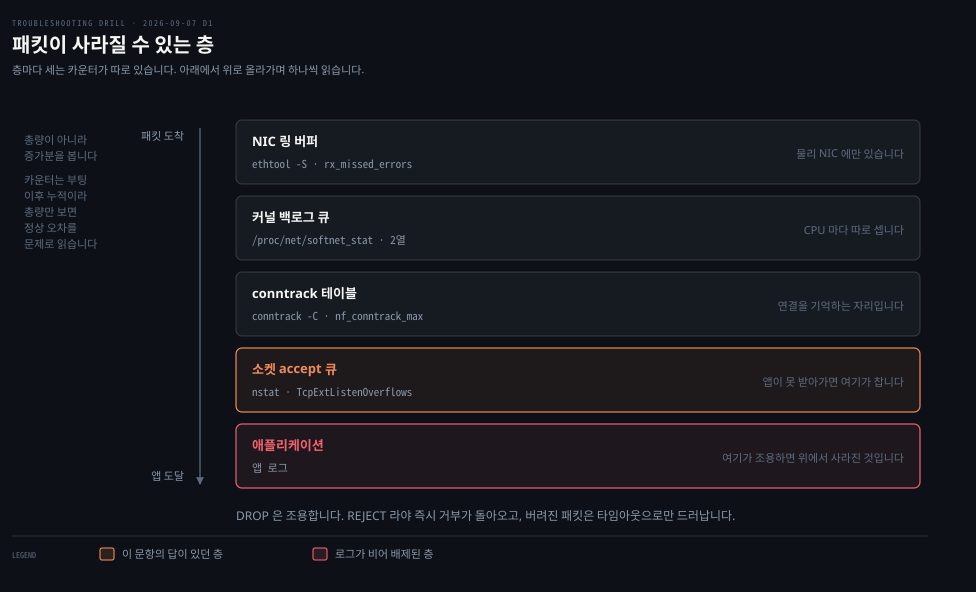
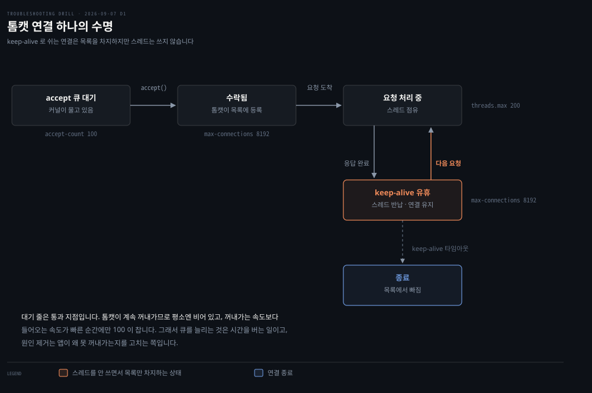
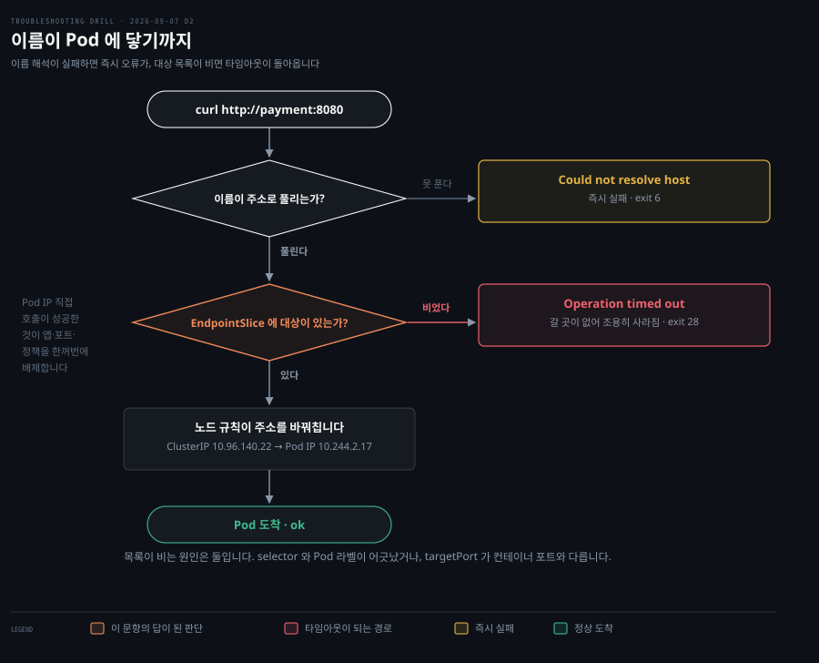

# 트러블슈팅 드릴 — 요청이 사라지는 세 자리

---

> 첫 회차 기록입니다. 지면 세 문항을 풀어 점수 2와 3과 3을 받았습니다. 셋 다 원인의 방향은 잡았고 "어디를 어떻게 보는가"에서 막혔습니다.

## 오늘의 회차

> 계층 A와 B와 C에서 한 문항씩 뽑았습니다. 지면만이면 30분 분량이고, 개념 질문을 포함해 실제로는 더 걸렸습니다.

| 문항 | 계층 | 점수 | 막힌 지점 |
|------|------|------|----------|
| D1 실패율 0.3%가 사라지지 않는 서버 | A 리눅스 호스트 | 2 | 패킷이 지나는 층마다 카운터가 있다는 것을 몰랐습니다 |
| D2 Pod 로는 되고 이름으로는 안 되는 호출 | B 쿠버네티스 | 3 | EndpointSlice 를 스스로 떠올리지 못했습니다 |
| D3 트래픽이 늘 때만 섞여 나오는 503 | C 서비스 메시 | 3 | 확인할 명령을 내지 못했습니다 |

세 문항의 성격이 달랐습니다.

- D1: 아예 후보를 못 세워 두 칸을 비웠습니다
- D2: 후보를 세웠다가 반증 앞에서 스스로 지웠습니다
- D3: 배제를 처음부터 스스로 했습니다

가설을 세우는 힘은 회차 안에서 눈에 띄게 올라갔습니다. 남은 것은 확인 방법입니다. 세 문항 모두 "어떻게 확인하는가"에서 멈췄고, 그것이 다음 회차의 과제입니다.


## D1. 실패율 0.3%가 사라지지 않는 서버

> 로그가 비어 있는데 클라이언트만 실패를 본다면, 요청이 애플리케이션에 닿기 *전에* 사라진 것입니다. 그래서 수사는 위가 아니라 아래에서 시작합니다.



### 문제 소개

사내 API 서버 한 대에서 응답 실패율이 0.3% 안팎으로 꾸준히 나옵니다. 클라이언트는 타임아웃을 보고하는데 애플리케이션 로그에는 예외가 하나도 없습니다. 같은 랙에 있는 동일 구성의 다른 서버 두 대는 멀쩡합니다.

서버에서 확인된 것은 여기까지였습니다.

```bash
# uptime
 14:22:31 up 91 days,  3:14,  1 user,  load average: 0.82, 0.77, 0.71

# free -h
               total        used        free      shared  buff/cache   available
Mem:            31Gi        12Gi       4.1Gi       1.2Gi        15Gi        17Gi

# systemctl status api
   Active: active (running) since Mon 2026-06-08 11:03:22 KST; 91 days ago
```

CPU도 메모리도 여유가 있고 프로세스는 재시작 없이 91일째 떠 있습니다. 자원이 부족한 상황이 아닌데도 일부 요청만 사라집니다.

제 답은 "네트워크 이슈이니 패킷을 봐야 하나"였고 무엇을 볼지는 몰랐습니다. 확인 명령과 처방 칸은 비웠습니다.

### 원인 분석

두 사실이 수사 방향을 결정합니다.

**첫째, 애플리케이션 로그가 비어 있습니다.** 앱이 요청을 받아 처리하다 실패했다면 보통 에러가 남습니다. 아무것도 없다는 것은 요청이 앱에 **닿지 않았다**는 뜻입니다. 그러면 앱 위쪽이 아니라 아래쪽을 봐야 합니다.

**둘째, 간헐적입니다.** 규칙이 막는 것이라면 100% 실패해야 하는데 99.7%는 성공합니다. 상시 차단이 아니라 **무언가가 가끔 넘친다**는 신호입니다.

패킷은 NIC에서 애플리케이션까지 다섯 층을 지나고, 층마다 넘치면 버립니다. 그리고 버릴 때마다 커널이 숫자를 세어 둡니다. 어느 층의 숫자가 늘고 있는지가 곧 어디서 사라졌는지입니다.

카운터를 읽을 때 함정이 하나 있습니다. **총량이 아니라 증가분을 봐야 합니다.** 카운터는 부팅 이후 누적이라 91일 서버에서는 정상 오차도 큰 숫자로 보입니다. 회차 중에 `/proc/net/softnet_stat`을 두 번 찍었더니 그 차이가 그대로 드러났습니다.

| CPU 0 | 처음 | 잠시 뒤 | 증가 |
|---|---|---|---|
| processed | 2,495,160 | 2,506,564 | +11,404 |
| dropped | 0 | 0 | 0 |
| time_squeeze | 4,816 | 4,840 | +24 |

패킷을 만 개 넘게 더 처리하는 동안 버린 것은 0입니다. 총량 `4,816`만 봤다면 문제로 읽었을 숫자입니다.

### 해결 방법

층을 아래에서 위로 훑으며 증가하는 카운터를 찾습니다.

```bash
ip -s link show eth0                    # RX errors · dropped · missed
ethtool -S eth0 | grep -i -E 'miss|drop|buf'
cat /proc/net/softnet_stat              # 2열이 백로그 넘침
ss -lnt                                 # Recv-Q 가 쌓이는가
nstat -az | grep -i -E 'listen|abort'   # ListenOverflows · ListenDrops
conntrack -C; sysctl net.netfilter.nf_conntrack_max
```

`ListenOverflows`가 늘고 있다면 소켓 accept 큐가 넘친 것입니다. 조치는 둘로 갈립니다.

- **응급**: `net.core.somaxconn`과 애플리케이션의 backlog 설정을 올려 대기 공간을 넓힙니다
- **재발 방지**: 앱이 왜 `accept()`로 꺼내가지 못하는지를 고칩니다. 스레드 풀 부족, GC 정지, 블로킹 I/O가 흔한 원인입니다

큐를 늘리는 것은 시간을 버는 일이지 원인 제거가 아닙니다.

### 다른 방법 비교

**DROP과 REJECT는 증상이 다릅니다.** 제가 타임아웃의 원인을 `iptables` 하나로 잡은 것이 좁았던 이유입니다.

| | 클라이언트가 보는 것 |
|---|---|
| REJECT | RST 또는 ICMP로 즉시 거부 — **바로 실패** |
| DROP | 아무 응답 없음 — **타임아웃** |

타임아웃이 났다는 사실은 규칙이 막았다는 뜻이 아니라 **조용히 버려졌다**는 뜻입니다. 그러면 후보가 방화벽 하나가 아니라 위 다섯 층 전부로 넓어집니다.

**계층별 도구도 겹치지 않습니다.** `tcpdump`는 NIC를 지난 패킷만 보므로 링 버퍼에서 버려진 것은 잡지 못합니다. 반대로 `ss`는 소켓 계층만 보고 그 아래는 못 봅니다. 한 도구로 결론을 내면 그 도구가 안 보여 준 층이 사각으로 남습니다.

### 곁가지 — 톰캣의 세 상한

> accept 큐 100과 max-connections 8192와 스레드 200이 동시에 성립하는 이유입니다. 셋이 같은 것을 세지 않습니다.



"대기 줄이 100인데 어떻게 8192개를 무느냐"가 회차 중 나온 질문이었습니다. 답은 **대기 줄이 저장소가 아니라 통과 지점**이라는 데 있습니다. 톰캣이 계속 꺼내가므로 평소엔 거의 비어 있고, 꺼내가는 속도보다 들어오는 속도가 빠른 순간에만 찹니다.

8192가 말이 되는 것은 keep-alive 때문입니다. 연결은 살아 있지만 대부분은 요청을 안 보내고 쉽니다. 도식에서 강조한 유휴 상태의 연결은 목록을 차지하되 스레드는 쓰지 않습니다.

| 설정 | 정체 | 기본값 |
|---|---|---|
| `server.tomcat.accept-count` | 대기 줄 | 100 |
| `server.tomcat.threads.max` | 처리 스레드 | 200 |
| `server.tomcat.max-connections` | 물고 있는 연결 | 8192 |

`net.core.somaxconn`은 그 위의 커널 상한입니다. 앱이 1000을 요청해도 커널이 128이면 128로 잘립니다. 앱 설정만 올리고 커널을 안 올리면 조용히 무시되는 함정이 여기 있습니다.

### 나온 개념

`uptime`은 현재 시각, 가동 시간, 접속자 수, 그리고 1분·5분·15분 부하 평균 다섯을 한 줄에 보여줍니다.

`load average`는 퍼센트가 아니라 **개수**입니다. 실행 가능 상태로 줄 서 있는 프로세스의 평균 수라 코어 수와 나란히 놓아야 뜻이 생깁니다. 8코어에서 `0.82`는 약 10%이지 82%가 아닙니다. 그리고 리눅스에서는 CPU 대기만이 아니라 **디스크 I/O 대기까지 함께 셉니다.**

`ip -s link`의 네 칸도 뜻이 다릅니다. `errors`는 망가진 패킷, `dropped`는 받았지만 버린 것, `missed`는 NIC가 아예 못 받은 것으로 링 버퍼 넘침의 직접 지표이며, `mcast`는 멀티캐스트입니다.

실습 중에 `eth0@if8`과 `link-netnsid 0`이 찍혔습니다. veth 페어의 한쪽이라는 표시이고, **컨테이너 안에서는 물리 NIC의 링 버퍼를 볼 수 없습니다.** 보려면 노드로 나가야 합니다.

근거는 [nk 02-03 Linux 네트워크 진단 도구와 02-01 커널이 패킷을 다루는 법](../../08_cloud/book/networking-and-kubernetes/), 그리고 [lml 08-02 자원마다 창이 따로 나 있다](../../02_os/book/learning-modern-linux/)입니다.


## D2. Pod 로는 되고 이름으로는 안 되는 호출

> Pod IP 직접 호출이 성공했다는 사실 하나가 후보 여럿을 한꺼번에 지웁니다. 그러면 남는 것은 이름으로 부를 때만 지나는 두 관문입니다.



### 문제 소개

배포한 결제 서비스에 같은 네임스페이스의 다른 Pod에서 접근이 안 됩니다.

```bash
# kubectl get pods -l app=payment
NAME                      READY   STATUS    RESTARTS   AGE
payment-7d4b9c6f8-x2klm   1/1     Running   0          12m

# kubectl get svc payment
NAME      TYPE        CLUSTER-IP      PORT(S)    AGE
payment   ClusterIP   10.96.140.22    8080/TCP   12m

# kubectl exec -it client -- curl -s -m 3 http://10.244.2.17:8080/health
ok

# kubectl exec -it client -- curl -s -m 3 http://payment:8080/health
curl: (28) Operation timed out after 3001 milliseconds
```

Pod는 Running이고 Ready입니다. Pod IP로 직접 부르면 응답이 오고, 이름으로 부르면 시간만 흐릅니다.

제 첫 가설은 NetworkPolicy였습니다. 근거로 "Pod IP와 ClusterIP가 다르다"를 들었는데 이건 원래 다른 대역이라 필터링의 증거가 아닙니다.

### 원인 분석

**성공한 관찰이 후보를 지웁니다.** Pod IP 직접 호출이 `ok`였다는 것은 애플리케이션도, 컨테이너 포트도, Pod 사이 네트워크 경로도 살아 있다는 뜻입니다.

NetworkPolicy도 이 사실 하나로 지워집니다. 정책은 Pod의 인터페이스에서 평가되는데, Service로 온 패킷도 노드에서 이미 Pod IP로 바뀐 뒤 도착합니다.

```bash
Service 경로:  dst=10.96.140.22 → [노드에서 DNAT] → dst=10.244.2.17 → Pod
Pod IP 경로:   dst=10.244.2.17  → (변환 없음)     → dst=10.244.2.17 → Pod
```

도착 시점에 두 패킷은 목적지가 같습니다. 정책 입장에서는 어느 길로 왔는지 알 방법이 없으므로, 막고 있었다면 직접 호출도 실패했어야 합니다.

**남은 것은 두 관문입니다.** 이름을 주소로 바꾸는 일과, 그 주소가 어느 Pod로 갈지 아는 일입니다. 그리고 `curl`이 낸 오류가 둘을 가릅니다. 이름 해석이 실패했다면 `Could not resolve host`가 났을 텐데 타임아웃이 났습니다. 주소까지는 찾았는데 그 주소가 아무 데로도 안내하지 않았다는 뜻입니다.

Service는 `selector`에 적힌 라벨로 자기 뒤에 세울 Pod를 고릅니다. 그 라벨이 Pod의 실제 라벨과 어긋나면 아무도 안 걸리고 EndpointSlice는 빈 채로 남습니다. 목록이 비면 노드에는 만들 규칙이 없고, 바꿔칠 대상이 없으니 패킷은 갈 곳을 잃습니다.

### 해결 방법

```bash
kubectl get endpoints payment
kubectl get svc payment -o jsonpath='{.spec.selector}'
kubectl get pod payment-7d4b9c6f8-x2klm --show-labels
```

목록이 비어 있으면 selector와 라벨을 나란히 놓고 비교합니다.

- **응급**: 라벨을 맞춰 붙입니다. `kubectl label pod ... app=payment` 또는 Service selector 수정
- **재발 방지**: 매니페스트에서 Service의 `selector`와 Deployment의 `template.metadata.labels`를 **같은 값에서 끌어오게** 만듭니다. Helm이면 `_helpers.tpl`의 공통 라벨, Kustomize면 `commonLabels`입니다

손으로 두 곳에 같은 문자열을 적는 한 언젠가 어긋납니다.

### 다른 방법 비교

**목록이 비는 원인은 둘입니다.** 라벨 불일치가 첫째이고, `targetPort`가 컨테이너 포트와 다른 경우가 둘째입니다. 후자는 항목이 잡히고도 연결이 안 되므로 증상이 미묘하게 다릅니다. `kubectl get endpoints`가 비었는지 차 있는지가 두 갈래를 가릅니다.

**kube-proxy를 의심할 차례는 그 뒤입니다.** 목록이 차 있는데도 안 될 때만 `iptables-save | grep <서비스명>`이나 IPVS 모드의 `ipvsadm -Ln`을 봅니다. 그 전에 의심하면 대개 헛짚습니다. 오늘 제가 NetworkPolicy를 먼저 의심한 것과 같은 종류의 성급함입니다.

**이름 해석을 확인하는 도구도 갈립니다.** `dig`는 DNS 서버에 직접 묻고, `getent hosts`는 `/etc/nsswitch.conf` 순서대로 `/etc/hosts`를 먼저 본 뒤 DNS로 갑니다. 앱이 실제로 겪는 경로를 보려면 후자가 정확합니다.

### 나온 개념

**Pod IP와 ClusterIP는 정하는 주체가 다릅니다.**

| | 대역 정의 | 개별 IP 할당 |
|---|---|---|
| Service | kube-apiserver 플래그 | kube-apiserver가 직접 |
| Pod | controller-manager 플래그 또는 CNI 설정 | CNI의 IPAM |

한 줄로 줄이면 Service IP는 중앙이, Pod IP는 노드가 정합니다. 그리고 ClusterIP는 **어느 인터페이스에도 붙어 있지 않습니다.** 노드의 iptables 규칙이나 IPVS 테이블 안에만 존재하는 이름표라서 "가상"입니다.

CNI가 Service까지 맡지는 않습니다. Cilium이 특이한 쪽이고, Flannel이나 기본 Calico는 Service를 kube-proxy에 맡깁니다.

`/etc/nsswitch.conf`와 `/etc/resolv.conf`도 역할이 다릅니다. 앞은 **어떤 순서로 물을지**를 정하고 뒤는 **DNS로 물을 때 어디에 어떻게**를 정합니다. `/etc/hosts`는 로컬 DNS가 아니라 정적 파일이라 DNS 프로토콜을 쓰지 않습니다.

근거는 [k8s-net 04-04 Service와 EndpointSlice](../../08_cloud/kubernetes/04_networking/)와 [k8s-ts 04-01 서비스 디스커버리](../../08_cloud/troubleshooting/) 사례 1입니다.


## D3. 트래픽이 늘 때만 섞여 나오는 503

> 상태 코드를 뱉으려면 L7이 필요합니다. 앱이 안 뱉었다면 다른 L7이 뱉은 것입니다.


### 문제 소개

메시 안에서 주문 서비스가 결제 서비스를 호출합니다. 평소에는 문제가 없는데 트래픽이 오르는 시간대에만 503이 섞여 나오고, 실패율은 트래픽에 따라 오르내립니다.

```bash
# kubectl get pods -l app=payment
NAME                       READY   STATUS    RESTARTS   AGE
payment-6c9f4d7b8-2xk4m    2/2     Running   0          3h
payment-6c9f4d7b8-9wqzt    2/2     Running   0          3h
payment-6c9f4d7b8-lm5rc    2/2     Running   0          3h

# 주문 Pod 안에서 결제 Pod 를 직접 호출
kubectl exec -it order-xxx -c order -- curl -s -o /dev/null -w '%{http_code}\n' http://10.244.1.31:8080/health
200
```

Pod 셋 다 `2/2 Running`이고 재시작 이력이 없습니다. 결제 서비스 애플리케이션 로그에는 자기가 500대를 냈다는 기록이 없습니다.

제 가설은 "앞단의 L7 프록시가 원인"이었습니다. 추론 구조는 맞았는데 위치를 Ingress Gateway로 짚었습니다.

### 원인 분석

**추론의 뼈대가 이 문항의 핵심입니다.** HTTP 상태 코드를 만들려면 L7을 이해하는 무언가가 있어야 합니다. 결제 앱이 안 뱉었다면 다른 L7이 뱉은 것입니다.

위치는 두 조건으로 좁혀집니다. 이 호출은 클러스터 안에서 Pod끼리 오가므로 **Ingress Gateway를 지나지 않습니다.** 그리고 `2/2`가 답을 들고 있습니다. 결제 애플리케이션과 사이드카 프록시 둘입니다.

503을 만든 것은 그 사이드카이고, **고장 난 게 아니라 의도적으로 거절한** 것입니다. 그래서 앱 로그가 비어 있습니다. 요청이 거기까지 가지 않았으니까요.

503이 "도달할 수 없다"가 아니라 **"지금 처리할 수 없다"**인 것도 여기서 확인됩니다. 도달 못 했다면 응답 자체가 없어 타임아웃이 났을 것입니다. D2가 그 경우였습니다.

거절한 이유는 둘로 갈립니다.

- **커넥션 풀 상한 초과**: `maxConnections`나 `http1MaxPendingRequests`를 넘어 더 못 보냅니다
- **보낼 대상이 없음**: `outlierDetection`이 응답 나쁜 인스턴스를 명단에서 빼다가 전부 빠졌습니다

트래픽이 오를 때만이라는 조건에 둘 다 들어맞습니다.

### 해결 방법

Envoy access log 끝에 붙는 **response flag 두 글자**가 둘을 가릅니다.

```bash
kubectl logs order-xxx -c istio-proxy | grep ' 503 '
```

- **UO** (Upstream Overflow): 커넥션 풀 상한을 넘어 거절했습니다
- **UH** (No healthy Upstream): 보낼 만한 대상이 하나도 없었습니다

`UO`로 확인됐다면 조치는 이렇습니다.

- **응급**: 결제 서비스를 스케일 아웃해 처리량을 늘립니다
- **재발 방지**: `DestinationRule`의 상한값을 결제의 실측 용량에 근거해 정합니다. 지금은 근거 없이 기본값일 가능성이 큽니다

**상한만 올리는 것이 답이 아닌 이유**가 여기 있습니다. 커넥션 풀을 늘리면 결제로 더 많은 요청이 흘러갑니다. 그 상한은 원래 결제를 지키려고 있던 것이므로, 받는 쪽이 감당하는지를 먼저 봐야 합니다.

### 다른 방법 비교

**두 서킷 브레이커는 끊는 대상이 다릅니다.**

| | 무엇을 끊나 | 언제 |
|---|---|---|
| `connectionPool` | 총량 — 더 보내지 않음 | 동시 요청이 상한을 넘을 때 |
| `outlierDetection` | 개별 대상 — 그 인스턴스만 뺌 | 특정 인스턴스가 5xx나 지연을 낼 때 |

`outlierDetection`은 악순환을 만들 수 있습니다. 하나가 느려져 빠지면 남은 데 트래픽이 몰리고, 그것도 느려져 빠지고, 결국 갈 곳이 없어집니다. Envoy에는 이걸 막는 **패닉 모드**가 있어서, 건강한 비율이 임계 아래로 떨어지면 건강 판정을 무시하고 전부에게 보내기 시작합니다. 다 빼버려서 아무 데도 못 가느니 아픈 놈에게도 보내는 편이 낫다는 판단입니다.

**상한의 위치를 바꾸는 선택지도 있습니다.** 커넥션 풀을 주문 쪽에 두는 대신 결제 쪽에 요청 큐를 두거나, 아예 비동기 메시징으로 바꿔 순간 부하를 흡수하는 방식입니다. 다만 이건 아키텍처 변경이라 응급 조치가 될 수 없습니다.

### 나온 개념

`outlierDetection`은 회복탄력성 패턴 중 서킷 브레이커 계열입니다. 응답이 나쁜 인스턴스를 일정 시간 명단에서 빼는 격리 조치이고, Istio는 이것과 `connectionPool` 상한을 한 이름으로 묶어 부릅니다.

근거는 [istio 06-01 실패를 견디는 일을 프록시로 옮겼을 때](../../08_cloud/book/istio-in-action/)입니다. 503, 커넥션 풀, `outlierDetection`, 재시도가 모두 이 편에 있습니다.


## 세 문항을 관통하는 것

> 상한이 있고, 평소엔 여유가 있고, 몰리면 넘칩니다. 이름과 태도만 다릅니다.

D1의 커널 버퍼와 D3의 커넥션 풀이 같은 구조입니다. D2만 성격이 달라 상한이 아니라 목록이 비어 있었습니다.

용어가 갈리는 것은 **방향** 때문입니다. accept 큐와 스레드 풀은 남이 나에게 보낸 것을 감당하는 상한이라 자기를 지킵니다. Envoy 커넥션 풀은 내가 남에게 보낼 것을 스스로 제한하는 상한이라 상대를 지킵니다.

넘쳤을 때의 태도도 다릅니다. 커널은 말없이 버려 타임아웃으로만 드러나고, Envoy는 503으로 즉시 알려 줍니다. 같은 "몰려서 실패했다"가 계층에 따라 전혀 다른 증상으로 보입니다.

여기서 오늘 반복해서 나온 결론이 하나 있습니다. **상한을 올리는 일은 언제나 하류로 부담을 미는 일입니다.** 톰캣 큐를 늘리면 앱이 더 밀리고, 커넥션 풀을 늘리면 결제가 더 밀립니다. 늘리기 전에 받는 쪽이 감당하는지를 봐야 합니다.


## 오답으로 남긴 것

> 점수 3 이하 문항을 [오답 노트](../_mistakes.md)로 옮겼습니다. 무엇을 틀렸는지보다 왜 그 방향으로 갔는지를 남깁니다.

D1은 **후보를 세울 재료 자체가 없었습니다.** 패킷이 여러 층을 지나고 층마다 버릴 수 있다는 그림이 없으니 "네트워크 문제"라는 덩어리에서 더 내려가지 못했습니다.

D2는 **배제를 하지 않고 가설을 세웠습니다.** NetworkPolicy를 의심할 때 "그렇다면 Pod IP 호출은 어떻게 성공했나"를 자문했다면 첫 답에서 지웠을 것입니다.

D3는 **확인 방법에서 멈췄습니다.** 가설과 처방은 스스로 세웠는데 어디를 보면 두 후보가 갈리는지를 내지 못했습니다.

셋을 합치면 오늘의 공통 약점이 확인 방법입니다. 오답 노트의 반복 패턴 표에 3회로 올렸습니다. D1은 2점이므로 사흘 뒤인 2026-09-10에 재출제됩니다. 같은 문제가 아니라 같은 지식을 요구하는 다른 증상입니다.


## 다음에 볼 것

> 오늘 열렸다가 닫지 않은 갈래입니다. 다음 회차의 출제 후보이기도 합니다.

- `conntrack`은 첫 패킷부터 추적을 시작하고 UDP도 추적합니다. 그 테이블이 차면 어떤 증상이 나오는지
- Pod의 `resolv.conf`에 박히는 `ndots:5`와 `search` 도메인이 짧은 이름 하나를 몇 번 질의하게 만드는지
- `time_squeeze`가 계속 늘면 언제 `dropped`로 번지는지
- `outlierDetection`의 격리 시간과 임계값을 무엇에 근거해 정하는지
- 각 계층에서 "무엇을 보면 갈리는지"를 명령 단위로 외우기 — 오늘 세 문항의 공통 약점

대조에 적었지만 1차 자료로 확인하지 않은 것도 남습니다. `somaxconn` 기본값과 `curl` 종료 코드 6과 28이 그렇습니다. 다음 회차에서 되짚습니다.


## 관련 문서

- [드릴 진입점](../README.md) — 루틴, 문항 포맷, 채점 규약
- [출제 소스](../sources.md) — 커버리지 맵, 해설 출처 등급, 출제 이력
- [오답 노트](../_mistakes.md) — 오늘 세 문항이 여기로 갔습니다
- [Linux 네트워크 진단 도구](../../08_cloud/book/networking-and-kubernetes/) — D1의 계층 순서 수사가 나온 자리
- [Service와 EndpointSlice](../../08_cloud/kubernetes/04_networking/) — D2의 대조 대상
- [실패를 견디는 일을 프록시로 옮겼을 때](../../08_cloud/book/istio-in-action/) — D3의 커넥션 풀과 outlierDetection
