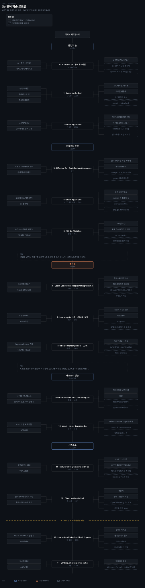

# Go 언어 학습 로드맵
---

## 이 순서를 잡은 기준

> Go 는 문법이 작아서 사흘이면 읽히지만, 그 작은 문법이 만드는 관용구는 Java 를 오래 쓴 사람에게 계속 걸립니다. 이 로드맵은 문법을 빨리 통과하고 **관용구와 동시성에 시간을 몰아주는** 순서입니다.

순서를 잡은 규칙은 둘입니다. 첫째, **뒤 단계가 앞 단계의 어휘로 설명되도록** 놓았습니다. `context` 로 취소를 전파하는 코드를 읽으려면 채널과 select 를 먼저 알아야 하고, 고루틴 누수를 이해하려면 채널이 언제 막히는지를 알아야 합니다.

둘째, **Spring 에서 Java 를 쓰던 습관이 어긋나는 자리에 단계를 더 두었습니다.** 인터페이스를 구현 쪽이 아니라 쓰는 쪽에서 선언하는 것, 예외 대신 에러를 값으로 돌려받는 것, 상속 대신 임베딩을 쓰는 것, 스레드풀 대신 고루틴을 값싸게 만드는 것이 그런 자리입니다. 문법을 다 외워도 이 넷을 모르면 Go 로 Java 를 쓰게 됩니다.

도식은 위에서 아래로 읽습니다. 실선 박스는 책과 공식 문서가 다루는 개념이고, 점선 박스는 그 밖에서 채울 키워드입니다. 단계마다 표를 둘 두는데 하나는 개념이고 다른 하나는 **책 밖 키워드**입니다.

## 무엇을 고르고 무엇을 걸렀는가

> 사용자 평가를 근거로 골랐습니다. 아래 수치는 2026-09-05 에 Goodreads 에서 직접 조회한 값입니다.

| 책 | 출간 | 평점 | 평가 수 | 보유 | 로드맵에서의 자리 |
|---|:---:|:---:|:---:|:---:|---|
| Learn Go with Pocket-Sized Projects | 2025 | 4.60 | 10 | 보유 | 13단계. 조건부 |
| Learning Go, 2nd Edition | 2024 | 4.42 | 521 | 보유 | 1·2·4·7·9·10단계의 기둥 |
| Cloud Native Go, 2nd Edition | 2024 | 4.22 | 93 | 보유 | 12단계 |
| Learn Concurrent Programming with Go | 2023 | 4.23 | 31 | 보유 | 6·7·8단계 |
| 100 Go Mistakes and How to Avoid Them | 2022 | 4.66 | 263 | 미보유 | 5단계. 관용구와 함정의 중심 |
| Network Programming with Go | 2020 | 4.10 | 51 | 보유 | 11단계 |
| Writing An Interpreter In Go | 2020 | 4.60 | 354 | 보유 | 14단계. 조건부 |
| Learn Go with Tests | 온라인 | 4.44 | 39 | 무료 | 9단계 |

**거른 책은 셋입니다.** Efficient Go 는 3.55점(40개)이라 성능 축을 맡기기에 평가가 낮습니다. 그래서 10단계를 공식 `pprof`·`trace` 문서로 대신했습니다. Distributed Services with Go 는 3.71점(85개)이라 12단계를 Cloud Native Go 로 채웠습니다.

Alex Edwards 의 Let's Go 는 Go 웹 개발서로 자주 거론되지만 Goodreads 에 등재돼 있지 않습니다. 평가를 확인하지 못한 것을 추천 목록에 올리지는 않았습니다.

**낡은 책은 평점과 무관하게 뺐습니다.** 출간 연도는 Manning·OpenLibrary·Goodreads 에서 2026-09-05 에 확인했습니다.

기준은 주제가 바뀌는 속도입니다. 언어 문법·표준 라이브러리·도구처럼 **빨리 바뀌는 축은 5년**을 넘기면 단계에서 뺍니다. 프로토콜이나 컴파일러 구성처럼 느리게 바뀌는 축은 오래돼도 남기되 무엇이 낡았는지를 적습니다.

The Go Programming Language 는 평가 수가 1,788개로 압도적이지만 2015년 책이라 제네릭과 모듈 이전입니다. 문법의 근거가 필요하면 지금도 갱신되는 [Language Specification](https://go.dev/ref/spec) 이 더 정확하므로 목록에서 뺐습니다.

Concurrency in Go 는 2017년 9월 책이고 2판이 나오지 않았습니다. 모듈과 제네릭 이전이고 타입 있는 원자 연산도 `errgroup` 도 표준 관용구가 되기 전입니다. 패턴 카탈로그는 지금도 인용되지만 같은 내용을 2023년 11월 책인 Learn Concurrent Programming with Go 8~10장이 덮으므로 뺐습니다. 그 셋이 각각 select, 채널 프로그래밍, 동시성 패턴이라 자리가 정확히 겹칩니다.

남긴 예외는 하나입니다. Writing An Interpreter In Go 는 2020년 5월 1.7판이고, 인터프리터를 짓는 일 자체가 언어 버전을 거의 타지 않습니다.

Network Programming with Go 는 2020년 책이라 단계에 남기되 무엇이 빠졌는지를 11단계에 적어 두었습니다. `net` 패키지 자체는 안정적이지만 표준 라이브러리의 구조화 로깅과 라우팅 패턴이 그 뒤에 들어왔습니다.

공식 문서는 평점 대상이 아니어서 표에 없지만 0·3·8·10단계의 절반을 차지합니다. [A Tour of Go](https://go.dev/tour/), [Effective Go](https://go.dev/doc/effective_go), [The Go Memory Model](https://go.dev/ref/mem), [Language Specification](https://go.dev/ref/spec) 은 go.dev 가 직접 학습 경로로 제시하는 자료입니다.

## 구하는 곳

> Drive 에 없는 것은 100 Go Mistakes 하나뿐이고 나머지는 공식 문서이거나 이미 손에 있습니다. 어디서 구하는지와 무료로 볼 수 있는 범위를 2026-09-05 에 직접 확인해 적습니다.

| 자료 | 구하는 곳 | 무료로 볼 수 있는 것 |
|---|---|---|
| A Tour of Go · Effective Go · Language Specification · The Go Memory Model | [go.dev](https://go.dev/doc/) | 전부. 로그인도 결제도 없습니다 |
| Learn Go with Tests | [quii.gitbook.io/learn-go-with-tests](https://quii.gitbook.io/learn-go-with-tests) | 전부. MIT 라이선스 |
| 100 Go Mistakes | Manning 발행. 요약은 [100go.co](https://100go.co/) | 100개 항목의 요약과 코드 예제. 본문은 아닙니다 |
| Writing An Interpreter In Go · A Compiler In Go | [interpreterbook.com](https://interpreterbook.com/) 저자 직판. 둘 다 Drive 에 있습니다 | 샘플 PDF, 목차 PDF, The Lost Chapter |

**The Go Memory Model 은 책이 아닙니다.** go.dev 에 있는 한 페이지짜리 명세 문서이고 전문이 공개돼 있습니다. 2022-06-06 판이며 happens-before 정의, 채널·뮤텍스·`sync.Once`·원자 연산의 동기화 보장, 잘못된 동기화 예시까지 이 한 장에 들어 있습니다. 8단계가 문서 하나로 서는 이유가 그것입니다.

**Writing An Interpreter In Go 와 후속작은 Drive 에 있습니다.** 각각 2020년 5월 1.7판과 2019년 5월 1.2판입니다. 구하는 경로를 남겨 두면, 저자가 `interpreterbook.com` 에서 직접 팔고 eBook 이 29달러(PDF·ePub·Mobi·HTML), 종이책이 아마존으로 39달러이며 둘을 묶으면 50달러입니다. 공식 사이트가 적어 둔 판매처는 저자 직판과 아마존 둘뿐이라 O'Reilly 에서 구할 가능성은 낮아 보입니다. 다만 O'Reilly 카탈로그는 로그인 뒤에 있어 직접 확인하지는 못했으므로 단정하지 않습니다.

돈을 쓰지 않고 갈 수 있는 범위는 생각보다 넓습니다. 0·3·8·10단계는 공식 문서만으로 서고 9단계는 Learn Go with Tests 로 전부 무료입니다. 5단계도 100go.co 요약으로 절반은 따라갑니다.

유료가 필요한 자리는 5단계의 100 Go Mistakes 하나입니다. 1·2·4단계의 Learning Go 2판과 6·7·8단계의 LCPG, 11단계, 12단계, 13·14단계는 모두 Drive 에 있습니다.

## 문법과 손 · 0~2단계

> 문법은 빨리 통과합니다. 여기서 오래 머물면 정작 시간을 써야 할 관용구와 동시성에 못 갑니다.

### 0단계 · A Tour of Go 와 공식 튜토리얼

먼저 손이 움직여야 책이 읽힙니다. 브라우저에서 코드를 고쳐 돌려 보는 투어가 가장 빠른 진입로이고, 여기서 문법을 다 잡으려 하지 말고 "이렇게 생겼구나"까지만 가져갑니다.

| 개념 | 무엇을 알게 되는가 |
|---|---|
| 값·변수·제어문 | 세미콜론이 없고 `for` 하나가 모든 반복을 맡는 형태 |
| 메서드와 인터페이스 | 클래스 없이 타입에 메서드를 붙이는 방식 |
| 고루틴과 채널 맛보기 | 동시성이 언어 문법 안에 있다는 사실 |

| 책 밖 키워드 | 왜 보는가 |
|---|---|
| Go 설치와 `go mod init` | 프로젝트가 시작되는 최소 형태 |
| go.dev 시작 튜토리얼 여덟 | 모듈·워크스페이스·제네릭·퍼징·DB·JSON 을 각각 짧게 |

### 1단계 · Learning Go 2nd 1~6장

투어에서 훑은 것을 이유와 함께 다시 세웁니다. Java 와 가장 먼저 어긋나는 곳은 **값 의미론**입니다. 구조체를 넘기면 복사되고, 슬라이스를 넘기면 헤더만 복사되며 배열은 공유됩니다. 이 차이를 모르면 나중에 슬라이스 버그를 원인 없이 만나게 됩니다.

| 개념 | 무엇을 알게 되는가 |
|---|---|
| 선언과 타입 | `var` 와 `:=` 를 언제 나눠 쓰는가 |
| 슬라이스와 맵 | 길이와 용량, 재할당이 일어나는 순간 |
| 함수와 클로저 | 다중 반환값과 `defer` 가 만드는 관용구 |
| 포인터와 값 의미론 | 무엇이 복사되고 무엇이 공유되는가 |
| 제로값 관용구 | 초기화 없이 바로 쓸 수 있게 타입을 설계하기 |

| 책 밖 키워드 | 왜 보는가 |
|---|---|
| 이스케이프 분석 | 무엇이 힙으로 가는지가 성능의 출발점 |
| `go vet` 과 staticcheck | 컴파일러가 안 잡는 실수를 잡는 도구 |

### 2단계 · Learning Go 2nd 7~9장

Java 습관이 가장 크게 어긋나는 구간입니다. 인터페이스를 **쓰는 쪽에서 작게 선언**하고 구현 타입은 그 사실을 모릅니다. `implements` 가 없으므로 의존이 한 방향으로만 흐르고, 그래서 작은 인터페이스가 좋은 설계가 됩니다.

에러도 다릅니다. 예외를 던지는 대신 마지막 반환값으로 에러를 돌려주므로, 호출부가 매번 판단을 적게 됩니다. 장황해 보이지만 어디서 무엇이 실패하는지가 코드에 남습니다.

| 개념 | 무엇을 알게 되는가 |
|---|---|
| 타입과 메서드 | 클래스 없이 동작을 붙이는 방식, 포인터 리시버와 값 리시버 |
| 구조체 임베딩 | 상속이 아니라 합성으로 재사용하기 |
| 인터페이스 암묵 구현 | 쓰는 쪽에서 선언하는 작은 인터페이스 |
| 제네릭과 타입 파라미터 | 1.18 이후 무엇이 가능해졌고 무엇이 여전히 안 되는가 |
| 에러를 값으로 다루기 | 예외가 없는 언어에서 실패를 표현하는 법 |

| 책 밖 키워드 | 왜 보는가 |
|---|---|
| `errors.Is`·`As`·`%w` 래핑 | 에러에 맥락을 얹으면서 원인을 잃지 않기 |
| 인터페이스 오염 피하기 | 미리 만든 큰 인터페이스가 Go 에서 손해인 이유 |

## 관용구와 도구 · 3~5단계

> 문법을 알아도 관용구를 모르면 Go 로 Java 를 쓰게 됩니다. 이 구간이 그 간격을 메웁니다.

### 3단계 · Effective Go 와 Code Review Comments

Go 는 스타일 논쟁을 `gofmt` 로 끝내고, 남은 합의를 문서로 남겼습니다. 이 둘은 분량이 짧지만 코드 리뷰에서 실제로 인용되는 기준이라 먼저 읽습니다.

| 개념 | 무엇을 알게 되는가 |
|---|---|
| 이름 짓기와 패키지 경계 | 짧은 이름이 권장되는 이유와 패키지명이 하는 역할 |
| 관용적 에러 처리 | 언제 감싸고 언제 그대로 올리는가 |
| 인터페이스는 쓰는 쪽에서 | 2단계의 원칙이 문서로 명시된 자리 |
| 동시성 관용구 | 공유 메모리로 통신하지 말고 통신으로 공유하라 |

| 책 밖 키워드 | 왜 보는가 |
|---|---|
| Google Go Style Guide | 회사 규모에서 굳은 관례 |
| `gofmt` 가 끝낸 논쟁 | 포맷을 도구에 넘긴 결정의 효과 |

### 4단계 · Learning Go 2nd 10·11·13·14장

도구와 표준 라이브러리를 잡는 구간입니다. Maven 이나 Gradle 과 달리 Go 모듈은 **최소 버전 선택**을 쓰므로, 의존성이 저절로 올라가지 않습니다. 이 차이를 모르면 왜 버전이 안 바뀌는지에서 막힙니다.

`context` 는 Java 의 `ThreadLocal` 자리에 있는 것처럼 보이지만 실제 역할은 **취소 전파**입니다. 요청 하나가 끝날 때 그 아래 고루틴을 모두 정리하는 장치라, 7단계의 취소 전파와 이어집니다.

| 개념 | 무엇을 알게 되는가 |
|---|---|
| 모듈과 최소 버전 선택 | 의존성이 언제 올라가고 언제 고정되는가 |
| go 툴체인 | `build`·`test`·`generate`·`work` 가 각각 맡는 일 |
| 표준 라이브러리 | 프레임워크 없이 서비스가 서는 이유 |
| `context` 의 취소와 값 | 요청 수명과 고루틴 수명을 묶는 장치 |

| 책 밖 키워드 | 왜 보는가 |
|---|---|
| workspace 모드 | 여러 모듈을 한 번에 고칠 때 |
| pkg.go.dev 읽는 법 | 표준 라이브러리를 문서에서 바로 확인하기 |

### 5단계 · 100 Go Mistakes and How to Avoid Them

평가가 가장 높은 책이고, 이 로드맵에서 관용구 축의 중심입니다. 문법을 아는 상태에서 읽어야 값이 나오므로 4단계 뒤에 둡니다. 한 항목이 짧아 앞에서 배운 것을 하나씩 되짚는 방식으로 읽힙니다.

| 개념 | 무엇을 알게 되는가 |
|---|---|
| 슬라이스 공유와 재할당 | `append` 가 원본을 바꾸는 경우와 아닌 경우 |
| 인터페이스와 nil | nil 포인터를 담은 인터페이스가 nil 이 아닌 이유 |
| 고루틴 누수 | 끝나지 않는 고루틴이 쌓이는 전형적 형태 |
| 표준 라이브러리의 함정 | `time`·`http`·`json` 에서 자주 밟는 곳 |

| 책 밖 키워드 | 왜 보는가 |
|---|---|
| race detector | `go test -race` 로 경합을 실제로 잡기 |
| 벤치마크로 확인하기 | 느낌이 아니라 수치로 판단하는 습관 |

## 동시성 · 6~8단계

> 이 로드맵에서 가장 큰 덩어리입니다. Go 를 쓰는 이유의 절반이 여기 있고, Java 의 스레드 감각이 가장 크게 어긋나는 곳이기도 합니다.

### 6단계 · Learn Concurrent Programming with Go 1~7장

Go 문법으로 바로 들어가지 않고 동시성 자체를 먼저 봅니다. 스레드가 무엇이고 메모리 공유가 왜 위험한지를 세운 뒤에야 "채널로 통신하라"는 권고가 권고 이상으로 읽힙니다.

| 개념 | 무엇을 알게 되는가 |
|---|---|
| 스레드와 고루틴 | 고루틴이 값싼 이유와 그 대가 |
| 메모리 공유의 위험 | 경합이 만들어지는 최소 조건 |
| 뮤텍스와 조건변수 | 잠금으로 푸는 방식의 기본기 |
| 웨이트그룹과 배리어 | 여럿이 끝나기를 기다리는 방법 |
| 메시지 패싱 | 공유하지 않고 넘겨서 푸는 방식 |

| 책 밖 키워드 | 왜 보는가 |
|---|---|
| GOMAXPROCS 와 스케줄러 | 고루틴이 OS 스레드에 얹히는 구조 |
| 세마포어 패턴 | 버퍼 채널로 동시 실행 수를 제한하기 |

### 7단계 · Learning Go 2nd 12장과 LCPG 8~10장

앞 단계가 원리라면 여기는 Go 의 관용구입니다. 채널과 select 로 파이프라인을 짜고, 취소를 아래로 전파하는 형태가 핵심입니다. 4단계의 `context` 가 여기서 회수됩니다.

이 자리에 흔히 놓이는 Concurrency in Go 는 2017년 책이라 넣지 않았습니다. 같은 내용을 Learn Concurrent Programming with Go 8~10장이 6년 뒤 시점으로 덮습니다.

**채널이 항상 답은 아닙니다.** 단순히 상태를 보호하는 일이라면 뮤텍스가 더 싸고 읽기 쉽습니다. 어느 쪽을 고를지 판단하는 기준을 이 단계에서 만듭니다.

| 개념 | 무엇을 알게 되는가 |
|---|---|
| 채널과 select | 방향, 버퍼, 닫힘이 만드는 동작 차이 |
| 파이프라인 | 단계를 고루틴으로 잇는 형태 |
| fan-in 과 fan-out | 일을 흩고 모으는 패턴 |
| 취소 전파 | `context` 로 하위 고루틴을 정리하기 |

| 책 밖 키워드 | 왜 보는가 |
|---|---|
| `errgroup` | 여럿 중 하나가 실패했을 때 전부 접기 |
| 채널 대신 뮤텍스를 고를 때 | 관용구를 기계적으로 적용하지 않기 |

### 8단계 · The Go Memory Model 과 LCPG 11~12장

"경합이 없다"를 말하려면 무엇이 무엇보다 먼저 일어나는지를 정의해야 합니다. 공식 메모리 모델 문서가 그 규칙이고, 짧지만 앞 두 단계를 다 읽고 봐야 뜻이 잡힙니다.

| 개념 | 무엇을 알게 되는가 |
|---|---|
| happens-before 관계 | 한 고루틴의 쓰기를 다른 고루틴이 보게 되는 조건 |
| 데드락의 네 조건 | 무엇 하나만 깨도 풀린다는 사실 |
| 원자 연산과 스핀락 | 잠금 없이 푸는 방식과 그 한계 |

| 책 밖 키워드 | 왜 보는가 |
|---|---|
| `sync.Once` 와 `atomic.Value` | 표준 라이브러리가 이미 푼 문제들 |
| false sharing | 캐시 라인이 만드는 보이지 않는 경합 |

## 테스트와 성능 · 9~10단계

> 남길 가치가 있는 코드로 만드는 구간입니다. Go 는 테스트와 프로파일링이 표준 도구에 들어 있어 따로 고를 것이 적습니다.

### 9단계 · Learn Go with Tests 와 Learning Go 2nd 15장

무료 온라인 자료지만 평가가 4.44점으로 낮지 않고, 문법을 테스트로 배우는 구성이라 앞에서 배운 것을 다시 훑는 효과가 있습니다. JUnit 과 Mockito 에 익숙하다면 **가짜를 라이브러리 없이 인터페이스로 만든다**는 점이 가장 큰 차이입니다.

| 개념 | 무엇을 알게 되는가 |
|---|---|
| 테이블 주도 테스트 | Go 에서 가장 흔한 테스트 형태 |
| 인터페이스로 가짜 만들기 | mock 라이브러리 없이 대역을 두는 법 |
| 커버리지와 벤치마크 | `go test` 에 들어 있는 측정 도구 |
| 퍼징 | 입력을 기계가 만들어 경계를 찾기 |

| 책 밖 키워드 | 왜 보는가 |
|---|---|
| testify 를 쓸지 말지 | 표준만으로 갈 것인가에 대한 커뮤니티의 갈림 |
| golden file 테스트 | 출력이 큰 경우의 관용구 |

### 10단계 · pprof·trace 공식 문서와 Learning Go 2nd 16장

Efficient Go 를 쓰지 않는 자리입니다. 평가가 3.55점으로 낮아 공식 프로파일링 문서로 대신하는데, Go 는 `net/http/pprof` 를 표준으로 갖고 있어 문서만으로도 실습이 됩니다.

16장은 `reflect`·`unsafe`·`cgo` 를 다루는데 셋 다 **쓰지 않는 것이 기본**입니다. 무엇을 잃는지 알고 나면 라이브러리가 왜 그것들을 피하는지 보입니다.

| 개념 | 무엇을 알게 되는가 |
|---|---|
| CPU 와 힙 프로파일 | 어디서 시간과 메모리를 쓰는지 재는 법 |
| 실행 추적 | 고루틴이 언제 막혔는지 시간축에서 보기 |
| `reflect`·`unsafe`·`cgo` 의 대가 | 타입 안전과 이식성을 내주는 자리 |

| 책 밖 키워드 | 왜 보는가 |
|---|---|
| GOGC 와 GOMEMLIMIT | 컨테이너에서 GC 를 다루는 두 손잡이 |
| 할당을 줄이는 법 | `sync.Pool` 과 사전 할당이 듣는 조건 |

## 서비스로 · 11~12단계

> 언어를 서비스로 바꾸는 구간입니다. Spring 없이 표준 라이브러리로 서버가 서는 경험이 여기서 나옵니다.

### 11단계 · Network Programming with Go 1~9장

`net/http` 로 시작하지 않고 소켓에서 올라옵니다. Spring MVC 가 감춰 주던 것들, 즉 연결이 언제 열리고 닫히는지, 타임아웃을 어디에 걸어야 하는지가 여기서 드러납니다.

| 개념 | 무엇을 알게 되는가 |
|---|---|
| 소켓과 주소 해석 | 이름이 주소가 되고 연결이 열리는 과정 |
| TCP 스트림 | 경계가 없는 바이트 흐름을 다루는 법 |
| UDP 와 신뢰성 | 없는 보장을 직접 만들어야 하는 자리 |
| HTTP 클라이언트와 서버 | 표준 라이브러리만으로 서비스를 세우기 |

| 책 밖 키워드 | 왜 보는가 |
|---|---|
| `net/http` 의 메서드·와일드카드 라우팅 | 2020년 책 이후에 들어온 표준 라우팅 패턴 |
| `log/slog` 구조화 로깅 | 이 책 이후 표준 라이브러리로 들어온 로깅 |
| `net/http` 미들웨어 패턴 | 필터 체인을 함수 합성으로 만드는 관용구 |
| 타임아웃 네 종류 | 클라이언트와 서버 양쪽에 거는 자리가 다르다 |

### 12단계 · Cloud Native Go 2nd 4~13장

언어를 넘어 서비스의 성질로 갑니다. 확장성·느슨한 결합·복원력·관측 가능성·보안을 Go 코드로 어떻게 표현하는지가 내용이고, [`network-roadmap.md`](network-roadmap.md) 의 메시 구간과 같은 문제를 애플리케이션 쪽에서 봅니다.

| 개념 | 무엇을 알게 되는가 |
|---|---|
| 클라우드 네이티브 패턴 | 회로차단·디바운스·재시도를 Go 로 쓰기 |
| 확장성과 느슨한 결합 | 상태를 어디에 둘 것인가 |
| 복원력 | 실패를 전제로 설계한다는 말의 구체 |
| 관측 가능성과 보안 | 지표·로그·추적을 서비스에 심기 |

| 책 밖 키워드 | 왜 보는가 |
|---|---|
| OpenTelemetry Go SDK | 계측의 사실상 표준 |
| 구조화 로깅 `slog` | 표준 라이브러리로 들어온 로깅 |

## 조건부 구간 · 13~14단계

> 목표가 생겼을 때만 엽니다. 순서대로 읽을 이유는 없습니다.

### 13단계 · Learn Go with Pocket-Sized Projects 전 12장

읽은 것이 손에 안 붙었다고 느낄 때 엽니다. 작은 프로젝트 열둘로 앞 단계를 다시 훑는 구성이라 복습에 가깝습니다. 평점은 4.60이지만 평가 수가 10개라 표본이 작다는 점은 감안합니다.

| 개념 | 무엇을 알게 되는가 |
|---|---|
| CLI 와 라이브러리 만들기 | 패키지 경계를 실제로 그어 보기 |
| 제네릭 캐시 | 2단계의 제네릭을 쓸 자리에서 쓰기 |
| gRPC 서비스 | 프로토콜 정의에서 서버까지 |
| 동시성 미로 풀이 | 7단계의 패턴을 문제에 적용 |

| 책 밖 키워드 | 왜 보는가 |
|---|---|
| 크로스 컴파일 | `GOOS`·`GOARCH` 로 배포 대상을 바꾸기 |
| `database/sql` 과 커넥션 풀 | JDBC 와 다른 부분 |

### 14단계 · Writing An Interpreter In Go

언어를 만들며 Go 를 쓰는 책입니다. Go 학습서가 아니라 Go 로 쓴 컴파일러 입문서라 순서상 맨 뒤에 둡니다. 평점 4.60에 평가 354개로 이 목록에서 안정적인 평가를 받은 축입니다.

저자가 계속 개정해 온 책이라 판이 여럿인데 Drive 에 있는 것은 2020년 5월 1.7판입니다. 인터프리터를 짓는 일 자체는 언어 버전을 거의 타지 않아 낡음 기준의 예외로 두었습니다.

다만 본문이 언급하는 Go 는 1.14 까지라 예제에 제네릭이 없고 모듈 이전 방식입니다. `go mod init` 으로 감싸고 시작하면 그대로 돌아갑니다.

| 개념 | 무엇을 알게 되는가 |
|---|---|
| 렉서와 파서 | 문자열이 토큰이 되고 트리가 되는 과정 |
| AST 순회 | 인터페이스와 타입 스위치를 실제로 쓰는 자리 |
| 평가기와 환경 | 스코프를 자료구조로 표현하기 |

| 책 밖 키워드 | 왜 보는가 |
|---|---|
| Writing A Compiler In Go | 같은 저자의 후속. 2019년 5월 1.2판이고 Drive 에 있습니다. 트리 순회 인터프리터를 바이트코드 VM 으로 바꿉니다 |

## 참조서와 이웃

> 단계에 넣지 않았지만 옆에 두는 자료입니다.

| 자료 | 언제 여는가 |
|---|---|
| Language Specification | 문법이 모호할 때의 최종 근거. 릴리스마다 갱신됩니다 |
| Go blog | 제네릭·에러 래핑·스케줄러 같은 주제의 1차 설명 |
| Learn Go with Pocket-Sized Projects 부록 | 벤치마킹·퍼징·값 전달·DB 연결을 짧게 확인할 때 |
| Cloud Native Go 1~3장 | Go 를 처음 볼 때의 도입부. 1단계와 겹칩니다 |

`~/podwire` 는 이 로드맵의 11단계 이후를 실제로 쓰는 자리입니다. 미니 CNI 에서 시작해 Service, Policy, eBPF, WireGuard 로 올라가는 Go 프로젝트라, 네트워크 쪽 순서는 [`network-roadmap.md`](network-roadmap.md) 가 맡습니다.
