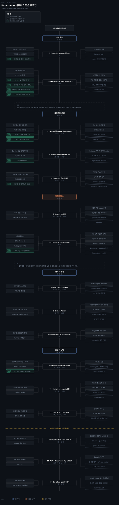

# Kubernetes 네트워크 학습 로드맵
---

## 이 순서를 잡은 기준

> Kubernetes 네트워크는 선언 API 한 층으로 끝나지 않습니다. Service 를 만들면 커널의 어느 훅이 켜지고 패킷이 어디로 도는지까지 봐야 요소를 다 봤다고 할 수 있고, 그 층들이 아래에서 위로 쌓이기 때문에 읽는 순서가 있습니다.

순서를 잡은 규칙은 하나입니다. **뒤 단계가 앞 단계의 어휘로 설명되도록 놓았습니다.** Cilium 이 "kube-proxy 를 대체한다"고 말할 때 그 문장이 뜻을 가지려면 Service 가 무엇을 선언하는지, iptables 가 무엇을 하고 있었는지, eBPF 훅이 패킷 여정의 어디에 붙는지를 이미 알아야 합니다. 그래서 클러스터 모델이 데이터패스 앞에 오고, 패킷을 눈으로 보는 능력이 그 앞에 옵니다.

도식은 위에서 아래로 읽습니다. 척추에 국면 다섯과 단계 열여섯을 걸고 각 단계의 개념을 좌우로 뻗었습니다. 좌우는 척추를 비우려는 배치일 뿐이라 개념 박스 사이에는 순서가 없습니다. 실선 박스는 책이 다루는 개념이고 점선 박스는 책이 다루지 않는 키워드입니다.

단계마다 표를 둘 둡니다. 하나는 책이 다루는 개념이고 다른 하나는 **책 밖 키워드**입니다. 책은 찍힌 시점에 멈춰 있고 Kubernetes 네트워크는 그 뒤로도 움직이므로, 책 밖 키워드의 기본값과 승격 단계는 공식 문서에서 다시 확인하고 표는 무엇을 검색할지 정하는 용도로만 씁니다.

0~12단계가 필수 구간으로 77장이고, 13~15단계는 조건부라 21장입니다. 책은 모두 Google Drive 의 `내 드라이브/book/` 아래에 있습니다.

## 낡음 점검

> 책은 찍힌 시점에 멈춥니다. 출간 연도를 OpenLibrary 와 출판사 페이지에서 2026-09-05 에 확인하고, 낡은 것은 단계에서 뺐습니다.

기준은 주제가 바뀌는 속도입니다. Kubernetes API·CNI·메시·클라이언트 라이브러리처럼 **빨리 바뀌는 축은 5년**을 넘기면 단계에서 빼고 공식 문서로 대신합니다. TCP/IP 프로토콜이나 암호 원리처럼 느리게 바뀌는 축은 오래돼도 남기되 무엇이 낡았는지를 적습니다.

| 책 | 출간 | 조치 |
|---|:---:|---|
| Learn Go with Pocket-Sized Projects · Container Security 2판 | 2025 | 그대로 |
| Kubernetes in Action 2nd · Learning eBPF · CKS Study Guide · Kubernetes Best Practices 2nd | 2023 | 그대로 |
| Istio in Action · Learning Modern Linux | 2022 | 그대로 |
| Networking and Kubernetes · Production Kubernetes | 2021 | 경계선. 그대로 두되 공식 문서와 대조 |
| Network Programming with Go | 2020 | 유지. 라우팅 패턴과 `log/slog` 는 책 밖 키워드로 |
| Learning CoreDNS | 2019 | 유지. 쿠버네티스 연동 장은 공식 DNS 스펙과 대조 |
| HTTP:2 in Action | 2019 | 프레이밍과 HPACK 만 씀. HTTP/3 은 RFC 로 |
| **Programming Kubernetes** | **2019** | **뺌.** client-go 가 그 뒤로 많이 바뀌어 공식 문서와 sample-controller 로 대신 |
| **High Performance Browser Networking** | **2013** | **뺌.** HTTP/2 가 초안이던 시점이라 QUIC·HTTP/3 이 아예 없음 |
| TCP:IP Illustrated 2판 | 2011 | 참조서로 유지. 프로토콜 자체는 그 뒤로 거의 안 바뀜 |

**Container Security 는 2판을 권합니다.** Drive 에 있는 것은 2020년 1판인데 2025년에 2판이 나왔습니다. 11단계가 쓰는 10·11장은 컨테이너 네트워크 보안과 TLS 라 그사이 바뀐 것이 적지 않습니다.

13단계와 15단계는 책을 빼면서 자리를 공식 자료로 채웠습니다. QUIC 은 [RFC 9000](https://www.rfc-editor.org/rfc/rfc9000.txt), HTTP/2 는 [RFC 9113](https://www.rfc-editor.org/rfc/rfc9113.txt), HTTP/3 은 [RFC 9114](https://www.rfc-editor.org/rfc/rfc9114.txt) 가 정본이고, 컨트롤러 작성은 Kubernetes 의 `sample-controller` 저장소가 현행 코드입니다.

## 바닥과 눈 · 0~1단계

> 패킷을 직접 보지 못하면 이후 모든 단계가 남의 말을 옮기는 일이 됩니다. 먼저 볼 수 있게 만들고 시작합니다.

### 0단계 · Learning Modern Linux 7장

Kubernetes 네트워크 문서는 "Pod 마다 네트워크 네임스페이스가 있다"는 문장에서 출발하는데, 그 네임스페이스가 무엇을 격리하는지 모르면 문장이 통과만 하고 남지 않습니다. 30분짜리 복습이고, 이미 아는 내용이면 건너뛰어도 됩니다.

| 개념 | 무엇을 알게 되는가 |
|---|---|
| 네트워크 네임스페이스 | Pod 마다 따로 갖는 격리 단위. 무엇이 격리되고 무엇이 공유되는가 |
| 인터페이스와 라우팅 테이블 | 네임스페이스 안에서 패킷이 어느 인터페이스로 나가는지 정하는 규칙 |
| `ip`·`ss` 진단 도구 | 위 둘을 눈으로 확인하는 명령 |

| 책 밖 키워드 | 왜 보는가 |
|---|---|
| `ip netns` 실습 | 네임스페이스를 손으로 만들어 넣고 빼 보기 |
| veth pair 와 브리지 | Pod 네트워크가 조립되는 방식을 맨손으로 재현 |
| `nsenter` | 다른 네임스페이스 안으로 들어가 진단하기 |

### 1단계 · Packet Analysis with Wireshark 1~5장

이 단계의 목적은 지식이 아니라 **반증 능력**입니다. 뒤에서 만날 "Cilium 은 iptables 를 건너뛴다", "mTLS 가 걸려 있다" 같은 주장을 캡처로 확인할 수 있어야 남의 설명을 그대로 옮기지 않게 됩니다.

이 책은 장별 PDF 가 아니라 절 단위로 쪼개져 있습니다. `1. Packet Analyzers` 같은 파일이 장 표지고, `3TCP connection establishment` 처럼 앞 숫자가 장 번호인 파일들이 본문이라 1~5장이 33개 파일입니다.

| 개념 | 무엇을 알게 되는가 |
|---|---|
| 캡처와 필터 문법 | 원하는 패킷만 남기는 법. 이후 모든 확인의 전제 |
| TCP 수립·종료 시퀀스 | 3-way 와 종료 절차를 시퀀스 번호로 읽기 |
| 재전송과 지연 분석 | 느린 원인이 앱인지 네트워크인지 가르는 근거 |
| TLS 핸드셰이크와 복호화 | 키 교환 절차, 그리고 캡처를 복호화해 안을 보는 방법 |
| DHCP·DNS·HTTP 해부 | 클러스터에서 가장 자주 깨지는 세 프로토콜 |

| 책 밖 키워드 | 왜 보는가 |
|---|---|
| `kubectl debug` 임시 컨테이너 | 이미지에 도구가 없는 Pod 에서 캡처를 뜨는 법 |
| MTU 와 PMTUD 블랙홀 | 오버레이에서 큰 패킷만 사라지는 전형적 장애 |
| conntrack 테이블 포화 | 연결이 갑자기 끊기는 원인 중 가장 흔한 하나 |
| `pwru` | 커널 안에서 패킷이 어디서 버려졌는지 추적 |

## 클러스터 모델 · 2~4단계

> 커널로 내려가기 전에 Kubernetes 가 무엇을 선언하는지 먼저 세웁니다. 이 어휘가 없으면 데이터패스를 읽어도 무엇을 구현한 것인지 모릅니다.

### 2단계 · Networking and Kubernetes 3~5장

컨테이너 하나가 네트워크를 갖는 방식에서 시작해 Pod 네트워크 모델과 Service 추상화까지 한 번에 올라갑니다. "모든 Pod 는 NAT 없이 서로 통신한다"는 모델의 요구사항이 왜 CNI 라는 별도 규약을 낳았는지가 이 구간의 논지입니다.

| 개념 | 무엇을 알게 되는가 |
|---|---|
| 컨테이너 네트워킹 모드 | bridge·host·none 이 각각 무엇을 포기하고 무엇을 얻는가 |
| Pod 네트워크 모델 | NAT 없는 평평한 주소 공간이라는 요구사항과 그 결과 |
| CNI 의 자리 | 그 요구사항을 누가 어떻게 만족시키는가 |
| Service 다섯 유형 | ClusterIP·NodePort·LoadBalancer·ExternalName·Headless |
| EndpointSlice | Service 뒤의 실제 Pod 목록이 관리되는 단위 |

| 책 밖 키워드 | 왜 보는가 |
|---|---|
| CNI 스펙과 플러그인 체이닝 | Cilium 도 그 규약 위에 있다 |
| Multus 와 SR-IOV | Pod 에 인터페이스를 여럿 붙여야 할 때 |
| IPv4/IPv6 듀얼스택 | 주소 계열이 둘일 때 달라지는 것 |

### 3단계 · Kubernetes in Action 2nd 11~13장

앞 단계가 모델이라면 여기는 그 모델을 쓰는 선언 API 입니다. 같은 대상을 API 축에서 한 번 더 보는 이유는, 뒤에서 Cilium 과 Istio 가 이 API 를 각자 다르게 구현하는 것을 볼 것이기 때문입니다.

| 개념 | 무엇을 알게 되는가 |
|---|---|
| Service 선언과 세션 어피니티 | 클라이언트를 같은 Pod 로 묶는 조건 |
| 트래픽 정책 | `internalTrafficPolicy`·`externalTrafficPolicy` 가 바꾸는 경로 |
| Ingress 와 TLS | 하나의 IP 뒤에 여러 서비스를 두는 방식 |
| Gateway API 와 HTTPRoute | Ingress 의 한계와 역할 분리 설계 |

| 책 밖 키워드 | 왜 보는가 |
|---|---|
| Gateway API 의 GAMMA | 메시까지 Gateway API 로 표현하려는 흐름 |
| Ingress 에서 Gateway API 로 이행 | 기존 자원을 어떻게 옮길 것인가 |
| Topology Aware Routing | 같은 존 안으로 트래픽을 몰아 비용을 줄이기 |

### 4단계 · Learning CoreDNS 1~8장

2019년 책이라 쿠버네티스 연동을 다루는 6장은 공식 DNS 스펙과 대조하며 읽습니다. Service 를 만들면 이름이 생깁니다. 그 이름을 푸는 일이 클러스터 안에서 가장 자주 깨지는 지점이라 별도 단계로 둡니다. DNS 는 Service 와 짝이지 부록이 아닙니다.

| 개념 | 무엇을 알게 되는가 |
|---|---|
| Corefile 과 플러그인 체인 | 하나의 서버가 플러그인 조합으로 성격이 바뀌는 구조 |
| 존 데이터와 위임 | 위임이 그은 경계가 질의 경로를 정한다 |
| 쿠버네티스 서비스 디스커버리 | Service·Pod 에 어떤 레코드가 생기는가 |
| 질의 조작과 응답 재작성 | 질문과 답이 어긋나면 클라이언트가 버린다 |
| 모니터링과 트러블슈팅 | 무엇을 볼지 좁히는 손잡이 |

| 책 밖 키워드 | 왜 보는가 |
|---|---|
| `ndots:5` 와 search 도메인 | 질의가 다섯 배로 튀는 기본값 |
| NodeLocal DNSCache | 그 폭증을 노드에서 흡수하는 방식 |
| CoreDNS autopath | search 도메인 순회를 서버가 대신 하기 |
| TTL 과 캐시 | 바뀐 이름이 언제 반영되는가 |

## 데이터패스 · 5~6단계

> 이 로드맵에서 가장 큰 덩어리입니다. 앞에서 선언한 것이 실제 패킷 경로가 되는 지점을 여기서 봅니다.

### 5단계 · Learning eBPF 1~3장, 6~9장

kube-proxy 가 iptables 규칙 수천 개를 선형으로 훑는 구조를 왜 떠났는지 이해하려면, 그 대안이 커널의 어디에 어떻게 끼어드는지를 먼저 알아야 합니다.

7장과 8장이 이 단계의 핵심입니다. 훅이 붙는 자리는 셋인데 XDP 는 드라이버 수준이라 커널 스택에 들어오기 전에 처리하고, TC 훅은 스택 안쪽에서, socket 훅은 소켓 계층에서 동작합니다. **이 세 위치의 차이가 곧 성능과 가시성의 트레이드오프입니다.** 4~5장과 10~11장은 직접 프로그램을 짤 때 필요하니 읽는 것이 목적이면 넘어갑니다.

| 개념 | 무엇을 알게 되는가 |
|---|---|
| eBPF 프로그램과 맵 | 커널 안 프로그램과 사용자 공간이 상태를 주고받는 유일한 통로 |
| verifier 제약 | 반복문과 포인터 제한이 곧 안전성 주장의 근거 |
| XDP 훅 | 드라이버 수준. 커널 스택에 들어오기 전에 패킷을 처리 |
| TC 훅 | 스택 안쪽. 대부분의 CNI 가 쓰는 자리 |
| socket 훅 | 소켓 계층. 연결 단위로 개입 |
| eBPF 보안 관측 | 같은 기술이 런타임 보안으로 쓰이는 축 (9장) |

| 책 밖 키워드 | 왜 보는가 |
|---|---|
| cgroup·sockops·sockmap 훅 | 네트워킹 훅 셋 말고도 붙는 자리가 있다 |
| XDP 의 native 와 generic 모드 | 드라이버가 지원하지 않으면 성능 이점이 사라진다 |
| BPF 맵 종류와 `bpftool` | 맵을 직접 열어 보며 상태를 확인하기 |

### 6단계 · Cilium Up and Running 전 16장

앞 단계가 원리라면 여기는 그 원리로 지은 실물입니다. 2장 Inside Cilium 과 5장 The Cilium Datapath 가 중심이고, "kube-proxy 를 대체한다"는 문장의 실체가 여기서 확정됩니다.

정책은 12장과 13장인데 **정책을 IP 가 아니라 identity 로 쓴다는 발상**이 여기서 나옵니다. Pod IP 가 수시로 바뀌는 환경에서 IP 기반 규칙이 왜 무너지는지를 함께 읽으면 7단계의 정책 도구들이 무엇을 자동화하려는지 보입니다. 14장의 WireGuard·IPsec 비교는 12단계의 mTLS 와 층이 다른 암호화라, 둘을 구분해 두면 "메시가 있는데 왜 또 암호화하는가"를 설명할 수 있게 됩니다.

| 개념 | 무엇을 알게 되는가 |
|---|---|
| 데이터패스 | Pod 에서 나온 패킷이 노드를 지나 다른 Pod 로 가는 실제 경로 (5장) |
| IPAM | Pod IP 를 누가 어떤 단위로 나눠 주는가 (4장) |
| kube-proxy 대체 | Service 가 eBPF 맵 조회로 바뀌는 과정 (6장) |
| identity 기반 정책 | IP 가 아니라 identity 로 쓰는 L3/L4 정책 (12장) |
| L7·FQDN 정책 | HTTP 메서드와 도메인 단위 허용 (13장) |
| egress 게이트웨이 | 클러스터 밖으로 나가는 트래픽의 출구를 고정 (11장) |
| 전송 암호화 | WireGuard 와 IPsec (14장) |
| Hubble 흐름 관측 | 지금까지 배운 경로를 흐름 단위로 보는 도구 (15장) |

| 책 밖 키워드 | 왜 보는가 |
|---|---|
| kube-proxy 의 nftables 모드 | iptables 를 떠나는 또 다른 길 |
| ClusterMesh · netkit · BIG TCP | 멀티클러스터와 최근의 성능 작업 |
| EndpointSlice 미러링 | 외부 엔드포인트가 클러스터 안으로 들어오는 방식 |

## 정책과 메시 · 7~9단계

> 무엇을 어디서 막고 어디서 신원을 붙이는가를 정리합니다. 데이터패스에서 막는 것과 어드미션에서 막는 것은 층이 다릅니다.

### 7단계 · Policy as Code 4·5·7·8장, Kubernetes Best Practices 9·11장

NetworkPolicy 는 트래픽이 흐를 때 막고, 어드미션 컨트롤은 그 정책이 만들어지기 전에 막습니다. 층이 다르므로 둘 다 필요합니다. Gatekeeper 가 Rego 를 쓰는 반면 Kyverno 는 YAML 로 규칙을 쓴다는 차이가 도입 비용을 가릅니다.

| 개념 | 무엇을 알게 되는가 |
|---|---|
| OPA 와 Rego | Kubernetes 리소스를 판정하는 규칙 언어 |
| 어드미션 컨트롤 | 정책이 만들어지기 전에 막는 층 |
| Gatekeeper | Rego 로 규칙을 쓰는 구현 |
| Kyverno | YAML 로 규칙을 쓰는 구현. 도입 비용이 갈리는 지점 |
| 네트워크 보안 관례 | 현장에서 정하는 기본값 (KBP 9·11장) |

| 책 밖 키워드 | 왜 보는가 |
|---|---|
| NetworkPolicy 의 한계 | egress DNS 와 CIDR 규칙이 잘 듣지 않는 이유 |
| AdminNetworkPolicy | 관리자가 네임스페이스 위에서 거는 정책 |
| ValidatingAdmissionPolicy 와 CEL | 외부 컨트롤러 없이 API 서버가 직접 판정 |

### 8단계 · Istio in Action 1~9장

앰비언트를 이해하려면 그것이 무엇을 줄이려 했는지를 먼저 알아야 합니다. 사이드카 메시가 무엇을 인프라로 밀어냈고 그 대가로 무엇을 냈는지가 이 단계의 내용입니다.

메시는 앞 단계까지의 L3/L4 정책 위에 **애플리케이션 수준의 신원과 라우팅**을 얹습니다. Envoy 가 그 일을 실제로 하는 프로세스라, 3장에서 데이터 플레인을 따로 보는 것이 이후 앰비언트의 ztunnel 과 waypoint 를 읽는 바탕이 됩니다.

| 개념 | 무엇을 알게 되는가 |
|---|---|
| 메시가 인프라로 민 것 | 재시도·타임아웃·회로차단이 앱을 떠나는 이유 |
| Envoy 와 데이터 플레인 | 실제로 트래픽을 나르는 프로세스 |
| 게이트웨이 | 클러스터 안으로 트래픽을 들이는 문 |
| 트래픽 라우팅 | 가중치·헤더 기반 분기와 카나리 |
| 복원력 | 실패를 견디는 일을 프록시로 옮겼을 때 |
| mTLS 와 메시 관측 | 서비스 간 신원, 그리고 그 위에서 얻는 지표 |

| 책 밖 키워드 | 왜 보는가 |
|---|---|
| Envoy 의 xDS 프로토콜 | 컨트롤 플레인이 프록시에 설정을 미는 방식 |
| SPIFFE 와 SPIRE | 메시 신원의 표준 규격 |
| Gateway API 와 메시의 접점 | GAMMA 가 메시 라우팅을 표준으로 끌어오는 방향 |

### 9단계 · Sidecar-less Istio Explained 전 4장

사이드카 메시는 Pod 마다 프록시를 하나씩 붙여 리소스와 업그레이드 비용을 냈습니다. 앰비언트 모드는 그 비용을 줄이려고 층을 둘로 쪼갭니다. 5단계에서 본 eBPF 훅 지식이 여기서 회수되는데, ztunnel 로 트래픽을 우회시키는 방식이 커널 훅 위에서 동작하기 때문입니다.

| 개념 | 무엇을 알게 되는가 |
|---|---|
| 앰비언트 모드의 전제 | 대부분의 워크로드가 L7 정책을 쓰지 않는다는 관찰 |
| ztunnel | 노드마다 하나씩 떠서 L4 와 mTLS 를 맡는 프록시 |
| waypoint | L7 처리가 필요할 때만 뜨는 프록시 |
| 사이드카와의 차이 | 기존 메시를 어떤 조건에서 옮길지 판단하는 근거 |

| 책 밖 키워드 | 왜 보는가 |
|---|---|
| waypoint 를 어느 단위로 둘지 | 네임스페이스 단위와 서비스 단위의 차이 |
| 앰비언트의 성숙도 | 어느 기능이 아직 사이드카에만 있는가 |

## 운영과 신뢰 · 10~12단계

> 고르는 법과 지키는 법입니다. 여기까지 오면 클러스터의 네트워크를 남에게 설명할 수 있게 됩니다.

### 10단계 · Production Kubernetes 5·6·10장

앞에서 Cilium 한 구현을 깊게 봤으니, 이제 여러 구현을 놓고 고르는 축이 필요합니다. 캡슐화 오버헤드를 낼 것인가, 아니면 하부 네트워크에 라우팅을 요구할 것인가라는 선택이 5장의 핵심입니다.

| 개념 | 무엇을 알게 되는가 |
|---|---|
| 오버레이 대 네이티브 라우팅 | 캡슐화 오버헤드냐, 하부 네트워크 요구냐 |
| BGP | 하부 네트워크와 경로를 나누는 방식 |
| 서비스 라우팅 선택 | kube-proxy 모드와 대안, Ingress 컨트롤러 고르기 |
| 워크로드 신원 | 12단계 제로 트러스트로 넘어가는 다리 (10장) |

| 책 밖 키워드 | 왜 보는가 |
|---|---|
| CNI 성능 벤치마크 | 남의 수치가 아니라 내 클러스터에서 재는 법 |
| 노드 수와 규칙 수의 관계 | 클러스터가 커질 때 무엇이 먼저 무너지는가 |
| MetalLB 의 L2 와 BGP 모드 | 온프레미스에서 LoadBalancer 를 세우는 법 |

### 11단계 · Container Security 10·11장

Drive 에 있는 것은 2020년 1판인데 2025년에 2판이 나왔으니 구할 수 있으면 2판을 봅니다. 정책과 메시가 붙기 전에 컨테이너 자체가 네트워크에서 어떻게 노출되는지를 봅니다. 10장은 계층별로 나눠 막는 방법이고, 11장은 그 위에서 TLS 로 컴포넌트를 잇는 방법입니다. 12단계의 제로 트러스트가 원리라면 이 두 장은 그 원리가 컨테이너에 닿는 자리입니다.

| 개념 | 무엇을 알게 되는가 |
|---|---|
| 계층별 네트워크 차단 | 어느 계층에서 막는 것이 싸고 확실한가 |
| 컨테이너 방화벽과 정책 | NetworkPolicy 가 실제로 무엇을 거는가 |
| TLS 로 컴포넌트 잇기 | 키·인증서·CA 가 각각 맡는 역할 |
| 인증서 검증의 실패 지점 | 검증을 끄면 무엇이 무너지는가 |

| 책 밖 키워드 | 왜 보는가 |
|---|---|
| 인증서 회전과 SDS | 만료가 장애가 되지 않게 하는 구조 |
| cert-manager | 클러스터 안에서 인증서를 발급하고 갱신하기 |

### 12단계 · Zero Trust Networks 4~8장, CKS Study Guide 2·3·5장, Real-World Cryptography 5·9장

Zero Trust Networks 는 "네트워크 위치를 신뢰하지 않는다"는 전제에서 다시 시작합니다. 앞에서 배운 mTLS 와 NetworkPolicy 가 이 틀 안에서 각각 어떤 자리를 차지하는지 정리됩니다. CKS 는 같은 내용을 시험 축으로 되짚고, Real-World Cryptography 5·9장은 mTLS 가 딛는 바닥을 한 겹 더 팝니다.

| 개념 | 무엇을 알게 되는가 |
|---|---|
| 신뢰 모델 | 네트워크 위치를 신뢰하지 않는다는 전제 |
| 인가 결정 | 무엇을 근거로 허용할지 (ZTN 4장) |
| 기기·신원·앱 신뢰 | 신뢰를 세우는 세 축 (ZTN 5~7장) |
| 트래픽 신뢰 | mTLS 와 필터링이 이 틀에서 갖는 자리 (ZTN 8장) |
| 클러스터 하드닝 | API 서버 접근 제한, NetworkPolicy, Ingress TLS (CKS 2·3장) |
| 키 교환 | 세션 키가 만들어지는 절차 (RWC 5장) |
| 보안 전송 | TLS 의 내부 구조 (RWC 9장) |

| 책 밖 키워드 | 왜 보는가 |
|---|---|
| 암호화를 겹쳐 쓸 때의 판단 | mTLS 와 전송 암호화를 둘 다 켤 것인가 |
| 감사 로그와 네트워크 이벤트 | 막은 것을 어떻게 증명할 것인가 |

## 조건부 구간 · 13~15단계

> 필수 구간과 달리 목표가 생겼을 때만 엽니다. 순서대로 읽을 이유는 없습니다.

### 13단계 · HTTP:2 in Action 4·8장과 RFC 9000·9113·9114

Envoy 와 gRPC 가 실제로 무엇을 나르는지까지 팔 때 엽니다. High Performance Browser Networking 을 여기 두지 않은 이유는 2013년 책이어서입니다. HTTP/2 가 아직 초안이던 시점이라 QUIC 과 HTTP/3 이 아예 없습니다. HTTP:2 in Action 도 2019년이라 프레이밍과 HPACK 만 가져오고, 전송 계층은 RFC 를 정본으로 씁니다.

| 개념 | 무엇을 알게 되는가 |
|---|---|
| HTTP/2 프레이밍 | 스트림 다중화가 동작하는 방식 |
| HPACK 헤더 압축 | 프록시 부하와 직결되는 압축 구조 |
| QUIC 와 HTTP/3 | 전송 계층이 UDP 로 바뀌는 이유 (RFC 9000·9114) |
| 0-RTT 와 연결 마이그레이션 | QUIC 이 핸드셰이크 비용을 줄이는 방식 (RFC 9000) |

| 책 밖 키워드 | 왜 보는가 |
|---|---|
| Envoy 의 QUIC 지원 | 메시가 HTTP/3 을 나를 수 있는가 |
| gRPC 로드밸런싱 | 연결 하나를 오래 쓰면 L4 분산이 듣지 않는 이유 |
| HTTP/3 의 0-RTT | 재전송과 재생 공격 사이의 거래 |

### 14단계 · System Design on AWS 5·9장, Mastering OpenStack 6장, Operating OpenShift 3·4장

클러스터 밖으로 나갈 때 엽니다. Mastering OpenStack 6장은 Neutron 이고, 회사 CMP 가 딛고 선 바닥이라 실무에서 바로 걸립니다.

| 개념 | 무엇을 알게 되는가 |
|---|---|
| VPC 와 로드밸런서 | 서브넷과 보안그룹이 EKS 와 만나는 지점 |
| Neutron | OpenStack 네트워킹의 구성요소 |
| OpenShift 운영 | 워크로드와 보안. 네트워킹 전용 장은 없음 |

| 책 밖 키워드 | 왜 보는가 |
|---|---|
| VPC CNI 의 ENI 한계 | 노드당 Pod 수가 인스턴스 타입에 묶이는 구조 |
| prefix delegation | 그 한계를 늘리는 방식 |
| Pod 단위 보안그룹 | 클라우드 방화벽을 Pod 에 직접 거는 길 |
| OVN-Kubernetes | OpenShift 의 기본 CNI |

### 15단계 · Network Programming with Go 1~7장과 client-go 공식 문서

읽는 축에서 만드는 축으로 넘어가는 자리입니다. `~/podwire` 의 로드맵이 미니 CNI 에서 Service, Policy, eBPF, WireGuard, ztunnel 로 올라가는 순서라 이 단계와 그대로 이어집니다.

Programming Kubernetes 를 빼고 공식 문서를 넣었습니다. 2019년 책이라 그사이 client-go 와 코드 생성 방식이 많이 바뀌었고, Kubernetes 의 `sample-controller` 저장소가 현행 코드를 그대로 보여 줍니다.

| 개념 | 무엇을 알게 되는가 |
|---|---|
| 소켓과 주소 해석 | 이름이 주소가 되고 연결이 열리는 과정을 코드로 |
| TCP·UDP 직접 다루기 | 스트림과 데이터그램의 차이를 손으로 |
| Unix 도메인 소켓 | 같은 호스트 안에서의 통신 |
| client-go 와 informer | 네트워크 오브젝트를 감시하고 조정하기 (`sample-controller`) |

| 책 밖 키워드 | 왜 보는가 |
|---|---|
| CNI 플러그인 규약 | ADD·DEL·CHECK 세 동작이 계약의 전부 |
| netlink 로 veth 만들기 | 명령이 아니라 코드로 인터페이스를 세우기 |
| SIG-Network KEP | 다음에 무엇이 바뀌는지 미리 읽기 |

## 로드맵에 넣지 않은 책

> `book/` 아래 97개 중 네트워크에 걸치는 책은 스무 권이 넘습니다. 뺀 책에도 이유가 있어서 어디에 쓸지를 적어 둡니다.

### 참조서 · 통독하지 않고 막힐 때만 엽니다

이 책들을 단계에 넣지 않은 이유는 분량입니다. 앞에서 끝까지 읽으면 로드맵이 두 배가 되는데, 정작 필요한 것은 특정 장 하나일 때가 많습니다.

| 책 | 열 장면 |
|---|---|
| TCP:IP Illustrated | 4장 ARP, 7장 NAT, 10장 UDP·단편화, 11장 DNS, 12~17장 TCP 상태·혼잡제어, 18장 IPsec·TLS |
| CompTIA Network+ 6th | 7장 IP 주소, 8장 서브네팅·NAT, 9·10장 라우팅, 11장 스위칭·VLAN |
| How Linux Works 3rd | 9장 네트워크 설정, 10장 네트워크 응용 |
| High Performance Browser Networking | 지연과 대역폭의 감각이 필요할 때만. 2013년 책이라 HTTP/3 은 없습니다 |
| Programming Kubernetes | 컨트롤러의 개념 지도가 필요할 때. 2019년 책이라 코드는 공식 저장소를 봅니다 |

### 단계와 자리가 겹치는 책

같은 요소를 다른 각도에서 다룹니다. 단계 대신 이쪽을 골라도 되고, 설명이 부족할 때 대조 자료로 씁니다.

| 책 | 겹치는 자리 |
|---|---|
| Kubernetes Up and Running 3rd 7·15·20·21장 | 서비스 디스커버리, 메시 도입 판단, 정책, 멀티클러스터 |
| Kubernetes Patterns 2nd 24장 | Network Segmentation |
| Systems Performance 2nd 10·15장 | 네트워크 성능 방법론과 BPF 관측 도구 |
| Networking and Kubernetes 1·2·6장 | 2단계에서 3~5장만 읽었을 때 남는 OSI·커널·클라우드 부분 |

### 이웃 주제

네트워크 요소를 직접 채우지는 않지만 옆에서 만나는 책들입니다.

| 책 | 무엇을 보태는가 |
|---|---|
| API Security in Action 10·11장 | Kubernetes 안의 API 보안, 서비스 간 통신 인증 |
| Distributed Tracing in Practice | 메시 관측을 요청 추적 축으로 확장 |
| Designing Distributed Systems 3·4·6장 | 사이드카·앰배서더·부하분산 패턴의 원형 |
| Network Programmability and Automation 2nd | 네트워크 장비 자동화. 클러스터 밖 축입니다 |
| Learning DevSecOps | 파이프라인에 보안을 끼우는 축 |

## 경계

> 같은 주제를 다루는 문서가 셋이라 무엇을 어디서 찾을지 갈라 둡니다.

네트워크는 한 카테고리에 담기지 않습니다. 커널과 패킷은 `02_os`, Service 와 메시는 `08_cloud`, 제로 트러스트와 암호는 `99_ETC/security` 에 흩어져 있어서 어느 카테고리 README도 이 순서를 혼자 가질 수 없습니다. 그래서 이 문서는 `write/` 직계에 둡니다.

책을 고르고 순서를 정하는 일은 이 문서가 맡습니다. Linux 네트워크 원리를 키워드 축으로 늘어놓은 것은 [`02_os/networking/roadmap.md`](02_os/networking/roadmap.md) 가, Kubernetes 공식 문서의 개념 학습 순서는 [`08_cloud/kubernetes/04_networking/`](08_cloud/kubernetes/04_networking/README.md) 가 맡습니다.
