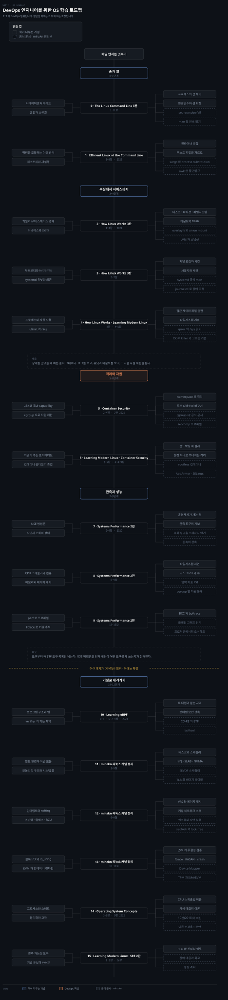

# DevOps 엔지니어를 위한 OS 학습 로드맵
---

## 이 순서를 잡은 기준

> OS 를 아래에서 위로 배우면 커널 자료구조에서 지쳐 정작 매일 쓰는 것에 못 닿습니다. 이 로드맵은 반대로 갑니다 — **손이 매일 만지는 것에서 시작해 필요해질 때 한 층씩 내려갑니다.**

순서를 잡은 규칙은 하나입니다. **장애를 만났을 때 열어야 할 순서 그대로** 놓았습니다.

컨테이너가 안 뜨면 먼저 셸에서 로그를 봅니다. 다음으로 systemd 유닛과 마운트를 보고, 그다음 cgroup 제한과 namespace 를 봅니다. 그래도 안 되면 관측 도구로 커널 안을 봅니다. 이 순서가 곧 배우는 순서입니다.

**0~9단계가 DevOps 로서 쓰는 범위입니다.** 셸, 부팅과 서비스, 격리와 자원, 관측과 성능이 여기 들어갑니다. 도식의 절단선 아래 10~15단계는 그다음에 여는 확장이라, 커널 내부와 이론이 그쪽에 있습니다.

**네트워크 스택은 이 로드맵에 넣지 않았습니다.** [`network-roadmap.md`](network-roadmap.md) 가 그 축을 통째로 맡고 있어서 중복입니다. `How Linux Works` 9장과 `Learning Modern Linux` 7장도 같은 이유로 뺐습니다.

단계마다 표를 둘 둡니다. 하나는 책이 다루는 개념이고 다른 하나는 **책 밖 키워드**입니다. 실선과 점선 박스가 도식에서 그 둘을 가릅니다.

배지는 셋입니다. **필수**는 빼면 뒤가 막히는 것, **추천**은 빼도 뒤가 굴러가지만 손해가 큰 것, **선택**은 목표가 생겼을 때만 여는 것입니다. 필수는 2·3·4·5·7 단계 다섯입니다. 부팅에서 자원 격리까지 한 줄로 이어지는 구간이 그것입니다.

절단선 아래 10~12단계는 확장이라 전부 추천이고 13~15단계는 선택입니다.

배지가 필수인 자리는 뒤가 실제로 막히기 때문입니다. 마운트를 모르면 5단계에서 컨테이너 이미지 레이어가 설명되지 않고, cgroup 과 namespace 를 모르면 6단계의 격리 파괴 시나리오가 남의 말로 남습니다. 7단계의 USE 방법론을 건너뛰고 8·9단계로 가면 도구 목록만 손에 남습니다.

읽는 축과 별개로 손으로 확인하는 축이 하나 더 있는데, 그것은 아래 실습 절이 맡습니다. 책은 찍힌 시점에 멈춰 있고 커널과 배포판은 그 뒤로도 움직이므로, 책 밖 키워드의 기본값은 공식 문서에서 다시 확인하고 표는 무엇을 검색할지 정하는 용도로만 씁니다.

## 무엇을 골랐는가

> 책과 공식 문서, 그리고 한국어 커널 정리본 하나를 씁니다. 출간 연도는 OpenLibrary 와 출판사 페이지에서 2026-09-05 에 확인했습니다.

| 자료 | 출간 | 자리 |
|---|:---:|---|
| Fundamentals of DevOps and Software Delivery | 2025 | 이웃. OS 가 아니라 전달 파이프라인 축 |
| Learning eBPF | 2023 | 10단계 |
| Efficient Linux at the Command Line | 2022 | 1단계 |
| Learning Modern Linux | 2022 | 4·6·15단계 |
| How Linux Works 3판 | 2021 | 2·3·4단계의 기둥 |
| Systems Performance 2판 | 2020 | 7·8·9단계 |
| Container Security | 2020 · 2판 2025 | 5·6단계 |
| The Linux Command Line 3판 | 3판 | 0단계 |
| Operating System Concepts 9판 | 2012 | 14단계. 이론 보강용 |

**[minzkn 리눅스 커널 정리](https://www.minzkn.com/linuxkernel/index.html)** 가 11~13단계를 맡습니다. 커널 6.x~7.2 를 기준으로 2026-09-02 에 갱신된 한국어 문서라, 이 목록에서 가장 최신 자료입니다. 개발 환경과 커널 모듈에서 시작해 프로세스·메모리·인터럽트·동기화·파일시스템·네트워킹·블록 I/O·가상화·보안·디버깅까지 열세 절로 이어집니다. 책이 커버하지 못하는 최신 스케줄러나 io_uring 같은 주제가 여기 있습니다.

공식 문서는 세 곳을 씁니다. [cgroup v2](https://docs.kernel.org/admin-guide/cgroup-v2.html) 가 5단계의 정본이고, [systemd man](https://www.freedesktop.org/software/systemd/man/latest/systemd.html) 이 3단계를, [`proc(5)`](https://man7.org/linux/man-pages/man5/proc.5.html) 가 4단계의 `/proc` 읽기를 맡습니다.

## 낡음 점검

> 책은 찍힌 시점에 멈춥니다. 낡음 기준은 앞선 로드맵과 같습니다 — 도구와 배포판처럼 빨리 바뀌는 축은 5년을 넘기면 공식 문서로 대신하고, OS 이론처럼 느리게 바뀌는 축은 오래돼도 남깁니다.

이 로드맵은 앞선 둘과 달리 낡음을 이유로 뺀 자료가 없습니다. 대신 조건을 붙여 남긴 자리가 둘이고, 그 조건을 모르고 읽으면 지금 안 맞는 내용을 사실로 가져가게 됩니다.

| 자료 | 출간 | 조치 |
|---|:---:|---|
| [minzkn 리눅스 커널 정리](https://www.minzkn.com/linuxkernel/index.html) | 2026-09-02 갱신 | 목록에서 가장 최신. 커널 6.x~7.2 기준 |
| Learning eBPF | 2023 | 그대로 |
| Efficient Linux at the Command Line · Learning Modern Linux | 2022 | 그대로 |
| How Linux Works 3판 | 2021 | 그대로. 9장은 네트워크라 이 로드맵에서 뺌 |
| Systems Performance 2판 | 2020 | 그대로. 느리게 바뀌는 방법론 축 |
| The Linux Command Line 3판 | 3판 | 그대로. [7th Internet Edition](https://linuxcommand.org/tlcl.php) 이 무료 PDF |
| **Container Security** | **2020** | **조건부 유지.** Drive 는 1판이고 2025년에 2판이 나옴 |
| **Operating System Concepts 9판** | **2012** | **조건부 유지.** 느린 축의 예외. 10판(2018) 을 구하면 그쪽 |

Operating System Concepts 9판이 2012년이라 그 예외에 해당하는데, 10판이 2018년에 나왔으니 구할 수 있으면 그쪽을 봅니다. Container Security 도 Drive 에 있는 것은 2020년 1판이고 2025년에 2판이 나왔습니다.

**장 번호가 판마다 다릅니다.** 이 문서의 5·6단계가 적은 장 번호는 Drive 에 있는 1판 기준이고, 저자가 운영하는 [예제 저장소](https://github.com/lizrice/container-security)는 2판 기준으로 갱신돼 있습니다. 저장소에서 코드를 찾을 때는 디렉토리 번호가 아니라 주제로 짚습니다.

## 손으로 확인하는 실습

> 읽기만 하면 남의 말을 옮기게 됩니다. 다만 이건 책과 다른 축이라 도식에서는 뺐고, 아래 표가 맡습니다.

기준은 **그 자리를 손으로 확인할 검증된 자료가 있는가** 하나입니다. 출처는 셋입니다. 저자가 올린 예제 저장소, 커널과 도구의 공식 문서, 그리고 무료로 전문이 공개된 자료입니다. 비어 있는 단계는 실습이 필요 없어서가 아니라 확인한 자료를 못 찾아서이고, 지어낸 출처를 채우지 않았습니다. 아래 링크는 2026-09-06 에 직접 열어 응답을 확인했습니다.

| 출처 | 어느 자리 | 무엇 |
|---|---|---|
| [linuxcommand.org](https://linuxcommand.org/tlcl.php) | 0 | 책의 예제 스크립트 내려받기. 7th Internet Edition PDF 도 같은 자리에 |
| [efficientlinux.com/examples](https://efficientlinux.com/examples) | 1 | 저자가 올린 예제 파일 |
| [lizrice/container-security](https://github.com/lizrice/container-security) | 5·6 | 장별 코드와 macOS 용 `lima.yaml` |
| [lizrice/containers-from-scratch](https://github.com/lizrice/containers-from-scratch) | 5 | 몇십 줄 Go 로 namespace 와 cgroup 을 직접 걸어 컨테이너를 만드는 데모 |
| [cgroup v2 공식 문서](https://docs.kernel.org/admin-guide/cgroup-v2.html) | 5 | 컨트롤러 인터페이스 파일을 직접 열어 값을 써 보기 |
| [Linux Performance](https://www.brendangregg.com/linuxperf.html) | 7·8 | 저자가 정리한 도구 지도. 어느 도구가 어느 층을 읽는지 한 장으로 |
| [iovisor/bcc](https://github.com/iovisor/bcc) · [bpftrace](https://github.com/bpftrace/bpftrace) | 9 | 책이 쓰는 추적 도구의 현행 소스와 원라이너 예제 |
| [brendangregg/perf-tools](https://github.com/brendangregg/perf-tools) · [FlameGraph](https://github.com/brendangregg/FlameGraph) | 9 | Ftrace 기반 도구 모음과 플레임 그래프 생성기 |
| [lizrice/learning-ebpf](https://github.com/lizrice/learning-ebpf) | 10 | 장별 eBPF 프로그램과 Lima 설정 `learning-ebpf.yaml` |
| [Linux Kernel Teaching](https://linux-kernel-labs.github.io/) | 11·12·13 | QEMU 위에서 커널 모듈·문자 디바이스·지연 작업을 직접 짓는 실습 |
| [os-book.com/OS10](https://www.os-book.com/OS10/) | 14 | 연습문제 해답, 리눅스 가상머신, C·Java 소스 |
| [Google SRE 도서](https://sre.google/books/) | 15 | 1판과 2판 전문이 무료로 공개돼 있습니다 |

2~4단계 자리는 비어 있습니다. How Linux Works 는 예제 저장소가 없고, 이 구간의 실습 대상은 손에 있는 리눅스 시스템 자체입니다. 부트 로그를 `journalctl -b` 로 되짚고 유닛 의존을 `systemd-analyze critical-chain` 으로 펼쳐 보는 일에 별도 자료가 필요하지 않습니다.

**환경은 Lima 로 세웁니다.** 이 로드맵의 실습은 대부분 리눅스 커널이 있어야 도는데 Apple Silicon 맥에는 그것이 없습니다. Liz Rice 의 두 저장소가 그 문제를 미리 풀어 두었습니다. `container-security` 의 `lima.yaml` 은 저자가 macOS 에서 Ubuntu 24.04 로 검증한 설정이고, `learning-ebpf` 의 `learning-ebpf.yaml` 은 빌드에 필요한 패키지를 미리 넣은 설정입니다.

**저장소마다 걸리는 조건이 다릅니다.** `learning-ebpf` 는 libbpf 를 서브모듈로 두므로 `git clone --recurse-submodules` 로 받아야 하고, 저장소가 밝힌 검증 환경은 커널 5.15 의 Ubuntu 22.04 이며 장마다 요구하는 최소 커널 버전이 다릅니다. Linux Kernel Teaching 은 커널 5.10 기준의 QEMU 실습이라 minzkn 정리가 다루는 6.x 와 세대가 갈리므로, 최신 구조는 minzkn 으로 읽고 이쪽은 손으로 짓는 절차에만 씁니다.

## 손과 셸 · 0~1단계

> 셸이 느리면 그 뒤의 모든 진단이 느립니다. 도구를 손에 붙이는 구간입니다.

### 0단계 · The Linux Command Line 3판 1~11장  `추천`

DevOps 의 하루가 여기서 시작합니다. 이미 쓰던 명령이라도 리다이렉션과 권한, 프로세스 제어를 이유와 함께 다시 세우면 뒤 단계의 진단이 빨라집니다. 12장 이후의 vi·패키지 관리·스크립트는 필요할 때 찾아 읽습니다.

| 개념 | 무엇을 알게 되는가 |
|---|---|
| 리다이렉션과 파이프 | 표준 입출력 세 개가 어디로 흐르는가 |
| 권한과 소유권 | rwx 와 setuid 가 실제로 무엇을 허용하는가 |
| 프로세스와 잡 제어 | 포그라운드·백그라운드, 시그널로 다루기 |
| 환경변수와 셸 확장 | 명령이 실행되기 전에 셸이 무엇을 바꾸는가 |

| 책 밖 키워드 | 왜 보는가 |
|---|---|
| `set -euo pipefail` | 스크립트가 조용히 실패하지 않게 하는 최소 장치 |
| man 절 번호 | `man 2 open` 과 `man 3 printf` 가 다른 문서인 이유 |

### 1단계 · Efficient Linux at the Command Line 1~9장  `추천`

같은 일을 절반의 타이핑으로 하는 법입니다. 명령을 조합하는 방식이 여섯 가지로 정리돼 있어서, 파이프 하나로 때우던 습관이 여기서 넓어집니다.

| 개념 | 무엇을 알게 되는가 |
|---|---|
| 명령을 조합하는 여섯 방식 | 파이프 말고도 있는 연결 방법들 |
| 히스토리와 재실행 | 친 명령을 다시 쓰는 값싼 방법 |
| 원라이너 조립 | 작은 명령을 붙여 한 줄로 만드는 절차 |
| 텍스트 파일을 자료로 | 로그와 설정을 데이터처럼 다루기 |

| 책 밖 키워드 | 왜 보는가 |
|---|---|
| `xargs` 와 process substitution | 파이프로 안 되는 조합을 푸는 두 도구 |
| `awk` 한 줄 관용구 | 로그에서 열을 뽑고 집계하는 최단 경로 |

## 부팅에서 서비스까지 · 2~4단계

> 서버가 뜨고 서비스가 도는 경로를 순서대로 훑습니다. 여기를 알면 "왜 안 떴는가"의 절반이 풀립니다.

### 2단계 · How Linux Works 3판 1~4장  `필수`

디스크가 어떻게 파일시스템이 되고 그것이 어디에 붙는지가 이 구간입니다. 컨테이너 이미지가 레이어로 쌓이는 것도, 볼륨이 마운트되는 것도 결국 여기 위에서 벌어집니다.

| 개념 | 무엇을 알게 되는가 |
|---|---|
| 커널과 유저 스페이스 경계 | 시스템 콜이 그 경계를 넘는 유일한 문 |
| 디바이스와 sysfs | 장치가 파일로 보이는 구조 |
| 디스크·파티션·파일시스템 | 블록 장치가 쓸 수 있는 공간이 되기까지 |
| 마운트와 fstab | 어디에 무엇을 붙일지 정하는 자리 |

| 책 밖 키워드 | 왜 보는가 |
|---|---|
| overlayfs 와 union mount | 컨테이너 이미지 레이어의 실체 |
| LVM 과 스냅샷 | 볼륨을 늘리고 되돌리는 운영 수단 |

### 3단계 · How Linux Works 3판 5~7장  `필수`

부트로더에서 systemd 까지 이어지는 기동 경로입니다. 서비스가 안 뜨는 장애의 대부분이 이 구간의 의존 관계와 로그에서 풀립니다.

| 개념 | 무엇을 알게 되는가 |
|---|---|
| 부트로더와 initramfs | 커널이 루트 파일시스템을 잡기까지 |
| systemd 유닛과 의존 | 무엇이 무엇보다 먼저 떠야 하는가 |
| 저널 로깅과 시간 | 로그가 쌓이는 자리와 시각 동기화 |
| 사용자와 세션 | 로그인이 만드는 것들 |

| 책 밖 키워드 | 왜 보는가 |
|---|---|
| systemd 공식 man | 유닛 옵션의 정본. 책보다 훨씬 상세합니다 |
| `journalctl` 로 장애 추적 | 부팅 실패를 시간축으로 되짚기 |

### 4단계 · How Linux Works 8장과 Learning Modern Linux 4~5장  `필수`

프로세스가 자원을 얼마나 쓰는지 보는 법과, 그것을 제한하는 첫 수단입니다. 다음 국면의 cgroup 으로 넘어가는 다리입니다.

| 개념 | 무엇을 알게 되는가 |
|---|---|
| 프로세스와 자원 사용 | 무엇을 얼마나 쓰는지 재는 기본 도구 |
| `ulimit` 과 nice | 프로세스 단위로 거는 한계와 우선순위 |
| 접근 제어와 파일 권한 | 사용자·그룹·capability 의 관계 |
| 파일시스템 계층 | 어느 디렉토리가 무엇을 담기로 약속돼 있는가 |

| 책 밖 키워드 | 왜 보는가 |
|---|---|
| `/proc` 와 `/sys` 읽기 | 커널 상태를 파일로 읽는 정식 창구 (`proc(5)`) |
| OOM killer 가 고르는 기준 | 왜 하필 그 프로세스가 죽었는가 |

## 격리와 자원 · 5~6단계

> 컨테이너가 서는 바닥입니다. 이 국면을 모르면 Kubernetes 의 자원 설정이 주문이 됩니다.

### 5단계 · Container Security 2~4장  `필수`

컨테이너는 하나의 기술이 아니라 커널 프리미티브 셋의 조합입니다. namespace 가 보이는 것을 가르고 cgroup 이 쓸 수 있는 양을 가릅니다. capability 는 할 수 있는 일을 가릅니다.

셋을 나눠 이해하면 "컨테이너는 VM 이 아니다"라는 말이 구체가 됩니다.

| 개념 | 무엇을 알게 되는가 |
|---|---|
| 시스템 콜과 capability | root 를 쪼갠 권한 단위 |
| cgroup 으로 자원 제한 | CPU·메모리 한도가 강제되는 방식 |
| namespace 로 격리 | 무엇이 가려지고 무엇이 공유되는가 |
| 루트 디렉토리 바꾸기 | `chroot` 와 `pivot_root` 의 차이 |

| 책 밖 키워드 | 왜 보는가 |
|---|---|
| cgroup v2 공식 문서 | 컨트롤러와 인터페이스 파일의 정본 |
| seccomp 프로파일 | 허용할 시스템 콜을 목록으로 좁히기 |

### 6단계 · Learning Modern Linux 2·6장과 Container Security 5·8·9장  `추천`

앞 단계가 프리미티브라면 여기는 그것들이 런타임으로 조립된 모습과, 그 조립이 깨지는 조건입니다. 격리를 깨뜨리는 장을 함께 읽어야 무엇을 막아야 하는지가 손에 잡힙니다.

| 개념 | 무엇을 알게 되는가 |
|---|---|
| 커널이 주는 프리미티브 | Learning Modern Linux 가 보는 커널의 구조 |
| 컨테이너 런타임의 조립 | 프리미티브가 하나의 도구가 되는 방식 |
| 샌드박싱 세 갈래 | gVisor·Kata 같은 강한 격리의 선택지 |
| 설정 하나로 무너지는 격리 | privileged, hostPath, 호스트 namespace |

| 책 밖 키워드 | 왜 보는가 |
|---|---|
| rootless 컨테이너 | 사용자 namespace 로 root 없이 돌리기 |
| AppArmor 와 SELinux | 배포판마다 다른 강제 접근 제어 |

## 관측과 성능 · 7~9단계

> "느리다"는 신고를 수치로 바꾸는 구간입니다. DevOps 로서 가장 자주 요구받는 능력입니다.

### 7단계 · Systems Performance 2판 2~4장  `필수`

도구부터 배우면 도구 목록만 남습니다. 방법론을 먼저 세우면 어떤 도구를 왜 쓰는지가 정해집니다. USE 방법론은 자원마다 사용률·포화·에러를 보는 절차라, 처음 보는 시스템에서도 순서가 생깁니다.

| 개념 | 무엇을 알게 되는가 |
|---|---|
| USE 방법론 | 자원마다 무엇을 순서대로 볼 것인가 |
| 지연과 포화의 정의 | 흔히 섞어 쓰는 말들을 가르기 |
| 운영체제가 재는 것 | 커널이 어떤 통계를 어디에 두는가 |
| 관측 도구의 계보 | 어떤 도구가 어떤 소스를 읽는가 |

| 책 밖 키워드 | 왜 보는가 |
|---|---|
| 부하 평균을 오해하지 않기 | load average 가 실제로 세는 것 |
| 관측의 관측 | 도구 자체가 만드는 오버헤드 |

### 8단계 · Systems Performance 2판 6~9장  `추천`

자원 축을 하나씩 내려갑니다. 각 장이 배경, 아키텍처, 방법론, 관측 도구 순서로 같은 골격을 반복해서 훑기 좋습니다.

| 개념 | 무엇을 알게 되는가 |
|---|---|
| CPU 스케줄러와 런큐 | 대기가 생기는 자리 |
| 메모리와 페이지 캐시 | 남은 메모리가 적어 보이는 이유 |
| 파일시스템 지연 | 캐시에 없을 때 무슨 일이 벌어지는가 |
| 디스크 I/O 와 큐 | IOPS 와 지연의 관계 |

| 책 밖 키워드 | 왜 보는가 |
|---|---|
| 압박 지표 PSI | 자원이 부족해지는 순간을 수치로 |
| cgroup 별 자원 통계 | 컨테이너 단위로 같은 축을 보기 |

### 9단계 · Systems Performance 2판 13~15장  `추천`

여기서부터 커널 안을 봅니다. `perf` 로 프로파일을 뜨고 Ftrace 로 커널 경로를 추적하고 BPF 로 원하는 것만 집습니다. 10단계의 eBPF 로 자연스럽게 이어집니다.

| 개념 | 무엇을 알게 되는가 |
|---|---|
| `perf` 로 프로파일 | 어디서 시간을 쓰는지 표본으로 잡기 |
| Ftrace 로 커널 추적 | 커널 함수 단위의 경로 |
| BCC 와 bpftrace | 원라이너로 커널 이벤트를 세기 |

| 책 밖 키워드 | 왜 보는가 |
|---|---|
| 플레임 그래프 읽기 | 프로파일을 그림으로 보는 표준 형식 |
| 프로덕션에서의 오버헤드 | 켜도 되는 추적과 안 되는 추적 |

## 커널로 내려가기 · 10~12단계

> 여기부터 확장입니다. DevOps 로서 꼭 필요하지는 않지만, 앞의 아홉 단계에서 만난 것들이 왜 그렇게 동작하는지가 여기서 설명됩니다.

### 10단계 · Learning eBPF 1~3·6·7·9장  `추천`

9단계에서 도구로 쓴 BPF 를 원리로 다시 봅니다. verifier 가 왜 그렇게 까다로운지, 훅이 어디에 붙는지를 알면 남이 만든 도구를 고르는 눈이 생깁니다.

| 개념 | 무엇을 알게 되는가 |
|---|---|
| 프로그램 구조와 맵 | 커널과 사용자 공간이 상태를 주고받는 통로 |
| verifier 가 거는 제약 | 안전성 주장의 근거가 되는 제한들 |
| 훅 타입과 붙는 자리 | 어느 지점에 붙느냐가 무엇을 볼 수 있게 하는가 |
| 런타임 보안 관측 | 같은 기술이 보안으로 쓰이는 축 |

| 책 밖 키워드 | 왜 보는가 |
|---|---|
| CO-RE 와 BTF | 커널 버전이 달라도 같은 바이너리가 도는 이유 |
| `bpftool` | 올라간 프로그램과 맵을 직접 들여다보기 |

### 11단계 · minzkn 리눅스 커널 정리 1~5절  `추천`

여기서 한국어 자료로 갈아탑니다. 커널 6.x~7.2 기준으로 갱신되고 있어서, 2020년 전후에 나온 책들이 담지 못한 최신 구조가 들어 있습니다. 빌드 환경과 모듈로 시작해 프로세스와 메모리 관리까지 갑니다.

| 개념 | 무엇을 알게 되는가 |
|---|---|
| 빌드 환경과 커널 모듈 | 커널을 직접 만들고 모듈을 올리는 절차 |
| 모놀리식 구조와 시스템 콜 | 유저·커널 공간 분리의 실제 구현 |
| 태스크와 스케줄러 | `task_struct` 와 CFS·EEVDF·실시간 정책 |
| 버디·SLAB·NUMA | 물리 메모리를 나눠 주는 계층 |

| 책 밖 키워드 | 왜 보는가 |
|---|---|
| EEVDF 스케줄러 | CFS 를 대체한 최신 스케줄러 |
| TLB 와 페이지 테이블 | 주소 변환이 비용이 되는 지점 |

### 12단계 · minzkn 리눅스 커널 정리 6~9절  `추천`

인터럽트와 동기화, 파일시스템과 네트워크 스택입니다. 앞에서 도구로 본 지연과 경합이 커널 안에서 어떤 구조로 생기는지가 여기서 풀립니다.

| 개념 | 무엇을 알게 되는가 |
|---|---|
| 인터럽트와 softirq | 상반부와 하반부로 나눠 처리하는 이유 |
| 스핀락·뮤텍스·RCU | 커널이 쓰는 동기화 수단들 |
| VFS 와 페이지 캐시 | 파일시스템 위의 공통 계층 |
| 커널 네트워크 스택 | BPF·XDP 가 붙는 자리의 전체 그림 |

| 책 밖 키워드 | 왜 보는가 |
|---|---|
| 워크큐와 지연 실행 | 인터럽트 문맥에서 할 수 없는 일을 미루기 |
| seqlock 과 lock-free | 읽기가 압도적으로 많을 때의 선택 |

## 조건부 구간 · 13~15단계

> 목표가 생겼을 때만 엽니다. 순서대로 읽을 이유는 없습니다.

### 13단계 · minzkn 리눅스 커널 정리 10~13절  `선택`

스토리지와 가상화, 보안과 디버깅입니다. 컨테이너 런타임을 직접 다루거나 커널 크래시를 분석할 일이 생기면 엽니다.

| 개념 | 무엇을 알게 되는가 |
|---|---|
| 블록 I/O 와 io_uring | 비동기 I/O 의 최신 인터페이스 |
| KVM 과 컨테이너 런타임 | 가상화와 격리를 커널 쪽에서 보기 |
| LSM 과 무결성 검증 | SELinux·IMA/EVM 이 붙는 구조 |
| ftrace·KASAN·crash | 커널을 디버깅하는 도구들 |

| 책 밖 키워드 | 왜 보는가 |
|---|---|
| Device Mapper | LVM 과 컨테이너 스토리지가 딛는 층 |
| TPM 과 IMA/EVM | 부팅부터 신뢰를 잇는 장치 |

### 14단계 · Operating System Concepts 3~9장  `선택`

이론 축입니다. 앞에서 리눅스로만 본 것들을 운영체제 일반의 용어로 다시 정리합니다. 면접이나 설계 논의에서 쓰는 어휘가 여기서 나옵니다.

Drive 에 있는 것은 2012년 9판이라 이 목록에서 가장 오래됐습니다. 다만 프로세스·동기화·스케줄링·가상 메모리는 느리게 바뀌는 축이라 낡음 기준의 예외로 두었습니다. 10판이 2018년에 나왔으니 구할 수 있으면 그쪽을 봅니다.

| 개념 | 무엇을 알게 되는가 |
|---|---|
| 프로세스와 스레드 | 리눅스 구현과 별개인 일반 모델 |
| 동기화와 교착 | 조건 네 가지와 회피·탐지 전략 |
| CPU 스케줄링 이론 | 알고리즘들의 목표와 트레이드오프 |
| 가상 메모리 이론 | 페이지 교체 알고리즘과 스래싱 |

| 책 밖 키워드 | 왜 보는가 |
|---|---|
| 10판(2018) | 구할 수 있으면 9판 대신 |
| 리눅스 구현과 대조 | 이론이 리눅스에서 어떻게 구현됐는지 짝지어 보기 |

### 15단계 · Learning Modern Linux 8·9장과 SRE 2판  `선택`

OS 를 벗어나 운영 실무로 넓히는 자리입니다. 관측 가능성과 커널 튜닝을 지나 신뢰성 공학으로 갑니다.

| 개념 | 무엇을 알게 되는가 |
|---|---|
| 관측 가능성 도구 | 리눅스에서 지표·로그·추적을 모으는 경로 |
| 커널 튜닝과 sysctl | 기본값을 바꿀 때의 근거 |
| SLO 와 신뢰성 실무 | 얼마나 안정적이어야 하는가를 수치로 |

| 책 밖 키워드 | 왜 보는가 |
|---|---|
| 장애 대응과 회고 | 사건에서 배우는 절차 |
| 용량 계획 | 지금 수치로 다음 분기를 예측하기 |

## 로드맵에 넣지 않은 것

> 단계에 넣지 않은 자료에도 이유가 있어서 어디에 쓸지를 적어 둡니다.

### 참조서 · 통독하지 않고 막힐 때만 엽니다

같은 책의 안 읽는 장들입니다. 단계에 넣지 않은 이유는 분량입니다. 앞에서 끝까지 읽으면 로드맵이 두 배가 되는데, 정작 필요한 것은 특정 장 하나일 때가 많습니다.

| 자료 | 열 장면 |
|---|---|
| The Linux Command Line 3판 12~38장 | vi, 패키지 관리, 정규식, 셸 스크립팅이 필요할 때 |
| Efficient Linux at the Command Line 10~11장 | 키보드 효율과 시간 절약 도구 |
| How Linux Works 3판 11~17장 | 셸 스크립트, 사용자 환경, 컴파일, 가상화 |
| Systems Performance 2판 11~12장 | 클라우드 환경의 성능과 벤치마킹 |

### 네트워크 로드맵이 가져간 장

같은 책의 장인데 이 로드맵이 아니라 [`network-roadmap.md`](network-roadmap.md) 에 서 있습니다. 여기서 안 보인다고 안 읽는 것이 아니라 저쪽 순서를 따라 읽습니다.

| 장 | 저쪽에서의 자리 |
|---|---|
| How Linux Works 3판 9·10장 | 네트워크 설정과 응용. 참조서 |
| Learning Modern Linux 7장 | 네트워크 네임스페이스. 바닥 국면 |
| Systems Performance 2판 10장 | 네트워크 성능 방법론. 자리가 겹치는 책 |
| Container Security 10·11장 | 컨테이너 네트워크 보안과 TLS. 운영과 신뢰 국면 |

### 이웃 주제

OS 요소를 직접 채우지는 않지만 옆에서 만나는 자료입니다.

| 자료 | 무엇을 보태는가 |
|---|---|
| Fundamentals of DevOps and Software Delivery | OS 가 아니라 배포·CI/CD·인프라 코드 축 |
| Learning DevSecOps | 파이프라인에 보안을 끼우는 축 |
| [Go 학습 로드맵](go-roadmap.md) | 이 로드맵의 도구를 직접 짓는 쪽. 11단계 이후가 그 자리 |

## 경계

> OS 를 다루는 문서가 셋이라 무엇을 어디서 찾을지 갈라 둡니다.

책을 고르고 순서를 정하는 일은 이 문서가 맡습니다. 커널 네트워크 스택과 컨테이너 네트워킹은 [`network-roadmap.md`](network-roadmap.md) 가 맡고, Linux 네트워크 원리를 키워드 축으로 늘어놓은 것은 [`02_os/networking/roadmap.md`](02_os/networking/roadmap.md) 입니다. 셋이 겹치는 자리는 namespace 와 eBPF 인데, 여기서는 격리 프리미티브로, 네트워크 로드맵에서는 데이터패스로 봅니다.
