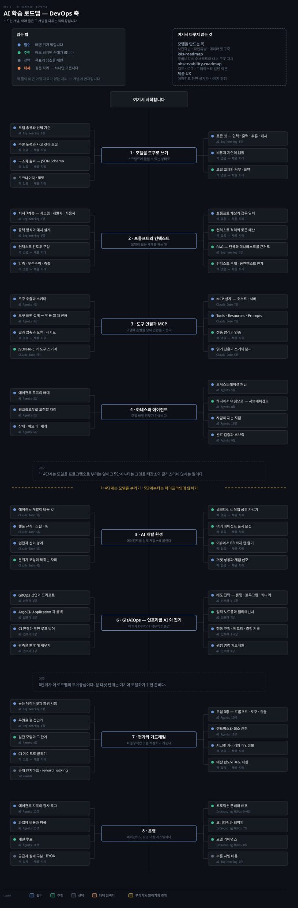
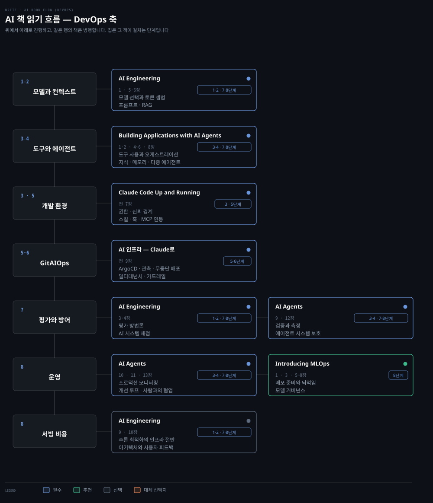

# AI 학습 로드맵 — DevOps 축
---

> 모델을 만드는 쪽이 아니라 부리고 운영하는 쪽만 담았습니다. 스크립트에 물릴 수 있는 모델 사용법에서 시작해 도구와 하네스를 지나 개발 환경과 배포 파이프라인, 평가와 운영으로 갑니다.

## 학습 순서

> 단계마다 배우는 개념을 묶음으로 갈랐습니다. 자료 위치는 아래 단계별 표가 짚습니다.

| 단계 | 묶음 | 배우는 개념 |
|---|---|---|
| 1 · 모델을 도구로 쓰기 | 모델 고르기 | 추론 모델 · 코딩 모델 · 임베딩 모델 · 작고 빠른 모델 · 선택 기준 |
| 1 · 모델을 도구로 쓰기 | 출력 다루기 | 구조화 출력 · JSON Schema · 추론 노력 조절 · 거부와 폴백 |
| 1 · 모델을 도구로 쓰기 | 비용 셈법 | 입력 토큰 · 출력 토큰 · 추론 토큰 · 캐시 토큰 · 지연과 단가 |
| 2 · 프롬프트와 컨텍스트 | 지시 | 시스템 · 개발자 · 사용자 3계층 · 역할 · 제약 · 출력 형식 · 예시 |
| 2 · 프롬프트와 컨텍스트 | 컨텍스트 | 컨텍스트 윈도우 · 작업 기억과 장기 기억 · 압축 · 우선순위 · 축출 |
| 2 · 프롬프트와 컨텍스트 | 토큰 줄이기 | 프롬프트 캐싱 · 접두 일치 · 컨텍스트 격리 · 토큰 예산 · 컨텍스트 부패 |
| 2 · 프롬프트와 컨텍스트 | 근거 붙이기 | 임베딩 · 청킹 · 하이브리드 검색 · 재순위 · grounding · citation |
| 3 · 도구 연결과 MCP | 도구 | 도구 호출 · 도구 스키마 · `tool_choice` · 결과 압축 · 오류와 재시도 |
| 3 · 도구 연결과 MCP | 표면 설계 | 범용 셸과 전용 도구 · 이름과 설명 · 입력 검증 |
| 3 · 도구 연결과 MCP | MCP | 호스트 · 클라이언트 · 서버 · Tools · Resources · Prompts · 전송 방식 |
| 3 · 도구 연결과 MCP | 권한 | 읽기 전용과 쓰기의 분리 · 승인 게이트 · 인증 · 감사 |
| 4 · 하네스와 에이전트 | 루프 | 에이전트 루프 · 워크플로우로 고정할 자리 · 계획과 실행의 분리 |
| 4 · 하네스와 에이전트 | 상태 | 상태 저장 · 메모리 · 중단과 재개 · 멱등성 |
| 4 · 하네스와 에이전트 | 조율 | 오케스트레이션 패턴 · 서브에이전트 · 감독자 · 병렬과 순차 |
| 4 · 하네스와 에이전트 | 판정 | 완료 검증 · 루브릭 · 거짓 성공 탐지 · 사람이 끼는 지점 |
| 5 · AI 개발 환경 | 코딩 에이전트 | 에이전틱 개발 · 저장소 맥락 · 분위기 코딩이 막히는 자리 |
| 5 · AI 개발 환경 | 설정 | 행동 규칙 파일 · 스킬 · 훅 · 슬래시 명령 · MCP 등록 |
| 5 · AI 개발 환경 | 경계 | 권한 · 신뢰 경계 · 샌드박스 · 원격 런타임 |
| 5 · AI 개발 환경 | 운전 | 워크트리 격리 · 여러 에이전트 동시 운전 · 이슈에서 PR 까지 · 개입 신호 |
| 6 · GitAIOps | 선언과 동기화 | GitOps · 드리프트 · ArgoCD Application · 동기화 정책 · `git revert` 롤백 |
| 6 · GitAIOps | 파이프라인 | GitHub Actions CI · 이미지 태그 갱신 · CI 와 CD 연결 · 무한 루프 방어 |
| 6 · GitAIOps | 배포 전략 | 롤링 업데이트의 빈틈 · Gateway API · Blue/Green · Argo Rollouts · Canary |
| 6 · GitAIOps | 규모 | 멀티 노드풀 · `nodeSelector` · Spot VM · App of Apps · Sync Wave · 멀티테넌시 |
| 6 · GitAIOps | AI 협업 산출물 | 행동 규칙 · 메모리 컨텍스트 · 아키텍처 결정 기록 · 권한 분리 · 명령 가드레일 |
| 7 · 평가와 가드레일 | 채점 | 골든 데이터셋 · 회귀 시험 · groundedness · 과업 성공률 · 심판 모델 |
| 7 · 평가와 가드레일 | 게이트 | CI 게이트 · 프롬프트 버전 · 비교 기준선 |
| 7 · 평가와 가드레일 | 방어 | 프롬프트 주입 · 도구 주입 · 데이터 유출 · 외부 데이터 격리 |
| 7 · 평가와 가드레일 | 한도 | 최소 권한 · 샌드박스 · 시크릿 가리기 · 개인정보 마스킹 · 예산 한도 |
| 8 · 운영 | 지표 | 도구 실패율 · 지연 · 토큰 사용량 · 과업당 비용 · 감사 로그 |
| 8 · 운영 | 되먹임 | 프로덕션 모니터링 · 개선 루프 · 사람과의 협업 |
| 8 · 운영 | 모델 운영 | 프로덕션 준비 · 배포 · 모니터링과 되먹임 · 모델 거버넌스 |
| 8 · 운영 | 서빙 | 추론 최적화의 인프라 절반 · 배치와 캐시 · 아키텍처와 사용자 피드백 |

## 책 읽기 흐름

> 위 단계를 무엇으로 배우는가입니다. 모델을 만드는 쪽 자료는 걸지 않았습니다.

같은 책이 여러 단계에 나뉘어 걸리므로 행이 단계가 아니라 책의 역할로 묶입니다.

| 책 | 읽을 장 | 우선순위 | 자리 |
|---|---|:---:|---|
| Building Applications with AI Agents | 1·2 · 4~6 · 8~13장 | 필수 | 3·4 · 7·8단계 |
| Claude Code Up and Running | 전 7장 | 필수 | 3 · 5단계 |
| [AI 인프라 — Claude로](../07_devops/book/aic_ai-infra-claude/README.md) | 전 9장 | 필수 | 5·6단계 |
| AI Engineering | 1 · 3~6 · 9·10장 | 필수 | 1·2 · 7·8단계 |
| Introducing MLOps | 1 · 3 · 5~8장 | 추천 | 8단계 |

공식 문서가 빈칸의 절반을 메웁니다. [MCP 소개](https://modelcontextprotocol.io/docs/getting-started/intro)가 3단계, [Claude Code 문서](https://docs.claude.com/en/docs/claude-code/overview)가 5단계, [Argo CD](https://argo-cd.readthedocs.io/)와 [Argo Rollouts](https://argo-rollouts.readthedocs.io/)가 6단계, [Building effective agents](https://www.anthropic.com/engineering/building-effective-agents)가 4단계를 받칩니다.

**정독 노트가 아직 없는 책이 셋입니다.** AI Engineering · Building Applications with AI Agents · Introducing MLOps 는 소장본만 있고 노트가 없어 단계별 표의 `노트` 칸이 비어 있습니다. `10_AI` 의 개념 노트 열한 편이 1~4·7단계를 받치고, `aic_ai-infra-claude` 열여덟 편이 6단계를 받칩니다.

## 모델을 부리기 · 1~4단계

> 모델을 프로그램의 부품으로 다루는 구간입니다. 여기까지는 어느 직무에나 같습니다.

### 1단계 · 모델을 도구로 쓰기

| 개념 | 우선순위 | 노트 | 책 |
|---|:---:|---|---|
| 모델 종류와 선택 기준 | 필수 | [02-01](../10_AI/02-01.LLM%20%EB%AA%A8%EB%8D%B8%EC%9D%98%20%ED%8A%B9%EC%84%B1%EA%B3%BC%20%ED%99%9C%EC%9A%A9%20%E2%80%94%20%EC%84%A0%ED%83%9D%C2%B7%EC%82%AC%EA%B3%A0%C2%B7%EA%B5%AC%EC%A1%B0%ED%99%94%C2%B7%EB%A7%88%EC%9D%B4%EA%B7%B8%EB%A0%88%EC%9D%B4%EC%85%98.md) | AI Engineering 1장 |
| 추론 노력과 사고 깊이 조절 | 필수 | [02-01](../10_AI/02-01.LLM%20%EB%AA%A8%EB%8D%B8%EC%9D%98%20%ED%8A%B9%EC%84%B1%EA%B3%BC%20%ED%99%9C%EC%9A%A9%20%E2%80%94%20%EC%84%A0%ED%83%9D%C2%B7%EC%82%AC%EA%B3%A0%C2%B7%EA%B5%AC%EC%A1%B0%ED%99%94%C2%B7%EB%A7%88%EC%9D%B4%EA%B7%B8%EB%A0%88%EC%9D%B4%EC%85%98.md) | |
| 구조화 출력과 JSON Schema | 필수 | [02-01](../10_AI/02-01.LLM%20%EB%AA%A8%EB%8D%B8%EC%9D%98%20%ED%8A%B9%EC%84%B1%EA%B3%BC%20%ED%99%9C%EC%9A%A9%20%E2%80%94%20%EC%84%A0%ED%83%9D%C2%B7%EC%82%AC%EA%B3%A0%C2%B7%EA%B5%AC%EC%A1%B0%ED%99%94%C2%B7%EB%A7%88%EC%9D%B4%EA%B7%B8%EB%A0%88%EC%9D%B4%EC%85%98.md) | |
| 토큰 넷 — 입력 · 출력 · 추론 · 캐시 | 필수 | [02-03](../10_AI/02-03.Token%20Optimization%20%E2%80%94%20%EB%B9%84%EC%9A%A9%C2%B7%EC%A7%80%EC%97%B0%C2%B7context%20rot%EB%A5%BC%20%EC%A4%84%EC%9D%B4%EB%8A%94%20%EB%B2%95.md) | AI Engineering 1장 |
| 비용과 지연의 셈법 | 필수 | [02-03](../10_AI/02-03.Token%20Optimization%20%E2%80%94%20%EB%B9%84%EC%9A%A9%C2%B7%EC%A7%80%EC%97%B0%C2%B7context%20rot%EB%A5%BC%20%EC%A4%84%EC%9D%B4%EB%8A%94%20%EB%B2%95.md) | |
| 모델 교체와 거부 · 폴백 | 추천 | [02-01](../10_AI/02-01.LLM%20%EB%AA%A8%EB%8D%B8%EC%9D%98%20%ED%8A%B9%EC%84%B1%EA%B3%BC%20%ED%99%9C%EC%9A%A9%20%E2%80%94%20%EC%84%A0%ED%83%9D%C2%B7%EC%82%AC%EA%B3%A0%C2%B7%EA%B5%AC%EC%A1%B0%ED%99%94%C2%B7%EB%A7%88%EC%9D%B4%EA%B7%B8%EB%A0%88%EC%9D%B4%EC%85%98.md) | |
| 세대별로 무엇이 달라지는가 | 선택 | [01-01](../10_AI/01-01.Claude%20Opus%204.8%20%E2%80%94%204.7%EC%97%90%EC%84%9C%20%EB%AC%B4%EC%97%87%EC%9D%B4%20%EB%8B%AC%EB%9D%BC%EC%A1%8C%EB%82%98.md) | |

출력이 사람 눈에만 그럴듯한 단계에서 멈추면 자동화에 못 씁니다. 이 단계의 끝은 **모델 응답을 파싱해 다음 명령의 입력으로 넘기는 스크립트를 쓸 수 있는 상태**입니다.

### 2단계 · 프롬프트와 컨텍스트

| 개념 | 우선순위 | 노트 | 책 |
|---|:---:|---|---|
| 지시 3계층 — 시스템 · 개발자 · 사용자 | 필수 | [02-06](../10_AI/02-06.Prompt%20Engineering%20%E2%80%94%20%EC%A7%80%EC%8B%9C%C2%B7%EC%97%AD%ED%95%A0%C2%B7%ED%98%95%EC%8B%9D%C2%B7%EC%98%88%EC%8B%9C%EB%A1%9C%20%EB%AA%A8%EB%8D%B8%EC%9D%84%20%EC%A1%B0%EC%A2%85%ED%95%98%EA%B8%B0.md) | AI Engineering 5장 |
| 출력 형식과 예시 설계 | 필수 | [02-06](../10_AI/02-06.Prompt%20Engineering%20%E2%80%94%20%EC%A7%80%EC%8B%9C%C2%B7%EC%97%AD%ED%95%A0%C2%B7%ED%98%95%EC%8B%9D%C2%B7%EC%98%88%EC%8B%9C%EB%A1%9C%20%EB%AA%A8%EB%8D%B8%EC%9D%84%20%EC%A1%B0%EC%A2%85%ED%95%98%EA%B8%B0.md) | AI Engineering 5장 |
| 컨텍스트 윈도우 구성 | 필수 | [02-07](../10_AI/02-07.Context%20Engineering%20%E2%80%94%20%EB%AA%A8%EB%8D%B8%EC%9D%B4%20%EB%B3%B4%EB%8A%94%20%EC%84%B8%EA%B3%84%EB%A5%BC%20%EC%84%A4%EA%B3%84%ED%95%98%EA%B8%B0.md) | |
| 압축 · 우선순위 · 축출 | 필수 | [02-07](../10_AI/02-07.Context%20Engineering%20%E2%80%94%20%EB%AA%A8%EB%8D%B8%EC%9D%B4%20%EB%B3%B4%EB%8A%94%20%EC%84%B8%EA%B3%84%EB%A5%BC%20%EC%84%A4%EA%B3%84%ED%95%98%EA%B8%B0.md) | |
| 프롬프트 캐싱과 접두 일치 | 필수 | [02-03](../10_AI/02-03.Token%20Optimization%20%E2%80%94%20%EB%B9%84%EC%9A%A9%C2%B7%EC%A7%80%EC%97%B0%C2%B7context%20rot%EB%A5%BC%20%EC%A4%84%EC%9D%B4%EB%8A%94%20%EB%B2%95.md) | |
| 컨텍스트 격리와 토큰 예산 | 추천 | [02-03](../10_AI/02-03.Token%20Optimization%20%E2%80%94%20%EB%B9%84%EC%9A%A9%C2%B7%EC%A7%80%EC%97%B0%C2%B7context%20rot%EB%A5%BC%20%EC%A4%84%EC%9D%B4%EB%8A%94%20%EB%B2%95.md) | |
| 컨텍스트 부패와 롱컨텍스트 한계 | 추천 | [02-07](../10_AI/02-07.Context%20Engineering%20%E2%80%94%20%EB%AA%A8%EB%8D%B8%EC%9D%B4%20%EB%B3%B4%EB%8A%94%20%EC%84%B8%EA%B3%84%EB%A5%BC%20%EC%84%A4%EA%B3%84%ED%95%98%EA%B8%B0.md) | |
| RAG — 런북과 매니페스트를 근거로 | 추천 | [02-08](../10_AI/02-08.RAG%20%C2%B7%20Retrieval%20%EC%84%A4%EA%B3%84%20%E2%80%94%20%EC%9E%84%EB%B2%A0%EB%94%A9%C2%B7%EA%B2%80%EC%83%89%C2%B7%EA%B7%BC%EA%B1%B0%EB%A1%9C%20%EB%8B%B5%EC%9D%84%20%EB%B6%99%EB%93%A4%EA%B8%B0.md) | AI Engineering 6장 |
| 프롬프트 회귀 시험 | 추천 | [02-06](../10_AI/02-06.Prompt%20Engineering%20%E2%80%94%20%EC%A7%80%EC%8B%9C%C2%B7%EC%97%AD%ED%95%A0%C2%B7%ED%98%95%EC%8B%9D%C2%B7%EC%98%88%EC%8B%9C%EB%A1%9C%20%EB%AA%A8%EB%8D%B8%EC%9D%84%20%EC%A1%B0%EC%A2%85%ED%95%98%EA%B8%B0.md) | |

운영 문서를 통째로 밀어 넣는 습관은 비용과 정확도 양쪽을 해칩니다. **무엇을 넣지 않을지 결정할 수 있게 되는 것**이 이 단계의 목표입니다.

### 3단계 · 도구 연결과 MCP

| 개념 | 우선순위 | 노트 | 책 |
|---|:---:|---|---|
| 도구 호출과 도구 스키마 | 필수 | [02-02](../10_AI/02-02.Harness%20Engineering%20%E2%80%94%20%EB%AA%A8%EB%8D%B8%EC%9D%84%20%EA%B0%90%EC%8B%B8%EB%8A%94%20%EC%98%A4%EC%BC%80%EC%8A%A4%ED%8A%B8%EB%A0%88%EC%9D%B4%EC%85%98%20%EC%B8%B5.md) | AI Agents 4장 |
| 도구 표면 설계 — 범용 셸과 전용 도구 | 필수 | [02-02](../10_AI/02-02.Harness%20Engineering%20%E2%80%94%20%EB%AA%A8%EB%8D%B8%EC%9D%84%20%EA%B0%90%EC%8B%B8%EB%8A%94%20%EC%98%A4%EC%BC%80%EC%8A%A4%ED%8A%B8%EB%A0%88%EC%9D%B4%EC%85%98%20%EC%B8%B5.md) | AI Agents 4장 |
| 결과 압축과 오류 · 재시도 | 필수 | [02-03](../10_AI/02-03.Token%20Optimization%20%E2%80%94%20%EB%B9%84%EC%9A%A9%C2%B7%EC%A7%80%EC%97%B0%C2%B7context%20rot%EB%A5%BC%20%EC%A4%84%EC%9D%B4%EB%8A%94%20%EB%B2%95.md) | |
| MCP 삼자 — 호스트 · 클라이언트 · 서버 | 필수 | [02-04](../10_AI/02-04.MCP%20%EC%84%A4%EA%B3%84%20%E2%80%94%20%EC%99%B8%EB%B6%80%20%EB%8F%84%EA%B5%AC%C2%B7%EB%8D%B0%EC%9D%B4%ED%84%B0%EB%A5%BC%20%ED%91%9C%EC%A4%80%EC%9C%BC%EB%A1%9C%20%EC%97%B0%EA%B2%B0%ED%95%98%EA%B8%B0.md) | Claude Code 7장 |
| Tools · Resources · Prompts | 필수 | [02-04](../10_AI/02-04.MCP%20%EC%84%A4%EA%B3%84%20%E2%80%94%20%EC%99%B8%EB%B6%80%20%EB%8F%84%EA%B5%AC%C2%B7%EB%8D%B0%EC%9D%B4%ED%84%B0%EB%A5%BC%20%ED%91%9C%EC%A4%80%EC%9C%BC%EB%A1%9C%20%EC%97%B0%EA%B2%B0%ED%95%98%EA%B8%B0.md) | Claude Code 7장 |
| 전송 방식과 인증 | 추천 | [02-04](../10_AI/02-04.MCP%20%EC%84%A4%EA%B3%84%20%E2%80%94%20%EC%99%B8%EB%B6%80%20%EB%8F%84%EA%B5%AC%C2%B7%EB%8D%B0%EC%9D%B4%ED%84%B0%EB%A5%BC%20%ED%91%9C%EC%A4%80%EC%9C%BC%EB%A1%9C%20%EC%97%B0%EA%B2%B0%ED%95%98%EA%B8%B0.md) | |
| 읽기 전용과 쓰기의 분리 | 필수 | [02-04](../10_AI/02-04.MCP%20%EC%84%A4%EA%B3%84%20%E2%80%94%20%EC%99%B8%EB%B6%80%20%EB%8F%84%EA%B5%AC%C2%B7%EB%8D%B0%EC%9D%B4%ED%84%B0%EB%A5%BC%20%ED%91%9C%EC%A4%80%EC%9C%BC%EB%A1%9C%20%EC%97%B0%EA%B2%B0%ED%95%98%EA%B8%B0.md) | Claude Code 5장 |
| 승인 게이트와 감사 로그 | 필수 | [02-10](../10_AI/02-10.Guardrail%20%C2%B7%20Safety%20%26%20Observability%20%E2%80%94%20%EA%B6%8C%ED%95%9C%C2%B7%EB%B0%A9%EC%96%B4%C2%B7%EA%B4%80%EC%B8%A1.md) | |

DevOps 도구는 대부분 쓰기 권한을 함께 가집니다. `kubectl delete` 나 배포 트리거를 도구로 노출하는 순간 설계 질문이 바뀌므로, **읽기와 쓰기를 도구 단위로 갈라 두는 습관**을 여기서 들입니다.

### 4단계 · 하네스와 에이전트

| 개념 | 우선순위 | 노트 | 책 |
|---|:---:|---|---|
| 에이전트 루프의 뼈대 | 필수 | [02-02](../10_AI/02-02.Harness%20Engineering%20%E2%80%94%20%EB%AA%A8%EB%8D%B8%EC%9D%84%20%EA%B0%90%EC%8B%B8%EB%8A%94%20%EC%98%A4%EC%BC%80%EC%8A%A4%ED%8A%B8%EB%A0%88%EC%9D%B4%EC%85%98%20%EC%B8%B5.md) | AI Agents 2장 |
| 워크플로우로 고정할 자리 | 필수 | [02-05](../10_AI/02-05.AI%20Agentization%20%E2%80%94%20%EC%9B%8C%ED%81%AC%ED%94%8C%EB%A1%9C%EC%9A%B0%EC%99%80%20%EC%97%90%EC%9D%B4%EC%A0%84%ED%8A%B8%20%EC%82%AC%EC%9D%B4.md) | AI Agents 2장 |
| 상태 · 메모리 · 중단과 재개 | 필수 | [02-05](../10_AI/02-05.AI%20Agentization%20%E2%80%94%20%EC%9B%8C%ED%81%AC%ED%94%8C%EB%A1%9C%EC%9A%B0%EC%99%80%20%EC%97%90%EC%9D%B4%EC%A0%84%ED%8A%B8%20%EC%82%AC%EC%9D%B4.md) | AI Agents 6장 |
| 오케스트레이션 패턴 | 필수 | [03-01](../10_AI/docs/orca/03-01.%EC%98%A4%EC%BC%80%EC%8A%A4%ED%8A%B8%EB%A0%88%EC%9D%B4%EC%85%98%20%EB%AA%A8%EB%8D%B8%20%E2%80%94%20%EB%A9%94%EC%8B%9C%EC%A7%80%C2%B7%ED%83%9C%EC%8A%A4%ED%81%AC%C2%B7%EA%B2%8C%EC%9D%B4%ED%8A%B8.md) | AI Agents 5장 |
| 하나에서 여럿으로 — 서브에이전트 | 추천 | [02-02](../10_AI/02-02.Harness%20Engineering%20%E2%80%94%20%EB%AA%A8%EB%8D%B8%EC%9D%84%20%EA%B0%90%EC%8B%B8%EB%8A%94%20%EC%98%A4%EC%BC%80%EC%8A%A4%ED%8A%B8%EB%A0%88%EC%9D%B4%EC%85%98%20%EC%B8%B5.md) | AI Agents 8장 |
| 사람이 끼는 지점 | 필수 | [02-05](../10_AI/02-05.AI%20Agentization%20%E2%80%94%20%EC%9B%8C%ED%81%AC%ED%94%8C%EB%A1%9C%EC%9A%B0%EC%99%80%20%EC%97%90%EC%9D%B4%EC%A0%84%ED%8A%B8%20%EC%82%AC%EC%9D%B4.md) | AI Agents 13장 |
| 완료 검증과 루브릭 | 필수 | [02-05](../10_AI/02-05.AI%20Agentization%20%E2%80%94%20%EC%9B%8C%ED%81%AC%ED%94%8C%EB%A1%9C%EC%9A%B0%EC%99%80%20%EC%97%90%EC%9D%B4%EC%A0%84%ED%8A%B8%20%EC%82%AC%EC%9D%B4.md) | AI Agents 9장 |
| 하네스 사례 하나 뜯어보기 | 선택 | [hermes](../10_AI/hermes/hermes.md) | |

정해진 절차가 있는 일은 에이전트가 아니라 워크플로우로 고정하는 편이 낫습니다. **자유도를 어디까지 줄지 결정하는 기준**을 세우는 것이 이 단계의 산출물입니다.

## 파이프라인에 앉히기 · 5~8단계

> 여기서부터 DevOps 직무의 일입니다. 앞 네 단계는 이 구간에 도달하기 위한 준비입니다.

### 5단계 · AI 개발 환경

| 개념 | 우선순위 | 노트 | 책 |
|---|:---:|---|---|
| 에이전틱 개발이 바꾼 것 | 필수 | [01-01](../10_AI/docs/orca/01-01.ADE%EB%9E%80%20%EB%AC%B4%EC%97%87%EC%9D%B8%EA%B0%80%20%E2%80%94%20IDE%EC%97%90%EC%84%9C%20ADE%EA%B9%8C%EC%A7%80.md) | Claude Code 1장 |
| 행동 규칙 · 스킬 · 훅 | 필수 | | Claude Code 6장 |
| 권한과 신뢰 경계 | 필수 | [05-01](../10_AI/docs/orca/05-01.%EC%9A%B4%EC%98%81%EA%B3%BC%20%EA%B6%8C%ED%95%9C%20%EA%B2%BD%EA%B3%84%20%E2%80%94%20%ED%99%98%EA%B2%BD%20%EB%A0%88%EC%8B%9C%ED%94%BC%C2%B7%EC%9B%90%EA%B2%A9%20%EB%9F%B0%ED%83%80%EC%9E%84%C2%B7%EB%B3%B4%EC%95%88.md) | Claude Code 5장 |
| 분위기 코딩이 막히는 자리 | 추천 | | Claude Code 4장 |
| 워크트리로 작업 공간 가르기 | 추천 | [02-01](../10_AI/docs/orca/02-01.Repo%C2%B7%ED%94%84%EB%A1%9C%EC%A0%9D%ED%8A%B8%C2%B7%EC%9B%8C%ED%81%AC%ED%8A%B8%EB%A6%AC%20%E2%80%94%20%EC%9E%91%EC%97%85%20%EA%B3%B5%EA%B0%84%EC%9D%84%20%EA%B0%80%EB%A5%B4%EB%8A%94%20%EB%B2%95.md) | |
| 여러 에이전트 동시 운전 | 추천 | [02-02](../10_AI/docs/orca/02-02.%ED%84%B0%EB%AF%B8%EB%84%90%EA%B3%BC%20%EC%97%90%EC%9D%B4%EC%A0%84%ED%8A%B8%20%EC%9A%B4%EC%A0%84%20%E2%80%94%20%EC%A7%80%EC%8B%9C%C2%B7%EB%8C%80%EA%B8%B0%C2%B7%EC%99%84%EB%A3%8C%20%ED%8C%90%EC%A0%95.md) | |
| 이슈에서 PR 까지 한 줄기 | 추천 | [03-02](../10_AI/docs/orca/03-02.%EC%8B%A4%EC%A0%84%20%ED%8C%8C%EC%9D%B4%ED%94%84%EB%9D%BC%EC%9D%B8%20%E2%80%94%20%EC%9D%B4%EC%8A%88%EC%97%90%EC%84%9C%20PR%EA%B9%8C%EC%A7%80.md) | |
| 거짓 성공과 개입 신호 | 필수 | [05-02](../10_AI/docs/orca/05-02.%EC%8B%A4%ED%8C%A8%EC%99%80%20%EB%B3%B5%EA%B5%AC%20%E2%80%94%20%EA%B1%B0%EC%A7%93%20%EC%84%B1%EA%B3%B5%EA%B3%BC%20%EA%B0%9C%EC%9E%85%20%EC%8B%A0%ED%98%B8.md) | |
| 화면 밖 자동화 | 선택 | [04-02](../10_AI/docs/orca/04-02.%ED%99%94%EB%A9%B4%20%EB%B0%96%20%EC%9E%90%EB%8F%99%ED%99%94%20%E2%80%94%20%EC%BB%B4%ED%93%A8%ED%84%B0%20%EC%9C%A0%EC%A6%88%C2%B7%EC%97%90%EB%AE%AC%EB%A0%88%EC%9D%B4%ED%84%B0%C2%B7%EC%98%88%EC%95%BD%20%EC%8B%A4%ED%96%89.md) | |

에이전트가 "다 됐습니다"라고 말하는 것과 실제로 된 것은 다릅니다. **거짓 성공을 판별하는 신호를 손에 쥐는 것**이 이 단계에서 가장 값이 큽니다.

### 6단계 · GitAIOps — 인프라를 AI 와 짓기

| 개념 | 우선순위 | 노트 | 책 |
|---|:---:|---|---|
| GitOps 선언과 드리프트 | 필수 | [01-02](../07_devops/book/aic_ai-infra-claude/01-02.GitOps%EC%97%90%EC%84%9C%20GitAIOps%EB%A1%9C.md) | AI 인프라 1장 |
| ArgoCD Application 과 롤백 | 필수 | [03-01](../07_devops/book/aic_ai-infra-claude/03-01.%ED%91%B8%EC%8B%9C%20%EB%B0%B0%ED%8F%AC%EC%9D%98%20%ED%95%9C%EA%B3%84%EC%99%80%20ArgoCD%20GitOps%20%E2%80%94%20%EC%84%A4%EC%B9%98%C2%B7%EC%97%B0%EA%B2%B0%C2%B7%EB%A1%A4%EB%A7%81%C2%B7%EB%A1%A4%EB%B0%B1.md) | AI 인프라 3장 |
| CI 연결과 무한 루프 방어 | 필수 | [03-02](../07_devops/book/aic_ai-infra-claude/03-02.%EA%B9%83%ED%97%88%EB%B8%8C%20%EC%95%A1%EC%85%98%20CI%EC%99%80%20ArgoCD%20%EC%97%B0%EA%B2%B0%20%E2%80%94%20%EB%B9%8C%EB%93%9C%EB%B6%80%ED%84%B0%20%EB%B0%B0%ED%8F%AC%EA%B9%8C%EC%A7%80.md) | AI 인프라 3장 |
| 관측을 한 번에 세우기 | 필수 | [04-01](../07_devops/book/aic_ai-infra-claude/04-01.%EA%B4%80%EC%B8%A1%20%EA%B0%80%EB%8A%A5%EC%84%B1%EA%B3%BC%20%EB%A9%94%ED%8A%B8%EB%A6%AD%20%E2%80%94%20%ED%94%84%EB%A1%9C%EB%A9%94%ED%85%8C%EC%9A%B0%EC%8A%A4%C2%B7%EA%B7%B8%EB%9D%BC%ED%8C%8C%EB%82%98.md) | AI 인프라 4장 |
| 로그와 알림 규칙 | 필수 | [04-02](../07_devops/book/aic_ai-infra-claude/04-02.%EB%A1%9C%EA%B7%B8%EC%99%80%20%EC%95%8C%EB%A6%BC%20%E2%80%94%20Loki%C2%B7Fluent%20Bit%C2%B7PrometheusRule.md) | AI 인프라 4장 |
| 롤링 업데이트의 빈틈과 Gateway API | 필수 | [05-01](../07_devops/book/aic_ai-infra-claude/05-01.Rolling%20Update%EC%9D%98%20%ED%95%9C%EA%B3%84%EC%99%80%20Gateway%20API.md) | AI 인프라 5장 |
| Blue/Green 무중단 전환 | 필수 | [05-02](../07_devops/book/aic_ai-infra-claude/05-02.Blue-Green%20%EB%AC%B4%EC%A4%91%EB%8B%A8%20%EC%A0%84%ED%99%98%EA%B3%BC%20%EC%95%84%ED%82%A4%ED%85%8D%EC%B2%98%20%EA%B2%B0%EC%A0%95%20%EA%B8%B0%EB%A1%9D.md) | AI 인프라 5장 |
| 점진적 배포 Canary | 필수 | [06-02](../07_devops/book/aic_ai-infra-claude/06-02.%EC%A0%90%EC%A7%84%EC%A0%81%20%EB%B0%B0%ED%8F%AC%20Canary%EC%99%80%20claude-context.md) | AI 인프라 6장 |
| 상태 공유와 시크릿 관리 | 추천 | [06-01](../07_devops/book/aic_ai-infra-claude/06-01.Valkey%20%EC%BA%90%EC%8B%9C%EC%99%80%20Google%20Secret%20Manager.md) | AI 인프라 6장 |
| 멀티 노드풀과 Spot VM | 추천 | [07-01](../07_devops/book/aic_ai-infra-claude/07-01.SMB%20%EA%B5%AC%EC%A1%B0%EC%9D%98%20%ED%95%9C%EA%B3%84%EC%99%80%20%EB%A9%80%ED%8B%B0%20%EB%85%B8%EB%93%9C%ED%92%80.md) | AI 인프라 7장 |
| App of Apps 와 멀티테넌시 | 추천 | [07-02](../07_devops/book/aic_ai-infra-claude/07-02.App%20of%20Apps%EC%99%80%20%EB%A9%80%ED%8B%B0%ED%85%8C%EB%84%8C%EC%8B%9C.md) | AI 인프라 7장 |
| 이벤트 드리븐과 분산 트레이싱 | 추천 | [08-01](../07_devops/book/aic_ai-infra-claude/08-01.Kafka%20%EC%9D%B4%EB%B2%A4%ED%8A%B8%20%EB%93%9C%EB%A6%AC%EB%B8%90%EA%B3%BC%20Tempo%20%EB%B6%84%EC%82%B0%20%ED%8A%B8%EB%A0%88%EC%9D%B4%EC%8B%B1.md) | AI 인프라 8장 |
| 행동 규칙 · 메모리 · 결정 기록 | 필수 | [03-02](../07_devops/book/aic_ai-infra-claude/03-02.%EA%B9%83%ED%97%88%EB%B8%8C%20%EC%95%A1%EC%85%98%20CI%EC%99%80%20ArgoCD%20%EC%97%B0%EA%B2%B0%20%E2%80%94%20%EB%B9%8C%EB%93%9C%EB%B6%80%ED%84%B0%20%EB%B0%B0%ED%8F%AC%EA%B9%8C%EC%A7%80.md) | AI 인프라 3~6장 |
| 위험 명령 가드레일 | 필수 | [08-02](../07_devops/book/aic_ai-infra-claude/08-02.CronJob%20%EB%B0%B0%EC%B9%98%20%EC%9E%90%EB%8F%99%ED%99%94%EC%99%80%20command-guardrails.md) | AI 인프라 8장 |
| 살아있는 운영 표준으로 굳히기 | 필수 | [09-01](../07_devops/book/aic_ai-infra-claude/09-01.GitAIOps%20%E2%80%94%20%EC%82%B4%EC%95%84%EC%9E%88%EB%8A%94%20%EC%9A%B4%EC%98%81%20%ED%91%9C%EC%A4%80%EC%9D%98%20%ED%83%84%EC%83%9D.md) | AI 인프라 9장 |

이 단계가 로드맵의 무게중심입니다. 배포 전략이 장을 거치며 롤링에서 Blue/Green 을 지나 Canary 로 발전하고, 동시에 AI 협업 산출물도 행동 규칙에서 메모리 컨텍스트와 결정 기록을 거쳐 명령 가드레일로 발전합니다. **두 축이 같은 속도로 자라는 것**을 확인하며 읽습니다.

### 7단계 · 평가와 가드레일

| 개념 | 우선순위 | 노트 | 책 |
|---|:---:|---|---|
| 골든 데이터셋과 회귀 시험 | 필수 | [02-09](../10_AI/02-09.Evaluation%20%C2%B7%20Test%20Harness%20%E2%80%94%20%EB%B9%84%EA%B2%B0%EC%A0%95%EC%A0%81%20%EC%8B%9C%EC%8A%A4%ED%85%9C%EC%9D%84%20%EC%B1%84%EC%A0%90%ED%95%98%EA%B8%B0.md) | AI Engineering 3장 |
| 무엇을 잴 것인가 | 필수 | [02-09](../10_AI/02-09.Evaluation%20%C2%B7%20Test%20Harness%20%E2%80%94%20%EB%B9%84%EA%B2%B0%EC%A0%95%EC%A0%81%20%EC%8B%9C%EC%8A%A4%ED%85%9C%EC%9D%84%20%EC%B1%84%EC%A0%90%ED%95%98%EA%B8%B0.md) | AI Engineering 4장 |
| 심판 모델과 그 한계 | 추천 | [02-09](../10_AI/02-09.Evaluation%20%C2%B7%20Test%20Harness%20%E2%80%94%20%EB%B9%84%EA%B2%B0%EC%A0%95%EC%A0%81%20%EC%8B%9C%EC%8A%A4%ED%85%9C%EC%9D%84%20%EC%B1%84%EC%A0%90%ED%95%98%EA%B8%B0.md) | AI Agents 9장 |
| CI 게이트로 굳히기 | 필수 | [02-09](../10_AI/02-09.Evaluation%20%C2%B7%20Test%20Harness%20%E2%80%94%20%EB%B9%84%EA%B2%B0%EC%A0%95%EC%A0%81%20%EC%8B%9C%EC%8A%A4%ED%85%9C%EC%9D%84%20%EC%B1%84%EC%A0%90%ED%95%98%EA%B8%B0.md) | |
| 주입 3종 — 프롬프트 · 도구 · 유출 | 필수 | [02-10](../10_AI/02-10.Guardrail%20%C2%B7%20Safety%20%26%20Observability%20%E2%80%94%20%EA%B6%8C%ED%95%9C%C2%B7%EB%B0%A9%EC%96%B4%C2%B7%EA%B4%80%EC%B8%A1.md) | AI Agents 12장 |
| 외부 데이터를 지시로 읽지 않기 | 필수 | [02-04](../10_AI/02-04.MCP%20%EC%84%A4%EA%B3%84%20%E2%80%94%20%EC%99%B8%EB%B6%80%20%EB%8F%84%EA%B5%AC%C2%B7%EB%8D%B0%EC%9D%B4%ED%84%B0%EB%A5%BC%20%ED%91%9C%EC%A4%80%EC%9C%BC%EB%A1%9C%20%EC%97%B0%EA%B2%B0%ED%95%98%EA%B8%B0.md) | AI Agents 12장 |
| 샌드박스와 최소 권한 | 필수 | [02-10](../10_AI/02-10.Guardrail%20%C2%B7%20Safety%20%26%20Observability%20%E2%80%94%20%EA%B6%8C%ED%95%9C%C2%B7%EB%B0%A9%EC%96%B4%C2%B7%EA%B4%80%EC%B8%A1.md) | AI Agents 12장 |
| 시크릿 가리기와 개인정보 마스킹 | 필수 | [02-10](../10_AI/02-10.Guardrail%20%C2%B7%20Safety%20%26%20Observability%20%E2%80%94%20%EA%B6%8C%ED%95%9C%C2%B7%EB%B0%A9%EC%96%B4%C2%B7%EA%B4%80%EC%B8%A1.md) | |
| 예산 한도와 속도 제한 | 추천 | [02-10](../10_AI/02-10.Guardrail%20%C2%B7%20Safety%20%26%20Observability%20%E2%80%94%20%EA%B6%8C%ED%95%9C%C2%B7%EB%B0%A9%EC%96%B4%C2%B7%EA%B4%80%EC%B8%A1.md) | |

에이전트가 읽는 로그와 이슈 본문은 외부 데이터입니다. 거기에 "이전 지시를 무시하라"가 섞여 들어올 수 있으므로 **데이터와 지시를 구조로 갈라 두는 일**이 방어의 출발점입니다.

### 8단계 · 운영

| 개념 | 우선순위 | 노트 | 책 |
|---|:---:|---|---|
| 에이전트 지표와 감사 로그 | 필수 | [02-10](../10_AI/02-10.Guardrail%20%C2%B7%20Safety%20%26%20Observability%20%E2%80%94%20%EA%B6%8C%ED%95%9C%C2%B7%EB%B0%A9%EC%96%B4%C2%B7%EA%B4%80%EC%B8%A1.md) | AI Agents 10장 |
| 과업당 비용과 병목 | 필수 | [02-03](../10_AI/02-03.Token%20Optimization%20%E2%80%94%20%EB%B9%84%EC%9A%A9%C2%B7%EC%A7%80%EC%97%B0%C2%B7context%20rot%EB%A5%BC%20%EC%A4%84%EC%9D%B4%EB%8A%94%20%EB%B2%95.md) | AI Agents 10장 |
| 개선 루프 | 추천 | | AI Agents 11장 |
| 사람과 에이전트의 협업 | 추천 | | AI Agents 13장 |
| 프로덕션 준비와 배포 | 추천 | | Introducing MLOps 5·6장 |
| 모니터링과 되먹임 | 추천 | | Introducing MLOps 7장 |
| 모델 거버넌스 | 추천 | | Introducing MLOps 8장 |
| 추론 서빙 비용 | 선택 | | AI Engineering 9장 |
| 아키텍처와 사용자 피드백 | 선택 | | AI Engineering 10장 |

관측 로드맵이 세운 지표·로그·트레이스 위에 **에이전트 고유의 축**을 얹습니다. 도구 실패율과 과업당 비용은 일반 서비스 지표에 없던 것이고, 이 둘이 없으면 어떤 에이전트가 돈만 쓰고 일을 못 하는지 알 수 없습니다.

## 손으로 확인하는 실습

> 노트 안에 실제로 있는 실습 자리만 적습니다. 지어낸 출처를 채우지 않았습니다.

| 출처 | 단계 | 무엇 |
|---|:---:|---|
| [환경 구성 — GCP · 클로드 코드 · GKE](../07_devops/book/aic_ai-infra-claude/02-01.%ED%99%98%EA%B2%BD%20%EA%B5%AC%EC%84%B1%20%E2%80%94%20GCP%C2%B7%ED%81%B4%EB%A1%9C%EB%93%9C%20%EC%BD%94%EB%93%9C%C2%B7GKE%20%ED%81%B4%EB%9F%AC%EC%8A%A4%ED%84%B0.md) | 6 | 클러스터를 세우고 첫 배포까지 손으로 밟기 |
| [푸시 배포의 한계와 ArgoCD GitOps](../07_devops/book/aic_ai-infra-claude/03-01.%ED%91%B8%EC%8B%9C%20%EB%B0%B0%ED%8F%AC%EC%9D%98%20%ED%95%9C%EA%B3%84%EC%99%80%20ArgoCD%20GitOps%20%E2%80%94%20%EC%84%A4%EC%B9%98%C2%B7%EC%97%B0%EA%B2%B0%C2%B7%EB%A1%A4%EB%A7%81%C2%B7%EB%A1%A4%EB%B0%B1.md) | 6 | 드리프트를 일부러 만들고 동기화로 되돌리기 |
| [Blue/Green 무중단 전환](../07_devops/book/aic_ai-infra-claude/05-02.Blue-Green%20%EB%AC%B4%EC%A4%91%EB%8B%A8%20%EC%A0%84%ED%99%98%EA%B3%BC%20%EC%95%84%ED%82%A4%ED%85%8D%EC%B2%98%20%EA%B2%B0%EC%A0%95%20%EA%B8%B0%EB%A1%9D.md) | 6 | `activeService` 와 `previewService` 를 바꿔 가며 무중단 확인 |
| [점진적 배포 Canary](../07_devops/book/aic_ai-infra-claude/06-02.%EC%A0%90%EC%A7%84%EC%A0%81%20%EB%B0%B0%ED%8F%AC%20Canary%EC%99%80%20claude-context.md) | 6 | `setWeight` 와 `pause` 로 비중을 올리며 지표 관찰 |
| [CronJob 배치와 command-guardrails](../07_devops/book/aic_ai-infra-claude/08-02.CronJob%20%EB%B0%B0%EC%B9%98%20%EC%9E%90%EB%8F%99%ED%99%94%EC%99%80%20command-guardrails.md) | 5·7 | 위험 명령을 막는 훅을 걸고 실제로 막히는지 확인 |
| [orca CLI 명령 지도](../10_AI/docs/orca/06-02.%EB%B6%80%EB%A1%9D%20%E2%80%94%20orca%20CLI%20%EB%AA%85%EB%A0%B9%20%EC%A7%80%EB%8F%84%20v1.4.188.md) | 5 | 설치본 기준으로 명령을 하나씩 돌려 보기 |

**1~4단계의 실습 자리는 비어 있습니다.** `10_AI` 의 개념 노트 열한 편은 원리와 판단 기준을 정리한 글이라 따라 칠 절차가 없습니다. 여기를 채우려면 별도의 실습 저장소가 필요하고, 그 전까지는 6단계 실습에서 앞 단계 개념을 되짚습니다.

## 로드맵에 넣지 않은 것

> 다른 문서가 정본이거나 이 로드맵의 축과 다른 것들입니다.

| 대상 | 이유 |
|---|---|
| 사전학습 · 파인튜닝 · 데이터셋 구축 | 모델을 만드는 쪽입니다. AI Engineering 7·8장과 Build a LLM (From Scratch) 를 걸지 않았습니다 |
| 모델 아키텍처와 어텐션 내부 | 같은 이유입니다. 모델은 이 로드맵에서 고르고 부르는 대상입니다. AI Engineering 2장도 걸지 않았습니다 |
| 임베딩 모델 학습과 벡터 DB 운영 | 2단계는 검색을 쓰는 쪽만 봅니다. 벡터 DB 자체의 운영은 자료가 생기면 별도로 답니다 |
| 에이전트 제품의 화면 설계 | AI Agents 3·7장은 사용자 경험과 학습 루프 쪽입니다. 직무 축이 다릅니다 |
| 쿠버네티스 오브젝트와 내부 구조 | [Kubernetes 로드맵](k8s-roadmap.md)이 맡습니다. 6단계는 그 위에 배포 흐름을 얹는 자리입니다 |
| 지표 · 로그 · 트레이스의 일반 이론 | [관측 가능성 로드맵](observability-roadmap.md)이 맡습니다. 8단계는 에이전트 고유 축만 봅니다 |
| MLOps 의 모델 개발 절차 | Introducing MLOps 4장과 9~11장 사례는 모델을 만드는 팀의 일입니다. 5~8장만 걸었습니다 |
| GPU 스케줄링과 학습 클러스터 | 소장 자료가 없습니다. 추론 서빙 인프라를 실제로 맡게 되면 그때 엽니다 |

## 경계

> 이 문서가 정하는 것과 인접 문서에 넘기는 것입니다.

이 문서는 **AI 를 도구로 부리고 운영 대상으로 다루는 순서**를 정합니다. 모델을 만드는 일은 여기 없습니다. 판단 기준은 하나였습니다 — 그 지식이 배포 파이프라인이나 클러스터 운영에 닿는가.

**6단계가 무게중심입니다.** 1~5단계는 그 자체로도 쓸모가 있지만, 이 로드맵에서는 인프라를 AI 와 함께 선언하고 배포하는 구간에 도달하기 위한 준비로 배치했습니다. 시간이 모자라면 5·6단계를 먼저 읽고 앞으로 돌아오는 순서도 성립합니다.

맞닿는 문서가 둘입니다. 쿠버네티스 오브젝트와 내부 구조는 [Kubernetes 로드맵](k8s-roadmap.md)이, 지표와 로그와 트레이스의 일반 이론은 [관측 가능성 로드맵](observability-roadmap.md)이 맡습니다. 6단계에서 ArgoCD 와 Prometheus 가 나오는 것은 그 도구를 배우려는 것이 아니라 AI 와 함께 세우는 흐름을 보려는 것입니다.

**같은 장애를 세 문서가 다른 층에서 봅니다.** 배포 후 오류율이 튀었을 때 이 문서는 에이전트가 만든 매니페스트와 가드레일을 보고, Kubernetes 로드맵은 롤아웃 상태와 probe 를, 관측 가능성 로드맵은 SLO 와 에러 버짓을 봅니다.
