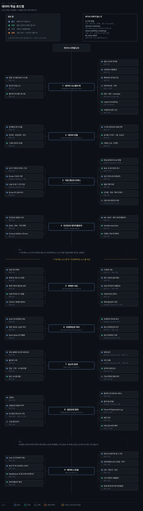

# 데이터·데이터베이스 학습 로드맵
---

## 이 순서를 잡은 기준

> 데이터를 이론부터 배우면 복제와 합의에서 지쳐 정작 매일 쓰는 쿼리 한 줄을 못 읽습니다. 이 로드맵은 반대로 갑니다 — **애플리케이션 코드가 실제로 만드는 쿼리에서 시작해 그것이 흔들릴 때 한 층씩 내려갑니다.**

순서를 잡은 규칙은 하나입니다. **장애가 올라오는 순서를 거꾸로** 놓았습니다.

느린 API 를 만나면 먼저 어떤 쿼리가 나갔는지 봅니다. 다음으로 그 쿼리가 인덱스를 타는지, ORM 이 N+1 을 만들지 않았는지 봅니다. 그래도 안 되면 트랜잭션 격리와 락을 봅니다. 여기까지가 단일 DB 의 세계입니다. 복제 지연이나 샤딩 경계가 원인이면 그때 분산으로 내려갑니다. 이 순서가 곧 배우는 순서입니다.

**0~4단계가 단일 DB 의 범위입니다.** SQL, 영속성 계층, 트랜잭션, 운영 환경이 여기 들어갑니다. 5단계부터가 분산이고, 그쪽은 노드가 둘 이상일 때만 생기는 문제를 다룹니다. 이 경계를 흐리면 단일 DB 의 격리 수준 문제를 분산 일관성 문제로 오해하게 됩니다.

**0단계 앞에 두 자리를 더 뒀습니다.** 0.3단계가 데이터 모델이고 0.7단계가 저장 엔진입니다. 쿼리를 읽으려면 그 쿼리가 어떤 모델 위에 서 있고 어떤 자료구조를 두드리는지를 알아야 합니다. 다만 이 둘은 장애로 올라오지 않고 설계 시점에 이미 정해져 있어, 번호를 소수로 두고 배지를 `추천` 으로 낮췄습니다. 건너뛰어도 1단계는 열리지만, 인덱스가 왜 그렇게 도는지는 설명하지 못한 채 남습니다.

**메시지 브로커의 구현은 이 로드맵에 넣지 않았습니다.** [`04_messaging`](../04_messaging/README.md) 이 Kafka·Redpanda·Outbox·CDC 를 통째로 맡고 있어서 중복입니다. 여기서는 스트림이 *왜* 필요한지까지만 다루고, 브로커를 *어떻게* 운영하는지는 넘깁니다.

단계마다 표를 둘 둡니다. 하나는 자료가 다루는 개념이고 다른 하나는 **자료 밖 키워드**입니다. 뒤쪽은 책이나 노트가 이름만 스치고 지나간 것이라, 무엇을 검색할지 정하는 용도로 씁니다.

배지는 셋입니다. **필수**는 빼면 뒤가 막히는 것, **추천**은 빼도 뒤가 굴러가지만 손해가 큰 것, **선택**은 목표가 생겼을 때만 여는 것입니다. 필수는 0·1·2·5·6 단계 다섯이고, 이 다섯이 쿼리에서 분산 일관성까지 이어지는 척추입니다.

배지가 필수인 자리는 뒤가 실제로 막히기 때문입니다. 0단계의 인덱스와 실행 계획을 모르면 1단계에서 QueryDSL 이 만든 쿼리를 읽어도 빠른지 느린지 판단할 수 없습니다. 2단계의 격리 수준을 건너뛰면 5단계의 복제 지연이 같은 문제로 보이고, 5단계 없이 6단계로 가면 합의 알고리즘이 이름 나열로 남습니다.

읽는 축과 별개로 손으로 확인하는 축이 하나 더 있는데, 그것은 아래 실습 절이 맡습니다.

## 무엇을 골랐는가

> 자료가 두 종류입니다. 책 한 권을 장 순서대로 따라간 정독본과, 주제로 묶은 자체 노트입니다.

둘의 경계는 [05_data MOC](../05_data/README.md) §경계 기준이 정합니다.

| 자료 | 편수 | 자리 |
|---|:---:|---|
| [sql-mysql](../05_data/02_relational/sql-mysql/README.md) | 12 | 0단계의 기둥 |
| [jdbc](../05_data/03_persistence/jdbc/README.md) | 11 | 1단계 |
| [jpa](../05_data/03_persistence/jpa/README.md) | 19 | 1·2단계 |
| [querydsl](../05_data/03_persistence/querydsl/README.md) | 18 | 3단계 |
| [06_operations](../05_data/06_operations/README.md) | 6 | 4단계 |
| [01_foundation](../05_data/01_foundation/README.md) | 19 | 0·0.3·0.7·2·5단계의 보조. DDIA 1판 요약 축 |
| [DDIA 2판 정독](../05_data/book/designing-data-intensive-applications/README.md) | 65 | 0.3·0.7·5·6·7단계의 기둥 |
| Database Internals 1~7장 | 참조 | 0.7단계의 보조. 저장 엔진의 구현 축 |
| Patterns of Distributed Systems | 참조 | 6·6.5단계의 보조. 이론을 패턴으로 분해한 축 |

**[DDIA 2판](../05_data/book/designing-data-intensive-applications/README.md)** 이 이 로드맵의 분산 구간을 통째로 맡습니다. Martin Kleppmann·Chris Riccomini 의 2판을 1~14장 전 장 정독한 노트입니다. 장 번호가 1판과 다른 별개 판본입니다. 1판 요약은 `01_foundation/` 에 따로 있습니다. 그래서 같은 주제를 두 판본으로 볼 수 있습니다.

**정독 노트 65편 중 28편이 그동안 순서 밖에 있었습니다.** 로드맵이 링크한 것은 6~14장뿐이고 0~5장은 어느 단계에도 걸리지 않았습니다. 이번에 3장을 0.3단계로, 4장을 0.7단계로 세우고, 5장을 7단계에 붙였습니다. 1·2장은 §로드맵에 넣지 않은 것으로 보냈습니다.

**외부 책 둘은 자료가 아니라 참조로 걸었습니다.** DDIA 4장이 B-tree 와 LSM 을 여섯 편으로 훑는데, 페이지 분할과 WAL 이 실제로 어떻게 도는지는 《Database Internals》 2~7장이 장 하나씩 잡고 있습니다. 6단계도 마찬가지여서, DDIA 10장이 합의가 무엇인지를 말하면 《Patterns of Distributed Systems》 11·12장이 그것을 구현 패턴으로 되짚습니다. 둘 다 정독 노트를 만들지 않았으므로 배지를 `추천` 위로 올리지 않았습니다.

자체 노트 쪽은 분량이 고르지 않습니다. `querydsl` 18편이 `sql-mysql` 12편보다 많은데, 이건 QueryDSL 이 더 중요해서가 아니라 6.12 버전의 함정을 하나씩 기록한 결과입니다. 로드맵에서는 분량이 아니라 **의존 순서**로 단계를 놓았습니다.

## 낡음 점검

> 책은 찍힌 시점에 멈춥니다. 낡음 기준은 앞선 로드맵들과 같습니다 — 도구와 제품 버전처럼 빨리 바뀌는 축은 5년을 넘기면 공식 문서로 대신하고, 데이터 이론처럼 느리게 바뀌는 축은 오래돼도 남깁니다.

| 자료 | 기준 시점 | 조치 |
|---|:---:|---|
| DDIA 2판 정독 | 2판 | 그대로. 1판(2017)의 낡은 축을 저자가 이미 걷어냄 |
| 01_foundation | DDIA 1판 요약 | **조건부 유지.** 2판과 장 번호가 어긋남 |
| querydsl | 6.12 기준 | **조건부 유지.** 7.x 마이그레이션 문서가 같은 폴더에 있음 |
| sql-mysql · jdbc · jpa | 제품 버전 명시 없음 | 그대로. 원리 축이라 느리게 바뀜 |
| 06_operations | 2026-07 | 그대로 |
| Database Internals | 2019 | **조건부 유지.** 저장 엔진 원리는 그대로. 예로 든 제품 버전은 공식 문서로 |
| Patterns of Distributed Systems | 2023 | 그대로. 패턴 축이라 느리게 바뀜 |

**DDIA 는 판 사이에 내용이 갈립니다.** 2판이 MapReduce 를 폐기하고 배치 처리 장을 다시 썼습니다. 벡터 인덱스·DataFrame·오브젝트 스토어가 새로 들어갔고 sync engine·durable execution·GDPR 이 신규입니다. 이 목록은 [DDIA 정독 README](../05_data/book/designing-data-intensive-applications/README.md) §책 메타 표에 있습니다. 그래서 `01_foundation/` 의 1판 요약을 읽을 때는 **장 번호로 2판을 찾지 않습니다** — 주제로 짚습니다.

**QueryDSL 은 버전이 갈리는 자리입니다.** 노트가 6.12 를 기준으로 쓰였고, 7.x 로 올릴 때 바뀌는 것은 [대안 비교와 6.12-7.x 마이그레이션](../05_data/03_persistence/querydsl/03-02.%EB%8C%80%EC%95%88%20%EB%B9%84%EA%B5%90%EC%99%80%206.12-7.x%20%EB%A7%88%EC%9D%B4%EA%B7%B8%EB%A0%88%EC%9D%B4%EC%85%98.md) 이 따로 다룹니다. 3단계를 열 때 이 편을 먼저 확인해 지금 쓰는 버전을 맞춥니다.

**외부 책 둘은 판을 확인해 두었습니다.** 《Database Internals》 는 1판뿐이고 2판 소식이 없습니다. 2019년 책이라 5년 기준을 넘겼지만 B-tree 페이지 분할과 WAL 은 느리게 바뀌는 축이라 남깁니다. 다만 책이 예로 든 제품 버전은 그대로 믿지 않고 공식 문서로 확인합니다.

## 손으로 확인하는 실습

> 읽기만 하면 남의 말을 옮기게 됩니다. 데이터는 특히 그렇습니다 — 격리 수준은 두 세션을 동시에 열어 봐야 알고, N+1 은 로그를 켜 봐야 보입니다.

기준은 **그 자리를 손으로 확인할 자료가 이미 노트 안에 있는가** 하나입니다. 이 로드맵의 실습은 외부 저장소가 아니라 대부분 자체 노트의 실습 절과 로컬 DB 로 충분합니다. 비어 있는 단계는 실습이 필요 없어서가 아니라 확인한 자료를 못 찾아서이고, 지어낸 출처를 채우지 않았습니다.

| 출처 | 어느 자리 | 무엇 |
|---|---|---|
| [인덱스 실전 — EXPLAIN, IOT, 페이지네이션](../05_data/02_relational/sql-mysql/03-01.%EC%9D%B8%EB%8D%B1%EC%8A%A4%20%EC%8B%A4%EC%A0%84%20%E2%80%94%20EXPLAIN%2C%20IOT%2C%20%ED%8E%98%EC%9D%B4%EC%A7%80%EB%84%A4%EC%9D%B4%EC%85%98.md) | 0 | `EXPLAIN` 을 직접 찍어 인덱스를 타는지 확인 |
| [동시성제어와 락](../05_data/02_relational/sql-mysql/04-02.%EB%8F%99%EC%8B%9C%EC%84%B1%EC%A0%9C%EC%96%B4%EC%99%80%20%EB%9D%BD.md) · [InnoDB MVCC](../05_data/02_relational/sql-mysql/04-01.InnoDB%20MVCC.md) | 2 | 세션 둘을 열어 락 대기와 스냅샷을 재현 |
| [프록시와 N+1](../05_data/03_persistence/jpa/03-03.%ED%94%84%EB%A1%9D%EC%8B%9C%EC%99%80%20N%2B1.md) | 1 | SQL 로그를 켜고 쿼리 수를 세기 |
| [log4jdbc 로그 제어 베스트 프랙티스](../05_data/03_persistence/jdbc/04-02.log4jdbc%20%EB%A1%9C%EA%B7%B8%20%EC%A0%9C%EC%96%B4%20%EB%B2%A0%EC%8A%A4%ED%8A%B8%20%ED%94%84%EB%9E%99%ED%8B%B0%EC%8A%A4.md) | 1 | 실제 나가는 SQL 을 파라미터까지 보이게 설정 |
| [테스트와 멀티모듈](../05_data/03_persistence/querydsl/03-01.%ED%85%8C%EC%8A%A4%ED%8A%B8%EC%99%80%20%EB%A9%80%ED%8B%B0%EB%AA%A8%EB%93%88.md) | 3 | Q 타입 생성과 테스트 구성을 직접 돌리기 |
| [임베디드 DB 테스트](../05_data/06_operations/02-01.%EC%9E%84%EB%B2%A0%EB%94%94%EB%93%9C%20DB%20%ED%85%8C%EC%8A%A4%ED%8A%B8.md) · [테스트 트랜잭션](../05_data/06_operations/02-02.%ED%85%8C%EC%8A%A4%ED%8A%B8%20%ED%8A%B8%EB%9E%9C%EC%9E%AD%EC%85%98.md) | 4 | 운영 DB 없이 도는 테스트 환경 세우기 |
| [DB 덤프와 로컬 이관](../05_data/06_operations/01-01.DB%20%EB%8D%A4%ED%94%84%EC%99%80%20%EB%A1%9C%EC%BB%AC%20%EC%9D%B4%EA%B4%80.md) | 4 | 운영 스키마를 로컬로 내려 같은 쿼리를 재현 |

5~7단계 자리는 비어 있습니다. 복제 지연·합의·샤딩 리밸런싱은 노드를 여럿 띄워야 재현되고, 그 환경은 이 카테고리가 아니라 [04_messaging](../04_messaging/README.md) 의 실습과 실제 운영 클러스터에 있습니다. DDIA 정독 노트도 이론 축이라 실습 절을 두지 않았습니다.

**로컬 DB 는 운영 스키마로 세웁니다.** 격리 수준과 락은 스키마와 데이터 분포에 따라 재현이 갈리므로, 빈 테이블에 두 행을 넣고 확인한 결과를 운영으로 가져가면 어긋납니다. 4단계의 덤프·이관 문서를 0단계 실습보다 먼저 열어도 됩니다 — 순서가 강제되는 자리가 아닙니다.

## 쿼리와 영속성 · 0~3단계

> 코드가 만드는 쿼리에서 시작해 그 쿼리가 서 있는 모델과 자료구조까지 내려간 뒤, 다시 올라와 영속성 계층과 트랜잭션을 봅니다.

### 0단계 · sql-mysql 전 12편과 01_foundation 인덱스 이론  `필수`

애플리케이션이 무엇을 보내는지 모르면 그 뒤 전부가 추측이 됩니다. SQL·정규화·조인·인덱스를 먼저 잡아, 코드가 만드는 쿼리를 읽고 빠른지 느린지 판단할 수 있게 합니다.

| 개념 | 어디서 |
|---|---|
| DDL·DML·함수, JOIN·SUBQUERY·CTE | [01-01](../05_data/02_relational/sql-mysql/01-01.SQL%20%EA%B8%B0%EC%B4%88%20%E2%80%94%20DDL%2C%20DML%2C%20%ED%95%A8%EC%88%98.md) · [01-02](../05_data/02_relational/sql-mysql/01-02.JOIN%2C%20SUBQUERY%2C%20CTE.md) |
| MySQL 과 InnoDB, 정규화와 비정규화 | [02-01](../05_data/02_relational/sql-mysql/02-01.MySQL%20%EA%B8%B0%EC%B4%88%EC%99%80%20InnoDB.md) · [02-02](../05_data/02_relational/sql-mysql/02-02.%EC%A0%95%EA%B7%9C%ED%99%94%EC%99%80%20%EB%B9%84%EC%A0%95%EA%B7%9C%ED%99%94.md) |
| `EXPLAIN`·IOT·페이지네이션, 인덱스 이론 | [03-01](../05_data/02_relational/sql-mysql/03-01.%EC%9D%B8%EB%8D%B1%EC%8A%A4%20%EC%8B%A4%EC%A0%84%20%E2%80%94%20EXPLAIN%2C%20IOT%2C%20%ED%8E%98%EC%9D%B4%EC%A7%80%EB%84%A4%EC%9D%B4%EC%85%98.md) · [01-05](../05_data/01_foundation/01-05.%EC%9D%B8%EB%8D%B1%EC%8A%A4%20%EC%9D%B4%EB%A1%A0.md) |
| GroupBy·OrderBy 함정, 쿼리 최적화 체크리스트 | [06-01](../05_data/02_relational/sql-mysql/06-01.GroupBy%20OrderBy%20%ED%95%A8%EC%A0%95.md) · [07-01](../05_data/02_relational/sql-mysql/07-01.%EC%BF%BC%EB%A6%AC%20%EC%B5%9C%EC%A0%81%ED%99%94%20%EC%B2%B4%ED%81%AC%EB%A6%AC%EC%8A%A4%ED%8A%B8.md) |

| 자료 밖 키워드 | 무엇을 검색할지 |
|---|---|
| 커버링 인덱스 · 인덱스 선택도 | 옵티마이저가 인덱스를 버리는 조건 |
| 실행 계획 캐시 · 통계 갱신 | 같은 쿼리가 어제와 다른 계획을 타는 이유 |

완료 기준은 테이블 구조와 조회 패턴을 보고 정규화·인덱스·조인 방식의 선택 이유를 설명하는 것입니다.

### 0.3단계 · DDIA 2판 3장 6편  `추천`

관계형이냐 문서냐는 쿼리를 쓰기 전에 이미 정해져 있고, 그 선택이 조인을 몇 번 하게 될지를 결정합니다. 0단계의 정규화·비정규화가 이 선택의 결과입니다.

| 개념 | 어디서 |
|---|---|
| 관계형 vs 문서 모델, 정규화·비정규화·조인 | [03-01](../05_data/book/designing-data-intensive-applications/03-01.%EA%B4%80%EA%B3%84%ED%98%95%20vs%20%EB%AC%B8%EC%84%9C%20%EB%AA%A8%EB%8D%B8.md) · [03-02](../05_data/book/designing-data-intensive-applications/03-02.%EC%A0%95%EA%B7%9C%ED%99%94%C2%B7%EB%B9%84%EC%A0%95%EA%B7%9C%ED%99%94%C2%B7%EC%A1%B0%EC%9D%B8.md) |
| 분석용 스키마 — 별·눈송이·OBT | [03-03](../05_data/book/designing-data-intensive-applications/03-03.%EB%B6%84%EC%84%9D%EC%9A%A9%20%EC%8A%A4%ED%82%A4%EB%A7%88%20%E2%80%94%20%EB%B3%84%C2%B7%EB%88%88%EC%86%A1%EC%9D%B4%C2%B7OBT.md) |
| 모델 선택과 스키마 유연성, 그래프 모델 | [03-04](../05_data/book/designing-data-intensive-applications/03-04.%EB%AA%A8%EB%8D%B8%20%EC%84%A0%ED%83%9D%EA%B3%BC%20%EC%8A%A4%ED%82%A4%EB%A7%88%20%EC%9C%A0%EC%97%B0%EC%84%B1.md) · [03-05](../05_data/book/designing-data-intensive-applications/03-05.%EA%B7%B8%EB%9E%98%ED%94%84%20%EB%8D%B0%EC%9D%B4%ED%84%B0%20%EB%AA%A8%EB%8D%B8.md) |
| 이벤트 소싱·CQRS·DataFrame | [03-06](../05_data/book/designing-data-intensive-applications/03-06.%EC%9D%B4%EB%B2%A4%ED%8A%B8%20%EC%86%8C%EC%8B%B1%C2%B7CQRS%C2%B7DataFrame.md) |
| 1판 대응 — 데이터 모델과 쿼리 언어, NoSQL 비교 | [01-01](../05_data/01_foundation/01-01.%EB%8D%B0%EC%9D%B4%ED%84%B0%20%EB%AA%A8%EB%8D%B8%EA%B3%BC%20%EC%BF%BC%EB%A6%AC%20%EC%96%B8%EC%96%B4.md) · [01-06](../05_data/01_foundation/01-06.NoSQL%20%EB%B9%84%EA%B5%90.md) |

| 자료 밖 키워드 | 무엇을 검색할지 |
|---|---|
| 다중 모델 DB | 한 제품이 문서와 그래프를 같이 담을 때 무엇을 잃는가 |
| OBT 와 스토리지 비용 | 비정규화가 스캔을 줄이고 대신 무엇을 늘리는가 |

완료 기준은 주어진 조회 패턴에 관계형·문서·그래프 중 어느 모델이 맞는지를 조인 횟수와 스키마 변경 빈도로 설명하는 것입니다.

### 0.7단계 · DDIA 2판 4장 6편과 Database Internals 1~7장  `추천`

0단계의 `EXPLAIN` 이 "인덱스를 탄다"고 말할 때, 그 인덱스가 어떤 자료구조인지가 여기입니다. B-tree 와 LSM 의 갈림이 곧 InnoDB 와 RocksDB 의 갈림이고, WAL 이 왜 있는지가 2단계 격리 수준의 전제입니다.

| 개념 | 어디서 |
|---|---|
| OLTP 저장과 인덱스 기초, LSM 저장 엔진 | [04-01](../05_data/book/designing-data-intensive-applications/04-01.OLTP%20%EC%A0%80%EC%9E%A5%EA%B3%BC%20%EC%9D%B8%EB%8D%B1%EC%8A%A4%20%EA%B8%B0%EC%B4%88.md) · [04-02](../05_data/book/designing-data-intensive-applications/04-02.LSM%20%EC%A0%80%EC%9E%A5%20%EC%97%94%EC%A7%84.md) |
| B-tree 와 LSM 비교, 보조 인덱스와 인메모리 저장 | [04-03](../05_data/book/designing-data-intensive-applications/04-03.B-tree%EC%99%80%20LSM%20%EB%B9%84%EA%B5%90.md) · [04-04](../05_data/book/designing-data-intensive-applications/04-04.%EB%B3%B4%EC%A1%B0%20%EC%9D%B8%EB%8D%B1%EC%8A%A4%EC%99%80%20%EC%9D%B8%EB%A9%94%EB%AA%A8%EB%A6%AC%20%EC%A0%80%EC%9E%A5.md) |
| 분석용 컬럼 지향 저장, 다차원·전문·벡터 인덱스 | [04-05](../05_data/book/designing-data-intensive-applications/04-05.%EB%B6%84%EC%84%9D%EC%9A%A9%20%EC%BB%AC%EB%9F%BC%20%EC%A7%80%ED%96%A5%20%EC%A0%80%EC%9E%A5.md) · [04-06](../05_data/book/designing-data-intensive-applications/04-06.%EB%8B%A4%EC%B0%A8%EC%9B%90%C2%B7%EC%A0%84%EB%AC%B8%C2%B7%EB%B2%A1%ED%84%B0%20%EC%9D%B8%EB%8D%B1%EC%8A%A4.md) |
| 1판 대응 — 저장소와 검색, WAL 패턴 | [01-02](../05_data/01_foundation/01-02.%EC%A0%80%EC%9E%A5%EC%86%8C%EC%99%80%20%EA%B2%80%EC%83%89.md) · [03-04](../05_data/01_foundation/03-04.WAL%20%ED%8C%A8%ED%84%B4.md) |

정독 노트가 요약하고 넘어간 자리를 《Database Internals》 가 장 하나씩 잡습니다. 노트를 만들지 않았으므로 참조로만 겁니다.

| Database Internals | 무엇을 더 얹나 |
|---|---|
| 2. B-Tree Basics · 4. Implementing B-Trees | 노드 분할·병합과 페이지 레이아웃 |
| 3. File Formats | 슬롯 디렉터리와 가변 길이 레코드가 디스크에 놓이는 방식 |
| 5. Transaction Processing and Recovery | WAL 과 ARIES. 2단계 InnoDB MVCC 의 아래층 |
| 6. B-Tree Variants · 7. Log-Structured Storage | copy-on-write 와 Bw-tree, LSM 컴팩션 전략 |

| 자료 밖 키워드 | 무엇을 검색할지 |
|---|---|
| 쓰기 증폭 · 읽기 증폭 | LSM 컴팩션 전략을 고르는 기준 |
| fsync 와 그룹 커밋 | 내구성과 처리량을 맞바꾸는 지점 |

완료 기준은 읽기 위주와 쓰기 위주 워크로드에 B-tree 와 LSM 중 무엇을 고를지, 그 선택이 인덱스 조회와 컴팩션에 어떤 비용을 남기는지 설명하는 것입니다.

### 1단계 · jdbc 전 11편과 jpa 01~03번대  `필수`

같은 SQL 이 애플리케이션에서 어떻게 만들어지는지를 봅니다. 커넥션 풀에서 시작해 영속성 컨텍스트까지 올라가면, ORM 이 만드는 쿼리를 0단계의 눈으로 읽을 수 있습니다.

| 개념 | 어디서 |
|---|---|
| DataSource 와 커넥션 풀, JdbcTemplate | [01-01](../05_data/03_persistence/jdbc/01-01.%EC%BB%A4%EB%84%A5%EC%85%98%20%ED%92%80%EA%B3%BC%20DataSource.md) · [02-01](../05_data/03_persistence/jdbc/02-01.JdbcTemplate.md) |
| 스프링 예외 추상화 | [03-01](../05_data/03_persistence/jdbc/03-01.%EC%8A%A4%ED%94%84%EB%A7%81%20%EC%98%88%EC%99%B8%20%EC%B6%94%EC%83%81%ED%99%94.md) |
| 영속성 컨텍스트, 엔티티·연관관계 매핑 | [01-02](../05_data/03_persistence/jpa/01-02.JPA%20%EC%8B%9C%EC%9E%91%EA%B3%BC%20%EC%98%81%EC%86%8D%EC%84%B1%20%EC%BB%A8%ED%85%8D%EC%8A%A4%ED%8A%B8.md) · [02-01](../05_data/03_persistence/jpa/02-01.%EC%97%94%ED%8B%B0%ED%8B%B0%20%EB%A7%B5%ED%95%91.md) · [02-02](../05_data/03_persistence/jpa/02-02.%EC%97%B0%EA%B4%80%EA%B4%80%EA%B3%84%20%EB%A7%A4%ED%95%91.md) |
| 프록시와 N+1, 페이징·Projection | [03-03](../05_data/03_persistence/jpa/03-03.%ED%94%84%EB%A1%9D%EC%8B%9C%EC%99%80%20N%2B1.md) · [03-04](../05_data/03_persistence/jpa/03-04.Auditing%2C%20%ED%8E%98%EC%9D%B4%EC%A7%95%2C%20Projection.md) |
| SQL 로깅의 운영 비용 | [04-01](../05_data/03_persistence/jdbc/04-01.JDBC%20%EB%93%9C%EB%9D%BC%EC%9D%B4%EB%B2%84%20wrap%20%EB%A1%9C%EA%B9%85%EC%9D%98%20%EC%9A%B4%EC%98%81%20%EB%B9%84%EC%9A%A9.md) · [04-03](../05_data/03_persistence/jdbc/04-03.OTel%20JDBC%20%EC%A1%B8%EC%97%85%20%EA%B2%BD%EB%A1%9C.md) |

| 자료 밖 키워드 | 무엇을 검색할지 |
|---|---|
| 풀 크기 산정 · 커넥션 누수 | 풀이 마르는 증상과 타임아웃 설정의 관계 |
| 쓰기 지연 · flush 시점 | 영속성 컨텍스트가 SQL 을 미루는 규칙 |

완료 기준은 단순 CRUD 에는 어느 계층을 쓰고, 복잡한 조회·벌크 연산·직접 SQL 에는 어떤 도구를 고를지 근거와 함께 말하는 것입니다.

### 2단계 · sql-mysql 04번대와 jpa 04번대  `필수`

같은 문제를 DB 와 프레임워크 두 계층에서 봅니다. 격리 수준은 DB 가 정하고 전파 옵션은 스프링이 정하는데, 둘을 섞으면 트랜잭션이 왜 롤백됐는지 설명할 수 없습니다.

| 개념 | 어디서 |
|---|---|
| 트랜잭션과 격리 수준 | [01-04](../05_data/01_foundation/01-04.%ED%8A%B8%EB%9E%9C%EC%9E%AD%EC%85%98%EA%B3%BC%20%EA%B2%A9%EB%A6%AC%20%EC%88%98%EC%A4%80.md) |
| InnoDB MVCC, 동시성 제어와 락 | [04-01](../05_data/02_relational/sql-mysql/04-01.InnoDB%20MVCC.md) · [04-02](../05_data/02_relational/sql-mysql/04-02.%EB%8F%99%EC%8B%9C%EC%84%B1%EC%A0%9C%EC%96%B4%EC%99%80%20%EB%9D%BD.md) |
| 스프링 트랜잭션과 전파 | [04-01](../05_data/03_persistence/jpa/04-01.%EC%8A%A4%ED%94%84%EB%A7%81%20%ED%8A%B8%EB%9E%9C%EC%9E%AD%EC%85%98.md) · [04-01b](../05_data/03_persistence/jpa/04-01b.%ED%8A%B8%EB%9E%9C%EC%9E%AD%EC%85%98%20%EC%A0%84%ED%8C%8C%20%ED%99%9C%EC%9A%A9.md) |
| 낙관적·비관적 락 | [04-02](../05_data/03_persistence/jpa/04-02.%EB%82%99%EA%B4%80%EC%A0%81%20%EB%B9%84%EA%B4%80%EC%A0%81%20%EB%9D%BD.md) |

| 자료 밖 키워드 | 무엇을 검색할지 |
|---|---|
| 갭 락 · 넥스트 키 락 | REPEATABLE READ 에서 삽입이 막히는 이유 |
| 데드락 감지 · 락 대기 타임아웃 | 두 트랜잭션이 서로를 기다릴 때 DB 가 고르는 희생자 |

완료 기준은 격리 수준, 낙관·비관 락, 전파 옵션을 서로 다른 문제로 구분하고, 재고·결제처럼 충돌이 가능한 유스케이스의 선택을 설명하는 것입니다.

### 3단계 · querydsl 전 18편  `추천`

동적 검색·DTO 조회·복잡한 페이징이 JPQL 문자열로는 감당이 안 될 때 엽니다. 앞선 두 단계 없이 여기부터 시작하면 생성된 SQL 을 읽을 눈이 없어 함정을 그대로 밟습니다.

| 개념 | 어디서 |
|---|---|
| 입문과 6.12 의 위치, 셋업 | [01-01](../05_data/03_persistence/querydsl/01-01.QueryDSL%20%EC%9E%85%EB%AC%B8%EA%B3%BC%206.12%EC%9D%98%20%EC%9C%84%EC%B9%98.md) · [01-02](../05_data/03_persistence/querydsl/01-02.%ED%94%84%EB%A1%9C%EC%A0%9D%ED%8A%B8%20%EC%85%8B%EC%97%85%20(Gradle%206.12).md) |
| 기본 문법·조인, 동적 쿼리 | [01-03](../05_data/03_persistence/querydsl/01-03.%EA%B8%B0%EB%B3%B8%20%EB%AC%B8%EB%B2%95%EA%B3%BC%20%EC%A1%B0%EC%9D%B8.md) · [01-04](../05_data/03_persistence/querydsl/01-04.%EB%8F%99%EC%A0%81%20%EC%BF%BC%EB%A6%AC.md) |
| 프로젝션·DTO 매핑, 페이징과 fetch join 함정 | [01-05](../05_data/03_persistence/querydsl/01-05.%ED%94%84%EB%A1%9C%EC%A0%9D%EC%85%98%EA%B3%BC%20DTO%20%EB%A7%A4%ED%95%91.md) · [01-06](../05_data/03_persistence/querydsl/01-06.%ED%8E%98%EC%9D%B4%EC%A7%95%EA%B3%BC%20fetch%20join%20%ED%95%A8%EC%A0%95.md) |
| PathBuilder, JPAExpressions 서브쿼리 | [02-01](../05_data/03_persistence/querydsl/02-01.PathBuilder%20%E2%80%94%20%EB%8F%99%EC%A0%81%20path%20%EB%B9%8C%EB%8D%94%20%EA%B9%8A%EC%9D%B4.md) · [02-02](../05_data/03_persistence/querydsl/02-02.JPAExpressions%20%E2%80%94%20%EC%84%9C%EB%B8%8C%EC%BF%BC%EB%A6%AC%20%ED%95%A9%EC%84%B1.md) |
| 락과 동시성 제어, 6.12-7.x 마이그레이션 | [03-04](../05_data/03_persistence/querydsl/03-04.%EB%9D%BD%EA%B3%BC%20%EB%8F%99%EC%8B%9C%EC%84%B1%20%EC%A0%9C%EC%96%B4.md) · [03-02](../05_data/03_persistence/querydsl/03-02.%EB%8C%80%EC%95%88%20%EB%B9%84%EA%B5%90%EC%99%80%206.12-7.x%20%EB%A7%88%EC%9D%B4%EA%B7%B8%EB%A0%88%EC%9D%B4%EC%85%98.md) |

| 자료 밖 키워드 | 무엇을 검색할지 |
|---|---|
| APT 와 Q 타입 생성 실패 | 빌드에서 Q 클래스가 안 나올 때 보는 자리 |
| window 함수 부재 | JPA 에서 `ROW_NUMBER` 가 필요할 때의 우회 — [03-05](../05_data/03_persistence/querydsl/03-05.window%20%ED%95%A8%EC%88%98%20%EC%97%86%EB%8A%94%20JPA%20QueryDSL%EC%9D%98%20ROW_NUMBER%20%EB%8C%80%EC%B2%B4.md) 가 이미 다룸 |

## 운영과 테스트 · 4단계

> 앞 단계를 손으로 확인할 환경을 세웁니다. 순서상 뒤에 뒀지만 0단계 실습보다 먼저 열어도 됩니다.

### 4단계 · 06_operations 전 6편  `추천`

앞선 단계를 손으로 확인할 환경을 세웁니다. 순서상 뒤에 뒀지만 0단계 실습보다 먼저 열어도 됩니다 — 운영 스키마를 로컬로 내려야 격리 수준 재현이 운영과 어긋나지 않습니다.

| 개념 | 어디서 |
|---|---|
| DB 덤프와 로컬 이관 | [01-01](../05_data/06_operations/01-01.DB%20%EB%8D%A4%ED%94%84%EC%99%80%20%EB%A1%9C%EC%BB%AC%20%EC%9D%B4%EA%B4%80.md) · [01-02](../05_data/06_operations/01-02.DB%20%EB%8D%A4%ED%94%84%EC%99%80%20%EB%A1%9C%EC%BB%AC%20%EC%9D%B4%EA%B4%80%20(%EC%8B%AC%ED%99%94).md) |
| 로컬 개발환경 운영 모델 | [01-03](../05_data/06_operations/01-03.%EB%A1%9C%EC%BB%AC%20%EA%B0%9C%EB%B0%9C%ED%99%98%EA%B2%BD%20%EC%9A%B4%EC%98%81%20%EB%AA%A8%EB%8D%B8.md) |
| 임베디드 DB 테스트, 테스트 트랜잭션 | [02-01](../05_data/06_operations/02-01.%EC%9E%84%EB%B2%A0%EB%94%94%EB%93%9C%20DB%20%ED%85%8C%EC%8A%A4%ED%8A%B8.md) · [02-02](../05_data/06_operations/02-02.%ED%85%8C%EC%8A%A4%ED%8A%B8%20%ED%8A%B8%EB%9E%9C%EC%9E%AD%EC%85%98.md) |

| 자료 밖 키워드 | 무엇을 검색할지 |
|---|---|
| Testcontainers | 임베디드 DB 와 실제 DB 이미지의 선택 기준 |
| 마이그레이션 도구 | Flyway·Liquibase 로 스키마 변경을 버전화하는 방식 |

완료 기준은 느린 쿼리를 `EXPLAIN` 으로 확인할 지점과, 로컬·테스트 환경이 운영 DB 에 의존하지 않게 만드는 방법을 설명하는 것입니다.

## 분산 데이터 · 5~7단계

> 노드가 둘 이상이 되면서 생기는 문제를 다룹니다. 여기부터는 정확한 값이 아니라 언제까지 어긋날 수 있는가를 묻습니다.

### 5단계 · DDIA 2판 6~8장  `필수`

노드가 둘 이상이 되면 단일 DB 에 없던 문제가 생깁니다. 복제와 샤딩이 그것이고, 여기서부터 "정확한 값"이 아니라 "언제까지 어긋날 수 있는가"를 다룹니다.

| 개념 | 어디서 |
|---|---|
| 복제 개요와 단일 리더, 노드 장애와 복제 로그 | [06-01](../05_data/book/designing-data-intensive-applications/06-01.%EB%B3%B5%EC%A0%9C%20%EA%B0%9C%EC%9A%94%EC%99%80%20%EB%8B%A8%EC%9D%BC%20%EB%A6%AC%EB%8D%94.md) · [06-02](../05_data/book/designing-data-intensive-applications/06-02.%EB%85%B8%EB%93%9C%20%EC%9E%A5%EC%95%A0%20%EC%B2%98%EB%A6%AC%EC%99%80%20%EB%B3%B5%EC%A0%9C%20%EB%A1%9C%EA%B7%B8.md) |
| 복제 지연과 일관성 보장 | [06-03](../05_data/book/designing-data-intensive-applications/06-03.%EB%B3%B5%EC%A0%9C%20%EC%A7%80%EC%97%B0%20%EB%AC%B8%EC%A0%9C%EC%99%80%20%EC%9D%BC%EA%B4%80%EC%84%B1%20%EB%B3%B4%EC%9E%A5.md) |
| 다중 리더 복제, 쓰기 충돌 해소, 리더리스 | [06-04](../05_data/book/designing-data-intensive-applications/06-04.%EB%8B%A4%EC%A4%91%20%EB%A6%AC%EB%8D%94%20%EB%B3%B5%EC%A0%9C.md) · [06-05](../05_data/book/designing-data-intensive-applications/06-05.%EC%93%B0%EA%B8%B0%20%EC%B6%A9%EB%8F%8C%20%ED%95%B4%EC%86%8C.md) · [06-06](../05_data/book/designing-data-intensive-applications/06-06.%EB%A6%AC%EB%8D%94%EB%A6%AC%EC%8A%A4%20%EB%B3%B5%EC%A0%9C%EC%99%80%206%EC%9E%A5%20%EC%A2%85%ED%95%A9.md) |
| 샤딩 — 키 범위·해시·라우팅·리밸런싱 | [07-01](../05_data/book/designing-data-intensive-applications/07-01.%EC%83%A4%EB%94%A9%20%EA%B0%9C%EC%9A%94%EC%99%80%20%ED%82%A4%20%EB%B2%94%EC%9C%84%20%EC%83%A4%EB%94%A9.md) ~ [07-04](../05_data/book/designing-data-intensive-applications/07-04.%EB%B3%B4%EC%A1%B0%20%EC%9D%B8%EB%8D%B1%EC%8A%A4%EC%99%80%207%EC%9E%A5%20%EC%A2%85%ED%95%A9.md) |
| 분산 트랜잭션과 2PC | [08-04](../05_data/book/designing-data-intensive-applications/08-04.%EB%B6%84%EC%82%B0%20%ED%8A%B8%EB%9E%9C%EC%9E%AD%EC%85%98%EA%B3%BC%202PC.md) |
| 1판 대응 — 복제, 샤딩 | [02-03](../05_data/01_foundation/02-03.%EB%B3%B5%EC%A0%9C.md) · [02-04](../05_data/01_foundation/02-04.%EC%83%A4%EB%94%A9.md) |

| 자료 밖 키워드 | 무엇을 검색할지 |
|---|---|
| 읽기 전용 복제본 라우팅 | 애플리케이션에서 읽기를 복제본으로 보낼 때의 지연 감수 |
| 페일오버 자동화 | 리더 승격을 사람이 할지 도구가 할지의 트레이드오프 |

### 6단계 · DDIA 2판 9~10장  `필수`

복제가 왜 어려운지의 근거를 봅니다. 네트워크는 끊기고 시계는 어긋나므로, 선형성과 합의는 그 조건 위에서 무엇을 포기할지 정하는 도구입니다.

| 개념 | 어디서 |
|---|---|
| 부분 실패와 비신뢰 네트워크, 불신뢰 시계 | [09-01](../05_data/book/designing-data-intensive-applications/09-01.%EB%B6%80%EB%B6%84%20%EC%8B%A4%ED%8C%A8%EC%99%80%20%EB%B9%84%EC%8B%A0%EB%A2%B0%20%EB%84%A4%ED%8A%B8%EC%9B%8C%ED%81%AC.md) · [09-02](../05_data/book/designing-data-intensive-applications/09-02.%EB%B6%88%EC%8B%A0%EB%A2%B0%20%EC%8B%9C%EA%B3%84.md) |
| 진실·거짓·시스템 모델 | [09-03](../05_data/book/designing-data-intensive-applications/09-03.%EC%A7%84%EC%8B%A4%C2%B7%EA%B1%B0%EC%A7%93%C2%B7%EC%8B%9C%EC%8A%A4%ED%85%9C%20%EB%AA%A8%EB%8D%B8.md) |
| 선형성, 선형성의 비용과 CAP | [10-01](../05_data/book/designing-data-intensive-applications/10-01.%EC%84%A0%ED%98%95%EC%84%B1.md) · [10-02](../05_data/book/designing-data-intensive-applications/10-02.%EC%84%A0%ED%98%95%EC%84%B1%EC%9D%98%20%EB%B9%84%EC%9A%A9%EA%B3%BC%20CAP.md) |
| 합의와 코디네이션 서비스 | [10-04](../05_data/book/designing-data-intensive-applications/10-04.%ED%95%A9%EC%9D%98%EC%99%80%20%EC%BD%94%EB%94%94%EB%84%A4%EC%9D%B4%EC%85%98%20%EC%84%9C%EB%B9%84%EC%8A%A4.md) |
| 1판 대응 — 분산 시스템의 문제점, 일관성과 합의 | [02-05](../05_data/01_foundation/02-05.%EB%B6%84%EC%82%B0%20%EC%8B%9C%EC%8A%A4%ED%85%9C%EC%9D%98%20%EB%AC%B8%EC%A0%9C%EC%A0%90.md) · [02-06](../05_data/01_foundation/02-06.%EC%9D%BC%EA%B4%80%EC%84%B1%EA%B3%BC%20%ED%95%A9%EC%9D%98.md) |

| 자료 밖 키워드 | 무엇을 검색할지 |
|---|---|
| Raft · Paxos 구현 차이 | etcd·ZooKeeper 가 같은 이론을 다르게 구현한 지점 |
| 쿼럼 산정 | 노드를 홀수로 두는 이유와 split-brain 방지 |

정독 노트가 "무엇인가"에서 멈추는 자리를 《Patterns of Distributed Systems》 가 구현 패턴으로 되짚습니다. 32개 패턴 중 이 단계에 붙는 것은 여덟입니다.

| Patterns of Distributed Systems | 무엇을 더 얹나 |
|---|---|
| 8. Majority Quorum · 10. High-Water Mark | 쿼럼 산정과 커밋 경계 — 위 키워드 "쿼럼 산정" 의 근거 |
| 11. Paxos · 12. Replicated Log | 10-04 가 이름으로 넘긴 합의를 구현 단위로 |
| 22. Lamport Clock · 23. Hybrid Clock | 09-02 의 불신뢰 시계에 붙는 실제 대응 |
| 25. Consistent Core · 26. Lease | etcd·ZooKeeper 가 무엇을 파는지 |

`08_cloud/kubernetes` 의 etcd 절과 여기가 같은 이론을 만납니다. Kubernetes 의 etcd 백업·복구를 운영으로 보려면 [클러스터 업그레이드와 ETCD 백업·복구](../08_cloud/kubernetes/06_architecture/06-01.%ED%81%B4%EB%9F%AC%EC%8A%A4%ED%84%B0%20%EC%97%85%EA%B7%B8%EB%A0%88%EC%9D%B4%EB%93%9C%EC%99%80%20ETCD%20%EB%B0%B1%EC%97%85%C2%B7%EB%B3%B5%EA%B5%AC.md) 로 넘어갑니다.

### 6.5단계 · Galera 멀티마스터  `선택`

MariaDB 를 다중 리더로 굴릴 때 엽니다. 5단계의 다중 리더 복제와 6단계의 합의가 한 제품에서 만나는 자리라, 그 둘 없이 여기부터 보면 왜 쓰기가 거부되는지 설명할 수 없습니다.

**이 자리는 아직 비어 있습니다.** 노트가 하나뿐이고 그것도 Galera 자체가 아니라 로그 때문에 생긴 장애 기록입니다 — [진단 로그가 장애의 원인이 될 때](../_company/issue/2026-06-08.%EC%A7%84%EB%8B%A8-%EB%A1%9C%EA%B7%B8%EA%B0%80-%EC%9E%A5%EC%95%A0%EC%9D%98-%EC%9B%90%EC%9D%B8%EC%9D%B4-%EB%90%A0-%EB%95%8C.md). 검증한 학습 자료를 찾지 못해 실습 표에도 넣지 않았고, 지어낸 출처를 채우지 않았습니다.

**다만 이론 축은 채울 수 있습니다.** Galera 의 인증 기반 복제는 쓰기 셋을 전체 노드에 뿌리고 다수가 인정할 때만 커밋하는 구조입니다. 그 골격이 《Patterns of Distributed Systems》 8. Majority Quorum 과 12. Replicated Log 이고, 노드 절반이 끊길 때 남은 쪽이 왜 쓰기를 멈추는지는 11. Paxos 가 답합니다. 제품 문서 대신 이 셋을 읽고 들어가면 wsrep 옵션이 무엇을 조절하는지 보입니다.

| 자료 밖 키워드 | 무엇을 검색할지 |
|---|---|
| wsrep · 인증 기반 복제 | 커밋 시점에 전체 노드가 충돌을 검사하는 방식 |
| flow control | 느린 노드가 클러스터 전체 쓰기를 늦추는 조건 |
| split-brain · 쿼럼 상실 | 노드 절반이 끊길 때 남은 쪽이 쓰기를 멈추는 이유 |

MariaDB 자체의 운영은 4단계의 덤프·이관 문서가 이미 다룹니다. 이 단계는 그것을 *클러스터로* 굴릴 때만 필요합니다.

### 7단계 · DDIA 2판 5장과 11~13장  `추천`

시스템 사이를 흐르는 데이터는 먼저 인코딩됩니다. 5장이 그 계약을 다루고, 계약이 깨지는 방식이 곧 배치·스트림 통합에서 터지는 사고입니다. 배치와 스트림, 그리고 둘을 잇는 데이터 통합이 그다음입니다. 여기까지 오면 DB 하나가 아니라 여러 시스템 사이를 흐르는 데이터를 다루게 됩니다.

| 개념 | 어디서 |
|---|---|
| 인코딩과 호환성 기초, JSON·XML·이진 변형 | [05-01](../05_data/book/designing-data-intensive-applications/05-01.%EC%9D%B8%EC%BD%94%EB%94%A9%EA%B3%BC%20%ED%98%B8%ED%99%98%EC%84%B1%20%EA%B8%B0%EC%B4%88.md) · [05-02](../05_data/book/designing-data-intensive-applications/05-02.JSON%C2%B7XML%C2%B7%EC%9D%B4%EC%A7%84%20%EB%B3%80%ED%98%95.md) |
| Protocol Buffers 와 Avro, 데이터플로우 | [05-03](../05_data/book/designing-data-intensive-applications/05-03.Protocol%20Buffers%EC%99%80%20Avro.md) · [05-04](../05_data/book/designing-data-intensive-applications/05-04.%EB%8D%B0%EC%9D%B4%ED%84%B0%ED%94%8C%EB%A1%9C%EC%9A%B0%20%E2%80%94%20DB%C2%B7REST%C2%B7RPC.md) |
| durable execution 과 이벤트 기반 아키텍처 | [05-05](../05_data/book/designing-data-intensive-applications/05-05.durable%20execution%EA%B3%BC%20%EC%9D%B4%EB%B2%A4%ED%8A%B8%20%EA%B8%B0%EB%B0%98%20%EC%95%84%ED%82%A4%ED%85%8D%EC%B2%98.md) |
| 배치 처리와 Unix 도구, 오브젝트 스토어 | [11-01](../05_data/book/designing-data-intensive-applications/11-01.%EB%B0%B0%EC%B9%98%20%EC%B2%98%EB%A6%AC%20%EA%B0%9C%EC%9A%94%EC%99%80%20Unix%20%EB%8F%84%EA%B5%AC.md) · [11-02](../05_data/book/designing-data-intensive-applications/11-02.%EB%B6%84%EC%82%B0%20%ED%8C%8C%EC%9D%BC%EC%8B%9C%EC%8A%A4%ED%85%9C%EA%B3%BC%20%EC%98%A4%EB%B8%8C%EC%A0%9D%ED%8A%B8%20%EC%8A%A4%ED%86%A0%EC%96%B4.md) |
| 스트림 전송, DB 와 스트림 | [12-01](../05_data/book/designing-data-intensive-applications/12-01.%EC%8A%A4%ED%8A%B8%EB%A6%BC%20%EC%A0%84%EC%86%A1%20%E2%80%94%20%EB%A9%94%EC%8B%9C%EC%A7%80%20%EB%B8%8C%EB%A1%9C%EC%BB%A4%EC%99%80%20%EB%A1%9C%EA%B7%B8%20%EA%B8%B0%EB%B0%98%20%EB%B8%8C%EB%A1%9C%EC%BB%A4.md) · [12-02](../05_data/book/designing-data-intensive-applications/12-02.%EB%8D%B0%EC%9D%B4%ED%84%B0%EB%B2%A0%EC%9D%B4%EC%8A%A4%EC%99%80%20%EC%8A%A4%ED%8A%B8%EB%A6%BC.md) |
| 데이터 통합과 파생 데이터, DB 언번들링 | [13-01](../05_data/book/designing-data-intensive-applications/13-01.%EB%8D%B0%EC%9D%B4%ED%84%B0%20%ED%86%B5%ED%95%A9%20%E2%80%94%20%ED%8C%8C%EC%83%9D%20%EB%8D%B0%EC%9D%B4%ED%84%B0%EC%99%80%20%EC%A0%84%EC%88%9C%EC%84%9C%EC%9D%98%20%ED%95%9C%EA%B3%84.md) · [13-02](../05_data/book/designing-data-intensive-applications/13-02.%EB%B0%B0%EC%B9%98%C2%B7%EC%8A%A4%ED%8A%B8%EB%A6%BC%20%ED%86%B5%ED%95%A9%EA%B3%BC%20DB%20%EC%96%B8%EB%B2%88%EB%93%A4%EB%A7%81.md) |
| 1판 대응 — 인코딩과 진화, 배치 처리, 스트림 처리 | [01-03](../05_data/01_foundation/01-03.%EC%9D%B8%EC%BD%94%EB%94%A9%EA%B3%BC%20%EC%A7%84%ED%99%94.md) · [03-01](../05_data/01_foundation/03-01.%EB%B0%B0%EC%B9%98%20%EC%B2%98%EB%A6%AC.md) · [03-02](../05_data/01_foundation/03-02.%EC%8A%A4%ED%8A%B8%EB%A6%BC%20%EC%B2%98%EB%A6%AC.md) |

| 자료 밖 키워드 | 무엇을 검색할지 |
|---|---|
| CDC 구현 | Debezium 이 복제 로그를 읽어 스트림으로 바꾸는 경로 |
| Outbox 패턴 | DB 트랜잭션과 메시지 발행을 한 단위로 묶는 방식 |

브로커·Kafka Streams·CDC 의 구체 구현은 [04_messaging](../04_messaging/README.md) 이 SSOT 입니다. 이 단계는 *왜 그것이 필요한지*까지만 다룹니다.

## 로드맵에 넣지 않은 것

> 다른 문서가 정본이거나, 선후 관계가 없어 순서를 말할 수 없는 것들입니다.

### 메시지 브로커의 구현

Kafka·Redpanda 의 운영, Outbox·CDC 의 구현, 스키마 계약과 컨슈머 lag 관측은 [04_messaging](../04_messaging/README.md) 이 88편으로 맡고 있습니다. 7단계가 "스트림이 왜 필요한가"에서 멈추고 넘기는 이유입니다. 두 곳에 같은 내용을 두면 어느 쪽이 정본인지 흐려집니다.

### DDIA 14장 — 윤리와 프라이버시

[14-01](../05_data/book/designing-data-intensive-applications/14-01.%EC%98%88%EC%B8%A1%20%EB%B6%84%EC%84%9D%EC%9D%98%20%EC%9C%A4%EB%A6%AC%20%E2%80%94%20%ED%8E%B8%ED%96%A5%C2%B7%EC%B1%85%EC%9E%84%C2%B7%ED%94%BC%EB%93%9C%EB%B0%B1%20%EB%A3%A8%ED%94%84.md) ~ [14-03](../05_data/book/designing-data-intensive-applications/14-03.%EB%8D%B0%EC%9D%B4%ED%84%B0%EC%9D%98%20%EA%B6%8C%EB%A0%A5%C2%B7%EC%82%B0%EC%97%85%ED%98%81%EB%AA%85%EC%9D%98%20%EA%B5%90%ED%9B%88%C2%B7%EC%B1%85%20%EC%A2%85%ED%95%A9.md) 은 정독을 마쳤지만 단계에 넣지 않았습니다. 기술 선택의 선후 관계가 없어 "언제 열어야 한다"를 말할 수 없는 축입니다. 순서와 무관하게 읽습니다.

### 캐싱과 Redis

[캐싱 전략](../05_data/01_foundation/01-07.%EC%BA%90%EC%8B%B1%20%EC%A0%84%EB%9E%B5.md) 한 편이 있지만 제품 운영 문서가 쌓이지 않아 단계로 세우지 않았습니다. [05_data MOC](../05_data/README.md) §후속 후보가 정한 기준은 다섯 편 이상이고, 그 수를 넘길 때 국면으로 승격합니다.

### 아키텍처 트레이드오프와 비기능 요구사항 — DDIA 1·2장

[02-01](../05_data/01_foundation/02-01.%EC%8B%9C%EC%8A%A4%ED%85%9C%20%EC%95%84%ED%82%A4%ED%85%8D%EC%B2%98%20%ED%8A%B8%EB%A0%88%EC%9D%B4%EB%93%9C%EC%98%A4%ED%94%84.md) 계열은 데이터가 아니라 시스템 설계 축이라 [03_architecture](../03_architecture/README.md) 와 겹칩니다. 이 로드맵에서는 5단계의 배경으로만 참조합니다.

**DDIA 1·2장 아홉 편도 같은 이유로 뺐습니다.** 운영 시스템과 분석 시스템의 갈림, 클라우드와 셀프 호스팅, 응답 시간·신뢰성·확장성·유지보수성은 장애가 올라온 뒤 내려가는 축이 아니라 설계 전에 서는 축입니다. 이 로드맵의 순서 규칙은 장애 순서를 거꾸로 놓는 것인데 이 아홉 편에는 대응하는 증상이 없습니다. 억지로 0단계 앞에 세우면 첫 관문이 이론이 되어 로드맵의 전제가 무너집니다. 순서와 무관하게, 되도록 먼저 읽습니다.

`01_foundation` 의 [철학적 고찰](../05_data/01_foundation/02-07.%EC%B2%A0%ED%95%99%EC%A0%81%20%EA%B3%A0%EC%B0%B0.md) 과 [스트리밍 시스템 철학](../05_data/01_foundation/03-03.%EC%8A%A4%ED%8A%B8%EB%A6%AC%EB%B0%8D%20%EC%8B%9C%EC%8A%A4%ED%85%9C%20%EC%B2%A0%ED%95%99.md) 두 편도 여기로 보냅니다. 14장과 같은 자리입니다.

## 경계

> 이 문서가 무엇을 정하고 무엇을 정하지 않는지, 그리고 인접 문서와 어디서 맞닿는지입니다.

이 문서는 **읽기 순서**를 정합니다. 어느 자료가 어느 폴더에 있는지, 폴더 사이 경계가 어디인지는 [05_data MOC](../05_data/README.md) 가 맡습니다. 둘을 한 문서에 두면 자료가 늘 때마다 순서까지 다시 써야 합니다.

단계 번호는 **의존 순서**이지 진도가 아닙니다. 실제 장애를 만났다면 해당 증상 단계로 바로 들어가고, 이해에 필요한 선행만 되돌아봅니다. 느린 쿼리는 0단계, N+1 은 1단계, 락 대기는 2단계, 복제 지연은 5단계가 첫 자리입니다.

**분산 구간은 단일 DB 구간과 성격이 다릅니다.** 0~4단계는 손으로 확인하며 배우고, 5~7단계는 대부분 읽어서 배웁니다. 실습 표가 5단계부터 비어 있는 것이 그 차이입니다. 노드를 여럿 띄워 복제 지연을 재현하는 일은 이 카테고리가 아니라 실제 운영 클러스터에서 일어납니다.

맞닿는 문서가 둘 있습니다. 스트림의 구현은 [`04_messaging`](../04_messaging/README.md) 이, 트랜잭션의 프레임워크 쪽은 [spring-roadmap](spring-roadmap.md) 이 맡습니다. 2단계와 7단계가 각각 그 둘과 맞닿는 자리입니다.
