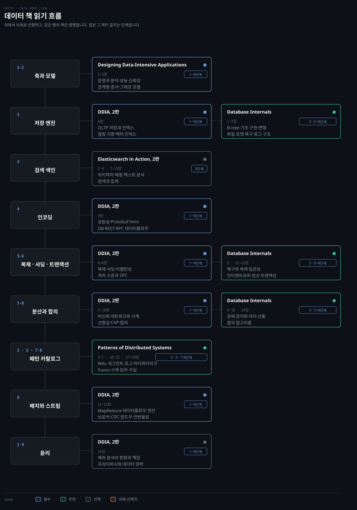

# 데이터·데이터베이스 학습 로드맵
---

> 코드가 실제로 만드는 쿼리에서 시작해 그것이 흔들릴 때 한 층씩 내려갑니다. 개념이 주인공이고 책은 그 개념을 다루는 자리입니다.

## 학습 순서

> 단계마다 배우는 개념을 묶음으로 갈랐습니다. 자료 위치는 아래 단계별 표가 짚습니다.

| 단계 | 묶음 | 배우는 개념 |
|---|---|---|
| 1 · SQL 과 인덱스 | 질의 | DDL · DML · 함수 · JOIN · SUBQUERY · CTE · 스토어드 프로그램 |
| 1 · SQL 과 인덱스 | 스키마 | MySQL 과 InnoDB · 정규화 · 비정규화 |
| 1 · SQL 과 인덱스 | 실행 계획 | `EXPLAIN` · IOT · 페이지네이션 · 커버링 인덱스 · 선택도 · GroupBy·OrderBy 함정 |
| 2 · 데이터 모델 | 모델 선택 | 관계형 vs 문서 · 정규화와 조인 횟수 · 그래프 모델 · 스키마 유연성 |
| 2 · 데이터 모델 | 분석용 | 별 스키마 · 눈송이 · OBT · 이벤트 소싱 · CQRS · DataFrame |
| 3 · 저장 엔진 | 인덱스 자료구조 | OLTP 저장 · B-tree · LSM · 페이지 분할 · 보조 인덱스 · 인메모리 |
| 3 · 저장 엔진 | 지속성 | WAL · 복구 · 컬럼 지향 저장 · 다차원 · 전문 · 벡터 인덱스 |
| 3 · 저장 엔진 | 인코딩 | 인코딩과 호환성 · JSON · Protocol Buffers · Avro · 스키마 진화 |
| 4 · 영속성 계층 | 연결 | 커넥션 풀 · DataSource · JdbcTemplate · 스프링 예외 추상화 · 드라이버 wrap 로깅 |
| 4 · 영속성 계층 | 매핑 | ORM · 영속성 컨텍스트 · 식별자 전략 · 엔티티 · 연관관계 · 상속 · 값 타입 |
| 4 · 영속성 계층 | 조회 비용 | 프록시 · N+1 · Projection · 페이징 · 쿼리 메소드 · 커스텀 리포지토리 |
| 5 · 트랜잭션과 락 | 격리 | ACID · 격리 수준 · 스냅샷 격리 · InnoDB MVCC · Write Skew · 직렬화 가능성 |
| 5 · 트랜잭션과 락 | 락 | 동시성 제어 · 갭 락 · 넥스트 키 락 · 낙관적 락 · 비관적 락 · 데드락 |
| 5 · 트랜잭션과 락 | 프레임워크 | 스프링 트랜잭션 · 전파 · 롤백 규칙 · 분산 트랜잭션 · 2PC |
| 6 · QueryDSL | 기본 | 문법 · 조인 · 동적 쿼리 · 프로젝션과 DTO 매핑 |
| 6 · QueryDSL | 함정 | 페이징과 fetch join · 벌크 연산 · window 함수 부재 · ROW_NUMBER 대체 |
| 6 · QueryDSL | 합성 | PathBuilder · JPAExpressions · BooleanBuilder 누적 · 6.12 와 7.x 마이그레이션 |
| 7 · 운영과 테스트 | 로컬 재현 | DB 덤프 · 로컬 이관 · 로컬 개발환경 운영 모델 |
| 7 · 운영과 테스트 | 테스트 | 임베디드 DB · 테스트 트랜잭션 · Testcontainers · 마이그레이션 도구 |
| 8 · 복제와 샤딩 | 복제 | 단일 리더 · 복제 로그 · 복제 지연 · 읽기 후 쓰기 일관성 · 다중 리더 · 쓰기 충돌 · 리더리스 · 정족수 |
| 8 · 복제와 샤딩 | 샤딩 | 키 범위 샤딩 · 해시 샤딩 · 일관 해싱 · 요청 라우팅 · 리밸런싱 · 샤딩과 보조 인덱스 |
| 9 · 분산의 문제와 합의 | 믿을 수 없는 것 | 부분 실패 · 비신뢰 네트워크 · 불신뢰 시계 · 진실과 거짓 · 시스템 모델 |
| 9 · 분산의 문제와 합의 | 일관성 | 선형성 · 선형성의 비용 · CAP · ID 생성기 · 논리 시계 |
| 9 · 분산의 문제와 합의 | 합의 | 합의 알고리즘 · 코디네이션 서비스 · Majority Quorum · Paxos · Raft · Replicated Log |
| 10 · 배치와 스트림 | 배치 | Unix 도구 · 분산 파일시스템 · 오브젝트 스토어 · MapReduce · 데이터플로우 엔진 |
| 10 · 배치와 스트림 | 스트림 | 메시지 브로커 · 로그 기반 브로커 · CDC · CEP · 윈도우 · 조인 · 시간 추론 |
| 10 · 배치와 스트림 | 통합 | 파생 데이터 · 전순서의 한계 · 배치와 스트림 통합 · DB 언번들링 |

## 책 읽기 흐름

> 위 단계를 무엇으로 배우는가입니다. 자체 노트 79편이 1~7단계를, 책 셋이 3단계와 8~10단계를 맡습니다.

앞단계는 노트가 자료의 중심이라 `책` 칸이 자주 빕니다. 뒷단계로 갈수록 반대가 됩니다.

| 책 | 읽을 장 | 우선순위 | 자리 |
|---|---|:---:|---|
| [Designing Data-Intensive Applications](../05_data/book/designing-data-intensive-applications/README.md) | 3~13장 | 필수 | 2·3 · 5 · 8~10단계 |
| Database Internals | 2~7장 | 추천 | 3단계 |
| Patterns of Distributed Systems | 8 · 11·12 · 14장 | 추천 | 9단계 |

**DDIA 2판이 분산 구간을 통째로 맡습니다.** 1~14장을 전부 정독한 65편이 있고 장 번호가 1판과 다릅니다. 1판 요약은 [01_foundation](../05_data/01_foundation/README.md)에 따로 있어 같은 주제를 두 판본으로 볼 수 있습니다. 장 번호로 찾지 말고 주제로 짚습니다.

## 단일 DB · 1~7단계

> 노드 하나 안에서 끝나는 구간입니다. 손으로 확인하며 배울 수 있는 자리이기도 합니다.

### 1단계 · SQL 과 인덱스

| 개념 | 우선순위 | 노트 | 책 |
|---|:---:|---|---|
| DDL · DML · 함수 · JOIN · SUBQUERY · CTE | 필수 | [01-01](../05_data/02_relational/sql-mysql/01-01.SQL%20%EA%B8%B0%EC%B4%88%20%E2%80%94%20DDL%2C%20DML%2C%20%ED%95%A8%EC%88%98.md) · [01-02](../05_data/02_relational/sql-mysql/01-02.JOIN%2C%20SUBQUERY%2C%20CTE.md) | |
| MySQL 과 InnoDB · 정규화와 비정규화 | 필수 | [02-01](../05_data/02_relational/sql-mysql/02-01.MySQL%20%EA%B8%B0%EC%B4%88%EC%99%80%20InnoDB.md) · [02-02](../05_data/02_relational/sql-mysql/02-02.%EC%A0%95%EA%B7%9C%ED%99%94%EC%99%80%20%EB%B9%84%EC%A0%95%EA%B7%9C%ED%99%94.md) | |
| `EXPLAIN` · IOT · 페이지네이션 | 필수 | [03-01](../05_data/02_relational/sql-mysql/03-01.%EC%9D%B8%EB%8D%B1%EC%8A%A4%20%EC%8B%A4%EC%A0%84%20%E2%80%94%20EXPLAIN%2C%20IOT%2C%20%ED%8E%98%EC%9D%B4%EC%A7%80%EB%84%A4%EC%9D%B4%EC%85%98.md) | |
| 인덱스 이론 · 커버링 인덱스 · 선택도 | 필수 | [01-05](../05_data/01_foundation/01-05.%EC%9D%B8%EB%8D%B1%EC%8A%A4%20%EC%9D%B4%EB%A1%A0.md) | DDIA 4장 |
| GroupBy · OrderBy 함정 | 추천 | [06-01](../05_data/02_relational/sql-mysql/06-01.GroupBy%20OrderBy%20%ED%95%A8%EC%A0%95.md) | |
| 쿼리 최적화 체크리스트 | 추천 | [07-01](../05_data/02_relational/sql-mysql/07-01.%EC%BF%BC%EB%A6%AC%20%EC%B5%9C%EC%A0%81%ED%99%94%20%EC%B2%B4%ED%81%AC%EB%A6%AC%EC%8A%A4%ED%8A%B8.md) | |
| 스토어드 프로그램 | 선택 | [01-03](../05_data/02_relational/sql-mysql/01-03.%EC%8A%A4%ED%86%A0%EC%96%B4%EB%93%9C%20%ED%94%84%EB%A1%9C%EA%B7%B8%EB%9E%A8.md) | |
| 실행 계획 캐시 · 통계 갱신 | 선택 | | |

### 2단계 · 데이터 모델

| 개념 | 우선순위 | 노트 | 책 |
|---|:---:|---|---|
| 관계형 vs 문서 모델 | 추천 | [03-01](../05_data/book/designing-data-intensive-applications/03-01.%EA%B4%80%EA%B3%84%ED%98%95%20vs%20%EB%AC%B8%EC%84%9C%20%EB%AA%A8%EB%8D%B8.md) · [01-01](../05_data/01_foundation/01-01.%EB%8D%B0%EC%9D%B4%ED%84%B0%20%EB%AA%A8%EB%8D%B8%EA%B3%BC%20%EC%BF%BC%EB%A6%AC%20%EC%96%B8%EC%96%B4.md) | DDIA 3장 |
| 정규화 · 비정규화 · 조인 횟수 | 추천 | [03-02](../05_data/book/designing-data-intensive-applications/03-02.%EC%A0%95%EA%B7%9C%ED%99%94%C2%B7%EB%B9%84%EC%A0%95%EA%B7%9C%ED%99%94%C2%B7%EC%A1%B0%EC%9D%B8.md) | DDIA 3장 |
| 모델 선택과 스키마 유연성 | 추천 | [03-04](../05_data/book/designing-data-intensive-applications/03-04.%EB%AA%A8%EB%8D%B8%20%EC%84%A0%ED%83%9D%EA%B3%BC%20%EC%8A%A4%ED%82%A4%EB%A7%88%20%EC%9C%A0%EC%97%B0%EC%84%B1.md) | DDIA 3장 |
| 그래프 데이터 모델 | 선택 | [03-05](../05_data/book/designing-data-intensive-applications/03-05.%EA%B7%B8%EB%9E%98%ED%94%84%20%EB%8D%B0%EC%9D%B4%ED%84%B0%20%EB%AA%A8%EB%8D%B8.md) | DDIA 3장 |
| 분석용 스키마 — 별 · 눈송이 · OBT | 선택 | [03-03](../05_data/book/designing-data-intensive-applications/03-03.%EB%B6%84%EC%84%9D%EC%9A%A9%20%EC%8A%A4%ED%82%A4%EB%A7%88%20%E2%80%94%20%EB%B3%84%C2%B7%EB%88%88%EC%86%A1%EC%9D%B4%C2%B7OBT.md) | DDIA 3장 |
| 이벤트 소싱 · CQRS · DataFrame | 선택 | [03-06](../05_data/book/designing-data-intensive-applications/03-06.%EC%9D%B4%EB%B2%A4%ED%8A%B8%20%EC%86%8C%EC%8B%B1%C2%B7CQRS%C2%B7DataFrame.md) | DDIA 3장 |
| NoSQL 비교 | 선택 | [01-06](../05_data/01_foundation/01-06.NoSQL%20%EB%B9%84%EA%B5%90.md) | |
| 다중 모델 DB — 한 제품이 둘을 담을 때 | 선택 | | |

### 3단계 · 저장 엔진

| 개념 | 우선순위 | 노트 | 책 |
|---|:---:|---|---|
| OLTP 저장과 인덱스 기초 | 추천 | [04-01](../05_data/book/designing-data-intensive-applications/04-01.OLTP%20%EC%A0%80%EC%9E%A5%EA%B3%BC%20%EC%9D%B8%EB%8D%B1%EC%8A%A4%20%EA%B8%B0%EC%B4%88.md) · [01-02](../05_data/01_foundation/01-02.%EC%A0%80%EC%9E%A5%EC%86%8C%EC%99%80%20%EA%B2%80%EC%83%89.md) | DDIA 4장 |
| LSM 저장 엔진 · B-tree 와 비교 | 추천 | [04-02](../05_data/book/designing-data-intensive-applications/04-02.LSM%20%EC%A0%80%EC%9E%A5%20%EC%97%94%EC%A7%84.md) · [04-03](../05_data/book/designing-data-intensive-applications/04-03.B-tree%EC%99%80%20LSM%20%EB%B9%84%EA%B5%90.md) | Database Internals 2~4·7장 |
| WAL · 페이지 분할 · 복구 | 추천 | [03-04](../05_data/01_foundation/03-04.WAL%20%ED%8C%A8%ED%84%B4.md) | Database Internals 3·5장 |
| 보조 인덱스 · 인메모리 저장 | 추천 | [04-04](../05_data/book/designing-data-intensive-applications/04-04.%EB%B3%B4%EC%A1%B0%20%EC%9D%B8%EB%8D%B1%EC%8A%A4%EC%99%80%20%EC%9D%B8%EB%A9%94%EB%AA%A8%EB%A6%AC%20%EC%A0%80%EC%9E%A5.md) | DDIA 4장 |
| 컬럼 지향 저장 · 다차원 · 전문 · 벡터 인덱스 | 선택 | [04-05](../05_data/book/designing-data-intensive-applications/04-05.%EB%B6%84%EC%84%9D%EC%9A%A9%20%EC%BB%AC%EB%9F%BC%20%EC%A7%80%ED%96%A5%20%EC%A0%80%EC%9E%A5.md) · [04-06](../05_data/book/designing-data-intensive-applications/04-06.%EB%8B%A4%EC%B0%A8%EC%9B%90%C2%B7%EC%A0%84%EB%AC%B8%C2%B7%EB%B2%A1%ED%84%B0%20%EC%9D%B8%EB%8D%B1%EC%8A%A4.md) | DDIA 4장 |
| 인코딩과 호환성 · 스키마 진화 | 추천 | [05-01](../05_data/book/designing-data-intensive-applications/05-01.%EC%9D%B8%EC%BD%94%EB%94%A9%EA%B3%BC%20%ED%98%B8%ED%99%98%EC%84%B1%20%EA%B8%B0%EC%B4%88.md) · [01-03](../05_data/01_foundation/01-03.%EC%9D%B8%EC%BD%94%EB%94%A9%EA%B3%BC%20%EC%A7%84%ED%99%94.md) | DDIA 5장 |
| Protocol Buffers · Avro · 이진 변형 | 추천 | [05-02](../05_data/book/designing-data-intensive-applications/05-02.JSON%C2%B7XML%C2%B7%EC%9D%B4%EC%A7%84%20%EB%B3%80%ED%98%95.md) · [05-03](../05_data/book/designing-data-intensive-applications/05-03.Protocol%20Buffers%EC%99%80%20Avro.md) | DDIA 5장 |
| 데이터플로우 — DB · REST · RPC | 선택 | [05-04](../05_data/book/designing-data-intensive-applications/05-04.%EB%8D%B0%EC%9D%B4%ED%84%B0%ED%94%8C%EB%A1%9C%EC%9A%B0%20%E2%80%94%20DB%C2%B7REST%C2%B7RPC.md) | DDIA 5장 |
| fsync 와 그룹 커밋 | 선택 | | |

### 4단계 · 영속성 계층

| 개념 | 우선순위 | 노트 | 책 |
|---|:---:|---|---|
| 커넥션 풀 · DataSource | 필수 | [01-01](../05_data/03_persistence/jdbc/01-01.%EC%BB%A4%EB%84%A5%EC%85%98%20%ED%92%80%EA%B3%BC%20DataSource.md) | |
| JdbcTemplate · 스프링 예외 추상화 | 필수 | [02-01](../05_data/03_persistence/jdbc/02-01.JdbcTemplate.md) · [03-01](../05_data/03_persistence/jdbc/03-01.%EC%8A%A4%ED%94%84%EB%A7%81%20%EC%98%88%EC%99%B8%20%EC%B6%94%EC%83%81%ED%99%94.md) | |
| 드라이버 wrap 로깅과 운영 비용 | 추천 | [04-01](../05_data/03_persistence/jdbc/04-01.JDBC%20%EB%93%9C%EB%9D%BC%EC%9D%B4%EB%B2%84%20wrap%20%EB%A1%9C%EA%B9%85%EC%9D%98%20%EC%9A%B4%EC%98%81%20%EB%B9%84%EC%9A%A9.md) · [04-02](../05_data/03_persistence/jdbc/04-02.log4jdbc%20%EB%A1%9C%EA%B7%B8%20%EC%A0%9C%EC%96%B4%20%EB%B2%A0%EC%8A%A4%ED%8A%B8%20%ED%94%84%EB%9E%99%ED%8B%B0%EC%8A%A4.md) | |
| ORM · 영속성 컨텍스트 · 식별자 전략 | 필수 | [01-02](../05_data/03_persistence/jpa/01-02.JPA%20%EC%8B%9C%EC%9E%91%EA%B3%BC%20%EC%98%81%EC%86%8D%EC%84%B1%20%EC%BB%A8%ED%85%8D%EC%8A%A4%ED%8A%B8.md) · [01-03](../05_data/03_persistence/jpa/01-03.%EC%8B%9D%EB%B3%84%EC%9E%90%20%EC%A0%84%EB%9E%B5.md) | |
| 엔티티 · 연관관계 · 상속 · 값 타입 | 필수 | [02-01](../05_data/03_persistence/jpa/02-01.%EC%97%94%ED%8B%B0%ED%8B%B0%20%EB%A7%B5%ED%95%91.md) ~ [02-03](../05_data/03_persistence/jpa/02-03.%EC%83%81%EC%86%8D%EA%B3%BC%20%EA%B0%92%20%ED%83%80%EC%9E%85.md) | |
| 프록시와 N+1 | 필수 | [03-03](../05_data/03_persistence/jpa/03-03.%ED%94%84%EB%A1%9D%EC%8B%9C%EC%99%80%20N%2B1.md) | |
| Projection · 페이징 · Auditing | 추천 | [03-04](../05_data/03_persistence/jpa/03-04.Auditing%2C%20%ED%8E%98%EC%9D%B4%EC%A7%95%2C%20Projection.md) | |
| 쿼리 메소드 · 커스텀 리포지토리 | 추천 | [03-02](../05_data/03_persistence/jpa/03-02.%EC%BF%BC%EB%A6%AC%20%EB%A9%94%EC%86%8C%EB%93%9C.md) · [03-05](../05_data/03_persistence/jpa/03-05.%EC%BB%A4%EC%8A%A4%ED%85%80%20%EB%A6%AC%ED%8F%AC%EC%A7%80%ED%86%A0%EB%A6%AC%20%ED%8C%A8%ED%84%B4.md) | |
| MyBatis 와 도구 혼용 | 선택 | [06-01](../05_data/03_persistence/jpa/06-01.MyBatis%20%EA%B0%9C%EC%9A%94.md) · [07-01](../05_data/03_persistence/jpa/07-01.%EB%8F%84%EA%B5%AC%20%ED%98%BC%EC%9A%A9%20%ED%8C%A8%ED%84%B4.md) | |
| 풀 크기 산정 · 커넥션 누수 | 추천 | | |

### 5단계 · 트랜잭션과 락

| 개념 | 우선순위 | 노트 | 책 |
|---|:---:|---|---|
| ACID · 격리 수준 · 스냅샷 격리 | 필수 | [08-01](../05_data/book/designing-data-intensive-applications/08-01.ACID%EC%99%80%20%ED%8A%B8%EB%9E%9C%EC%9E%AD%EC%85%98%20%EA%B0%9C%EC%9A%94.md) · [08-02](../05_data/book/designing-data-intensive-applications/08-02.%EC%95%BD%ED%95%9C%20%EA%B2%A9%EB%A6%AC%20%EC%88%98%EC%A4%80%EA%B3%BC%20%EC%8A%A4%EB%83%85%EC%83%B7%20%EA%B2%A9%EB%A6%AC.md) · [01-04](../05_data/01_foundation/01-04.%ED%8A%B8%EB%9E%9C%EC%9E%AD%EC%85%98%EA%B3%BC%20%EA%B2%A9%EB%A6%AC%20%EC%88%98%EC%A4%80.md) | DDIA 8장 |
| InnoDB MVCC | 필수 | [04-01](../05_data/02_relational/sql-mysql/04-01.InnoDB%20MVCC.md) | |
| 동시성 제어와 락 · 갭 락 | 필수 | [04-02](../05_data/02_relational/sql-mysql/04-02.%EB%8F%99%EC%8B%9C%EC%84%B1%EC%A0%9C%EC%96%B4%EC%99%80%20%EB%9D%BD.md) | |
| Write Skew · 직렬화 가능성 | 추천 | [08-03](../05_data/book/designing-data-intensive-applications/08-03.Write%20Skew%EC%99%80%20%EC%A7%81%EB%A0%AC%ED%99%94%20%EA%B0%80%EB%8A%A5%EC%84%B1.md) | DDIA 8장 |
| 스프링 트랜잭션 · 전파 · 롤백 규칙 | 필수 | [04-01](../05_data/03_persistence/jpa/04-01.%EC%8A%A4%ED%94%84%EB%A7%81%20%ED%8A%B8%EB%9E%9C%EC%9E%AD%EC%85%98.md) · [04-01b](../05_data/03_persistence/jpa/04-01b.%ED%8A%B8%EB%9E%9C%EC%9E%AD%EC%85%98%20%EC%A0%84%ED%8C%8C%20%ED%99%9C%EC%9A%A9.md) · [Spring 로드맵](spring-roadmap.md) | |
| 낙관적 락 · 비관적 락 | 필수 | [04-02](../05_data/03_persistence/jpa/04-02.%EB%82%99%EA%B4%80%EC%A0%81%20%EB%B9%84%EA%B4%80%EC%A0%81%20%EB%9D%BD.md) | |
| 분산 트랜잭션 · 2PC | 추천 | [08-04](../05_data/book/designing-data-intensive-applications/08-04.%EB%B6%84%EC%82%B0%20%ED%8A%B8%EB%9E%9C%EC%9E%AD%EC%85%98%EA%B3%BC%202PC.md) | DDIA 8장 |
| 데드락 감지 · 락 대기 타임아웃 | 추천 | | |

### 6단계 · QueryDSL

| 개념 | 우선순위 | 노트 | 책 |
|---|:---:|---|---|
| 기본 문법 · 조인 · 동적 쿼리 | 추천 | [01-03](../05_data/03_persistence/querydsl/01-03.%EA%B8%B0%EB%B3%B8%20%EB%AC%B8%EB%B2%95%EA%B3%BC%20%EC%A1%B0%EC%9D%B8.md) · [01-04](../05_data/03_persistence/querydsl/01-04.%EB%8F%99%EC%A0%81%20%EC%BF%BC%EB%A6%AC.md) | |
| 프로젝션과 DTO 매핑 | 추천 | [01-05](../05_data/03_persistence/querydsl/01-05.%ED%94%84%EB%A1%9C%EC%A0%9D%EC%85%98%EA%B3%BC%20DTO%20%EB%A7%A4%ED%95%91.md) | |
| 페이징과 fetch join 함정 | 필수 | [01-06](../05_data/03_persistence/querydsl/01-06.%ED%8E%98%EC%9D%B4%EC%A7%95%EA%B3%BC%20fetch%20join%20%ED%95%A8%EC%A0%95.md) · [03-06](../05_data/03_persistence/querydsl/03-06.%EC%8A%A4%ED%94%84%EB%A7%81%20%EB%8D%B0%EC%9D%B4%ED%84%B0%20%ED%8E%98%EC%9D%B4%EC%A7%95%20%ED%86%B5%ED%95%A9.md) | |
| PathBuilder · JPAExpressions 서브쿼리 | 추천 | [02-01](../05_data/03_persistence/querydsl/02-01.PathBuilder%20%E2%80%94%20%EB%8F%99%EC%A0%81%20path%20%EB%B9%8C%EB%8D%94%20%EA%B9%8A%EC%9D%B4.md) · [02-02](../05_data/03_persistence/querydsl/02-02.JPAExpressions%20%E2%80%94%20%EC%84%9C%EB%B8%8C%EC%BF%BC%EB%A6%AC%20%ED%95%A9%EC%84%B1.md) | |
| 벌크 연산 · SQL 함수 · ROW_NUMBER 대체 | 추천 | [01-07](../05_data/03_persistence/querydsl/01-07.%EB%B2%8C%ED%81%AC%20%EC%97%B0%EC%82%B0%EA%B3%BC%20SQL%20%ED%95%A8%EC%88%98.md) · [03-05](../05_data/03_persistence/querydsl/03-05.window%20%ED%95%A8%EC%88%98%20%EC%97%86%EB%8A%94%20JPA%20QueryDSL%EC%9D%98%20ROW_NUMBER%20%EB%8C%80%EC%B2%B4.md) | |
| 락과 동시성 제어 | 추천 | [03-04](../05_data/03_persistence/querydsl/03-04.%EB%9D%BD%EA%B3%BC%20%EB%8F%99%EC%8B%9C%EC%84%B1%20%EC%A0%9C%EC%96%B4.md) | |
| 테스트와 멀티모듈 · Q 타입 생성 | 추천 | [03-01](../05_data/03_persistence/querydsl/03-01.%ED%85%8C%EC%8A%A4%ED%8A%B8%EC%99%80%20%EB%A9%80%ED%8B%B0%EB%AA%A8%EB%93%88.md) | |
| 6.12 와 7.x 마이그레이션 | 선택 | [03-02](../05_data/03_persistence/querydsl/03-02.%EB%8C%80%EC%95%88%20%EB%B9%84%EA%B5%90%EC%99%80%206.12-7.x%20%EB%A7%88%EC%9D%B4%EA%B7%B8%EB%A0%88%EC%9D%B4%EC%85%98.md) | |

### 7단계 · 운영과 테스트

| 개념 | 우선순위 | 노트 | 책 |
|---|:---:|---|---|
| DB 덤프와 로컬 이관 | 추천 | [01-01](../05_data/06_operations/01-01.DB%20%EB%8D%A4%ED%94%84%EC%99%80%20%EB%A1%9C%EC%BB%AC%20%EC%9D%B4%EA%B4%80.md) · [01-02](../05_data/06_operations/01-02.DB%20%EB%8D%A4%ED%94%84%EC%99%80%20%EB%A1%9C%EC%BB%AC%20%EC%9D%B4%EA%B4%80%20%28%EC%8B%AC%ED%99%94%29.md) | |
| 로컬 개발환경 운영 모델 | 추천 | [01-03](../05_data/06_operations/01-03.%EB%A1%9C%EC%BB%AC%20%EA%B0%9C%EB%B0%9C%ED%99%98%EA%B2%BD%20%EC%9A%B4%EC%98%81%20%EB%AA%A8%EB%8D%B8.md) | |
| 임베디드 DB 테스트 · 테스트 트랜잭션 | 추천 | [02-01](../05_data/06_operations/02-01.%EC%9E%84%EB%B2%A0%EB%94%94%EB%93%9C%20DB%20%ED%85%8C%EC%8A%A4%ED%8A%B8.md) · [02-02](../05_data/06_operations/02-02.%ED%85%8C%EC%8A%A4%ED%8A%B8%20%ED%8A%B8%EB%9E%9C%EC%9E%AD%EC%85%98.md) | |
| Testcontainers | 선택 | | |
| 마이그레이션 도구 — Flyway · Liquibase | 선택 | | |
| 캐싱 전략 | 선택 | [01-07](../05_data/01_foundation/01-07.%EC%BA%90%EC%8B%B1%20%EC%A0%84%EB%9E%B5.md) | |

## 노드 둘 이상 · 8~10단계

> 여기부터는 대부분 읽어서 배웁니다. 노드를 여럿 띄워 복제 지연을 재현하는 일은 이 카테고리가 아니라 실제 운영 클러스터에서 일어납니다.

### 8단계 · 복제와 샤딩

| 개념 | 우선순위 | 노트 | 책 |
|---|:---:|---|---|
| 복제 개요와 단일 리더 · 복제 로그 | 필수 | [06-01](../05_data/book/designing-data-intensive-applications/06-01.%EB%B3%B5%EC%A0%9C%20%EA%B0%9C%EC%9A%94%EC%99%80%20%EB%8B%A8%EC%9D%BC%20%EB%A6%AC%EB%8D%94.md) · [06-02](../05_data/book/designing-data-intensive-applications/06-02.%EB%85%B8%EB%93%9C%20%EC%9E%A5%EC%95%A0%20%EC%B2%98%EB%A6%AC%EC%99%80%20%EB%B3%B5%EC%A0%9C%20%EB%A1%9C%EA%B7%B8.md) · [02-03](../05_data/01_foundation/02-03.%EB%B3%B5%EC%A0%9C.md) | DDIA 6장 |
| 복제 지연과 일관성 보장 | 필수 | [06-03](../05_data/book/designing-data-intensive-applications/06-03.%EB%B3%B5%EC%A0%9C%20%EC%A7%80%EC%97%B0%20%EB%AC%B8%EC%A0%9C%EC%99%80%20%EC%9D%BC%EA%B4%80%EC%84%B1%20%EB%B3%B4%EC%9E%A5.md) | DDIA 6장 |
| 다중 리더 복제 · 쓰기 충돌 해소 | 추천 | [06-04](../05_data/book/designing-data-intensive-applications/06-04.%EB%8B%A4%EC%A4%91%20%EB%A6%AC%EB%8D%94%20%EB%B3%B5%EC%A0%9C.md) · [06-05](../05_data/book/designing-data-intensive-applications/06-05.%EC%93%B0%EA%B8%B0%20%EC%B6%A9%EB%8F%8C%20%ED%95%B4%EC%86%8C.md) | DDIA 6장 |
| 리더리스 복제 · 정족수 | 추천 | [06-06](../05_data/book/designing-data-intensive-applications/06-06.%EB%A6%AC%EB%8D%94%EB%A6%AC%EC%8A%A4%20%EB%B3%B5%EC%A0%9C%EC%99%80%206%EC%9E%A5%20%EC%A2%85%ED%95%A9.md) | DDIA 6장 |
| 키 범위 샤딩 · 해시 샤딩 · 일관 해싱 | 필수 | [07-01](../05_data/book/designing-data-intensive-applications/07-01.%EC%83%A4%EB%94%A9%20%EA%B0%9C%EC%9A%94%EC%99%80%20%ED%82%A4%20%EB%B2%94%EC%9C%84%20%EC%83%A4%EB%94%A9.md) · [07-02](../05_data/book/designing-data-intensive-applications/07-02.%ED%95%B4%EC%8B%9C%20%EC%83%A4%EB%94%A9%EA%B3%BC%20%EC%9D%BC%EA%B4%80%20%ED%95%B4%EC%8B%B1.md) · [02-04](../05_data/01_foundation/02-04.%EC%83%A4%EB%94%A9.md) | DDIA 7장 |
| 요청 라우팅과 리밸런싱 | 필수 | [07-03](../05_data/book/designing-data-intensive-applications/07-03.%EC%9A%94%EC%B2%AD%20%EB%9D%BC%EC%9A%B0%ED%8C%85%EA%B3%BC%20%EB%A6%AC%EB%B0%B8%EB%9F%B0%EC%8B%B1.md) | DDIA 7장 |
| 샤딩과 보조 인덱스 | 추천 | [07-04](../05_data/book/designing-data-intensive-applications/07-04.%EB%B3%B4%EC%A1%B0%20%EC%9D%B8%EB%8D%B1%EC%8A%A4%EC%99%80%207%EC%9E%A5%20%EC%A2%85%ED%95%A9.md) | DDIA 7장 |
| Galera 멀티마스터 · wsrep · flow control | 선택 | | |
| 읽기 전용 복제본 라우팅 · 페일오버 자동화 | 추천 | | |

### 9단계 · 분산의 문제와 합의

| 개념 | 우선순위 | 노트 | 책 |
|---|:---:|---|---|
| 부분 실패와 비신뢰 네트워크 | 필수 | [09-01](../05_data/book/designing-data-intensive-applications/09-01.%EB%B6%80%EB%B6%84%20%EC%8B%A4%ED%8C%A8%EC%99%80%20%EB%B9%84%EC%8B%A0%EB%A2%B0%20%EB%84%A4%ED%8A%B8%EC%9B%8C%ED%81%AC.md) · [02-05](../05_data/01_foundation/02-05.%EB%B6%84%EC%82%B0%20%EC%8B%9C%EC%8A%A4%ED%85%9C%EC%9D%98%20%EB%AC%B8%EC%A0%9C%EC%A0%90.md) | DDIA 9장 |
| 불신뢰 시계 · 진실과 거짓 · 시스템 모델 | 필수 | [09-02](../05_data/book/designing-data-intensive-applications/09-02.%EB%B6%88%EC%8B%A0%EB%A2%B0%20%EC%8B%9C%EA%B3%84.md) · [09-03](../05_data/book/designing-data-intensive-applications/09-03.%EC%A7%84%EC%8B%A4%C2%B7%EA%B1%B0%EC%A7%93%C2%B7%EC%8B%9C%EC%8A%A4%ED%85%9C%20%EB%AA%A8%EB%8D%B8.md) | DDIA 9장 |
| 분산 시스템 검증 | 추천 | [09-04](../05_data/book/designing-data-intensive-applications/09-04.%EB%B6%84%EC%82%B0%20%EC%8B%9C%EC%8A%A4%ED%85%9C%20%EA%B2%80%EC%A6%9D%EA%B3%BC%209%EC%9E%A5%20%EC%A2%85%ED%95%A9.md) | DDIA 9장 |
| 선형성과 그 비용 · CAP | 필수 | [10-01](../05_data/book/designing-data-intensive-applications/10-01.%EC%84%A0%ED%98%95%EC%84%B1.md) · [10-02](../05_data/book/designing-data-intensive-applications/10-02.%EC%84%A0%ED%98%95%EC%84%B1%EC%9D%98%20%EB%B9%84%EC%9A%A9%EA%B3%BC%20CAP.md) · [02-06](../05_data/01_foundation/02-06.%EC%9D%BC%EA%B4%80%EC%84%B1%EA%B3%BC%20%ED%95%A9%EC%9D%98.md) | DDIA 10장 |
| ID 생성기와 논리 시계 | 추천 | [10-03](../05_data/book/designing-data-intensive-applications/10-03.ID%20%EC%83%9D%EC%84%B1%EA%B8%B0%EC%99%80%20%EB%85%BC%EB%A6%AC%20%EC%8B%9C%EA%B3%84.md) | DDIA 10장 |
| 합의와 코디네이션 서비스 | 필수 | [10-04](../05_data/book/designing-data-intensive-applications/10-04.%ED%95%A9%EC%9D%98%EC%99%80%20%EC%BD%94%EB%94%94%EB%84%A4%EC%9D%B4%EC%85%98%20%EC%84%9C%EB%B9%84%EC%8A%A4.md) | DDIA 10장 |
| Majority Quorum · Paxos · Replicated Log | 추천 | | Patterns of Distributed Systems 8 · 11·12장 |
| Raft 와 Paxos 의 구현 차이 | 추천 | | Patterns of Distributed Systems 14장 |
| 쿼럼 산정 · split-brain 방지 | 추천 | | |

### 10단계 · 배치와 스트림

| 개념 | 우선순위 | 노트 | 책 |
|---|:---:|---|---|
| 배치 처리 개요 · Unix 도구 | 추천 | [11-01](../05_data/book/designing-data-intensive-applications/11-01.%EB%B0%B0%EC%B9%98%20%EC%B2%98%EB%A6%AC%20%EA%B0%9C%EC%9A%94%EC%99%80%20Unix%20%EB%8F%84%EA%B5%AC.md) · [03-01](../05_data/01_foundation/03-01.%EB%B0%B0%EC%B9%98%20%EC%B2%98%EB%A6%AC.md) | DDIA 11장 |
| 분산 파일시스템 · 오브젝트 스토어 | 추천 | [11-02](../05_data/book/designing-data-intensive-applications/11-02.%EB%B6%84%EC%82%B0%20%ED%8C%8C%EC%9D%BC%EC%8B%9C%EC%8A%A4%ED%85%9C%EA%B3%BC%20%EC%98%A4%EB%B8%8C%EC%A0%9D%ED%8A%B8%20%EC%8A%A4%ED%86%A0%EC%96%B4.md) | DDIA 11장 |
| MapReduce 와 데이터플로우 엔진 | 선택 | [11-03](../05_data/book/designing-data-intensive-applications/11-03.%EB%B6%84%EC%82%B0%20%EC%9E%A1%20%EC%98%A4%EC%BC%80%EC%8A%A4%ED%8A%B8%EB%A0%88%EC%9D%B4%EC%85%98%EA%B3%BC%20MapReduce.md) · [11-04](../05_data/book/designing-data-intensive-applications/11-04.%EB%8D%B0%EC%9D%B4%ED%84%B0%ED%94%8C%EB%A1%9C%EC%9A%B0%20%EC%97%94%EC%A7%84%EA%B3%BC%20%EB%B0%B0%EC%B9%98%20%ED%99%9C%EC%9A%A9.md) | DDIA 11장 |
| 메시지 브로커와 로그 기반 브로커 | 추천 | [12-01](../05_data/book/designing-data-intensive-applications/12-01.%EC%8A%A4%ED%8A%B8%EB%A6%BC%20%EC%A0%84%EC%86%A1%20%E2%80%94%20%EB%A9%94%EC%8B%9C%EC%A7%80%20%EB%B8%8C%EB%A1%9C%EC%BB%A4%EC%99%80%20%EB%A1%9C%EA%B7%B8%20%EA%B8%B0%EB%B0%98%20%EB%B8%8C%EB%A1%9C%EC%BB%A4.md) · [03-02](../05_data/01_foundation/03-02.%EC%8A%A4%ED%8A%B8%EB%A6%BC%20%EC%B2%98%EB%A6%AC.md) | DDIA 12장 |
| 데이터베이스와 스트림 · CDC | 추천 | [12-02](../05_data/book/designing-data-intensive-applications/12-02.%EB%8D%B0%EC%9D%B4%ED%84%B0%EB%B2%A0%EC%9D%B4%EC%8A%A4%EC%99%80%20%EC%8A%A4%ED%8A%B8%EB%A6%BC.md) | DDIA 12장 |
| CEP · 윈도우 · 조인 · 시간 추론 | 추천 | [12-03](../05_data/book/designing-data-intensive-applications/12-03.%EC%8A%A4%ED%8A%B8%EB%A6%BC%20%EC%B2%98%EB%A6%AC%20%E2%80%94%20CEP%C2%B7%EC%9C%88%EB%8F%84%EC%9A%B0%C2%B7%EC%A1%B0%EC%9D%B8.md) · [12-04](../05_data/book/designing-data-intensive-applications/12-04.%EC%8B%9C%EA%B0%84%20%EC%B6%94%EB%A1%A0%EA%B3%BC%20%EB%82%B4%EA%B2%B0%ED%95%A8%EC%84%B1%C2%B712%EC%9E%A5%20%EC%A2%85%ED%95%A9.md) | DDIA 12장 |
| 데이터 통합 · 파생 데이터 · DB 언번들링 | 선택 | [13-01](../05_data/book/designing-data-intensive-applications/13-01.%EB%8D%B0%EC%9D%B4%ED%84%B0%20%ED%86%B5%ED%95%A9%20%E2%80%94%20%ED%8C%8C%EC%83%9D%20%EB%8D%B0%EC%9D%B4%ED%84%B0%EC%99%80%20%EC%A0%84%EC%88%9C%EC%84%9C%EC%9D%98%20%ED%95%9C%EA%B3%84.md) · [13-02](../05_data/book/designing-data-intensive-applications/13-02.%EB%B0%B0%EC%B9%98%C2%B7%EC%8A%A4%ED%8A%B8%EB%A6%BC%20%ED%86%B5%ED%95%A9%EA%B3%BC%20DB%20%EC%96%B8%EB%B2%88%EB%93%A4%EB%A7%81.md) | DDIA 13장 |
| Outbox 패턴 · 정확히 한 번 | 추천 | | |

## 손으로 확인하는 실습

> 노트 안에 실제로 있는 실습 절만 적습니다. 지어낸 출처를 채우지 않았습니다.

| 출처 | 단계 | 무엇 |
|---|:---:|---|
| [인덱스 실전 — EXPLAIN · IOT · 페이지네이션](../05_data/02_relational/sql-mysql/03-01.%EC%9D%B8%EB%8D%B1%EC%8A%A4%20%EC%8B%A4%EC%A0%84%20%E2%80%94%20EXPLAIN%2C%20IOT%2C%20%ED%8E%98%EC%9D%B4%EC%A7%80%EB%84%A4%EC%9D%B4%EC%85%98.md) | 1 | `EXPLAIN` 을 직접 찍어 인덱스를 타는지 확인 |
| [InnoDB MVCC](../05_data/02_relational/sql-mysql/04-01.InnoDB%20MVCC.md) · [동시성제어와 락](../05_data/02_relational/sql-mysql/04-02.%EB%8F%99%EC%8B%9C%EC%84%B1%EC%A0%9C%EC%96%B4%EC%99%80%20%EB%9D%BD.md) | 5 | 세션 둘을 열어 락 대기와 스냅샷을 재현 |
| [프록시와 N+1](../05_data/03_persistence/jpa/03-03.%ED%94%84%EB%A1%9D%EC%8B%9C%EC%99%80%20N%2B1.md) | 4 | SQL 로그를 켜고 쿼리 수를 세기 |
| [log4jdbc 로그 제어](../05_data/03_persistence/jdbc/04-02.log4jdbc%20%EB%A1%9C%EA%B7%B8%20%EC%A0%9C%EC%96%B4%20%EB%B2%A0%EC%8A%A4%ED%8A%B8%20%ED%94%84%EB%9E%99%ED%8B%B0%EC%8A%A4.md) | 4 | 나가는 SQL 을 파라미터까지 보이게 설정 |
| [테스트와 멀티모듈](../05_data/03_persistence/querydsl/03-01.%ED%85%8C%EC%8A%A4%ED%8A%B8%EC%99%80%20%EB%A9%80%ED%8B%B0%EB%AA%A8%EB%93%88.md) | 6 | Q 타입 생성과 테스트 구성을 직접 돌리기 |
| [임베디드 DB 테스트](../05_data/06_operations/02-01.%EC%9E%84%EB%B2%A0%EB%94%94%EB%93%9C%20DB%20%ED%85%8C%EC%8A%A4%ED%8A%B8.md) · [테스트 트랜잭션](../05_data/06_operations/02-02.%ED%85%8C%EC%8A%A4%ED%8A%B8%20%ED%8A%B8%EB%9E%9C%EC%9E%AD%EC%85%98.md) | 7 | 운영 DB 없이 도는 테스트 환경 세우기 |
| [DB 덤프와 로컬 이관](../05_data/06_operations/01-01.DB%20%EB%8D%A4%ED%94%84%EC%99%80%20%EB%A1%9C%EC%BB%AC%20%EC%9D%B4%EA%B4%80.md) | 7 | 운영 스키마를 로컬로 내려 같은 쿼리를 재현 |

8~10단계 자리는 비어 있습니다. 복제 지연 · 합의 · 샤딩 리밸런싱은 노드를 여럿 띄워야 재현되고, 그 환경은 이 카테고리가 아니라 실제 운영 클러스터에 있습니다.

**로컬 DB 는 운영 스키마로 세웁니다.** 격리 수준과 락은 스키마와 데이터 분포에 따라 재현이 갈립니다. 빈 테이블에 두 행을 넣고 확인한 결과를 운영으로 가져가면 어긋납니다.

## 로드맵에 넣지 않은 것

> 다른 문서가 정본이거나 선후 관계가 없어 순서를 말할 수 없는 것들입니다.

| 대상 | 이유 |
|---|---|
| 메시지 브로커의 운영과 구현 | `04_messaging` 이 88편으로 맡습니다. 10단계는 왜 필요한가에서 멈춥니다 |
| 트랜잭션의 프레임워크 축 | [Spring 로드맵](spring-roadmap.md)이 맡습니다. 5단계가 그 이음매입니다 |
| JDBC · JPA 의 JVM 성능 비용 | [JVM 로드맵](jvm-roadmap.md) 6단계가 맡습니다 |
| 시스템 아키텍처 트레이드오프 | `03_architecture` 와 겹칩니다. 8단계의 배경으로만 참조합니다 |
| DDIA 1·2장 | 설계 전에 서는 축이라 장애 순서를 거꾸로 놓는 이 로드맵의 규칙에 맞지 않습니다. 순서와 무관하게 먼저 읽습니다 |
| DDIA 14장 · 철학적 고찰 | 윤리와 프라이버시입니다. 선후 관계가 없어 순서를 말할 수 없습니다 |

## 경계

> 이 문서가 정하는 것과 인접 문서에 넘기는 것입니다.

이 문서는 **읽기 순서와 우선순위**를 정합니다. 어느 자료가 어느 폴더에 있는지는 [05_data MOC](../05_data/README.md)가 맡습니다.

단계 번호는 **의존 순서**이지 진도가 아닙니다. 느린 쿼리는 1단계, N+1 은 4단계, 락 대기는 5단계, 복제 지연은 8단계가 첫 자리입니다.

**단일 DB 구간과 분산 구간은 성격이 다릅니다.** 1~7단계는 손으로 확인하며 배우고 8~10단계는 대부분 읽어서 배웁니다. 실습 표가 8단계부터 비어 있는 것이 그 차이입니다.
