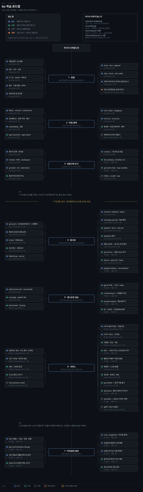
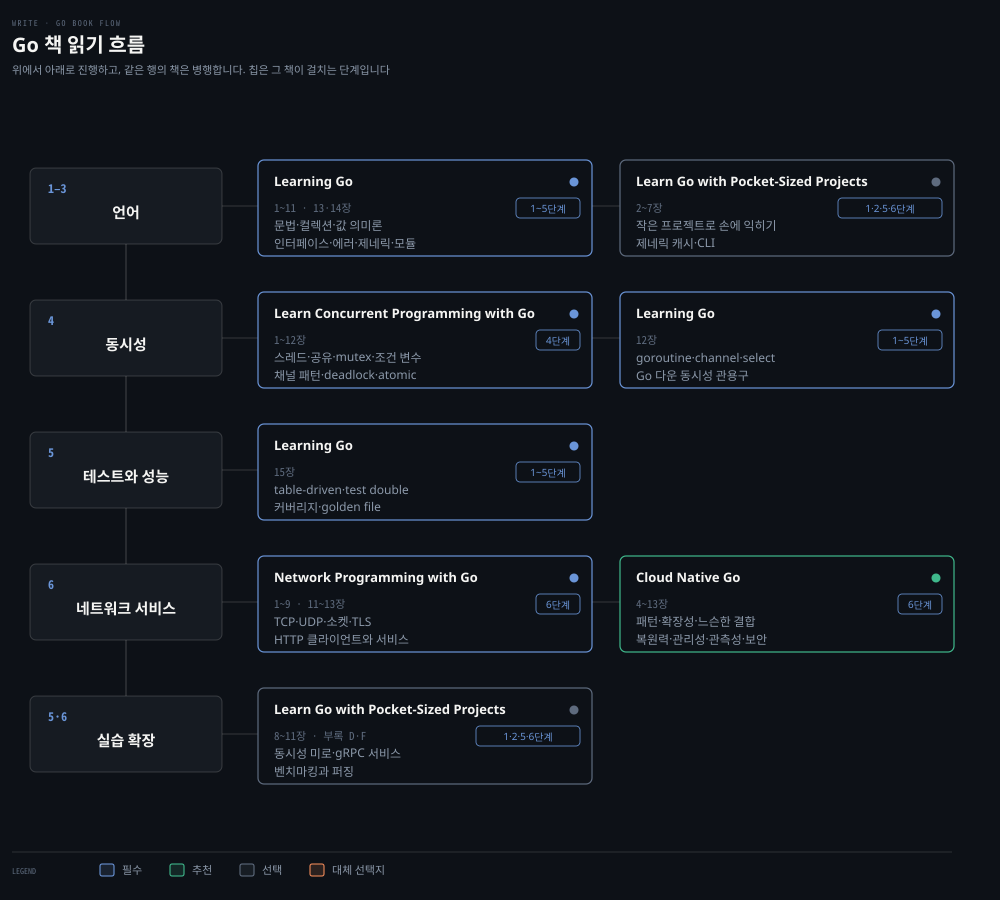

# Go 학습 로드맵
---

> 문법을 빠르게 통과한 뒤 값 의미론과 인터페이스로 타입을 설계하고, 동시성·테스트·성능을 거쳐 네트워크 서비스로 갑니다. 개념이 주인공이고 책은 그 개념을 다루는 자리입니다.

## 학습 순서

> 단계마다 배우는 개념을 묶음으로 갈랐습니다. 자료 위치는 아래 단계별 표가 짚습니다.

| 단계 | 묶음 | 배우는 개념 |
|---|---|---|
| 1 · 문법 | 환경과 선언 | `go` 명령 · 모듈 초기화 · 변수 · 상수 · 타입 선언 |
| 1 · 문법 | 제어와 함수 | `if` · `for` · `switch` · 블록 · 섀도잉 · 함수 · 다중 반환 · `defer` |
| 1 · 문법 | 값 의미론 | array · slice · capacity · `append` · map · struct · 포인터 · zero value · 무엇이 복사되고 무엇이 공유되는가 |
| 2 · 타입 설계 | 메서드와 인터페이스 | receiver · method set · 암묵 구현 · 인터페이스 배치 · embedding · 조합 · type assertion · type switch |
| 2 · 타입 설계 | 에러 | error value · wrapping · sentinel error · `errors.Is` · `errors.As` |
| 2 · 타입 설계 | 제네릭 | 타입 파라미터 · 제약 · 언제 쓰고 언제 안 쓰는가 |
| 3 · 관용구와 도구 | 패키지 설계 | 패키지 경계 · 네이밍 · 인터페이스를 쓰는 쪽에 두기 |
| 3 · 관용구와 도구 | 모듈과 검사 | module · MVS · workspace · `go build` · `go vet` · staticcheck |
| 3 · 관용구와 도구 | 취소 전파 | `context` · 취소 · 값 전달 · deadline |
| 3 · 관용구와 도구 | 흔한 실수 | slice aliasing · interface nil · goroutine leak · loop variable · context 오용 |
| 4 · 동시성 | 실행 단위 | goroutine · `GOMAXPROCS` · 스케줄러 · 스레드와의 차이 |
| 4 · 동시성 | 메모리 공유 | 경쟁 상태 · mutex · RWMutex · 조건 변수 · 세마포어 · WaitGroup · barrier |
| 4 · 동시성 | 메시지 전달 | channel · buffered channel · `select` · 채널 패턴 · pipeline · fan-in · fan-out |
| 4 · 동시성 | 정확성 | happens-before · race detector · deadlock 회피 · atomic · spin lock · futex |
| 5 · 테스트와 성능 | 테스트 | table-driven test · test double · coverage · golden file · benchmark · fuzzing |
| 5 · 테스트와 성능 | 프로파일 | pprof — CPU · heap · block · mutex · `runtime/trace` · 스케줄러 추적 |
| 5 · 테스트와 성능 | 런타임 | escape analysis · 할당 줄이기 · GC · `GOGC` · `GOMEMLIMIT` |
| 6 · 서비스 | 전송 계층 | 주소 해석 · 라우팅 · TCP 스트림 · 데이터 전송 · UDP · 신뢰성 보강 · Unix domain socket |
| 6 · 서비스 | HTTP | 클라이언트 타임아웃 · 서버 라우팅 · 미들웨어 · graceful shutdown |
| 6 · 서비스 | 운영 요소 | TLS · 직렬화 · `log/slog` · 지표 · 복원력 · 느슨한 결합 · 관측성 · 보안 |

## 책 읽기 흐름

> 위 단계를 무엇으로 배우는가입니다. 이 로드맵은 보유 노트가 0편이라 책이 자료의 전부입니다.

`write/` 어디에도 Go 카테고리가 없습니다. 아래 단계별 표의 `노트` 열이 모두 비어 있는 이유이고, 노트를 쓰기 시작하면 그 칸부터 채웁니다.

| 책 | 읽을 장 | 우선순위 | 자리 |
|---|---|:---:|---|
| Learning Go | 1~11 · 13~16장 | 필수 | 1~3 · 5단계 |
| Learn Concurrent Programming with Go | 1~12장 | 필수 | 4단계 |
| Network Programming with Go | 1~9 · 11~13장 | 필수 | 6단계 |
| Cloud Native Go | 4~13장 | 추천 | 6단계 |
| Learn Go with Pocket-Sized Projects | 2~11장 · 부록 D·F | 대체 | 1·2·5·6단계 — Learning Go 의 실습 축 |

공식 문서는 책과 같은 무게로 씁니다. [A Tour of Go](https://go.dev/tour/)와 [Effective Go](https://go.dev/doc/effective_go)가 1·3단계, [The Go Memory Model](https://go.dev/ref/mem)이 4단계, [Go Diagnostics](https://go.dev/doc/diagnostics)와 [Go GC Guide](https://go.dev/doc/gc-guide)가 5단계의 빈칸을 메웁니다.

## 언어 · 1~3단계

> Go 문법과 설계 관용구를 잡는 구간입니다. 다른 언어를 쓰던 습관을 바꾸는 자리이기도 합니다.

### 1단계 · 문법

| 개념 | 우선순위 | 노트 | 책 |
|---|:---:|---|---|
| 개발 환경 · `go` 명령 · 모듈 초기화 | 필수 | | Learning Go 1장 |
| 변수 · 상수 · 타입 선언 | 필수 | | Learning Go 2장 |
| array · slice · capacity · `append` | 필수 | | Learning Go 3장 |
| map · struct · zero value | 필수 | | Learning Go 3장 |
| `if` · `for` · `switch` · 블록 · 섀도잉 | 필수 | | Learning Go 4장 |
| 함수 · 다중 반환 · `defer` | 필수 | | Learning Go 5장 |
| 포인터와 값 의미론 — 무엇이 복사되는가 | 필수 | | Learning Go 6장 |
| 작은 프로젝트로 손에 익히기 | 대체 | | Pocket-Sized Projects 2~5장 |

### 2단계 · 타입 설계

| 개념 | 우선순위 | 노트 | 책 |
|---|:---:|---|---|
| 메서드 · receiver 선택 · method set | 필수 | | Learning Go 7장 |
| 인터페이스 · 암묵 구현 · 쓰는 쪽에 두기 | 필수 | | Learning Go 7장 |
| embedding · 상속 대신 조합 | 필수 | | Learning Go 7장 |
| type assertion · type switch | 추천 | | Learning Go 7장 |
| error value · wrapping · sentinel error | 필수 | | Learning Go 9장 |
| `errors.Is` · `errors.As` · 실패 맥락 보존 | 필수 | | Learning Go 9장 |
| 제네릭 · 타입 파라미터 · 제약 | 추천 | | Learning Go 8장 |
| 제네릭으로 캐시 만들기 | 선택 | | Pocket-Sized Projects 7장 |

### 3단계 · 관용구와 도구

| 개념 | 우선순위 | 노트 | 책 |
|---|:---:|---|---|
| 패키지 경계 · 네이밍 · import 규약 | 필수 | | Learning Go 10장 |
| module · MVS · workspace | 필수 | | Learning Go 10장 |
| `go build` · `go vet` · staticcheck · `gofmt` | 필수 | | Learning Go 11장 |
| `context` — 취소 · 값 전달 · deadline | 필수 | | Learning Go 14장 |
| 표준 라이브러리 지도 | 추천 | | Learning Go 13장 |
| slice aliasing · interface nil | 추천 | | |
| goroutine leak · loop variable · context 오용 | 추천 | | |
| reflect · unsafe · cgo | 선택 | | Learning Go 16장 |

## Go 를 고르는 이유 · 4~6단계

> 동시성과 네트워크 서비스입니다. 다른 언어에서 옮겨 올 때 값이 가장 크게 갈리는 구간입니다.

### 4단계 · 동시성

| 개념 | 우선순위 | 노트 | 책 |
|---|:---:|---|---|
| goroutine · `GOMAXPROCS` · 스케줄러 | 필수 | | Learn Concurrent Programming with Go 1·2장 |
| 메모리 공유와 경쟁 상태 | 필수 | | Learn Concurrent Programming with Go 3장 |
| mutex · RWMutex | 필수 | | Learn Concurrent Programming with Go 4장 |
| WaitGroup · barrier | 필수 | | Learn Concurrent Programming with Go 6장 |
| channel · buffered channel · `select` | 필수 | | Learning Go 12장 · Learn Concurrent Go 8장 |
| message passing · 채널 프로그래밍 | 필수 | | Learn Concurrent Programming with Go 7·9장 |
| happens-before · `go test -race` | 필수 | | [The Go Memory Model](https://go.dev/ref/mem) |
| 조건 변수 · 세마포어 | 추천 | | Learn Concurrent Programming with Go 5장 |
| pipeline · fan-in · fan-out · errgroup | 추천 | | Learn Concurrent Programming with Go 10장 |
| deadlock 회피 | 추천 | | Learn Concurrent Programming with Go 11장 |
| atomic · spin lock · futex | 추천 | | Learn Concurrent Programming with Go 12장 |

### 5단계 · 테스트와 성능

| 개념 | 우선순위 | 노트 | 책 |
|---|:---:|---|---|
| table-driven test · test double | 필수 | | Learning Go 15장 |
| coverage · golden file | 추천 | | Learning Go 15장 |
| benchmark · fuzzing | 추천 | | Pocket-Sized Projects 부록 D·F |
| pprof — CPU · heap · block · mutex profile | 필수 | | [Go Diagnostics](https://go.dev/doc/diagnostics) |
| `runtime/trace` · 스케줄러 추적 | 추천 | | [Go Diagnostics](https://go.dev/doc/diagnostics) |
| escape analysis · 할당 줄이기 | 추천 | | |
| GC · `GOGC` · `GOMEMLIMIT` | 추천 | | [Go GC Guide](https://go.dev/doc/gc-guide) |
| 측정의 함정 — 워밍업 · noisy neighbor | 추천 | [OS 로드맵](os-roadmap.md) | |

### 6단계 · 서비스

| 개념 | 우선순위 | 노트 | 책 |
|---|:---:|---|---|
| 네트워크 개요 · 주소 해석 · 라우팅 | 필수 | [네트워크 로드맵](network-roadmap.md) | Network Programming with Go 1·2장 |
| TCP 스트림 · 데이터 전송 · half-close | 필수 | | Network Programming with Go 3·4장 |
| HTTP 클라이언트 · 타임아웃 · 재시도 경계 | 필수 | | Network Programming with Go 8장 |
| HTTP 서비스 · 라우팅 · graceful shutdown | 필수 | | Network Programming with Go 9장 |
| UDP · 신뢰성 보강 | 추천 | | Network Programming with Go 5·6장 |
| TLS 로 통신 지키기 | 추천 | | Network Programming with Go 11장 |
| 직렬화 · `log/slog` · 지표 | 추천 | | Network Programming with Go 12·13장 |
| 복원력 · 느슨한 결합 · 확장성 | 추천 | | Cloud Native Go 7~9장 |
| 관리성 · 관측성 · 보안 · 분산 상태 | 추천 | | Cloud Native Go 10~13장 |
| Unix domain socket | 선택 | | Network Programming with Go 7장 |
| gRPC 서비스 만들기 | 선택 | | Pocket-Sized Projects 10·11장 |

## 손으로 확인하는 실습

> 이 로드맵은 노트가 없어 실습이 곧 자료입니다. 구현 순서를 단계에 맞춰 적습니다.

| 만들 것 | 단계 | 배우는 것 |
|---|:---:|---|
| TCP echo server | 6 | Listener · 연결 소켓 · goroutine · deadline · 끊기는 모든 경로에서 FD 회수 |
| TCP reverse proxy | 6 | 양방향 `io.Copy` · half-close · 취소 · 배압 |
| L4 로드밸런서 | 6 | health check · round-robin · least connections · 재시도 안전성 · connection draining |
| reverse tunnel | 6 | control plane 과 data plane 분리 · 멀티플렉싱 · 재접속 · 인증 · NAT traversal |
| 네트워크 관측 에이전트 | 5·6 | 소켓과 프로세스 매핑 · netlink · 지표 노출 |
| 동시성 미로 풀이 | 4 | goroutine 조율 · 채널로 결과 모으기 |
| gRPC 습관 추적기 | 6 | 프로토콜 정의 · 스트리밍 · 클라이언트 생성 |

**완료 기준은 도는 것이 아니라 회수되는 것입니다.** echo server 는 echo 가 되는 것이 아니라 연결이 끊기는 모든 경로에서 goroutine 과 FD 가 회수되는 것이 기준입니다.

## 로드맵에 넣지 않은 것

> 다른 문서가 정본이거나 이 로드맵의 축과 다른 것들입니다.

| 대상 | 이유 |
|---|---|
| TCP · TLS · HTTP 의 프로토콜 동작 | [네트워크 로드맵](network-roadmap.md) 1단계가 맡습니다. 여기는 Go 로 다루는 법입니다 |
| epoll · 스케줄러 · 프로파일 방법론 | [OS 로드맵](os-roadmap.md) 2·4단계가 맡습니다 |
| Cloud Native Go 1~3장 | 클라우드 네이티브 개론과 Go 소개입니다. 순서에 넣을 축이 아닙니다 |
| Learning Go 16장 | reflect · unsafe · cgo 입니다. 필요가 생겼을 때 엽니다 |
| P2P · 익명 오버레이 구현 | [네트워크 로드맵](network-roadmap.md) 8단계가 개념을 맡습니다 |

## 경계

> 이 문서가 정하는 것과 인접 문서에 넘기는 것입니다.

이 문서는 **Go 언어와 Go 로 만드는 서비스의 개념 순서**를 정합니다. 프로토콜 자체와 커널 메커니즘은 다른 로드맵이 맡습니다.

**보유 노트가 0편인 유일한 로드맵입니다.** 다른 편은 `노트` 열이 자료의 중심이지만 여기는 책과 공식 문서가 전부입니다. 노트를 쓰기 시작하면 `write/` 에 Go 카테고리를 만들고 이 표의 `노트` 열부터 채웁니다.

맞닿는 문서가 둘입니다. 6단계의 프로토콜 축은 [네트워크 로드맵](network-roadmap.md)이, 5단계의 성능 방법론은 [OS 로드맵](os-roadmap.md)이 맡습니다.
