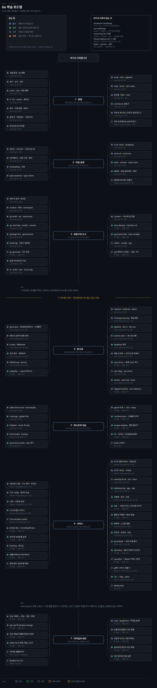
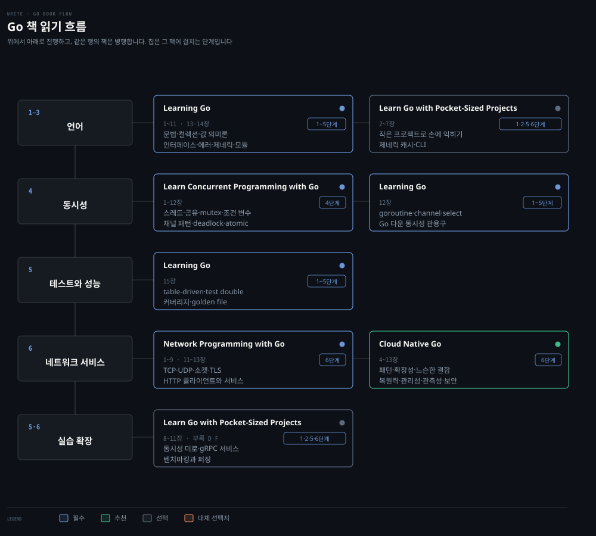

# Go 학습 로드맵
---

> 문법을 빠르게 통과한 뒤 값 의미론과 인터페이스로 타입을 설계하고, 동시성·테스트·성능을 거쳐 네트워크 서비스로 갑니다. 개념이 주인공이고 책은 그 개념을 다루는 자리입니다.

## 학습 순서

> 단계마다 배우는 개념을 묶음으로 갈랐습니다. 자료 위치는 아래 단계별 표가 짚습니다.

| 단계 | 묶음 | 배우는 개념 |
|---|---|---|
| 1 · 문법 | 환경과 선언 | `go` 명령 · 모듈 초기화 · 변수 · 상수 · 타입 선언 · `const` 와 `iota` · 타입 변환 · 타입 추론 |
| 1 · 문법 | 제어와 함수 | `if` · `for` · `switch` · 블록 · 섀도잉 · 함수 · 다중 반환 · `defer` · 익명 함수 · 클로저 · 가변 인자 |
| 1 · 문법 | 값 의미론 | array · slice · capacity · `append` · map · struct · 포인터 · zero value · 무엇이 복사되고 무엇이 공유되는가 · 문자열 · byte · rune · raw string literal · comma-ok |
| 2 · 타입 설계 | 메서드와 인터페이스 | receiver · method set · 암묵 구현 · 인터페이스 배치 · embedding · 조합 · type assertion · type switch |
| 2 · 타입 설계 | 에러 | error value · wrapping · sentinel error · `errors.Is` · `errors.As` · `panic` · `recover` · stack trace |
| 2 · 타입 설계 | 제네릭 | 타입 파라미터 · 제약 · 언제 쓰고 언제 안 쓰는가 |
| 3 · 관용구와 도구 | 패키지 설계 | 패키지 경계 · 네이밍 · 인터페이스를 쓰는 쪽에 두기 |
| 3 · 관용구와 도구 | 모듈과 검사 | module · MVS · workspace · `go build` · `go vet` · staticcheck · `go mod tidy` · vendor · 모듈 배포와 semver · `go install` · goimports · golangci-lint · govulncheck |
| 3 · 관용구와 도구 | 빌드 | build tag · build constraint · 크로스 컴파일 `GOOS` · `GOARCH` · `-ldflags` 로 버전 주입 |
| 3 · 관용구와 도구 | 표준 라이브러리 | `io.Reader` · `bufio` · `os` · `time` · `encoding/json` · struct tag · `regexp` · `flag` |
| 3 · 관용구와 도구 | 취소 전파 | `context` · 취소 · 값 전달 · deadline |
| 3 · 관용구와 도구 | 흔한 실수 | slice aliasing · interface nil · goroutine leak · loop variable · context 오용 · `go generate` · cgo 메모리 소유권 |
| 4 · 동시성 | 실행 단위 | goroutine · `GOMAXPROCS` · 스케줄러 · 스레드와의 차이 · netpoller |
| 4 · 동시성 | 메모리 공유 | 경쟁 상태 · mutex · RWMutex · 조건 변수 · 세마포어 · WaitGroup · barrier · `sync.Map` · `sync.Pool` |
| 4 · 동시성 | 메시지 전달 | channel · buffered channel · `select` · 채널 패턴 · pipeline · fan-in · fan-out · worker pool |
| 4 · 동시성 | 정확성 | happens-before · race detector · deadlock 회피 · atomic · spin lock · futex |
| 5 · 테스트와 성능 | 테스트 | table-driven test · test double · coverage · golden file · benchmark · fuzzing · `httptest` · mock 과 stub |
| 5 · 테스트와 성능 | 프로파일 | pprof — CPU · heap · block · mutex · goroutine · `runtime/trace` · 스케줄러 추적 |
| 5 · 테스트와 성능 | 런타임 | escape analysis · 할당 줄이기 · GC · `GOGC` · `GOMEMLIMIT` |
| 5 · 테스트와 성능 | 디버깅 | stack trace 읽기 · Delve (`dlv`) |
| 6 · 서비스 | 전송 계층 | 주소 해석 · 라우팅 · TCP 스트림 · 데이터 전송 · UDP · 신뢰성 보강 · Unix domain socket |
| 6 · 서비스 | HTTP | 클라이언트 타임아웃 · 서버 라우팅 · 미들웨어 · graceful shutdown |
| 6 · 서비스 | 웹 프레임워크 | `net/http` 표준 라우터와 프레임워크의 갈림 · chi · Gin · Echo · Fiber |
| 6 · 서비스 | DB 접근 | `database/sql` · 커넥션 풀 · pgx · sqlc · GORM |
| 6 · 서비스 | 실시간 | WebSocket |
| 6 · 서비스 | 운영 요소 | TLS · 직렬화 · `log/slog` · 지표 · zap · zerolog · gRPC · Protocol Buffers |
| 6 · 서비스 | 프로토콜 설계 | 바이트 파싱 · `encoding/binary` · 엔디언 · 부분 읽기 · framing — 구분자와 길이 접두 · 체크섬 · 메시지 타입 · 잘못된 메시지 거절 · 핸드셰이크 · 버전 협상 · 상태 머신 · 애플리케이션 heartbeat |
| 6 · 서비스 | 클라우드 네이티브 설계 | 복원력 · 느슨한 결합 · 관측성 · 보안 |
| 6 · 서비스 | 산출물 | `go:embed` · distroless · 멀티스테이지 이미지 · `syscall/js` 와 Wasm 경계 |
| 6 · 서비스 | CLI | `flag` · cobra · urfave/cli · 설정 우선순위 |
| 7 · 터미널과 세션 | SSH | 전송 · 사용자 인증 · 연결 3계층 · `pty-req` · `window-change` · 세션 채널의 경계 |
| 7 · 터미널과 세션 | 화면 | ANSI CSI · 화면 직접 그리기 · rune 과 grapheme · 터미널 셀 폭 · Bubble Tea |
| 7 · 터미널과 세션 | 세션 관리 | 논블로킹 알림 · 신호 병합 · 슬라이딩 윈도우 속도 제한 · 자원 상한 · 인증과 인가의 차이 |

## 책 읽기 흐름

> 위 단계를 무엇으로 배우는가입니다. Learning Go 는 [정독 인덱스](../01_language/book/lgo_learning-go/README.md)를 세우고 1장부터 노트를 쓰는 중이며, 나머지 책은 아직 정독 노트가 없습니다.

| 책 | 읽을 장 | 우선순위 | 자리 |
|---|---|:---:|---|
| [Learning Go](../01_language/book/lgo_learning-go/README.md) | 1~15장 | 필수 | 1~5단계 |
| Learn Concurrent Programming with Go | 1~12장 | 필수 | 4단계 |
| Network Programming with Go | 1~9 · 11~13장 | 필수 | 6단계 |
| Cloud Native Go | 4~13장 | 추천 | 6단계 |
| Learn Go with Pocket-Sized Projects | 2~11장 · 부록 D·F | 선택 | 1·2·5·6단계 — Learning Go 의 실습 축 |

**보완 참조** — 단계 표의 노트나 책 칸이 가리키지만 읽기 흐름에는 넣지 않은 장입니다. 그 개념에 닿았을 때만 엽니다.

| 책 | 장 | 받치는 자리 |
|---|---|---|
| Learning Go | 16장 | 3단계 reflect · unsafe · cgo |
| Learn Go with Pocket-Sized Projects | 12장 · 부록 G | 3단계 크로스 컴파일, 6단계 DB 접근 |

공식 문서는 책과 같은 무게로 씁니다. [A Tour of Go](https://go.dev/tour/)와 [Effective Go](https://go.dev/doc/effective_go)가 1·3단계, [The Go Memory Model](https://go.dev/ref/mem)이 4단계, [Go Diagnostics](https://go.dev/doc/diagnostics)와 [Go GC Guide](https://go.dev/doc/gc-guide)가 5단계의 빈칸을 메웁니다.

## 언어 · 1~3단계

> Go 문법과 설계 관용구를 잡는 구간입니다. 다른 언어를 쓰던 습관을 바꾸는 자리이기도 합니다.

### 1단계 · 문법

| 개념 | 우선순위 | 노트 | 책 |
|---|:---:|---|---|
| 개발 환경 · `go` 명령 · 모듈 초기화 | 필수 | | Learning Go 1장 |
| 변수 · 상수 · 타입 선언 | 필수 | | Learning Go 2장 |
| `const` 와 `iota` · 타입 변환 · 타입 추론 | 필수 | | Learning Go 2장 |
| array · slice · capacity · `append` | 필수 | | Learning Go 3장 |
| map · struct · zero value | 필수 | | Learning Go 3장 |
| 문자열 · byte · rune · raw string literal | 필수 | | Learning Go 2·3장 |
| comma-ok 관용구 — map 조회 · type assertion · channel 수신 | 추천 | | Learning Go 3장 |
| `if` · `for` · `switch` · 블록 · 섀도잉 | 필수 | | Learning Go 4장 |
| 함수 · 다중 반환 · `defer` | 필수 | | Learning Go 5장 |
| 익명 함수 · 클로저 · 가변 인자 · 함수를 값으로 | 필수 | | Learning Go 5장 |
| 포인터와 값 의미론 — 무엇이 복사되는가 | 필수 | | Learning Go 6장 |
| 작은 프로젝트로 손에 익히기 | 선택 | | Pocket-Sized Projects 2~5장 |

### 2단계 · 타입 설계

| 개념 | 우선순위 | 노트 | 책 |
|---|:---:|---|---|
| 메서드 · receiver 선택 · method set | 필수 | | Learning Go 7장 |
| 인터페이스 · 암묵 구현 · 쓰는 쪽에 두기 | 필수 | | Learning Go 7장 |
| embedding · 상속 대신 조합 | 필수 | | Learning Go 7장 |
| type assertion · type switch | 추천 | | Learning Go 7장 |
| error value · wrapping · sentinel error | 필수 | | Learning Go 9장 |
| `errors.Is` · `errors.As` · 실패 맥락 보존 | 필수 | | Learning Go 9장 |
| `panic` · `recover` — 언제 쓰고 언제 안 쓰는가 · stack trace | 추천 | | Learning Go 9장 |
| 제네릭 · 타입 파라미터 · 제약 | 추천 | | Learning Go 8장 |
| 제네릭으로 캐시 만들기 | 선택 | | Pocket-Sized Projects 7장 |

### 3단계 · 관용구와 도구

| 개념 | 우선순위 | 노트 | 책 |
|---|:---:|---|---|
| 패키지 경계 · 네이밍 · import 규약 | 필수 | | Learning Go 10장 |
| module · MVS · workspace | 필수 | | Learning Go 10장 |
| `go build` · `go vet` · staticcheck · `gofmt` | 필수 | | Learning Go 11장 |
| `go mod tidy` · vendor · 모듈 배포 · semver · retract | 추천 | | Learning Go 10장 |
| `go install` · goimports · golangci-lint · revive · govulncheck | 추천 | | Learning Go 11장 |
| build tag · 크로스 컴파일 `GOOS` · `GOARCH` · `-ldflags` | 추천 | | Learning Go 11장 · Pocket-Sized Projects 12장 |
| `context` — 취소 · 값 전달 · deadline | 필수 | | Learning Go 14장 |
| 표준 라이브러리 지도 | 추천 | | Learning Go 13장 |
| `io.Reader` · `bufio` · `time` · `encoding/json` · struct tag | 필수 | | Learning Go 13장 |
| slice aliasing · interface nil | 추천 | | |
| goroutine leak · loop variable · context 오용 | 추천 | | |
| reflect · unsafe · cgo | 선택 | | Learning Go 16장 |
| cgo 경계의 메모리 소유권 — ABI · FFI · 누가 free 하는가 | 선택 | | |
| `go generate` 와 코드 생성 — proto · OpenAPI 스키마에서 코드로 | 선택 | | |

## Go 를 고르는 이유 · 4~7단계

> 동시성과 네트워크 서비스입니다. 다른 언어에서 옮겨 올 때 값이 가장 크게 갈리는 구간입니다.

### 4단계 · 동시성

| 개념 | 우선순위 | 노트 | 책 |
|---|:---:|---|---|
| goroutine · `GOMAXPROCS` · 스케줄러 | 필수 | | Learn Concurrent Programming with Go 1·2장 |
| 메모리 공유와 경쟁 상태 | 필수 | | Learn Concurrent Programming with Go 3장 |
| mutex · RWMutex | 필수 | | Learn Concurrent Programming with Go 4장 |
| WaitGroup · barrier | 필수 | | Learn Concurrent Programming with Go 6장 |
| channel · buffered channel · `select` | 필수 | | Learning Go 12장 · Learn Concurrent Programming with Go 8장 |
| message passing · 채널 프로그래밍 | 필수 | | Learn Concurrent Programming with Go 7·9장 |
| happens-before · `go test -race` | 필수 | | [The Go Memory Model](https://go.dev/ref/mem) |
| 조건 변수 · 세마포어 | 추천 | | Learn Concurrent Programming with Go 5장 |
| pipeline · fan-in · fan-out · errgroup | 추천 | | Learn Concurrent Programming with Go 10장 |
| worker pool — goroutine 수에 상한 두기 | 추천 | | Learn Concurrent Programming with Go 10장 |
| deadlock 회피 | 추천 | | Learn Concurrent Programming with Go 11장 |
| 채널 소유권 — 닫기는 한 곳에서만 | 필수 | | Learn Concurrent Programming with Go 7장 |
| `sync.Once` — 중복 close 막기 | 추천 | | |
| `sync.Map` · `sync.Pool` — 언제 map 과 mutex 보다 나은가 | 선택 | | [sync](https://pkg.go.dev/sync) |
| atomic · spin lock · futex | 추천 | | Learn Concurrent Programming with Go 12장 |
| netpoller — 블로킹처럼 쓰는 I/O 가 epoll 위에서 도는 법 | 추천 | [OS 로드맵](os-roadmap.md) | |

### 5단계 · 테스트와 성능

| 개념 | 우선순위 | 노트 | 책 |
|---|:---:|---|---|
| table-driven test · test double | 필수 | | Learning Go 15장 |
| `httptest` · mock 과 stub | 추천 | | Learning Go 15장 |
| coverage · golden file | 추천 | | Learning Go 15장 |
| benchmark · fuzzing | 추천 | | Pocket-Sized Projects 부록 D·F |
| pprof — CPU · heap · block · mutex profile | 필수 | | [Go Diagnostics](https://go.dev/doc/diagnostics) |
| goroutine profile 로 leak 찾기 — `runtime.NumGoroutine` · `/debug/pprof/goroutine` | 추천 | | [Go Diagnostics](https://go.dev/doc/diagnostics) |
| `runtime/trace` · 스케줄러 추적 | 추천 | | [Go Diagnostics](https://go.dev/doc/diagnostics) |
| escape analysis · 할당 줄이기 | 추천 | | |
| GC · `GOGC` · `GOMEMLIMIT` | 추천 | | [Go GC Guide](https://go.dev/doc/gc-guide) |
| 디버거 — Delve (`dlv`) · goroutine 별 stack | 선택 | | [Delve](https://github.com/go-delve/delve/tree/master/Documentation) |
| 측정의 함정 — 워밍업 · noisy neighbor | 추천 | [OS 로드맵](os-roadmap.md) | |

### 6단계 · 서비스

| 개념 | 우선순위 | 노트 | 책 |
|---|:---:|---|---|
| 네트워크 개요 · 주소 해석 · 라우팅 | 필수 | [네트워크 로드맵](network-roadmap.md) | Network Programming with Go 1·2장 |
| TCP 스트림 · 데이터 전송 · half-close | 필수 | | Network Programming with Go 3·4장 |
| HTTP 클라이언트 · 타임아웃 · 재시도 경계 | 필수 | | Network Programming with Go 8장 |
| HTTP 서비스 · 라우팅 · graceful shutdown | 필수 | | Network Programming with Go 9장 |
| 표준 `net/http` 와 웹 프레임워크 — chi · Gin · Echo · Fiber | 선택 | | Cloud Native Go 5장 |
| DB 접근 — `database/sql` · 커넥션 풀 · pgx · sqlc · GORM | 추천 | | Pocket-Sized Projects 부록 G · [database/sql](https://go.dev/doc/database/) |
| WebSocket — 양방향 실시간 연결 | 선택 | | [RFC 6455](https://www.rfc-editor.org/rfc/rfc6455) |
| UDP · 신뢰성 보강 — 순서 번호 · ACK · 재전송 타이머 · 세션 만료 | 추천 | | Network Programming with Go 5·6장 |
| TLS 로 통신 지키기 | 추천 | | Network Programming with Go 11장 |
| 직렬화 · `log/slog` · 지표 | 추천 | | Network Programming with Go 12·13장 |
| 구조화 로깅 라이브러리 — zap · zerolog 와 slog 의 갈림 | 선택 | | [slog](https://pkg.go.dev/log/slog) |
| 바이트 파싱 — `[]byte` · `encoding/binary` · 엔디언 · 경계 검사 · `io.ReadFull` 부분 읽기 | 추천 | | |
| 와이어 프로토콜 설계 — framing · 메시지 타입 · 핸드셰이크 · 버전 협상 · 상태 머신 | 추천 | | |
| framing 의 갈림 — 구분자 대 길이 접두 · 체크섬 · 잘못된 메시지 거절 | 추천 | | |
| 애플리케이션 heartbeat — 클라이언트가 정한 주기로 보내는 타이머 | 추천 | | |
| 명세 없는 프로토콜 복원 — 참조 구현에 요청을 보내 보며 기록하기 | 선택 | | |
| SSE — 서버가 미는 스트리밍 HTTP | 추천 | | |
| 폴링과 이벤트 구동의 갈림 | 추천 | | |
| 복원력 · 느슨한 결합 · 확장성 | 추천 | | Cloud Native Go 7~9장 |
| 관리성 · 관측성 · 보안 · 분산 상태 | 추천 | | Cloud Native Go 10~13장 |
| Unix domain socket | 선택 | | Network Programming with Go 7장 |
| go:embed — 정적 자원을 바이너리에 품기 | 추천 | | Cloud Native Go 10장 |
| distroless · 멀티스테이지 이미지 | 추천 | | |
| syscall/js — Wasm 이라는 경계 | 선택 | | |
| gRPC 서비스 만들기 | 선택 | | Pocket-Sized Projects 10·11장 |
| CLI 만들기 — `flag` · cobra · urfave/cli · 설정 우선순위 | 추천 | | Pocket-Sized Projects 6장 · [cobra](https://cobra.dev/) |

### 7단계 · 터미널과 세션

> SSH 로 붙는 서버나 터미널 UI 를 만들 때 들어오는 특화 구간입니다. 4단계 동시성과 6단계 TCP 스트림을 지난 뒤 엽니다.

여기의 `필수` 는 이 구간을 만들 때 빠지면 막힌다는 뜻이고, Go 로 서비스만 만드는 사람에게는 필수가 아닙니다. 사람이 붙어 있는 연결은 요청·응답과 달라 화면과 세션과 신원을 함께 다뤄야 합니다.

| 개념 | 우선순위 | 노트 | 책 |
|---|:---:|---|---|
| SSH 3계층 — 전송 · 사용자 인증 · 연결 | 필수 | | |
| `pty-req` 와 `window-change` | 필수 | | |
| 세션 채널과 애플리케이션의 경계 | 필수 | | |
| ANSI CSI 로 화면 직접 그리기 | 추천 | | |
| TUI 프레임워크 — Bubble Tea 의 Elm 아키텍처 | 선택 | | [Bubble Tea](https://github.com/charmbracelet/bubbletea) |
| rune 과 grapheme 과 터미널 셀 폭 | 필수 | | |
| 논블로킹 알림과 신호 병합 | 필수 | | Learn Concurrent Programming with Go 7장 |
| 인증과 인가는 다른 문제다 | 필수 | | Cloud Native Go 12장 |
| 슬라이딩 윈도우 속도 제한 | 추천 | | |
| 세션 정리와 자원 상한 | 추천 | | |

**소장 책이 다루지 않는 구간입니다.** SSH 애플리케이션 서버와 손으로 만든 TUI 는 `책` 칸이 대부분 비어 있고, `gliderlabs/ssh` 문서와 [RFC 4254](https://www.rfc-editor.org/info/rfc4254)의 `pty-req` · `window-change` 정의가 그 자리를 받습니다.

## 손으로 확인하는 실습

> 이 로드맵은 노트가 없어 실습이 곧 자료입니다. 구현 순서를 단계에 맞춰 적습니다.

| 만들 것 | 단계 | 배우는 것 |
|---|:---:|---|
| TCP echo server | 6 | Listener · 연결 소켓 · goroutine · deadline · 끊기는 모든 경로에서 FD 회수 |
| TCP reverse proxy | 6 | 양방향 `io.Copy` · half-close · 취소 · 배압 |
| L4 로드밸런서 | 6 | health check · round-robin · least connections · 재시도 안전성 · connection draining · connection pool 과 포화 |
| 스트림 멀티플렉서 — yamux 축소판 | 6 | TCP 연결 하나 위 framing · stream ID · 스트림별 window · 느린 스트림 하나가 나머지를 막는지 · 모든 종료 경로에서 goroutine 회수 · QUIC 스트림과 비교 |
| reverse tunnel | 6 | control plane 과 data plane 분리 · 멀티플렉싱 · 재접속 · 인증 · NAT traversal · 동시 등록 충돌 |
| keyless TLS signer | 6 | `crypto.Signer` 추상화 · 원격 서명 경계 · mTLS 클라이언트 인증 · signer 타임아웃과 fail-close · transcript 재계산 |
| length-prefixed 로그 서버 | 6 | framing · partial read · 백프레셔 · append-only 세그먼트 |
| 채팅 서버 | 4·6 | 연결 등록과 해제 · 브로드캐스트 · 느린 클라이언트 하나가 방 전체를 막는지 · 연결 수명과 공유 상태 정리 |
| 우선순위 작업 큐 서버 | 4·6 | `container/heap` · 작업이 생길 때까지 대기 요청 붙잡기 · 연결이 끊기면 가져간 작업 반환 |
| UDP 위 신뢰 스트림 | 6 | 세션 ID · 위치 기반 ACK · 재전송 타이머 · 세션 만료 · 한 소켓 위 세션 분리 · 이스케이프 |
| 네트워크 관측 에이전트 | 5·6 | 소켓과 프로세스 매핑 · netlink · 지표 노출 |
| 동시성 미로 풀이 | 4 | goroutine 조율 · 채널로 결과 모으기 |
| gRPC 습관 추적기 | 6 | 프로토콜 정의 · 스트리밍 · 클라이언트 생성 |

TCP echo server · TCP reverse proxy · 채팅 서버 · 우선순위 작업 큐 서버 · UDP 위 신뢰 스트림은 [Protohackers](https://protohackers.com/problems) 0·5·3·9·7번 채점기로 외부에서 검증할 수 있습니다. 채점기는 공인 주소로 접속하므로 공인 IP 가 있는 서버에 올려야 합니다.

**완료 기준은 도는 것이 아니라 회수되는 것입니다.** echo server 는 echo 가 되는 것이 아니라 연결이 끊기는 모든 경로에서 goroutine 과 FD 가 회수되는 것이 기준입니다.

## 로드맵에 넣지 않은 것

> 다른 문서가 정본이거나 이 로드맵의 축과 다른 것들입니다.

| 대상 | 이유 |
|---|---|
| TCP · TLS · HTTP 의 프로토콜 동작 | [네트워크 로드맵](network-roadmap.md) 1단계가 맡습니다. 여기는 Go 로 다루는 법입니다 |
| epoll · 스케줄러 · 프로파일 방법론 | [OS 로드맵](os-roadmap.md) 2·4단계가 맡습니다 |
| Cloud Native Go 1~3장 | 클라우드 네이티브 개론과 Go 소개입니다. 순서에 넣을 축이 아닙니다 |
| P2P · 익명 오버레이 구현 | [네트워크 로드맵](network-roadmap.md) 8·9단계가 개념을 맡습니다 |
| lexer · parser · AST 로 DSL 만들기 | 컴파일러 축입니다. 코드 생성은 3단계 `go generate` 까지만 봅니다 |
| plugin 동적 로딩 · `goto` | 쓸 자리가 드뭅니다. `plugin` 은 플랫폼 제약이 커서 별도 프로세스와 RPC 로 대신합니다 |
| Beego · Centrifugo · Melody 같은 개별 프레임워크 | 제품 사용법입니다. 6단계는 `net/http` 와 프레임워크의 갈림까지 봅니다 |

## 경계

> 이 문서가 정하는 것과 인접 문서에 넘기는 것입니다.

이 문서는 **Go 언어와 Go 로 만드는 서비스의 개념 순서**를 정합니다. 프로토콜 자체와 커널 메커니즘은 다른 로드맵이 맡습니다.

**정독 노트가 없는 유일한 로드맵입니다.** 다른 편은 `노트` 열이 자료의 중심이지만 여기는 책과 공식 문서가 전부입니다.

맞닿는 문서가 둘입니다. 6단계의 프로토콜 축은 [네트워크 로드맵](network-roadmap.md)이, 5단계의 성능 방법론은 [OS 로드맵](os-roadmap.md)이 맡습니다.
