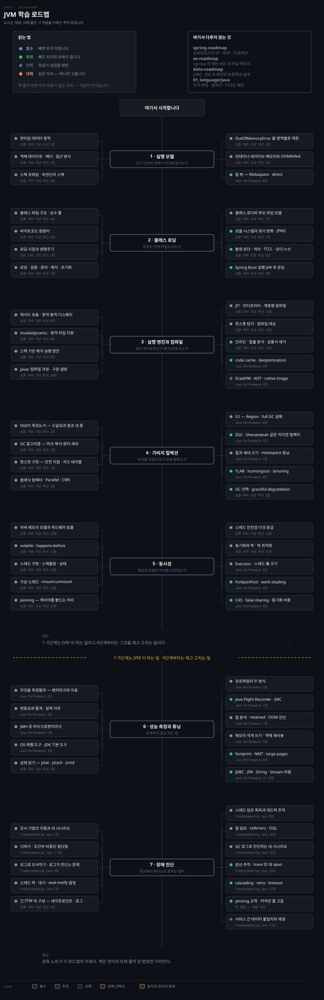
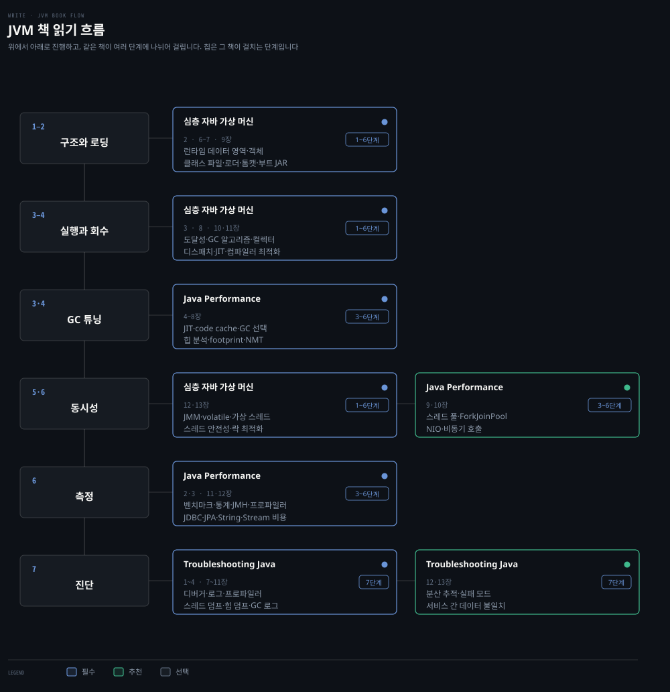

# JVM 학습 로드맵
---

> 코드가 JVM 안에서 어디에 놓이는지에서 시작해 클래스 로딩·실행 엔진·가비지 컬렉션·동시성을 지나 성능 측정과 장애 진단으로 갑니다. 개념이 주인공이고 책은 그 개념을 다루는 자리입니다.

## 학습 순서

> 단계마다 배우는 개념을 묶음으로 갈랐습니다. 자료 위치는 아래 단계별 표가 짚습니다.

| 단계 | 묶음 | 배우는 개념 |
|---|---|---|
| 1 · 실행 모델 | 메모리 영역 | 런타임 데이터 영역 · 힙 · 스택 · Metaspace · 직접 메모리 · PC 레지스터 |
| 1 · 실행 모델 | 객체와 프레임 | 객체 레이아웃 · 헤더 · 접근 방식 · 스택 프레임 · 지역 변수 테이블 · 피연산자 스택 |
| 1 · 실행 모델 | 한계 부딪히기 | 영역별 `OutOfMemoryError` 재현 · 컨테이너 네이티브 메모리 · OOMKilled |
| 2 · 클래스 로딩 | 클래스 파일 | 클래스 파일 구조 · 상수 풀 · 바이트코드 명령어 |
| 2 · 클래스 로딩 | 생명주기 | 로딩 시점 · 로딩 · 검증 · 준비 · 해석 · 초기화 |
| 2 · 클래스 로딩 | 로더 구조 | 클래스 로더 · 부모 위임 모델 · JPMS · 모듈 시스템 · 리플렉션 |
| 2 · 클래스 로딩 | 프레임워크의 로더 | 톰캣 로더 아키텍처 · 클래스패스 격리 · TCCL · ClassLoader Leak · Spring Boot 실행 JAR |
| 3 · 실행 엔진과 컴파일 | 호출 해석 | 정적 디스패치 · 동적 디스패치 · vtable · `invokedynamic` · 메서드 핸들 |
| 3 · 실행 엔진과 컴파일 | 프런트엔드 | `javac` 컴파일 과정 · 구문 설탕 · 제네릭 소거 · 애너테이션 처리기 |
| 3 · 실행 엔진과 컴파일 | JIT | 인터프리터 · 계층형 컴파일 · 핫스폿 탐지 · code cache · deoptimization |
| 3 · 실행 엔진과 컴파일 | 최적화 | 메서드 인라인 · 탈출 분석 · 공통식 제거 · 경계 검사 제거 · Graal |
| 3 · 실행 엔진과 컴파일 | 시동 가속 | CDS · AOT · native image · Leyden · CRaC · warm-up |
| 4 · 가비지 컬렉션 | 무엇이 죽었는가 | 도달성 분석 · 강·소프트·위크·팬텀 참조 · finalize |
| 4 · 가비지 컬렉션 | 알고리즘 | 마크-스윕 · 복사 · 마크-컴팩트 · 세대별 가설 · 안전 지점 · 카드 테이블 |
| 4 · 가비지 컬렉션 | 컬렉터 | Serial · Parallel · CMS · G1 · ZGC · Shenandoah · Epsilon |
| 4 · 가비지 컬렉션 | 튜닝 | 힙과 세대 크기 · Metaspace · TLAB · PLAB · humongous · tenuring · GC 선택 |
| 5 · 동시성 | 메모리 모델 | 자바 메모리 모델 · `volatile` · happens-before · 원자성 · 가시성 · 재배치 |
| 5 · 동시성 | 스레드 | 스레드 구현 · 스케줄링 · 상태 전이 · 가상 스레드 · mount 와 unmount · pinning · 구조적 동시성 |
| 5 · 동시성 | 안전성 | 스레드 안전성 다섯 등급 · 동기화 · 락 최적화 — 스핀 · 제거 · 굵게 · 경량 · 편향 |
| 5 · 동시성 | 도구와 비용 | Executor · 스레드 풀 크기 · ForkJoinPool · work stealing · CAS · false sharing |
| 6 · 성능 측정과 튜닝 | 측정 설계 | 벤치마크 종류 · 성능 지표 · 변동성과 통계 · JMH · 일찍 자주 |
| 6 · 성능 측정과 튜닝 | 관측 도구 | OS 레벨 도구 · 튜닝 플래그 · 프로파일러 · Flight Recorder · JMC |
| 6 · 성능 측정과 튜닝 | 상태를 읽는 명령 | `jps` · `jstat` · `jinfo` · `jmap` · `jstack` · `jcmd` · JHSDB · JConsole · VisualVM |
| 6 · 성능 측정과 튜닝 | 메모리 절약 | 힙 히스토그램 · retained 메모리 · 객체 크기 · lazy init · object pool · compressed oops |
| 6 · 성능 측정과 튜닝 | 발자국 | committed vs reserved · Native Memory Tracking · large pages · TLB |
| 6 · 성능 측정과 튜닝 | 애플리케이션 비용 | JDBC · JPA · String · 컬렉션 · 람다 · 스트림 · 직렬화 · 로깅 |
| 7 · 장애 진단 | 조사 기법 | 조사 기법의 지형 · 디버거 · 조건부 중단점 · 비중단 중단점 · 프레임 되감기 |
| 7 · 장애 진단 | 로그와 프로파일 | 로그 영속화 · 로깅 레벨 · 로그가 만드는 세 문제 · 샘플링 · instrumentation |
| 7 · 장애 진단 | 덤프 | 스레드 덤프 획득과 읽기 · 데드락 추적 · 대기 스레드 · `wait`·`notify` 함정 · fastThread · 힙 덤프 · referrers · OQL |
| 7 · 장애 진단 | GC 로그 | 로그 활성화 · 파일 저장과 로테이션 · 진단 네 시나리오 |
| 7 · 장애 진단 | 멈춤과 고갈 | 긴 STW 의 구성 · 세이프포인트 도달 지연 · 로그 쓰기 대기 · 스와핑 · pinning 교착 · 커넥션 풀 고갈 · fd 상한 |
| 7 · 장애 진단 | 분산 환경 | 분산 추적 · trace ID · span · cascading · retry · timeout · 데이터 불일치 · 감사 로그 |

## 책 읽기 흐름

> 위 단계를 무엇으로 배우는가입니다. 책은 셋뿐이고 세 권이 단계를 나눠 가집니다.

정독 노트가 171편으로 로드맵 가운데 가장 두껍습니다. 그래서 `노트` 열이 자료의 중심이고 `책` 열은 장 번호만 가리킵니다.

| 책 | 읽을 장 | 우선순위 | 자리 |
|---|---|:---:|---|
| [심층 자바 가상 머신](../01_language/book/Inside%20the%20Java%20Virtual%20Machine%20JVM%20Advanced%20Features%20and%20Best%20Practices/README.md) | 2~4 · 6~13장 | 필수 | 1~6단계 |
| [Java Performance](../01_language/book/jpf_java-performance/README.md) | 2~12장 | 필수 | 3~6단계 |
| [Troubleshooting Java](../01_language/book/tsj_troubleshooting-java/README.md) | 1~4 · 7~13장 | 필수 | 7단계 |

공식 문서로 메우는 자리가 둘 있습니다. GC 플래그와 기본값은 배포판마다 갈리므로 [JDK 도구 레퍼런스](https://docs.oracle.com/en/java/javase/21/docs/specs/man/index.html)로 확인하고, 가상 스레드와 구조적 동시성처럼 최근 들어온 축은 [JEP 색인](https://openjdk.org/jeps/0)이 정본입니다.

## JVM 이 하는 일 · 1~5단계

> 코드를 실행하려고 JVM 이 무엇을 하는지입니다. 여기까지가 원리이고 뒤 두 단계는 그것을 재고 고치는 일입니다.

### 1단계 · 실행 모델

| 개념 | 우선순위 | 노트 | 책 |
|---|:---:|---|---|
| 런타임 데이터 영역 — 힙 · 스택 · Metaspace · 직접 메모리 | 필수 | [01-01](../01_language/book/Inside%20the%20Java%20Virtual%20Machine%20JVM%20Advanced%20Features%20and%20Best%20Practices/ch02_automatic-memory-management/01-01.%EB%9F%B0%ED%83%80%EC%9E%84%20%EB%8D%B0%EC%9D%B4%ED%84%B0%20%EC%98%81%EC%97%AD.md) | 심층 자바 가상 머신 2장 |
| 객체 레이아웃 · 헤더 · 접근 방식 | 필수 | [01-02](../01_language/book/Inside%20the%20Java%20Virtual%20Machine%20JVM%20Advanced%20Features%20and%20Best%20Practices/ch02_automatic-memory-management/01-02.%ED%95%AB%EC%8A%A4%ED%8C%9F%EC%9D%98%20%EA%B0%9D%EC%B2%B4%20%EB%93%A4%EC%97%AC%EB%8B%A4%EB%B3%B4%EA%B8%B0.md) | 심층 자바 가상 머신 2장 |
| 스택 프레임 · 지역 변수 테이블 · 피연산자 스택 | 필수 | [03-01](../01_language/book/Inside%20the%20Java%20Virtual%20Machine%20JVM%20Advanced%20Features%20and%20Best%20Practices/ch03_class-loading-mechanism/03-01.%EB%9F%B0%ED%83%80%EC%9E%84%20%EC%8A%A4%ED%83%9D%20%ED%94%84%EB%A0%88%EC%9E%84%20%EA%B5%AC%EC%A1%B0.md) | 심층 자바 가상 머신 8장 |
| 영역별 `OutOfMemoryError` 재현 | 필수 | [01-03](../01_language/book/Inside%20the%20Java%20Virtual%20Machine%20JVM%20Advanced%20Features%20and%20Best%20Practices/ch02_automatic-memory-management/01-03.%EC%8B%A4%EC%A0%84%20%E2%80%94%20OutOfMemoryError%20%EC%9E%AC%ED%98%84.md) | 심층 자바 가상 머신 2장 |
| 컨테이너 네이티브 메모리와 OOMKilled | 필수 | [01-05](../01_language/book/Inside%20the%20Java%20Virtual%20Machine%20JVM%20Advanced%20Features%20and%20Best%20Practices/ch02_automatic-memory-management/01-05.%EC%8B%A4%EC%A0%84%20%E2%80%94%20Docker%20%EC%BB%A8%ED%85%8C%EC%9D%B4%EB%84%88%20%EB%84%A4%EC%9D%B4%ED%8B%B0%EB%B8%8C%20%EB%A9%94%EB%AA%A8%EB%A6%AC%EC%99%80%20OOMKilled.md) · [OS 로드맵](os-roadmap.md) | |
| 힙 밖 — Metaspace · 스레드 스택 · direct buffer | 추천 | [08-01](../01_language/book/jpf_java-performance/08-01.footprint%20%E2%80%94%20committed%20vs%20reserved%EC%99%80%20%EC%B8%A1%EC%A0%95%C2%B7%EC%B5%9C%EC%86%8C%ED%99%94.md) | Java Performance 8장 |
| 자바 기술의 자리와 성능 진화사 | 선택 | [03-01](../01_language/book/Inside%20the%20Java%20Virtual%20Machine%20JVM%20Advanced%20Features%20and%20Best%20Practices/ch01_java-tech/03-01.Java%EC%99%80%20JVM%EC%9D%98%20%EC%84%B1%EB%8A%A5%20%EC%A7%84%ED%99%94%EC%82%AC.md) | 심층 자바 가상 머신 1장 |

### 2단계 · 클래스 로딩

| 개념 | 우선순위 | 노트 | 책 |
|---|:---:|---|---|
| 클래스 파일 구조 · 상수 풀 | 필수 | [01-01](../01_language/book/Inside%20the%20Java%20Virtual%20Machine%20JVM%20Advanced%20Features%20and%20Best%20Practices/ch03_class-loading-mechanism/01-01.%ED%81%B4%EB%9E%98%EC%8A%A4%20%ED%8C%8C%EC%9D%BC%20%EA%B5%AC%EC%A1%B0.md) | 심층 자바 가상 머신 6장 |
| 바이트코드 명령어 | 추천 | [01-02](../01_language/book/Inside%20the%20Java%20Virtual%20Machine%20JVM%20Advanced%20Features%20and%20Best%20Practices/ch03_class-loading-mechanism/01-02.%EB%B0%94%EC%9D%B4%ED%8A%B8%EC%BD%94%EB%93%9C%20%EB%AA%85%EB%A0%B9%EC%96%B4.md) | 심층 자바 가상 머신 6장 |
| 로딩 시점과 생명주기 | 필수 | [02-01](../01_language/book/Inside%20the%20Java%20Virtual%20Machine%20JVM%20Advanced%20Features%20and%20Best%20Practices/ch03_class-loading-mechanism/02-01.%ED%81%B4%EB%9E%98%EC%8A%A4%20%EB%A1%9C%EB%94%A9%20%EC%8B%9C%EC%A0%90%EA%B3%BC%20%EC%83%9D%EB%AA%85%EC%A3%BC%EA%B8%B0.md) | 심층 자바 가상 머신 7장 |
| 로딩 · 검증 · 준비 · 해석 · 초기화 | 필수 | [02-02](../01_language/book/Inside%20the%20Java%20Virtual%20Machine%20JVM%20Advanced%20Features%20and%20Best%20Practices/ch03_class-loading-mechanism/02-02.%EB%A1%9C%EB%94%A9%C2%B7%EA%B2%80%EC%A6%9D%C2%B7%EC%A4%80%EB%B9%84.md) · [02-03](../01_language/book/Inside%20the%20Java%20Virtual%20Machine%20JVM%20Advanced%20Features%20and%20Best%20Practices/ch03_class-loading-mechanism/02-03.%ED%95%B4%EC%84%9D%EA%B3%BC%20%EC%B4%88%EA%B8%B0%ED%99%94.md) | 심층 자바 가상 머신 7장 |
| 클래스 로더와 부모 위임 모델 | 필수 | [02-04](../01_language/book/Inside%20the%20Java%20Virtual%20Machine%20JVM%20Advanced%20Features%20and%20Best%20Practices/ch03_class-loading-mechanism/02-04.%ED%81%B4%EB%9E%98%EC%8A%A4%20%EB%A1%9C%EB%8D%94%EC%99%80%20%EB%B6%80%EB%AA%A8%20%EC%9C%84%EC%9E%84%20%EB%AA%A8%EB%8D%B8.md) | 심층 자바 가상 머신 7장 |
| JPMS · 모듈 시스템과 로더 변화 | 추천 | [02-05](../01_language/book/Inside%20the%20Java%20Virtual%20Machine%20JVM%20Advanced%20Features%20and%20Best%20Practices/ch03_class-loading-mechanism/02-05.%EC%9E%90%EB%B0%94%20%EB%AA%A8%EB%93%88%20%EC%8B%9C%EC%8A%A4%ED%85%9C%EA%B3%BC%20%ED%81%B4%EB%9E%98%EC%8A%A4%20%EB%A1%9C%EB%8D%94%20%EB%B3%80%ED%99%94.md) · [02-07](../01_language/book/Inside%20the%20Java%20Virtual%20Machine%20JVM%20Advanced%20Features%20and%20Best%20Practices/ch03_class-loading-mechanism/02-07.%EB%AA%A8%EB%86%80%EB%A6%AC%EC%8B%9D%EC%97%90%EC%84%9C%20%EB%AA%A8%EB%93%88%EB%9F%AC%EB%A1%9C%20%E2%80%94%20JPMS%EC%99%80%20%EB%AA%A8%EB%93%88%20%EC%8B%9C%EC%8A%A4%ED%85%9C.md) | 심층 자바 가상 머신 7장 |
| 리플렉션과 동적 클래스 처리 | 추천 | [02-06](../01_language/book/Inside%20the%20Java%20Virtual%20Machine%20JVM%20Advanced%20Features%20and%20Best%20Practices/ch03_class-loading-mechanism/02-06.%EB%A6%AC%ED%94%8C%EB%A0%89%EC%85%98%EA%B3%BC%20%EB%8F%99%EC%A0%81%20%ED%81%B4%EB%9E%98%EC%8A%A4%20%EC%B2%98%EB%A6%AC.md) | 심층 자바 가상 머신 7장 |
| 톰캣 로더 아키텍처 · 격리 · TCCL · 로더 누수 | 추천 | [04-01](../01_language/book/Inside%20the%20Java%20Virtual%20Machine%20JVM%20Advanced%20Features%20and%20Best%20Practices/ch03_class-loading-mechanism/04-01.%ED%86%B0%EC%BA%A3%EC%9D%98%20%ED%81%B4%EB%9E%98%EC%8A%A4%20%EB%A1%9C%EB%8D%94%20%EC%95%84%ED%82%A4%ED%85%8D%EC%B2%98.md) · [04-01d](../01_language/book/Inside%20the%20Java%20Virtual%20Machine%20JVM%20Advanced%20Features%20and%20Best%20Practices/ch03_class-loading-mechanism/04-01d.%ED%86%B0%EC%BA%A3%20%ED%81%B4%EB%9E%98%EC%8A%A4%20%EB%A1%9C%EB%8D%94%20%EC%8B%A4%EC%8A%B5%20%E2%80%94%20ClassLoader%20Leak%EA%B3%BC%20Metaspace%20OOM.md) | 심층 자바 가상 머신 9장 |
| Spring Boot 실행 JAR 와 클래스 로딩 | 추천 | [04-05](../01_language/book/Inside%20the%20Java%20Virtual%20Machine%20JVM%20Advanced%20Features%20and%20Best%20Practices/ch03_class-loading-mechanism/04-05.Spring%20Boot%20%EC%8B%A4%ED%96%89%20JAR%EC%99%80%20%ED%81%B4%EB%9E%98%EC%8A%A4%20%EB%A1%9C%EB%94%A9.md) · [Spring 로드맵](spring-roadmap.md) | 심층 자바 가상 머신 9장 |
| OSGi · 동적 로딩과 핫스왑 | 선택 | [04-02](../01_language/book/Inside%20the%20Java%20Virtual%20Machine%20JVM%20Advanced%20Features%20and%20Best%20Practices/ch03_class-loading-mechanism/04-02.OSGi%EC%9D%98%20%EC%9C%A0%EC%97%B0%ED%95%9C%20%ED%81%B4%EB%9E%98%EC%8A%A4%20%EB%A1%9C%EB%8D%94%EC%99%80%20%EB%B0%94%EC%9D%B4%ED%8A%B8%EC%BD%94%EB%93%9C%20%EC%83%9D%EC%84%B1.md) · [04-04](../01_language/book/Inside%20the%20Java%20Virtual%20Machine%20JVM%20Advanced%20Features%20and%20Best%20Practices/ch03_class-loading-mechanism/04-04.%EB%8F%99%EC%A0%81%20%EB%A1%9C%EB%94%A9%EA%B3%BC%20%ED%95%AB%EC%8A%A4%EC%99%91%20%EB%8F%84%EA%B5%AC.md) | 심층 자바 가상 머신 9장 |

### 3단계 · 실행 엔진과 컴파일

| 개념 | 우선순위 | 노트 | 책 |
|---|:---:|---|---|
| 메서드 호출 — 정적 · 동적 디스패치 | 필수 | [03-02](../01_language/book/Inside%20the%20Java%20Virtual%20Machine%20JVM%20Advanced%20Features%20and%20Best%20Practices/ch03_class-loading-mechanism/03-02.%EB%A9%94%EC%84%9C%EB%93%9C%20%ED%98%B8%EC%B6%9C%20%E2%80%94%20%EB%94%94%EC%8A%A4%ED%8C%A8%EC%B9%98%20%EC%99%84%EC%A0%84%20%EC%A0%95%EB%B3%B5.md) | 심층 자바 가상 머신 8장 |
| `invokedynamic` · 동적 타입 언어 지원 | 추천 | [03-03](../01_language/book/Inside%20the%20Java%20Virtual%20Machine%20JVM%20Advanced%20Features%20and%20Best%20Practices/ch03_class-loading-mechanism/03-03.%EB%8F%99%EC%A0%81%20%ED%83%80%EC%9E%85%20%EC%96%B8%EC%96%B4%20%EC%A7%80%EC%9B%90%EA%B3%BC%20invokedynamic.md) | 심층 자바 가상 머신 8장 |
| 스택 기반 해석 실행 엔진 | 추천 | [03-04](../01_language/book/Inside%20the%20Java%20Virtual%20Machine%20JVM%20Advanced%20Features%20and%20Best%20Practices/ch03_class-loading-mechanism/03-04.%EC%8A%A4%ED%83%9D%20%EA%B8%B0%EB%B0%98%20%ED%95%B4%EC%84%9D%20%EC%8B%A4%ED%96%89%20%EC%97%94%EC%A7%84.md) | 심층 자바 가상 머신 8장 |
| `javac` 컴파일 과정 · 구문 설탕 | 추천 | [01-01](../01_language/book/Inside%20the%20Java%20Virtual%20Machine%20JVM%20Advanced%20Features%20and%20Best%20Practices/ch04_compilation-optimization/01-01.javac%20%EC%BB%B4%ED%8C%8C%EC%9D%BC%EB%9F%AC%EC%9D%98%20%EC%BB%B4%ED%8C%8C%EC%9D%BC%20%EA%B3%BC%EC%A0%95.md) · [01-02](../01_language/book/Inside%20the%20Java%20Virtual%20Machine%20JVM%20Advanced%20Features%20and%20Best%20Practices/ch04_compilation-optimization/01-02.%EC%9E%90%EB%B0%94%20%EA%B5%AC%EB%AC%B8%20%EC%84%A4%ED%83%95%20%E2%80%94%20%EC%A0%9C%EB%84%A4%EB%A6%AD%C2%B7%EB%B0%95%EC%8B%B1%C2%B7%EC%A1%B0%EA%B1%B4%20%EC%BB%B4%ED%8C%8C%EC%9D%BC.md) | 심층 자바 가상 머신 10장 |
| JIT · 인터프리터 · 계층형 컴파일 | 필수 | [02-01](../01_language/book/Inside%20the%20Java%20Virtual%20Machine%20JVM%20Advanced%20Features%20and%20Best%20Practices/ch04_compilation-optimization/02-01.JIT%20%EC%BB%B4%ED%8C%8C%EC%9D%BC%EB%9F%AC%20%E2%80%94%20%EC%9D%B8%ED%84%B0%ED%94%84%EB%A6%AC%ED%84%B0%EC%99%80%20%EA%B3%84%EC%B8%B5%ED%98%95%20%EC%BB%B4%ED%8C%8C%EC%9D%BC.md) · [04-01](../01_language/book/jpf_java-performance/04-01.JIT%20%EA%B8%B0%EC%B4%88%EC%99%80%20tiered%20compilation.md) | Java Performance 4장 |
| 핫스폿 탐지 · 컴파일 대상 | 필수 | [02-02](../01_language/book/Inside%20the%20Java%20Virtual%20Machine%20JVM%20Advanced%20Features%20and%20Best%20Practices/ch04_compilation-optimization/02-02.%EC%BB%B4%ED%8C%8C%EC%9D%BC%20%EB%8C%80%EC%83%81%EA%B3%BC%20%ED%95%AB%EC%8A%A4%ED%8F%BF%20%ED%83%90%EC%A7%80.md) | 심층 자바 가상 머신 11장 |
| code cache · deoptimization | 추천 | [04-02](../01_language/book/jpf_java-performance/04-02.code%20cache%EC%99%80%20%EC%BB%B4%ED%8C%8C%EC%9D%BC%20%EA%B4%80%EC%B0%B0%20%E2%80%94%20PrintCompilation%C2%B7deoptimization.md) | Java Performance 4장 |
| 메서드 인라인 · 탈출 분석 | 추천 | [02-03](../01_language/book/Inside%20the%20Java%20Virtual%20Machine%20JVM%20Advanced%20Features%20and%20Best%20Practices/ch04_compilation-optimization/02-03.%EC%BB%B4%ED%8C%8C%EC%9D%BC%EB%9F%AC%20%EC%B5%9C%EC%A0%81%ED%99%94%20%E2%80%94%20%EB%A9%94%EC%84%9C%EB%93%9C%20%EC%9D%B8%EB%9D%BC%EC%9D%B8%EA%B3%BC%20%ED%83%88%EC%B6%9C%20%EB%B6%84%EC%84%9D.md) · [04-03](../01_language/book/jpf_java-performance/04-03.%EA%B3%A0%EA%B8%89%20%EC%BB%B4%ED%8C%8C%EC%9D%BC%EB%9F%AC%20%ED%94%8C%EB%9E%98%EA%B7%B8%20%E2%80%94%20threshold%C2%B7threads%C2%B7inlining%C2%B7escape%20analysis.md) | Java Performance 4장 |
| 공통식 제거 · 경계 검사 제거 · Graal | 추천 | [02-04](../01_language/book/Inside%20the%20Java%20Virtual%20Machine%20JVM%20Advanced%20Features%20and%20Best%20Practices/ch04_compilation-optimization/02-04.%EC%BB%B4%ED%8C%8C%EC%9D%BC%EB%9F%AC%20%EC%B5%9C%EC%A0%81%ED%99%94%20%E2%80%94%20%EA%B3%B5%ED%86%B5%EC%8B%9D%20%EC%A0%9C%EA%B1%B0%C2%B7%EA%B2%BD%EA%B3%84%20%EA%B2%80%EC%82%AC%20%EC%A0%9C%EA%B1%B0%EC%99%80%20Graal.md) | 심층 자바 가상 머신 11장 |
| 시동 가속 — CDS · AOT · native image · CRaC | 선택 | [03-01](../01_language/book/Inside%20the%20Java%20Virtual%20Machine%20JVM%20Advanced%20Features%20and%20Best%20Practices/ch04_compilation-optimization/03-01.%EC%8B%9C%EB%8F%99%20%EA%B0%80%EC%86%8D%20%E2%80%94%20CDS%C2%B7AOT%C2%B7Leyden%C2%B7GraalVM%C2%B7CRaC.md) · [04-04](../01_language/book/jpf_java-performance/04-04.GraalVM%EA%B3%BC%20precompilation%20%E2%80%94%20AOT%C2%B7native%20image.md) | Java Performance 4장 |

### 4단계 · 가비지 컬렉션

| 개념 | 우선순위 | 노트 | 책 |
|---|:---:|---|---|
| 도달성 분석 · 참조 네 종 · finalize | 필수 | [02-03](../01_language/book/Inside%20the%20Java%20Virtual%20Machine%20JVM%20Advanced%20Features%20and%20Best%20Practices/ch02_automatic-memory-management/02-03.%EB%8C%80%EC%83%81%EC%9D%B4%20%EC%A3%BD%EC%97%88%EB%8A%94%EA%B0%80.md) | 심층 자바 가상 머신 3장 |
| GC 알고리즘 — 마크·복사·정리·세대별 | 필수 | [02-04](../01_language/book/Inside%20the%20Java%20Virtual%20Machine%20JVM%20Advanced%20Features%20and%20Best%20Practices/ch02_automatic-memory-management/02-04.%EA%B0%80%EB%B9%84%EC%A7%80%20%EC%BB%AC%EB%A0%89%EC%85%98%20%EC%95%8C%EA%B3%A0%EB%A6%AC%EC%A6%98.md) · [05-01](../01_language/book/jpf_java-performance/05-01.GC%20%EA%B8%B0%EC%B4%88%EC%99%80%20%EC%84%B8%EB%8C%80%EB%B3%84%20%EC%BB%AC%EB%A0%89%ED%84%B0.md) | 심층 자바 가상 머신 3장 |
| 핫스팟 구현 — 안전 지점 · 카드 테이블 | 추천 | [02-05](../01_language/book/Inside%20the%20Java%20Virtual%20Machine%20JVM%20Advanced%20Features%20and%20Best%20Practices/ch02_automatic-memory-management/02-05.%ED%95%AB%EC%8A%A4%ED%8C%9F%20%EC%95%8C%EA%B3%A0%EB%A6%AC%EC%A6%98%20%EC%83%81%EC%84%B8%20%EA%B5%AC%ED%98%84.md) | 심층 자바 가상 머신 3장 |
| 클래식 컬렉터 · Parallel · CMS | 추천 | [02-06](../01_language/book/Inside%20the%20Java%20Virtual%20Machine%20JVM%20Advanced%20Features%20and%20Best%20Practices/ch02_automatic-memory-management/02-06.%ED%81%B4%EB%9E%98%EC%8B%9D%20%EA%B0%80%EB%B9%84%EC%A7%80%20%EC%BB%AC%EB%A0%89%ED%84%B0.md) · [06-01](../01_language/book/jpf_java-performance/06-01.throughput%20collector%20%EC%9D%B4%ED%95%B4%EC%99%80%20%ED%8A%9C%EB%8B%9D.md) | Java Performance 6장 |
| G1 — Region · 예측 모델 · full GC 실패 | 필수 | [02-07](../01_language/book/Inside%20the%20Java%20Virtual%20Machine%20JVM%20Advanced%20Features%20and%20Best%20Practices/ch02_automatic-memory-management/02-07.G1%20%E2%80%94%20Garbage%20First.md) · [06-02](../01_language/book/jpf_java-performance/06-02.G1%20GC%20%EB%8F%99%EC%9E%91%20%E2%80%94%204%20%EC%97%B0%EC%82%B0%EA%B3%BC%205%EA%B0%80%EC%A7%80%20full%20GC%20%EC%8B%A4%ED%8C%A8.md) | Java Performance 6장 |
| ZGC · Shenandoah · Epsilon | 추천 | [02-08](../01_language/book/Inside%20the%20Java%20Virtual%20Machine%20JVM%20Advanced%20Features%20and%20Best%20Practices/ch02_automatic-memory-management/02-08.%EC%A0%80%EC%A7%80%EC%97%B0%20%EA%B0%80%EB%B9%84%EC%A7%80%20%EC%BB%AC%EB%A0%89%ED%84%B0.md) · [06-05](../01_language/book/jpf_java-performance/06-05.%EC%8B%A4%ED%97%98%20GC%20%E2%80%94%20ZGC%C2%B7Shenandoah%C2%B7Epsilon%EA%B3%BC%20%EC%84%A0%ED%83%9D%20%EA%B0%80%EC%9D%B4%EB%93%9C.md) | Java Performance 6장 |
| 힙과 세대 크기 · Metaspace 튜닝 | 필수 | [05-03](../01_language/book/jpf_java-performance/05-03.%EA%B8%B0%EB%B3%B8%20%ED%8A%9C%EB%8B%9D%20%281%29%20%E2%80%94%20%ED%9E%99%EA%B3%BC%20%EC%84%B8%EB%8C%80%20%ED%81%AC%EA%B8%B0.md) · [05-04](../01_language/book/jpf_java-performance/05-04.%EA%B8%B0%EB%B3%B8%20%ED%8A%9C%EB%8B%9D%20%282%29%20%E2%80%94%20metaspace%C2%B7%EB%B3%91%EB%A0%AC%C2%B7GC%20%EB%8F%84%EA%B5%AC.md) | Java Performance 5장 |
| TLAB · PLAB · humongous · tenuring | 추천 | [05-01](../01_language/book/Inside%20the%20Java%20Virtual%20Machine%20JVM%20Advanced%20Features%20and%20Best%20Practices/ch02_automatic-memory-management/05-01.TLAB%C2%B7PLAB%C2%B7NUMA-aware%20GC%EC%99%80%20G1%20%EC%8B%AC%ED%99%94.md) · [06-04](../01_language/book/jpf_java-performance/06-04.%EA%B3%A0%EA%B8%89%20%ED%8A%9C%EB%8B%9D%20%E2%80%94%20tenuring%C2%B7TLAB%C2%B7humongous%C2%B7%ED%9E%99%20%EC%A0%9C%EC%96%B4.md) | Java Performance 6장 |
| GC 선택 · graceful degradation | 추천 | [02-10](../01_language/book/Inside%20the%20Java%20Virtual%20Machine%20JVM%20Advanced%20Features%20and%20Best%20Practices/ch02_automatic-memory-management/02-10.GC%20%EC%84%A0%ED%83%9D%ED%95%98%EA%B8%B0.md) · [02-09](../01_language/book/Inside%20the%20Java%20Virtual%20Machine%20JVM%20Advanced%20Features%20and%20Best%20Practices/ch02_automatic-memory-management/02-09.GC%20%EC%8A%A4%EB%A0%88%EB%93%9C%20%EA%B5%AC%EC%84%B1%EA%B3%BC%20graceful%20degradation.md) | 심층 자바 가상 머신 3장 |
| 메모리 할당과 회수 전략 | 추천 | [02-11](../01_language/book/Inside%20the%20Java%20Virtual%20Machine%20JVM%20Advanced%20Features%20and%20Best%20Practices/ch02_automatic-memory-management/02-11.%EC%8B%A4%EC%A0%84%20%E2%80%94%20%EB%A9%94%EB%AA%A8%EB%A6%AC%20%ED%95%A0%EB%8B%B9%EA%B3%BC%20%ED%9A%8C%EC%88%98%20%EC%A0%84%EB%9E%B5.md) | 심층 자바 가상 머신 3장 |

### 5단계 · 동시성

| 개념 | 우선순위 | 노트 | 책 |
|---|:---:|---|---|
| 자바 메모리 모델과 하드웨어 효율 | 필수 | [01-01](../01_language/book/Inside%20the%20Java%20Virtual%20Machine%20JVM%20Advanced%20Features%20and%20Best%20Practices/ch05_efficient-concurrency/01-01.%ED%95%98%EB%93%9C%EC%9B%A8%EC%96%B4%20%ED%9A%A8%EC%9C%A8%EA%B3%BC%20%EC%9E%90%EB%B0%94%20%EB%A9%94%EB%AA%A8%EB%A6%AC%20%EB%AA%A8%EB%8D%B8.md) | 심층 자바 가상 머신 12장 |
| `volatile` · happens-before · 원자성 · 가시성 | 필수 | [01-02](../01_language/book/Inside%20the%20Java%20Virtual%20Machine%20JVM%20Advanced%20Features%20and%20Best%20Practices/ch05_efficient-concurrency/01-02.volatile%C2%B7happens-before%C2%B7%EC%9B%90%EC%9E%90%EC%84%B1.md) | 심층 자바 가상 머신 12장 |
| 스레드 구현 · 스케줄링 · 상태 전이 | 필수 | [01-03](../01_language/book/Inside%20the%20Java%20Virtual%20Machine%20JVM%20Advanced%20Features%20and%20Best%20Practices/ch05_efficient-concurrency/01-03.%EC%9E%90%EB%B0%94%EC%99%80%20%EC%8A%A4%EB%A0%88%EB%93%9C%20%E2%80%94%20%EA%B5%AC%ED%98%84%C2%B7%EC%8A%A4%EC%BC%80%EC%A4%84%EB%A7%81%C2%B7%EC%83%81%ED%83%9C.md) | 심층 자바 가상 머신 12장 |
| 가상 스레드 — mount · unmount · 구조적 동시성 | 추천 | [01-04](../01_language/book/Inside%20the%20Java%20Virtual%20Machine%20JVM%20Advanced%20Features%20and%20Best%20Practices/ch05_efficient-concurrency/01-04.%EC%9E%90%EB%B0%94%EC%99%80%20%EA%B0%80%EC%83%81%20%EC%8A%A4%EB%A0%88%EB%93%9C%20%E2%80%94%20Virtual%20Threads.md) · [01-05](../01_language/book/Inside%20the%20Java%20Virtual%20Machine%20JVM%20Advanced%20Features%20and%20Best%20Practices/ch05_efficient-concurrency/01-05.Virtual%20Threads%20%EA%B8%B0%EC%B4%88.md) · [01-06](../01_language/book/Inside%20the%20Java%20Virtual%20Machine%20JVM%20Advanced%20Features%20and%20Best%20Practices/ch05_efficient-concurrency/01-06.Structured%20Concurrency.md) | 심층 자바 가상 머신 12장 |
| pinning — `synchronized` 안 블로킹이 캐리어를 붙드는 자리 | 추천 | [01-04](../01_language/book/Inside%20the%20Java%20Virtual%20Machine%20JVM%20Advanced%20Features%20and%20Best%20Practices/ch05_efficient-concurrency/01-04.%EC%9E%90%EB%B0%94%EC%99%80%20%EA%B0%80%EC%83%81%20%EC%8A%A4%EB%A0%88%EB%93%9C%20%E2%80%94%20Virtual%20Threads.md) · [05-03](../01_language/book/Inside%20the%20Java%20Virtual%20Machine%20JVM%20Advanced%20Features%20and%20Best%20Practices/ch05_efficient-concurrency/05-03.%EB%9D%BD%EA%B3%BC%20%EB%8F%99%EC%8B%9C%EC%84%B1%20%E2%80%94%20%EB%8F%99%EA%B8%B0%ED%99%94%EB%B6%80%ED%84%B0%20Virtual%20Threads%EA%B9%8C%EC%A7%80.md) · [런타임 장애 기록](../troubleshooting/runtime/README.md) | 심층 자바 가상 머신 12장 |
| 스레드 안전성 다섯 등급 | 필수 | [02-01](../01_language/book/Inside%20the%20Java%20Virtual%20Machine%20JVM%20Advanced%20Features%20and%20Best%20Practices/ch05_efficient-concurrency/02-01.%EC%8A%A4%EB%A0%88%EB%93%9C%20%EC%95%88%EC%A0%84%EC%84%B1%20%E2%80%94%20%EB%8B%A4%EC%84%AF%20%EB%93%B1%EA%B8%89.md) | 심층 자바 가상 머신 13장 |
| 동기화와 락 · 락 최적화 | 필수 | [02-02](../01_language/book/Inside%20the%20Java%20Virtual%20Machine%20JVM%20Advanced%20Features%20and%20Best%20Practices/ch05_efficient-concurrency/02-02.%EC%8A%A4%EB%A0%88%EB%93%9C%20%EC%95%88%EC%A0%84%EC%84%B1%20%EA%B5%AC%ED%98%84%20%E2%80%94%20%EB%8F%99%EA%B8%B0%ED%99%94%EC%99%80%20%EB%9D%BD.md) · [02-03](../01_language/book/Inside%20the%20Java%20Virtual%20Machine%20JVM%20Advanced%20Features%20and%20Best%20Practices/ch05_efficient-concurrency/02-03.%EB%9D%BD%20%EC%B5%9C%EC%A0%81%ED%99%94%20%E2%80%94%20%EC%8A%A4%ED%95%80%C2%B7%EC%A0%9C%EA%B1%B0%C2%B7%EA%B5%B5%EA%B2%8C%C2%B7%EA%B2%BD%EB%9F%89%C2%B7%ED%8E%B8%ED%96%A5.md) | 심층 자바 가상 머신 13장 |
| 원자 연산 · 동시성 컬렉션 · 생산자-소비자 | 추천 | [03-02](../01_language/book/Inside%20the%20Java%20Virtual%20Machine%20JVM%20Advanced%20Features%20and%20Best%20Practices/ch05_efficient-concurrency/03-02.%EC%9B%90%EC%9E%90%20%EC%97%B0%EC%82%B0%EA%B3%BC%20%EB%8F%99%EC%8B%9C%EC%84%B1%20%EC%BB%AC%EB%A0%89%EC%85%98.md) · [03-03](../01_language/book/Inside%20the%20Java%20Virtual%20Machine%20JVM%20Advanced%20Features%20and%20Best%20Practices/ch05_efficient-concurrency/03-03.%EC%83%9D%EC%82%B0%EC%9E%90-%EC%86%8C%EB%B9%84%EC%9E%90%20%ED%8C%A8%ED%84%B4.md) | 심층 자바 가상 머신 13장 |
| Executor · 스레드 풀 크기 결정 | 필수 | [04-01](../01_language/book/Inside%20the%20Java%20Virtual%20Machine%20JVM%20Advanced%20Features%20and%20Best%20Practices/ch05_efficient-concurrency/04-01.Executor%20%ED%94%84%EB%A0%88%EC%9E%84%EC%9B%8C%ED%81%AC.md) · [09-01](../01_language/book/jpf_java-performance/09-01.%EC%8A%A4%EB%A0%88%EB%93%9C%20%ED%92%80%20%E2%80%94%20%ED%81%AC%EA%B8%B0%20%EA%B2%B0%EC%A0%95%EA%B3%BC%20ThreadPoolExecutor.md) | Java Performance 9장 |
| ForkJoinPool · work stealing | 추천 | [09-02](../01_language/book/jpf_java-performance/09-02.ForkJoinPool%20%E2%80%94%20work%20stealing%EA%B3%BC%20%EC%9E%90%EB%8F%99%20%EB%B3%91%EB%A0%AC%ED%99%94.md) | Java Performance 9장 |
| CAS · register flushing · false sharing | 추천 | [09-03](../01_language/book/jpf_java-performance/09-03.%EB%8F%99%EA%B8%B0%ED%99%94%20%EB%B9%84%EC%9A%A9%20%E2%80%94%20Amdahl%C2%B7register%20flushing%C2%B7CAS.md) · [09-04](../01_language/book/jpf_java-performance/09-04.%EB%8F%99%EA%B8%B0%ED%99%94%20%ED%9A%8C%ED%94%BC%EC%99%80%20false%20sharing.md) | Java Performance 9장 |

## 재고 고치는 일 · 6~7단계

> 원리를 아는 것과 문제를 좁히는 것은 다른 일입니다. 측정 설계가 앞이고 도구 사용법이 뒤입니다.

### 6단계 · 성능 측정과 튜닝

| 개념 | 우선순위 | 노트 | 책 |
|---|:---:|---|---|
| 벤치마크 종류와 성능 지표 | 필수 | [02-01](../01_language/book/jpf_java-performance/02-01.%EB%AC%B4%EC%97%87%EC%9D%84%20%EC%B8%A1%EC%A0%95%ED%95%A0%EA%B9%8C%20%E2%80%94%20%EB%B2%A4%EC%B9%98%EB%A7%88%ED%81%AC%20%EC%A2%85%EB%A5%98%EC%99%80%20%EC%84%B1%EB%8A%A5%20%EC%A7%80%ED%91%9C.md) | Java Performance 2장 |
| 변동성과 통계 · 일찍 자주 | 필수 | [02-02](../01_language/book/jpf_java-performance/02-02.%EA%B2%B0%EA%B3%BC%EB%A5%BC%20%EC%96%B4%EB%96%BB%EA%B2%8C%20%EB%AF%BF%EC%9D%84%EA%B9%8C%20%E2%80%94%20%EB%B3%80%EB%8F%99%EC%84%B1%EA%B3%BC%20%ED%86%B5%EA%B3%84%2C%20%EC%9D%BC%EC%B0%8D%20%EC%9E%90%EC%A3%BC.md) | Java Performance 2장 |
| JMH 로 마이크로벤치마크 | 필수 | [02-03](../01_language/book/jpf_java-performance/02-03.%EB%B2%A4%EC%B9%98%EB%A7%88%ED%81%AC%20%EC%8B%A4%EC%A0%84%20%E2%80%94%20jmh%EC%99%80%20%EA%B3%B5%ED%86%B5%20%EC%98%88%EC%A0%9C%20%EC%BD%94%EB%93%9C.md) · [02-02](../01_language/book/Inside%20the%20Java%20Virtual%20Machine%20JVM%20Advanced%20Features%20and%20Best%20Practices/ch02_automatic-memory-management/02-02.Java%20%EC%84%B1%EB%8A%A5%20%E2%80%94%20JMH%EC%99%80%20%EC%B8%A1%EC%A0%95%20%EB%B0%A9%EB%B2%95%EB%A1%A0.md) | Java Performance 2장 |
| OS 레벨 도구 · JDK 기본 도구 · 튜닝 플래그 | 필수 | [03-01](../01_language/book/jpf_java-performance/03-01.OS%20%EB%A0%88%EB%B2%A8%20%EB%8F%84%EA%B5%AC%20%E2%80%94%20CPU%C2%B7%EB%94%94%EC%8A%A4%ED%81%AC%C2%B7%EB%84%A4%ED%8A%B8%EC%9B%8C%ED%81%AC.md) · [03-02](../01_language/book/jpf_java-performance/03-02.JDK%20%EA%B8%B0%EB%B3%B8%20%EB%8F%84%EA%B5%AC%EC%99%80%20VM%20%EC%A0%95%EB%B3%B4%C2%B7%ED%8A%9C%EB%8B%9D%20%ED%94%8C%EB%9E%98%EA%B7%B8.md) · [OS 로드맵](os-roadmap.md) | Java Performance 3장 |
| 프로파일러 — sampling · instrumented · native | 필수 | [03-03](../01_language/book/jpf_java-performance/03-03.%ED%94%84%EB%A1%9C%ED%8C%8C%EC%9D%BC%EB%9F%AC%20%E2%80%94%20sampling%C2%B7instrumented%C2%B7native.md) | Java Performance 3장 |
| Java Flight Recorder · JMC | 추천 | [03-04](../01_language/book/jpf_java-performance/03-04.Java%20Flight%20Recorder%EC%99%80%20JMC.md) | Java Performance 3장 |
| 상태를 읽는 명령 — `jps` · `jstat` · `jinfo` · `jmap` · `jstack` · `jcmd` | 필수 | [03-01](../01_language/book/Inside%20the%20Java%20Virtual%20Machine%20JVM%20Advanced%20Features%20and%20Best%20Practices/ch02_automatic-memory-management/03-01.%EA%B8%B0%EB%B3%B8%20%EB%AC%B8%EC%A0%9C%20%ED%95%B4%EA%B2%B0%20%EB%8F%84%EA%B5%AC%20%E2%80%94%20%EB%AA%85%EB%A0%B9%EC%A4%84%20%EB%8F%84%EA%B5%AC.md) · [03-02](../01_language/book/Inside%20the%20Java%20Virtual%20Machine%20JVM%20Advanced%20Features%20and%20Best%20Practices/ch02_automatic-memory-management/03-02.%EC%8B%9C%EA%B0%81%ED%99%94%20%EB%AC%B8%EC%A0%9C%20%ED%95%B4%EA%B2%B0%20%EB%8F%84%EA%B5%AC.md) | 심층 자바 가상 머신 4장 |
| 통합 JVM 로깅 — `Xlog` · 비동기 로깅 | 추천 | [03-03](../01_language/book/Inside%20the%20Java%20Virtual%20Machine%20JVM%20Advanced%20Features%20and%20Best%20Practices/ch02_automatic-memory-management/03-03.%ED%86%B5%ED%95%A9%20JVM%20%EB%A1%9C%EA%B9%85%20%E2%80%94%20Xlog%EC%99%80%20%EB%B9%84%EB%8F%99%EA%B8%B0%20%EB%A1%9C%EA%B9%85.md) | 심층 자바 가상 머신 4장 |
| 힙 분석 · retained 메모리 · OOM 원인 넷 | 필수 | [07-01](../01_language/book/jpf_java-performance/07-01.%ED%9E%99%20%EB%B6%84%EC%84%9D%20%E2%80%94%20%ED%9E%88%EC%8A%A4%ED%86%A0%EA%B7%B8%EB%9E%A8%C2%B7%ED%9E%99%20%EB%8D%A4%ED%94%84%C2%B7retained%20%EB%A9%94%EB%AA%A8%EB%A6%AC.md) · [07-02](../01_language/book/jpf_java-performance/07-02.OutOfMemoryError%20%EC%A7%84%EB%8B%A8%20%E2%80%94%20%EB%84%A4%20%EA%B0%80%EC%A7%80%20%EC%9B%90%EC%9D%B8%EA%B3%BC%20%EC%9E%90%EB%8F%99%20%EB%8D%A4%ED%94%84.md) | Java Performance 7장 |
| 메모리 적게 쓰기 · 객체 재사용 · compressed oops | 추천 | [07-03](../01_language/book/jpf_java-performance/07-03.%EB%A9%94%EB%AA%A8%EB%A6%AC%20%EC%A0%81%EA%B2%8C%20%EC%93%B0%EA%B8%B0%20%E2%80%94%20%EA%B0%9D%EC%B2%B4%20%ED%81%AC%EA%B8%B0%C2%B7lazy%20init%C2%B7canonical.md) · [07-05](../01_language/book/jpf_java-performance/07-05.indefinite%20reference%EC%99%80%20compressed%20oops.md) | Java Performance 7장 |
| footprint · Native Memory Tracking · large pages | 추천 | [08-02](../01_language/book/jpf_java-performance/08-02.Native%20Memory%20Tracking%20%E2%80%94%20NMT%EC%99%80%20shared%20library%20%ED%95%9C%EA%B3%84.md) · [08-03](../01_language/book/jpf_java-performance/08-03.large%20pages%20%E2%80%94%20TLB%EC%99%80%20OS%EB%B3%84%20huge%20page%20%EC%84%A4%EC%A0%95.md) | Java Performance 8장 |
| JDBC · JPA 비용 — 커넥션 풀 · 배치 · lazy | 추천 | [11-01](../01_language/book/jpf_java-performance/11-01.JDBC%20%EA%B8%B0%EC%B4%88%20%E2%80%94%20%EB%93%9C%EB%9D%BC%EC%9D%B4%EB%B2%84%C2%B7connection%20pool%C2%B7prepared%20statement.md) · [11-04](../01_language/book/jpf_java-performance/11-04.JPA%20%EC%9D%BD%EA%B8%B0%20%EC%B5%9C%EC%A0%81%ED%99%94%20%E2%80%94%20lazy%C2%B7eager%C2%B7JOIN%C2%B7named%20query.md) · [데이터 로드맵](data-roadmap.md) | Java Performance 11장 |
| String · 컬렉션 · 람다 · 스트림 · 직렬화 비용 | 추천 | [12-01](../01_language/book/jpf_java-performance/12-01.String%20%E2%80%94%20compact%20string%C2%B7interning%C2%B7concatenation.md) · [12-05](../01_language/book/jpf_java-performance/12-05.Lambda%C2%B7Stream%C2%B7Serialization.md) | Java Performance 12장 |
| NIO · 비동기 outbound 호출 | 선택 | [10-01](../01_language/book/jpf_java-performance/10-01.NIO%EC%99%80%20%EC%84%9C%EB%B2%84%20%EC%8A%A4%EB%A0%88%EB%93%9C%20%ED%92%80%20%E2%80%94%20selector%C2%B7worker%C2%B7async%20REST.md) · [10-02](../01_language/book/jpf_java-performance/10-02.%EB%B9%84%EB%8F%99%EA%B8%B0%20outbound%20%ED%98%B8%EC%B6%9C%20%E2%80%94%20HTTP%20client%EC%99%80%20DB.md) | Java Performance 10장 |

### 7단계 · 장애 진단

| 개념 | 우선순위 | 노트 | 책 |
|---|:---:|---|---|
| 로그로 조사하기 · 로그가 만드는 세 문제 | 필수 | [04-01](../01_language/book/tsj_troubleshooting-java/04-01.%EB%A1%9C%EA%B7%B8%EB%A1%9C%20%EC%A1%B0%EC%82%AC%ED%95%98%EA%B8%B0.md) · [04-03](../01_language/book/tsj_troubleshooting-java/04-03.%EB%A1%9C%EA%B7%B8%EA%B0%80%20%EC%9D%BC%EC%9C%BC%ED%82%A4%EB%8A%94%20%EC%84%B8%20%EA%B0%80%EC%A7%80%20%EB%AC%B8%EC%A0%9C.md) | Troubleshooting Java 4장 |
| 스레드 락 모니터링 · 대기 스레드 · `wait`·`notify` 함정 | 필수 | [07-01](../01_language/book/tsj_troubleshooting-java/07-01.%EC%8A%A4%EB%A0%88%EB%93%9C%20%EB%9D%BD%20%EB%AA%A8%EB%8B%88%ED%84%B0%EB%A7%81.md) · [07-02](../01_language/book/tsj_troubleshooting-java/07-02.%EB%9D%BD%20%EB%B6%84%EC%84%9D%20%E2%80%94%20%EC%9E%90%EA%B8%B0%20%EC%9E%90%EC%8B%A0%EC%9D%84%20%EA%B8%B0%EB%8B%A4%EB%A6%AC%EB%8A%94%20%EC%8A%A4%EB%A0%88%EB%93%9C.md) · [07-03](../01_language/book/tsj_troubleshooting-java/07-03.%EB%8C%80%EA%B8%B0%20%EC%8A%A4%EB%A0%88%EB%93%9C%EC%99%80%20wait%C2%B7notify%20%ED%95%A8%EC%A0%95.md) | Troubleshooting Java 7장 |
| 스레드 덤프 획득과 읽기 · 데드락 추적 | 필수 | [08-01](../01_language/book/tsj_troubleshooting-java/08-01.%EC%8A%A4%EB%A0%88%EB%93%9C%20%EB%8D%A4%ED%94%84%20%ED%9A%8D%EB%93%9D.md) · [08-02](../01_language/book/tsj_troubleshooting-java/08-02.%EC%8A%A4%EB%A0%88%EB%93%9C%20%EB%8D%A4%ED%94%84%20%EC%9D%BD%EA%B8%B0%EC%99%80%20%EB%8D%B0%EB%93%9C%EB%9D%BD%20%EC%B6%94%EC%A0%81.md) · [08-03](../01_language/book/tsj_troubleshooting-java/08-03.fastThread%EC%99%80%20AI%EB%A1%9C%20%EB%8D%A4%ED%94%84%20%EC%9D%BD%EA%B8%B0.md) | Troubleshooting Java 8장 |
| 힙 덤프 · referrers · OQL 로 질의 | 필수 | [10-01](../01_language/book/tsj_troubleshooting-java/10-01.%ED%9E%99%20%EB%8D%A4%ED%94%84%20%ED%9A%8D%EB%93%9D.md) ~ [10-03](../01_language/book/tsj_troubleshooting-java/10-03.OQL%EB%A1%9C%20%ED%9E%99%20%EB%8D%A4%ED%94%84%20%EC%BF%BC%EB%A6%AC%ED%95%98%EA%B8%B0.md) | Troubleshooting Java 10장 |
| GC 로그 활성화 · 로테이션 · 진단 네 시나리오 | 필수 | [11-01](../01_language/book/tsj_troubleshooting-java/11-01.GC%20%EB%A1%9C%EA%B7%B8%20%ED%99%9C%EC%84%B1%ED%99%94%EC%99%80%20%ED%9E%99%20%EA%B5%AC%EC%A1%B0.md) ~ [11-03](../01_language/book/tsj_troubleshooting-java/11-03.GC%20%EB%A1%9C%EA%B7%B8%EB%A1%9C%20%EB%AC%B8%EC%A0%9C%20%EC%A7%84%EB%8B%A8%20%EB%84%A4%20%EC%8B%9C%EB%82%98%EB%A6%AC%EC%98%A4.md) | Troubleshooting Java 11장 |
| 긴 STW 의 구성 — 세이프포인트 도달 · 로그 쓰기 대기 · 스와핑 | 필수 | [02-05](../01_language/book/Inside%20the%20Java%20Virtual%20Machine%20JVM%20Advanced%20Features%20and%20Best%20Practices/ch02_automatic-memory-management/02-05.%ED%95%AB%EC%8A%A4%ED%8C%9F%20%EC%95%8C%EA%B3%A0%EB%A6%AC%EC%A6%98%20%EC%83%81%EC%84%B8%20%EA%B5%AC%ED%98%84.md) · [09-05](../01_language/book/jpf_java-performance/09-05.JVM%20%EC%8A%A4%EB%A0%88%EB%93%9C%20%ED%8A%9C%EB%8B%9D%EA%B3%BC%20%EB%AA%A8%EB%8B%88%ED%84%B0%EB%A7%81.md) · [런타임 장애 기록](../troubleshooting/runtime/README.md) | 심층 자바 가상 머신 3장 |
| pinning 교착 — CPU 는 노는데 멈춘 서비스 | 추천 | [05-03](../01_language/book/Inside%20the%20Java%20Virtual%20Machine%20JVM%20Advanced%20Features%20and%20Best%20Practices/ch05_efficient-concurrency/05-03.%EB%9D%BD%EA%B3%BC%20%EB%8F%99%EC%8B%9C%EC%84%B1%20%E2%80%94%20%EB%8F%99%EA%B8%B0%ED%99%94%EB%B6%80%ED%84%B0%20Virtual%20Threads%EA%B9%8C%EC%A7%80.md) · [런타임 장애 기록](../troubleshooting/runtime/README.md) | |
| fd 상한 · 네이티브 스레드 OOM — 힙 밖에서 마르는 자원 | 추천 | [07-02](../01_language/book/jpf_java-performance/07-02.OutOfMemoryError%20%EC%A7%84%EB%8B%A8%20%E2%80%94%20%EB%84%A4%20%EA%B0%80%EC%A7%80%20%EC%9B%90%EC%9D%B8%EA%B3%BC%20%EC%9E%90%EB%8F%99%20%EB%8D%A4%ED%94%84.md) · [09-05](../01_language/book/jpf_java-performance/09-05.JVM%20%EC%8A%A4%EB%A0%88%EB%93%9C%20%ED%8A%9C%EB%8B%9D%EA%B3%BC%20%EB%AA%A8%EB%8B%88%ED%84%B0%EB%A7%81.md) | Java Performance 7·9장 |
| 커넥션 풀 고갈 · 커넥션 누수 | 추천 | 노트 없음 — 채울 자리 | |
| 조사 기법의 지형과 네 시나리오 | 추천 | [01-01](../01_language/book/tsj_troubleshooting-java/01-01.%EC%BD%94%EB%93%9C%20%EC%A1%B0%EC%82%AC%EC%99%80%20%ED%8A%B8%EB%9F%AC%EB%B8%94%EC%8A%88%ED%8C%85%20%E2%80%94%20%EC%A0%95%EC%9D%98%EC%99%80%20%EA%B8%B0%EB%B2%95%EC%9D%98%20%EC%A7%80%ED%98%95.md) · [01-02](../01_language/book/tsj_troubleshooting-java/01-02.%EC%A1%B0%EC%82%AC%20%EA%B8%B0%EB%B2%95%EC%9D%98%20%EB%84%A4%20%EC%8B%9C%EB%82%98%EB%A6%AC%EC%98%A4%EC%99%80%20AI%20%ED%99%9C%EC%9A%A9.md) | Troubleshooting Java 1장 |
| 디버거 · 조건부 중단점 · 프레임 되감기 | 추천 | [03-01](../01_language/book/tsj_troubleshooting-java/03-01.%EC%A1%B0%EA%B1%B4%EB%B6%80%20%EC%A4%91%EB%8B%A8%EC%A0%90%EA%B3%BC%20%EB%B9%84%EC%A4%91%EB%8B%A8%20%EC%A4%91%EB%8B%A8%EC%A0%90.md) · [03-02](../01_language/book/tsj_troubleshooting-java/03-02.%EC%9D%B8%EB%A9%94%EB%AA%A8%EB%A6%AC%20%EB%8D%B0%EC%9D%B4%ED%84%B0%20%EB%B3%80%EA%B2%BD%EA%B3%BC%20%ED%94%84%EB%A0%88%EC%9E%84%20%EB%90%98%EA%B0%90%EA%B8%B0.md) | Troubleshooting Java 3장 |
| 샘플링 · instrumentation · 프레임워크 SQL 가로채기 | 추천 | [06-01](../01_language/book/tsj_troubleshooting-java/06-01.%EC%83%98%ED%94%8C%EB%A7%81%EC%9C%BC%EB%A1%9C%20%EC%8B%A4%ED%96%89%20%EC%BD%94%EB%93%9C%20%EA%B4%80%EC%B0%B0.md) · [06-03](../01_language/book/tsj_troubleshooting-java/06-03.%ED%94%84%EB%A0%88%EC%9E%84%EC%9B%8C%ED%81%AC%EA%B0%80%20%EB%A7%8C%EB%93%A0%20SQL%EA%B3%BC%20criteria%20%ED%95%A8%EC%A0%95.md) | Troubleshooting Java 6장 |
| 메모리 누수와 Metaspace | 추천 | [05-03](../01_language/book/tsj_troubleshooting-java/05-03.%EB%A9%94%EB%AA%A8%EB%A6%AC%20%EB%88%84%EC%88%98%EC%99%80%20metaspace%2C%20AI%20%ED%99%9C%EC%9A%A9.md) | Troubleshooting Java 5장 |
| 분산 추적 · trace ID 와 span | 추천 | [12-01](../01_language/book/tsj_troubleshooting-java/12-01.%EB%B6%84%EC%82%B0%20%EC%B6%94%EC%A0%81%20%E2%80%94%20trace%20ID%EC%99%80%20span.md) | Troubleshooting Java 12장 |
| cascading · retry · timeout 실패 모드 | 추천 | [12-03](../01_language/book/tsj_troubleshooting-java/12-03.%EC%8B%9C%EC%8A%A4%ED%85%9C%20%EC%9E%A5%EC%95%A0%20%EB%AA%A8%EB%93%9C%20%E2%80%94%20cascading%C2%B7retry%C2%B7timeout.md) | Troubleshooting Java 12장 |
| 서비스 간 데이터 불일치 · 감사 로그 · 재생 | 선택 | [13-01](../01_language/book/tsj_troubleshooting-java/13-01.%EC%84%9C%EB%B9%84%EC%8A%A4%20%EA%B0%84%20%EB%8D%B0%EC%9D%B4%ED%84%B0%20%EB%B6%88%EC%9D%BC%EC%B9%98%20%E2%80%94%20%EC%8B%9C%EA%B0%84%20%EC%9D%B4%EC%83%81%EA%B3%BC%20%EB%8F%84%EB%A9%94%EC%9D%B8%20%EB%B6%88%EB%B3%80%EC%8B%9D.md) ~ [13-03](../01_language/book/tsj_troubleshooting-java/13-03.%EC%9D%BC%EA%B4%80%EC%84%B1%20%EC%B8%A1%EC%A0%95%20%E2%80%94%20%EC%B2%B4%ED%81%AC%EC%84%AC%C2%B7%ED%95%B4%EC%8B%9C%EC%99%80%20reconciliation.md) | Troubleshooting Java 13장 |

## 손으로 확인하는 실습

> 노트 안에 실제로 있는 실습 절만 적습니다. 지어낸 출처를 채우지 않았습니다.

| 출처 | 단계 | 무엇 |
|---|:---:|---|
| [OutOfMemoryError 재현](../01_language/book/Inside%20the%20Java%20Virtual%20Machine%20JVM%20Advanced%20Features%20and%20Best%20Practices/ch02_automatic-memory-management/01-03.%EC%8B%A4%EC%A0%84%20%E2%80%94%20OutOfMemoryError%20%EC%9E%AC%ED%98%84.md) | 1 | 힙 · 스택 · Metaspace 를 각각 터뜨려 메시지 구분 |
| [Docker 네이티브 메모리와 OOMKilled](../01_language/book/Inside%20the%20Java%20Virtual%20Machine%20JVM%20Advanced%20Features%20and%20Best%20Practices/ch02_automatic-memory-management/01-05.%EC%8B%A4%EC%A0%84%20%E2%80%94%20Docker%20%EC%BB%A8%ED%85%8C%EC%9D%B4%EB%84%88%20%EB%84%A4%EC%9D%B4%ED%8B%B0%EB%B8%8C%20%EB%A9%94%EB%AA%A8%EB%A6%AC%EC%99%80%20OOMKilled.md) | 1 | 힙은 남는데 컨테이너가 죽는 상황 재현 |
| [톰캣 클래스 로더 실습 넷](../01_language/book/Inside%20the%20Java%20Virtual%20Machine%20JVM%20Advanced%20Features%20and%20Best%20Practices/ch03_class-loading-mechanism/04-01a.%ED%86%B0%EC%BA%A3%20%ED%81%B4%EB%9E%98%EC%8A%A4%20%EB%A1%9C%EB%8D%94%20%EC%8B%A4%EC%8A%B5%20%E2%80%94%20%EB%A1%9C%EB%8D%94%EA%B0%80%20%EB%8B%A4%EB%A5%B4%EB%A9%B4%20%ED%83%80%EC%9E%85%EC%9D%B4%20%EB%8B%A4%EB%A5%B4%EB%8B%A4.md) | 2 | 로더가 다르면 타입이 다르다 · 격리 · TCCL · 로더 누수 |
| [메모리 할당과 회수 전략](../01_language/book/Inside%20the%20Java%20Virtual%20Machine%20JVM%20Advanced%20Features%20and%20Best%20Practices/ch02_automatic-memory-management/02-11.%EC%8B%A4%EC%A0%84%20%E2%80%94%20%EB%A9%94%EB%AA%A8%EB%A6%AC%20%ED%95%A0%EB%8B%B9%EA%B3%BC%20%ED%9A%8C%EC%88%98%20%EC%A0%84%EB%9E%B5.md) | 4 | 객체가 어느 세대에 놓이고 언제 승격되는지 |
| [Eclipse IDE 튜닝](../01_language/book/Inside%20the%20Java%20Virtual%20Machine%20JVM%20Advanced%20Features%20and%20Best%20Practices/ch02_automatic-memory-management/04-02.%EC%8B%A4%EC%A0%84%20%E2%80%94%20Eclipse%20IDE%20%ED%8A%9C%EB%8B%9D.md) | 6 | 실제 애플리케이션 하나를 끝까지 튜닝 |
| [JMH 와 공통 예제 코드](../01_language/book/jpf_java-performance/02-03.%EB%B2%A4%EC%B9%98%EB%A7%88%ED%81%AC%20%EC%8B%A4%EC%A0%84%20%E2%80%94%20jmh%EC%99%80%20%EA%B3%B5%ED%86%B5%20%EC%98%88%EC%A0%9C%20%EC%BD%94%EB%93%9C.md) | 6 | 마이크로벤치마크를 믿을 수 있게 짜기 |
| [VisualVM 으로 CPU·스레드 관찰](../01_language/book/tsj_troubleshooting-java/05-02.VisualVM%20%EC%84%A4%EC%B9%98%EC%99%80%20CPU%C2%B7%EC%8A%A4%EB%A0%88%EB%93%9C%20%EA%B4%80%EC%B0%B0.md) | 7 | 도구를 붙여 실행 중인 JVM 을 들여다보기 |
| [런타임 장애 기록](../troubleshooting/runtime/README.md) | 4·5·7 | 증상만 보고 원인을 좁힌 두 편 — GC 멈춤과 가상 스레드 교착 |
| [OpenJDK 빌드하기](../01_language/book/Inside%20the%20Java%20Virtual%20Machine%20JVM%20Advanced%20Features%20and%20Best%20Practices/ch01_java-tech/02-03.%EC%8B%A4%EC%A0%84%20%E2%80%94%20OpenJDK%20%EB%B9%8C%EB%93%9C%ED%95%98%EA%B8%B0.md) | 1 | JVM 자체를 소스에서 세워 보기 |

## 로드맵에 넣지 않은 것

> 다른 문서가 정본이거나 이 로드맵의 축과 다른 것들입니다.

| 대상 | 이유 |
|---|---|
| DI · AOP · 트랜잭션 · Bean 생명주기 | [Spring 로드맵](spring-roadmap.md)이 맡습니다. 여기는 Spring Boot 실행 JAR 의 클래스 로딩까지입니다 |
| JDBC · JPA 의 쿼리와 트랜잭션 설계 | [데이터 로드맵](data-roadmap.md)이 맡습니다. 여기는 6단계의 성능 비용 축만 봅니다 |
| cgroup 이 재는 RSS 와 커널 메모리 | [OS 로드맵](os-roadmap.md) 3단계가 맡습니다. 1단계의 OOMKilled 가 그 이음매입니다 |
| 언어 문법 · 컬렉션 · 디자인 패턴 · 테스트 | `01_language/java/` 가 맡습니다. JVM 동작이 아니라 언어 사용입니다 |
| Exotic Hardware · Project Panama | 소장 노트가 두 편뿐이고 선후 관계가 없습니다. 필요가 생겼을 때 엽니다 |
| 딥다이브 로드맵 원문 전사 | 이 문서의 이전 판(1004줄)이 그 기록이었습니다. 커밋 `fcc6dff76` 이전 이력에 남아 있습니다 |

## 경계

> 이 문서가 정하는 것과 인접 문서에 넘기는 것입니다.

이 문서는 **JVM 이 코드를 실행하는 방식과 그것을 재고 고치는 순서**를 정합니다. 폴더 경계는 각 정독 노트의 README 가 맡습니다.

**정독 노트 171편으로 로드맵 가운데 자료가 가장 두껍습니다.** 심층 자바 가상 머신 85편이 원리를, Java Performance 49편이 측정과 튜닝을, Troubleshooting Java 37편이 진단을 맡습니다. 세 권이 같은 주제를 다른 목적으로 보므로 GC 는 4단계와 6단계와 7단계에 각각 다른 얼굴로 나옵니다.

맞닿는 문서가 셋입니다. 프레임워크 축은 [Spring 로드맵](spring-roadmap.md)이, 영속성 축은 [데이터 로드맵](data-roadmap.md)이, 컨테이너 메모리 축은 [OS 로드맵](os-roadmap.md)이 맡습니다.
