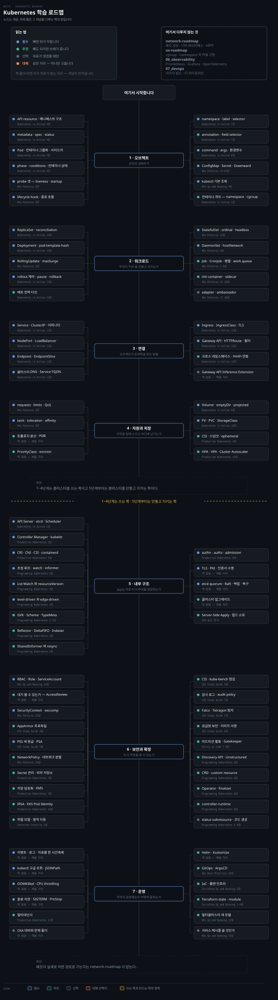
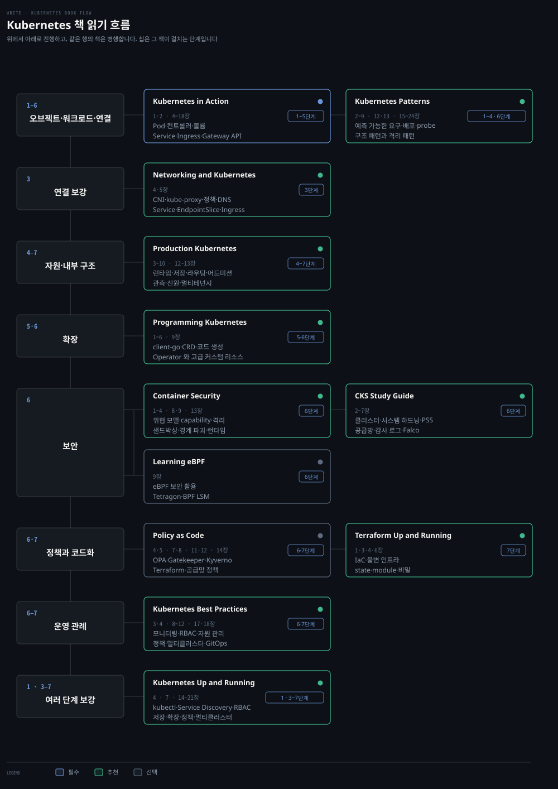

# Kubernetes 학습 로드맵
---

> 오브젝트를 선언하는 데서 시작해 워크로드·연결·자원으로 넓힌 뒤 클러스터 내부와 확장·운영으로 들어갑니다. 개념이 주인공이고 책은 그 개념을 다루는 자리입니다.

## 학습 순서

> 단계마다 배우는 개념을 묶음으로 갈랐습니다. 자료 위치는 아래 단계별 표가 짚습니다.

| 단계 | 묶음 | 배우는 개념 |
|---|---|---|
| 1 · 오브젝트 | API 모델 | API resource · 매니페스트 · `metadata` · `spec` · `status` · kubectl 기본 조회 |
| 1 · 오브젝트 | Pod 생애주기 | Pod · 컨테이너 그룹화 · 사이드카 · phase · conditions · 컨테이너 상태 · restart 정책 |
| 1 · 오브젝트 | 건강 확인 | liveness probe · readiness probe · startup probe · lifecycle hook · 종료 흐름 |
| 1 · 오브젝트 | 조직화 | namespace · label · label selector · field selector · annotation |
| 1 · 오브젝트 | 설정 주입 | `command` · `args` · 환경변수 · ConfigMap · Secret · Downward API · projected volume |
| 2 · 워크로드 | 무상태 | ReplicaSet · reconciliation · 소유 관계 · Deployment · pod-template-hash |
| 2 · 워크로드 | 갱신과 되돌림 | RollingUpdate · Recreate · `maxSurge` · `maxUnavailable` · pause · rollback · 배포 전략 다섯 |
| 2 · 워크로드 | 상태와 노드 | StatefulSet · ordinal · headless Service · retention · DaemonSet · hostNetwork · hostPort |
| 2 · 워크로드 | 배치 작업 | Job · CronJob · 병렬 · 완료 모드 · work queue · suspend |
| 2 · 워크로드 | 컨테이너 구조 패턴 | init container · sidecar · adapter · ambassador |
| 3 · 연결 | 서비스 추상화 | Service · ClusterIP · 세션 어피니티 · NodePort · LoadBalancer · 트래픽 정책 |
| 3 · 연결 | 엔드포인트와 이름 | Endpoint · EndpointSlice · readiness 연동 · 클러스터 DNS · Service FQDN · 토폴로지 |
| 3 · 연결 | 외부 진입 | Ingress · IngressClass · TLS · Gateway API · HTTPRoute · 필터 · 크로스 네임스페이스 |
| 3 · 연결 | 새 확장 | Gateway API Inference Extension · `InferencePool` · Endpoint Picker |
| 4 · 자원과 저장 | 요구와 배치 | requests · limits · QoS · taint · toleration · affinity · 토폴로지 분산 · PDB · PriorityClass · eviction |
| 4 · 자원과 저장 | 볼륨 | Volume · emptyDir · hostPath · projected · PV · PVC · StorageClass · 동적 프로비저닝 |
| 4 · 자원과 저장 | 저장 운영 | CSI · access mode · reclaim policy · 리사이즈 · 스냅샷 · ephemeral volume |
| 4 · 자원과 저장 | 확장 | HPA · VPA · Cluster Autoscaler · KEDA · metrics-server · custom metric |
| 5 · 내부 구조 | Control Plane | API Server · etcd · Scheduler · Controller Manager · kubelet |
| 5 · 내부 구조 | 노드 인터페이스 | CRI · CNI · CSI · containerd · 조정 루프 · watch · informer |
| 5 · 내부 구조 | 컨트롤러 | List·Watch · resourceVersion · 410 Gone · level-driven 과 edge-driven · GVK · Scheme · controller-runtime · upsert 의미 |
| 5 · 내부 구조 | 접근 통제 | authentication · authorization · admission · TLS · PKI · 인증서 수명 |
| 5 · 내부 구조 | 상태 저장소 | etcd quorum · Raft · 백업 · 복구 · 클러스터 업그레이드 |
| 6 · 보안과 확장 | 권한 | RBAC · Role · ClusterRole · RoleBinding · ServiceAccount |
| 6 · 보안과 확장 | 실행 권한 | SecurityContext · capability · seccomp · Pod Security Admission · NetworkPolicy |
| 6 · 보안과 확장 | 비밀과 공급망 | Secret 관리 · 외부 저장소 · 이미지 서명 · 공급망 보안 |
| 6 · 보안과 확장 | 확장 지점 | CRD · custom resource · controller · Operator · finalizer · OwnerReference · status subresource |
| 6 · 보안과 확장 | 정책 | 어드미션 웹훅 · OPA · Gatekeeper · Kyverno |
| 7 · 운영 | 증상 좁히기 | 이벤트 · 로그 · 지표를 한 시간축에 · kubectl 고급 조회 · JSONPath |
| 7 · 운영 | 자원 장애 | OOMKilled · exit code 137 · CPU throttling · node pressure · eviction |
| 7 · 운영 | 종료와 복구 | SIGTERM · PID 1 · PreStop · `terminationGracePeriodSeconds` · PDB · NodeNotReady |
| 7 · 운영 | 배포 도구 | Helm · Kustomize · GitOps · ArgoCD · App of Apps · ApplicationSet |
| 7 · 운영 | 확대 | 멀티테넌시 · 멀티클러스터 세 모델 · 서비스 메시를 쓸 것인가 |

## 책 읽기 흐름

> 위 단계를 무엇으로 배우는가입니다. 책 열이 각각 어느 단계의 무엇을 다루는지와 읽을 장을 적습니다.

통독하는 책은 《Kubernetes in Action》 하나이고 나머지는 표의 `읽을 장`만 봅니다.

| 책 | 읽을 장 | 우선순위 | 자리 |
|---|---|:---:|---|
| [Kubernetes in Action](../08_cloud/book/kubernetes-in-action/README.md) | 1~18장 | 필수 | 1~4단계 |
| [Kubernetes Patterns](../08_cloud/book/kubernetes-patterns/README.md) | 2~9 · 12 · 15~24장 | 추천 | 1·2·4·6단계 |
| [Networking and Kubernetes](../08_cloud/book/networking-and-kubernetes/README.md) | 4·5장 | 추천 | 3단계 |
| Production Kubernetes | 3~9 · 12·13장 | 추천 | 4·5·7단계 |
| Programming Kubernetes | 1~6 · 9장 | 추천 | 5·6단계 |
| [Container Security](../08_cloud/book/container-security/README.md) | 2~4 · 8·9 · 13장 | 추천 | 6단계 |
| Kubernetes Best Practices | 3·4 · 8~12 · 17·18장 | 추천 | 6·7단계 |
| [Kubernetes: Up and Running](../08_cloud/book/kubernetes-up-and-running/README.md) | 7 · 14~21장 | 추천 | 3·6·7단계 |
| Policy as Code | 4·5 · 7·8장 | 선택 | 6단계 |
| CKS Study Guide | 2~7장 | 선택 | 6단계 |

소장 목록은 계속 늘어납니다. 새 책이 들어오면 이 표와 아래 단계별 표의 `책` 열을 함께 갱신합니다.

## 클러스터를 쓰는 쪽 · 1~4단계

> 선언한 오브젝트가 어떻게 도는지를 봅니다. 클러스터를 직접 세우지 않아도 성립하는 구간입니다.

### 1단계 · 오브젝트

| 개념 | 우선순위 | 노트 | 책 |
|---|:---:|---|---|
| API resource · 매니페스트 · `metadata` · `spec` · `status` | 필수 | [04-01](../08_cloud/book/kubernetes-in-action/04-01.%EC%BF%A0%EB%B2%84%EB%84%A4%ED%8B%B0%EC%8A%A4%20API%EC%99%80%20%EC%98%A4%EB%B8%8C%EC%A0%9D%ED%8A%B8%20%EB%A7%A4%EB%8B%88%ED%8E%98%EC%8A%A4%ED%8A%B8%20%EA%B5%AC%EC%A1%B0.md) · [04-02](../08_cloud/book/kubernetes-in-action/04-02.Node%EC%99%80%20Event%20%EC%98%A4%EB%B8%8C%EC%A0%9D%ED%8A%B8%EB%A1%9C%20%EB%B3%B4%EB%8A%94%20%ED%95%84%EB%93%9C%20%EC%8B%A4%EC%8A%B5.md) | Kubernetes in Action 4장 |
| Pod · 컨테이너 그룹화 · 사이드카 | 필수 | [05-01](../08_cloud/book/kubernetes-in-action/05-01.Pod%20%EC%9D%B4%ED%95%B4%20%E2%80%94%20%EC%BB%A8%ED%85%8C%EC%9D%B4%EB%84%88%20%EA%B7%B8%EB%A3%B9%ED%99%94%EC%99%80%20%EC%82%AC%EC%9D%B4%EB%93%9C%EC%B9%B4.md) · [05-03](../08_cloud/book/kubernetes-in-action/05-03.%EB%A9%80%ED%8B%B0%20%EC%BB%A8%ED%85%8C%EC%9D%B4%EB%84%88%C2%B7init%C2%B7%EB%84%A4%EC%9D%B4%ED%8B%B0%EB%B8%8C%20%EC%82%AC%EC%9D%B4%EB%93%9C%EC%B9%B4%EC%99%80%20%EC%82%AD%EC%A0%9C.md) | Kubernetes in Action 5장 |
| phase · conditions · 컨테이너 상태 · restart 정책 | 필수 | [06-01](../08_cloud/book/kubernetes-in-action/06-01.Pod%20%EC%83%81%ED%83%9C%20%E2%80%94%20phase%C2%B7conditions%C2%B7%EC%BB%A8%ED%85%8C%EC%9D%B4%EB%84%88%20%EC%83%81%ED%83%9C.md) | Kubernetes in Action 6장 |
| liveness · readiness · startup probe | 필수 | [06-02](../08_cloud/book/kubernetes-in-action/06-02.liveness%C2%B7startup%20probe%EB%A1%9C%20%EC%BB%A8%ED%85%8C%EC%9D%B4%EB%84%88%20%EA%B1%B4%EA%B0%95%20%EC%9C%A0%EC%A7%80.md) · [04-01](../08_cloud/book/kubernetes-patterns/04-01.Health%20Probe%20%E2%80%94%20%EC%95%B1%EC%9D%B4%20%EC%9E%90%EA%B8%B0%20%EA%B1%B4%EA%B0%95%EC%9D%84%20%ED%94%8C%EB%9E%AB%ED%8F%BC%EC%97%90%20%EC%95%8C%EB%A6%AC%EA%B8%B0.md) | Kubernetes Patterns 4장 |
| lifecycle hook · 종료 흐름 | 필수 | [06-03](../08_cloud/book/kubernetes-in-action/06-03.lifecycle%20hook%EA%B3%BC%20Pod%20%EC%83%9D%EC%95%A0%EC%A3%BC%EA%B8%B0%20%EC%A0%84%EC%B2%B4.md) · [05-01](../08_cloud/book/kubernetes-patterns/05-01.Managed%20Lifecycle%20%E2%80%94%20%ED%94%8C%EB%9E%AB%ED%8F%BC%EC%9D%98%20%EC%83%9D%EC%95%A0%EC%A3%BC%EA%B8%B0%20%EC%9D%B4%EB%B2%A4%ED%8A%B8%EC%97%90%20%EB%B0%98%EC%9D%91%ED%95%98%EA%B8%B0.md) | Kubernetes Patterns 5장 |
| namespace · label · label selector | 필수 | [07-01](../08_cloud/book/kubernetes-in-action/07-01.namespace%EB%A1%9C%20%ED%81%B4%EB%9F%AC%EC%8A%A4%ED%84%B0%EB%A5%BC%20%EA%B0%80%EC%83%81%20%EB%B6%84%ED%95%A0%ED%95%98%EA%B8%B0.md) · [07-02](../08_cloud/book/kubernetes-in-action/07-02.label%EA%B3%BC%20label%20selector%EB%A1%9C%20%EC%98%A4%EB%B8%8C%EC%A0%9D%ED%8A%B8%20%EC%A1%B0%EC%A7%81%ED%95%98%EA%B8%B0.md) | Kubernetes in Action 7장 |
| field selector · annotation | 추천 | [07-03](../08_cloud/book/kubernetes-in-action/07-03.field%20selector%EC%99%80%20annotation.md) | Kubernetes in Action 7장 |
| `command` · `args` · 환경변수 | 필수 | [08-01](../08_cloud/book/kubernetes-in-action/08-01.command%C2%B7args%EC%99%80%20%ED%99%98%EA%B2%BD%EB%B3%80%EC%88%98.md) · [19-01](../08_cloud/book/kubernetes-patterns/19-01.EnvVar%20Configuration%20%E2%80%94%20%ED%99%98%EA%B2%BD%EB%B3%80%EC%88%98%EB%A1%9C%20%EC%84%A4%EC%A0%95%EC%9D%84%20%EC%99%B8%EB%B6%80%ED%99%94%ED%95%98%EA%B8%B0.md) | Kubernetes Patterns 19장 |
| ConfigMap · Secret · Downward API | 필수 | [08-02](../08_cloud/book/kubernetes-in-action/08-02.ConfigMap%EC%9C%BC%EB%A1%9C%20%EC%84%A4%EC%A0%95%20%EB%B6%84%EB%A6%AC%ED%95%98%EA%B8%B0.md) · [08-03](../08_cloud/book/kubernetes-in-action/08-03.Secret%EA%B3%BC%20Downward%20API.md) · [20-01](../08_cloud/book/kubernetes-patterns/20-01.Configuration%20Resource%20%E2%80%94%20ConfigMap%EA%B3%BC%20Secret%EC%9C%BC%EB%A1%9C%20%EC%84%A4%EC%A0%95%20%EB%B6%84%EB%A6%AC.md) | Kubernetes Patterns 20~22장 |
| kubectl 기본 조회 | 필수 | | Kubernetes Up and Running 4장 |
| 컨테이너 격리 — namespace · cgroup | 추천 | [02-03](../08_cloud/book/kubernetes-in-action/02-03.%EB%84%A4%EC%9E%84%EC%8A%A4%ED%8E%98%EC%9D%B4%EC%8A%A4%EC%99%80%20cgroup%EC%9C%BC%EB%A1%9C%20%EB%B3%B4%EB%8A%94%20%EC%BB%A8%ED%85%8C%EC%9D%B4%EB%84%88%20%EA%B2%A9%EB%A6%AC.md) · [OS 로드맵](os-roadmap.md) | Kubernetes in Action 2장 |

### 2단계 · 워크로드

| 개념 | 우선순위 | 노트 | 책 |
|---|:---:|---|---|
| ReplicaSet · reconciliation · 소유 관계 | 필수 | [14-01](../08_cloud/book/kubernetes-in-action/14-01.ReplicaSet%20%EA%B8%B0%EC%B4%88%20%E2%80%94%20%EC%83%9D%EC%84%B1%C2%B7%EC%86%8C%EC%9C%A0%C2%B7%EC%8A%A4%EC%BC%80%EC%9D%BC%EB%A7%81.md) · [14-02](../08_cloud/book/kubernetes-in-action/14-02.ReplicaSet%20%EC%BB%A8%ED%8A%B8%EB%A1%A4%EB%9F%AC%20%E2%80%94%20reconciliation%C2%B7%EC%9E%A5%EC%95%A0%EB%B3%B5%EA%B5%AC%C2%B7%EC%82%AD%EC%A0%9C.md) | Kubernetes in Action 14장 |
| Deployment · pod-template-hash | 필수 | [15-01](../08_cloud/book/kubernetes-in-action/15-01.Deployment%20%EA%B8%B0%EC%B4%88%20%E2%80%94%20%EC%83%9D%EC%84%B1%C2%B7pod-template-hash%C2%B7%EC%8A%A4%EC%BC%80%EC%9D%BC%EB%A7%81.md) | Kubernetes in Action 15장 |
| RollingUpdate · Recreate · `maxSurge` · `maxUnavailable` | 필수 | [15-02](../08_cloud/book/kubernetes-in-action/15-02.Deployment%20%EC%97%85%EB%8D%B0%EC%9D%B4%ED%8A%B8%20%E2%80%94%20Recreate%C2%B7RollingUpdate%C2%B7maxSurge.md) · [03-01](../08_cloud/book/kubernetes-patterns/03-01.Declarative%20Deployment%20%E2%80%94%20%EC%97%85%EA%B7%B8%EB%A0%88%EC%9D%B4%EB%93%9C%C2%B7%EB%A1%A4%EB%B0%B1%EC%9D%84%20%EC%84%A0%EC%96%B8%EC%9C%BC%EB%A1%9C.md) | Kubernetes Patterns 3장 |
| rollout 제어 · pause · rollback · 배포 전략 다섯 | 필수 | [15-03](../08_cloud/book/kubernetes-in-action/15-03.rollout%20%EC%A0%9C%EC%96%B4%EC%99%80%20%EB%B0%B0%ED%8F%AC%20%EC%A0%84%EB%9E%B5%20%E2%80%94%20pause%C2%B7faulty%C2%B7rollback%C2%B7%EC%A0%84%EB%9E%B5%205%EC%A2%85.md) | Kubernetes in Action 15장 |
| StatefulSet · ordinal · headless Service · retention | 필수 | [16-01](../08_cloud/book/kubernetes-in-action/16-01.StatefulSet%20%EA%B8%B0%EC%B4%88%20%E2%80%94%20Pets%20vs%20Cattle%C2%B7ordinal%C2%B7headless%20Service.md) · [16-02](../08_cloud/book/kubernetes-in-action/16-02.StatefulSet%20%EB%8F%99%EC%9E%91%20%E2%80%94%20%EB%AF%B8%EC%8B%B1%20%ED%8C%8C%EB%93%9C%C2%B7%EB%85%B8%EB%93%9C%20%EC%9E%A5%EC%95%A0%C2%B7%EC%8A%A4%EC%BC%80%EC%9D%BC%C2%B7retention.md) · [12-01](../08_cloud/book/kubernetes-patterns/12-01.Stateful%20Service%20%E2%80%94%20StatefulSet%EC%9C%BC%EB%A1%9C%20%EC%83%81%ED%83%9C%EB%A5%BC%20first-class%EB%A1%9C.md) | Kubernetes Patterns 12장 |
| DaemonSet · hostNetwork · hostPort · PriorityClass | 필수 | [17-01](../08_cloud/book/kubernetes-in-action/17-01.DaemonSet%20%EA%B8%B0%EC%B4%88%20%E2%80%94%20%EB%85%B8%EB%93%9C%EB%A7%88%EB%8B%A4%20%ED%95%98%EB%82%98%C2%B7node%20selector%C2%B7%EC%97%85%EB%8D%B0%EC%9D%B4%ED%8A%B8.md) · [17-02](../08_cloud/book/kubernetes-in-action/17-02.%EB%85%B8%EB%93%9C%20%EC%97%90%EC%9D%B4%EC%A0%84%ED%8A%B8%20%ED%8A%B9%EC%88%98%20%EA%B8%B0%EB%8A%A5%20%E2%80%94%20privileged%C2%B7hostPath%C2%B7hostNetwork%C2%B7PriorityClass.md) · [09-01](../08_cloud/book/kubernetes-patterns/09-01.Daemon%20Service%20%E2%80%94%20%EB%85%B8%EB%93%9C%EB%A7%88%EB%8B%A4%20%EB%8F%84%EB%8A%94%20%EC%9D%B8%ED%94%84%EB%9D%BC%20Pod.md) | Kubernetes Patterns 9장 |
| Job · CronJob · 병렬 · 완료 모드 · work queue | 추천 | [18-01](../08_cloud/book/kubernetes-in-action/18-01.Job%20%EA%B8%B0%EC%B4%88%20%E2%80%94%20%EC%8B%A4%ED%96%89%C2%B7%EC%83%81%ED%83%9C%C2%B7suspend%C2%B7%EC%9E%90%EB%8F%99%EC%82%AD%EC%A0%9C.md) ~ [18-03](../08_cloud/book/kubernetes-in-action/18-03.work%20queue%C2%B7pod%20%ED%86%B5%EC%8B%A0%C2%B7sidecar%C2%B7CronJob.md) · [07-01](../08_cloud/book/kubernetes-patterns/07-01.Batch%20Job%20%E2%80%94%20%EC%9C%A0%ED%95%9C%ED%95%9C%20%EC%9E%91%EC%97%85%EC%9D%84%20%EC%99%84%EB%A3%8C%EA%B9%8C%EC%A7%80%20%EC%95%88%EC%A0%95%EC%A0%81%EC%9C%BC%EB%A1%9C.md) | Kubernetes Patterns 7·8장 |
| init container · sidecar | 추천 | [15-01](../08_cloud/book/kubernetes-patterns/15-01.Init%20Container%20%E2%80%94%20%EC%B4%88%EA%B8%B0%ED%99%94%EB%A5%BC%20%EC%95%B1%EA%B3%BC%20%EB%B6%84%EB%A6%AC%ED%95%B4%20%EB%B3%84%EB%8F%84%20%EC%83%9D%EC%95%A0%EC%A3%BC%EA%B8%B0%EB%A1%9C.md) · [16-01](../08_cloud/book/kubernetes-patterns/16-01.Sidecar%20%E2%80%94%20%EA%B8%B0%EC%A1%B4%20%EC%BB%A8%ED%85%8C%EC%9D%B4%EB%84%88%EB%A5%BC%20%EB%B0%94%EA%BE%B8%EC%A7%80%20%EC%95%8A%EA%B3%A0%20%ED%99%95%EC%9E%A5.md) | Kubernetes Patterns 15·16장 |
| adapter · ambassador | 선택 | [17-01](../08_cloud/book/kubernetes-patterns/17-01.Adapter%20%E2%80%94%20%EC%9D%B4%EC%A7%88%EC%A0%81%20%EC%8B%9C%EC%8A%A4%ED%85%9C%EC%9D%84%20%ED%86%B5%EC%9D%BC%20%EC%9D%B8%ED%84%B0%ED%8E%98%EC%9D%B4%EC%8A%A4%EB%A1%9C.md) · [18-01](../08_cloud/book/kubernetes-patterns/18-01.Ambassador%20%E2%80%94%20%EB%B0%94%EA%B9%A5%EC%84%B8%EC%83%81%EC%9C%BC%EB%A1%9C%EC%9D%98%20smart%20proxy.md) | Kubernetes Patterns 17·18장 |
| Singleton Service · Stateless Service | 선택 | [10-01](../08_cloud/book/kubernetes-patterns/10-01.Singleton%20Service%20%E2%80%94%20%ED%95%9C%20%EB%B2%88%EC%97%90%20%ED%95%98%EB%82%98%EB%A7%8C%20%ED%99%9C%EC%84%B1%EC%9D%B4%EB%90%98%20%EA%B3%A0%EA%B0%80%EC%9A%A9.md) · [11-01](../08_cloud/book/kubernetes-patterns/11-01.Stateless%20Service%20%E2%80%94%20%EB%8F%99%EC%9D%BC%C2%B7%EA%B5%90%EC%B2%B4%20%EA%B0%80%EB%8A%A5%ED%95%9C%20replica%EB%A1%9C%20%EC%88%98%ED%8F%89%20%ED%99%95%EC%9E%A5.md) | Kubernetes Patterns 10·11장 |

### 3단계 · 연결

> 오브젝트가 트래픽을 받는 방법까지입니다. 패킷이 실제로 어떤 경로로 가는지는 [네트워크 로드맵](network-roadmap.md)이 맡습니다.

| 개념 | 우선순위 | 노트 | 책 |
|---|:---:|---|---|
| Service · ClusterIP · 세션 어피니티 | 필수 | [11-01](../08_cloud/book/kubernetes-in-action/11-01.Service%20%EA%B8%B0%EC%B4%88%20%E2%80%94%20%ED%8C%8C%EB%93%9C%20%ED%86%B5%EC%8B%A0%C2%B7ClusterIP%C2%B7%EC%84%B8%EC%85%98%20%EC%96%B4%ED%94%BC%EB%8B%88%ED%8B%B0.md) · [04-04](../08_cloud/kubernetes/04_networking/04-04.Service%EC%99%80%20EndpointSlice.md) | Kubernetes in Action 11장 |
| NodePort · LoadBalancer · 트래픽 정책 | 필수 | [11-02](../08_cloud/book/kubernetes-in-action/11-02.%EC%99%B8%EB%B6%80%20%EB%85%B8%EC%B6%9C%20%E2%80%94%20NodePort%C2%B7LoadBalancer%C2%B7%ED%8A%B8%EB%9E%98%ED%94%BD%20%EC%A0%95%EC%B1%85.md) | Kubernetes in Action 11장 |
| Endpoint · EndpointSlice · readiness 연동 · 토폴로지 | 필수 | [11-03](../08_cloud/book/kubernetes-in-action/11-03.%EC%97%94%EB%93%9C%ED%8F%AC%EC%9D%B8%ED%8A%B8%C2%B7DNS%C2%B7%ED%86%A0%ED%8F%B4%EB%A1%9C%EC%A7%80%C2%B7readiness.md) | Networking and Kubernetes 5장 |
| 클러스터 DNS · Service FQDN | 필수 | [04-05](../08_cloud/kubernetes/04_networking/04-05.DNS%EC%99%80%20CoreDNS.md) · [13-01](../08_cloud/book/kubernetes-patterns/13-01.Service%20Discovery%20%E2%80%94%20%EA%B3%A0%EC%A0%95%20%EC%97%94%EB%93%9C%ED%8F%AC%EC%9D%B8%ED%8A%B8%EB%A1%9C%20%EB%8F%99%EC%A0%81%20Pod%EB%A5%BC%20%EC%B0%BE%EA%B8%B0.md) | Kubernetes Patterns 13장 |
| Ingress · IngressClass · TLS | 필수 | [12-01](../08_cloud/book/kubernetes-in-action/12-01.Ingress%EB%A1%9C%20%EC%97%AC%EB%9F%AC%20%EC%84%9C%EB%B9%84%EC%8A%A4%EB%A5%BC%20%ED%95%9C%20IP%EC%97%90%20%EB%85%B8%EC%B6%9C%ED%95%98%EA%B8%B0.md) · [12-02](../08_cloud/book/kubernetes-in-action/12-02.Ingress%20TLS%C2%B7%EC%84%A4%EC%A0%95%C2%B7IngressClass.md) | Kubernetes in Action 12장 |
| Gateway API · HTTPRoute · 필터 | 필수 | [13-01](../08_cloud/book/kubernetes-in-action/13-01.Gateway%20API%20%EA%B0%9C%EB%85%90%EA%B3%BC%20Gateway%20%EB%B0%B0%ED%8F%AC.md) · [13-02](../08_cloud/book/kubernetes-in-action/13-02.HTTPRoute%20%E2%80%94%20%EB%9D%BC%EC%9A%B0%ED%8C%85%EA%B3%BC%20%ED%95%84%ED%84%B0.md) | Kubernetes in Action 13장 |
| 크로스 네임스페이스 · mesh 연동 | 추천 | [13-03](../08_cloud/book/kubernetes-in-action/13-03.TLS%C2%B7%EA%B8%B0%ED%83%80%20%ED%94%84%EB%A1%9C%ED%86%A0%EC%BD%9C%C2%B7%ED%81%AC%EB%A1%9C%EC%8A%A4%20%EB%84%A4%EC%9E%84%EC%8A%A4%ED%8E%98%EC%9D%B4%EC%8A%A4%C2%B7mesh.md) | Kubernetes in Action 13장 |
| Service Discovery 가 DNS 로 못 하는 일 | 추천 | [07-01](../08_cloud/book/kubernetes-up-and-running/07-01.Service%20Discovery%20%E2%80%94%20DNS%EA%B0%80%20%EB%AA%BB%20%ED%95%98%EB%8A%94%20%EC%9D%BC%EA%B3%BC%20%EB%B0%94%EA%B9%A5%EC%9D%84%20%EC%9E%87%EB%8A%94%20%EB%B2%95.md) | Kubernetes Up and Running 7장 |
| Gateway API Inference Extension · `InferencePool` | 선택 | | |

### 4단계 · 자원과 저장

| 개념 | 우선순위 | 노트 | 책 |
|---|:---:|---|---|
| requests · limits · QoS | 필수 | [02-01](../08_cloud/book/kubernetes-patterns/02-01.Predictable%20Demands%20%E2%80%94%20%EC%9E%90%EC%9B%90%20%EC%9A%94%EA%B5%AC%EB%A5%BC%20%EC%84%A0%EC%96%B8%ED%95%B4%20%EC%8A%A4%EC%BC%80%EC%A4%84%EB%9F%AC%EC%97%90%20%EC%95%8C%EB%A6%AC%EA%B8%B0.md) | Kubernetes Patterns 2장 |
| taint · toleration · affinity · 스케줄러 동작 | 필수 | [05-01](../08_cloud/kubernetes/05_scheduling/05-01.%EC%8A%A4%EC%BC%80%EC%A4%84%EB%A7%81%EA%B3%BC%20%EB%85%B8%EB%93%9C%20%EC%84%A0%ED%83%9D.md) · [06-01](../08_cloud/book/kubernetes-patterns/06-01.Automated%20Placement%20%E2%80%94%20%EC%8A%A4%EC%BC%80%EC%A4%84%EB%9F%AC%EA%B0%80%20Pod%EB%A5%BC%20%EB%85%B8%EB%93%9C%EC%97%90%20%EB%B0%B0%EC%B9%98%ED%95%98%EB%8A%94%20%EB%B2%95.md) | Kubernetes Patterns 6장 |
| 토폴로지 분산 · PodDisruptionBudget | 추천 | [05-02](../08_cloud/kubernetes/05_scheduling/05-02.%ED%86%A0%ED%8F%B4%EB%A1%9C%EC%A7%80%20%EB%B6%84%EC%82%B0%EA%B3%BC%20%EC%A4%91%EB%8B%A8%20%EC%A0%95%EC%B1%85.md) | |
| PriorityClass · preemption · eviction | 추천 | [05-02](../08_cloud/kubernetes/05_scheduling/05-02.%ED%86%A0%ED%8F%B4%EB%A1%9C%EC%A7%80%20%EB%B6%84%EC%82%B0%EA%B3%BC%20%EC%A4%91%EB%8B%A8%20%EC%A0%95%EC%B1%85.md) | |
| Volume · emptyDir · hostPath · projected | 필수 | [09-01](../08_cloud/book/kubernetes-in-action/09-01.%EB%B3%BC%EB%A5%A8%20%EC%9D%B4%ED%95%B4%EC%99%80%20emptyDir%EB%A1%9C%20%EB%8D%B0%EC%9D%B4%ED%84%B0%20%EB%B3%B4%EC%A1%B4%ED%95%98%EA%B8%B0.md) ~ [09-03](../08_cloud/book/kubernetes-in-action/09-03.ConfigMap%C2%B7Secret%C2%B7Downward%20API%C2%B7projected%20%EB%B3%BC%EB%A5%A8.md) | Kubernetes in Action 9장 |
| PV · PVC · StorageClass · 동적 프로비저닝 | 필수 | [10-01](../08_cloud/book/kubernetes-in-action/10-01.PV%C2%B7PVC%C2%B7StorageClass%EC%99%80%20%EB%8F%99%EC%A0%81%20%ED%94%84%EB%A1%9C%EB%B9%84%EC%A0%80%EB%8B%9D.md) · [10-02](../08_cloud/book/kubernetes-in-action/10-02.%EC%A0%95%EC%A0%81%20%ED%94%84%EB%A1%9C%EB%B9%84%EC%A0%80%EB%8B%9D%EA%B3%BC%20node-local%20%EB%B3%BC%EB%A5%A8.md) | Kubernetes in Action 10장 |
| CSI · access mode · reclaim policy · 스냅샷 · ephemeral | 추천 | [10-03](../08_cloud/book/kubernetes-in-action/10-03.PV%20%EA%B4%80%EB%A6%AC%20%E2%80%94%20%EB%A6%AC%EC%82%AC%EC%9D%B4%EC%A6%88%C2%B7%EC%8A%A4%EB%83%85%EC%83%B7%C2%B7ephemeral.md) | Production Kubernetes 4장 |
| 외부 저장소 통합 · 복제하지 않는 선택지 | 선택 | [16-01](../08_cloud/book/kubernetes-up-and-running/16-01.Integrating%20Storage%20%E2%80%94%20%EB%B3%B5%EC%A0%9C%ED%95%98%EC%A7%80%20%EC%95%8A%EB%8A%94%20%EC%84%A0%ED%83%9D%EC%A7%80%EC%99%80%20MySQL%20%EC%8B%B1%EA%B8%80%ED%84%B4%20%EB%9E%A9.md) | Kubernetes Up and Running 16장 |
| HPA · VPA · Cluster Autoscaler · KEDA | 추천 | [05-03](../08_cloud/kubernetes/05_scheduling/05-03.%EC%98%A4%ED%86%A0%EC%8A%A4%EC%BC%80%EC%9D%BC%EB%A7%81.md) · [29-01](../08_cloud/book/kubernetes-patterns/29-01.Elastic%20Scale%20%E2%80%94%20%EB%B6%80%ED%95%98%EC%97%90%20%EB%A7%9E%EC%B6%B0%20%EC%84%B8%20%EC%B0%A8%EC%9B%90%EC%9C%BC%EB%A1%9C%20%EC%9E%90%EB%8F%99%20%ED%99%95%EC%9E%A5.md) | Production Kubernetes 13장 |
| Self Awareness — 자기 메타데이터 | 선택 | [14-01](../08_cloud/book/kubernetes-patterns/14-01.Self%20Awareness%20%E2%80%94%20downward%20API%EB%A1%9C%20%EC%9E%90%EA%B8%B0%20%EB%A9%94%ED%83%80%EB%8D%B0%EC%9D%B4%ED%84%B0%20%EC%96%BB%EA%B8%B0.md) | Kubernetes Patterns 14장 |

## 클러스터를 만들고 지키는 쪽 · 5~7단계

> 오브젝트 뒤에서 무엇이 결정을 내리는지, 그리고 그것이 잘못됐을 때 어디를 보는지입니다.

### 5단계 · 내부 구조

| 개념 | 우선순위 | 노트 | 책 |
|---|:---:|---|---|
| API Server · etcd · Scheduler · Controller Manager | 필수 | [01-01](../08_cloud/book/kubernetes-in-action/01-01.%EC%BF%A0%EB%B2%84%EB%84%A4%ED%8B%B0%EC%8A%A4%EB%9E%80%20%EB%AC%B4%EC%97%87%EC%9D%B8%EA%B0%80%20%E2%80%94%20%EA%B8%B0%EC%9B%90%EA%B3%BC%20%EC%95%84%ED%82%A4%ED%85%8D%EC%B2%98.md) | Kubernetes in Action 1장 |
| kubelet · CRI · CNI · CSI · containerd | 필수 | [Kubernetes MOC](../08_cloud/kubernetes/README.md) | Production Kubernetes 3장 |
| 조정 루프 · watch · informer · client-go | 필수 | | Programming Kubernetes 2·3장 |
| List·Watch 와 resourceVersion · 410 Gone | 필수 | | Programming Kubernetes 3장 |
| level-driven 과 edge-driven 의 차이 | 필수 | | Programming Kubernetes 1장 |
| GVK · Scheme · TypeMeta | 추천 | | Programming Kubernetes 2·3장 |
| controller-runtime 으로 감싸기 | 추천 | | Programming Kubernetes 6장 |
| 이벤트 병합과 upsert — 감사 로그가 아니다 | 추천 | | Programming Kubernetes 1장 |
| authentication · authorization · admission | 필수 | [06-02](../08_cloud/kubernetes/06_architecture/06-02.TLS%EC%99%80%20API%20%EC%A0%91%EA%B7%BC%20%EB%B3%B4%EC%95%88.md) | Production Kubernetes 8장 |
| TLS · PKI · 인증서 수명 | 필수 | [06-02](../08_cloud/kubernetes/06_architecture/06-02.TLS%EC%99%80%20API%20%EC%A0%91%EA%B7%BC%20%EB%B3%B4%EC%95%88.md) | |
| etcd quorum · Raft · 백업 · 복구 | 필수 | [06-01](../08_cloud/kubernetes/06_architecture/06-01.%ED%81%B4%EB%9F%AC%EC%8A%A4%ED%84%B0%20%EC%97%85%EA%B7%B8%EB%A0%88%EC%9D%B4%EB%93%9C%EC%99%80%20ETCD%20%EB%B0%B1%EC%97%85%C2%B7%EB%B3%B5%EA%B5%AC.md) | |
| 클러스터 업그레이드 | 추천 | [06-01](../08_cloud/kubernetes/06_architecture/06-01.%ED%81%B4%EB%9F%AC%EC%8A%A4%ED%84%B0%20%EC%97%85%EA%B7%B8%EB%A0%88%EC%9D%B4%EB%93%9C%EC%99%80%20ETCD%20%EB%B0%B1%EC%97%85%C2%B7%EB%B3%B5%EA%B5%AC.md) | |
| 클라이언트가 감추는 HTTP | 선택 | [18-01](../08_cloud/book/kubernetes-up-and-running/18-01.Accessing%20Kubernetes%20%E2%80%94%20%ED%81%B4%EB%9D%BC%EC%9D%B4%EC%96%B8%ED%8A%B8%EA%B0%80%20%EA%B0%90%EC%B6%94%EB%8A%94%20HTTP%EC%99%80%20%EC%9B%90%EC%84%9C%20%EC%BD%94%EB%93%9C%20%EC%8B%A4%EC%A6%9D%20%EB%9E%A9.md) | Kubernetes Up and Running 18장 |

### 6단계 · 보안과 확장

| 개념 | 우선순위 | 노트 | 책 |
|---|:---:|---|---|
| RBAC · Role · ClusterRole · RoleBinding · ServiceAccount | 필수 | [14-01](../08_cloud/book/kubernetes-up-and-running/14-01.RBAC%20%E2%80%94%20%EC%9D%B8%EA%B0%80%EB%A5%BC%20%EC%84%A4%EA%B3%84%ED%95%98%EA%B3%A0%20%EC%9A%B4%EC%98%81%ED%95%98%EB%8A%94%20%EB%B2%95.md) · [26-01](../08_cloud/book/kubernetes-patterns/26-01.Access%20Control%20%E2%80%94%20RBAC%EC%9C%BC%EB%A1%9C%20%EB%88%84%EA%B0%80%20%EB%AC%B4%EC%97%87%EC%9D%84%20%ED%95%A0%20%EC%88%98%20%EC%9E%88%EB%8A%94%EC%A7%80.md) | Kubernetes Up and Running 14장 |
| SecurityContext · capability · seccomp · 최소 권한 | 필수 | [23-01](../08_cloud/book/kubernetes-patterns/23-01.Process%20Containment%20%E2%80%94%20%EC%B5%9C%EC%86%8C%20%EA%B6%8C%ED%95%9C%EC%9C%BC%EB%A1%9C%20%EC%BB%A8%ED%85%8C%EC%9D%B4%EB%84%88%EB%A5%BC%20%EA%B0%80%EB%91%90%EA%B8%B0.md) · [02-01](../08_cloud/book/container-security/02-01.Linux%20%EC%8B%9C%EC%8A%A4%ED%85%9C%20%EC%BD%9C%C2%B7%EA%B6%8C%ED%95%9C%C2%B7capability%20%E2%80%94%20%EC%BB%A8%ED%85%8C%EC%9D%B4%EB%84%88%20%EB%B3%B4%EC%95%88%EC%9D%98%20%EB%B0%94%EB%8B%A5.md) | Kubernetes Patterns 23장 |
| Pod Security Admission | 필수 | [19-01](../08_cloud/book/kubernetes-up-and-running/19-01.Securing%20Applications%20%E2%80%94%20%EC%A3%BD%EC%9D%80%20%EC%8B%A4%EC%8A%B5%20%EC%9D%B4%EB%AF%B8%EC%A7%80%EC%99%80%20proc%20%EB%A1%9C%20%EB%8B%A4%EC%8B%9C%20%EC%84%B8%EC%9A%B4%20%EB%9E%A9.md) | CKS Study Guide 3장 |
| NetworkPolicy · 네트워크 분할 | 추천 | [04-07](../08_cloud/kubernetes/04_networking/04-07.NetworkPolicy.md) · [24-01](../08_cloud/book/kubernetes-patterns/24-01.Network%20Segmentation%20%E2%80%94%20%ED%86%B5%EC%8B%A0%EC%9D%84%20%ED%95%84%EC%9A%94%ED%95%9C%20%EA%B2%BD%EB%A1%9C%EB%A7%8C%20%EB%82%A8%EA%B8%B0%EA%B8%B0.md) | Kubernetes Patterns 24장 |
| Secret 관리 · 외부 저장소 · 안전한 설정 | 추천 | [25-01](../08_cloud/book/kubernetes-patterns/25-01.Secure%20Configuration%20%E2%80%94%20%EB%AF%BC%EA%B0%90%ED%95%9C%20%EC%84%A4%EC%A0%95%EC%9D%84%20%EC%95%88%EC%A0%84%ED%95%98%EA%B2%8C%20%EB%8B%A4%EB%A3%A8%EA%B8%B0.md) | Production Kubernetes 7장 |
| 격리 강화 · 경계 파괴 · 런타임 보호 | 추천 | [08-01](../08_cloud/book/container-security/08-01.%EC%BB%A8%ED%85%8C%EC%9D%B4%EB%84%88%20%EA%B2%A9%EB%A6%AC%20%EA%B0%95%ED%99%94%20%E2%80%94%20%EC%83%8C%EB%93%9C%EB%B0%95%EC%8B%B1%EC%9D%98%20%EC%84%B8%20%EA%B0%88%EB%9E%98.md) · [09-01](../08_cloud/book/container-security/09-01.%EC%BB%A8%ED%85%8C%EC%9D%B4%EB%84%88%20%EA%B2%A9%EB%A6%AC%20%EA%B9%A8%EB%9C%A8%EB%A6%AC%EA%B8%B0%20%E2%80%94%20%EC%84%A4%EC%A0%95%20%ED%95%98%EB%82%98%EB%A1%9C%20%EB%AC%B4%EB%84%88%EC%A7%80%EB%8A%94%20%EA%B2%BD%EA%B3%84.md) | Container Security 8·9·13장 |
| Discovery API · Unstructured — 동적 리소스 | 추천 | | Programming Kubernetes 3장 |
| CRD · custom resource | 추천 | [16-03](../08_cloud/book/kubernetes-in-action/16-03.StatefulSet%20%EC%97%85%EB%8D%B0%EC%9D%B4%ED%8A%B8%EC%99%80%20Operator%20%E2%80%94%20partition%C2%B7OnDelete%C2%B7CRD.md) · [17-01](../08_cloud/book/kubernetes-up-and-running/17-01.Extending%20Kubernetes%20%E2%80%94%20%EC%96%B4%EB%93%9C%EB%AF%B8%EC%85%98%C2%B7%EC%BB%A4%EC%8A%A4%ED%85%80%20%EB%A6%AC%EC%86%8C%EC%8A%A4%EC%99%80%20%EC%9D%B8%EC%A6%9D%EC%84%9C%20%EC%97%86%EB%8A%94%20%EA%B2%80%EC%A6%9D%20%EB%9E%A9.md) | Programming Kubernetes 4장 |
| Controller · Operator · finalizer · OwnerReference | 추천 | [27-01](../08_cloud/book/kubernetes-patterns/27-01.Controller%20%E2%80%94%20Observe-Analyze-Act%EB%A1%9C%20%EC%83%81%ED%83%9C%EB%A5%BC%20%EC%A1%B0%EC%A0%95%ED%95%98%EA%B8%B0.md) · [28-01](../08_cloud/book/kubernetes-patterns/28-01.Operator%20%E2%80%94%20CRD%EB%A1%9C%20%EB%8F%84%EB%A9%94%EC%9D%B8%20%EC%A7%80%EC%8B%9D%EC%9D%84%20%EC%9E%90%EB%8F%99%ED%99%94%ED%95%98%EA%B8%B0.md) | Programming Kubernetes 6장 |
| status subresource · 코드 생성 | 선택 | | Programming Kubernetes 5·9장 |
| 어드미션 웹훅 · OPA · Gatekeeper · Kyverno | 추천 | [20-01](../08_cloud/book/kubernetes-up-and-running/20-01.Policy%20and%20Governance%20%E2%80%94%20Gatekeeper%20%EB%A1%9C%20%EB%A7%8C%EB%93%A4%EA%B8%B0%20%EC%A0%84%EC%97%90%20%EB%A7%89%EA%B3%A0%20%EB%A7%8C%EB%93%A0%20%EB%92%A4%EC%97%90%20%EC%84%B8%EB%8A%94%20%EB%B2%95.md) | Policy as Code 7·8장 |
| 공급망 보안 · 이미지 서명 · 취약점 스캔 | 선택 | [06-02](../08_cloud/book/container-security/06-02.%EC%9D%B4%EB%AF%B8%EC%A7%80%20%EA%B3%B5%EA%B8%89%EB%A7%9D%20%EB%B3%B4%EC%95%88%20%E2%80%94%20%EB%B9%8C%EB%93%9C%EB%B6%80%ED%84%B0%20%EB%B0%B0%ED%8F%AC%EA%B9%8C%EC%A7%80.md) · [07-01](../08_cloud/book/container-security/07-01.%EC%9D%B4%EB%AF%B8%EC%A7%80%20%EC%86%8D%20%EC%86%8C%ED%94%84%ED%8A%B8%EC%9B%A8%EC%96%B4%20%EC%B7%A8%EC%95%BD%EC%A0%90%20%E2%80%94%20CVE%EB%B6%80%ED%84%B0%20%EC%8A%A4%EC%BA%94%20%EC%9A%B4%EC%98%81%EA%B9%8C%EC%A7%80.md) | CKS Study Guide 6장 |
| 클러스터 안에서 이미지 빌드 | 선택 | [30-01](../08_cloud/book/kubernetes-patterns/30-01.Image%20Builder%20%E2%80%94%20%ED%81%B4%EB%9F%AC%EC%8A%A4%ED%84%B0%20%EC%95%88%EC%97%90%EC%84%9C%20%EC%9D%B4%EB%AF%B8%EC%A7%80%EB%A5%BC%20%EB%B9%8C%EB%93%9C%ED%95%98%EA%B8%B0.md) | Kubernetes Patterns 30장 |

### 7단계 · 운영

| 개념 | 우선순위 | 노트 | 책 |
|---|:---:|---|---|
| 이벤트 · 로그 · 지표를 한 시간축에 | 필수 | [09-01](../08_cloud/kubernetes/09_operations/09-01.%EB%AA%A8%EB%8B%88%ED%84%B0%EB%A7%81%EA%B3%BC%20%ED%8A%B8%EB%9F%AC%EB%B8%94%EC%8A%88%ED%8C%85.md) | Kubernetes Best Practices 3장 |
| kubectl 고급 조회 · JSONPath | 필수 | [09-03](../08_cloud/kubernetes/09_operations/09-03.JSONPath%EC%99%80%20kubectl%20%EA%B3%A0%EA%B8%89%20%EC%A1%B0%ED%9A%8C.md) | |
| OOMKilled · exit code 137 · CPU throttling | 필수 | [09-02](../08_cloud/kubernetes/09_operations/09-02.OOMKilled%20%EC%82%AC%EB%A1%80%20%EB%B6%84%EC%84%9D.md) · [OS 로드맵](os-roadmap.md) | |
| SIGTERM · PID 1 · PreStop · `terminationGracePeriodSeconds` | 필수 | [Kubernetes 장애 기록](../troubleshooting/kubernetes/README.md) | |
| node pressure · eviction · NodeNotReady | 추천 | [Kubernetes 장애 기록](../troubleshooting/kubernetes/README.md) | |
| Helm · Kustomize | 추천 | [10-01](../08_cloud/kubernetes/10_packaging/10-01.Helm%20%EA%B8%B0%EC%B4%88.md) ~ [10-03](../08_cloud/kubernetes/10_packaging/10-03.Kustomize.md) | |
| GitOps · ArgoCD · App of Apps · ApplicationSet | 추천 | [11-03](../08_cloud/kubernetes/11_devtools/11-03.ArgoCD%EC%99%80%20GitOps.md) · [ArgoCD 노트](../08_cloud/argocd/README.md) | Kubernetes Best Practices 18장 |
| 멀티테넌시 | 추천 | | Production Kubernetes 12장 |
| 멀티클러스터 세 모델 | 추천 | [21-01](../08_cloud/book/kubernetes-up-and-running/21-01.Multicluster%20%E2%80%94%20%EB%8A%98%EB%A6%AC%EA%B8%B0%20%EC%A0%84%EC%97%90%20%EA%B0%96%EC%B6%9C%20%EA%B2%83%EA%B3%BC%20%EB%8A%98%EB%A6%B0%20%EB%92%A4%20%EA%B0%88%EB%A6%AC%EB%8A%94%20%EC%84%B8%20%EB%AA%A8%EB%8D%B8.md) | Kubernetes Up and Running 21장 |
| 서비스 메시를 쓸 것인가 | 선택 | [15-01](../08_cloud/book/kubernetes-up-and-running/15-01.Service%20Meshes%20%E2%80%94%20%EC%93%B8%20%EA%B2%83%EC%9D%B8%EA%B0%80%EB%A5%BC%20%EB%A8%BC%EC%A0%80%20%EB%94%B0%EC%A7%84%EB%8B%A4.md) · [네트워크 로드맵](network-roadmap.md) | Kubernetes Up and Running 15장 |
| 클러스터 안 CI 도구 — Jenkins · SonarQube · Harbor | 선택 | [11-01](../08_cloud/kubernetes/11_devtools/11-01.Jenkins%20on%20K8s.md) · [11-04](../08_cloud/kubernetes/11_devtools/11-04.Harbor.md) | |
| CKA 대비와 문제 풀이 | 선택 | [09-04](../08_cloud/kubernetes/09_operations/09-04.CKA%20%EB%8C%80%EB%B9%84%EC%99%80%20%EB%AC%B8%EC%A0%9C%20%ED%92%80%EC%9D%B4%20%EC%A0%84%EB%9E%B5.md) | |

## 손으로 확인하는 실습

> 노트 안에 실제로 있는 실습 절만 적습니다. 지어낸 출처를 채우지 않았습니다.

| 출처 | 단계 | 무엇 |
|---|:---:|---|
| [Node와 Event 오브젝트로 보는 필드 실습](../08_cloud/book/kubernetes-in-action/04-02.Node%EC%99%80%20Event%20%EC%98%A4%EB%B8%8C%EC%A0%9D%ED%8A%B8%EB%A1%9C%20%EB%B3%B4%EB%8A%94%20%ED%95%84%EB%93%9C%20%EC%8B%A4%EC%8A%B5.md) | 1 | 매니페스트 필드를 실제 오브젝트에서 확인 |
| [네임스페이스와 cgroup으로 보는 컨테이너 격리](../08_cloud/book/kubernetes-in-action/02-03.%EB%84%A4%EC%9E%84%EC%8A%A4%ED%8E%98%EC%9D%B4%EC%8A%A4%EC%99%80%20cgroup%EC%9C%BC%EB%A1%9C%20%EB%B3%B4%EB%8A%94%20%EC%BB%A8%ED%85%8C%EC%9D%B4%EB%84%88%20%EA%B2%A9%EB%A6%AC.md) | 1 | Pod 안 컨테이너가 무엇을 공유하는지 |
| [Extending Kubernetes](../08_cloud/book/kubernetes-up-and-running/17-01.Extending%20Kubernetes%20%E2%80%94%20%EC%96%B4%EB%93%9C%EB%AF%B8%EC%85%98%C2%B7%EC%BB%A4%EC%8A%A4%ED%85%80%20%EB%A6%AC%EC%86%8C%EC%8A%A4%EC%99%80%20%EC%9D%B8%EC%A6%9D%EC%84%9C%20%EC%97%86%EB%8A%94%20%EA%B2%80%EC%A6%9D%20%EB%9E%A9.md) | 6 | 인증서 없이 어드미션 웹훅 검증 |
| [Policy and Governance](../08_cloud/book/kubernetes-up-and-running/20-01.Policy%20and%20Governance%20%E2%80%94%20Gatekeeper%20%EB%A1%9C%20%EB%A7%8C%EB%93%A4%EA%B8%B0%20%EC%A0%84%EC%97%90%20%EB%A7%89%EA%B3%A0%20%EB%A7%8C%EB%93%A0%20%EB%92%A4%EC%97%90%20%EC%84%B8%EB%8A%94%20%EB%B2%95.md) | 6 | Gatekeeper 로 만들기 전에 막기 |
| [Securing Applications](../08_cloud/book/kubernetes-up-and-running/19-01.Securing%20Applications%20%E2%80%94%20%EC%A3%BD%EC%9D%80%20%EC%8B%A4%EC%8A%B5%20%EC%9D%B4%EB%AF%B8%EC%A7%80%EC%99%80%20proc%20%EB%A1%9C%20%EB%8B%A4%EC%8B%9C%20%EC%84%B8%EC%9A%B4%20%EB%9E%A9.md) | 6 | `/proc` 로 다시 세운 보안 컨텍스트 랩 |
| [Integrating Storage](../08_cloud/book/kubernetes-up-and-running/16-01.Integrating%20Storage%20%E2%80%94%20%EB%B3%B5%EC%A0%9C%ED%95%98%EC%A7%80%20%EC%95%8A%EB%8A%94%20%EC%84%A0%ED%83%9D%EC%A7%80%EC%99%80%20MySQL%20%EC%8B%B1%EA%B8%80%ED%84%B4%20%EB%9E%A9.md) | 4 | MySQL 싱글턴으로 저장소 통합 |
| [OOMKilled 사례 분석](../08_cloud/kubernetes/09_operations/09-02.OOMKilled%20%EC%82%AC%EB%A1%80%20%EB%B6%84%EC%84%9D.md) | 7 | cgroup 파일로 OOM 원인 좁히기 |
| [Kubernetes 장애 기록](../troubleshooting/kubernetes/README.md) | 3·7 | 증상에서 원인 역추적 다섯 편 |

## 로드맵에 넣지 않은 것

> 다른 문서가 정본이거나 이 로드맵의 축과 다른 것들입니다.

| 대상 | 이유 |
|---|---|
| 패킷 경로 · CNI 데이터패스 · eBPF · Cilium · CNI 구현체 비교 | [네트워크 로드맵](network-roadmap.md)이 아홉 단계로 맡습니다 |
| cgroup · namespace 의 커널 구현 | [OS 로드맵](os-roadmap.md) 3단계가 맡습니다 |
| Prometheus · Grafana · OpenTelemetry | `06_observability` 소관입니다 |
| 이미지 빌드 · CI 파이프라인 | `07_devops` 소관입니다. 클러스터 안에서 도는 도구만 7단계에 걸었습니다 |
| Istio 의 트래픽 관리와 mTLS | [네트워크 로드맵](network-roadmap.md) 7단계가 맡습니다. 여기는 "쓸 것인가"까지입니다 |
| Kubernetes in Action 3장 | 클러스터를 띄우는 절차입니다. 순서가 아니라 준비 단계입니다 |

## 경계

> 이 문서가 정하는 것과 인접 문서에 넘기는 것입니다.

이 문서는 **오브젝트 축의 개념 순서와 우선순위**를 정합니다. 폴더 경계는 [Kubernetes MOC](../08_cloud/kubernetes/README.md)가 맡습니다.

맞닿는 문서가 둘입니다. 오브젝트가 정상인데 패킷이 안 가는 자리는 [네트워크 로드맵](network-roadmap.md)이, 컨테이너를 만드는 커널 기능은 [OS 로드맵](os-roadmap.md)이 맡습니다.

**같은 증상을 세 문서가 다른 층에서 봅니다.** OOMKilled는 이 문서 7단계가 `kubectl describe` 로, OS 로드맵 3단계가 cgroup 파일로 다룹니다. Service 실패는 이 문서 3단계가 selector와 EndpointSlice로, 네트워크 로드맵 4단계가 conntrack과 MTU로 다룹니다.
