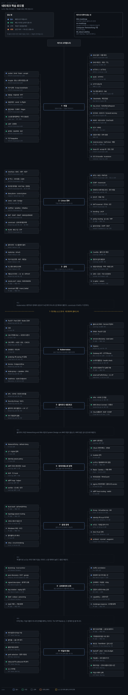
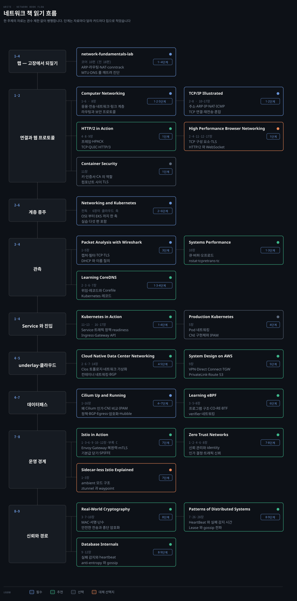

# 네트워크 학습 로드맵
---

> socket과 TCP에서 시작해 Linux 패킷 경로를 확인한 뒤 Kubernetes 데이터패스와 네트워크 운영으로 올라갑니다.

## 학습 순서

> 프로토콜, Linux 구현, Kubernetes 추상화를 순서대로 연결합니다. 같은 단계에서도 문서가 달라지면 행을 나눴습니다.

| 단계 | 우선순위 | 주제 | 키워드 | 학습 문서 | 완료 기준 |
|---|:---:|---|---|---|---|
| 1. 연결 | 필수 | 선수지식 · 응용·전송 계층 | DNS resolver·HTTP·TLS TCP/UDP·handshake congestion control | [Computer Networking](../02_os/book/cntd_computer-networking-top-down/README.md) | 연결 실패를 이름 해석, 연결 수립, 전송, 애플리케이션 응답으로 나눕니다. |
| 1. 연결 | 필수 | 핵심·진단 · socket·큐·포트 | socket·file descriptor `bind/listen/accept/connect` listen/accept queue·TCP state ephemeral port | [Systems Performance](../02_os/book/systems-performance/README.md) · [OS 로드맵](os-roadmap.md) | 연결 거부와 timeout을 socket 상태, 큐, 포트 고갈에서 구분합니다. |
| 2. Linux 경로 | 필수 | 선수지식 · interface·라우팅 | interface·MAC·ARP/neighbor IPv4/IPv6·subnet·CIDR routing table | [네트워킹 기초](../02_os/networking/01-01.%EB%84%A4%ED%8A%B8%EC%9B%8C%ED%82%B9%20%EA%B8%B0%EC%B4%88.md) · [서브네팅과 CIDR](../02_os/networking/01-04.%EC%84%9C%EB%B8%8C%EB%84%A4%ED%8C%85%EA%B3%BC%20CIDR%20%E2%80%94%20%EC%A3%BC%EC%86%8C%20%EA%B3%B5%EA%B0%84%EC%9D%84%20%EC%9E%90%EB%A5%B4%EB%8A%94%20%EB%B2%95.md) | 목적지 IP가 어떤 interface와 next hop으로 나가는지 계산합니다. |
| 2. Linux 경로 | 필수 | 핵심 · namespace·veth·bridge | network namespace·veth Linux bridge·FDB Pod namespace | [네트워킹 기초](../02_os/networking/01-01.%EB%84%A4%ED%8A%B8%EC%9B%8C%ED%82%B9%20%EA%B8%B0%EC%B4%88.md) · [K8s 패킷 여정](../02_os/networking/01-02.K8s%20%ED%8C%A8%ED%82%B7%20%EC%97%AC%EC%A0%95%20%E2%80%94%20netfilter%C2%B7conntrack%C2%B7%EB%9D%BC%EC%9A%B0%ED%8C%85.md) | 출발 namespace에서 호스트와 다른 namespace까지 패킷 경로를 그립니다. |
| 2. Linux 경로 | 필수 | 실습·진단 · netfilter·NAT | hook·iptables/nftables SNAT·DNAT·MASQUERADE conntrack·MTU/MSS | [K8s 패킷 여정](../02_os/networking/01-02.K8s%20%ED%8C%A8%ED%82%B7%20%EC%97%AC%EC%A0%95%20%E2%80%94%20netfilter%C2%B7conntrack%C2%B7%EB%9D%BC%EC%9A%B0%ED%8C%85.md) | NAT 전후 주소와 통과한 hook을 순서대로 설명합니다. |
| 3. 관측 | 필수 | 실습·진단 · 패킷 캡처 | `ss`·`ip`·`tcpdump`·Wireshark SYN/ACK/RST/FIN·retransmission TLS ClientHello | [Packet Analysis with Wireshark](../02_os/book/paw_packet-analysis-wireshark/README.md) | 캡처 위치에 따라 보이는 주소가 달라지는 이유를 말하고 손실 지점을 찾습니다. |
| 3. 관측 | 필수 | 실습·진단 · DNS 장애 | `resolv.conf`·search domain·`ndots` NXDOMAIN·DoH CoreDNS | [DNS 필터링 차단](../02_os/networking/01-03.DNS%20%ED%95%84%ED%84%B0%EB%A7%81%20%EC%B0%A8%EB%8B%A8%20%E2%80%94%20NXDOMAIN%C2%B7DoH%C2%B7%EC%9A%B0%ED%9A%8C%20%EB%A7%88%EC%B0%B0.md) · [Learning CoreDNS](../08_cloud/book/learning-coredns/README.md) | 클라이언트 resolver와 DNS 서버 중 실패한 층을 구분합니다. |
| 4. Kubernetes | 필수 | 핵심 · Pod 네트워크 | Pod CIDR·CNI·pause container overlay·VXLAN·native routing BGP·ECMP | [Pod 네트워크와 Linux 기반](../08_cloud/kubernetes/04_networking/04-02.Pod%20%EB%84%A4%ED%8A%B8%EC%9B%8C%ED%81%AC%EC%99%80%20Linux%20%EA%B8%B0%EB%B0%98.md) · [오버레이와 노드 간 트래픽](../08_cloud/kubernetes/04_networking/04-03.%EC%98%A4%EB%B2%84%EB%A0%88%EC%9D%B4%EC%99%80%20%EB%85%B8%EB%93%9C%20%EA%B0%84%20%ED%8A%B8%EB%9E%98%ED%94%BD.md) | 같은 노드와 다른 노드의 Pod 간 경로를 각각 설명합니다. |
| 4. Kubernetes | 필수 | 핵심·진단 · Service·EndpointSlice | ClusterIP·NodePort·LoadBalancer kube-proxy·EndpointSlice·readiness | [Service와 EndpointSlice](../08_cloud/kubernetes/04_networking/04-04.Service%EC%99%80%20EndpointSlice.md) | Service 연결 실패를 selector, endpoint, 데이터패스 문제로 나눕니다. |
| 4. Kubernetes | 필수 | 실습 · DNS·외부 진입 | CoreDNS·Service FQDN Ingress·IngressClass·Gateway HTTPRoute·TLS | [DNS와 CoreDNS](../08_cloud/kubernetes/04_networking/04-05.DNS%EC%99%80%20CoreDNS.md) · [Ingress와 Gateway API](../08_cloud/kubernetes/04_networking/04-06.Ingress%EC%99%80%20Gateway%20API.md) | 이름 해석부터 외부 요청이 backend Pod에 도달하는 경로를 잇습니다. |
| 5. 데이터패스·정책 | 추천 | 핵심 · eBPF·Cilium | eBPF map·verifier XDP/TC/socket hook kube-proxy replacement·Cilium·Hubble | [네트워킹 기초](../02_os/networking/01-01.%EB%84%A4%ED%8A%B8%EC%9B%8C%ED%82%B9%20%EA%B8%B0%EC%B4%88.md) · [Kubernetes 네트워크 MOC](../08_cloud/kubernetes/04_networking/README.md) | iptables와 eBPF 데이터패스가 서비스를 처리하는 지점을 비교합니다. |
| 5. 데이터패스·정책 | 추천 | 실습·진단 · NetworkPolicy | ingress·egress pod/namespace selector·ipBlock default deny·L3~L7/FQDN policy | [NetworkPolicy](../08_cloud/kubernetes/04_networking/04-07.NetworkPolicy.md) | 정책 선언이 실제로 집행되는 hook과 허용 집합을 설명합니다. |
| 6. 운영 | 추천 | 실습·진단 · 주소·토폴로지 | dual-stack·`ipFamilyPolicy` topology-aware routing EndpointSlice hint | [IPv4와 IPv6 이중 스택](../08_cloud/kubernetes/04_networking/04-08.IPv4%EC%99%80%20IPv6%20%EC%9D%B4%EC%A4%91%20%EC%8A%A4%ED%83%9D.md) · [토폴로지 인지 라우팅](../08_cloud/kubernetes/04_networking/04-09.%ED%86%A0%ED%8F%B4%EB%A1%9C%EC%A7%80%20%EC%9D%B8%EC%A7%80%20%EB%9D%BC%EC%9A%B0%ED%8C%85.md) | 특정 IP family나 zone에서만 실패하는 조건을 찾습니다. |
| 6. 운영 | 추천 | 실습·진단 · 혼합 OS·서비스 메시 | Windows HNS/HCS·Windows CNI service mesh·sidecar·mTLS Zero Trust | [Windows 네트워킹](../08_cloud/kubernetes/04_networking/04-10.Windows%20%EB%84%A4%ED%8A%B8%EC%9B%8C%ED%82%B9.md) · [Istio in Action](../08_cloud/book/istio-in-action/README.md) | OS별 데이터패스 차이와 L4·L7 정책 경계를 구분합니다. |

Kubernetes 오브젝트의 배포와 운영 순서는 [Kubernetes 로드맵](k8s-roadmap.md)에서 이어갑니다.

## 책 읽기 흐름

> 단계 표에 연결된 책을 처음 읽는 시점과 집중할 범위를 표시합니다.

