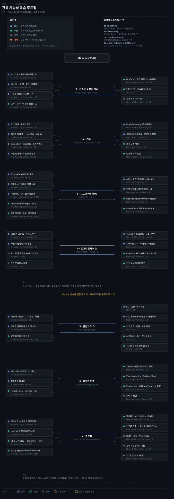
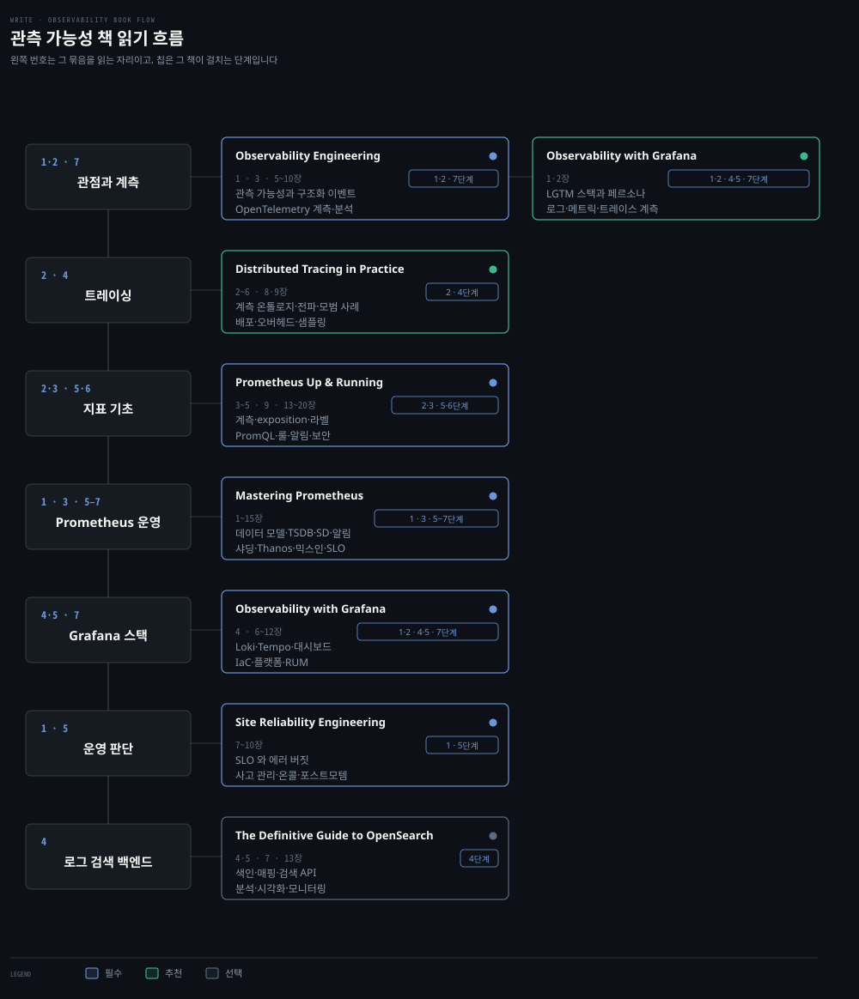

# 관측 가능성 학습 로드맵
---

> 무엇을 모르는지 물을 수 있는가에서 시작해 계측·지표·로그·트레이스를 지나 알림과 SLO, 확장과 플랫폼으로 갑니다. 개념이 주인공이고 책은 그 개념을 다루는 자리입니다.

## 학습 순서

> 단계마다 배우는 개념을 묶음으로 갈랐습니다. 자료 위치는 아래 단계별 표가 짚습니다.

| 단계 | 묶음 | 배우는 개념 |
|---|---|---|
| 1 · 관측 가능성의 자리 | 관점 | 모니터링과 관측 가능성의 차이 · 세 신호 — 지표 · 로그 · 트레이스 · 질문 중심 사고 |
| 1 · 관측 가능성의 자리 | 기본 단위 | 구조화 이벤트 · 임의로 넓은 이벤트 · 고카디널리티 · 카디널리티 폭발 |
| 1 · 관측 가능성의 자리 | 도구 지형 | Grafana 스택 · LGTM · 페르소나 · SRE 가 보는 관측과 모니터링 · Metrics Server 와 시계열 DB 의 갈림 |
| 2 · 계측 | 로그 | 구조화 필드 · `timestamp` · `severity` · `trace_id` · `request_id` · 민감정보 제거 |
| 2 · 계측 | 지표 | counter · gauge · histogram · summary · exposition · exporter · 클라이언트 라이브러리 |
| 2 · 계측 | 라벨 | 라벨 설계 · 카디널리티 한계 · Pod UID 같은 무제한 값 · bucket 경계 |
| 2 · 계측 | 트레이스 | OpenTelemetry · span · 컨텍스트 전파 · W3C Trace Context · 계측 모범 사례 |
| 3 · 지표와 PromQL | 저장 | Prometheus 데이터 모델 · TSDB 쓰기 경로 · 블록 · WAL · 압축 |
| 3 · 지표와 PromQL | 질의 | PromQL 기초 · 집계 연산자 · 이항 연산자 · 함수 · 레코딩 룰 |
| 3 · 지표와 PromQL | 수집 | 서비스 디스커버리 · relabeling · scrape 설정 · Node Exporter · kube-state-metrics |
| 3 · 지표와 PromQL | 배포 | Prometheus Operator · ServiceMonitor · PodMonitor |
| 4 · 로그와 트레이스 | 로그 질의 | Loki · LogQL · 파이프라인 · 메트릭 쿼리 · 라벨과 검색 빈도의 균형 |
| 4 · 로그와 트레이스 | 트레이스 질의 | Tempo · TraceQL · 구조 연산자 · 전파 헤더 |
| 4 · 로그와 트레이스 | 잇기 | exemplar · 지표에서 트레이스로 · trace 에서 로그로 · tail sampling |
| 4 · 로그와 트레이스 | 비용 | 오버헤드 · 샘플링 전략 · 보존 기간 · 검색 백엔드의 색인과 매핑 |
| 5 · 알림과 SLO | 알림 | Alertmanager · 라우팅 · 그룹핑 · 억제 · 침묵 · HA · 룰 단위 테스트 · 알림 피로 |
| 5 · 알림과 SLO | 목표 | SLI · SLO · 에러 버짓 · 요청 기반과 윈도우 기반 · burn rate |
| 5 · 알림과 SLO | 사고 | 사고 관리 · 온콜 · 지휘 체계 · 포스트모템 · 사고에서 배우기 |
| 6 · 확장과 운영 | 규모 | 샤딩 · 페더레이션 · 고가용성 · 최적화 · 디버깅 |
| 6 · 확장과 운영 | 장기 저장 | remote write · remote read · Thanos · VictoriaMetrics · Grafana Mimir |
| 6 · 확장과 운영 | 통합 | Prometheus 와 OpenTelemetry · OTLP 수신구 · 서버 측 보안 |
| 7 · 플랫폼 | 표현 | 대시보드 목적 정의 · 시각화 선택 · 인지 부하 줄이기 |
| 7 · 플랫폼 | 코드화 | Jsonnet · 모니터링 믹스인 · promtool · amtool · Pint · Helm · Terraform |
| 7 · 플랫폼 | 조직 | 플랫폼 데이터 아키텍처 · 수집 참조 구조 · RBAC · 멀티테넌시 |
| 7 · 플랫폼 | 확장 축 | 인프라 관측 · 클라우드 3사 연결 · RUM · Faro · Web Vitals · 관측 가능성 주도 개발 |

## 책 읽기 흐름

> 위 단계를 무엇으로 배우는가입니다. 정독 노트 50편과 소장 책 여섯 권, 공식 문서로 한정했습니다.

같은 책이 여러 단계에 나뉘어 걸리므로 행이 단계가 아니라 책의 역할로 묶입니다.

| 책 | 읽을 장 | 우선순위 | 자리 |
|---|---|:---:|---|
| [Mastering Prometheus](../06_observability/book/mastering_prometheus/README.md) | 1~15장 | 필수 | 1 · 3 · 5~7단계 |
| Prometheus Up & Running | 3~5 · 9 · 13~20장 | 필수 | 2·3 · 5·6단계 |
| [Observability with Grafana](../06_observability/book/observability_with_grafana/README.md) | 1·2 · 4 · 6~12장 | 필수 | 1·2 · 4 · 7단계 |
| Observability Engineering | 1 · 3 · 5~10장 | 필수 | 1·2 · 7단계 |
| Site Reliability Engineering | 7~10장 | 필수 | 1 · 5단계 |
| Distributed Tracing in Practice | 2~6 · 8·9장 | 추천 | 2 · 4단계 |
| [The Definitive Guide to OpenSearch](../06_observability/book/dgos_opensearch/README.md) | 4·5 · 7 · 13장 | 선택 | 4단계 |

공식 문서는 책과 같은 무게로 씁니다. [Prometheus 문서](https://prometheus.io/docs/)가 3·5·6단계, [Grafana 문서](https://grafana.com/docs/)가 4·7단계, [OpenTelemetry Concepts](https://opentelemetry.io/docs/concepts/)와 [Collector](https://opentelemetry.io/docs/collector/)가 2단계, [Google SRE Books](https://sre.google/books/)가 5단계의 빈칸을 메웁니다.

## 신호를 만들고 읽기 · 1~4단계

> 무엇을 내보내고 어떻게 묻는가입니다. 여기까지가 도구를 다루는 구간입니다.

### 1단계 · 관측 가능성의 자리

| 개념 | 우선순위 | 노트 | 책 |
|---|:---:|---|---|
| 모니터링과 관측 가능성의 차이 | 필수 | [01-01](../06_observability/book/mastering_prometheus/01-01.%EA%B4%80%EC%B8%A1%20%EA%B0%80%EB%8A%A5%EC%84%B1%C2%B7%EB%AA%A8%EB%8B%88%ED%84%B0%EB%A7%81%C2%B7Prometheus%EC%9D%98%20%EC%9E%90%EB%A6%AC.md) | Observability Engineering 1장 |
| 세 신호 — 지표 · 로그 · 트레이스 | 필수 | [15-01](../06_observability/book/mastering_prometheus/15-01.Prometheus%20%EB%84%88%EB%A8%B8%20%E2%80%94%20%EC%84%B8%20%EC%8B%A0%ED%98%B8%EB%A5%BC%20%EC%9E%87%EB%8A%94%20%EA%B4%80%EC%B8%A1%20%EA%B0%80%EB%8A%A5%EC%84%B1%EA%B3%BC%20exemplar.md) | Mastering Prometheus 1·15장 |
| 구조화 이벤트가 기본 단위 | 필수 | | Observability Engineering 5·6장 |
| 고카디널리티와 질문 중심 사고 | 추천 | | Observability Engineering 8장 |
| Grafana 스택과 페르소나 · LGTM | 추천 | [01-01](../06_observability/book/observability_with_grafana/01-01.%EA%B4%80%EC%B8%A1%20%EA%B0%80%EB%8A%A5%EC%84%B1%EA%B3%BC%20Grafana%20%EC%8A%A4%ED%83%9D%20%E2%80%94%20%ED%8C%8C%EB%82%98%EB%A7%88%20%EC%9A%B4%ED%95%98%C2%B7%ED%8E%98%EB%A5%B4%EC%86%8C%EB%82%98%C2%B7LGTM.md) | Observability with Grafana 1장 |
| Metrics Server 와 시계열 DB 의 갈림 | 추천 | | |
| SRE 가 보는 관측과 모니터링 | 추천 | | Site Reliability Engineering 8장 |
| 관측 가능성의 기원 | 선택 | | Observability Engineering 3장 |
| 용어를 먼저 고정하기 | 추천 | [00-01](../06_observability/book/mastering_prometheus/00-01.%EC%9A%A9%EC%96%B4%EC%A7%91.md) | |

### 2단계 · 계측

| 개념 | 우선순위 | 노트 | 책 |
|---|:---:|---|---|
| 로그 형식 · 구조화 필드 · 민감정보 제거 | 필수 | [02-01](../06_observability/book/observability_with_grafana/02-01.%EA%B3%84%EC%B8%A1%20%E2%80%94%20%EB%A1%9C%EA%B7%B8%20%ED%98%95%EC%8B%9D%C2%B7%EB%A9%94%ED%8A%B8%EB%A6%AD%20%ED%83%80%EC%9E%85%C2%B7%ED%8A%B8%EB%A0%88%EC%9D%B4%EC%8B%B1%20%ED%94%84%EB%A1%9C%ED%86%A0%EC%BD%9C%C2%B7%EC%9D%B8%ED%94%84%EB%9D%BC%20%ED%91%9C%EC%A4%80.md) | Observability with Grafana 2장 |
| counter · gauge · histogram · summary | 필수 | [03-01](../06_observability/book/mastering_prometheus/03-01.%EB%8D%B0%EC%9D%B4%ED%84%B0%20%EB%AA%A8%EB%8D%B8.md) | Prometheus Up & Running 3장 |
| exposition · exporter · 클라이언트 라이브러리 | 필수 | | Prometheus Up & Running 4장 |
| 라벨 설계와 카디널리티 한계 | 필수 | [03-01](../06_observability/book/mastering_prometheus/03-01.%EB%8D%B0%EC%9D%B4%ED%84%B0%20%EB%AA%A8%EB%8D%B8.md) | Prometheus Up & Running 5장 |
| OpenTelemetry 로 계측하기 | 필수 | [14-01](../06_observability/book/mastering_prometheus/14-01.Prometheus%20%EC%99%80%20OpenTelemetry%20%ED%86%B5%ED%95%A9%20%E2%80%94%20%EA%B7%9C%EA%B2%A9%C2%B7Collector%C2%B7OTLP%20%EC%88%98%EC%8B%A0%EA%B5%AC.md) | Observability Engineering 7장 |
| 트레이싱 프로토콜 · 컨텍스트 전파 | 필수 | [02-01](../06_observability/book/observability_with_grafana/02-01.%EA%B3%84%EC%B8%A1%20%E2%80%94%20%EB%A1%9C%EA%B7%B8%20%ED%98%95%EC%8B%9D%C2%B7%EB%A9%94%ED%8A%B8%EB%A6%AD%20%ED%83%80%EC%9E%85%C2%B7%ED%8A%B8%EB%A0%88%EC%9D%B4%EC%8B%B1%20%ED%94%84%EB%A1%9C%ED%86%A0%EC%BD%9C%C2%B7%EC%9D%B8%ED%94%84%EB%9D%BC%20%ED%91%9C%EC%A4%80.md) | Distributed Tracing 2·3장 |
| 계측 모범 사례 | 추천 | | Distributed Tracing 4장 |
| 인프라 계측 표준 | 추천 | [02-01](../06_observability/book/observability_with_grafana/02-01.%EA%B3%84%EC%B8%A1%20%E2%80%94%20%EB%A1%9C%EA%B7%B8%20%ED%98%95%EC%8B%9D%C2%B7%EB%A9%94%ED%8A%B8%EB%A6%AD%20%ED%83%80%EC%9E%85%C2%B7%ED%8A%B8%EB%A0%88%EC%9D%B4%EC%8B%B1%20%ED%94%84%EB%A1%9C%ED%86%A0%EC%BD%9C%C2%B7%EC%9D%B8%ED%94%84%EB%9D%BC%20%ED%91%9C%EC%A4%80.md) | Observability with Grafana 2장 |
| 학습 환경 세우기 — OTel 데모 | 선택 | [03-01](../06_observability/book/observability_with_grafana/03-01.%ED%95%99%EC%8A%B5%20%ED%99%98%EA%B2%BD%20%E2%80%94%20Grafana%20Cloud%C2%B7OTel%20%EB%8D%B0%EB%AA%A8%C2%B7%EC%9E%90%EA%B2%A9%EC%A6%9D%EB%AA%85%EA%B3%BC%20%ED%8A%B8%EB%9F%AC%EB%B8%94%EC%8A%88%ED%8C%85.md) | Observability with Grafana 3장 |

### 3단계 · 지표와 PromQL

| 개념 | 우선순위 | 노트 | 책 |
|---|:---:|---|---|
| Prometheus 데이터 모델 | 필수 | [03-01](../06_observability/book/mastering_prometheus/03-01.%EB%8D%B0%EC%9D%B4%ED%84%B0%20%EB%AA%A8%EB%8D%B8.md) | Mastering Prometheus 3장 |
| TSDB 쓰기 경로 | 필수 | [03-02](../06_observability/book/mastering_prometheus/03-02.TSDB%20%EC%93%B0%EA%B8%B0%20%EA%B2%BD%EB%A1%9C.md) | Mastering Prometheus 3장 |
| TSDB 저장 구조 — 블록 · WAL · 압축 | 필수 | [03-03](../06_observability/book/mastering_prometheus/03-03.TSDB%20%EC%A0%80%EC%9E%A5%20%EA%B5%AC%EC%A1%B0.md) | Mastering Prometheus 3장 |
| PromQL 기초 | 필수 | [03-04](../06_observability/book/mastering_prometheus/03-04.PromQL%20%EA%B8%B0%EC%B4%88.md) | Prometheus Up & Running 13장 |
| 집계 연산자 · 이항 연산자 · 함수 | 필수 | | Prometheus Up & Running 14~16장 |
| 레코딩 룰 | 추천 | | Prometheus Up & Running 17장 |
| 서비스 디스커버리와 relabeling | 필수 | [04-01](../06_observability/book/mastering_prometheus/04-01.%EC%84%9C%EB%B9%84%EC%8A%A4%20%EB%94%94%EC%8A%A4%EC%BB%A4%EB%B2%84%EB%A6%AC%EC%99%80%20relabeling.md) | Mastering Prometheus 4장 |
| 컨테이너와 Kubernetes 지표 | 필수 | [k8s 로드맵](k8s-roadmap.md) | Prometheus Up & Running 9장 |
| Node Exporter 해부와 collector | 추천 | [08-01](../06_observability/book/mastering_prometheus/08-01.Node%20Exporter%20%E2%80%94%20exporter%20%EC%9D%98%20%ED%95%B4%EB%B6%80%EC%99%80%20collector.md) | Mastering Prometheus 8장 |
| Prometheus 배포와 Operator | 추천 | [02-01](../06_observability/book/mastering_prometheus/02-01.Prometheus%20%EB%B0%B0%ED%8F%AC%20%E2%80%94%20%EC%8A%A4%ED%83%9D%20%EA%B5%AC%EC%84%B1%EC%9A%94%EC%86%8C%EC%99%80%20Operator.md) | Mastering Prometheus 2장 |

### 4단계 · 로그와 트레이스

| 개념 | 우선순위 | 노트 | 책 |
|---|:---:|---|---|
| Loki 와 LogQL · 파이프라인 · 메트릭 쿼리 | 필수 | [04-01](../06_observability/book/observability_with_grafana/04-01.Loki%20%EC%99%80%20LogQL%20%E2%80%94%20%ED%8C%8C%EC%9D%B4%ED%94%84%EB%9D%BC%EC%9D%B8%C2%B7%EB%A9%94%ED%8A%B8%EB%A6%AD%20%EC%BF%BC%EB%A6%AC%C2%B7%EC%95%84%ED%82%A4%ED%85%8D%EC%B2%98.md) | Observability with Grafana 4장 |
| 라벨과 검색 빈도의 균형 | 필수 | [04-01](../06_observability/book/observability_with_grafana/04-01.Loki%20%EC%99%80%20LogQL%20%E2%80%94%20%ED%8C%8C%EC%9D%B4%ED%94%84%EB%9D%BC%EC%9D%B8%C2%B7%EB%A9%94%ED%8A%B8%EB%A6%AD%20%EC%BF%BC%EB%A6%AC%C2%B7%EC%95%84%ED%82%A4%ED%85%8D%EC%B2%98.md) | Observability with Grafana 4장 |
| Tempo 와 TraceQL · 구조 연산자 | 필수 | [06-01](../06_observability/book/observability_with_grafana/06-01.Tempo%20%EC%99%80%20TraceQL%20%E2%80%94%20%EA%B5%AC%EC%A1%B0%20%EC%97%B0%EC%82%B0%EC%9E%90%C2%B7%EC%A0%84%ED%8C%8C%20%ED%97%A4%EB%8D%94%C2%B7%EC%95%84%ED%82%A4%ED%85%8D%EC%B2%98.md) | Observability with Grafana 6장 |
| 지표 수집 프로토콜과 저장 아키텍처 | 추천 | [05-01](../06_observability/book/observability_with_grafana/05-01.%EB%A9%94%ED%8A%B8%EB%A6%AD%20%E2%80%94%20%EC%88%98%EC%A7%91%20%ED%94%84%EB%A1%9C%ED%86%A0%EC%BD%9C%C2%B7%EC%A0%80%EC%9E%A5%20%EC%95%84%ED%82%A4%ED%85%8D%EC%B2%98%C2%B7exemplar.md) | Observability with Grafana 5장 |
| exemplar — 지표에서 트레이스로 | 추천 | [15-01](../06_observability/book/mastering_prometheus/15-01.Prometheus%20%EB%84%88%EB%A8%B8%20%E2%80%94%20%EC%84%B8%20%EC%8B%A0%ED%98%B8%EB%A5%BC%20%EC%9E%87%EB%8A%94%20%EA%B4%80%EC%B8%A1%20%EA%B0%80%EB%8A%A5%EC%84%B1%EA%B3%BC%20exemplar.md) | Mastering Prometheus 15장 |
| 트레이싱 배포 · 오버헤드 · 샘플링 | 필수 | | Distributed Tracing 5·6장 |
| 기준 성능 개선과 복구 | 추천 | | Distributed Tracing 8·9장 |
| 로그 검색 백엔드 — 색인 · 매핑 · 애널라이저 | 선택 | [04-01](../06_observability/book/dgos_opensearch/04-01.%EB%8D%B0%EC%9D%B4%ED%84%B0%20%EC%83%89%EC%9D%B8%20%E2%80%94%20%EC%9D%B8%EB%8D%B1%EC%8A%A4%C2%B7%EB%A7%A4%ED%95%91%C2%B7%EC%95%A0%EB%84%90%EB%9D%BC%EC%9D%B4%EC%A0%80.md) · [05-01](../06_observability/book/dgos_opensearch/05-01.%EA%B2%80%EC%83%89%20%ED%95%B5%EC%8B%AC%20API%20%E2%80%94%20%EC%BF%BC%EB%A6%AC%20%EC%B2%98%EB%A6%AC%EC%99%80%20leaf%20%EC%BF%BC%EB%A6%AC.md) | OpenSearch 4·5장 |
| 로그 분석과 시각화 · 집계 | 선택 | [07-01](../06_observability/book/dgos_opensearch/07-01.%EB%B6%84%EC%84%9D%EA%B3%BC%20%EC%8B%9C%EA%B0%81%ED%99%94%20%E2%80%94%20%EC%A7%91%EA%B3%84%C2%B7%EB%8C%80%EC%8B%9C%EB%B3%B4%EB%93%9C%C2%B7%EA%B4%80%EC%B8%A1%EC%84%B1.md) | OpenSearch 7장 |
| 검색 백엔드 운영 — 지표 · 백업 · DR | 선택 | [13-01](../06_observability/book/dgos_opensearch/13-01.%EB%AA%A8%EB%8B%88%ED%84%B0%EB%A7%81%C2%B7%EB%B0%B1%EC%97%85%C2%B7%EB%B3%B5%EA%B5%AC%20%E2%80%94%20%EC%A7%80%ED%91%9C%C2%B7admission%20control%C2%B7DR.md) | OpenSearch 13장 |

## 운영으로 잇기 · 5~7단계

> 신호를 사람의 판단과 조직의 도구로 바꾸는 구간입니다.

### 5단계 · 알림과 SLO

| 개념 | 우선순위 | 노트 | 책 |
|---|:---:|---|---|
| Alertmanager — 라우팅 · 그룹핑 · 억제 · HA | 필수 | [05-01](../06_observability/book/mastering_prometheus/05-01.Alertmanager%20%E2%80%94%20%EB%9D%BC%EC%9A%B0%ED%8C%85%C2%B7%EA%B7%B8%EB%A3%B9%ED%95%91%C2%B7%EC%96%B5%EC%A0%9C%C2%B7HA.md) | Mastering Prometheus 5장 |
| 견고한 알림과 룰 단위 테스트 | 필수 | [05-02](../06_observability/book/mastering_prometheus/05-02.%EA%B2%AC%EA%B3%A0%ED%95%9C%20%EC%95%8C%EB%A6%BC%EA%B3%BC%20%EB%A3%B0%20%EB%8B%A8%EC%9C%84%20%ED%85%8C%EC%8A%A4%ED%8A%B8.md) | Mastering Prometheus 5장 |
| 알림 피로 · 침묵 규칙 | 추천 | | Prometheus Up & Running 18·19장 |
| SLI · SLO · 에러 버짓 | 필수 | | Site Reliability Engineering 7장 |
| SLO 를 Prometheus 로 정의하기 · burn rate | 필수 | [13-01](../06_observability/book/mastering_prometheus/13-01.SLO%20%EB%A5%BC%20Prometheus%20%EB%A1%9C%20%EC%A0%95%EC%9D%98%ED%95%98%EA%B3%A0%20%EC%95%8C%EB%A6%BC%ED%95%98%EA%B8%B0%20%E2%80%94%20%EC%9A%94%EC%B2%AD%C2%B7%EC%9C%88%EB%8F%84%EC%9A%B0%20%EA%B8%B0%EB%B0%98%EA%B3%BC%20Sloth%C2%B7Pyrra.md) | Mastering Prometheus 13장 |
| 사고 관리 · 온콜 · 지휘 체계 | 추천 | [09-01](../06_observability/book/observability_with_grafana/09-01.%EC%82%AC%EA%B3%A0%20%EA%B4%80%EB%A6%AC%20%E2%80%94%20%EA%B8%88%EC%9D%80%EB%8F%99%20%EC%A7%80%ED%9C%98%C2%B7SLI%20%EC%95%8C%EB%A6%BC%C2%B7IRM%20%EB%8F%84%EA%B5%AC%20%EC%85%8B.md) | Site Reliability Engineering 9장 |
| 사고에서 배우기 · 포스트모템 | 추천 | | Site Reliability Engineering 10장 |
| SLO 기반 신뢰성 | 추천 | | Observability Engineering 11장 |

### 6단계 · 확장과 운영

| 개념 | 우선순위 | 노트 | 책 |
|---|:---:|---|---|
| 샤딩 · 페더레이션 · 고가용성 | 필수 | [06-01](../06_observability/book/mastering_prometheus/06-01.%EC%83%A4%EB%94%A9%C2%B7%ED%8E%98%EB%8D%94%EB%A0%88%EC%9D%B4%EC%85%98%C2%B7%EA%B3%A0%EA%B0%80%EC%9A%A9%EC%84%B1.md) | Mastering Prometheus 6장 |
| 최적화와 디버깅 | 필수 | [07-01](../06_observability/book/mastering_prometheus/07-01.%EC%B5%9C%EC%A0%81%ED%99%94%EC%99%80%20%EB%94%94%EB%B2%84%EA%B9%85.md) | Mastering Prometheus 7장 |
| remote write · remote read · 에이전트 | 추천 | [09-01](../06_observability/book/mastering_prometheus/09-01.remote%20write%20%EC%99%80%20remote%20read%20%E2%80%94%20%ED%94%84%EB%A1%9C%ED%86%A0%EC%BD%9C%C2%B7%EC%97%90%EC%9D%B4%EC%A0%84%ED%8A%B8%C2%B7%ED%8A%9C%EB%8B%9D.md) | Mastering Prometheus 9장 |
| Thanos 저장 경로 — Sidecar · Compactor · Store | 추천 | [10-01](../06_observability/book/mastering_prometheus/10-01.Thanos%20%EC%A0%80%EC%9E%A5%20%EA%B2%BD%EB%A1%9C%20%E2%80%94%20Sidecar%C2%B7Compactor%C2%B7Store.md) | Mastering Prometheus 10장 |
| Thanos 쿼리 경로 — Query · Ruler · Receiver | 추천 | [10-02](../06_observability/book/mastering_prometheus/10-02.Thanos%20%EC%BF%BC%EB%A6%AC%20%EA%B2%BD%EB%A1%9C%20%E2%80%94%20Query%C2%B7Query%20Frontend%C2%B7Ruler%C2%B7Receiver.md) | Mastering Prometheus 10장 |
| VictoriaMetrics · Grafana Mimir | 추천 | [09-02](../06_observability/book/mastering_prometheus/09-02.VictoriaMetrics%20%EC%99%80%20Grafana%20Mimir.md) | Mastering Prometheus 9장 |
| Prometheus 와 OpenTelemetry 통합 · OTLP 수신구 | 추천 | [14-01](../06_observability/book/mastering_prometheus/14-01.Prometheus%20%EC%99%80%20OpenTelemetry%20%ED%86%B5%ED%95%A9%20%E2%80%94%20%EA%B7%9C%EA%B2%A9%C2%B7Collector%C2%B7OTLP%20%EC%88%98%EC%8B%A0%EA%B5%AC.md) | Mastering Prometheus 14장 |
| 서버 측 보안 | 선택 | | Prometheus Up & Running 20장 |

### 7단계 · 플랫폼

| 개념 | 우선순위 | 노트 | 책 |
|---|:---:|---|---|
| 대시보드 — 목적 정의 · 시각화 선택 · 인지 부하 | 필수 | [08-01](../06_observability/book/observability_with_grafana/08-01.%EB%8C%80%EC%8B%9C%EB%B3%B4%EB%93%9C%20%E2%80%94%20%EB%AA%A9%EC%A0%81%20%EC%A0%95%EC%9D%98%C2%B7%EC%8B%9C%EA%B0%81%ED%99%94%20%EC%84%A0%ED%83%9D%C2%B7%EC%9D%B8%EC%A7%80%20%EB%B6%80%ED%95%98%20%EC%A4%84%EC%9D%B4%EA%B8%B0.md) | Observability with Grafana 8장 |
| Jsonnet — YAML 을 손으로 쓰지 않기 | 추천 | [11-01](../06_observability/book/mastering_prometheus/11-01.Jsonnet%20%E2%80%94%20YAML%20%EC%9D%84%20%EC%86%90%EC%9C%BC%EB%A1%9C%20%EC%93%B0%EC%A7%80%20%EC%95%8A%EA%B8%B0%20%EC%9C%84%ED%95%9C%20%EC%96%B8%EC%96%B4.md) | Mastering Prometheus 11장 |
| 모니터링 믹스인 — 규칙과 대시보드를 패키지로 | 추천 | [11-02](../06_observability/book/mastering_prometheus/11-02.%EB%AA%A8%EB%8B%88%ED%84%B0%EB%A7%81%20%EB%AF%B9%EC%8A%A4%EC%9D%B8%20%E2%80%94%20%EA%B7%9C%EC%B9%99%EA%B3%BC%20%EB%8C%80%EC%8B%9C%EB%B3%B4%EB%93%9C%EB%A5%BC%20%ED%8C%A8%ED%82%A4%EC%A7%80%EB%A1%9C.md) | Mastering Prometheus 11장 |
| CI 로 규칙 검증 — promtool · amtool · Pint | 추천 | [12-01](../06_observability/book/mastering_prometheus/12-01.CI%20%ED%8C%8C%EC%9D%B4%ED%94%84%EB%9D%BC%EC%9D%B8%EC%9C%BC%EB%A1%9C%20Prometheus%20%EA%B2%80%EC%A6%9D%20%E2%80%94%20promtool%C2%B7amtool%C2%B7Pint.md) | Mastering Prometheus 12장 |
| 코드형 인프라 — 네 층 분할 · Helm · Terraform | 추천 | [10-01](../06_observability/book/observability_with_grafana/10-01.%EC%BD%94%EB%93%9C%ED%98%95%20%EC%9D%B8%ED%94%84%EB%9D%BC%20%E2%80%94%20%EB%84%A4%20%EC%B8%B5%20%EB%B6%84%ED%95%A0%C2%B7Helm%20%EC%9A%B0%EC%84%A0%EC%88%9C%EC%9C%84%C2%B7Terraform%20%EA%B4%80%EB%A6%AC.md) | Observability with Grafana 10장 |
| 플랫폼 데이터 아키텍처 · 수집 참조 구조 · RBAC | 추천 | [11-01](../06_observability/book/observability_with_grafana/11-01.%ED%94%8C%EB%9E%AB%ED%8F%BC%20%EC%84%A4%EA%B3%84%20%E2%80%94%20%EB%8D%B0%EC%9D%B4%ED%84%B0%20%EC%95%84%ED%82%A4%ED%85%8D%EC%B2%98%C2%B7%EC%88%98%EC%A7%91%20%EC%B0%B8%EC%A1%B0%20%EA%B5%AC%EC%A1%B0%C2%B7RBAC.md) | Observability with Grafana 11장 |
| 인프라 관측 — K8s 수집기와 클라우드 3사 | 추천 | [07-01](../06_observability/book/observability_with_grafana/07-01.%EC%9D%B8%ED%94%84%EB%9D%BC%20%EA%B4%80%EC%B8%A1%20%E2%80%94%20%EC%BF%A0%EB%B2%84%EB%84%A4%ED%8B%B0%EC%8A%A4%20%EC%88%98%EC%A7%91%EA%B8%B0%EC%99%80%20%ED%81%B4%EB%9D%BC%EC%9A%B0%EB%93%9C%203%EC%82%AC%20%EC%97%B0%EA%B2%B0.md) | Observability with Grafana 7장 |
| RUM — Faro SDK · Web Vitals | 선택 | [12-01](../06_observability/book/observability_with_grafana/12-01.RUM%20%E2%80%94%20Faro%20SDK%C2%B7Web%20Vitals%C2%B7%ED%94%84%EB%A1%A0%ED%8A%B8%EC%97%90%EC%84%9C%20%EB%B0%B1%EC%97%94%EB%93%9C%EB%A1%9C.md) | Observability with Grafana 12장 |
| 관측 가능성 주도 개발 | 선택 | | Observability Engineering 9장 |
| AI 에이전트의 자리 | 선택 | | Observability Engineering 10장 |

## 손으로 확인하는 실습

> 노트 안에 실제로 있는 실습 자리만 적습니다. 지어낸 출처를 채우지 않았습니다.

| 출처 | 단계 | 무엇 |
|---|:---:|---|
| [학습 환경 — Grafana Cloud · OTel 데모](../06_observability/book/observability_with_grafana/03-01.%ED%95%99%EC%8A%B5%20%ED%99%98%EA%B2%BD%20%E2%80%94%20Grafana%20Cloud%C2%B7OTel%20%EB%8D%B0%EB%AA%A8%C2%B7%EC%9E%90%EA%B2%A9%EC%A6%9D%EB%AA%85%EA%B3%BC%20%ED%8A%B8%EB%9F%AC%EB%B8%94%EC%8A%88%ED%8C%85.md) | 2 | 계측된 데모 앱을 띄워 세 신호를 한 화면에서 보기 |
| [결정 치트시트](../06_observability/book/mastering_prometheus/00-02.%EA%B2%B0%EC%A0%95%20%EC%B9%98%ED%8A%B8%EC%8B%9C%ED%8A%B8.md) | 3·6 | 상황별로 어떤 설정을 고를지 대조 |
| [서비스 디스커버리와 relabeling](../06_observability/book/mastering_prometheus/04-01.%EC%84%9C%EB%B9%84%EC%8A%A4%20%EB%94%94%EC%8A%A4%EC%BB%A4%EB%B2%84%EB%A6%AC%EC%99%80%20relabeling.md) | 3 | relabel 규칙을 바꿔 가며 대상 목록 변화 확인 |
| [견고한 알림과 룰 단위 테스트](../06_observability/book/mastering_prometheus/05-02.%EA%B2%AC%EA%B3%A0%ED%95%9C%20%EC%95%8C%EB%A6%BC%EA%B3%BC%20%EB%A3%B0%20%EB%8B%A8%EC%9C%84%20%ED%85%8C%EC%8A%A4%ED%8A%B8.md) | 5 | `promtool test rules` 로 알림 규칙을 시험 |
| [CI 파이프라인으로 Prometheus 검증](../06_observability/book/mastering_prometheus/12-01.CI%20%ED%8C%8C%EC%9D%B4%ED%94%84%EB%9D%BC%EC%9D%B8%EC%9C%BC%EB%A1%9C%20Prometheus%20%EA%B2%80%EC%A6%9D%20%E2%80%94%20promtool%C2%B7amtool%C2%B7Pint.md) | 7 | 규칙과 설정을 CI 에서 자동 검증 |
| [_mistakes](../06_observability/book/mastering_prometheus/_mistakes.md) | 전 단계 | 이미 밟은 실수를 다시 밟지 않기 |

**LGTM 스택을 직접 세우는 일은 별도 프로젝트입니다.** `06_observability/02_LGTMStack` 과 `03_Project` 에 그 기록이 있지만, 이 로드맵은 순서를 정하는 문서이므로 그쪽을 자료로 걸지 않습니다. 개념을 잡은 뒤 사례로 읽습니다.

## 로드맵에 넣지 않은 것

> 다른 문서가 정본이거나 이 로드맵의 축과 다른 것들입니다.

| 대상 | 이유 |
|---|---|
| perf · Ftrace · eBPF 의 커널 관측 | [OS 로드맵](os-roadmap.md) 5단계가 맡습니다. 여기는 애플리케이션이 스스로 내보내는 신호입니다 |
| 이벤트 · `kubectl` 로 좁히는 오브젝트 진단 | [Kubernetes 로드맵](k8s-roadmap.md) 7단계가 맡습니다 |
| 패킷 캡처와 Hubble 의 흐름 관측 | [네트워크 로드맵](network-roadmap.md) 3·6단계가 맡습니다 |
| JVM 프로파일과 힙 덤프 | [JVM 로드맵](jvm-roadmap.md) 6·7단계가 맡습니다 |
| `06_observability` 의 프로젝트 노트 | LGTM 스택 구축 기록입니다. 순서를 정하는 근거가 아니라 사례입니다 |
| OpenSearch 의 검색 애플리케이션 축 | 9·10장은 검색 제품을 만드는 쪽입니다. 4단계는 로그 백엔드로만 씁니다 |
| Grafana Pyroscope · k6 | 소장 책에 장은 있지만 정독 노트가 없습니다. 프로파일링과 부하 시험이 필요해질 때 엽니다 |

## 경계

> 이 문서가 정하는 것과 인접 문서에 넘기는 것입니다.

이 문서는 **애플리케이션과 인프라가 스스로 내보내는 신호의 학습 순서**를 정합니다. 바깥에서 들여다보는 관측은 다른 로드맵이 맡습니다.

**자료를 정독 노트와 소장 책과 공식 문서로 한정했습니다.** `06_observability` 아래 자체 프로젝트 노트 스물일곱 편은 LGTM 스택을 세운 기록이라 순서의 근거로 쓰지 않습니다. 개념이 먼저 서고 그 위에서 사례로 읽습니다.

맞닿는 문서가 넷입니다. 커널 관측은 [OS 로드맵](os-roadmap.md)이, 오브젝트 진단은 [Kubernetes 로드맵](k8s-roadmap.md)이, 흐름 관측은 [네트워크 로드맵](network-roadmap.md)이, JVM 내부 관측은 [JVM 로드맵](jvm-roadmap.md)이 맡습니다.

**같은 증상을 다섯 문서가 다른 층에서 봅니다.** 응답이 느려졌을 때 이 문서는 SLO 와 지표 분포를 보고, OS 로드맵은 run queue 를, 네트워크 로드맵은 재전송을, JVM 로드맵은 GC 정지를, Kubernetes 로드맵은 throttling 을 봅니다.
